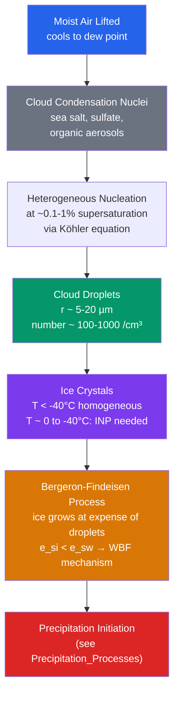

# ☁️ Cloud Formation and Microphysics

> [!abstract] TL;DR
> Clouds form when moist air cools below its **dew point** in the presence of **cloud condensation nuclei (CCN)**. Water droplets almost never nucleate on clean air — that would require an absurd ~400% supersaturation — so instead they nucleate **heterogeneously** on aerosol particles (sea salt, sulfate, organics) at supersaturations of only **0.1–1%**. The **Köhler equation** captures the competition between the **curvature (Kelvin)** effect, which makes small droplets evaporate, and the **solute (Raoult)** effect, which makes them condense; their balance defines a **critical radius $r^*$** and **critical supersaturation $S^*$** above which a droplet activates and grows without limit. Downstream, **cloud microphysics** — the droplet size distribution, ice-crystal habits, and the **Wegener–Bergeron–Findeisen** process in mixed-phase clouds — controls whether a cloud stays a benign fog or grows precipitation. Because clouds both **reflect shortwave sunlight** and **trap longwave radiation**, their microphysics feeds directly into Earth's radiation budget, making cloud–aerosol interaction the single largest uncertainty in climate forcing.

## Intuition — analogy FIRST

Think of cloud formation as a **condensation drama with a casting problem**. Water vapour in rising air desperately *wants* to condense once it is cooled past saturation — but on perfectly clean air it cannot, because the very first embryonic droplet is so tiny and so sharply curved that molecules evaporate off its surface almost as fast as they arrive. To build a droplet from nothing (**homogeneous nucleation**) the air would have to be supersaturated by roughly **400%** — a relative humidity of 500% — which never happens in the real sky.

The atmosphere solves this by providing **seeds**. Floating everywhere are aerosol particles — flecks of sea salt, droplets of sulfuric acid, wisps of organic matter — and water vapour condenses readily *onto* them (**heterogeneous nucleation**). A soluble seed does two helpful things at once: it gives the water a ready-made surface so it need not start from scratch, and once dissolved it **lowers the water's tendency to evaporate** (the solute effect). Together these let clouds form at barely **100.1–101%** relative humidity, exactly what lifting moist air actually achieves.

Once a swarm of droplets exists, a second drama begins: they **compete for a limited supply of vapour**. In a cold, mixed-phase cloud where ice crystals and supercooled liquid droplets coexist, the ice always wins — vapour flows from the droplets to the crystals because ice holds onto its molecules more tightly (lower saturation vapour pressure). This is the **Bergeron process**, and it is why snowflakes grow fat while the liquid droplets around them shrink and vanish. Everything else — cloud brightness, rain, snow — follows from these two competitions: **seed vs. curvature**, and **ice vs. liquid**.

---

## How It Works

The life of a cloud runs along a single pathway: lift moist air, cool it, activate droplets on CCN, then — if it is cold enough — nucleate ice and let the **Wegener–Bergeron–Findeisen (WBF)** process channel water from liquid to ice, initiating precipitation.



**Lifting and cooling.** Air is forced to rise — by convection, by flow over terrain, along a front, or by large-scale ascent. As it rises it expands and cools nearly **adiabatically** (see [[Adiabatic_Processes_and_Atmospheric_Stability]]). Cooling reduces the saturation vapour pressure $e_s(T)$ until the actual vapour pressure $e$ catches up: the parcel reaches its **lifting condensation level (LCL)**, the altitude of the cloud base.

**CCN activation and the Köhler equation.** At and just above saturation, the fate of a growing solution droplet on a CCN is governed by the equilibrium saturation ratio $S = e/e_s$. The **Köhler equation** writes it as a sum of two competing terms:

$$\ln\!\left(\frac{e}{e_s}\right) \;\approx\; \underbrace{\frac{A}{r}}_{\text{Kelvin (curvature)}} \;-\; \underbrace{\frac{B}{r^3}}_{\text{Raoult (solute)}}$$

$$A = \frac{2\sigma M_w}{\rho_w R T}, \qquad B = \frac{3\, i\, m_s M_w}{4\pi\,\rho_w M_s} = i\,\frac{M_w}{M_s}\,\frac{\rho_s}{\rho_w}\,r_d^3$$

The **Kelvin term $A/r$** is the curvature penalty: a highly curved surface has a higher equilibrium vapour pressure, so tiny droplets tend to **evaporate**. The **Raoult term $B/r^3$** is the solute effect: dissolved ions lower the equilibrium vapour pressure over the droplet (a colligative property, see [[Phase_Equilibria_and_Colligative_Properties]]), favouring **condensation**. Here $\sigma$ is surface tension, $M_w$ and $M_s$ the molar masses of water and solute, $\rho_w$ and $\rho_s$ their densities, $i$ the **van't Hoff factor** (ion count on dissociation; $i=3$ for ammonium sulfate), $m_s$ the solute mass, and $r_d$ the dry-particle radius.

**Critical radius and critical supersaturation.** The Köhler curve rises to a maximum, then falls. Setting $dS/dr = 0$:

$$r^* = \sqrt{\frac{3B}{A}}, \qquad S^* - 1 \;=\; \sqrt{\frac{4A^3}{27B}}$$

Below $r^*$ the droplet is a stable, sub-saturated **haze particle** in equilibrium with its environment. If ambient supersaturation ever exceeds $S^*$, the droplet crosses the peak and enters **runaway growth**: past $r^*$ the equilibrium supersaturation *falls* as the droplet grows, so any excess vapour keeps the droplet perpetually out of equilibrium and it swells freely — the droplet is **activated**. For a typical accumulation-mode particle, $S^*$ is only a few tenths of a percent, and $r^* \sim 0.5\ \mu\text{m}$.

**The CCN activation spectrum.** Real aerosol is a *population* of particles with a spread of dry sizes and solubilities, so each has its own $S^*$. Ranking them gives the **CCN spectrum** $N_{\text{CCN}}(S)$ — the number of particles that activate at or below a given supersaturation, often fit as $N_{\text{CCN}} = C\,S^{k}$. In an updraft, the peak supersaturation reached (set by the balance between vapour supply from cooling and vapour depletion by growing droplets) selects the droplet number concentration $N_d$: stronger updrafts and more CCN both raise $N_d$.

**The droplet size distribution.** Activation produces a population described by the number distribution $n(r)$, from which the microphysics is summarized by moments: the **liquid water content** $\text{LWC} = \frac{4}{3}\pi\rho_w \int r^3 n(r)\,dr$ (typically $0.1$–$0.5\ \text{g/m}^3$) and the radiatively important **effective radius**

$$r_e = \frac{\int r^3 n(r)\,dr}{\int r^2 n(r)\,dr},$$

the ratio of the third to the second moment. Cloud **optical depth** scales roughly as $\tau \propto \text{LWP}/r_e$ (LWP = liquid water path), so at fixed water more, smaller droplets means a brighter cloud — the basis of the **Twomey effect**.

**Ice nucleation.** Below $0^\circ\text{C}$ water does not freeze immediately; cloud droplets remain **supercooled** liquid down to about $-38^\circ\text{C}$, below which they freeze **homogeneously** without help. Between $0$ and $-38^\circ\text{C}$, freezing requires an **ice-nucleating particle (INP)** — a rare, specially structured aerosol (mineral dust, especially **K-feldspar**; certain bacteria; some soot) whose lattice mimics ice. INPs are far scarcer than CCN (one in $10^5$–$10^6$ aerosols), so ice is spatially patchy and the cloud is typically **mixed-phase** (ice + supercooled liquid together).

**Ice-crystal habits.** Growing crystals adopt strikingly different shapes — the **habit** — set by temperature and supersaturation, per the Nakaya diagram: **plates** near $0$ to $-3^\circ\text{C}$, **needles/columns** near $-5^\circ\text{C}$, ornate **dendrites** (classic six-armed snowflakes) near $-15^\circ\text{C}$ where excess vapour is greatest, then back to **plates and columns** below $-25^\circ\text{C}$.

**The Wegener–Bergeron–Findeisen process.** Because the saturation vapour pressure over **ice** ($e_{si}$) is **lower** than over supercooled **liquid** ($e_{sw}$) at the same sub-freezing temperature, a mixed-phase cloud held near liquid saturation is **supersaturated with respect to ice** but only just saturated with respect to water. Vapour therefore deposits onto ice crystals, which lowers the vapour pressure, driving droplet **evaporation** to replenish it. Net result: **ice grows at the expense of supercooled droplets** — the dominant route to snow and, via melting, to much of Earth's rain.

---

## Key Concepts / Details

### Secondary Level

- **Why clouds don't form at exactly 100% humidity.** Water vapour needs a tiny particle to condense onto; on truly clean air it cannot start a droplet. The atmosphere always supplies these **cloud seeds** (aerosols), which is why real clouds form at essentially 100% relative humidity rather than the impossible 400%+ that clean air would demand.
- **Why clouds are white.** Cloud droplets are far larger than the wavelength of light, so they scatter **all colours equally** (Mie scattering). White light in, white light out. Thick clouds look grey only because little light makes it through to the bottom.
- **Cloud types by altitude.** Meteorologists sort clouds into three altitude tiers:
  - **High (5–13 km):** thin, wispy **cirrus**, cirrostratus, cirrocumulus — made of **ice crystals**, which is why they look feathery and diffuse.
  - **Middle (2–7 km):** **altostratus**, altocumulus — sheets and patches of mixed water and ice.
  - **Low (0–2 km):** flat grey **stratus**, lumpy **stratocumulus**, and fair-weather **cumulus** (the puffy "cotton-ball" clouds of rising thermals).
  - **Vertical (spanning tiers):** **cumulonimbus** — the towering thunderstorm cloud.
- **Why thunderstorm tops spread into an anvil.** A cumulonimbus updraft rises until it hits the stable **tropopause**, which it cannot punch through. The rising air then spreads *sideways* into the flat, ice-filled **anvil** shape, its cirrus edges streaming downwind.
- **Why ice clouds look wispy.** Cirrus is made of sparse, falling ice crystals rather than dense droplets, so it appears thin and streaky; the streaks (**fall streaks / virga**) are crystals sedimenting through wind shear.
- **Fog is a ground-level cloud.** Fog is simply stratus at the surface — identical microphysics, just formed by cooling or moistening the air right at the ground.

### Undergraduate Level

**Köhler equation, term by term.** With $\ln(e/e_s) \approx (A/r) - (B/r^3)$:
- **Kelvin term $A/r$** raises equilibrium vapour pressure over a curved surface; $A \approx 1.1\ \text{nm}$ for water near room temperature, so it matters only for sub-micron droplets and always pushes toward **evaporation**.
- **Raoult term $B/r^3$** lowers equilibrium vapour pressure via dissolved solute; $B \propto i\,r_d^3$, so larger and more soluble CCN have deeper Raoult wells and **activate more easily** (lower $S^*$).

**Critical values.** $r^* = \sqrt{3B/A}$ and $S^*-1 = \sqrt{4A^3/27B}$. Note $S^* \propto B^{-1/2} \propto r_d^{-3/2}$: bigger dry particles activate at lower supersaturation. Typical accumulation-mode CCN activate around $S^* \sim 0.1$–$0.5\%$.

**CCN measurement.** A **CCN counter (CCNC)** exposes an aerosol sample to a controlled supersaturation (typically 0.1–1%) in a continuous-flow thermal-gradient chamber and counts the fraction that grow into droplets, yielding the activation spectrum $N_{\text{CCN}}(S)$.

**Droplet number concentration $N_d$.** Set by CCN availability and updraft strength:
- **Marine / clean:** $N_d \sim 50$–$150\ \text{cm}^{-3}$ (few CCN, mostly sea salt).
- **Continental / polluted:** $N_d \sim 500$–$1000+\ \text{cm}^{-3}$ (abundant sulfate and organic CCN).

**Bulk microphysical properties.** $\text{LWC} \sim 0.1$–$0.5\ \text{g/m}^3$; droplet radii $r \sim 5$–$20\ \mu\text{m}$; effective radius $r_e = \int r^3 n\,dr / \int r^2 n\,dr$ is the moment "seen" by radiation.

**The Twomey (first indirect) effect.** For fixed liquid water content, adding CCN divides the water among **more but smaller** droplets: $r_e \propto N_d^{-1/3}$. Since cloud optical depth $\tau \propto N_d^{1/3}\,\text{LWP}^{5/6}$, polluted clouds are **brighter** — "dirty" clouds reflect more sunlight, a cooling influence and the visible signature of **ship tracks**.

**Ice-nucleation temperature spectrum.** The active INP number rises steeply as temperature falls; a common parameterization gives $N_{\text{INP}}(T)$ increasing by roughly an order of magnitude per few degrees of cooling, with essentially no INP active warmer than $\sim -5^\circ\text{C}$ and homogeneous freezing taking over below $\sim -38^\circ\text{C}$.

**WBF quantified.** The driver is the ratio $e_{sw}/e_{si} > 1$ for all $T < 0^\circ\text{C}$, peaking near $-12^\circ\text{C}$ where $(e_{sw} - e_{si})/e_{si} \approx 12\%$ — precisely the temperature band where ice crystals grow fastest at the droplets' expense.

### Graduate Level

**Köhler theory from Gibbs free energy.** The equilibrium follows from minimizing the Gibbs free energy of forming a droplet: a **bulk (volume) term** $-\frac{4}{3}\pi r^3 \frac{\rho_w R T}{M_w}\ln S$ that rewards condensation when $S>1$, plus a **surface term** $+4\pi r^2 \sigma$ that penalizes new interface, modified by the chemical-potential lowering from dissolved solute. Setting $\partial(\Delta G)/\partial r = 0$ recovers $\ln S = A/r - B/r^3$; the maximum of $\Delta G$ at the critical radius is the **nucleation barrier**, and $S^*$ is where that barrier just vanishes for a given dry seed.

**Ice nucleation: stochastic vs. singular.** Two competing hypotheses for immersion freezing. The **stochastic** (classical-nucleation) view treats freezing as a time-dependent Poisson process — a given INP has a temperature-dependent freezing *rate*. The **singular** (deterministic) view assigns each INP a fixed **characteristic freezing temperature** set by its best active site, ignoring time dependence. Real data sit between; modern schemes use the **ice-nucleation active-site (INAS) density** $n_s(T)$ per unit aerosol surface area as a practical compromise.

**Ice-nucleating particles (INP).** The most efficient natural INP is **K-feldspar** (potassium feldspar), which dominates the mineral-dust contribution despite being a minor mass fraction. **Marine organic aerosol** (from sea-surface microlayer exudates) provides INP over remote oceans. **Biological INP** — notably the bacterium *Pseudomonas syringae*, whose **InaZ ice-nucleation protein** templates ice at temperatures as warm as $-2^\circ\text{C}$ — are the most active known nucleators; soot is a weak, conditional INP relevant to contrails.

**Secondary ice production.** Observed ice-crystal concentrations often exceed measured INP by $10^2$–$10^4\times$, demanding **ice multiplication**. The best-established mechanism is **Hallett–Mossop rime splintering**: when supercooled droplets (both large and small present) freeze onto a riming graupel particle between about $-3$ and $-8^\circ\text{C}$, they eject numerous tiny ice splinters, each seeding a new crystal. Other routes include droplet-shattering on freezing and ice–ice collisional fragmentation. Secondary ice is a leading cause of the persistent model–observation gap in mixed-phase clouds.

**Modelling hierarchy.** From most to least detailed:
- **Parcel / bin (spectral) microphysics** resolves the full size distribution $n(r)$ across dozens of size bins — accurate but expensive, used as a research benchmark.
- **Two-moment bulk schemes** in NWP and climate models predict *two* moments per hydrometeor class — the number concentration $N$ and mass mixing ratio $q$ — assuming a fixed distribution shape (usually a gamma). Predicting $N$ prognostically is what lets a model represent **aerosol–cloud interactions** (e.g. Twomey) at all.
- **One-moment schemes** predict only $q$, diagnosing $N$ — cheap but blind to aerosol effects.

**Aerosol–cloud interaction (ACI) forcing.** The effective radiative forcing from aerosol–cloud interactions (Twomey brightening plus cloud-lifetime and adjustment effects) is assessed by **IPCC AR6** at roughly $-0.9\ \text{W/m}^2$ (with a large uncertainty range), the dominant negative and most uncertain term in anthropogenic forcing. The **mixed-phase cloud phase partition** is a first-order climate lever: models that keep too much supercooled liquid have a different (often too negative) cloud-phase feedback, coupling microphysics directly to **climate sensitivity** (see [[Climate_Sensitivity_and_Feedbacks]]).

**Observing cloud vertical structure.** The **A-Train** constellation pairs the **CloudSat** 94-GHz cloud-profiling radar (sensitive to larger droplets and ice) with the **CALIPSO/CALIOP** lidar (sensitive to thin cirrus and cloud tops); together they retrieve profiles of **ice water content (IWC)**, liquid water content, and phase that no passive imager can provide, anchoring microphysical parameterizations globally.

**Radiative summary.** A cloud's **cloud radiative effect (CRE)** is the difference between all-sky and clear-sky top-of-atmosphere fluxes. Low, thick water clouds have large **shortwave (albedo) cooling** and modest longwave warming → net cooling; high, thin cirrus are nearly transparent to sunlight but efficient **longwave** absorbers → net warming. Globally the shortwave term wins, giving a **net CRE of about $-17$ to $-20\ \text{W/m}^2$** (net cooling).

---

## Python Demo

Plot the **Köhler curve** — equilibrium supersaturation $S-1$ (in %) versus droplet radius $r$ — for an ammonium sulfate CCN of dry radius $r_d = 50\ \text{nm}$. The Kelvin (curvature) and Raoult (solute) terms are shown separately, and the **critical point** $(r^*, S^*)$ is marked.

```python
# Kohler curve for an ammonium sulfate CCN (dry radius 50 nm).
# S - 1 = A/r - B/r^3 ; Kelvin term A/r vs Raoult term B/r^3.
import numpy as np
import matplotlib.pyplot as plt

# --- Physical constants (SI) ---
sigma = 0.0728          # surface tension of water, N/m (~20 C)
M_w   = 18.015e-3       # molar mass of water, kg/mol
rho_w = 1000.0          # density of water, kg/m^3
R     = 8.314           # gas constant, J/(mol K)
T     = 293.0           # temperature, K

# --- Solute: ammonium sulfate (NH4)2SO4 ---
i     = 3.0             # van't Hoff factor (2 NH4+ + 1 SO4^2-)
M_s   = 132.14e-3       # molar mass of solute, kg/mol
rho_s = 1770.0          # density of dry solute, kg/m^3
r_d   = 50e-9           # dry-particle radius, m

# --- Kohler coefficients ---
A = 2.0 * sigma * M_w / (rho_w * R * T)              # Kelvin coefficient, m
B = i * (M_w / M_s) * (rho_s / rho_w) * r_d**3       # Raoult coefficient, m^3
print(f"A (Kelvin)  = {A*1e9:.3f} nm")
print(f"B (Raoult)  = {B:.3e} m^3")

# --- Critical radius and critical supersaturation ---
r_star = np.sqrt(3.0 * B / A)                        # m
S_star = np.sqrt(4.0 * A**3 / (27.0 * B))            # dimensionless (S - 1)
print(f"r*  = {r_star*1e6:.3f} micrometres")
print(f"S*  = {S_star*100:.3f} %  supersaturation")

# --- Kohler curve ---
r      = np.logspace(np.log10(r_d), np.log10(20e-6), 2000)   # m
kelvin = A / r                       # curvature term (positive)
raoult = B / r**3                    # solute term (subtracted)
S_minus_1 = kelvin - raoult          # equilibrium supersaturation (fraction)

fig, ax = plt.subplots(figsize=(8, 5))
r_um = r * 1e6
ax.plot(r_um,  S_minus_1 * 100, color="#059669", lw=2.4, label="Köhler curve (net)")
ax.plot(r_um,  kelvin    * 100, color="#2563eb", lw=1.6, ls="--", label="Kelvin (curvature) term")
ax.plot(r_um, -raoult    * 100, color="#d97706", lw=1.6, ls="--", label="Raoult (solute) term")

# Mark the critical point
ax.plot(r_star*1e6, S_star*100, "o", color="#dc2626", ms=9, zorder=5)
ax.annotate(f"  critical point\n  r* = {r_star*1e6:.2f} µm\n  S* = {S_star*100:.2f} %",
            xy=(r_star*1e6, S_star*100), xytext=(r_star*1e6*1.6, S_star*100*1.2),
            color="#dc2626", fontsize=9)
ax.axhline(0, color="k", lw=0.8, alpha=0.5)

ax.set_xscale("log")
ax.set_xlabel(r"Droplet radius $r$ ($\mu$m, log scale)")
ax.set_ylabel(r"Equilibrium supersaturation $S-1$ (%)")
ax.set_title(r"Köhler curve: (NH$_4$)$_2$SO$_4$ CCN, $r_d = 50$ nm")
ax.set_ylim(-0.6, 0.6)
ax.legend(loc="upper right")
ax.grid(alpha=0.3, which="both")
plt.tight_layout()
plt.savefig("kohler_curve.png", dpi=120)
plt.show()
```

Expected output: `A ≈ 1.07 nm`, `B ≈ 9.0e-23 m³`, a **critical radius $r^* \approx 0.50\ \mu\text{m}$**, and a **critical supersaturation $S^* \approx 0.14\%$**. The green net curve rises from the sub-saturated **haze** branch (dominated by the negative Raoult term at small $r$), peaks at the red critical point, and then declines along the **droplet-growth** branch (dominated by the Kelvin term) — visually explaining why any parcel exceeding $S^*$ triggers runaway activation.

---

## Real-World Notes

- **Marine vs. polluted clouds.** Clean maritime clouds carry only ~$100\ \text{cm}^{-3}$ droplets, giving large drops and drizzle-prone, darker clouds; polluted continental air can exceed $1000\ \text{cm}^{-3}$, producing many small droplets. These **"dirty" clouds are brighter and more reflective** (the Twomey effect) and rain less readily — a human fingerprint on planetary albedo.
- **CloudSat + CALIPSO (the A-Train).** Flying in tight formation, CloudSat's cloud radar and CALIPSO's CALIOP lidar together delivered the **first global vertical profiles of cloud structure** — ice/liquid water content and cloud phase layer by layer — revolutionizing how models are evaluated against reality.
- **Contrails.** Aircraft exhaust injects hot water vapour and **soot particles** into cold, dry upper-tropospheric air; the soot acts as nuclei on which exhaust water freezes into **ice crystals**. In ice-supersaturated air these **persistent contrails spread into artificial cirrus**, whose net (largely longwave) warming is a significant and growing aviation climate impact.
- **Ship tracks.** Bright, curving lines threading through marine stratocumulus in satellite imagery are the Twomey effect made visible: ship-exhaust CCN shrink cloud droplets and brighten the cloud along each vessel's path — a natural laboratory for quantifying aerosol–cloud interaction.
- **Cloud radiative effect from CERES.** NASA's **CERES** broadband radiometers measure the net **cloud radiative effect (CRE) at about $-17\ \text{W/m}^2$** globally — the shortwave reflective **cooling** outweighs the longwave greenhouse **warming**, so clouds *net-cool* today's climate, though how that balance shifts with warming is a central open question.

---

## Common Pitfalls

1. **Assuming cloud droplets fall as rain.** Cloud droplets ($5$–$50\ \mu\text{m}$) have negligible fall speeds and evaporate long before reaching the ground; a raindrop is ~$1000\ \mu\text{m}$ and a million times more massive. Growing from cloud droplet to raindrop requires **collision–coalescence** (warm rain) or the **Bergeron process** (cold rain) — diffusional growth alone is far too slow. See [[Precipitation_Processes]].
2. **Overestimating the required supersaturation.** In-cloud relative humidity typically exceeds 100% by only **0.1–0.5%**. That tiny excess is enough to activate CCN via the Köhler mechanism but is *nowhere near* the ~400% supersaturation homogeneous nucleation would demand — which is precisely why CCN are indispensable.
3. **Treating fog as a different phenomenon.** **Fog is just a cloud whose base sits at the ground.** Its droplet activation, size distribution, and microphysics are identical to a stratus cloud aloft; only the formation mechanism (radiative cooling, advection over cold surfaces, or moistening) differs.
4. **Expecting the Bergeron process in the wrong conditions.** WBF requires **ice crystals and supercooled liquid droplets coexisting** in the same layer — a **mixed-phase** cloud, realized roughly between $-5$ and $-25^\circ\text{C}$. A cloud that is all-liquid (warmer than $0^\circ\text{C}$) or all-ice (colder than $\sim-38^\circ\text{C}$) cannot run the Bergeron mechanism.
5. **Believing rain needs ice.** **Warm clouds** lying entirely above $0^\circ\text{C}$ — common in the tropics and over warm oceans — produce heavy rain purely by **collision–coalescence**, with no ice phase at all. Ice is the *usual* trigger at mid and high latitudes, not a universal requirement.

---

## Related Concepts

- [[_MOC_Atmospheric_Thermodynamics]] — section entry point: moisture, stability, clouds, and precipitation as a coupled thermodynamic system.
- [[Moisture_and_Humidity]] — dew point, saturation vapour pressure $e_s(T)$, and the humidity variables that set when and where condensation begins.
- [[Adiabatic_Processes_and_Atmospheric_Stability]] — the adiabatic cooling of rising parcels that reaches the lifting condensation level and forms the cloud base.
- [[Precipitation_Processes]] — the downstream growth of activated droplets into rain and snow via collision–coalescence and the Bergeron pathway.
- [[Atmospheric_Boundary_Layer]] — the turbulent surface layer that supplies moisture and aerosol and hosts fog and shallow cumulus.
- [[Atmospheric_Optics_and_Aerosols]] — the aerosol population that supplies CCN and INP, and why clouds scatter light the way they do (Mie scattering, Twomey effect).
- [[Climate_Sensitivity_and_Feedbacks]] — how cloud phase, brightness, and lifetime feedbacks make cloud microphysics the largest uncertainty in projected warming.
- [[_MOC_Chemistry_Master]] — chemistry-vault entry point for the solution and phase-equilibrium physics underlying droplet activation.
- [[Phase_Equilibria_and_Colligative_Properties]] — Raoult's law and vapour-pressure lowering, the chemical basis of the Köhler equation's solute term.
- [[Chemical_Thermodynamics]] — Gibbs free energy of droplet formation and the nucleation barrier from which Köhler theory is derived.
- [[_MOC_Physics_Master]] — physics-vault entry point for the thermodynamics of phase change.
- [[Laws_of_Thermodynamics]] — the energy and entropy principles governing latent heat release, adiabatic cooling, and vapour–liquid–ice equilibria.

---

## Review Questions

- **Secondary:** Why don't clouds form even when the relative humidity is exactly 100%? What role do aerosol particles play in getting condensation started? Name three cloud types each for the high, middle, and low altitude tiers.
- **Undergraduate:** Sketch and interpret a Köhler curve. What does the **Kelvin term** represent physically, and why does it favour evaporation of very small droplets? What does the **Raoult term** represent, and why does it favour condensation? Define the **critical supersaturation** $S^*$ and explain why a droplet that reaches an ambient supersaturation above $S^*$ enters *runaway* growth rather than settling into a new equilibrium.
- **Graduate:** Explain the **Wegener–Bergeron–Findeisen (WBF)** mechanism. Why is the saturation vapour pressure over ice $e_{si}$ **lower** than over supercooled liquid water $e_{sw}$ at the same temperature below $0^\circ\text{C}$, and near what temperature is the fractional difference largest? Describe how this vapour-pressure gap drives ice-crystal growth at the expense of supercooled droplets, and state the temperature range and phase conditions under which the process is most efficient.

---

## Sources

- Rogers, R. R. & Yau, M. K. *A Short Course in Cloud Physics*, 3rd ed. (Butterworth-Heinemann, 1989) — the standard concise text on droplet growth, Köhler theory, and the Bergeron process.
- Pruppacher, H. R. & Klett, J. D. *Microphysics of Clouds and Precipitation*, 2nd ed. (Springer, 1997) — the comprehensive reference on nucleation, ice physics, and hydrometeor growth.
- Seinfeld, J. H. & Pandis, S. N. *Atmospheric Chemistry and Physics: From Air Pollution to Climate Change*, 3rd ed. (Wiley, 2016) — CCN, aerosol activation, and aerosol–cloud interactions.
- IPCC AR6 WG1 (2021), Ch. 7 — aerosol–cloud interaction effective radiative forcing.
- Lamb, D. & Verlinde, J. *Physics and Chemistry of Clouds* (Cambridge University Press, 2011) — modern treatment of nucleation, ice habits, and secondary ice production.

---

#Meteorology #CloudMicrophysics #CloudFormation #CCN #BergeronProcess
