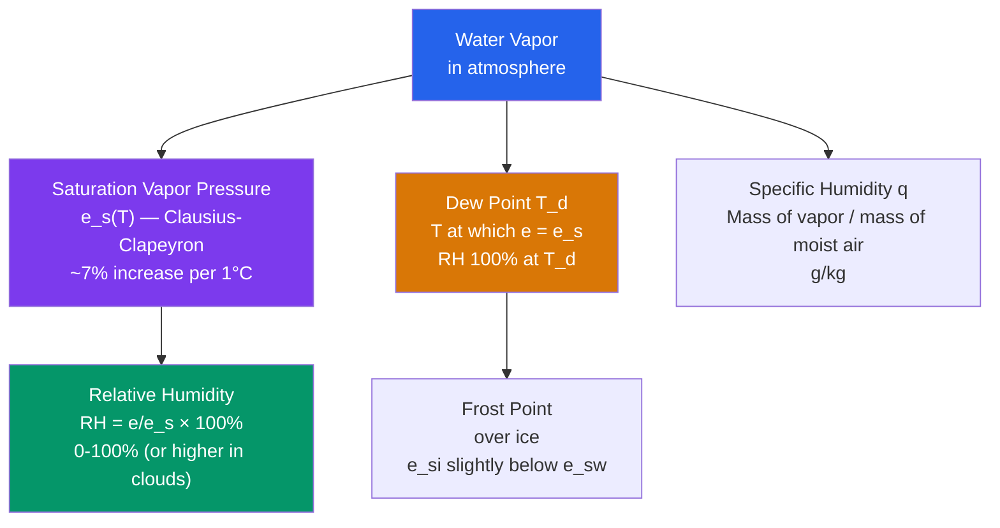

# 💧 Moisture and Humidity

> [!abstract] TL;DR
> Water vapor (H₂O) is the atmosphere's most important greenhouse gas and the **energy carrier** that drives weather — every gram that evaporates and later condenses moves ~2.5 kJ of latent heat around the planet. Its concentration is quantified by **specific humidity** (q, g/kg), **mixing ratio** (w), **relative humidity** (RH), and **dew point temperature** (T_d). The **saturation vapor pressure** e_s increases *exponentially* with temperature via the **Clausius–Clapeyron** equation (~7% per K), so warm air can hold far more moisture than cold air. This exponential dependence amplifies global warming (the **water-vapor feedback**), intensifies precipitation extremes, and makes humid heat far more dangerous than dry heat. Of all the measures, **dew point is the single most reliable indicator** of how much water vapor is actually present.

## Intuition — analogy FIRST

Think of a parcel of air as a **sponge**. Warm air is a large, absorbent sponge that can soak up a lot of water; cold air is a small sponge that fills up quickly. **Relative humidity** tells you how *full* the sponge is right now — 100% RH means the sponge is dripping wet and cannot hold another drop, so the extra water squeezes out as dew, fog, or cloud. **Dew point** tells you how much water is *actually in* the sponge, regardless of how big the sponge is — it is the most honest moisture measure because it doesn't change just because the air warmed or cooled.

Here is the twist that makes weather work: the sponge's *capacity* is not linear in temperature. Warm the air by one degree and its capacity jumps by about 7%; warm it by ten degrees and the capacity roughly doubles. That single exponential fact — the Clausius–Clapeyron relation — is the hidden engine behind thunderstorms, monsoons, atmospheric rivers, and the water-vapor amplification of climate change.

---

## How It Works



**Water vapor has its own partial pressure.** In a mixture of gases, each component contributes a partial pressure; water vapor's contribution is denoted **e** (the *actual* vapor pressure). Total atmospheric pressure is $P = p_{dry} + e$. Because e is only a few percent of P even in the humid tropics (~30 hPa out of ~1000 hPa), moisture is a small but dynamically potent minority.

**Saturation and the Clausius–Clapeyron equation.** For a given temperature there is a maximum vapor pressure the air can sustain in equilibrium with liquid water, the **saturation vapor pressure** $e_s(T)$. Its temperature dependence follows the Clausius–Clapeyron relation,
$$\frac{de_s}{dT} = \frac{L_v \, e_s}{R_v \, T^2},$$
whose integration gives an approximately exponential rise. The practical **Magnus formula** captures it to sub-percent accuracy:
$$e_s(T) \approx 6.112 \exp\!\left(\frac{17.67\,T}{T + 243.5}\right)\ \text{hPa}, \quad T \text{ in }°C.$$

**Relative humidity, dew point, and frost point.** Relative humidity is the ratio of actual to saturation vapor pressure, $\text{RH} = e/e_s(T) \times 100\%$. The **dew point** $T_d$ is the temperature to which the air must be cooled (at constant pressure and moisture) for it to reach saturation — i.e. $e = e_s(T_d)$. Over ice the saturation pressure $e_{si}$ is slightly *lower* than over supercooled liquid $e_{sw}$; the temperature satisfying $e = e_{si}$ is the **frost point**. That small gap ($e_{sw} > e_{si}$) drives the **Wegener–Bergeron–Findeisen** process in mixed-phase clouds.

**Specific humidity vs mixing ratio.** The **mixing ratio** $w = \varepsilon\,e/(P-e)$ is mass of vapor per mass of *dry* air; the **specific humidity** $q = \varepsilon\,e/(P - (1-\varepsilon)e) \approx \varepsilon e/P$ is mass of vapor per mass of *moist* air, where $\varepsilon = R_d/R_v = 0.622$. Both are conserved under adiabatic vertical motion (until condensation), which makes them the preferred moisture variables for tracing air parcels.

**Virtual temperature.** Because water vapor (molar mass 18) is *lighter* than dry air (mean molar mass ~29), moist air at the same T and P is **less dense** — more buoyant. The **virtual temperature** $T_v = T\,(1 + w/\varepsilon)/(1 + w) \approx T(1 + 0.61w)$ is the temperature dry air would need to have the same density; using $T_v$ lets us keep the dry-air gas law for buoyancy calculations.

**From moisture to clouds and comfort.** The **lifting condensation level** — the altitude where a rising parcel first saturates — scales with the surface dew-point depression: $z_{LCL} \approx 125\,(T - T_d)$ m. The **wet-bulb temperature** $T_w$ (what a thermometer wrapped in a wet wick reads) obeys $T_w \le T$, with $T_d \le T_w \le T$ for subsaturated air, and measures the cooling limit achievable by evaporation. Human comfort indices — the **heat index** and **humidex** — combine T and humidity because high moisture blocks sweat evaporation. Integrating moisture through the whole column gives **precipitable water** $W = \frac{1}{\rho_w g}\int e_s$-weighted vapor, the depth of rain if all vapor precipitated. Globally, moisture is concentrated in the **warm tropics** (fed by intense ocean evaporation) and vanishingly sparse over the **cold poles** — a direct visual of Clausius–Clapeyron written across the planet.

---

## Key Concepts / Details

### Secondary Level

- **What humidity is.** Humidity is the amount of invisible water vapor in the air. It is invisible — clouds and fog are *liquid* droplets, not vapor.
- **Relative humidity runs 0–100%.** RH is the percentage of the air's current capacity that is filled. 100% means the air is saturated and dew, fog, or cloud begins to form.
- **Why dew forms on cold surfaces.** A cold car roof or grass blade chills the air touching it below its dew point, so vapor condenses into liquid droplets — dew (or frost if below freezing).
- **Why humid heat is dangerous.** At 32 °C with 80% RH the "feels-like" **heat index** is ~40 °C, because your sweat cannot evaporate into already-moist air, so your body cannot shed heat.
- **Dew point as a comfort threshold.** Below ~13 °C dew point feels dry and pleasant; ~16–18 °C feels sticky; **above ~21 °C feels oppressive** and above ~24 °C is miserable. Unlike RH, dew point maps cleanly onto how muggy it feels.
- **Deserts vs tropics at night.** Dry desert air has almost no vapor to trap outgoing heat, so nights turn cold. Humid tropical air holds heat (water vapor is a greenhouse gas *and* releases latent heat on any dew formation), so **tropical nights stay warm and sticky**.

### Undergraduate Level

- **Clausius–Clapeyron equation.** $de_s/dT = L_v e_s /(R_v T^2)$, with latent heat of vaporization $L_v \approx 2.5\times10^6$ J/kg and $R_v = 461$ J/kg·K. Integrating (treating $L_v$ as constant) gives the near-exponential growth of $e_s$.
- **Magnus approximation.** $e_s \approx 6.112\,\exp[17.67\,T/(T+243.5)]$ hPa (T in °C) — accurate to <1% from −40 to +50 °C. Inverting it recovers the dew point from e.
- **Humidity variables.** Specific humidity $q = \varepsilon e/(P-(1-\varepsilon)e)$ and mixing ratio $w = \varepsilon e/(P-e)$, with $\varepsilon = 0.622$. For $e \ll P$ both reduce to $\approx 0.622\,e/P$ and $q \approx w$.
- **Virtual temperature.** $T_v = T\,(1 + w/\varepsilon)/(1 + w)$; the buoyancy of moist air is captured by using $T_v$ in the ideal-gas law, $P = \rho R_d T_v$.
- **Lifting condensation level.** $z_{LCL} \approx 125\,(T - T_d)$ m (Espy's rule), because a parcel cools dry-adiabatically at ~9.8 K/km while its dew point falls at only ~1.8 K/km, closing the gap $(T - T_d)$ at ~8 K/km ≈ 1 K per 125 m.
- **Wet-bulb temperature.** $T_w$ is found where evaporative cooling balances saturation: $T_d \le T_w \le T$. It is conserved under isobaric evaporation and central to the wet-bulb survivability limit.
- **Precipitable water.** $W = \frac{1}{g}\int_{P_{top}}^{P_{sfc}} q\,dp$ — the column-integrated vapor expressed as an equivalent liquid depth (typically 10–60 mm). Tropical values reach ~60 mm; polar winter <5 mm.
- **Global moisture flux and atmospheric rivers.** Poleward vapor transport is dominated by narrow filaments of **integrated vapor transport (IVT)**; these "atmospheric rivers" carry most of the midlatitude moisture that becomes cool-season rain and snow.

### Graduate Level

- **Clausius–Clapeyron in climate.** The fractional sensitivity of saturation specific humidity is $\partial \ln q_s/\partial T \approx L_v/(R_v T^2) \approx 0.067$ K⁻¹ near 288 K — the canonical **~7% per K**.
- **Water-vapor feedback.** Assuming near-constant RH, absolute humidity rises ~7%/K, boosting the greenhouse trapping. The feedback parameter is $\lambda_{WV} \approx +1.8$ W/m²/K, roughly **doubling** the bare Planck response and constituting the single largest positive climate feedback.
- **Extreme-precipitation scaling.** Thermodynamic (Clausius–Clapeyron) scaling predicts ~7%/K growth in *hourly* extreme rainfall intensity; observed **super-CC scaling** (>7%/K) in some convective regimes reflects added dynamical (updraft) intensification, while sub-CC behavior appears where moisture supply is limited.
- **Atmospheric rivers.** Defined by $\text{IVT} > 250$ kg/m/s, these features handle **~90% of poleward moisture transport** in midlatitudes despite covering <10% of any latitude circle — the vapor analogue of jet-stream concentration.
- **Isotopic tracers.** Preferential condensation of heavy isotopologues depletes vapor in $\delta D$ and $\delta^{18}O$ along transport and rain-out paths (Rayleigh distillation), making isotopic composition a powerful tracer of moisture source, path, and paleoclimate.
- **Moisture and CAPE.** Boundary-layer moisture sets the parcel's $\theta_e$ and thus **Convective Available Potential Energy**; on a skew-T, a "warm-wet" sounding yields large CAPE and severe storms, a "warm-dry" one little. Dew point, not temperature, is the CAPE lever.
- **Ice vs liquid saturation.** In mixed-phase clouds ($-40$ to $0$ °C), $e_{sw} > e_{si}$ means air saturated with respect to liquid is *super*saturated with respect to ice, driving ice-crystal growth at droplet expense (Bergeron process) and much of midlatitude precipitation.
- **Numerical weather prediction.** Operational models (**WRF, GFS, ECMWF**) prognose specific humidity and advect it; moisture-flux convergence and IVT fields are primary diagnostics for forecasting heavy rain and atmospheric-river landfalls.

---

## Python Demo — Saturation Vapor Pressure and the Heat Index

```python
# Two-panel demo of atmospheric moisture:
#   (1) Saturation vapor pressure e_s(T) via the Magnus formula, -40 to +50 C,
#       with the Clausius-Clapeyron ~7%/K exponential growth shown explicitly.
#   (2) NWS heat index at T = 30 C as relative humidity varies from 10% to 100%.
# Runnable with numpy + matplotlib only.

import numpy as np
import matplotlib.pyplot as plt


def e_sat(T_c):
    """Saturation vapor pressure (hPa) over liquid water, Magnus/Tetens form."""
    return 6.112 * np.exp(17.67 * T_c / (T_c + 243.5))


# ---- Panel 1: e_s(T) and its per-degree fractional growth ----
T = np.linspace(-40.0, 50.0, 400)
es = e_sat(T)

# Clausius-Clapeyron fractional change per degree: d(ln e_s)/dT
# Analytic derivative of the Magnus exponent: 17.67 * 243.5 / (T + 243.5)**2
cc_rate = 17.67 * 243.5 / (T + 243.5) ** 2  # units: per degree C (== per K)

marks = [0, 10, 20, 30]
print("  T(C)   e_s(hPa)   dln(e_s)/dT (%/K)")
for Tm in marks:
    print(f"  {Tm:4d}   {e_sat(Tm):7.2f}   {100*17.67*243.5/(Tm+243.5)**2:6.2f}")
# e_s roughly doubles every ~10 C: check the ratio explicitly
print(f"\n  e_s(30)/e_s(20) = {e_sat(30)/e_sat(20):.2f}  (~1.9x per +10 C)")
print(f"  e_s(20)/e_s(10) = {e_sat(20)/e_sat(10):.2f}")

fig, (ax1, ax2) = plt.subplots(1, 2, figsize=(13, 5))

ax1.plot(T, es, color="#7c3aed", lw=2, label=r"$e_s(T)$ (Magnus)")
for Tm in marks:
    ax1.scatter([Tm], [e_sat(Tm)], color="#d97706", zorder=5)
    ax1.annotate(f"{Tm}°C\n{e_sat(Tm):.1f} hPa", (Tm, e_sat(Tm)),
                 textcoords="offset points", xytext=(6, 8), fontsize=8,
                 color="#d97706")
ax1.axhline(0, color="gray", lw=0.5)
ax1.set_xlabel("Temperature (°C)")
ax1.set_ylabel("Saturation vapor pressure $e_s$ (hPa)")
ax1.set_title("Clausius–Clapeyron: $e_s$ grows exponentially (~7%/K)")
ax1.legend(loc="upper left")
ax1.grid(alpha=0.3)

# Twin axis showing the ~7%/K fractional growth rate
ax1b = ax1.twinx()
ax1b.plot(T, 100 * cc_rate, color="#059669", ls="--", lw=1.5)
ax1b.set_ylabel("d ln$e_s$/dT  (% per K)", color="#059669")
ax1b.tick_params(axis="y", labelcolor="#059669")
ax1b.set_ylim(0, 12)


# ---- Panel 2: NWS heat index at T = 30 C vs RH ----
def heat_index_c(T_c, RH):
    """NWS Rothfusz heat index. Input T in C, RH in %. Returns 'feels-like' C."""
    T_f = T_c * 9 / 5 + 32
    HI_f = (-42.379 + 2.04901523 * T_f + 10.14333127 * RH
            - 0.22475541 * T_f * RH - 6.83783e-3 * T_f ** 2
            - 5.481717e-2 * RH ** 2 + 1.22874e-3 * T_f ** 2 * RH
            + 8.5282e-4 * T_f * RH ** 2 - 1.99e-6 * T_f ** 2 * RH ** 2)
    return (HI_f - 32) * 5 / 9


RH = np.linspace(10, 100, 200)
HI = heat_index_c(30.0, RH)

ax2.plot(RH, HI, color="#dc2626", lw=2, label="Heat index at T = 30°C")
ax2.axhline(30, color="gray", ls=":", label="actual air temp 30°C")
ax2.scatter([80], [heat_index_c(30, 80)], color="#2563eb", zorder=5)
ax2.annotate(f"80% RH → feels {heat_index_c(30,80):.0f}°C",
             (80, heat_index_c(30, 80)), textcoords="offset points",
             xytext=(-120, 10), color="#2563eb",
             arrowprops=dict(arrowstyle="->", color="#2563eb"))
ax2.set_xlabel("Relative humidity (%)")
ax2.set_ylabel("Heat index / 'feels-like' (°C)")
ax2.set_title("Humid heat: same 30°C, very different danger")
ax2.legend(loc="upper left")
ax2.grid(alpha=0.3)

plt.tight_layout()
plt.show()
```

The left panel makes the core physics visible: $e_s$ curves upward exponentially, and the dashed green line shows the fractional growth rate hovering around **6–7% per K** (7.3%/K near 0 °C, ~5.8%/K near 30 °C). The right panel shows why a fixed 30 °C day becomes progressively deadlier as humidity climbs — at 80% RH it *feels like* ~40 °C because evaporative cooling has shut down.

---

## Real-World Notes

- **Heat kills through humidity.** Heat waves cause more deaths than any other weather extreme. It is the **high dew point** — not the raw temperature — that does the killing, because moist air prevents the body from shedding heat through sweat evaporation.
- **The 35 °C wet-bulb limit.** A sustained **wet-bulb temperature of 35 °C** is the theoretical survivability threshold for a healthy, resting, shaded adult: at that point the skin can no longer cool below core temperature and hyperthermia is inevitable within hours. A handful of stations (Persian Gulf, Indus Valley) have briefly touched this limit.
- **Atmospheric rivers.** "Pineapple Express" events funneling tropical Pacific moisture toward North America can transport water vapor at rates **~20× the discharge of the Mississippi River**, delivering a large share of the U.S. West Coast's annual precipitation — and its flooding — in a few landfalling storms.
- **Dew point in aviation.** Aviation **METAR** reports list temperature and dew point together; pilots estimate cloud base with the rule of thumb ~400 ft per °C of spread (T − T_d), and use dew point (which is stable and moisture-honest) rather than RH for fog and icing risk.
- **Observed moistening.** Global lower-tropospheric **specific humidity has risen ~3% since 1970**, closely tracking the Clausius–Clapeyron prediction (~7%/K) applied to the observed surface warming — direct evidence that the atmosphere is holding more water as it warms.

---

## Common Pitfalls

1. **Relative humidity moves even when moisture doesn't.** RH depends on temperature through $e_s$. On a summer afternoon T rises, $e_s$ rises, and RH = e/e_s *falls* even though the actual vapor content e is unchanged. RH peaks near dawn (coldest hour) and dips in mid-afternoon — a daily cycle driven by temperature, not by any change in water content.
2. **Dew point, not RH, is the honest moisture measure.** "50% RH" means wildly different absolute moisture at −10 °C (bone dry) versus +35 °C (oppressively humid). To compare or forecast actual water content, always use **dew point or specific humidity**, never RH alone.
3. **Moist air is *lighter*, not heavier.** Counterintuitively, humid air is *less* dense than dry air at the same T and P, because H₂O (molar mass 18) displaces heavier N₂/O₂ (mean ~29). **Virtual temperature** encodes this buoyancy boost; forgetting it under-predicts convective instability.
4. **Clausius–Clapeyron ~7%/K is a saturation result, not a precipitation guarantee.** The 7%/K scaling governs **saturation vapor pressure**. It bounds moisture availability and roughly predicts *extreme* rainfall intensity, but **mean** precipitation is energy-limited and grows only ~1–3%/K. Don't conflate the thermodynamic ceiling with the realized rainfall.
5. **100% RH does not force precipitation.** Reaching saturation is necessary but not sufficient. Without adequate **cloud condensation nuclei**, air can become **supersaturated** (RH > 100%) yet produce no droplets — and even a saturated cloud needs collision-coalescence or the ice process to grow drops large enough to fall.

---

## Related Concepts

- [[_MOC_Atmospheric_Thermodynamics]] — section map of the atmospheric-thermodynamics unit
- [[Adiabatic_Processes_and_Atmospheric_Stability]] — dry vs moist adiabats; where the LCL and latent-heat release set stability
- [[Cloud_Formation_and_Microphysics]] — what happens once air reaches saturation: nucleation, droplets, and the ice process
- [[Precipitation_Processes]] — how supersaturated vapor becomes rain, snow, and the Bergeron mechanism
- [[Atmospheric_Temperature_and_Lapse_Rates]] — the temperature structure that determines $e_s$ and moisture capacity with height
- [[Climate_Sensitivity_and_Feedbacks]] — the water-vapor feedback that roughly doubles the CO₂-forced warming
- [[Anthropogenic_Climate_Change]] — observed atmospheric moistening and intensifying precipitation extremes
- [[_MOC_Physics_Master]] — cross-vault physics entry point
- [[Laws_of_Thermodynamics]] — the thermodynamic equilibrium behind Clausius–Clapeyron
- [[Kinetic_Theory_of_Gases]] — partial pressures and the molecular picture of evaporation/condensation
- [[_MOC_Chemistry_Master]] — cross-vault chemistry entry point
- [[Phase_Equilibria_and_Colligative_Properties]] — the liquid–vapor phase boundary underlying saturation

---

## Review Questions

**Secondary**
- Why does the relative humidity inside your house **rise at night** even though nobody added any water to the air? *(Hint: what happens to temperature — and therefore to the air's capacity — after sunset?)*
- If the dew point is **22 °C** and the temperature is **28 °C**, what is the approximate relative humidity? *(Use RH = e_s(22)/e_s(28) via the Magnus formula: e_s(22) ≈ 26.4 hPa, e_s(28) ≈ 37.8 hPa, so RH ≈ 70%.)*

**Undergraduate**
- **Derive** the Clausius–Clapeyron equation $de_s/dT = L_v e_s/(R_v T^2)$ from the equality of Gibbs free energies (chemical potentials) of the liquid and vapor phases along the coexistence curve.
- At T = 20 °C, $e_s \approx 23$ hPa. Estimate $e_s$ at **30 °C** using the ~7%/K rule and compare to the Magnus value. *(Rule of thumb ~2× per 10 K gives ~42 hPa; Magnus gives ~42.4 hPa.)*
- Compute the **lifting condensation level** for a parcel with T = 30 °C and T_d = 18 °C. *(z_LCL ≈ 125 × (30 − 18) = 1500 m.)*

**Graduate**
- Explain the **water-vapor feedback** and why it approximately **doubles** the direct CO₂ forcing. Which assumption about relative humidity underpins the standard estimate, and what is the feedback parameter's approximate value?
- The Clausius–Clapeyron relation predicts ~7%/K growth in **precipitation extremes**, yet observed **mean** precipitation increases only ~1–3%/K. Reconcile these using the distinction between the **thermodynamic scaling** (moisture availability) for extremes and the **energetic/dynamic constraint** (radiative cooling of the troposphere) on the global-mean hydrological cycle.

---

## Sources

- Wallace, J. M., & Hobbs, P. V. (2006). *Atmospheric Science: An Introductory Survey* (2nd ed.). Academic Press. — Chapter 3, atmospheric thermodynamics and moisture variables.
- Iribarne, J. V., & Godson, W. L. (1981). *Atmospheric Thermodynamics* (2nd ed.). D. Reidel. — Clausius–Clapeyron, humidity variables, and thermodynamic diagrams.
- Held, I. M., & Soden, B. J. (2006). "Robust Responses of the Hydrological Cycle to Global Warming." *Journal of Climate*, 19(21), 5686–5699. — Clausius–Clapeyron scaling of humidity vs the weaker scaling of mean precipitation.

---

#Meteorology #AtmosphericThermodynamics #Humidity #DewPoint #WaterVapor
