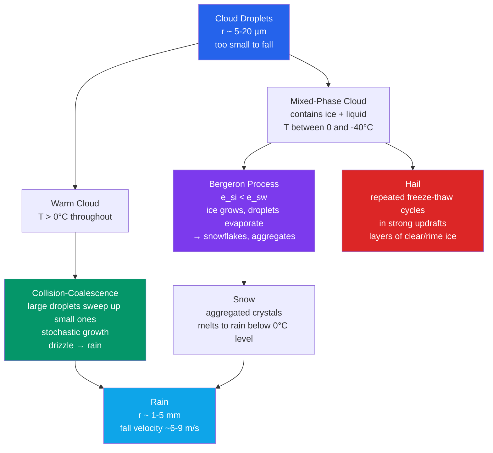

# 🌧️ Precipitation Processes

> [!abstract] TL;DR
> Precipitation forms by two main microphysical routes: **collision–coalescence** in warm ($T>0^\circ$C) clouds of the tropics and maritime air, and the **Bergeron–Findeisen–Wegener ice process** in mixed-phase clouds that produces *most* midlatitude rain. The core difficulty is scale: a cloud droplet ($r \sim 5\text{–}20\ \mu$m) must grow roughly **one million times in volume** to become a raindrop ($1\text{–}5$ mm). Warm clouds solve this by a runaway sweep-up of small drops by large ones; cold clouds exploit the fact that saturation vapour pressure over ice is *lower* than over liquid ($e_{si} < e_{sw}$), so ice crystals grow at the expense of evaporating supercooled droplets. **Hail** forms in strong convective updrafts through repeated freeze/accretion cycles, building alternating clear and rime-ice layers. Global precipitation patterns are set by the general circulation (ITCZ, monsoons, midlatitude fronts, orography), and extreme hourly rainfall is intensifying at roughly the **Clausius–Clapeyron rate of ~7 % per K** of warming.

---

## Intuition — analogy FIRST

Picture a cloud as a stadium crowd of a million *identical* tiny water droplets, all equally thirsty, all sipping from the same shared pool of water vapour. If everyone drinks at the same rate nobody ever gets big enough to fall — this is the **"lucky droplet" problem**. Somehow a lucky few must grow a thousand times wider than their neighbours and drop out as rain.

Warm clouds break the tie by brute contact. Once a handful of droplets get slightly bigger — say by chance, or by starting on a large sea-salt nucleus — they fall faster than the small ones and **sweep them up like a snowball rolling downhill**: the bigger they get, the more they collect, the faster still they grow. It is a runaway, and it is *stochastic* — only a lucky tail of the population ever runs away.

Cold clouds use a subtler trick. At the same sub-freezing temperature, **ice holds onto its molecules more tightly than liquid water does**, so the air only has to be slightly humid to be saturated over ice while still being *sub*-saturated over the liquid droplets right next to it. The ice crystals therefore act like tiny **vacuum cleaners**, drawing vapour out of the air; the liquid droplets, now finding the air too dry, evaporate to replace it. Vapour flows silently from droplet to crystal until the crystals are heavy enough to fall. This is the elegant **Bergeron process** — no collisions required.

---

## How It Works

Both pathways begin with the same non-precipitating population of cloud droplets and diverge on whether the cloud is warm throughout or reaches below-freezing temperatures where ice can nucleate. The diagram traces the two routes and the special convective branch that makes hail.



**Why droplets don't just fall.** A particle settling through air reaches a **terminal fall velocity** $v_t$ where drag balances gravity. For the tiny, low-Reynolds-number cloud droplet the drag is viscous (Stokes' law), and
$$v_t \approx \frac{2r^2 g(\rho_w - \rho_a)}{9\eta},$$
so $v_t \propto r^2$. A $10\ \mu$m droplet falls at only $\sim 1$ cm/s — slower than the updrafts that hold it aloft — so it *never reaches the ground*. Growth by vapour diffusion alone slows as $r$ grows (radius growth $\propto 1/r$) and stalls near $r \sim 20\ \mu$m. Something else must take over to bridge the gap to millimetre-sized rain.

**Collision–coalescence (the warm-rain route).** Once a size *spread* exists, larger drops fall faster than smaller ones and overtake them. The rate at which a collector drop of radius $R$ sweeps up droplets of radius $r$ is set by the **collection kernel**
$$K(r,R) = \pi (r+R)^2\,\lvert v_t(R) - v_t(r)\rvert\, E(r,R),$$
where $\pi(r+R)^2$ is the geometric cross-section, $\lvert v_t(R)-v_t(r)\rvert$ is the differential fall speed (no relative motion, no collision), and $E(r,R)$ is the **collision efficiency**. $E$ is not unity: small droplets are swept aside in the airflow streaming around the collector, so very small $r$ have $E \to 0$; efficiency climbs steeply once the collector exceeds $\sim 20\ \mu$m, which is exactly why warm rain has an initiation "barrier." Whether a collision actually merges the drops is the **coalescence efficiency** — drops can bounce or, if large, break up. Growth is **stochastic**: not every drop grows at the mean rate; a lucky tail runs away first, seeding **drizzle** ($0.1\text{–}0.5$ mm) and then full **rain**.

**The Bergeron–Findeisen–Wegener process (the cold-rain route).** In a mixed-phase cloud ($0$ to $-40^\circ$C) supercooled liquid droplets and ice crystals coexist. Because the ice lattice binds molecules more strongly, the **saturation vapour pressure over ice is lower than over liquid**, $e_{si} < e_{sw}$, with the gap maximised near $-12^\circ$C (about a 10–15 % difference). Air that is merely saturated with respect to liquid is therefore *super*-saturated with respect to ice. The consequence is a one-way vapour pump: ice crystals grow by deposition while the surrounding droplets evaporate to keep the vapour supply going. Crystals reach precipitable sizes in minutes. They then grow further by **aggregation** (crystals colliding and interlocking into snowflakes, most effective near $0^\circ$C where surfaces are sticky) and by **riming** (sweeping up supercooled droplets that freeze on contact). Falling snow **melts** when it descends below the $0^\circ$C level and reaches the ground as rain — which is why *most rain in the midlatitudes started as ice aloft.*

**Graupel, hail, and the melting signature.** Heavy riming turns a snowflake into **graupel** (soft, opaque, rime-coated ice). In a strong updraft a graupel embryo can be carried repeatedly through the supercooled-liquid region, accreting layer after layer of ice to become **hail**. Alternating **clear** (glassy) and **rime** (milky, air-bubble-rich) layers record cycles of *wet growth* (accretion so fast the surface stays liquid and freezes clear) and *dry growth* (droplets freeze on contact, trapping air). The hailstone grows until it is too heavy for the updraft and falls. Finally, wherever snow melts to rain there is a **radar bright band** — a shallow layer of enhanced reflectivity at the $0^\circ$C level caused by large, wet, still-low-density melting snowflakes that scatter strongly before collapsing into faster, smaller raindrops.

**Where geography enters.** **Orographic** lifting forces air up the *windward* slope of a mountain, cooling and raining it out, while the descending *leeward* air warms and dries into a **rain shadow**. **Convective** precipitation (narrow, vertical, intense showers from cumulonimbus) contrasts with **stratiform** precipitation (broad, gentle, long-lived rain from layered nimbostratus along fronts). Both feed off the moisture and lift organised by the large-scale circulation — the ITCZ, monsoons, and midlatitude cyclones.

---

## Key Concepts / Details

### Secondary Level

- **The precipitation family.** All fall from clouds but differ by the temperature profile they pass through:
  - **Rain** — liquid drops, $\sim 0.5\text{–}5$ mm.
  - **Snow** — ice crystals/aggregates that never fully melt; needs a below-freezing column to the ground.
  - **Sleet (ice pellets)** — snow that melts in a warm layer aloft, then *refreezes into a solid pellet* in a deep cold layer near the surface. It bounces.
  - **Freezing rain** — rain that stays liquid all the way down through a *shallow* sub-freezing surface layer and **freezes on contact** with cold ground/wires, glazing everything in ice. It does not bounce; it is far more dangerous than sleet.
  - **Hail** — layered balls of ice grown in thunderstorm updrafts; a warm-season, not cold-season, phenomenon.
- **Why the windward side is wetter.** Air forced up a mountain cools, its water vapour condenses and rains out on the way up; on the way down the far side it is already wrung dry, giving a **rain shadow** — deserts often sit just downwind of mountains.
- **Showers vs steady rain.** Bumpy, brief, heavy **convective showers** come from tall isolated storm clouds; grey, all-day **stratiform rain** comes from widespread flat cloud sheets along weather fronts.
- **Monsoons** are seasonal reversals of wind that pull oceanic moisture over a continent, producing months of concentrated rainfall (e.g. the South Asian summer monsoon).
- **Why hailstones have layers.** Each trip a hailstone makes up and down through a storm adds a new shell of ice — cut one open and the rings are like tree rings recording its journey.

### Undergraduate Level

**Terminal fall velocity.** In the Stokes regime ($r \lesssim 30\ \mu$m) drag is linear in velocity and
$$v_t = \frac{2 r^2 g (\rho_w - \rho_a)}{9\eta},\qquad v_t \propto r^2.$$
Beyond $\sim 30\ \mu$m the Reynolds number grows, the flow separates, and $v_t$ rises more slowly; large raindrops flatten and cap out near $9\text{–}10$ m/s at $\sim 5$ mm. Numbers to anchor: $10\ \mu$m $\to \sim 1$ cm/s; $100\ \mu$m (drizzle) $\to \sim 0.3$ m/s; $1$ mm $\to \sim 4$ m/s; $5$ mm $\to \sim 9$ m/s.

**Collection kernel and efficiency.** The volume swept per unit time by a collector $R$ over droplets $r$ is
$$K(r,R) = \pi (r+R)^2\,\lvert v_t(R) - v_t(r)\rvert\, E(r,R).$$
$E(r,R)$, the **gravitational collision efficiency**, accounts for small droplets being deflected around the collector by the airflow. It is near zero for $R < 18\ \mu$m, which is why warm rain requires a few large "collector" drops (often on giant sea-salt nuclei) to get started. The **coalescence efficiency** then decides whether contact leads to a permanent merge.

**Marshall–Palmer raindrop size distribution.** Measured rain drop populations follow, to good approximation, an exponential:
$$N(D) = N_0\, e^{-\Lambda D},\qquad N_0 = 8000\ \text{m}^{-3}\,\text{mm}^{-1},\quad \Lambda = 4.1\,R^{-0.21}\ \text{mm}^{-1},$$
where $R$ is the rain rate in mm/h and $D$ the drop diameter in mm. Heavier rain (larger $R$) means smaller $\Lambda$, i.e. a *flatter* distribution with relatively more big drops. The **median volume diameter** $D_0 = 3.67/\Lambda$ splits the liquid water equally between drops larger and smaller than $D_0$.

**The bright band.** Vertically pointing (or scanning) radar sees a thin horizontal layer of **enhanced reflectivity just below the $0^\circ$C level** — the melting layer. Melting snowflakes are large *and* coated in liquid water (high dielectric factor), so they scatter like giant raindrops; once fully melted they collapse into smaller, faster drops and the reflectivity drops again. The bright band is a key operational marker of the freezing level and a hazard for **QPE**, which can over-estimate rain if it mistakes the band for heavy rainfall.

**Warm rain vs cold rain.** **Maritime (warm-rain)** clouds have few, large droplets on scarce sea-salt nuclei and rain efficiently by coalescence; **continental (cold-rain)** clouds have many small droplets on abundant aerosol and typically need the ice phase to precipitate. This is the microphysical fingerprint of the **CCN** environment.

**Convective vs stratiform.** Convective cells have strong updrafts (m/s to tens of m/s), tall vertical structure, intense but localised rain, and *no* bright band (ice and liquid are lofted, not neatly layered). Stratiform regions have weak updrafts (cm/s), broad horizontal cloud, gentle widespread rain, and a *clear* bright band — the classic way to tell them apart on radar.

**Orographic precipitation.** Forced ascent on the windward slope (the **seeder–feeder** mechanism can further boost it: precipitation from upper cloud falls through a low orographic "feeder" cloud, scavenging its water) concentrates rain on the upwind side; subsiding, adiabatically warming air on the lee side creates the **rain shadow**.

### Graduate Level

**Stochastic collection equation (SCE).** The evolution of the droplet size distribution $n(m,t)$ (number per unit mass interval) under coalescence is the coagulation integro-differential equation:
$$\frac{\partial n(m,t)}{\partial t} = \tfrac{1}{2}\!\int_0^m K(m',\,m-m')\,n(m',t)\,n(m-m',t)\,dm' \;-\; n(m,t)\!\int_0^\infty K(m,m')\,n(m',t)\,dm'.$$
The first (gain) term builds mass-$m$ drops from all pairs that sum to $m$; the second (loss) term removes them by collision with any other drop. Because $K$ grows steeply with the mass difference, the SCE captures the **broadening of the tail** and the runaway of a few "lucky" drops that a mean-growth (continuous-collection) treatment misses — the statistical resolution of the lucky-droplet paradox. Practical microphysics uses **bin (spectral)** schemes solving a discretised SCE, or **bulk** schemes that carry moments (mass, number) with assumed distribution shapes.

**Ice habit and aggregation.** The crystal *habit* — plates, columns, dendrites, needles — is a sensitive function of temperature and supersaturation (the **Nakaya diagram**). Branching **dendrites** (grown near $-15^\circ$C, the peak of $e_{sw}-e_{si}$) interlock readily, so aggregation and snowflake size peak in that regime and again near $0^\circ$C where quasi-liquid surface layers make crystals sticky.

**Riming and the transition to graupel.** The **riming efficiency** and the accreted liquid-water flux determine whether a crystal stays a rimed snowflake or becomes graupel; the transition is a threshold in accreted mass fraction. Riming also drives the **Hallett–Mossop (rime-splintering)** secondary ice production between $-3$ and $-8^\circ$C, which can multiply ice concentrations by orders of magnitude beyond what primary nucleation predicts — a major source of model error.

**Hail growth regimes and the Schumann–Ludlam limit.** A hailstone accreting supercooled water releases latent heat as that water freezes. In **dry growth** the surface stays below $0^\circ$C and all impacting water freezes immediately (trapping air → opaque rime). In **wet growth** the accretion rate is so high that latent heating warms the surface to $0^\circ$C and a liquid skin forms; not all water can freeze, some is shed, and the ice that does freeze is clear (bubble-free). The **Schumann–Ludlam limit** is the critical liquid-water flux separating the two regimes — set by the balance between latent-heat release and the heat the stone can conduct/convect/evaporate away. Alternating wet/dry growth as the stone cycles through different liquid-water and temperature conditions produces the observed **clear/opaque layering**. **Hail suppression** programs seed storms with extra ice nuclei to create more, smaller embryos competing for the same liquid water (the "beneficial competition" hypothesis) — with contested efficacy.

**Dual-polarization radar and hydrometeor classification.** Transmitting both horizontal and vertical polarizations yields:
- $Z_{DR}$ (**differential reflectivity**) — the H/V reflectivity ratio; positive for oblate (flattened) large raindrops, near zero for tumbling spherical hail.
- $K_{DP}$ (**specific differential phase**) — accumulated phase shift from oblate drops; nearly immune to attenuation and calibration, excellent for **QPE** in heavy rain.
- $\rho_{HV}$ (**co-polar correlation coefficient**) — near 1.0 for uniform hydrometeors (pure rain, pure snow), dropping where types mix (melting layer, hail, debris).
Together these enable **hydrometeor classification** (rain / snow / graupel / hail / mixed) and improve QPE beyond single-polarization $Z$ alone.

**QPE and Z–R relationships.** Reflectivity relates to rain rate by empirical laws such as the Marshall–Palmer $Z = 200\,R^{1.6}$ (with $Z$ in mm$^6$ m$^{-3}$). Because $Z$ depends on the *sixth* moment of the drop-size distribution while $R$ depends on roughly the $3.67$th, a single $Z$ maps to a *range* of $R$ — the fundamental uncertainty of radar QPE, mitigated by polarimetry, disdrometer calibration, and gauge adjustment.

**Global precipitation observation.** The **GPM (Global Precipitation Measurement)** mission — a dual-frequency precipitation radar plus a passive microwave imager on the Core Observatory, calibrating a constellation of microwave radiometers — provides near-global 3-hourly precipitation estimates, the modern successor to TRMM.

**Clausius–Clapeyron scaling of extremes.** Saturation vapour pressure rises with temperature per $\frac{d\ln e_s}{dT} = \frac{L_v}{R_v T^2}$, giving **~7 % more atmospheric moisture per K** of warming. Observed and modelled **extreme daily** precipitation intensifies at roughly this C–C rate, but **sub-daily (hourly)** extremes in convective regimes often intensify *faster* than 7 %/K ("**super-C–C**" scaling), attributed to dynamical feedbacks (latent-heat-enhanced updrafts) on top of the thermodynamic moisture increase.

**Precipitation efficiency and aerosol.** The fraction of condensed water that actually reaches the ground depends on CCN loading: more CCN → more, smaller droplets → suppressed coalescence and delayed warm rain, potentially invigorating deep convection by lofting more liquid to freeze aloft (the aerosol "invigoration" hypothesis). Precipitation efficiency is thus a coupled function of dynamics, microphysics, and aerosol.

---

## Python demo — Marshall–Palmer raindrop size distribution

The script evaluates the Marshall–Palmer distribution $N(D) = N_0\,e^{-\Lambda D}$ for three rain rates (1, 10, 50 mm/h), with $\Lambda = 4.1\,R^{-0.21}$ mm$^{-1}$ and $N_0 = 8000$ m$^{-3}$ mm$^{-1}$. It plots $N(D)$ (log $y$-axis) against $D$ from 0–8 mm and annotates each curve's **median volume diameter** $D_0 = 3.67/\Lambda$. Heavier rain has a smaller $\Lambda$, so its curve is flatter (relatively more big drops) and its $D_0$ is larger.

```python
# Marshall-Palmer raindrop size distribution for three rain rates.
# N(D) = N0 * exp(-Lambda * D),  Lambda = 4.1 * R^-0.21  (1/mm),  N0 = 8000 m^-3 mm^-1
# Runnable with numpy + matplotlib.
import numpy as np
import matplotlib.pyplot as plt

N0 = 8000.0                       # m^-3 mm^-1  (Marshall-Palmer intercept)
D  = np.linspace(0.0, 8.0, 400)   # drop diameter, mm

rain_rates = [1.0, 10.0, 50.0]    # mm/h
colors     = ['#0ea5e9', '#059669', '#dc2626']

fig, ax = plt.subplots(figsize=(9, 6))

for R, c in zip(rain_rates, colors):
    Lam = 4.1 * R**(-0.21)        # slope parameter, 1/mm
    N   = N0 * np.exp(-Lam * D)    # number density per mm of diameter
    D0  = 3.67 / Lam               # median volume diameter, mm
    ax.plot(D, N, color=c, lw=2, label=f"R = {R:g} mm/h  (Λ = {Lam:.2f} mm⁻¹)")

    # Mark and annotate the median volume diameter D0 on each curve.
    N_at_D0 = N0 * np.exp(-Lam * D0)
    ax.plot([D0], [N_at_D0], 'o', color=c, ms=7)
    ax.annotate(f"D₀ = {D0:.2f} mm", xy=(D0, N_at_D0),
                xytext=(D0 + 0.3, N_at_D0 * 3), color=c, fontsize=9,
                arrowprops=dict(arrowstyle='->', color=c, lw=1))

ax.set_yscale('log')
ax.set_ylim(1e-1, 2e4)
ax.set_xlabel("Drop diameter  D  (mm)")
ax.set_ylabel("N(D)   (m⁻³ mm⁻¹)")
ax.set_title("Marshall–Palmer raindrop size distribution")
ax.grid(True, which='both', ls=':', alpha=0.5)
ax.legend()
plt.tight_layout()
plt.show()

# ---- Console summary ----
print(f"{'R (mm/h)':>10} | {'Lambda (1/mm)':>14} | {'D0 (mm)':>8}")
for R in rain_rates:
    Lam = 4.1 * R**(-0.21)
    print(f"{R:10.1f} | {Lam:14.3f} | {3.67/Lam:8.3f}")
```

Expected console output (rounded): $R=1$ mm/h $\to \Lambda \approx 4.10$ mm$^{-1}$, $D_0 \approx 0.90$ mm; $R=10$ mm/h $\to \Lambda \approx 2.53$ mm$^{-1}$, $D_0 \approx 1.45$ mm; $R=50$ mm/h $\to \Lambda \approx 1.86$ mm$^{-1}$, $D_0 \approx 1.97$ mm. The plot shows all three curves sharing the same intercept $N_0 = 8000$ at $D=0$ but fanning out: the drizzle-like $1$ mm/h curve falls off steeply (few large drops), while the $50$ mm/h downpour decays slowly, its water mass carried by a shifted-right tail of $\sim 2$ mm drops.

---

## Real-World Notes

- **Orographic rain shadows are dramatic.** Seattle, on the windward side of the Cascades, receives roughly **950 mm/yr**, while Ellensburg just to the lee gets only about **230 mm/yr** — a factor of four across a single mountain range, driven entirely by forced ascent then descent of Pacific air.
- **Record hail.** The largest hailstone officially recorded fell at **Vivian, South Dakota (2010)**: about **20 cm in diameter** and **0.88 kg** — grown in a supercell updraft strong enough to suspend a mass comparable to a bowling ball's worth of ice.
- **Tropical cloudbursts** can deliver instantaneous rain rates exceeding **100 mm/hour** in deep tropical convection, overwhelming drainage in minutes and driving flash floods — the intensity is a direct consequence of warm-cloud coalescence acting on very high moisture content.
- **Radar bright bands** — the ring of enhanced reflectivity at the $0^\circ$C melting level — are an **operationally important QPE feature**: forecasters must correct for them so that melting snow is not misread as intense surface rainfall.
- **Atmospheric rivers**, narrow filaments of concentrated water-vapour transport, deliver roughly **50 % of California's annual precipitation** in just a handful of extreme, multi-day events — making the state's water supply hostage to a few orographically-enhanced storms.

---

## Common Pitfalls

1. **"Clouds are made of water, so they must rain."** Cloud droplets ($r \sim 10\ \mu$m) fall at $\sim 1$ cm/s and *never reach the ground* — they are held up by updrafts and evaporate. Precipitation absolutely requires a **growth mechanism** (coalescence or the ice process) to bridge the million-fold volume gap to raindrops.
2. **Assuming tropical rain is "all liquid."** Even on the hottest tropical day, deep convective **cloud tops are far below freezing**, and much tropical rain begins as ice aloft (Bergeron + riming) that melts on the way down. Warm-rain coalescence dominates only in shallow maritime clouds.
3. **Confusing freezing rain with sleet.** **Freezing rain** stays liquid through a *shallow* cold surface layer and freezes *on contact* (glaze ice, extremely hazardous). **Sleet (ice pellets)** refreezes into solid pellets *while still aloft* in a *deep* cold layer and bounces off surfaces. Same warm-layer-aloft setup, different depth of the cold layer below — opposite hazards.
4. **Reading radar reflectivity as rain rate.** Radar measures backscatter from the **drop-size distribution** (roughly the 6th moment), not rain rate (roughly the 3.67th moment). Empirical **$Z$–$R$** relations (e.g. $Z=200R^{1.6}$) map one to the other only approximately, so a given $Z$ corresponds to a *range* of possible rain rates.
5. **Expecting fully glaciated clouds to rain efficiently.** The Bergeron process needs the **coexistence** of ice *and* supercooled liquid to drive the vapour flux. A cloud that has completely frozen (glaciated) has no liquid reservoir left to feed crystal growth and is a **poor precipitator** — the mixed phase is the sweet spot.

---

## Related Concepts

- [[_MOC_Atmospheric_Thermodynamics]] — section map for the atmospheric-thermodynamics chapter of this vault.
- [[Cloud_Formation_and_Microphysics]] — where the droplets and CCN of this note come from; precipitation is the *sink* end of the microphysics that cloud formation is the *source* of.
- [[Moisture_and_Humidity]] — saturation vapour pressure, $e_{sw}$ vs $e_{si}$, and the moisture supply that Clausius–Clapeyron scales; the thermodynamic backbone of the Bergeron process.
- [[Thunderstorms_and_Convective_Systems]] — the strong updrafts that loft graupel embryos and grow hail, and the source of convective (vs stratiform) precipitation.
- [[Droughts_and_Floods]] — the hydrologic extremes at the tails of the precipitation distribution studied here.
- [[Anthropogenic_Climate_Change]] — the ~7 %/K Clausius–Clapeyron intensification of extreme rainfall in a warming climate.
- [[Remote_Sensing_Radar_and_Satellites]] — dual-pol radar variables ($Z_{DR}$, $K_{DP}$, $\rho_{HV}$), the bright band, QPE, and GPM satellite retrievals of precipitation.
- [[Extreme_Weather_and_Meteorological_Hazards]] — hail, cloudbursts, freezing-rain ice storms, and flash-flood-producing rain rates.
- [[_MOC_Physics_Master]] — cross-vault entry point to the underlying physics.
- [[Fluid_Statics_and_Properties]] — viscosity and drag underlying Stokes' law and terminal fall velocity.
- [[Laws_of_Thermodynamics]] — latent heat release (hail wet/dry growth) and the phase-change energetics of freezing and melting.
- [[Phase_Equilibria_and_Colligative_Properties]] — the vapour-pressure/phase-equilibrium chemistry behind $e_{si}<e_{sw}$ and supercooling.

---

## Review Questions

**Secondary.** Describe the difference between **rain, sleet, and freezing rain** in terms of the temperature profile the falling particle passes through. Why does the **windward** side of a mountain receive far more precipitation than the **leeward** side?

**Undergraduate.** Explain the **Bergeron–Findeisen–Wegener** precipitation mechanism. Why is the saturation vapour pressure over ice *lower* than over liquid water at the same temperature, and how does that difference drive ice-crystal growth in a mixed-phase cloud? Separately, what is the **"bright band"** in a radar reflectivity profile, and what physically causes it?

**Graduate.** State the **stochastic collection equation (SCE)** and explain its role in resolving the "lucky droplet" paradox of collision–coalescence growth — why does it succeed where a mean/continuous-collection treatment fails? What is the **Schumann–Ludlam limit** in hail growth, and how does it distinguish **wet** from **dry** growth regimes? Finally, how do dual-polarization variables ($Z_{DR}$, $K_{DP}$) enable **hydrometeor classification** and improved QPE beyond conventional reflectivity?

---

## Sources

- Rogers, R. R., & Yau, M. K. — *A Short Course in Cloud Physics* (3rd ed.), Butterworth-Heinemann. Terminal velocity, collection kernels, the SCE, and the Bergeron process.
- Pruppacher, H. R., & Klett, J. D. — *Microphysics of Clouds and Precipitation* (2nd ed.), Springer. Definitive reference on droplet/ice growth, riming, and hail thermodynamics.
- Wallace, J. M., & Hobbs, P. V. — *Atmospheric Science: An Introductory Survey* (2nd ed.), Academic Press. Precipitation processes in the context of clouds, fronts, and the general circulation.

---

#Meteorology #Precipitation #CloudMicrophysics #Rain #Snow #Hail
