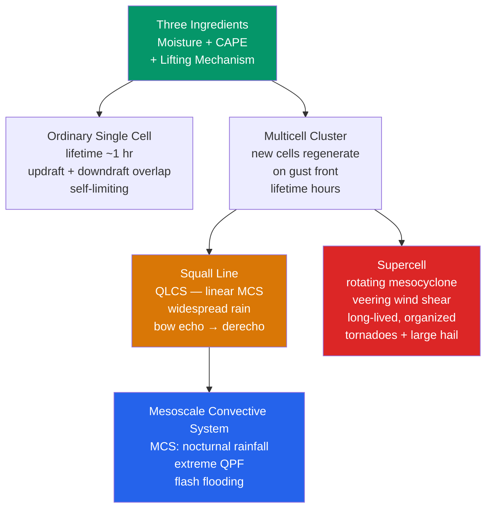

# ⛈️ Thunderstorms and Convective Systems

> [!abstract] TL;DR
> Thunderstorms are convective clouds (**cumulonimbus**) that produce lightning, thunder, and heavy precipitation. They need three ingredients — **moisture**, **instability (CAPE)**, and a **lifting mechanism**. Ordinary **single-cell** storms are short-lived (~1 hour) because their own rain-cooled downdraft chokes the updraft. Add **wind shear** and the downdraft is displaced away from the updraft, so the storm organizes and persists: **multicell clusters**, linear **squall lines**, and, at the extreme, rotating **supercells** with a **mesocyclone** — long-lived, and responsible for most tornadoes and large hail. **Mesoscale convective systems (MCSs)** are organized storm clusters that dominate warm-season rainfall and drive extreme flash-flood events. **Lightning** results from charge separation between ice crystals and graupel in the mixed-phase updraft region.

## Intuition — analogy FIRST

A thunderstorm is a **heat engine running on atmospheric instability** — a steam engine whose fuel is **CAPE** (convective available potential energy) stored in warm, moist, low-level air trapped beneath cooler air aloft. The **updraft** is the engine's turbocharger, lifting that moist air all the way to the tropopause, where it releases latent heat and does the "work" that powers wind, rain, and lightning.

Here is the twist that decides whether the engine sputters or roars. Without **wind shear** (a change of wind with height), the storm's own **rain-cooled downdraft** falls straight back down through its updraft and smothers it — the engine floods and stalls within an hour. Add wind shear and the downdraft is tilted *away* from the updraft, so cool exhaust and warm fuel-intake stay separated. Now the engine runs continuously: the storm becomes organized, tilted, and self-sustaining. The most extreme version, the **supercell**, does something no ordinary storm can — its entire updraft begins to **rotate**, becoming a deep, corkscrewing column that can spin for hours and spawn tornadoes.

---

## How It Works



**The three ingredients.** Every thunderstorm requires (1) **moisture** in the low levels to fuel condensation and latent-heat release, (2) **instability** — a lapse rate steep enough that a lifted parcel becomes warmer (more buoyant) than its environment, quantified as **CAPE**, and (3) a **lifting mechanism** to raise parcels to their level of free convection past any inhibition (**CIN**). Forecasters add a fourth ingredient — **wind shear** — not to *make* a storm but to *organize* it.

**Convective initiation.** The lift that overcomes CIN comes from **cold fronts** (dense air wedging under warm air), **drylines** (moisture gradients over the U.S. Great Plains), **outflow boundaries** (the gust fronts left by earlier storms), **sea-breeze fronts**, and **orographic** ascent up mountain slopes. Where two such boundaries intersect, storms fire preferentially.

**Lifecycle of an ordinary cell.** (1) **Cumulus stage** — a growing towering cumulus dominated by updraft. (2) **Mature stage** — the cloud reaches the tropopause, spreads into an **anvil**, and precipitation begins; the descending rain drags cool air down, creating a **downdraft** alongside the updraft. (3) **Dissipating stage** — the downdraft spreads out, cuts off the warm inflow, and the storm collapses. Total life ~30–60 minutes.

**Supercell structure.** A supercell is a single, persistent, **rotating** updraft (the **mesocyclone**). Its anatomy: a **forward-flank downdraft (FFD)** with the heaviest precipitation, a **rear-flank downdraft (RFD)** that wraps cyclonically around the mesocyclone, a **flanking line** of towering cumulus feeding the updraft, an **overshooting top** punching above the anvil, a lowered **wall cloud** beneath the rain-free base, and — in ~30% of cases — a **tornado** at the tip of the mesocyclone. Right-moving supercells thrive in strongly **veering** (clockwise-turning) hodographs.

**Bow echoes and derechos.** When a squall line's rear-inflow jet surges forward, the line bulges into a **bow echo** flanked by **book-end vortices**. A family of bow echoes producing a long swath of damaging straight-line winds (≥400 km, gusts ≥93 km/h) is a **derecho**.

**MCS structure.** A **mesoscale convective system** is an organized cluster ≥100 km across, typically with a **leading convective line** (intense, forward-propagating cells) and a **trailing stratiform region** (widespread, lighter rain from anvil detrainment). MCSs are the great rain-makers of the warm season and the drivers of flash flooding.

**Lightning and thunder.** Inside the mixed-phase updraft (−10 to −25 °C), rising small **ice crystals** and falling **graupel** collide and exchange charge (**noninductive charging**), separating the cloud into a positively charged upper region and a negative middle region. When the field exceeds air's breakdown strength, a **stepped leader** descends, a **return stroke** flashes up, and the ~30,000 K channel explosively expands the air — the shock wave we hear as **thunder**. Light arrives essentially instantly; sound travels ~1 km every 3 seconds, so counting the delay gives the distance.

---

## Key Concepts / Details

### Secondary Level

- **Three ingredients.** A thunderstorm needs **moisture**, **instability** (warm air that wants to rise), and something to give it a **lift** (like a cold front or a mountain). Remove any one and you get no storm.
- **Why supercells outlive ordinary storms.** In an ordinary storm the cold rainy downdraft falls back into the warm updraft and shuts it off in under an hour. In a supercell, **wind shear tilts the storm** so the rain falls away from the updraft — the engine keeps running for hours.
- **What causes lightning.** Ice crystals and soft-hail pellets (**graupel**) rub together inside the storm and swap electric charge, splitting the cloud into positive and negative zones. Lightning is the giant spark that neutralizes them.
- **Why lightning always comes before thunder.** They happen at the same instant, but **light travels ~900,000× faster than sound**. Count the seconds between flash and boom and divide by 3 to get the distance in kilometres (or by 5 for miles).
- **Flash flooding vs river flooding.** **Flash floods** happen within minutes to hours from intense local rain (often an MCS parked overhead); **river floods** build over days from basin-wide runoff. Flash floods are the deadlier, faster-onset hazard.
- **Hail size as an updraft speedometer.** Bigger hail needs a stronger updraft to keep it aloft. Golf-ball hail implies an updraft near ~40 m/s; softball hail implies ~50+ m/s — a rough proxy for storm intensity.
- **The supercell–tornado link.** Almost all violent tornadoes come from **supercells**, because only a rotating storm can concentrate spin into a tornado. But most severe storms are *not* supercells.

### Undergraduate Level

- **CAPE and CIN.** **CAPE** $= \int_{LFC}^{EL} g\,\frac{T_{v,parcel}-T_{v,env}}{T_{v,env}}\,dz$ is the buoyant energy (J/kg) available between the **level of free convection (LFC)** and the **equilibrium level (EL)**; typical severe values are 1000–4000 J/kg. **CIN** is the negative-area "lid" a parcel must be forced through first — strong CIN can suppress storms until a trigger removes it, then release explosive convection.
- **Deep-layer shear selects storm mode.** The **0–6 km bulk shear** magnitude discriminates: <10 m/s → pulse/single cells; 10–20 m/s → multicells; **>15–20 m/s (≥40 kt) → supercells**. Shear tilts the updraft off the downdraft and supports a rotating, steady circulation.
- **Storm-relative helicity (SRH).** $\text{SRH} = -\int_0^h \mathbf{k}\cdot(\mathbf{V}-\mathbf{C})\times\frac{\partial\mathbf{V}}{\partial z}\,dz$ measures the **streamwise vorticity** a storm ingests, where $\mathbf{C}$ is storm motion. **0–3 km SRH > 150 m²/s²** flags tornadic-supercell potential; **0–1 km SRH > 100 m²/s²** is especially predictive of significant tornadoes.
- **Hodograph shape and storm mode.** A **straight** hodograph favors **splitting** storms (mirror-image left- and right-movers); a **clockwise-curved (veering)** hodograph favors the **right-moving** cyclonic supercell and suppresses the left-mover. Curvature = helicity.
- **Mesocyclone and RFD.** The **mesocyclone** is a rotating updraft ~2–10 km wide. The **rear-flank downdraft (RFD)** wraps around it, and its balance of buoyancy vs. negative buoyancy is central to **tornadogenesis** — a "warm, buoyant" RFD is far more tornado-favorable than a cold one.
- **Bow echoes / QLCS.** A **quasi-linear convective system** can bow forward under a **rear-inflow jet**, with **book-end (line-end) vortices** at each tip. QLCS tornadoes form quickly along the leading edge and are hard to warn.
- **MCS propagation.** The **convective line** propagates forward (discrete + advective, driven by the cold-pool gust front), while the **stratiform region** propagates rearward as anvil ice settles and melts — a two-part rain system with distinct microphysics.
- **Lightning microphysics and types.** **Noninductive charging** occurs when graupel and ice crystals collide at −10 to −25 °C, the sign of charge transfer depending on temperature and liquid-water content. Discharges proceed by **stepped leaders** and **return strokes**; **intracloud (IC)** flashes outnumber **cloud-to-ground (CG)** flashes by roughly 3:1 to 5:1.

### Graduate Level

- **3-D supercell dynamics.** In a rotating updraft, buoyancy is supplemented by **dynamic vertical pressure-perturbation gradients**. The nonlinear term $p' \sim -\rho\,\tfrac{1}{2}|\boldsymbol{\zeta}|^2$ makes rotating regions **low-pressure**, so a mesocyclone induces an **upward-directed dynamic pressure-gradient force** below it, accelerating inflow and anchoring the updraft. On sheared (curved) hodographs the linear "shear × updraft" forcing preferentially enhances one flank, explaining right-mover favoritism.
- **The tilting term.** The vertical-vorticity equation is
$$\frac{D\zeta}{Dt} = \underbrace{(\zeta+f)\left(-\frac{\partial w}{\partial z}\right)}_{\text{stretching}} + \underbrace{\left(\frac{\partial w}{\partial x}\frac{\partial v}{\partial z} - \frac{\partial w}{\partial y}\frac{\partial u}{\partial z}\right)}_{\text{tilting}} + \text{(solenoidal, friction)}.$$
The **tilting term** $\boldsymbol{\omega}_h\cdot\nabla_h w$ rotates **horizontal vorticity** (generated by the environmental vertical shear $\partial\mathbf V/\partial z$) into the **vertical**, seeding the mid-level mesocyclone; **stretching** then intensifies it.
- **Streamwise vs. crosswise vorticity.** Horizontal vorticity **aligned with** the storm-relative flow (**streamwise**) tilts into vertical vorticity that is **positively correlated with the updraft** ($w$–$\zeta$ correlation > 0), giving a *helical, rotating* updraft. **Crosswise** vorticity tilts into a vorticity *couplet* straddling the updraft with no net rotation. **SRH** is precisely the flux of streamwise vorticity a storm imports.
- **Tornadogenesis controversy.** Mid-level rotation is well explained; **near-ground** rotation is not. Debate centers on whether low-level vertical vorticity arises from **baroclinic (horizontal) vorticity** generated along the FFD/RFD boundaries and tilted at the ground, versus barotropic import — and on the role of RFD thermodynamics. Getting spin to the surface *and* stretching it is the crux.
- **RKW theory (Rotunno–Klemp–Weisman).** Squall-line longevity is optimized when the **cold-pool-generated (negative) horizontal vorticity** at the gust front **balances** the **(positive) low-level environmental shear**. At balance ($c/\Delta u \approx 1$, where $c$ is cold-pool speed and $\Delta u$ the low-level shear) the leading updraft is **deep and erect**, lofting parcels most effectively. When the cold pool outpaces the shear, the system tilts **upshear**, weakening but maturing into an MCS with a trailing stratiform deck.
- **Density currents and bores.** Gust fronts behave as **density currents**; when one propagates into a stable nocturnal boundary layer it can launch an **undular bore** that lifts air and triggers or maintains **nocturnal convection** well ahead of the parent storm.
- **Convective parameterization.** GCMs cannot resolve individual updrafts, so they use **mass-flux schemes** (Arakawa–Schubert, Kain–Fritsch, Tiedtke) that represent an ensemble of plumes with a **closure** — often a **CAPE-removal** or quasi-equilibrium assumption. Errors here dominate the modeled **diurnal cycle of rainfall** and tropical variability.
- **Lightning parameterization.** Climate/chemistry models parameterize flash rate from proxies such as **cloud-top height** ($f\propto H^{4.9}$, Price–Rind) or **updraft/ice mass flux**, because lightning-NOₓ is a key control on tropospheric ozone.
- **MCS diurnal cycle and the LLJ.** Over the U.S. Great Plains, MCSs peak **at night**, fed by the **nocturnal low-level jet (LLJ)** that transports Gulf moisture and creates elevated instability above a stabilizing boundary layer — a signature that many convection schemes fail to reproduce.
- **Convection under warming.** Thermodynamics favors **more CAPE** (Clausius–Clapeyron moistening), while some regions lose **shear** as the poleward temperature gradient weakens — yielding the emerging "**more intense but fewer**" storm paradigm and a robust increase in **extreme sub-daily rainfall**.

---

## Python Demo — Bulk Shear, Storm-Relative Helicity, and the Hodograph

```python
# Idealized tornadic-supercell environment:
#   - define an u(z), v(z) wind profile whose LOW-LEVEL hodograph is clockwise-curved (veering)
#   - estimate storm motion with the Bunkers right-mover ("ID") method
#   - compute 0-6 km BULK SHEAR magnitude
#   - compute 0-1 km and 0-3 km STORM-RELATIVE HELICITY (SRH):
#         SRH = -Integral k . (V - C) x dV/dz dz
#             =  Integral [ (v - c_y) du/dz - (u - c_x) dv/dz ] dz
#   - plot the hodograph with the storm-motion vector
# Runnable with numpy + matplotlib only.

import numpy as np
import matplotlib.pyplot as plt

# --- Idealized wind profile (m/s) on a 0.5 km grid, 0 to 6 km ---
z = np.arange(0.0, 6.01, 0.5)                       # km
u = np.array([0, 1, 4, 8, 12, 15, 18, 20, 22, 24, 25, 26, 27], float)
v = np.array([0, 4, 7, 8,  8, 7.5, 7, 6.5, 6, 5.5, 5, 4.5, 4], float)

# --- Bunkers right-mover storm motion (deviation D = 7.5 m/s to the RIGHT of shear) ---
D = 7.5
mean_u, mean_v = u.mean(), v.mean()                 # simple 0-6 km mean wind
shear_x, shear_y = u[-1] - u[0], v[-1] - v[0]       # 0-6 km shear vector
smag = np.hypot(shear_x, shear_y)
# unit vector pointing to the RIGHT of the shear vector: (sy, -sx)/|s|
cx = mean_u + D * (shear_y / smag)
cy = mean_v + D * (-shear_x / smag)

# --- 0-6 km bulk shear magnitude ---
bulk_shear = smag                                   # |V(6km) - V(sfc)|

# --- Storm-relative helicity via the line integral ---
du_dz = np.gradient(u, z * 1000.0)                  # 1/s (z converted km -> m)
dv_dz = np.gradient(v, z * 1000.0)
integrand = (v - cy) * du_dz - (u - cx) * dv_dz     # units: (m/s)^2 per m

def srh(top_km):
    m = z <= top_km + 1e-9
    return np.trapz(integrand[m], z[m] * 1000.0)    # m^2/s^2

srh_01, srh_03 = srh(1.0), srh(3.0)

print(f"Storm motion  C = ({cx:5.1f}, {cy:5.1f}) m/s   (Bunkers right-mover)")
print(f"0-6 km bulk shear      = {bulk_shear:5.1f} m/s   ({bulk_shear*1.94:4.0f} kt)")
print(f"0-1 km SRH             = {srh_01:6.0f} m^2/s^2")
print(f"0-3 km SRH             = {srh_03:6.0f} m^2/s^2")
tornadic = "YES  (0-3 km SRH > 150)" if srh_03 > 150 else "no"
print(f"Tornadic supercell potential: {tornadic}")

# --- Plot the hodograph ---
fig, ax = plt.subplots(figsize=(6.5, 6.5))
ax.plot(u, v, "-o", color="#2563eb", lw=2, label="wind profile 0-6 km")
for zi, ui, vi in zip(z, u, v):
    if zi in (0, 1, 3, 6):
        ax.annotate(f"{zi:.0f} km", (ui, vi), textcoords="offset points",
                    xytext=(6, 4), fontsize=9, color="#1e3a8a")
ax.plot(cx, cy, "*", color="#dc2626", ms=18, label="storm motion (right-mover)")
ax.annotate("C", (cx, cy), textcoords="offset points", xytext=(8, -4),
            color="#dc2626", fontsize=12, fontweight="bold")
# storm-relative inflow vectors at 0, 0.5, 1 km show the veering that feeds rotation
for zi, ui, vi in zip(z[:3], u[:3], v[:3]):
    ax.annotate("", xy=(ui, vi), xytext=(cx, cy),
                arrowprops=dict(arrowstyle="->", color="#059669", alpha=0.6))
ax.axhline(0, color="gray", lw=0.5); ax.axvline(0, color="gray", lw=0.5)
ax.set_xlabel("u  (m/s, west-east)"); ax.set_ylabel("v  (m/s, south-north)")
ax.set_title(f"Idealized supercell hodograph\n0-3 km SRH = {srh_03:.0f} m$^2$/s$^2$, "
             f"0-6 km shear = {bulk_shear:.0f} m/s")
ax.set_aspect("equal"); ax.grid(alpha=0.3); ax.legend(loc="lower right")
plt.tight_layout(); plt.show()
```

Running this prints a storm motion near **C ≈ (17, −2) m/s**, a **0–6 km bulk shear ≈ 27 m/s (~53 kt)** — comfortably in the supercell range — a **0–1 km SRH ≈ 130 m²/s²**, and a **0–3 km SRH ≈ 270 m²/s²**, which clears the **150 m²/s²** tornadic threshold with room to spare. The green arrows on the hodograph are the storm-relative inflow vectors in the lowest kilometre; their **clockwise fanning (veering)** is exactly the streamwise vorticity the updraft tilts into rotation. Straighten the hodograph (set `v` constant) and SRH collapses toward zero — no curvature, no helicity, no supercell.

---

## Real-World Notes

- **The U.S. is the world's severe-convection hotspot.** The country averages **~100,000 thunderstorms per year**, ~10% of them severe, because **Gulf of Mexico moisture**, the **elevated/sloping terrain** of the Great Plains (drylines, capping inversions), and strong **upper-level jets** align there like nowhere else on Earth.
- **The 2011 Super Outbreak.** During **April 25–28, 2011**, an outbreak produced **362 tornadoes in four days** (including dozens of long-track violent EF4–EF5s across Alabama and the Southeast) — the largest tornado outbreak on record.
- **MCSs run the summer water budget.** Over the central U.S., **mesoscale convective systems supply roughly 30–70% of warm-season rainfall**, mostly at night via the low-level-jet-fed nocturnal maximum — a pattern global climate models still struggle to capture.
- **Lightning is a top weather killer.** Lightning kills on the order of **~2,000 people per year globally** (and injures far more), with the greatest toll in tropical regions where outdoor labor and high flash rates coincide.
- **The 2021 Ahr Valley flood.** A **slow-moving convective system** over western Germany/Belgium in July 2021 dumped **>150 mm in 24 hours** onto steep, saturated terrain, producing catastrophic flash flooding and >200 deaths — a textbook case of quasi-stationary convection as an extreme-rainfall engine.

---

## Common Pitfalls

1. **CAPE alone does not set storm mode — shear is equally important.** A high-CAPE, **low-shear** environment yields disorganized **pulse storms** that briefly spike and collapse. Organization (multicell → supercell) is a function of **wind shear**, not buoyancy alone. Always read CAPE *and* shear together.
2. **Supercells do not always produce tornadoes.** Only roughly **30% of supercells** produce significant tornadoes. Mid-level rotation is common; getting that rotation **down to the ground** requires favorable low-level shear and RFD thermodynamics that are often absent.
3. **The "30/30 rule" is safety guidance, not physics.** Seeking shelter when flash-to-bang is **≤30 s** (~10 km away) and waiting **30 minutes** after the last thunder is a prudent **rule of thumb** — it does not imply lightning cannot strike from farther away ("bolts from the blue" can travel 10+ km from the parent cloud).
4. **Microbursts are not macrobursts (or derechos).** A **microburst** is an intense, small (<4 km), short-lived downdraft that produces divergent surface winds resembling **wind shear to aircraft** — a landing hazard. A **macroburst** (>4 km) or a **derecho** (a long-lived family of bow echoes) is a much larger straight-line-wind phenomenon. Same family, different scales and dangers.
5. **"Dry thunderstorms" ignite wildfires.** In the arid western U.S., storms whose rain **evaporates before reaching the ground** (virga) still produce abundant **cloud-to-ground lightning** — a leading natural **wildfire ignition** mechanism, precisely because the fuel stays dry while the sparks keep coming.

---

## Related Concepts

- [[_MOC_Atmospheric_Thermodynamics]] — section map for the atmospheric-thermodynamics chapter of this vault.
- [[Adiabatic_Processes_and_Atmospheric_Stability]] — where CAPE, CIN, the LFC, and moist adiabats come from; the thermodynamic fuel this note spends.
- [[Cloud_Formation_and_Microphysics]] — the mixed-phase updraft, graupel, and ice crystals that both build the storm and separate its charge.
- [[Precipitation_Processes]] — how convective and stratiform regions turn cloud water into the heavy rain and hail that drive downdrafts and flooding.
- [[Mesoscale_Meteorology_and_Severe_Weather]] — the dynamics of mesocyclones, tornadoes, hodographs, and MCS organization at full depth.
- [[Fronts_and_Extratropical_Cyclones]] — the synoptic lifting mechanisms (cold fronts, warm sectors, drylines) that trigger and focus convection.
- [[Remote_Sensing_Radar_and_Satellites]] — how hook echoes, bow echoes, mesocyclone velocity couplets, and overshooting tops are actually detected.
- [[Extreme_Weather_and_Meteorological_Hazards]] — tornadoes, hail, derechos, flash floods, and lightning as societal-impact hazards.
- [[_MOC_Physics_Master]] — cross-vault physics entry point.
- [[Electromagnetic_Waves_and_Radiation]] — the electrostatics and discharge physics underlying lightning and its radio/optical emission.
- [[Laws_of_Thermodynamics]] — the heat-engine framework (available potential energy → kinetic energy) that a thunderstorm embodies.

---

## Review Questions

**Secondary**
- What are the **three necessary ingredients** for a thunderstorm to develop, and what does each contribute?
- Why do **supercells last for hours** while ordinary single-cell storms die within an hour? *(Hint: what does wind shear do to the downdraft?)*
- Why does **lightning always appear before thunder**, even though they happen at the same instant?

**Undergraduate**
- Explain why **deep-layer (0–6 km) wind shear** transforms a disorganized multicell cluster into a long-lived, organized supercell. What physically happens to the updraft–downdraft geometry?
- What role does the **rear-flank downdraft (RFD)** play in supercell dynamics and tornadogenesis, and why does RFD *thermodynamics* (warm vs. cold) matter?
- Define **storm-relative helicity (SRH)** and explain why **0–3 km SRH > 150 m²/s²** signals tornadic potential. Why is the *curvature* (not just the length) of the hodograph what matters?

**Graduate**
- **Derive/interpret the tilting term** in the vertical-vorticity equation and explain how it converts **horizontal vorticity** (from environmental shear) into **vertical vorticity** (rotation). Where does stretching then come in?
- Why is **streamwise** vorticity (aligned with the storm-relative wind) far more effective at producing a *rotating updraft* than **crosswise** vorticity? Frame your answer in terms of the $w$–$\zeta$ correlation.
- State **RKW theory** and explain the balance between **cold-pool strength** and **low-level shear** ($c/\Delta u \approx 1$) that optimizes squall-line organization. What happens to the leading updraft when the cold pool overwhelms the shear?

---

## Sources

- Markowski, P., & Richardson, Y. (2010). *Mesoscale Meteorology in Midlatitudes*. Wiley-Blackwell. — Storm modes, supercell dynamics, SRH, tornadogenesis, and MCS organization.
- Emanuel, K. A. (1994). *Atmospheric Convection*. Oxford University Press. — Convective energetics (CAPE/CIN), parcel theory, and moist convective dynamics.
- Houze, R. A. (2014). *Cloud Dynamics* (2nd ed.). Academic Press. — Cumulonimbus lifecycle, MCS/stratiform structure, and convective-system dynamics.

---

#Meteorology #Thunderstorms #Supercell #MCS #ConvectiveSystems #Lightning
