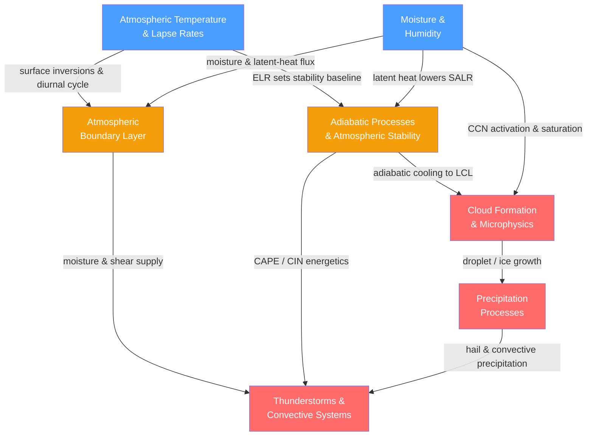

# Atmospheric Thermodynamics — Map of Content

> [!info] How to use this map
> Start with **Fundamentals**, follow the arrows, and use the Learning Path below as your guide.
> Each node links to a full note. Come back to this map when you feel lost.

---

## Concept Map

*(Blue = fundamental, Amber = intermediate, Red = advanced, arrows = "leads to" or "requires")*

---

## Notes in This Section

| Note | Key Concept | Level |
|------|-------------|-------|
| [[Atmospheric_Temperature_and_Lapse_Rates]] | Temperature decreases ~6.5 K/km through the troposphere; DALR, SALR, and inversions govern atmospheric stability | Beginner |
| [[Moisture_and_Humidity]] | Water vapor content (dew point, RH, specific humidity) and the Clausius-Clapeyron exponential saturation scaling (~7 %/K) | Beginner |
| [[Adiabatic_Processes_and_Atmospheric_Stability]] | Adiabatic expansion/compression sets parcel lapse rates; CAPE and CIN quantify convective energy and inhibition | Intermediate |
| [[Atmospheric_Boundary_Layer]] | Turbulent surface layer cycling between convective (day) and stable (night) regimes; Monin-Obukhov similarity theory | Intermediate |
| [[Cloud_Formation_and_Microphysics]] | Heterogeneous nucleation on CCN; Kohler theory; Bergeron-Findeisen ice process; aerosol-cloud radiative interaction | Intermediate |
| [[Precipitation_Processes]] | Collision-coalescence (warm rain) and ice-phase Bergeron pathway bridge the million-fold volume gap from droplet to raindrop | Intermediate |
| [[Thunderstorms_and_Convective_Systems]] | Organized deep convection from CAPE plus shear; supercell mesocyclones, mesoscale convective systems, lightning, and flash flooding | Advanced |

---

## Recommended Learning Path

*Recommended order for a first pass through this section:*

1. [[Atmospheric_Temperature_and_Lapse_Rates]] — begin here to establish the vertical temperature structure, the lapse rate concept, and how stability is judged by comparing environmental and adiabatic rates.
2. [[Moisture_and_Humidity]] — introduce water vapor quantities, dew point, and the Clausius-Clapeyron equation before any cloud or precipitation physics.
3. [[Adiabatic_Processes_and_Atmospheric_Stability]] — combine temperature and moisture knowledge to derive the DALR and SALR, understand the LCL/LFC/EL parcel journey, and interpret CAPE and CIN on a Skew-T diagram.
4. [[Atmospheric_Boundary_Layer]] — see how the surface shapes the lowest atmosphere through turbulent heat and moisture fluxes, diurnal cycling, and the Monin-Obukhov surface layer.
5. [[Cloud_Formation_and_Microphysics]] — follow rising, saturated parcels into the cloud: CCN nucleation, Kohler theory, ice nucleation, and the Bergeron process.
6. [[Precipitation_Processes]] — trace the microphysical pathway from cloud droplets to rain, snow, and hail via collision-coalescence and the ice-phase Bergeron-Findeisen-Wegener mechanism.
7. [[Thunderstorms_and_Convective_Systems]] — synthesize all prior concepts: CAPE, boundary-layer moisture and shear, and cloud microphysics combine to produce organized convection, supercells, and mesoscale convective systems.

---

## Key Questions This Topic Answers

- Why does temperature generally decrease with altitude, and what mechanisms produce temperature inversions that reverse this gradient and trap pollution or suppress convection?
- How is atmospheric stability assessed, and under what thermodynamic conditions does a quiescent, capped atmosphere erupt suddenly into deep, violent convection?
- Why does saturation vapor pressure increase exponentially with temperature, and what are the consequences for extreme precipitation intensity and climate feedbacks?
- How do cloud condensation nuclei and ice-nucleating particles control whether a cloud precipitates, and why do polluted maritime clouds rain less readily than clean ones?
- How does the atmospheric boundary layer's diurnal cycle of turbulent mixing govern surface air quality, wind energy resources, and the low-level moisture and shear that feed deep convection?
- What combination of thermodynamic ingredients (moisture, CAPE, CIN) and dynamic wind shear differentiates an ordinary pulse storm from a long-lived rotating supercell or nocturnal mesoscale convective system?

---

## Cross-Section Links

- [[_MOC_Atmospheric_Structure]] — the preceding section; covers the vertical layers, composition, and pressure-altitude profile that provide the static framework governing lapse rates, tropopause height, and stability analysis conducted in this section.
- [[_MOC_Atmospheric_Dynamics]] — the following section; covers the forces, winds, jets, and circulation systems that supply the vertical motion, frontal lifting, and deep-layer wind shear that trigger and organize the convective systems studied here.
- [[_MOC_Climate_System]] — a later section; connects atmospheric thermodynamic processes (water-vapor feedback, cloud radiative effects, Clausius-Clapeyron scaling of precipitation extremes) to the broader coupled climate system and its response to forcing.

---

## Cross-Vault Links

- [[Laws_of_Thermodynamics]] (Physics vault) — the first law of thermodynamics is the direct basis for the dry adiabatic lapse rate derivation (DALR = g/c_p) and for the CAPE heat-engine framework that powers thunderstorms.
- [[Kinetic_Theory_of_Gases]] (Physics vault) — ideal-gas relations, partial pressures, and the molecular-scale picture of evaporation and condensation underpin the humidity variables (specific humidity, mixing ratio) and the equilibrium behind Clausius-Clapeyron.
- [[Fluid_Statics_and_Properties]] (Physics vault) — hydrostatic balance governs the vertical pressure structure used throughout this section; viscous drag (Stokes' law) determines the terminal fall velocities of cloud droplets and precipitation particles.
- [[Phase_Equilibria_and_Colligative_Properties]] (Chemistry vault) — the liquid-vapor coexistence curve and Raoult's law underlie the Clausius-Clapeyron relation and the solute (Raoult) term in the Kohler equation for CCN droplet activation.
- [[Chemical_Thermodynamics]] (Chemistry vault) — Gibbs free energy of droplet formation provides the nucleation-barrier derivation from which Kohler theory and the critical supersaturation for cloud droplet activation are derived.

---

#MOC #Meteorology #AtmosphericThermodynamics
