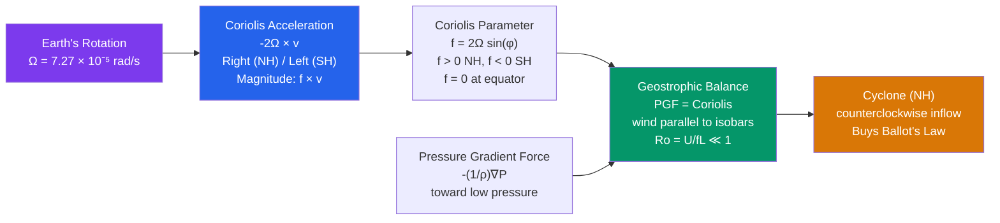

# 🌀 Coriolis Effect and Geostrophic Balance

> [!abstract] TL;DR
> The **Coriolis effect** is an *apparent* (fictitious) force that appears in a **rotating reference frame** such as the spinning Earth: it deflects any moving object **to the right in the Northern Hemisphere** and **to the left in the Southern Hemisphere**. Its acceleration is $-2\boldsymbol{\Omega}\times\mathbf{v}$, which is **zero at the equator and maximum at the poles**, with horizontal strength set by the **Coriolis parameter** $f = 2\Omega\sin\varphi$. **Geostrophic balance** is reached when this Coriolis force *exactly* balances the **pressure gradient force**, so that the resulting wind flows **parallel to the isobars** instead of straight from high toward low pressure. This single balance is the theoretical foundation of nearly all **large-scale atmospheric and oceanic flow**, and it is why **cyclones spin counterclockwise in the NH and clockwise in the SH** — and why free-atmosphere winds blow *along* pressure contours rather than *across* them.

---

## Intuition — analogy FIRST

Stand at the centre of a **playground merry-go-round** that is spinning **counterclockwise** (viewed from above), and roll a ball straight out to a friend on the rim. To you, standing on the spinning platform, the ball does **not** travel straight — it curves off **to the right** and misses your friend entirely. Nothing actually pushed it sideways; the ground simply **rotated underneath** the ball while it flew. To make Newton's laws work in your own spinning frame, you are *forced* to invent a sideways "force" that bends the path. That invented bookkeeping force is the **Coriolis force**, and the Earth is exactly that merry-go-round — turning counterclockwise beneath everything moving across the Northern Hemisphere.

Now picture air being squeezed from a **high-pressure** region toward a nearby **low**. The **pressure gradient force** pushes it directly toward the low, but the moment the air starts moving, Coriolis bends it to the right, and it keeps bending until the two forces point exactly opposite one another. At that point the air is no longer being pushed toward the low at all — it coasts **sideways, parallel to the isobars**, with low pressure on its left (in the NH). That standoff is **geostrophic balance**: not a race toward low pressure, but a sideways truce between the push of pressure and the deflection of rotation.

---

## How It Works

In the rotating frame of the Earth, Newton's second law picks up two extra "frame" terms. The **centrifugal** term is steady and gets quietly absorbed into what we call *effective gravity* (it slightly flattens the geoid). The **Coriolis** term, $-2\boldsymbol{\Omega}\times\mathbf{v}$, depends on the object's velocity and is the one that steers the winds. Horizontally it always acts **perpendicular** to the motion, so it can only **turn** a parcel, never speed it up or slow it down. When that turning force comes into balance with the pressure gradient force, the flow settles into the **geostrophic** state that dominates the mid-latitude free atmosphere.



**Deriving the Coriolis acceleration in a rotating frame.** For any vector $\mathbf{A}$, the time rate of change seen in an *inertial* frame relates to that seen in a frame rotating at angular velocity $\boldsymbol{\Omega}$ by $\left(\tfrac{d\mathbf{A}}{dt}\right)_{I} = \left(\tfrac{d\mathbf{A}}{dt}\right)_{R} + \boldsymbol{\Omega}\times\mathbf{A}$. Applying this rule **twice** to the position vector gives the acceleration transformation
$$\left(\frac{d^2\mathbf{r}}{dt^2}\right)_{I} = \left(\frac{d^2\mathbf{r}}{dt^2}\right)_{R} + 2\,\boldsymbol{\Omega}\times\mathbf{v}_{R} + \boldsymbol{\Omega}\times(\boldsymbol{\Omega}\times\mathbf{r}).$$
Rearranging for the acceleration *felt in the rotating frame* and using $\mathbf{F}=m\mathbf{a}_I$:
$$\left(\frac{d\mathbf{v}}{dt}\right)_{R} = \underbrace{\frac{\mathbf{F}}{m}}_{\text{real forces}} \; \underbrace{-\,2\,\boldsymbol{\Omega}\times\mathbf{v}}_{\text{Coriolis}} \; \underbrace{-\,\boldsymbol{\Omega}\times(\boldsymbol{\Omega}\times\mathbf{r})}_{\text{centrifugal}}.$$
The **Coriolis acceleration** $-2\boldsymbol{\Omega}\times\mathbf{v}$ is not a real force — it is the price of doing physics in a spinning frame.

**Projecting onto the local horizontal — the Coriolis parameter.** In local east–north–up coordinates the Earth's rotation vector is $\boldsymbol{\Omega} = \Omega\,(0,\ \cos\varphi,\ \sin\varphi)$ at latitude $\varphi$. Taking the cross product with the horizontal wind $\mathbf{v}=(u,v,w)$ and applying the **traditional approximation** (dropping the small vertical-velocity terms and the vertical Coriolis component) gives the two working equations
$$\text{Coriolis}_x = 2\Omega\sin\varphi\,v = f v, \qquad \text{Coriolis}_y = -2\Omega\sin\varphi\,u = -f u,$$
where the **Coriolis parameter** is
$$\boxed{\,f \equiv 2\Omega\sin\varphi\,}.$$
Because of the $\sin\varphi$, $f>0$ in the NH, $f<0$ in the SH, and $f=0$ **exactly at the equator** — the deep reason the tropics behave so differently from the mid-latitudes.

**Geostrophic balance.** The horizontal momentum equations (neglecting friction) are
$$\frac{Du}{Dt} = -\frac{1}{\rho}\frac{\partial P}{\partial x} + f v, \qquad \frac{Dv}{Dt} = -\frac{1}{\rho}\frac{\partial P}{\partial y} - f u.$$
For **steady, straight, frictionless, large-scale** flow the accelerations $Du/Dt$ and $Dv/Dt$ are negligible, so each equation collapses to a two-term balance whose solution is the **geostrophic wind**:
$$\boxed{\,u_g = -\frac{1}{f\rho}\frac{\partial P}{\partial y}, \qquad v_g = \frac{1}{f\rho}\frac{\partial P}{\partial x}\,} \qquad\Longleftrightarrow\qquad \mathbf{v}_g = \frac{1}{f\rho}\,\hat{\mathbf{k}}\times\nabla P.$$
The cross product with $\hat{\mathbf{k}}$ makes $\mathbf{v}_g$ point **90° to the pressure gradient**, i.e. *along* the isobars — with low pressure to the **left** of the wind in the NH.

**The Rossby number — when is flow geostrophic?** Comparing the size of the inertial (acceleration) term $\sim U^2/L$ to the Coriolis term $\sim fU$ gives the dimensionless
$$\text{Ro} = \frac{U}{fL}.$$
Geostrophic balance is a good approximation when $\text{Ro}\ll 1$ (large scale $L$, moderate speed $U$). A synoptic system has $U\sim 10$ m/s, $L\sim 10^6$ m, $f\sim 10^{-4}$ s$^{-1}$, so $\text{Ro}\sim 0.1$ — nicely geostrophic. A **bathtub drain** has $U\sim 0.1$ m/s, $L\sim 0.1$ m, so $\text{Ro}\sim 10^{4}$ — Coriolis is utterly negligible and cannot set the swirl direction.

**Buys Ballot's Law.** A practical restatement of geostrophy: in the **Northern Hemisphere**, stand with your **back to the wind** and lower pressure lies to your **left** (higher to your right); in the **Southern Hemisphere** it is mirror-reversed (lower pressure to your right). This lets a mariner locate the storm centre without a barometer map.

**Gradient wind — adding curvature.** Real isobars curve, so the parcel is *accelerating* centripetally. Adding the curvature term $v^2/R$ (with $R$ the radius of curvature, positive for cyclonic flow) gives the **gradient wind balance** along the normal direction
$$\frac{v^2}{R} + f v = \frac{1}{\rho}\frac{\partial P}{\partial n}.$$
Around a **low** (cyclonic) the centripetal term adds to Coriolis, so the actual wind is **subgeostrophic** (slower than $v_g$); around a **high** (anticyclonic) it opposes Coriolis, making the wind **supergeostrophic**, and — crucially — it imposes an **upper limit** on how strong an anticyclone's pressure gradient (and wind) can be. This is why deep, tightly-wound *lows* are common but tightly-wound *highs* are not.

**Cyclostrophic and inertial limits.** At the two extremes of the Rossby number, one term drops out entirely:
- **Cyclostrophic balance** ($\text{Ro}\gg 1$): pressure gradient balances centripetal acceleration alone, $v^2/R = \tfrac{1}{\rho}\partial P/\partial n$, with Coriolis negligible — the regime of **tornadoes and dust devils**, which can spin either direction.
- **Inertial oscillation** ($\nabla P \to 0$): with no pressure gradient, Coriolis balances the centripetal term of the parcel's own curving path, $v^2/R = fv \Rightarrow R = v/f$. The parcel traces a circle (an **inertial circle**) with **period $2\pi/f \approx 17$ h at 45° latitude**, clockwise in the NH.

**f-plane, β-plane, and Rossby waves.** For local problems we treat $f$ as constant (the **f-plane**). To capture the *meridional variation* of $f$ we linearise: the **β-plane** sets $f \approx f_0 + \beta y$ with
$$\beta \equiv \frac{\partial f}{\partial y} = \frac{2\Omega\cos\varphi}{a},$$
where $a$ is the Earth's radius. This gradient is the **restoring mechanism for Rossby (planetary) waves**, whose dispersion relation on the β-plane is
$$\omega = U k - \frac{\beta k}{k^2 + l^2},$$
implying that Rossby waves' phase always propagates **westward relative to the mean flow** — the dynamics behind meandering jet streams and mid-latitude blocking.

---

## Key Concepts / Details

### Secondary Level

- **Which way does it deflect?** Moving air (or water, or a plane, or a shell) is bent **to the right in the Northern Hemisphere** and **to the left in the Southern Hemisphere**. The deflection grows with speed and with latitude.
- **Why cyclones spin the way they do.** Air rushes *inward* toward a low-pressure centre; Coriolis bends every inflowing stream to its right (NH), and the collective result is a **counterclockwise** spiral. In the SH the right-hand rule flips, so lows spin **clockwise**.
- **Buys Ballot's Law (the sailor's rule).** In the NH, put your back to the wind — the storm's low centre is off to your **left**. A quick way to point at a hurricane without instruments.
- **Why the equator has no Coriolis.** Since $f = 2\Omega\sin\varphi$ and $\sin 0° = 0$, the Coriolis force **vanishes at the equator**. This is why organized cyclones essentially never form within a few degrees of the equator — there is nothing to give the inflow its spin.
- **The bathtub myth.** No, your sink does not drain a fixed way because of the hemisphere. The swirl of a draining basin is dominated by the basin's shape, leftover motion, and jets from the tap. The Coriolis force is roughly **ten thousand times too weak** at that scale to matter (its Rossby number is enormous).

### Undergraduate Level

**Coriolis acceleration, component form.** From $-2\boldsymbol{\Omega}\times\mathbf{v}$ under the traditional approximation, the horizontal contributions to the momentum equations are
$$\left(\frac{Du}{Dt}\right)_{\text{Cor}} = +f v = 2\Omega\sin\varphi\,v, \qquad \left(\frac{Dv}{Dt}\right)_{\text{Cor}} = -f u = -2\Omega\sin\varphi\,u.$$
Note the force is **perpendicular to $\mathbf{v}$** ($\mathbf{v}\cdot\mathbf{F}_{\text{Cor}} = 0$): it does no work and changes **direction, not speed**.

**Geostrophic wind (recap).** Setting $Du/Dt=Dv/Dt=0$ and friction to zero:
$$u_g = -\frac{1}{f\rho}\frac{\partial P}{\partial y}, \qquad v_g = \frac{1}{f\rho}\frac{\partial P}{\partial x}.$$
A worked value: with $\partial P/\partial y = -2$ Pa/km $= -2\times10^{-3}$ Pa/m, $\rho = 1.2$ kg/m³, $f = 10^{-4}$ s⁻¹,
$$u_g = -\frac{1}{(10^{-4})(1.2)}(-2\times10^{-3}) \approx +16.7\ \text{m/s (from the west)}.$$

**Rossby number as the referee.** $\text{Ro} = U/(fL)$ measures inertia against rotation. **$\text{Ro}\ll 1$** ⟹ rotation dominates ⟹ geostrophy is valid (synoptic weather, ocean gyres). **$\text{Ro}\gg 1$** ⟹ inertia dominates ⟹ Coriolis irrelevant (tornado, bathtub). $\text{Ro}\sim 1$ ⟹ full gradient-wind treatment needed.

**Gradient wind and the anticyclone limit.** Solving the quadratic $\tfrac{v^2}{R} + fv - \tfrac{1}{\rho}\partial P/\partial n = 0$ for regular (physical) roots shows that for an **anticyclone** the pressure gradient cannot exceed $\rho f^2 R/4$; beyond that there is *no real gradient-wind solution*. Consequence: **highs have weak, gentle winds**; the destructive winds live in the **lows**.

**Inertial oscillations.** With the pressure gradient removed, a displaced parcel obeys $du/dt = fv,\ dv/dt = -fu$, whose solution is a **circle of radius $R=U/f$** traversed with **period $T_i = 2\pi/f$**. At 45°N, $f\approx 1.03\times10^{-4}$ s⁻¹, so $T_i\approx 16.9$ h — a signal clearly seen in ocean-current and drifter records after a wind burst.

**The ocean analogue — Sverdrup balance.** In the interior of an ocean basin, the wind-stress curl is balanced by the meridional advection of planetary vorticity: $\beta v = \tfrac{1}{\rho}\,\hat{\mathbf{k}}\cdot(\nabla\times\boldsymbol{\tau})$. This **Sverdrup balance** predicts the broad, slow interior return flow of the wind-driven gyres, closed by narrow **western boundary currents** (the Gulf Stream, Kuroshio).

**Taylor–Proudman theorem.** In a rapidly rotating, homogeneous (barotropic), low-Rossby-number fluid, the geostrophic/hydrostatic equations force $\partial\mathbf{u}/\partial z = 0$: the flow becomes **two-dimensional and columnar**, with fluid moving in rigid "Taylor columns" aligned with the rotation axis. It is the fluid-dynamical reason rotating flows resist vertical shear.

### Graduate Level

**The full Coriolis vector and the traditional approximation.** Keeping all components of $-2\boldsymbol{\Omega}\times\mathbf{v}$ with $\boldsymbol{\Omega}=\Omega(0,\cos\varphi,\sin\varphi)$ yields, in addition to $f v$ and $-f u$, the terms $-2\Omega\cos\varphi\,w$ (in the zonal equation) and $+2\Omega\cos\varphi\,u$ (in the vertical). The **traditional approximation** discards these $\tilde f = 2\Omega\cos\varphi$ ("non-traditional") terms because, for shallow, hydrostatic, large-scale motion, $w\ll u$ and the vertical Coriolis term is dwarfed by gravity and the vertical pressure gradient. Retaining them matters for deep convection, equatorial dynamics, and the ocean's deep circulation.

**β-plane and Rossby wave propagation.** Linearising the barotropic vorticity equation on the β-plane, $\tfrac{\partial}{\partial t}\nabla^2\psi + \beta\tfrac{\partial\psi}{\partial x} = 0$, and seeking $\psi\propto e^{i(kx+ly-\omega t)}$ gives the dispersion relation
$$\omega = U k - \frac{\beta k}{k^2 + l^2}.$$
The **zonal phase speed** is $c = \omega/k = U - \beta/(k^2+l^2)$, which is **always westward relative to the mean flow** because $\beta>0$. Long waves (small $k^2+l^2$) can propagate westward *fast enough to become stationary or retrograde*; this is precisely what produces persistent, quasi-stationary **blocking highs** and the slow eastward march of shorter synoptic waves. The $\beta$ term — the poleward increase of planetary vorticity — is the entire restoring mechanism; without it (f-plane) there are no Rossby waves.

**Potential vorticity conservation.** For shallow-water flow the **potential vorticity** $q = (f+\zeta)/h$ (absolute vorticity over fluid depth) is materially conserved: $Dq/Dt=0$. As a column is stretched ($h\uparrow$) it spins up ($\zeta\uparrow$); as it moves poleward ($f\uparrow$) it must spin *down* to compensate — the mechanism behind lee cyclogenesis, the westward drift of eddies, and Rossby-wave restoration. PV is the master conserved quantity that unifies vorticity, stratification, and rotation.

**Equatorial dynamics and Kelvin waves.** Near the equator $f\to 0$, so geostrophy fails and one uses the **equatorial β-plane** $f\approx\beta y$. This supports a special family of trapped modes — **equatorial Rossby, mixed Rossby–gravity, and Kelvin waves**. The **Kelvin wave** is remarkable: it has *no meridional velocity* and needs no Coriolis force to exist (it is trapped instead by a coast or by the equator acting as a waveguide), propagating **eastward** along the equator. Equatorial Kelvin waves are central to **ENSO** and the Madden–Julian Oscillation.

**Hurricane eyewall balance.** In a mature tropical cyclone the primary circulation is very nearly in **gradient wind balance**: the inward pressure gradient force is balanced by the sum of the Coriolis and centripetal (centrifugal) forces, $\tfrac{1}{\rho}\partial P/\partial r = \tfrac{v^2}{r} + fv$. Near the eyewall the **centripetal term dominates** (small $r$, large $v$, so locally $\text{Ro}\gg 1$ and the balance is nearly *cyclostrophic*), while at larger radii Coriolis becomes comparable. This gradient-wind structure, combined with **thermal-wind** decay of the vortex with height, explains the warm-core, ring-shaped wind maximum of a hurricane.

---

## Python demo — an inertial oscillation under Coriolis alone

The script integrates a parcel that feels **only the Coriolis force** (no pressure gradient, no friction) in the Northern Hemisphere: $du/dt = fv,\ dv/dt = -fu$, together with $dx/dt=u,\ dy/dt=v$. The parcel is given a small initial eastward velocity (say a sudden 10 m/s wind burst) and then left to evolve for 48 hours with $f=10^{-4}$ s⁻¹. The result is a **clockwise inertial circle** of radius $R=U_0/f$ and period $T_i = 2\pi/f$. Runnable with `numpy`, `scipy`, and `matplotlib`.

```python
# Inertial oscillation: a parcel steered by the Coriolis force alone (NH).
# Momentum:  du/dt =  f v ,  dv/dt = -f u   (f > 0 in the Northern Hemisphere)
# Position:  dx/dt =  u   ,  dy/dt =  v
import numpy as np
import matplotlib.pyplot as plt
from scipy.integrate import odeint

f  = 1.0e-4                    # Coriolis parameter (s^-1), ~ 43.3 deg N
U0 = 10.0                      # initial eastward speed (m/s), e.g. a wind burst
T_inertial = 2.0 * np.pi / f   # inertial period (s)
R = U0 / f                     # inertial radius (m)

def rhs(state, t, f):
    x, y, u, v = state
    return [u, v, f * v, -f * u]

t = np.linspace(0.0, 48 * 3600.0, 4001)     # 48 hours, 1001 pts/12h
state0 = [0.0, 0.0, U0, 0.0]                 # start at origin, moving east
x, y, u, v = odeint(rhs, state0, t, args=(f,)).T

print(f"Inertial period = {T_inertial/3600:.2f} h")
print(f"Inertial radius = {R/1000:.1f} km")

fig, (ax1, ax2) = plt.subplots(1, 2, figsize=(12, 5))

# (1) Trajectory in x-y: a clockwise circle in the Northern Hemisphere
ax1.plot(x / 1000.0, y / 1000.0, 'b-', lw=1.5)
ax1.plot(0, 0, 'ko', label='release point')
ax1.set_xlabel('x  (km, east)'); ax1.set_ylabel('y  (km, north)')
ax1.set_title('Inertial oscillation trajectory (NH: clockwise)')
ax1.set_aspect('equal'); ax1.grid(True); ax1.legend()

# (2) Velocity components: 90 deg out of phase, period 2*pi/f
ax2.plot(t / 3600.0, u, 'r-', label='u  (eastward)')
ax2.plot(t / 3600.0, v, 'g-', label='v  (northward)')
ax2.axhline(0, color='k', lw=0.6)
ax2.set_xlabel('time  (h)'); ax2.set_ylabel('velocity  (m/s)')
ax2.set_title(f'Velocities oscillate at f  (period ~ {T_inertial/3600:.1f} h)')
ax2.grid(True); ax2.legend()

plt.tight_layout(); plt.show()
```

Expected output: `Inertial period = 17.45 h`, `Inertial radius = 100.0 km`. The left panel shows the parcel tracing a **closed clockwise circle** (velocity always deflected to the *right* of motion, as required in the NH), completing roughly **2.75 loops** in 48 hours. The right panel shows $u(t)$ and $v(t)$ as sinusoids **90° out of phase** at the inertial frequency $f$ — the mathematical signature of pure rotation with no change in speed, only in direction.

---

## Real-World Notes

- **Typhoon Haiyan (2013)** was a Western North Pacific system — a **Northern Hemisphere** cyclone — and spun **counterclockwise**, its intense inflow bent rightward into one of the strongest landfalling storms on record. By contrast, **Severe Tropical Cyclone Yasi (2011)**, which struck Queensland, Australia, was a **Southern Hemisphere** system and rotated **clockwise** — the two together are a clean confirmation of the hemisphere-dependent Coriolis deflection.
- **Long-range artillery and ballistic missiles** must correct for Coriolis: over ranges beyond ~100 km and long flight times, the rightward (NH) deflection of the projectile becomes tens to hundreds of metres, and naval and strategic fire-control computers explicitly include the $-2\boldsymbol{\Omega}\times\mathbf{v}$ term.
- **Subtropical ocean gyres** rotate **clockwise in the Northern Hemisphere** (North Atlantic, North Pacific) and **counterclockwise in the Southern Hemisphere**, driven by the wind-stress pattern working with Coriolis through **Sverdrup balance**, and closed by intensified **western boundary currents** like the Gulf Stream and Kuroshio.
- **Foucault's pendulum** makes the Earth's rotation visible in a museum atrium: the plane of its swing **precesses clockwise in the Northern Hemisphere** with a period of one sidereal day divided by $\sin\varphi$ (about 32 hours at mid-latitudes) — a direct, room-scale manifestation of the same rotating-frame physics that steers the winds.
- **Scale is everything.** A hurricane ($\text{Ro}\approx 0.1$) is profoundly shaped by Coriolis — it sets the rotation sense and the large-scale balance — whereas a draining bathtub ($\text{Ro}\approx 10^{4}$) is completely unaffected: the same force, four orders of magnitude apart in relative importance because of the Rossby number.

---

## Common Pitfalls

1. **Treating Coriolis as a *real* force.** It is a **fictitious (inertial) force** that exists only in the rotating frame. In an inertial (non-rotating) frame the object simply moves in a straight line while the Earth turns beneath it — there is no sideways push at all. The "force" is a bookkeeping term that lets Newton's laws work in a spinning frame.
2. **"Coriolis makes bathtubs and toilets drain a certain way."** False. At household scales $\text{Ro}\approx 10^{4}\gg 1$, so Coriolis is thousands of times weaker than the residual swirl, basin geometry, and inflow jets that actually set the drain direction. Only in extraordinarily controlled experiments does the effect show up.
3. **Thinking Coriolis changes an object's speed.** Because it acts **perpendicular to the velocity** ($\mathbf{F}_{\text{Cor}}\cdot\mathbf{v}=0$), the Coriolis force does **no work** — it changes only the **direction** of motion, never the kinetic energy or speed.
4. **Forgetting that Coriolis vanishes at the equator.** Since $f=2\Omega\sin\varphi = 0$ at $\varphi=0$, there is no rotational deflection there. This is exactly why the **ITCZ** is a band of *convergence and deep convection but not cyclone formation* — inflowing air has no Coriolis torque to organize it into a spinning vortex within a few degrees of the equator.
5. **Assuming geostrophic balance is exact.** It is a *leading-order* approximation. The small **ageostrophic** departures ($\mathbf{v}-\mathbf{v}_g$) are what actually matter for weather: they drive the horizontal **convergence/divergence** that forces **vertical motion**, cloud, and precipitation. A perfectly geostrophic atmosphere would have no weather at all.

---

## Related Concepts

- [[_MOC_Atmospheric_Dynamics]] — section map for the atmospheric-dynamics chapter of this vault.
- [[Pressure_Gradient_Force_and_Winds]] — the *other* half of geostrophic balance; the force Coriolis stands against to produce winds along the isobars.
- [[Jet_Streams_and_Upper_Level_Flow]] — geostrophy and thermal wind applied to the upper troposphere; Rossby-wave meanders of the jet.
- [[Fronts_and_Extratropical_Cyclones]] — cyclonic (counterclockwise, NH) circulations whose spin sense and balance this note explains.
- [[Tropical_Meteorology_and_Monsoons]] — the low-$f$, near-equatorial regime where geostrophy breaks down and Kelvin/equatorial waves take over.
- [[Global_Atmospheric_Circulation]] — Hadley, Ferrel, and Polar cells; trade winds and westerlies as consequences of Coriolis deflection.
- [[Ocean_Atmosphere_Coupling_and_ENSO]] — equatorial Kelvin and Rossby waves (no/weak Coriolis) that drive El Niño.
- [[_MOC_Physics_Master]] — cross-vault entry point to the underlying mechanics.
- [[Rotational_Dynamics]] — angular velocity, rotating frames, and the fictitious forces (centrifugal, Coriolis) that arise in them.
- [[Newtons_Laws_and_Kinematics]] — the inertial-frame laws that, transformed into a rotating frame, generate the Coriolis term.
- [[_MOC_Earth_Science_Master]] — cross-vault entry point to Earth-system science.
- [[Geomagnetism_and_Paleomagnetism]] — the Earth's rotation also organizes the geodynamo; a parallel rotating-fluid (Taylor–Proudman) system in the core.

---

## Review Questions

**Secondary.** In which direction does a low-pressure system (cyclone) rotate in the **Northern Hemisphere**, and why does the inflowing air produce that particular sense of spin? Suppose the Coriolis effect were **twice as strong** everywhere — for the *same* pressure gradient, would the resulting geostrophic winds be **faster or slower**? (Hint: look at where $f$ sits in $u_g = -\tfrac{1}{f\rho}\partial P/\partial y$.)

**Undergraduate.** **(a)** Starting from the horizontal momentum equations, derive the geostrophic wind relations by setting the time derivative and friction to zero, and state in words why the wind ends up **parallel to the isobars**. **(b)** Compute $u_g$ given $\partial P/\partial y = -2$ Pa/km, $\rho = 1.2$ kg/m³, and $f = 10^{-4}$ s⁻¹. **(c)** Explain *physically and mathematically* why geostrophic balance **breaks down at the equator**. **(d)** Define the **Rossby number** and state the value that separates "balanced" (geostrophic) from "unbalanced" flow.

**Graduate.** Derive the **Rossby wave dispersion relation** $\omega = Uk - \beta k/(k^2+l^2)$ from the linearised barotropic vorticity equation on the **β-plane**. What is the physical significance of the $\beta$ term, and why does its sign force Rossby waves to propagate **westward relative to the mean flow**? Finally, explain how this westward phase propagation — combined with the near-cancellation of $c$ by the mean flow for long waves — accounts for the persistence of **blocking patterns** in the mid-latitude atmosphere.

---

## Sources

- Holton, J. R., & Hakim, G. J. — *An Introduction to Dynamic Meteorology* (5th ed.), Academic Press. Rotating-frame derivation of the Coriolis force, geostrophic and gradient wind balance, Rossby number, β-plane, and Rossby waves.
- Pedlosky, J. — *Geophysical Fluid Dynamics* (2nd ed.), Springer. Potential vorticity conservation, quasi-geostrophic theory, Rossby-wave dynamics, and boundary-layer/Sverdrup balance.
- Cushman-Roisin, B., & Beckers, J.-M. — *Introduction to Geophysical Fluid Dynamics* (2nd ed.), Academic Press. Inertial oscillations, the Taylor–Proudman theorem, f-plane vs β-plane, and equatorial (Kelvin) dynamics.

---

#Meteorology #AtmosphericDynamics #CoriolisEffect #GeostrophicBalance #CoriolisForce
