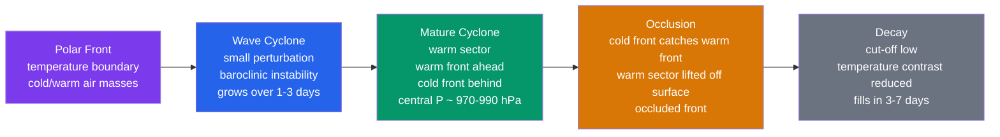

# 🌀 Fronts and Extratropical Cyclones

> [!abstract] TL;DR
> **Extratropical cyclones** (midlatitude lows) are the large-scale ($1000\text{–}3000$ km) weather systems that dominate day-to-day weather in the $30\text{–}70°$ latitude belt. They form along the **polar front** — the sharp boundary between cold polar and warm tropical air — through **baroclinic instability**, the process that converts **available potential energy** stored in horizontal temperature gradients into the **kinetic energy** of the swirling storm. The **Norwegian cyclone model** (Bjerknes & Solberg, 1919–1922) describes the lifecycle: a small **wave** on the polar front grows into a **mature cyclone** with a **warm front** leading and a **cold front** trailing a wedge of warm-sector air, which is then lifted clear of the surface at **occlusion** before the system **decays**. **Fronts** are narrow zones of strong temperature, moisture, and wind-shift gradients that organize the cyclone's precipitation. In the Northern Hemisphere, cyclones develop preferentially **east of the Rocky Mountains** and along the **North Atlantic and North Pacific storm tracks**, where baroclinicity and the jet stream are strongest.

---

## Intuition — analogy FIRST

Picture a mature cyclone as a **giant atmospheric conveyor belt** wrapping two air masses of very different temperature around each other. The **warm-sector air** — warm, moist, tropical — is buoyant, so ahead of the storm it slides *up and over* the retreating cold air along the **warm front** like riding a long, gentle ramp. As it rises it cools, condenses, and spreads a broad shield of layered **stratiform cloud and steady rain** hundreds of kilometres ahead of the surface low. Behind the warm sector, the advancing **cold front** acts like a **bulldozer blade**: dense cold air noses *under* the warm air and shoves it violently upward, so the ascent is fast and narrow, triggering a thin line of heavy, often **convective** downpours and gusty wind shifts.

The whole machine runs on one thing: the **temperature contrast** between cold polar and warm tropical air. The atmosphere is like a **heat engine** trying to mix two fluids of different temperature — cold-dense on one side, warm-light on the other. Left alone this arrangement is top-heavy in *potential* energy; nature finds it easier to let the cold air slide under and the warm air ride over, releasing that stored energy as the *motion* of a growing storm. When the temperature contrast is finally smeared out — the two fluids mixed — the engine has no fuel left, and the cyclone spins down.

---

## How It Works

A cyclone is not "pushed" into existence by surface heating; it **grows spontaneously** from a tiny disturbance on the polar front because the sheared, temperature-contrasting flow is **baroclinically unstable**. The energy source is the tilted density surfaces: cold air poleward, warm air equatorward, with pressure surfaces sloping across them. A perturbation that lets cold air sink equatorward and warm air rise poleward **lowers the centre of mass of the whole column**, and the released potential energy appears as the kinetic energy of the developing wave. The upper-level **jet stream** and its travelling **troughs and ridges** are the other half of the machine: they provide the divergence aloft that lets surface pressure fall.



**Air masses set the stage.** Before there is a front there must be two contrasting **air masses**, each a broad body of air made quasi-uniform in temperature and humidity by long residence over a **source region** (see the Bergeron classification below). A front is simply the *transition zone* — typically $50\text{–}200$ km wide at the surface — where two such air masses meet.

**Frontal slope and structure.** Fronts are not vertical walls; they are gently sloping surfaces because the denser (colder) air always wedges *underneath* the warmer air. The slope $\alpha$ is set by the **Margules relation**, a thermal-wind balance across the front:
$$\tan\alpha = \frac{f}{g}\,\frac{\rho_c v_c - \rho_w v_w}{\rho_c - \rho_w} \;\approx\; \frac{f\,\bar T}{g}\,\frac{v_c - v_w}{\Delta T},$$
which yields shallow slopes of order $1{:}50$ to $1{:}300$. **Cold fronts are relatively steep** (slope $\sim 1{:}50$ to $1{:}100$ near the ground, and they even bulge forward at low levels through surface friction), so their ascent is fast and their passage abrupt. **Warm fronts are gentle** ($\sim 1{:}150$ to $1{:}300$), so warm air glides up a long ramp, producing a broad, slowly-changing cloud shield.

**Upper-level control: vorticity advection and the omega equation.** Surface cyclogenesis is *forced from aloft*. Where the mid-tropospheric (500 hPa) flow carries a **positive-vorticity anomaly downstream of a trough** — i.e. **positive vorticity advection (PVA)** that *increases with height* — quasi-geostrophic theory demands **upper-level divergence**. That divergence evacuates mass from the column faster than it is resupplied, so **surface pressure falls** and a low deepens. The link is made quantitative by the **quasi-geostrophic omega equation**, whose two forcing terms are (i) *differential vorticity advection* (PVA increasing with height $\Rightarrow$ ascent) and (ii) the *Laplacian of temperature advection* (warm advection $\Rightarrow$ ascent):
$$\left(\sigma\nabla^2 + f_0^2\frac{\partial^2}{\partial p^2}\right)\omega \;=\; f_0\frac{\partial}{\partial p}\!\left[\mathbf{V}_g\!\cdot\!\nabla\left(\zeta_g + f\right)\right] \;+\; \nabla^2\!\left[\mathbf{V}_g\!\cdot\!\nabla\left(-\frac{\partial\Phi}{\partial p}\right)\right].$$
Because the left side behaves like $-\omega$, positive forcing on the right gives $\omega<0$ (ascent). The modern **Q-vector** form collapses both terms into one, $\propto -\nabla\!\cdot\!\mathbf{Q}$, so **Q-vector convergence marks rising motion** and thus the cloud and precipitation regions of the cyclone.

**Conveyor belts organize the weather.** The three-dimensional airflow of a mature cyclone is best understood as a set of coherent relative-flow streams (Harrold & Browning, 1970s):
- The **warm conveyor belt (WCB)** is a broad stream of warm, moist, tropical-origin air that flows poleward in the warm sector and **ascends ahead of and over the cold and warm fronts**, rising from the boundary layer to the upper troposphere. It produces the *bulk of the cyclone's precipitation* and its outflow forms the leading cirrus shield.
- The **cold conveyor belt (CCB)** is a lower, colder stream that flows *rearward* beneath the warm front, wraps cyclonically around the low, and helps build the **bent-back warm front**. Its acceleration can spawn a damaging **sting jet**.
- Sinking **dry air** from the upper troposphere descends behind the cold front (the "dry intrusion"), sharpening the cloud edge and, on satellite imagery, carving the storm's unmistakable **comma cloud** signature.

**Explosive deepening ("bombs") and seclusion.** When strong upper-level PVA overlies a region of intense low-level baroclinicity and warm sea-surface temperatures, the central pressure can plummet. The **Bergen-school criterion** for **explosive cyclogenesis (a "bomb")** is a central-pressure fall of at least $24$ hPa in $24$ h (latitude-adjusted). Such storms often follow the **Shapiro–Keyser** rather than the classic Norwegian evolution: the cold and warm fronts *fracture* apart into a **T-bone** structure, the bent-back warm front wraps around the centre, and warm air is **secluded** in a warm core at the storm's heart — the cyclone can keep intensifying even after it "occludes."

---

## Key Concepts / Details

### Secondary Level

- **The three fronts on a weather map.** A **cold front** is drawn as a blue line with **triangles** pointing the way it moves; a **warm front** is a red line with **semicircles**; an **occluded front** is purple with *alternating* triangles and semicircles; a **stationary front** alternates blue triangles and red semicircles pointing opposite ways.
- **What you feel as a warm front passes.** First high cirrus, then a lowering, thickening deck of stratus and nimbostratus; **steady, light-to-moderate rain for many hours**; then the rain stops, temperature and humidity **rise**, skies partly clear, and the wind veers (in the NH, backs to a more southwesterly direction). You are now in the **warm sector**.
- **What you feel as a cold front passes.** A **narrow band of heavy showers or thunderstorms**, often over in under an hour; a sharp **wind shift** and gusts; then a rapid **temperature and dewpoint drop**, rising pressure, and clearing to cool, bright, gusty air behind.
- **Air-mass source regions.** Air takes on the character of where it sits: cold and dry over high-latitude land (**continental polar, cP** — e.g. Canada, Siberia); warm and moist over tropical oceans (**maritime tropical, mT** — e.g. Gulf of Mexico, subtropical Atlantic); cool and moist over cold oceans (**maritime polar, mP**); bitterly cold over the Arctic ice (**continental arctic, cA**).
- **Reading a surface map.** Find the **L** (low) and **H** (high); isobars (lines of equal pressure) that are **packed tightly mean strong wind**; trace the fronts spiralling counter-clockwise (NH) out of the low; the warm sector sits in the wedge *between* the warm front (ahead) and the cold front (behind).
- **Why lows bring rain and highs bring fair weather.** In a **low**, surface winds spiral *inward* and **converge**, forcing air to **rise, cool, and condense** → clouds and rain. In a **high (anticyclone)**, air **sinks and diverges**, warming and drying as it descends → clear, calm, settled weather.

### Undergraduate Level

**Bergeron air-mass classification.** Air masses are labelled by a lowercase letter for the *surface* (moisture) and an uppercase letter for the *latitude* (temperature):

| Symbol | Source | Character |
|---|---|---|
| **cA** | Continental Arctic | Extremely cold, very dry (ice caps, winter high latitudes) |
| **cP** | Continental Polar | Cold, dry (high-latitude continents) |
| **mP** | Maritime Polar | Cool, moist (cold oceans; N. Pacific, N. Atlantic) |
| **mT** | Maritime Tropical | Warm, very moist (tropical/subtropical oceans) |
| **cT** | Continental Tropical | Hot, dry (subtropical deserts) |

The clash of **cP** (or **cA**) against **mT** along the polar front is the classic North-American/European cyclogenesis pairing.

**Frontal slope, quantitatively.** From the Margules relation, cold fronts are **steep** ($\sim 1{:}50\text{–}1{:}100$) and warm fronts are **gentle** ($\sim 1{:}150\text{–}1{:}300$). This single geometric fact explains the entire difference in weather: steep + fast-moving cold air $\Rightarrow$ vigorous, narrow, convective uplift (heavy showers, brief passage); shallow + slow warm air $\Rightarrow$ gentle, broad, stratiform uplift (steady rain, gradual passage). The **dryline** (a moisture but *not* temperature boundary, e.g. over the US Great Plains) is a related frontal feature that focuses severe convection.

**Norwegian cyclone-model lifecycle.** (1) **Stationary/polar front** — a quasi-stationary temperature boundary. (2) **Incipient wave** — a kink forms; cold air pushes equatorward on one side (nascent cold front), warm air poleward on the other (nascent warm front). (3) **Open wave / mature stage** — a clear **warm sector** opens between the fronts; the low deepens; precipitation shields organize. (4) **Occlusion** — the faster cold front overtakes the warm front, **lifting the warm sector off the surface**; the joined boundary is the **occluded front** (cold-type if the air behind is colder than ahead, warm-type if warmer). (5) **Decay** — cut off from its warm-air energy supply, the low becomes a cold-core **cut-off low** and fills in over several days.

**500 hPa vorticity advection $\to$ surface cyclogenesis.** This is the operational heart of forecasting deepening lows. Downstream (east) of an upper trough the geostrophic wind advects the trough's **high absolute vorticity** into a region of lower vorticity — **positive vorticity advection (PVA)**. Since the QG vorticity equation ties local vorticity change to advection *and* to divergence, PVA that intensifies with height requires **upper-level divergence** aloft. Divergence aloft $\Rightarrow$ column stretching $\Rightarrow$ **rising motion** and **falling surface pressure** beneath and slightly downstream — a surface low deepens under and east of the upper trough. Conversely, negative vorticity advection under a ridge favours surface highs.

**Warm conveyor belt (WCB).** The single most important precipitation mechanism in a cyclone: a $\sim 1000$-km-long stream of warm, moist air (often mT origin) that starts in the boundary layer of the warm sector and **ascends conveyor-fashion** ahead of the cold front and up over the warm front, reaching the upper troposphere. It generates the broad **nimbostratus rain shield** ahead of the low and, at its far end, the **atmospheric-river** moisture plumes and the leading cirrus.

**Cold conveyor belt (CCB) and the sting jet.** A lower, cooler stream flows rearward *beneath* the warm-frontal surface, then turns cyclonically to build the **bent-back warm front**. In rapidly deepening Shapiro–Keyser storms, a mesoscale descending branch — the **sting jet** — can accelerate out of the tip of the bent-back front's cloud head and deliver the storm's most damaging surface gusts.

**Satellite "comma cloud."** In the mature stage the cloud shield takes on a **comma shape**: the WCB's broad, bright head and the cirrus plume form the comma's "ball," while the cold front's cloud band forms the trailing "tail." A sharpening, dry (dark) slot wrapping into the centre — the **dry intrusion** — signals a deepening, well-organized system.

**Bomb cyclogenesis.** The **"bomb"** threshold (Sanders & Gyakum, 1980, after the Bergen school) is a central-pressure fall of $\geq 24$ hPa in $24$ h, normalized to $60°$ latitude as $\big(24\,\text{hPa}\big)\!\times\!\sin\phi/\sin 60°$. Bombs occur almost exclusively **over the oceans**, where the warmest sea-surface temperatures and strongest low-level baroclinicity coincide — the **Gulf Stream** and **Kuroshio** western-boundary currents are the world's premier bomb factories.

### Graduate Level

**Baroclinic instability — the Eady model (1949).** Eady idealized the atmosphere as a uniformly stratified ($N$ = const), uniformly sheared ($U(z)=\Lambda z$) Boussinesq fluid between two rigid horizontal boundaries a depth $H$ apart, on an $f$-plane. Small wave perturbations $\propto e^{ik(x-ct)}$ obey a dispersion relation whose phase speed becomes **complex** — i.e. the wave **grows** — for horizontal wavenumbers below a cutoff. Writing the non-dimensional wavenumber $\mu = k\,L_R$ with the **Rossby radius of deformation** $L_R = NH/f$, the growth rate is
$$\sigma = k\,c_i = \frac{\Lambda f}{N}\,\sqrt{\left(\coth\tfrac{\mu}{2}-\tfrac{\mu}{2}\right)\!\left(\tfrac{\mu}{2}-\tanh\tfrac{\mu}{2}\right)}.$$
This has a **short-wave cutoff** at $\mu_c \approx 2.399$ (where $\tfrac{\mu}{2}=\coth\tfrac{\mu}{2}$) and a **maximum** at $\mu_{\max}\approx 1.61$, giving the classic results:
$$\boxed{\;L_{\text{Eady}} = \frac{2\pi}{k_{\max}} \approx 3.9\,\frac{NH}{f}\;,\qquad \sigma_{\max}\approx 0.31\,\frac{f\,U}{N H}\;}$$
where $U=\Lambda H$ is the wind difference across the layer. With $N=0.01\ \text{s}^{-1}$, $H=10$ km, $f=10^{-4}\ \text{s}^{-1}$, $L_R = 1000$ km, so the **most unstable wavelength is $\sim 3900$ km** — precisely the observed scale of midlatitude cyclones — and for $U\sim 20$ m/s the **e-folding growth time is $\sim 2$ days**, matching observed spin-up.

**Charney–Stern necessary condition.** For instability the **meridional gradient of quasi-geostrophic potential vorticity must change sign** somewhere in the domain (interior *or*, via boundary temperature gradients, at the top/bottom). In the Eady problem the interior PV gradient is zero, so instability is supplied entirely by the **surface and tropopause temperature (boundary) gradients** — the two boundaries host counter-propagating edge waves. This boundary interpretation is the gateway to the PV view.

**Potential-vorticity (PV) view — Hoskins' "PV thinking."** A cyclone is the phase-locked interaction of **two Rossby edge waves**: an **upper-level PV anomaly** on the sloping tropopause (a stratospheric intrusion of high PV) and a **surface warm-temperature anomaly** (which behaves as a positive PV anomaly at the lower boundary). Each anomaly induces a circulation that reaches the other's level. When the upper PV anomaly sits *upstream* (to the west) of the surface warm anomaly — so the system **tilts westward with height** — each wave's circulation **advects its partner to reinforce and hold it in phase**, and both amplify: **mutual amplification**. The westward tilt with height and the poleward heat flux are the observable fingerprints of baroclinic growth; when the waves become vertically stacked (no tilt), growth ceases and the storm matures.

**Life cycles LC1 vs LC2 (Thorncroft, Hoskins & McIntyre, 1993).** Nonlinear baroclinic waves break in two archetypes distinguished by the ambient horizontal shear. **LC1 — anticyclonic wave breaking**: the upper trough thins and is drawn out **equatorward** into narrow cyclonic PV filaments; frontogenesis is dominated by the cold front; typical of anticyclonic (poleward-flank) shear. **LC2 — cyclonic wave breaking**: the trough **wraps up poleward** into a strong, deep **cut-off cyclonic vortex**; the warm front and seclusion dominate; typical of cyclonic shear. The two lifecycles feed back differently on the jet and are central to how cyclones drive the large-scale circulation.

**Sting jet.** A **subsynoptic (mesoscale) low-level wind maximum** ($\lesssim 100$ km across) that descends from the tip of the bent-back warm-frontal cloud head in intensely deepening Shapiro–Keyser cyclones. Evaporative and sublimative cooling of hydrometeors, together with the release of conditional symmetric instability, accelerate the airstream so it reaches the surface with damaging gusts — implicated in the 1987 "Great Storm" over southern England and windstorm Kyrill (2007).

**Extratropical transition (ET).** A tropical cyclone that moves poleward into the baroclinic zone can **transform** from a warm-core, barotropic vortex into an asymmetric, cold-core baroclinic cyclone — often *re-intensifying* as it taps both its residual warm core *and* the ambient baroclinicity (e.g. Hurricane-turned-storm systems striking Europe or the US Northeast). ET storms are notoriously hard to forecast and can produce large, far-reaching wind and rain fields.

**Atmospheric rivers (ARs).** The **outflow of the WCB** organizes into long, narrow ($\sim 400$-km-wide, $>2000$-km-long) filaments of concentrated water-vapour transport — **atmospheric rivers** — that funnel tropical moisture into midlatitudes ahead of a cyclone's cold front. A single AR can carry a water flux comparable to the mouth of the Amazon and is responsible for the majority of West-Coast (US, Europe) extreme-precipitation and flood events.

**Storm tracks and a warming climate.** Cyclones are not random; they cluster along **storm tracks** anchored where low-level baroclinicity (temperature gradient) and the jet are strongest — the North Atlantic and North Pacific in the NH, the circumpolar belt in the SH. Climate projections robustly indicate a **poleward shift and (in places) a slight weakening or regional restructuring** of the storm tracks under warming, as the enhanced upper-tropospheric tropical–polar gradient competes with a reduced low-level Arctic-amplified gradient — with large regional consequences for where midlatitude storms and their rain make landfall.

---

## Python demo — baroclinic (Eady) instability: growth-rate dispersion curve

The script evaluates the **Eady growth rate** $\sigma(\mu)=\dfrac{\Lambda f}{N}\sqrt{(\coth\frac{\mu}{2}-\frac{\mu}{2})(\frac{\mu}{2}-\tanh\frac{\mu}{2})}$ as a function of the non-dimensional wavenumber $\mu = kNH/f$, converts to a **dimensional wavenumber** $k$ and growth rate in **day$^{-1}$**, and plots the dispersion curve for three vertical wind shears ($U=\Lambda H = 10, 20, 30$ m/s). It marks the **short-wave cutoff** ($\mu_c\approx 2.399$, where $\sigma\to 0$) and the **most-unstable wavenumber** ($\mu_{\max}\approx 1.61$), and prints the corresponding most-unstable **wavelength** and **e-folding growth time**. Runnable with `numpy` + `matplotlib`.

```python
# Eady baroclinic instability: growth rate sigma vs horizontal wavenumber k.
# sigma(mu) = (Lambda*f/N) * sqrt( (coth(mu/2) - mu/2) * (mu/2 - tanh(mu/2)) )
#   mu   = k * N * H / f   (non-dimensional wavenumber, k = mu*f/(N*H))
#   U    = Lambda * H      (wind difference across the layer, Lambda = shear dU/dz)
import numpy as np
import matplotlib.pyplot as plt

# ---- Atmospheric parameters ----
f = 1.0e-4          # Coriolis parameter (s^-1), ~45 deg latitude
H = 10.0e3          # tropospheric depth (m)
N = 1.0e-2          # Brunt-Vaisala frequency (s^-1)
L_R = N * H / f     # Rossby radius of deformation (m) = 1.0e6 m = 1000 km

# ---- Non-dimensional wavenumber grid up to just past the cutoff ----
mu = np.linspace(1e-3, 2.6, 2000)
half = mu / 2.0
# growth factor F(mu); negative product (mu > mu_c) => set to 0 (stable, decaying mode)
prod = (1.0 / np.tanh(half) - half) * (half - np.tanh(half))   # coth = 1/tanh
F = np.sqrt(np.clip(prod, 0.0, None))                          # dimensionless, peaks ~0.31

DAY = 86400.0                       # seconds per day
mu_cut = 2.3994                     # short-wave cutoff (coth(mu/2) = mu/2)
mu_max = mu[np.argmax(F)]           # most-unstable non-dim wavenumber (~1.61)

plt.figure(figsize=(8, 5.5))
for U in (10.0, 20.0, 30.0):        # wind difference across layer (m/s)
    Lam = U / H                     # vertical shear dU/dz (s^-1)
    sigma = (Lam * f / N) * F       # dimensional growth rate (s^-1)
    k = mu * f / (N * H)            # dimensional wavenumber (rad/m)
    plt.plot(k * 1e6, sigma * DAY, lw=2, label=f"U = {U:.0f} m/s")

# cutoff and most-unstable markers (in the same 1e-6 m^-1 units as the x-axis)
k_cut = mu_cut * f / (N * H)
k_mx  = mu_max * f / (N * H)
plt.axvline(k_cut * 1e6, color="k", ls="--", lw=1)
plt.text(k_cut * 1e6, 0.02, "  short-wave cutoff\n  (sigma -> 0)", va="bottom", fontsize=9)
plt.axvline(k_mx * 1e6, color="grey", ls=":", lw=1)
plt.text(k_mx * 1e6, 0.55, " most\n unstable", color="grey", fontsize=9)

plt.xlabel(r"horizontal wavenumber  $k$  ($10^{-6}\ \mathrm{m^{-1}}$)")
plt.ylabel(r"growth rate  $\sigma$  (day$^{-1}$)")
plt.title("Eady baroclinic instability: dispersion curve")
plt.legend(); plt.grid(alpha=0.3); plt.tight_layout(); plt.show()

# ---- Report the most-unstable mode for U = 20 m/s ----
U = 20.0; Lam = U / H
sigma_max = 0.31 * f * U / (N * H)          # s^-1  (analytic peak)
L_most    = 2 * np.pi / k_mx / 1000.0       # km    ( ~ 3.9 * L_R )
tau_days  = 1.0 / sigma_max / DAY           # e-folding growth time (days)
print(f"Rossby radius L_R          = {L_R/1000:.0f} km")
print(f"Most-unstable wavelength   = {L_most:.0f} km  (~3.9 * L_R)")
print(f"Max growth rate (U=20 m/s) = {sigma_max*DAY:.2f} /day")
print(f"e-folding growth time      = {tau_days:.1f} days")
```

Expected console output (rounded): `L_R = 1000 km`; **most-unstable wavelength $\approx 3900$ km**; **max growth rate $\approx 0.54$/day** for $U=20$ m/s; **e-folding time $\approx 1.9$ days**. The plotted curves rise from zero at long wavelengths (small $k$), peak near $k\approx 1.6\times10^{-6}\,\text{m}^{-1}$ (the observed cyclone scale), and drop sharply back to zero at the **short-wave cutoff** $k\approx 2.4\times10^{-6}\,\text{m}^{-1}$ — beyond which no baroclinic wave can grow. Doubling the shear $U$ simply doubles the growth rate (the peak scales linearly with $\Lambda$) while leaving the most-unstable *wavelength* unchanged — that scale is fixed by $N,H,f$ alone.

---

## Real-World Notes

- **The January 2018 US East-Coast "bomb" (Winter Storm Grayson)** deepened by roughly **59 hPa in 24 hours** just offshore — among the most explosive extratropical cyclogenesis events on record — driven by extreme baroclinicity over the warm Gulf Stream against frigid continental air, delivering blizzard conditions and coastal flooding from Florida to New England.
- **The "Braer Storm" of January 1993** ("Great Storm of the North Atlantic") reached an estimated central pressure of **$\sim 914$ hPa** near Iceland — the **lowest sea-level pressure ever recorded over the North Atlantic** — after a textbook explosive deepening between two other cyclones.
- **The conveyor-belt model** (Harrold 1973; **Browning 1974**) revolutionized *operational precipitation forecasting* by reframing a cyclone's rain not as attached to static frontal lines but as the ascent of coherent, relative-flow airstreams (WCB, CCB) — the conceptual basis still used in modern nowcasting and mesoscale analysis.
- **Extratropical cyclones cause the greatest weather-related economic losses globally** across their combined hazards — damaging wind, coastal storm surge, inland flooding, freezing rain and snow — precisely because a single system spans thousands of kilometres and lasts days.
- **The European windstorm season (Oct–Mar)** is driven by the **North Atlantic storm track**: a procession of deepening cyclones (Lothar/Martin 1999, Kyrill 2007, the winter 2013/14 clusters) steered onto Europe by the jet stream, with insured losses per major storm frequently in the billions.

---

## Common Pitfalls

1. **"An occluded storm is finished."** Occlusion means the warm sector has been *lifted off the surface*, but many mature cyclones — especially rapidly-deepening **Shapiro–Keyser** systems — undergo **warm-core seclusion** and keep intensifying (and producing damaging winds, e.g. via a sting jet) well past the moment they "occlude." Occlusion marks a change of *structure*, not the end of the storm.
2. **"Cold and warm fronts behave symmetrically."** They do not, because their **slopes differ**: cold fronts are steep ($\sim 1{:}50\text{–}1{:}100$), so their passage is **abrupt (often under an hour)** with narrow, intense, sometimes convective rain; warm fronts are gentle ($\sim 1{:}150\text{–}1{:}300$), so their passage is **gradual (hours to a day)** with broad, steady stratiform rain. Forgetting this inverts the expected weather timeline.
3. **"Upper-level flow and surface lows are separate problems."** They are one system: **positive vorticity advection aloft forces surface height/pressure falls**. A surface low deepens *because* PVA downstream of a 500 hPa trough drives upper divergence and column stretching. You cannot forecast surface cyclogenesis by looking only at the surface map.
4. **"Bombs can form anywhere."** Explosive cyclogenesis is overwhelmingly a **maritime** phenomenon, concentrated over the **warmest western-boundary currents** — the **Gulf Stream** and **Kuroshio** — where the sharpest low-level baroclinicity and strongest surface heat/moisture fluxes coincide. Expecting a bomb over a cold continental interior in mid-winter is a category error.
5. **"Extratropical and tropical cyclones are variations of one thing."** They are **fundamentally different**. Extratropical cyclones are **baroclinic** (energy from horizontal temperature gradients, cold-core aloft, frontal, largest at upper levels). Tropical cyclones are **warm-core and quasi-barotropic** (energy from ocean latent-heat flux, no fronts, strongest near the surface). Only during **extratropical transition** does one become the other.

---

## Related Concepts

- [[_MOC_Atmospheric_Dynamics]] — section map for the atmospheric-dynamics chapter of this vault; entry point for the dynamics of winds, waves, and storms.
- [[Pressure_Gradient_Force_and_Winds]] — the pressure-gradient force whose balance around a low sets the cyclonic circulation and isobar-derived wind speeds.
- [[Coriolis_Effect_and_Geostrophic_Balance]] — the rotation term $f$ that appears in the Margules slope, thermal wind, and the Eady growth rate; explains why lows spin counter-clockwise (NH).
- [[Jet_Streams_and_Upper_Level_Flow]] — the upper-level jet and its troughs/ridges supply the vorticity advection and divergence that drive surface cyclogenesis.
- [[Synoptic_Meteorology_and_Weather_Maps]] — how fronts, isobars, and cyclone stages are analysed and forecast on operational charts.
- [[Numerical_Weather_Prediction]] — the models that integrate these dynamics forward to forecast cyclone track and intensity.
- [[Ensemble_Forecasting_and_Uncertainty]] — how the sharp sensitivity of bomb deepening and cyclone track is quantified probabilistically.
- [[Climate_Variability_and_Teleconnections]] — how storm tracks shift with the jet, NAO/PNA patterns, and a warming climate.
- [[_MOC_Physics_Master]] — cross-vault entry point to the underlying physics.
- [[Newtons_Laws_and_Kinematics]] — the momentum balance (force = mass × acceleration in a rotating frame) underlying all atmospheric dynamics.
- [[Wave_Motion_and_Properties]] — dispersion relations, phase speed, and growth/decay of waves, the mathematics behind baroclinic-wave instability.

---

## Review Questions

**Secondary.** Describe, in order, the sequence of weather changes observed at a **fixed location** as a mature extratropical cyclone passes overhead from **west to east** (start with the first high cirrus ahead of the warm front and finish with the clearing behind the cold front). What are the **four air-mass types** that most frequently affect North America and Western Europe, and what temperature/moisture character does each bring?

**Undergraduate.** Explain the role of **500 hPa vorticity advection** in surface cyclogenesis using the divergence–vorticity relationship. If a **positive vorticity maximum (PVA)** is advected over a region and *increases with height*, what happens to the **upper-level divergence**, and how does that divergence produce **falling surface pressure** and rising motion beneath it? Separately, define the **warm conveyor belt (WCB)**: where does its air originate, where does it ascend relative to the fronts, and what precipitation structures (and downstream moisture features) does it produce?

**Graduate.** Describe the **Eady model** of baroclinic instability: its idealized set-up, the **most-unstable wavelength** $L_{\text{Eady}}\approx 3.9\,NH/f$, and how that relates to the **Rossby radius of deformation**. Explain the **PV view** of cyclone development — how do an **upper-level PV anomaly** and a **surface temperature anomaly** phase-lock and **mutually amplify**, and what is the observable signature (tilt with height) of an actively growing wave? Finally, what distinguishes the **LC1** (anticyclonic wave breaking) from the **LC2** (cyclonic wave breaking) cyclone life cycle?

---

## Sources

- Holton, J. R., & Hakim, G. J. — *An Introduction to Dynamic Meteorology* (5th ed.), Academic Press. Quasi-geostrophic theory, the omega equation, vorticity dynamics, and the Eady baroclinic-instability derivation.
- Hoskins, B. J., & James, I. N. — *Fluid Dynamics of the Midlatitude Atmosphere* (2014), Wiley-Blackwell. Baroclinic instability, PV thinking, and the LC1/LC2 nonlinear life cycles.
- Bjerknes, J., & Solberg, H. — *Life cycle of cyclones and the polar front theory of atmospheric circulation* (Geofys. Publ., 1922). The original Norwegian (Bergen-school) cyclone model.
- Sanders, F., & Gyakum, J. R. — "Synoptic-dynamic climatology of the 'bomb'" (*Mon. Wea. Rev.*, 1980). Definition and climatology of explosive cyclogenesis.
- Shapiro, M. A., & Keyser, D. — "Fronts, jet streams and the tropopause" (1990). The Shapiro–Keyser cyclone model, frontal fracture, and warm seclusion.

---

#Meteorology #AtmosphericDynamics #Fronts #ExtratropicalCyclones #BaroclinicInstability
