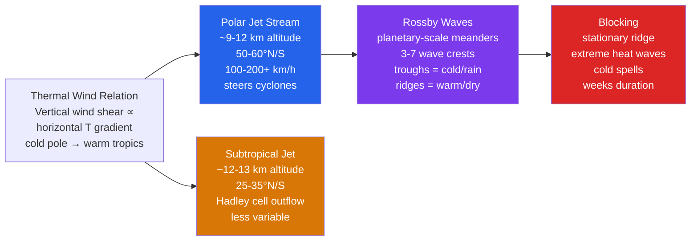

# 🌬️ Jet Streams and Upper-Level Flow

> [!abstract] TL;DR
> Jet streams are narrow, fast **ribbons of wind (100–300+ km/h)** at **9–12 km altitude near the tropopause**, set by the **thermal wind relation** acting on the large **equator-to-pole temperature gradient**. Two dominate the Northern Hemisphere: the **polar jet** (anchored to the polar front, highly variable, steers cyclones) and the **subtropical jet** (fed by Hadley-cell outflow, higher and steadier). Both meander as planetary-scale **Rossby waves** whose **troughs (cold, stormy) and ridges (warm, dry)** steer surface weather. When a high-amplitude ridge locks in place — a **blocking event** — it produces prolonged **heat waves and cold spells**. **Arctic amplification** is now shrinking the pole-to-equator temperature gradient, and whether that weakens or "waves up" the jet is an **active, unsettled scientific debate**.

---

## Intuition — analogy FIRST

Picture the atmosphere as a **wide, shallow river system flowing around the planet**. Rivers run fast where the channel is steep and narrow; the jet stream runs fast where the atmosphere's "slope" is steepest. That slope is a **temperature contrast**: the pole is bitterly cold and the tropics are warm, and cold air is denser and "shorter." So the pressure surfaces up near the tropopause tilt sharply downward toward the pole — a permanent aerial hillside — and air rushing along that slope, bent sideways by Earth's rotation, becomes a west-to-east torrent. The **bigger the temperature difference, the steeper the slope, the faster the jet**.

Now watch the river **meander**. Instead of running dead straight, it swings north into loops (**ridges**) and dips south into troughs, exactly like a lazy river carving S-bends across a floodplain. Each northward loop drags **warm air poleward**; each southward dip pulls **cold Arctic air equatorward**. Those bends are **Rossby waves**, and they *are* our weather: when the bend parks over your city for two weeks (a **block**), you bake under a heat dome or freeze under a cold outbreak. And because the jet is a highway in the sky, an airliner riding the current eastward gets a free tailwind, while flying west it fights the same river head-on.

---

## How It Works

The jet stream is the atmosphere's answer to a simple imbalance: the tropics receive far more solar energy than the poles. That **meridional (north–south) temperature gradient** is converted, through rotation and hydrostatic balance, into a **vertical shear of the west wind** — the wind gets stronger the higher you climb, reaching a maximum right at the tropopause where the horizontal temperature contrast is concentrated. That is the **thermal wind relation**, and it is the single most important idea on this page.



**Thermal wind builds the jet.** Combine the geostrophic and hydrostatic balances and you get the thermal wind relation. In pressure coordinates the westerly component obeys

$$\frac{\partial u_g}{\partial \ln p} = \frac{R_d}{f}\,\frac{\partial T}{\partial y}, \qquad\text{equivalently}\qquad \frac{\partial u_g}{\partial z} \approx -\frac{g}{fT}\,\frac{\partial T}{\partial y}.$$

Because the pole is colder than the equator, $\partial T/\partial y < 0$ in the NH, and the west wind $u_g$ **increases upward** — from near-zero at the surface to a maximum at the tropopause. Above the tropopause the tropics become *colder* than the poles (the temperature gradient reverses), so the shear reverses and the jet weakens again. That is precisely why the jet core sits **at, not above, the tropopause**.

**Two jets, two engines.** The **polar jet** (50–60° latitude, 9–12 km) sits over the **polar front**, the sharp boundary between polar and mid-latitude air where the horizontal temperature gradient is greatest; it is strong, variable, and closely coupled to surface cyclones. The **subtropical jet** (25–35°, 12–13 km) forms where poleward-moving upper air from the **Hadley cell** conserves angular momentum and accelerates into a west wind at the cell's edge; it is higher, steadier, and thermally driven by the tropics-to-subtropics gradient. They can **merge (jet confluence)** into a single powerful stream and later split apart.

**Jet-streak anatomy and cyclogenesis.** A localized wind maximum embedded in the jet is a **jet streak**. Air accelerating into the **entrance** and decelerating out of the **exit** breaks geostrophic balance, producing an ageostrophic secondary circulation with a **four-quadrant** pattern of convergence and divergence. The **left-exit and right-entrance quadrants** are regions of **upper-level divergence**; by mass continuity that divergence draws air up from below and lowers surface pressure — **surface cyclogenesis**. Quasi-geostrophic theory formalizes this via **Q-vector convergence** forcing ascent. This is why developing storms so often sit beneath the exit region of a jet streak.

**Meanders are Rossby waves.** The jet does not flow straight because the Coriolis parameter varies with latitude — the **β effect**, $\beta = df/dy = 2\Omega\cos\phi / a$. A ridge/trough pattern is a **Rossby wave**, and around a hemisphere only an integer number of crests fit: the **zonal wavenumber** $k$ is typically **3–7**. Their (barotropic) dispersion relation on a β-plane is

$$\omega = U k - \frac{\beta k}{k^2 + l^2},$$

with intrinsic (relative to the mean flow $U$) phase speed $c_x - U = -\beta/(k^2+l^2) < 0$: **Rossby waves always propagate westward relative to the flow.** Long waves (small $k$) propagate west fast and can even move westward against the flow; short waves are swept east with $U$. When the westward propagation exactly cancels the eastward advection ($\omega = 0$) the wave is **stationary**, at the **stationary wavenumber**

$$k_s = \sqrt{\beta / U}.$$

Waves near $k_s$ are quasi-stationary, resonate with fixed forcing (mountains, land–sea contrast), and are the ones that produce persistent weather.

**Trough tilt encodes momentum flux.** A trough tilted **NE–SW (positive/"backward" tilt)** transports westerly momentum poleward and typically indicates a decaying or barotropic wave; a **negative tilt (NW–SE)** signals an amplifying, deepening system. Neutral (meridional) tilt is transitional. The tilt is a visible fingerprint of the eddy momentum flux $\overline{u'v'}$ that couples the waves to the mean jet.

**Blocking.** When a high-amplitude ridge grows so large it **splits the jet into two branches around a stationary anticyclone**, the normal west-to-east progression of weather halts — a **block** (the classic diagnosis is Rex, 1950). Air beneath the block subsides, skies clear, and the same weather repeats for **days to weeks**: heat domes in summer, brutal cold-air pooling in winter. Blocking is *not* merely a persistent high — it is a **bifurcation of the flow**.

**Tropopause folding.** In the strong-shear zone beneath a jet streak the tropopause can **fold downward**, injecting a tongue of **stratospheric air — high potential vorticity (PV), low humidity, ozone-rich —** deep into the troposphere. These folds are turbulence and surface-ozone sources and are a principal route of **stratosphere–troposphere exchange**.

**Modes and teleconnections.** Recurrent jet configurations are catalogued by **indices**: the **Pacific/North American (PNA)** pattern describes the amplitude of the ridge–trough–ridge wavetrain over the Pacific and North America; the **North Atlantic Oscillation (NAO)** and **Arctic Oscillation (AO)** describe the latitude and strength of the Atlantic jet. Their positive/negative phases pre-position where troughs and ridges sit for weeks.

**Climate change.** **Arctic amplification** — the pole warming two-to-four times faster than the global mean — **shrinks the low-level equator-to-pole temperature gradient**, which by thermal wind should **weaken the polar jet** and, some argue, make it **wavier and slower**, favoring more blocking and extremes (Francis & Vavrus). Others find the observational and dynamical evidence weak and internal variability dominant (Barnes & Screen). The upper-level (tropical-upper-troposphere) warming pulls the other way. **The net effect is genuinely unsettled** and is one of the liveliest open questions in the field.

---

## Key Concepts / Details

### Secondary Level

- **What a jet stream is:** a narrow band of very fast west-to-east wind, 9–12 km up, where the cold polar air meets the warm tropical air. Winds routinely exceed **160 km/h** and can top **300 km/h**.
- **Why it drives weather:** the jet is the **steering current** for storms. Where it bulges north (a **ridge**) you get warm, dry, settled weather; where it dips south (a **trough**) you get cold air, clouds, and rain/snow. Forecasters watch the jet to know where the next storm will track.
- **Why flights are faster going east:** the jet blows **west-to-east**, so a plane from New York to London flies *with* the current (a tailwind) and arrives early, while London-to-New York fights a headwind and takes longer — the same distance, very different time.
- **Blocking and heat waves:** sometimes a big ridge gets "stuck" for a week or two — a **blocking high**. Air sinks under it, skies stay clear, the sun bakes the ground day after day, and you get a **heat wave**. In winter the stuck pattern can instead trap **freezing cold air** in one place.
- **Why meanders make extremes:** the wavier the jet, the farther warm air pushes north and cold air spills south — bigger swings mean **more extreme, longer-lasting weather** at the wave crests.

### Undergraduate Level

**Thermal wind relation.** From geostrophic + hydrostatic balance,

$$\frac{\partial u_g}{\partial z} \approx -\frac{g}{fT}\frac{\partial T}{\partial y}, \qquad \frac{\partial u_g}{\partial \ln p} = \frac{R_d}{f}\frac{\partial T}{\partial y}.$$

With the pole colder than the equator ($\partial T/\partial y<0$), the westerly wind **grows with height** up to the tropopause. **Worked estimate:** a gradient of $\partial T/\partial y = -1\,\text{K}/100\,\text{km} = -10^{-5}\,\text{K m}^{-1}$ at 45°N ($f\approx1.03\times10^{-4}\,\text{s}^{-1}$) gives, between 500 and 250 hPa,

$$\Delta u_g = -\frac{R_d}{f}\frac{\partial T}{\partial y}\ln\!\frac{p_{500}}{p_{250}} = -\frac{287}{1.03\times10^{-4}}(-10^{-5})\ln 2 \approx 19\ \text{m s}^{-1}.$$

Roughly a **20 m/s** boost across that layer — the essence of how a modest surface gradient becomes a 50 m/s jet aloft.

**Why the maximum is at the tropopause.** The pole–equator temperature contrast is largest in the *troposphere* and **reverses above the tropopause** (tropical lower stratosphere is cold, polar lower stratosphere relatively warm). So the shear integrates to a **peak at the tropopause** and decays above it.

**Jet-streak circulations.** The four-quadrant model: air is **super-geostrophic in the exit, sub-geostrophic in the entrance**, driving an ageostrophic transverse circulation. The **left-exit quadrant = upper divergence → surface cyclogenesis**, formalized by **Q-vector convergence** forcing quasi-geostrophic ascent. This is where you look for developing lows.

**Rossby wave dispersion.** On a β-plane the free (barotropic) mode is $\omega = Uk - \beta k/(k^2+l^2)$. The **intrinsic phase speed is westward**, $c_x-U=-\beta/(k^2+l^2)$. The **stationary wavenumber** where $\omega=0$ is $k_s=\sqrt{\beta/U}$; expressed as an integer around a latitude circle this lands in the **3–7** range for typical $U\sim10\text{–}30\,\text{m/s}$.

**Group velocity and energy.** Energy travels at the **group velocity** $c_{gx}=\partial\omega/\partial k = U - \beta(l^2-k^2)/(k^2+l^2)^2$, which can differ in sign from the phase speed — Rossby-wave *energy* disperses **eastward** (downstream development) even while individual crests slip west relative to the flow.

**Trough tilt.** **Positive (NE–SW) tilt** transports westerly momentum poleward (often decaying); **negative (NW–SE) tilt** marks amplification; the tilt is the geometric signature of eddy momentum flux $\overline{u'v'}$.

**Blocking diagnostics.** The **Rex block** (1950) is a split jet with a high poleward of a low; modern **blocking indices** (e.g. Tibaldi–Molteni geopotential-gradient reversal at 500 hPa) flag a reversal of the normal westerly gradient that persists over a threshold duration and longitudinal span.

### Graduate Level

**Forced stationary waves (Charney–Eliassen).** Time-mean planetary waves are driven by **orography** (flow over the Rockies/Tibetan Plateau) and **diabatic (land–sea) heating**. The linearized barotropic vorticity equation with topographic forcing $h$ gives a stationary response that **resonates near $k_s$** and can amplify strongly when $U$ tunes $k_s$ onto a forced wavenumber.

**Eliassen–Palm (EP) flux and wave–mean-flow interaction.** The **EP flux** $\mathbf{F}=(F_y,F_z)$ packages the eddy momentum flux $-\overline{u'v'}$ and eddy heat flux $\overline{v'\theta'}$; its divergence forces the mean flow through the **transformed Eulerian mean** momentum equation. The **non-acceleration (Eliassen–Palm) theorem** states that steady, conservative, linear waves do **not** drive the mean flow ($\nabla\cdot\mathbf{F}=0$); the mean jet is accelerated/decelerated only where waves **transient, dissipate, or break**.

**Critical layers and wave breaking.** Where the phase speed equals the mean flow ($c=U$) lies a **critical layer**; approaching it, Rossby waves **absorb, reflect, or break**, irreversibly overturning PV contours and depositing momentum. This **eddy momentum deposition** is what maintains the eddy-driven (polar) jet and sharpens the storm track — the jet is, in part, **built by the very waves it steers**.

**Polar vortex and SSWs.** The **stratospheric polar vortex** is a strong wintertime cyclonic circulation over the pole. Upward-propagating planetary waves can converge EP flux onto it and, in a **sudden stratospheric warming (SSW)**, decelerate or **reverse** the vortex within days, warming the polar stratosphere by tens of kelvin. The disruption **descends** over weeks to the troposphere, favoring a **negative AO/NAO**, an equatorward-shifted wavy jet, and cold-air outbreaks.

**QBO modulation.** The equatorial **Quasi-Biennial Oscillation** (~28-month reversal of tropical stratospheric winds) modulates the waveguide for planetary waves: the **Holton–Tan** relationship links the **QBO easterly phase** to a **weaker, more SSW-prone polar vortex**.

**Arctic amplification debate.** Reduced low-level $\partial T/\partial y$ under sea-ice loss should weaken the jet (thermal wind) and, per **Francis & Vavrus**, increase waviness/blocking; **Barnes & Screen** and others counter that the signal is small, seasonally and regionally confined, and often swamped by internal variability and offsetting tropical upper-tropospheric warming. **Planetary-wave resonance** theory (Petoukhov; Mann et al.) proposes that amplified quasi-stationary waves 6–8 trap energy and lock in summer extremes. **The mechanism and even the sign remain contested.**

**Tropical forcing.** The **Madden–Julian Oscillation (MJO)** and other tropical convection excite Rossby wave trains that arc into the mid-latitudes (**Rossby wave source** from divergent outflow near the subtropical jet), modulating the extratropical jet and downstream blocking on subseasonal timescales — a key source of **S2S** predictability.

---

## Code Demo

```python
# Two things this demonstrates:
#   (1) the STATIONARY Rossby wavenumber k_s = sqrt(beta/U) as a function of
#       the background zonal wind U, expressed as an integer zonal wavenumber
#       (waves around a 45N latitude circle), with the observed 3-7 band shaded;
#   (2) a snapshot of a Rossby WAVE PACKET height anomaly Z'(x,y) on a beta-plane,
#       with k, l, omega obeying the barotropic dispersion relation.
import numpy as np
import matplotlib.pyplot as plt

# --- planetary constants ---
Omega = 7.292e-5                 # Earth rotation rate, s^-1
a     = 6.371e6                  # Earth radius, m
phi   = np.deg2rad(45.0)         # reference latitude
f0    = 2*Omega*np.sin(phi)      # Coriolis parameter at 45N, s^-1
beta  = 2*Omega*np.cos(phi)/a    # df/dy at 45N, m^-1 s^-1
circ  = 2*np.pi*a*np.cos(phi)    # length of the 45N latitude circle, m
print(f"f0   = {f0:.3e} s^-1")
print(f"beta = {beta:.3e} m^-1 s^-1")

# ============================================================
# Part 1: stationary wavenumber vs background wind U
# ============================================================
U = np.linspace(5.0, 30.0, 300)          # background zonal wind, m/s
ks = np.sqrt(beta / U)                    # stationary wavenumber, rad/m
# integer zonal wavenumber = (# of waves that fit around the latitude circle)
m_zonal = ks * circ / (2*np.pi)
for Utest in (10.0, 20.0, 30.0):
    kt = np.sqrt(beta/Utest)
    print(f"U={Utest:4.0f} m/s  ->  k_s={kt:.3e} /m,  zonal wavenumber ~ "
          f"{kt*circ/(2*np.pi):.1f}")

# ============================================================
# Part 2: Rossby wave-packet snapshot Z'(x,y) at t=0
# ============================================================
lam_x, lam_y = 5.0e6, 8.0e6               # zonal, meridional wavelengths (m)
k = 2*np.pi/lam_x                         # zonal wavenumber, rad/m
l = 2*np.pi/lam_y                         # meridional wavenumber, rad/m
Umean = 15.0                              # background flow, m/s
K2 = k*k + l*l
omega = Umean*k - beta*k/K2               # dispersion relation, s^-1
cx    = omega/k                           # zonal phase speed, m/s
cgx   = Umean - beta*(l*l - k*k)/K2**2    # zonal group velocity, m/s
print(f"\nPacket: cx (phase) = {cx:6.2f} m/s,  cgx (group) = {cgx:6.2f} m/s")
print(f"        intrinsic phase speed cx - U = {cx-Umean:6.2f} m/s (westward)")

x = np.linspace(0, 2.0e7, 400)            # 20,000 km zonal extent
y = np.linspace(-4.0e6, 4.0e6, 300)       # +/- 4,000 km meridional extent
X, Y = np.meshgrid(x, y)
A = 100.0                                  # amplitude, m (geopotential height)
env = np.exp(-((X-1.0e7)**2)/(2*(3.0e6)**2))   # Gaussian packet envelope
Zp = A*env*np.cos(k*X + l*Y - omega*0.0)       # snapshot at t = 0

# --- plot ---
fig, (ax1, ax2) = plt.subplots(1, 2, figsize=(13, 5))

ax1.plot(U, m_zonal, color='#7c3aed', lw=2.2)
ax1.axhspan(3, 7, color='#2563eb', alpha=0.15,
            label='typically amplified (k = 3-7)')
ax1.set_xlabel('background zonal wind  U  (m/s)')
ax1.set_ylabel('stationary zonal wavenumber  k$_s$')
ax1.set_title('Stationary Rossby wavenumber  k$_s$ = $\\sqrt{\\beta/U}$  at 45°N')
ax1.grid(alpha=0.3); ax1.legend()

cf = ax2.contourf(X/1e6, Y/1e6, Zp, levels=21, cmap='RdBu_r')
ax2.set_xlabel('x  (1000 km)'); ax2.set_ylabel('y  (1000 km)')
ax2.set_title("Rossby wave-packet height anomaly  Z'(x, y),  t = 0")
fig.colorbar(cf, ax=ax2, label="Z'  (m)")
plt.tight_layout()
plt.savefig('jet_rossby.png', dpi=120)
print("\nSaved figure to jet_rossby.png")

# Expected console highlights:
#   beta ~ 1.62e-11 /m/s ; U=20 m/s -> zonal wavenumber ~ 4.
#   The wave packet's intrinsic phase speed is NEGATIVE (westward relative to U),
#   while its group velocity (energy) is faster/eastward -> downstream development.
```

The left panel shows that as the background flow $U$ strengthens, the stationary wavenumber $k_s=\sqrt{\beta/U}$ **falls** — stronger jets support **longer, lower-wavenumber** stationary waves — and observed amplified patterns cluster in the **3–7** band. The right panel is a snapshot of the height-anomaly packet: alternating high/low lobes (ridges/troughs) tilted by the ratio $l/k$, moving **westward relative to the flow** while their energy disperses downstream.

---

## Real-World Notes

- **February 2021 Texas cold wave:** a **sudden stratospheric warming** disrupted the **stratospheric polar vortex**, its influence descended to the troposphere, and the buckled polar jet let a lobe of Arctic air plunge into Texas — record cold, a collapsed power grid, and hundreds of deaths.
- **January 2015 transatlantic speed record:** an exceptionally strong North Atlantic jet reached about **370 km/h (~230 mph)**; a British Airways 777 rode the tailwind from New York to London and landed roughly **an hour and a half to two hours early**, briefly approaching the ground-speed of a subsonic record.
- **Summer 2010 Russian heat wave + Pakistan floods:** a single persistent **atmospheric block** parked a heat dome over western Russia (thousands of deaths, wildfires) while the same locked wave pattern funneled moisture into Pakistan, driving catastrophic monsoon **flooding** — one jet configuration, two disasters.
- **QBO pacing:** the **Quasi-Biennial Oscillation** flips tropical stratospheric winds on a **~28-month** cycle; via the **Holton–Tan** effect its easterly phase statistically **weakens the polar vortex** and raises SSW odds, giving forecasters a seasonal-scale lever on winter jet behavior.
- **European summer heat waves (2003, 2019):** both were tied to **blocked jet-stream** configurations with a stationary ridge over Western Europe; 2003 alone is associated with on the order of **70,000 excess deaths** across the continent.

---

## Common Pitfalls

1. **Treating the polar and subtropical jets as one thing.** They are **distinct streams with different engines** (polar front vs Hadley outflow), altitudes, and variability. They sometimes **merge (jet confluence)** into a single strong core and later **split**, but conflating them misdiagnoses both their behavior and their weather impacts.
2. **Thinking jet winds blow toward low pressure.** Upper-level jet flow is **geostrophic (to leading order)** — it runs **parallel to the height contours**, not down the pressure gradient. The pressure-gradient force is balanced by Coriolis; only the small **ageostrophic** part in jet entrances/exits crosses contours and does the vertical-motion work.
3. **Equating "blocking" with a persistent high.** A block is a **bifurcation of the jet** — the flow **splits into two branches around a stationary anticyclone**, halting the eastward march of weather. A merely long-lived high that the jet still flows *over* is not a block; the split (often a Rex or omega structure) is the defining feature.
4. **Stating the Arctic-amplification → wavier-jet link as settled.** It is an **active controversy** (Francis & Vavrus vs Barnes & Screen). The low-level gradient weakens the jet while upper-tropospheric tropical warming strengthens it, and internal variability is large; do **not** present a wavier, blockier future jet as established fact.
5. **Ignoring tropopause folds.** Beneath jet streaks the tropopause can **fold**, intruding **stratospheric air (high PV, low humidity, ozone-rich)** into the troposphere. These folds are hotspots of **clear-air turbulence** and **surface-ozone spikes** — aviation and air-quality hazards that the smooth "ribbon of wind" picture hides.

---

## Related Concepts

- [[_MOC_Atmospheric_Dynamics]] — section map for the atmospheric-dynamics unit (uplink).
- [[Pressure_Gradient_Force_and_Winds]] — the force that, balanced by Coriolis, produces the geostrophic jet flow.
- [[Coriolis_Effect_and_Geostrophic_Balance]] — the rotation-driven balance underlying the thermal wind relation and the β effect.
- [[Fronts_and_Extratropical_Cyclones]] — the polar front anchors the polar jet; jet streaks force the cyclogenesis that spins up these storms.
- [[Global_Atmospheric_Circulation]] — the Hadley cell feeds the subtropical jet; the pole–equator energy imbalance drives the whole system.
- [[Climate_Variability_and_Teleconnections]] — PNA, NAO/AO, MJO, and QBO modes that pre-position the jet's ridges and troughs.
- [[Numerical_Weather_Prediction]] — models resolve jet streaks and Rossby waves to forecast where storms track.
- [[Ensemble_Forecasting_and_Uncertainty]] — jet meanders and blocking onset are chaotic, so their prediction is inherently probabilistic.
- [[_MOC_Physics_Master]] — parent physics vault for the underlying fluid dynamics and rotation.
- [[Wave_Motion_and_Properties]] — dispersion, phase vs group velocity, and wave packets, applied here to Rossby waves.
- [[Newtons_Laws_and_Kinematics]] — momentum conservation and the rotating-frame accelerations behind geostrophic and thermal-wind balance.

---

## Review Questions

- **Secondary:** Why is it faster to fly from **New York to London** than from London to New York at the same altitude? What kind of weather does a jet stream that **dips far south (a trough)** bring to the region beneath it? What is a **"blocking high,"** and why does it turn a hot day into a multi-week **heat wave**?
- **Undergraduate:** Using the **thermal wind relation**, explain why jet streams reach their maximum speed **at the tropopause** rather than lower down (hint: how does the pole-to-equator temperature gradient behave above vs below the tropopause?). Given a temperature gradient of **−1 K per 100 km pointing northward at 45°N**, estimate the increase in westerly geostrophic wind between the **500 and 250 hPa** levels. Why do jet-streak **entrance/exit regions** preferentially trigger **surface cyclogenesis**?
- **Graduate:** **Derive** the barotropic Rossby-wave dispersion relation $\omega = Uk - \beta k/(k^2+l^2)$ on a β-plane from the conservation of absolute vorticity. Why do Rossby waves propagate **westward relative to the mean flow**? Define the **stationary wavenumber** $k_s=\sqrt{\beta/U}$ and explain why wavenumbers **4–6** are typically the amplified ones in NH winter. Finally, using the **Eliassen–Palm** framework, explain how **wave breaking near a jet critical layer** transfers momentum from the eddies to the mean flow and helps **maintain the eddy-driven jet**.

---

## Sources

- Holton, J. R. & Hakim, G. J. — *An Introduction to Dynamic Meteorology*, 5th ed. (Academic Press). Thermal wind, geostrophic balance, Rossby waves, EP flux, the polar vortex.
- Vallis, G. K. — *Atmospheric and Oceanic Fluid Dynamics*, 2nd ed. (Cambridge University Press). β-plane dynamics, wave–mean-flow interaction, jet formation and stationary waves.
- Palmén, E. & Newton, C. W. — *Atmospheric Circulation Systems* (1969, Academic Press). Classic observational synthesis of jet streams, jet streaks, and blocking.

---

#Meteorology #AtmosphericDynamics #JetStream #RossbyWaves #UpperLevelFlow
