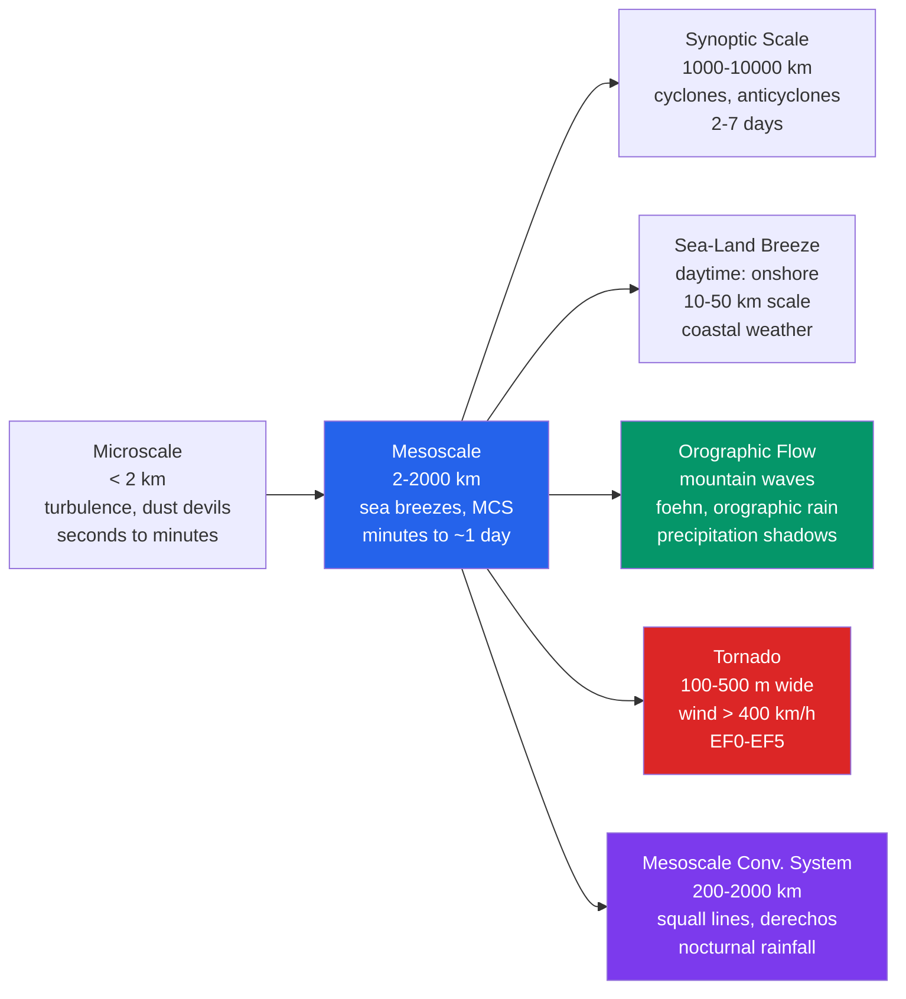

# 🌪️ Mesoscale Meteorology and Severe Weather

> [!abstract] TL;DR
> Mesoscale meteorology covers phenomena with horizontal scales of **2–2000 km** and lifetimes of **minutes to a day** — the crowded middle ground between planet-spanning **synoptic** weather systems and small-scale **microscale** turbulence. Its signature phenomena are **sea and land breezes**, **mountain and valley winds**, **orographic flow** (upslope rain and lee waves), **gust fronts** and **density currents**, **mesoscale convective systems (MCSs)**, and **tornadoes**. **Severe weather** — winds **>93 km/h (58 mph)**, hail **>2.5 cm (1 in)**, or a **tornado** — is what organized mesoscale convection produces when the synoptic environment supplies enough **CAPE** and **wind shear**. **Doppler radar (WSR-88D)**, dense **mesonet** observing networks, and **convection-allowing NWP** (grid spacing < 5 km) turned mesoscale meteorology from a data-starved frontier into an operationally forecastable science. The **tornado** is the most concentrated release of atmospheric energy per unit area on Earth.

## Intuition — analogy FIRST

Think of the atmosphere as a family with three children of very different sizes. The **synoptic** giant — the cyclone that fills a whole weather map — is the eldest, slow and easy to see coming days ahead. The **microscale** toddler — a dust devil, a gust of turbulence — is too small and fleeting to track. Mesoscale phenomena are the **middle children**: too big to be dismissed as turbulence, too small to show up as a single low or front on a synoptic chart, and often overlooked precisely because they fall between the tools built for the other two. Yet they are where the day's *weather you actually feel* lives — the afternoon sea breeze, the thunderstorm outflow that drops the temperature 10 °C in five minutes, the tornado.

Start with the simplest example, the **sea breeze**. On a sunny day the land heats far faster than the sea (land has a low heat capacity; the ocean mixes its heat down through metres of water). Warmer land air expands and rises, lowering surface pressure over the coast — a shallow **thermal low**. Air then flows *inland from the cooler, higher-pressure sea* to fill the gap: the sea breeze. At night the land cools faster than the sea, the pressure pattern reverses, and the flow runs *offshore* as a **land breeze**. Scale that same "differential heating drives a circulation" idea up, add a mountain range to force air violently up and over, and add the fuel of a warm, moist, unstable atmosphere, and you get the full mesoscale zoo — right up to the **severe weather outbreak**, a mesoscale event set in motion by the synoptic environment (CAPE, shear) but then evolving *autonomously at its own scale*, on its own clock.

---

## How It Works

Mesoscale is best understood as a **band on the scale spectrum**, bracketed by microscale turbulence below and synoptic weather above. Orlanski's classification subdivides it: **α-meso** (200–2000 km: MCSs, fronts, tropical-storm bands), **β-meso** (20–200 km: sea breezes, thunderstorm complexes, mountain waves), and **γ-meso** (2–20 km: individual thunderstorms, tornadoes' parent circulations, gust fronts). What unites the band is that these systems are large enough to be shaped by buoyancy and (weakly) by rotation, yet small and fast enough that the **geostrophic balance** governing synoptic flow largely breaks down — the **Rossby number** $Ro = U/fL$ is of order 1, so the wind is *not* simply flowing along the isobars.



**Thermally direct circulations: sea/land breezes and mountain/valley winds.** Wherever the surface heats unevenly, a **thermal circulation** spins up. Over a coast, daytime heating of the land drives the **sea breeze** onshore with a compensating **return flow** aloft and a rising branch inland — a closed cell 10–50 km across and ~1–2 km deep, marked at its leading edge by a **sea-breeze front** that acts as a lifting mechanism for afternoon storms. At night the sign flips to a weaker **land breeze**. The same physics on a slope gives **anabatic (upslope) valley winds** by day — sun-warmed slopes lift air up the mountainside — and **katabatic (downslope) mountain winds** by night as radiatively cooled, dense air drains downhill. **Lake-effect snow** is the cold-season cousin: frigid air sweeping over relatively warm, open lake water is heated and moistened from below, destabilizes, and dumps intense snow bands on the downwind (lee) shore.

**Orographic flow.** When wind meets a mountain barrier the air must go *over* or *around* it, and which one it does is set by the **Froude number** $Fr = U/(NH)$ (wind speed $U$, buoyancy/stability frequency $N$, barrier height $H$). Air forced *up* the windward slope cools adiabatically, condenses, and rains — **orographic precipitation** — while air descending the lee slope warms and dries, creating a **rain shadow** and often a warm, gusty downslope **foehn/chinook** wind. If the flow is stable and fast enough it goes over the top and sets up **mountain (lee) waves**, standing gravity waves in the lee whose crests can form lens-shaped **lenticular clouds** and whose troughs can spin up violent low-level **rotors** — a serious aviation hazard.

**Density currents: gust fronts and outflow boundaries.** A thunderstorm's rain-cooled downdraft spreads out at the surface as a **cold pool** — a shallow blob of dense air that noses forward under the warm environment exactly like a **gravity current** (think of cold air pouring out of an opened freezer, or the front of dyed dense fluid in a lock-exchange tank). Its leading edge is the **gust front**, felt as a sudden wind shift, temperature drop, and pressure jump. The current advances at a speed $c \approx k\sqrt{g'h}$ where the **reduced gravity** $g' = g\,\Delta\rho/\rho \approx g\,\Delta T/T_0$, $h$ is the cold-pool depth, and $k\approx0.7$–1. Gust fronts and their long-lived remnants, **outflow boundaries**, are prime *convective-initiation* zones — and where two boundaries collide, storms fire.

**Downbursts and microbursts.** Not all severe wind rotates. A **downburst** is a concentrated downdraft that hits the ground and spreads out in a **divergent** burst of damaging straight-line wind. A **microburst** (< 4 km across, lasting only 5–15 minutes) is the small, intense, hard-to-see variety that is lethal to aircraft on approach: a plane flies through a headwind (extra lift), then the calm core, then a sudden tailwind (sudden lift loss) at low altitude. Wet microbursts are driven by precipitation drag; **dry microbursts** by evaporative cooling of rain falling into dry air below cloud base.

**Tornadoes.** A **tornado** is a violently rotating column of air in contact with both the ground and a cumuliform cloud base. The most intense come from **supercell** thunderstorms: the storm's rotating updraft (**mesocyclone**) concentrates spin, the **rear-flank downdraft (RFD)** helps drag rotation down to the surface, and stretching in the intense low-level updraft spins it up like a figure skater pulling in their arms. Damage is rated after the fact on the **Enhanced Fujita (EF) scale**, EF0 (105–137 km/h, minor damage) to EF5 (>322 km/h, total destruction), using calibrated **damage indicators**. A tornado's life cycle runs from **organizing** → **mature** (widest, most intense) → **shrinking/rope-out** as the RFD wraps completely around and chokes the inflow. Over water the weaker, often fair-weather analog is the **waterspout**.

**Organized systems: MCSs, squall lines, derechos, flash floods.** A **mesoscale convective system** is a cluster of storms organized on the α-meso scale, classically a **leading convective line** with a **trailing stratiform** rain shield. When a squall line's rear-inflow jet surges it bows forward (**bow echo**); a long-lived, fast-moving family of bow echoes producing a continuous swath (≥ 400 km) of damaging wind is a **derecho**. Slow-moving or "training" MCSs (cells repeatedly crossing the same ground) are the atmosphere's premier **flash-flood** engines — flash floods build in minutes-to-hours from intense local rain, distinct from **river floods** that accumulate over days across a basin.

**How we watch it: radar, mesonets, and NWP.** The U.S. **WSR-88D (NEXRAD)** Doppler radar network detects mesocyclones by their **gate-to-gate velocity couplet** — adjacent radar pixels showing strong inbound *and* outbound motion, the radar signature of rotation — and flags likely tornadoes by the **tornadic vortex signature (TVS)**. Dense **mesonet** surface networks (Oklahoma Mesonet being the archetype) resolve boundaries and cold pools the coarse synoptic network misses. **Convection-allowing models** (grid spacing ≤ 3–4 km, e.g. the HRRR) explicitly simulate storms rather than parameterizing them, and the **NOAA Storm Prediction Center (SPC)** synthesizes all of it into **convective outlooks**, **watches** (conditions favorable), and — issued by local Weather Forecast Offices — **warnings** (event occurring or imminent).

---

## Key Concepts / Details

### Secondary Level

- **Sea breeze vs land breeze.** By **day** the land heats faster than the sea, so cooler sea air flows *inland* (sea breeze). By **night** the land cools faster than the sea, so the flow reverses and blows *offshore* (land breeze). It is just air moving from the cooler, denser side toward the warmer, lighter side.
- **Why one side of a mountain is wet and the other dry.** Wind pushed *up* the windward slope cools and rains (**orographic precipitation**); coming *down* the far side it warms and dries out, leaving a **rain shadow**. That is why Seattle is soggy and eastern Washington is near-desert.
- **What a tornado is.** A **violently spinning column of air** touching both the ground and a storm cloud. It is defined by its *wind*, not by being especially cold or "low-pressure" at your feet. Rated EF0–EF5 by the damage it causes.
- **Watch vs warning — the single most important distinction.** A **watch** means "conditions are favorable; be ready." A **warning** means "it is happening or about to happen; act now." A tornado *watch* covers a big area for hours; a tornado *warning* is a small area for minutes.
- **Three severe weather threats from one supercell.** A single supercell can produce **large hail**, **damaging straight-line/downburst winds**, *and* a **tornado** — plus dangerous **lightning** and **flash-flooding rain**.
- **Lightning safety.** No place outside is safe in a thunderstorm — "**When thunder roars, go indoors**." Wait **30 minutes** after the last thunder before going back out.
- **Flash flood vs river flood.** A **flash flood** hits within minutes-to-hours from intense local rain and is the deadlier, faster hazard; a **river flood** builds over days from basin-wide runoff. *"Turn around, don't drown"* — most flood deaths are in vehicles.
- **Derecho.** A **widespread, long-lived windstorm** from a line of fast-moving thunderstorms — like an "inland hurricane" of straight-line wind, without the rotation of a tornado.

### Undergraduate Level

- **Froude number for orographic flow.** $Fr = \dfrac{U}{NH}$ compares the kinetic energy of the flow to the work needed to lift a parcel over the barrier. **$Fr < 1$ (slow, stable, tall barrier):** air is *blocked* and largely goes *around* the mountain (or dams up and stagnates upstream). **$Fr > 1$:** air has enough energy to go *over* the top, favoring mountain-wave generation. Near $Fr\approx 1$, flow can plunge down the lee as a **hydraulic jump / severe downslope windstorm**.
- **Density-current (gust-front) speed.** A cold pool behaves as a gravity current advancing at
  $$c \;\approx\; k\sqrt{g'h}, \qquad g' = g\frac{\Delta\rho}{\rho} \approx g\frac{\Delta T}{T_0},$$
  with $k\approx0.7$–1.1 (theory: $\sqrt2$ for an energy-conserving current, ~0.7 for the observed head). For $\Delta T = 5$ K, $T_0 = 295$ K, $h = 1$ km: $g' \approx 9.81\times5/295 \approx 0.166$ m/s², so $c\approx\sqrt{0.166\times1000}\approx 13$ m/s — a realistic ~25–45 km/h outflow surge.
- **Gust-front structure and propagation.** The current has a raised, turbulent **head** (~2× the following-flow depth) with **Kelvin–Helmholtz billows** on its upper interface, a lobe-and-cleft leading edge, and a trailing **feeder flow**. Propagation is *self-advective* (set by the cold pool) plus the ambient wind — which is why outflow can race ahead of the parent storm.
- **Sea-breeze onset and penetration.** The circulation typically develops mid-to-late morning once the land–sea temperature contrast is large enough to overcome the background wind, deepens through the afternoon, and can penetrate **20–100 km inland** (much farther in flat terrain), retarded by an offshore synoptic wind and enhanced by an onshore one. The convergence at its front routinely triggers afternoon thunderstorms (Florida's daily storms are the classic case).
- **MCS organization.** The canonical structure is a **leading convective line / trailing stratiform** region: young, intense cells at the gust-front leading edge; older, glaciating anvil and **stratiform rain** behind, often with a radar **bright band** at the melting level and a rear-to-front **rear-inflow jet** feeding the cold pool.
- **Mesocyclone detection by WSR-88D.** Doppler velocity reveals rotation as a **gate-to-gate azimuthal shear couplet** (inbound velocities beside outbound velocities). Algorithms flag a **mesocyclone** when the shear exceeds thresholds through a depth, and a **TVS** for the tighter, more intense couplet of a probable tornado. The **hook echo** in reflectivity marks precipitation wrapped around the mesocyclone.
- **VORTEX field campaigns.** **VORTEX** (1994–95), **VORTEX2** (2009–10) and **VORTEX-SE** deployed mobile Doppler radars, mesonet arrays, and balloon soundings *inside* supercells to observe tornadogenesis directly — the empirical backbone of modern tornado theory.
- **EF scale and climatology.** The **EF scale (0–5)** rates tornadoes by wind speed *inferred from damage* to 28 standardized damage indicators. The U.S. averages **~1200 tornadoes/year**, the most of any country, concentrated in "Tornado Alley" (Southern Plains) and "Dixie Alley" (Southeast), with a spring–early-summer peak.

### Graduate Level

- **Tornadogenesis: the mid-level vs near-ground problem.** Mid-level mesocyclone rotation is well explained: environmental **horizontal vorticity** (from vertical wind shear) is **tilted** into the vertical by the updraft and then **stretched**. The unsolved crux is getting significant vertical vorticity to the *surface* and stretching it there, since tilting alone produces peak vorticity aloft, not at the ground.
- **Baroclinic vorticity generation and the RFD.** Horizontal buoyancy gradients along the **forward-flank downdraft (FFD)** precipitation region **baroclinically generate** horizontal vorticity (the **solenoidal term** $\nabla(1/\rho)\times\nabla p$). Parcels descending in the **rear-flank downdraft (RFD)** acquire and reorient this vorticity, then are drawn into the low-level updraft where tilting and vigorous **stretching** ($\partial w/\partial z > 0$) amplify it into a tornado. The **thermodynamics of the RFD is decisive**: relatively *warm, buoyant* RFD outflow (small negative buoyancy) is far more tornado-favorable than cold outflow that undercuts and chokes the inflow.
- **Streamwise vorticity and storm-relative helicity.** Horizontal vorticity **aligned with the storm-relative flow** (**streamwise**) tilts into vertical vorticity that is *positively correlated with the updraft* ($w$–$\zeta$ correlation > 0) — a genuinely rotating, helical updraft. **Crosswise** vorticity tilts into a vorticity *couplet* with no net rotation. **Storm-relative environmental helicity (SREH/SRH)** is precisely the flux of streamwise vorticity a storm ingests; VORTEX observations tie large *sub-cloud-layer* streamwise vorticity to tornado production.
- **Ground-relative vs storm-relative winds.** Tornado dynamics must be viewed in the **storm-relative** frame: it is the storm-relative inflow that carries streamwise vorticity into the updraft, and SRH is undefined without first subtracting the (Bunkers-estimated) storm motion vector. Ground-relative winds alone mislead.
- **Mesonet data assimilation and convection-allowing NWP.** High-resolution assimilation of **mesonet**, radar radial-velocity, and reflectivity data into **WRF-ARW / HRRR / Warn-on-Forecast (WoFS)** systems at **1–3 km** (LES-permitting at ≲ 1 km) lets models *explicitly* simulate convective storms. The **warm-season QPF problem** — quantitative precipitation forecasting of convective rain — remains hard: convection-allowing models beat parameterized convection on placement and diurnal timing but still misfire on the nocturnal, **LLJ-fed** MCS maximum over the Great Plains.
- **Convective initiation by boundaries.** **Sea-breeze convergence zones**, drylines, and outflow boundaries are the loci of convective initiation; where two boundaries intersect, low-level convergence and moisture pooling preferentially fire storms — a mesoscale-forecasting focal point.
- **Bores and gravity waves ahead of density currents.** When a gust front intrudes on a **stable nocturnal boundary layer**, it can launch an **undular bore** — an internal gravity wave that propagates far ahead of the cold pool, lifting air and initiating or sustaining **nocturnal convection** (and producing spectacular "Morning Glory" roll clouds, as over Australia's Gulf of Carpentaria).
- **Orographic gravity-wave drag.** Mountain waves transport momentum vertically and, on breaking, exert a **gravity-wave drag** on the mean flow. GCMs cannot resolve individual ranges, so they carry **orographic gravity-wave-drag parameterizations** (and separate lee-wave/blocked-flow schemes) that materially affect the modeled midlatitude jet and surface pressure — a first-order climate-model tuning knob.
- **Lake-effect snow dynamics.** Cold air over warm water generates surface fluxes that build a convective internal boundary layer; with a long **fetch** aligned along a lake's major axis and weak directional shear, a single intense **long-lake-axis snowband (LLAP)** can organize and stall over one downwind location, producing extreme, sharply bounded snowfall.
- **WRF verification for severe weather.** Convection-allowing forecast skill is assessed with **object-based / neighborhood** metrics (e.g. the **Fractions Skill Score**, and surrogate-severe fields from **updraft helicity**) rather than gridpoint matching, because a storm that is right in structure but slightly displaced is penalized unfairly by traditional pointwise scores.

---

## Python demo — density-current speed and the orographic Froude number

```python
# Two classic mesoscale calculations, both runnable with numpy + matplotlib:
#
#  (1) GUST-FRONT (density-current) speed:  c = sqrt( g * (dT/T0) * h )
#      -> reduced-gravity gravity-current speed for a cold pool of depth h
#         and temperature deficit dT below an ambient temperature T0.
#      We sweep cold-pool depth h and plot c for three temperature deficits.
#
#  (2) OROGRAPHIC FROUDE NUMBER:  Fr = U / (N * H)
#      -> Fr < 1  air is BLOCKED and goes AROUND the barrier
#         Fr > 1  air has enough energy to go OVER the barrier (mountain waves)
#      We sweep wind speed U over a fixed barrier (H = 1 km, N = 0.01 /s)
#      and mark the Fr = 1 blocked/unblocked boundary.

import numpy as np
import matplotlib.pyplot as plt

g = 9.81  # m/s^2

# ---------- (1) Density-current / gust-front speed ----------
T0 = 295.0                      # ambient absolute temperature [K]
h  = np.linspace(0.5, 3.0, 200) * 1000.0   # cold-pool depth 0.5-3 km -> metres
dT_list = [1.0, 4.0, 8.0]                   # temperature deficits [K]

fig, (ax1, ax2) = plt.subplots(1, 2, figsize=(13, 5))

for dT in dT_list:
    gprime = g * dT / T0                     # reduced gravity [m/s^2]
    c = np.sqrt(gprime * h)                  # gravity-current speed [m/s]
    ax1.plot(h / 1000.0, c, lw=2, label=f"ΔT = {dT:.0f} K")

# annotate the worked example: dT = 5 K, h = 1 km
dT_ex, h_ex = 5.0, 1000.0
c_ex = np.sqrt(g * dT_ex / T0 * h_ex)
ax1.scatter([h_ex/1000.0], [c_ex], color="black", zorder=5)
ax1.annotate(f"ΔT=5K, h=1km\n c ≈ {c_ex:.1f} m/s ({c_ex*3.6:.0f} km/h)",
             (h_ex/1000.0, c_ex), textcoords="offset points", xytext=(10, -30))

ax1.set_xlabel("cold-pool depth  h  [km]")
ax1.set_ylabel("gust-front speed  c  [m/s]")
ax1.set_title("Density-current (gust-front) speed\n c = √(g · ΔT/T₀ · h)")
ax1.grid(alpha=0.3); ax1.legend()

# ---------- (2) Orographic Froude number ----------
H = 1000.0            # barrier height [m]
N = 0.01             # buoyancy (Brunt-Vaisala) frequency [1/s]
U = np.linspace(5.0, 30.0, 200)     # wind speed [m/s]
Fr = U / (N * H)

ax2.plot(U, Fr, lw=2, color="#2563eb")
ax2.axhline(1.0, color="#dc2626", ls="--", lw=2)
ax2.fill_between(U, 0, 1, color="#059669", alpha=0.12)
ax2.fill_between(U, 1, Fr.max(), color="#d97706", alpha=0.12)
ax2.text(6, 0.55, "Fr < 1\nBLOCKED\n(air goes AROUND)", color="#059669", fontsize=10)
ax2.text(20, 2.3, "Fr > 1\nUNBLOCKED\n(air goes OVER → waves)", color="#b45309", fontsize=10)

# wind speed at which Fr = 1 for this barrier: U = N*H
U_crit = N * H
ax2.axvline(U_crit, color="gray", ls=":", lw=1)
ax2.annotate(f"Fr = 1 at U = N·H = {U_crit:.0f} m/s",
             (U_crit, 1.0), textcoords="offset points", xytext=(8, 20))

ax2.set_xlabel("wind speed  U  [m/s]")
ax2.set_ylabel("Froude number  Fr = U / (N·H)")
ax2.set_title(f"Orographic flow regime\n(H = {H/1000:.0f} km, N = {N:.2f} /s)")
ax2.grid(alpha=0.3)

plt.tight_layout(); plt.show()

# ---------- console summary ----------
print(f"Worked gust front:  dT=5 K, h=1 km, T0=295 K  ->  c = {c_ex:5.1f} m/s "
      f"({c_ex*3.6:4.0f} km/h)")
print(f"Froude = 1 boundary for H=1 km, N=0.01/s occurs at U = N*H = {U_crit:.0f} m/s")
print(f"  U = 10 m/s -> Fr = {10.0/(N*H):.1f}  (> 1: unblocked, flows over)")
print(f"  U =  5 m/s -> Fr = { 5.0/(N*H):.1f}  (< 1: blocked, flows around)")
```

Running it prints a gust-front speed of **c ≈ 12.9 m/s (≈ 46 km/h)** for the ΔT = 5 K, h = 1 km case, and shows the two regimes on the Froude plot. For this 1-km barrier with $N = 0.01$ s⁻¹ the **Fr = 1 threshold sits at $U = NH = 10$ m/s**: below it the flow is *blocked* and diverts around the mountain; above it the flow has the energy to surmount the barrier and launch mountain waves. The left panel shows the intuitive scalings — **deeper, colder pools push their gust fronts faster** ($c\propto\sqrt{h}$ and $\propto\sqrt{\Delta T}$).

---

## Real-World Notes

- **The 2011 Super Outbreak (Apr 25–28).** The largest tornado outbreak on record produced **362 tornadoes** in four days across the U.S. Southeast, including the long-track **Tuscaloosa–Birmingham EF4** that killed 65 people — a textbook demonstration of a synoptically primed, high-shear/high-CAPE environment spawning many autonomous, long-lived violent supercells.
- **Lake-effect snow.** Cold air crossing the relatively warm, open water of **Lake Erie and Lake Ontario** can dump **>100 cm in 24 hours** on Buffalo, NY, when a stalled long-lake-axis band parks over the city — extreme, sharply localized snowfall driven entirely by mesoscale lake–air interaction.
- **The Foehn / chinook.** On the **north side of the Alps** (and the lee of the Rockies), descending, adiabatically warming downslope wind can raise temperatures **15–20 °C in a few hours**, melting snow rapidly — the "snow-eater" (*Schneefresser*) that is a direct consequence of orographic flow over the barrier.
- **Delta Air Lines Flight 191 (1985).** A **microburst** on approach to Dallas–Fort Worth slammed the aircraft with a sudden headwind-to-tailwind shift at low altitude, causing a fatal crash. It directly drove the development of modern **Terminal Doppler Weather Radar (TDWR)** and onboard wind-shear detection — a mesoscale phenomenon rewriting aviation safety.
- **The June 2012 Mid-Atlantic derecho.** A single **derecho** tracked **>1500 km** from Iowa to the Atlantic coast in ~12 hours, producing widespread hurricane-force wind gusts, leaving millions without power in summer heat, and causing billions of dollars in damage — the archetype of an organized, self-sustaining MCS wind event.

---

## Common Pitfalls

1. **Confusing a "watch" with a "warning."** A **watch** means conditions are *favorable* over a broad area for hours; a **warning** means the event is *occurring or imminent* in a small area, now. Reacting to a watch as if it were a warning wastes credibility; ignoring a warning as if it were a watch costs lives. Learn the difference cold.
2. **Thinking a tornado is defined by low pressure at your feet.** The surface **pressure deficit in a tornado is quite small** and not what does the damage; a tornado is defined and destroys by its **violently rotating wind** (>400 km/h in the worst cases). "Opening the windows to equalize pressure" is a dangerous myth — it wastes time you should spend sheltering.
3. **Assuming orographic precipitation just means "rain on the mountain."** Because condensate needs time to grow and fall while being blown downwind, the heaviest orographic rain often falls at the **foot of the upwind slope or over the foothills**, not the summit — and the lee side sits in a **rain shadow**. Terrain redistributes precipitation; it does not simply pile it on the peak.
4. **Underrating microbursts relative to macrobursts.** A **microburst** (< 4 km, minutes-long) is *more* dangerous to aviation than a larger macroburst precisely because it is **small, brief, and hard to see** — it can appear in clear air (dry microburst) and be gone before it is visually obvious, yet impose a lethal wind-shear change during takeoff or landing.
5. **Believing all severe storms are supercells.** **Squall lines, bow echoes, QLCS, and high-precipitation storms** all produce severe hail, damaging wind, and (fast-spinning, hard-to-warn) tornadoes without being classic supercells. Severe potential is about **organization and shear**, not a single storm archetype — do not tune your radar interpretation to look only for hook echoes.

---

## Related Concepts

- [[_MOC_Atmospheric_Dynamics]] — section map for the atmospheric-dynamics chapter of this vault; entry point to mesoscale and synoptic dynamics.
- [[Thunderstorms_and_Convective_Systems]] — the parent convection: CAPE, shear, supercells, mesocyclones, and MCS organization that *produce* the severe weather detailed here.
- [[Fronts_and_Extratropical_Cyclones]] — the synoptic-scale hosts (cold fronts, drylines, warm sectors) that set the CAPE-and-shear stage for mesoscale outbreaks.
- [[Tropical_Meteorology_and_Monsoons]] — the low-latitude convective regime and tropical MCSs; where $f\to0$ and the mesoscale balances differ.
- [[Atmospheric_Boundary_Layer]] — the surface layer where sea breezes, cold pools, gust fronts, and mesonet observations live; the density-current interface is a boundary-layer phenomenon.
- [[Remote_Sensing_Radar_and_Satellites]] — how WSR-88D velocity couplets, hook echoes, TVS, bow echoes, and overshooting tops are actually detected and warned on.
- [[Extreme_Weather_and_Meteorological_Hazards]] — tornadoes, hail, derechos, downbursts, and flash floods framed as societal-impact hazards.
- [[Numerical_Weather_Prediction]] — convection-allowing models, mesonet/radar data assimilation, and the warm-season QPF problem behind mesoscale forecasting.
- [[_MOC_Earth_Science_Master]] — cross-vault entry point for the surface-process consequences of severe weather.
- [[Mass_Wasting_and_Slope_Stability]] — how orographic and flash-flood rainfall triggers landslides and debris flows on saturated slopes.
- [[_MOC_Physics_Master]] — cross-vault physics entry point for the underlying fluid and wave mechanics.
- [[Fluid_Statics_and_Properties]] — buoyancy, reduced gravity, and the density-driven pressure fields underlying cold pools and gravity currents.
- [[Wave_Motion_and_Properties]] — the gravity-wave physics behind mountain (lee) waves, undular bores, and rotor formation.

---

## Review Questions

**Secondary**
- Why does a **sea breeze** blow from the ocean toward the land during the *day* but reverse to a **land breeze** at *night*? (Think about which surface heats and cools faster.)
- Name **three types of severe weather** that a single supercell thunderstorm can produce.
- What is the difference between a **tornado watch** and a **tornado warning**, and how should your behavior differ under each?

**Undergraduate**
- Define the **Froude number** for orographic flow, $Fr = U/(NH)$. What happens to the airflow when $Fr < 1$ versus $Fr > 1$? For a **2-km-high** mountain range with $N = 0.01$ s⁻¹ and $U = 10$ m/s, calculate $Fr$ and state whether the flow is blocked or unblocked.
- Using the density-current formula $c \approx \sqrt{g'h}$ with $g' = g\,\Delta T/T_0$, estimate the speed of a **gust front** with cold-pool depth $h = 1$ km and $\Delta T = 5$ K relative to ambient $T_0 = 295$ K. Convert to km/h and comment on whether it can outrun its parent storm.
- Sketch the **leading-line / trailing-stratiform** structure of an MCS and identify where the rear-inflow jet, cold pool, and bright band appear.

**Graduate**
- Describe the current scientific understanding of **tornadogenesis** in supercells. What role does the **rear-flank downdraft (RFD)** play, and how is **baroclinically generated horizontal vorticity** in the forward-flank precipitation region **tilted into the vertical** by the updraft and then stretched near the ground?
- Why do some **high-CAPE, high-shear** supercells *fail* to produce tornadoes despite favorable large-scale parameters? Discuss RFD thermodynamics and low-level shear.
- What **observational evidence** (e.g. from VORTEX-era mobile radar and soundings) supports the importance of **streamwise vorticity** in the sub-cloud layer, and why is the analysis done in a **storm-relative** rather than ground-relative frame?

---

## Sources

- Markowski, P., & Richardson, Y. (2010). *Mesoscale Meteorology in Midlatitudes*. Wiley-Blackwell. — Sea/land breezes, orographic flow, density currents, supercell dynamics, tornadogenesis, and MCS organization.
- Houze, R. A. (2014). *Cloud Dynamics* (2nd ed.). Academic Press. — MCS/stratiform structure, mountain-wave and orographic-precipitation dynamics, and convective-system lifecycle.
- Bluestein, H. B. (1999). *Tornado Alley: Monster Storms of the Great Plains*. Oxford University Press. — Field observation of supercells and tornadoes; the phenomenology behind the VORTEX programs.

---

#Meteorology #MesoscaleMeteorology #SevereWeather #Tornado #OroGraphicFlow #SeaBreeze
