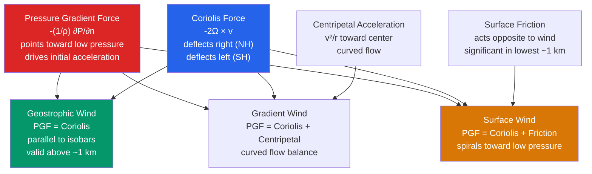

# 🌬️ Pressure Gradient Force and Winds

> [!abstract] TL;DR
> Wind is fundamentally driven by pressure differences: air accelerates from high toward low pressure via the **pressure gradient force**, $\text{PGF} = -\frac{1}{\rho}\nabla P$. In the real atmosphere this force is never acting alone — it is balanced by the **Coriolis force** (giving *geostrophic* flow), by **friction** near the surface, and by **centripetal acceleration** in curved flow (giving the *gradient wind*). Because wind speed is proportional to the strength of the pressure gradient, **tightly packed isobars on a weather map mean strong winds**. The **primitive equations of motion on a rotating Earth** govern the whole system, and from them emerge the Hadley cell, the trade winds, and the midlatitude westerlies — the entire planetary circulation is PGF forcing shaped by rotation.

---

## Intuition — analogy FIRST

Think of pressure as the height of water in a landscape. A **high-pressure region is a full mountain reservoir**; a **low-pressure region is an open drain in the valley floor**. Just as water rushes downhill from the reservoir to the drain, air rushes from high pressure toward low pressure. The *steeper* the slope (the more closely packed the contours), the *faster* the flow — which is exactly why densely spaced isobars signal a gale.

But there is a twist that has no everyday counterpart: the Earth is **spinning**. Imagine trying to pour that water while standing on a fast-turning merry-go-round — the stream never goes straight to where you aimed; it curves away. On the rotating Earth the **Coriolis force** deflects moving air (to the *right* in the Northern Hemisphere), so instead of blowing straight into a low, the wind ends up circling *around* it. Give a bowl of water a spin and watch it drain: the water does not fall straight down the plughole, it **spirals**. That spiral is the essence of atmospheric wind — pressure pulls the air inward, rotation bends it sideways, and the compromise is a curving, circulating flow.

---

## How It Works

Newton's second law for a parcel of air on the rotating Earth is the starting point. Per unit mass, the horizontal acceleration equals the sum of the pressure gradient force, the Coriolis force, and friction. Which *terms matter* depends on the scale of the motion and the distance from the ground — and each dominant balance has its own name: geostrophic (aloft, straight flow), gradient (curved flow), and the frictional surface wind (in the boundary layer). The diagram shows how the four forces combine into the three canonical balances.



### Deriving the pressure gradient force

Consider a small box of air of dimensions $\delta x \times \delta y \times \delta z$ and density $\rho$. Pressure on its left face ($x$) pushes right with force $P(x)\,\delta y\,\delta z$; pressure on the right face pushes left with $P(x+\delta x)\,\delta y\,\delta z$. The net $x$-force is
$$
F_x = -\big[P(x+\delta x) - P(x)\big]\,\delta y\,\delta z = -\frac{\partial P}{\partial x}\,\delta x\,\delta y\,\delta z.
$$
Dividing by the mass $\rho\,\delta x\,\delta y\,\delta z$ gives the **acceleration per unit mass**, and generalizing to all three axes:
$$
\boxed{\ \mathbf{a}_{\text{PGF}} = -\frac{1}{\rho}\nabla P\ }
$$
The minus sign is the whole story: the force points **from high toward low pressure** (down the gradient), and it is larger where isobars are packed close (large $|\nabla P|$).

### Equations of motion on a rotating Earth

Working in a frame rotating with the Earth at angular velocity $\boldsymbol\Omega$, the horizontal momentum equations pick up the Coriolis term $-2\boldsymbol\Omega\times\mathbf v$ and a friction term $\mathbf F_r$:
$$
\frac{D\mathbf v}{Dt} = -\frac{1}{\rho}\nabla_{\!h} P \;-\; 2\boldsymbol\Omega\times\mathbf v \;+\; \mathbf F_r .
$$
In component form, defining the **Coriolis parameter** $f = 2\Omega\sin\varphi$ (latitude $\varphi$):
$$
\frac{Du}{Dt} = -\frac{1}{\rho}\frac{\partial P}{\partial x} + f v + F_{rx}, \qquad
\frac{Dv}{Dt} = -\frac{1}{\rho}\frac{\partial P}{\partial y} - f u + F_{ry}.
$$
These, together with the hydrostatic equation, the continuity (mass) equation, and the thermodynamic energy equation, form the **primitive equations** integrated by every weather and climate model.

### The geostrophic approximation

For large-scale flow away from the surface, the acceleration and friction terms are *small* compared with the PGF and Coriolis terms (the ratio is the **Rossby number** $Ro = U/fL \ll 1$ for synoptic scales, e.g. $U\sim10$ m/s, $f\sim10^{-4}$ s$^{-1}$, $L\sim10^{6}$ m $\Rightarrow Ro\sim0.1$). Dropping them leaves an exact standoff between PGF and Coriolis — **geostrophic balance**:
$$
f v_g = \frac{1}{\rho}\frac{\partial P}{\partial x}, \qquad
f u_g = -\frac{1}{\rho}\frac{\partial P}{\partial y},
$$
so the **geostrophic wind** is
$$
\boxed{\ u_g = -\frac{1}{f\rho}\frac{\partial P}{\partial y}, \qquad v_g = \frac{1}{f\rho}\frac{\partial P}{\partial x}\ }
\qquad\Longleftrightarrow\qquad
\mathbf v_g = \frac{1}{f\rho}\,\hat{\mathbf k}\times\nabla_{\!h} P.
$$
The cross product means $\mathbf v_g$ is **perpendicular to the pressure gradient** — i.e. it blows *along the isobars*, with low pressure to its **left** in the Northern Hemisphere. This is the single most important idealization in dynamic meteorology: to a first approximation, upper-level winds simply follow the height contours on a 500 hPa chart.

### The thermal wind relation

The geostrophic wind changes with height because $\rho$ (and hence pressure surfaces) tilt where temperature varies horizontally. Writing the geostrophic balance in pressure coordinates and differentiating with respect to $\ln P$ gives the **thermal wind**:
$$
\frac{\partial \mathbf v_g}{\partial \ln P} = -\frac{R}{f}\,\hat{\mathbf k}\times\nabla_{\!P} T,
$$
often written for the *thermal wind vector* $\mathbf V_T = \mathbf v_g(\text{top}) - \mathbf v_g(\text{bottom})$. In words: **the vertical shear of the geostrophic wind is proportional to the horizontal temperature gradient**, and $\mathbf V_T$ blows parallel to the isotherms (thickness contours) with cold air to its left in the NH. This is *why* the jet stream sits above the strong pole-to-equator temperature contrast — the wind must strengthen with height wherever a horizontal temperature gradient exists.

### Gradient wind balance

Real flow is curved (around highs and lows), so centripetal acceleration $v^2/R$ cannot be neglected. Balancing PGF, Coriolis, and curvature along the radius gives the **gradient wind equation**:
$$
\frac{v^2}{R} + f v = \frac{1}{\rho}\frac{\partial P}{\partial n}.
$$
- Around a **low** (cyclonic curvature), the centripetal term adds to Coriolis, so the actual wind is **subgeostrophic** (slower than $v_g$).
- Around a **high** (anticyclonic curvature), it subtracts, so the wind is **supergeostrophic** — and a hard limit on how tight anticyclones can get (there is a maximum PGF a high can sustain, which is why highs have weak gradients and gentle winds).

### Surface wind and the cross-isobar angle

In the lowest ~1 km — the **planetary boundary layer** — friction opposes the wind and *weakens* the Coriolis deflection. The three-way balance of PGF, Coriolis, and friction leaves a net force pointing partly *across* the isobars toward low pressure, so **surface wind crosses the isobars at an angle of ~15° over the ocean and ~30–45° over rough land**, spiraling *into* lows and *out of* highs. The vertical structure of this turning is the **Ekman spiral**: wind direction rotates and speed increases with height until it matches the geostrophic wind at the top of the boundary layer.

### Ageostrophic wind, divergence, and vertical motion

The difference between the actual wind and the geostrophic wind is the **ageostrophic wind**, $\mathbf v_{ag} = \mathbf v - \mathbf v_g$. It is small in magnitude but dynamically decisive: the *purely* geostrophic wind is nearly non-divergent, so it is the ageostrophic component that produces **horizontal convergence and divergence** — and, through continuity, the **rising and sinking motion** that makes weather. Upper-level divergence over a surface low evacuates mass, lowering surface pressure and deepening the cyclone; this coupling is why the **500 hPa "steering level"** governs the life cycle of surface systems.

### Global pressure patterns

The same physics, integrated over the planet, organizes the mean circulation into belts: the **equatorial trough** (ITCZ, persistent low), the **subtropical highs** near 30° (sinking branch of the Hadley cell), the **subpolar lows** near 60°, and the **polar highs**. The PGF between the subtropical highs and the equatorial trough drives the **trade winds**; the gradient between the subtropical highs and subpolar lows drives the **midlatitude westerlies**.

---

## Key Concepts / Details

### Secondary Level

- **Wind blows from high to low pressure** — that is the fundamental push. Air always tries to flow "downhill" in pressure.
- **Tightly packed isobars → strong winds.** The closer the pressure lines on a map, the steeper the pressure "slope," and the faster the wind. Widely spaced isobars mean calm.
- **Rotation around highs and lows.** In the Northern Hemisphere, winds spin **clockwise around highs** and **counterclockwise around lows**; in the Southern Hemisphere both reverse. (Memory aid: NH lows are "cyclones" spinning counterclockwise.)
- **Surface winds vs winds aloft.** A 10 m weather-station wind is slowed and turned by friction and terrain; winds aloft (measured by balloons and aircraft) are stronger and blow more nearly along the isobars.
- **Beaufort scale (0–12).** A practical 0-to-12 scale for estimating wind force from observable effects — from 0 (calm, smoke rises vertically) to 12 (hurricane force, widespread destruction) — invented for sailing ships before anemometers were common.

### Undergraduate Level

**Pressure gradient force:** $\mathbf a_{\text{PGF}} = -\frac{1}{\rho}\nabla P$, directed down-gradient (toward low pressure); magnitude set by isobar spacing.

**Coriolis parameter:** $f = 2\Omega\sin\varphi$, where $\Omega = 7.292\times10^{-5}$ s$^{-1}$. It is **zero at the equator**, maximal at the poles ($f\approx1.46\times10^{-4}$ s$^{-1}$), and *negative* in the Southern Hemisphere. Two common idealizations: the **$f$-plane** ($f$ constant) for local studies, and the **$\beta$-plane** ($f = f_0 + \beta y$, $\beta = df/dy$) which retains the crucial latitudinal variation responsible for Rossby waves.

**Geostrophic wind (component form):**
$$
u_g = -\frac{1}{f\rho}\frac{\partial P}{\partial y}, \qquad v_g = \frac{1}{f\rho}\frac{\partial P}{\partial x}.
$$
Note that $u_g\propto 1/f$: for the *same* pressure gradient, geostrophic winds are **stronger toward the equator** (small $f$) and weaker toward the poles.

**Gradient wind balance:** $\dfrac{v^2}{R} + f v = \dfrac{1}{\rho}\dfrac{\partial P}{\partial n}$ — cyclonic flow is subgeostrophic, anticyclonic flow supergeostrophic.

**Thermal wind:** $\dfrac{\partial \mathbf v_g}{\partial \ln P} = -\dfrac{R}{f}\,\hat{\mathbf k}\times\nabla_{\!P}T$. The vertical shear of the geostrophic wind equals (minus) the horizontal temperature gradient rotated 90°; $\mathbf V_T$ is parallel to the thickness contours.

**Ekman spiral & the boundary layer.** Friction in the lowest ~1 km produces a **cross-isobar inflow angle of ~15–30°** and a wind vector that rotates with height. The net **Ekman transport** integrated through the layer is 90° to the right of the surface stress (NH).

**Ageostrophic wind:** $\mathbf v_{ag} = \mathbf v - \mathbf v_g$. Small, but it carries essentially all the horizontal divergence; via continuity ($\nabla\cdot\mathbf v_h + \partial\omega/\partial p = 0$) it drives vertical motion and hence clouds and precipitation.

**The 500 hPa "steering level."** Mid-tropospheric flow (~5.5 km), largely free of friction, advects surface systems downstream; forecasters read troughs/ridges and jet cores off the 500 hPa chart to anticipate where surface lows will move and deepen.

### Graduate Level

**Full primitive equations on the sphere.** In pressure coordinates the horizontal momentum, hydrostatic, continuity, and thermodynamic equations are
$$
\frac{D\mathbf v}{Dt} + f\,\hat{\mathbf k}\times\mathbf v = -\nabla_p\Phi + \mathbf F, \quad
\frac{\partial\Phi}{\partial p} = -\frac{RT}{p}, \quad
\nabla_p\!\cdot\!\mathbf v + \frac{\partial\omega}{\partial p} = 0, \quad
\frac{DT}{Dt} - \frac{\kappa T\,\omega}{p} = \frac{J}{c_p},
$$
where $\Phi$ is geopotential and $\omega = Dp/Dt$.

**Boussinesq / anelastic approximation.** Density variations are neglected except where multiplied by gravity (buoyancy); this filters sound waves while retaining the essential dynamics — the standard framework for GFD process studies.

**Scale analysis & the Rossby number.** $Ro = U/(fL)$ measures the ratio of inertial to Coriolis accelerations. Synoptic flow has $Ro\sim0.1$, justifying geostrophy; mesoscale and tropical flows have $Ro\sim1$, where geostrophy fails and the full equations are needed.

**Quasi-geostrophic (QG) theory.** An expansion in $Ro$ that keeps geostrophic advection but predicts the small ageostrophic circulation. Its centerpiece is **QG potential vorticity** conservation and the diagnostic **omega equation**, which recovers vertical motion $\omega$ from the geostrophic fields alone — the theoretical backbone of synoptic forecasting.

**Q-vectors and the omega equation.** Reformulating QG forcing as the divergence of the **Q-vector**, $\nabla\cdot\mathbf Q$, gives a clean rule: **convergence of Q forces ascent, divergence of Q forces descent** — a fast graphical diagnosis of where clouds and precipitation develop.

**Potential vorticity (PV).** For a shallow layer, $q = (f+\zeta)/h$ is materially conserved (Ertel PV in the continuous case, $q = (f+\zeta)\,\partial\theta/\partial p$ up to sign). **PV invertibility** means that, given the PV field and a balance condition, one can recover the entire balanced wind and mass fields — the modern unifying language of large-scale dynamics.

**Sawyer–Eliassen equation.** Diagnoses the ageostrophic secondary circulation in a frontal zone, tying together confluence, tilting, and diabatic heating — the theoretical basis for frontogenesis.

**Idealized Hadley cell from angular momentum.** Assuming conservation of axial angular momentum $M = (\Omega a\cos\varphi + u)a\cos\varphi$ for air rising at the equator and moving poleward yields the observed subtropical jet and the ~30° poleward extent of the cell — a clean analytic model of the tropical overturning.

**Held–Suarez benchmark.** A canonical idealized-forcing test (Newtonian relaxation to a prescribed radiative-equilibrium temperature plus simple boundary drag) used to compare dynamical cores of GCMs without the complications of full physics.

---

## Python demo — geostrophic wind from a schematic pressure field

The script builds a schematic sinusoidal sea-level pressure field $P(x,y) = P_0 - \Delta P\,\sin(2\pi x/L)$, computes the geostrophic wind components $u_g, v_g$ by **finite differences** (via `numpy.gradient`), and overlays the geostrophic wind vectors on the isobars. Because $P$ varies only in $x$, the pressure gradient points east–west while the wind blows **north–south, parallel to the isobars** — a direct visual proof of the central geostrophic fact that *wind blows along, not across, the isobars*.

```python
# Geostrophic wind from a schematic pressure field, by finite differences.
# Runnable with numpy + matplotlib.
import numpy as np
import matplotlib.pyplot as plt

# ---- Parameters (midlatitude) ----
f   = 1.0e-4        # Coriolis parameter [1/s]  (~45 deg latitude)
rho = 1.2           # air density [kg/m^3]
P0  = 101_300.0     # background pressure [Pa]
dP  = 2_000.0       # pressure amplitude [Pa]  (20 hPa)
L   = 5.0e6         # zonal wavelength [m]      (5000 km)

# ---- Grid (a 5000 km x 5000 km domain) ----
n = 40
x = np.linspace(0.0, L, n)
y = np.linspace(0.0, L, n)
X, Y = np.meshgrid(x, y)          # shape (n, n), indexing='xy'

# ---- Schematic pressure field: P(x,y) = P0 - dP*sin(2*pi*x/L) ----
P = P0 - dP * np.sin(2.0 * np.pi * X / L)

# ---- Finite-difference pressure gradient (np.gradient handles spacing) ----
dPdy, dPdx = np.gradient(P, y, x)  # note: axis 0 is y, axis 1 is x

# ---- Geostrophic wind: u_g = -(1/f rho) dP/dy,  v_g = (1/f rho) dP/dx ----
ug = -(1.0 / (f * rho)) * dPdy
vg =  (1.0 / (f * rho)) * dPdx
speed = np.hypot(ug, vg)

# ---- Plot: isobars + geostrophic wind vectors ----
fig, ax = plt.subplots(figsize=(8, 7))
cs = ax.contour(X/1e3, Y/1e3, P/100.0, levels=12, cmap='coolwarm')
ax.clabel(cs, inline=True, fontsize=8, fmt='%d hPa')
q = ax.quiver(X/1e3, Y/1e3, ug, vg, speed, cmap='viridis',
              scale=400, width=0.004)
cb = fig.colorbar(q, ax=ax, label='wind speed [m/s]')
ax.set_xlabel('x  [km]'); ax.set_ylabel('y  [km]')
ax.set_title('Geostrophic wind (arrows) blows ALONG the isobars')
ax.set_aspect('equal')
plt.tight_layout(); plt.show()

# ---- Console check: analytic vs numerical peak wind ----
# Analytic: v_g = (1/f rho) * dP/dx = -(dP*2pi/L)/(f rho) * cos(2pi x/L)
v_peak = (dP * 2.0 * np.pi / L) / (f * rho)
print(f"Max |u_g| (should be ~0):        {np.max(np.abs(ug)):.3f} m/s")
print(f"Max |v_g| (numerical):           {np.max(np.abs(vg)):.2f} m/s")
print(f"Max |v_g| (analytic prediction): {v_peak:.2f} m/s")
```

Expected console output (rounded): $|u_g|\approx 0$ (the field has no $y$-gradient), and the peak $|v_g|\approx 21$ m/s — a realistic midlatitude wind — matching the analytic value $v_g^{\max} = \dfrac{\Delta P\,(2\pi/L)}{f\rho}$. The figure shows vertical isobars (constant $x$) with arrows pointing due north where the pressure decreases eastward and due south where it increases, strongest where the isobars are most tightly packed — the wind is everywhere **90° to the pressure gradient**, exactly as geostrophy demands.

---

## Real-World Notes

- **500 hPa steering.** Operational forecasters read the mid-tropospheric (500 hPa) height field to find the "steering winds" that advect surface cyclones and anticyclones downstream; a surface low generally tracks with the flow just ahead of the upper trough.
- **Trade winds.** The persistent tropical easterlies are PGF-driven: air flows from the **subtropical highs (~30°)** toward the **equatorial trough (ITCZ)**, then is turned westward by the Coriolis force — the reliable "trade" that carried sailing ships across the Atlantic.
- **Beaufort scale.** Devised by Royal Navy officer Francis Beaufort in 1805, the 0–12 scale let sailors estimate wind force from sea state and sail behavior long before mechanical anemometers — still used in marine forecasts today.
- **Ekman transport & upwelling.** Wind stress on the ocean, balanced against Coriolis and pressure gradients, drives net **Ekman transport** 90° to the wind; along coasts this pumps cold, nutrient-rich water upward (e.g. the Peru and California currents), sustaining the world's most productive fisheries.
- **Record surface wind.** The fastest sustained surface wind ever directly measured on Earth was **372 km/h (231 mph) at Mount Washington, New Hampshire, on 12 April 1934**, produced as a strong pressure gradient was funneled and amplified by a mountain-wave/terrain event over the summit.

---

## Common Pitfalls

1. **"Wind blows from high to low pressure."** Only the *initial* acceleration does. Above the boundary layer, the Coriolis force turns the flow until it runs **along the isobars** (geostrophic), not across them. The down-gradient intuition is right only for the frictional surface component.
2. **Thinking the Coriolis force can speed air up.** The Coriolis force is always perpendicular to the velocity, so it **does no work** — it can only *change direction*, never wind speed. Any change in speed comes from the PGF or friction.
3. **Applying geostrophy at the equator.** As $\varphi\to0$, $f = 2\Omega\sin\varphi\to0$ and $\mathbf v_g = \frac{1}{f\rho}\hat{\mathbf k}\times\nabla P$ blows up. Geostrophic balance is **invalid within a few degrees of the equator**, which is also why tropical cyclones cannot spin up right at the equator — they need enough Coriolis (roughly poleward of 5°) to organize rotation.
4. **Confusing surface and upper-level circulation around a low.** Surface winds **spiral inward** into a low (friction breaks the balance, allowing convergence and ascent); the winds aloft blow **around** the low nearly parallel to the height contours. The inflow at the bottom and outflow aloft are what sustain a storm.
5. **Misreading the thermal wind.** Thermal wind says the *vertical shear* of the geostrophic wind is set by the *horizontal temperature gradient*. It is **not** a claim that "temperature gradients drive the wind" directly — it is a diagnostic balance relating shear to the baroclinic temperature structure (and explaining why the jet sits above the strongest temperature contrast).

---

## Related Concepts

- [[_MOC_Atmospheric_Dynamics]] — section map for the atmospheric-dynamics chapter of this vault.
- [[Coriolis_Effect_and_Geostrophic_Balance]] — the deflecting force that turns down-gradient acceleration into flow along the isobars; the partner of the PGF in geostrophic balance.
- [[Jet_Streams_and_Upper_Level_Flow]] — the thermal-wind consequence of the PGF system: winds strengthen with height over the strongest temperature contrast, forming the jet.
- [[Fronts_and_Extratropical_Cyclones]] — where ageostrophic circulations, frontogenesis, and the Sawyer–Eliassen balance play out in real storms.
- [[Tropical_Meteorology_and_Monsoons]] — the low-latitude regime where $f\to0$ and geostrophy gives way to other balances.
- [[Atmospheric_Pressure_and_the_Hydrostatic_Equation]] — supplies the *vertical* pressure structure and the isobars whose *horizontal* gradient is the wind's engine.
- [[Global_Atmospheric_Circulation]] — the planetary Hadley/Ferrel/Polar cells and wind belts that emerge from PGF forcing plus rotation.
- [[_MOC_Physics_Master]] — cross-vault entry point to the underlying mechanics.
- [[Newtons_Laws_and_Kinematics]] — $\mathbf F = m\mathbf a$ applied to an air parcel is literally the momentum equation used here.
- [[Rotational_Dynamics|Rotational Dynamics and Torque]] — rotating reference frames, angular velocity $\boldsymbol\Omega$, and the fictitious (Coriolis/centrifugal) forces they introduce.
- [[Fluid_Statics_and_Properties]] — the hydrostatic pressure field and fluid-parcel concept on which atmospheric dynamics is built.

---

## Review Questions

**Secondary.** Why do surface winds in the Northern Hemisphere spiral *counterclockwise* into a low-pressure system? In which direction do winds spiral around a *high*-pressure system in the *Southern* Hemisphere? And why are the isobars packed tightly in a hurricane but spread far apart in a gentle sea breeze?

**Undergraduate.** Starting from the horizontal momentum equations $\frac{Du}{Dt} = -\frac{1}{\rho}\frac{\partial P}{\partial x} + fv$ and $\frac{Dv}{Dt} = -\frac{1}{\rho}\frac{\partial P}{\partial y} - fu$, apply the geostrophic approximation to derive the geostrophic wind components $u_g$ and $v_g$. What is the Coriolis parameter $f$, and how does it vary with latitude? Explain physically why geostrophic balance is a poor approximation near the equator.

**Graduate.** Derive the thermal wind relation $\frac{\partial \mathbf v_g}{\partial \ln P} = -\frac{R}{f}\,\hat{\mathbf k}\times\nabla_P T$. Then suppose a 500 hPa temperature gradient of $-3$ K per 100 km points southward (warm air to the south) at 45°N. What is the resulting change of the geostrophic wind with height, $\partial v_g/\partial z$, and in which direction? What physical process drives this vertical shear, and how does it explain the existence and location of the jet stream?

---

## Sources

- Holton, J. R., & Hakim, G. J. — *An Introduction to Dynamic Meteorology* (5th ed.), Academic Press. Primitive equations, geostrophic and gradient balance, thermal wind, QG theory, PV.
- Pedlosky, J. — *Geophysical Fluid Dynamics* (2nd ed.), Springer. Scaling, Rossby number, quasi-geostrophy, potential vorticity, and balanced flow.
- Andrews, D. G. — *An Introduction to Atmospheric Physics* (2nd ed.), Cambridge University Press. Pressure gradient force, Coriolis effect, boundary-layer winds, and global circulation.

---

#Meteorology #AtmosphericDynamics #PressureGradientForce #GeostrophicWind #AtmosphericWind
