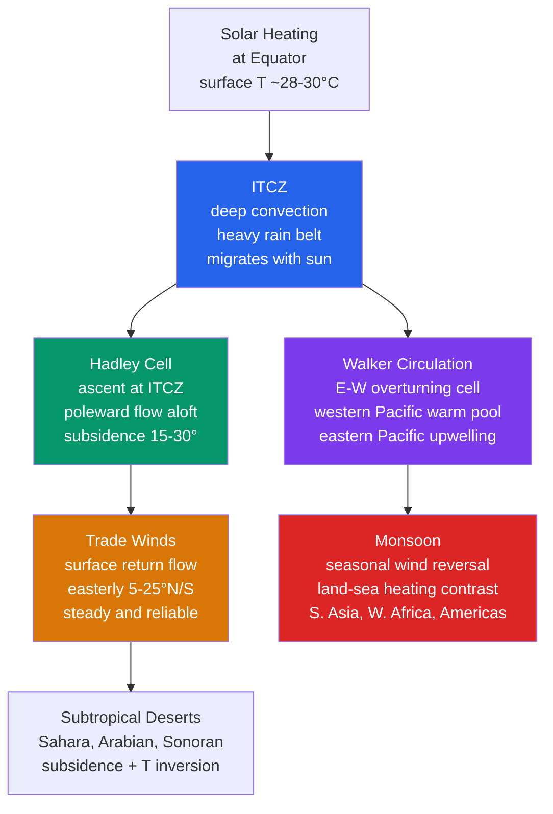

# 🌏 Tropical Meteorology and Monsoons

> [!abstract] TL;DR
> The tropics run on a fundamentally different dynamical playbook from the midlatitudes: with the Coriolis parameter $f = 2\Omega\sin\varphi \to 0$ at the equator, **geostrophic balance fails** and weather is governed instead by **moist convection, SST gradients, and equatorially trapped waves**, not by the baroclinic frontal systems of higher latitudes. The **Intertropical Convergence Zone (ITCZ)** — a band of deep convection where the trade winds collide — is Earth's largest rain belt and migrates seasonally with the Sun. The **Hadley cell** lifts air at the ITCZ, carries it poleward aloft, and sinks it near 30° (making the subtropical deserts) while returning it equatorward as the **trade winds**; angular-momentum conservation in this overturning builds the **subtropical jets**. The **Walker circulation** is the *zonal* (east–west) overturning driven by the tropical Pacific SST gradient, and its collapse *is* **El Niño**. **Monsoons** — the seasonal reversal of the low-level winds driven by differential land–ocean heating — deliver most of the annual rainfall to South and East Asia, West Africa, and the Americas, feeding billions of people.

---

## Intuition — analogy FIRST

Picture the tropics as a **planetary heat engine with the firebox parked under the equator**. The Sun beats down most directly on the equatorial belt, heating a warm, wet ocean surface (SST ~ 28–30 °C). That heat does not stay put: warm, humid air becomes buoyant, towers upward in thunderstorms, and dumps its rain — this rising branch is the **ITCZ**. Having lost its moisture, the air spreads poleward high in the atmosphere, cools, and **sinks around 30° latitude**, where the descending, drying air bakes the great deserts (Sahara, Arabian, Sonoran). At the surface it flows back toward the equator, bent westward by the Earth's spin into the reliable **trade winds** — the same "trades" that carried sailing ships across the Atlantic and Pacific for centuries. Rise at the equator, sink in the subtropics, return along the surface: that closed loop is the **Hadley cell**, and it is nothing more than a convection cell the size of a hemisphere.

Now for the **monsoon**, hold onto one everyday experience: the **sea breeze**. On a summer afternoon the beach sand is scorching while the water stays cool; the hot land heats the air above it, that air rises, and a cool breeze blows in *from the sea* to replace it. A monsoon is that exact mechanism blown up to **continental scale and seasonal duration**. In summer, a landmass the size of Asia heats far faster than the surrounding ocean (rock and soil have low heat capacity and shed their heat as *sensible* warming, while the ocean spreads absorbed heat through a deep mixed layer). The overheated continent becomes a giant low-pressure region that **inhales moist oceanic air across the equator**, wringing it out as the monsoon rains. In winter the engine reverses: the land cools below the ocean, the pressure gradient flips, and dry continental air blows *out* to sea. The word "monsoon" itself comes from the Arabic *mawsim*, "season" — a **wind that changes with the season**, of which the rain is merely the consequence.

---

## How It Works

The tropical atmosphere has one dominant energy source (latent heat released by deep convection) and one crippling handicap (vanishing Coriolis force). Everything below follows from those two facts. Because $f$ is tiny, the atmosphere cannot support the sharp geostrophic fronts and pressure gradients of the midlatitudes — a horizontal temperature perturbation is smeared out almost instantly by fast-moving gravity and equatorial waves (the **weak temperature gradient** regime). Circulations are therefore driven *directly* by where the heating is: the atmosphere overturns **meridionally** (the Hadley cell) and **zonally** (the Walker circulation), and organizes convection into equatorially trapped **Kelvin and Rossby waves** and their planetary-scale envelope, the **MJO**. The diagram traces how solar heating at the equator cascades into the whole family of tropical circulations.



### The ITCZ: structure and seasonal migration

The ITCZ is the surface **convergence zone** where the northeasterly and southeasterly trade winds meet. The colliding air has nowhere to go but up, so it forms a nearly continuous ribbon of towering cumulonimbus and the heaviest sustained rainfall on the planet. Crucially, the ITCZ **is not fixed at the equator** — it sits where the surface is warmest and the trade-wind confluence is strongest, which lags the overhead Sun. Over the warm continents and the western Pacific it swings far north in boreal summer (into the Sahel and the Indian subcontinent, ~15–20 °N in July) and back south in austral summer, following the seasonal march of maximum SST and insolation. Because the Northern Hemisphere holds more land (which heats readily) and because the Atlantic and Pacific ocean circulations transport heat northward across the equator, the *annual-mean* ITCZ actually sits slightly **north of the equator (~5–7 °N)** rather than exactly on it.

### The double-ITCZ problem in climate models

In the real eastern Pacific and Atlantic the ITCZ is normally a **single band north of the equator**, held there by the cold tongue of upwelled water and low stratocumulus decks south of the equator. Coupled climate models notoriously produce a **spurious second ITCZ** in the Southern Hemisphere, giving a symmetric "double ITCZ" and too much rain south of the equator. It is one of the most stubborn systematic biases in CMIP-class models, traceable to errors in simulated stratocumulus cloud, the cold tongue SST, and the coupling between convection and the surface — a reminder that tropical convection is still imperfectly parameterized.

### Hadley cell dynamics and angular momentum conservation

The Hadley cell is a thermally direct overturning: warm air rises at the ITCZ, moves poleward in the upper troposphere, subsides in the subtropics, and returns equatorward at the surface. The key to its structure is **conservation of axial angular momentum**. Absolute angular momentum per unit mass is
$$
M = \left(\Omega a\cos\varphi + u\right) a\cos\varphi ,
$$
where $\Omega$ is Earth's rotation rate, $a$ its radius, $\varphi$ latitude, and $u$ the zonal wind. Air that rises at the equator (where $u\approx 0$) carries $M_{\rm eq} = \Omega a^2$. As it flows poleward and the radius of its latitude circle ($a\cos\varphi$) shrinks, conserving $M$ forces the zonal wind to spin *up* — just as a skater pulling in her arms spins faster:
$$
u_M(\varphi) = \Omega a\,\frac{\sin^2\varphi}{\cos\varphi}.
$$
By ~25–30° this predicts westerly winds of many tens of m/s — the **subtropical jet** perched at the poleward edge of the cell. (Angular-momentum theory *over*-predicts the jet because midlatitude eddies bleed momentum away, but it correctly locates the jet and the cell's ~30° reach.) The **descending branch** near 30° is warmed adiabatically as it sinks, producing a strong subsidence inversion, cloud-free skies, and the **subtropical desert belt**.

### The tropical tropopause layer (TTL)

The tropical tropopause is the coldest, highest tropopause on Earth (**cold-point ~ 17 km, ~ −80 °C**). Rather than a sharp surface, it is a transition zone — the **TTL**, roughly 14–18.5 km — that behaves partly like the troposphere below and partly like the stratosphere above. It is the **gateway for air entering the stratosphere**: rising tropical air is "freeze-dried" as it passes through the cold point, setting the extremely low water-vapor content of the entire stratosphere. The TTL therefore controls stratospheric humidity and, through it, part of the radiative balance of the climate system.

### The Walker circulation and its ENSO connection

Whereas the Hadley cell overturns **north–south**, the **Walker circulation** overturns **east–west** along the equator. It is driven by the zonal SST gradient of the tropical Pacific: air **rises over the warm pool** of the western Pacific / Maritime Continent (SST ~ 29–30 °C, heavy rain), flows eastward aloft, and **sinks over the cool, upwelling eastern Pacific** (off South America), returning westward as the surface **easterly trades**. Those easterlies pile warm water in the west and drive coastal upwelling in the east — the ocean and atmosphere hold each other up in a **Bjerknes feedback**.

- **El Niño** warms the eastern/central Pacific, *reducing* the SST gradient. The Walker circulation **weakens or collapses**, the rising branch shifts eastward, and rainfall redistributes across the basin — bringing drought to Indonesia/Australia and floods to the eastern Pacific.
- **La Niña** sharpens the gradient and *strengthens* the Walker cell.

The full coupled behavior is developed in the ENSO note; here the point is that the Walker circulation is the *atmospheric half* of that coupled oscillation.

### Trade winds and the trade-wind inversion

The **trade winds** are the surface equatorward-and-westward branch of the Hadley cell — northeasterlies in the Northern Hemisphere, southeasterlies in the Southern, spanning roughly 5–25° in each hemisphere. They are among the steadiest winds on Earth (hence "trade," from the sense of a *regular path*). Capping them is the **trade-wind inversion**: the Hadley cell's descending, warming air sits atop a shallow, cool, moist marine layer, creating a temperature inversion typically near **~2 km**. This inversion **caps convection**, limiting the trades to fields of shallow "trade cumulus" rather than deep storms — until the air reaches the ITCZ, where the inversion lifts and convection erupts.

### Monsoon dynamics: cross-equatorial flow and low-level jets

A monsoon is, at heart, a **giant seasonally reversing sea breeze**, but the rotating Earth adds structure. In the boreal-summer South Asian monsoon:

1. The Tibetan Plateau and the Asian landmass heat intensely, forming a deep **thermal low** over northwest India/Pakistan.
2. The pressure gradient pulls the Southern-Hemisphere southeasterly trades **across the equator**. Crossing into the Northern Hemisphere, the Coriolis force turns them into **southwesterlies** — the moist monsoon flow.
3. This cross-equatorial flow is concentrated into a narrow, fast **Somali (Findlater) low-level jet** off East Africa, which funnels enormous moisture from the Indian Ocean into the subcontinent.
4. Moisture convergence over India feeds the monsoon rains; the release of latent heat reinforces the continental low, a self-sustaining feedback.

The engine is the **land–sea heating contrast**, quantifiable through the **Bowen ratio** (sensible/latent heat flux): over the ocean it is small (~0.1, most heat goes into evaporation), over dry land it is near unity (~1.0, most heat warms the air directly), so summer land heats the atmosphere far more efficiently than the sea.

### The South Asian monsoon and the importance of onset date

The Indian Summer Monsoon (June–September) supplies **~75–90% of India's annual rainfall**. Its **onset over Kerala (~1 June, ±~7 days)** is one of the most watched dates in world agriculture: from there a well-defined advance carries the rains north and west across the subcontinent over about six weeks, with **withdrawal** beginning in September. A **late onset or a mid-season "break"** (a spell of suppressed rain) can devastate the kharif planting season for hundreds of millions of farmers, which is why the monsoon's *timing*, not just its total, is economically decisive.

### The West African Monsoon (WAM)

West Africa has its own monsoon: in boreal summer the ITCZ migrates north into the Sahel, and moist **southwesterly monsoon flow** from the Gulf of Guinea penetrates inland, meeting hot, dry Saharan air along the **intertropical front**. Aloft sits the **African Easterly Jet (AEJ)** near 600–700 hPa (~15 °N), a consequence of the strong surface temperature/moisture gradient between the Sahara and the Guinea coast. Instabilities of the AEJ spawn **African Easterly Waves**, which propagate westward every ~3–5 days and are the **seed disturbances for the majority of Atlantic hurricanes**. WAM rainfall is highly variable, and its multidecadal swings produced the catastrophic Sahel droughts of the late 20th century.

### The MJO: modulating tropical convection

The **Madden–Julian Oscillation (MJO)** is the dominant mode of tropical intraseasonal variability: a **planetary-scale (wavenumber 1–2) envelope of enhanced then suppressed deep convection that propagates eastward** across the Indian and Pacific oceans over roughly **30–60 days** (phase speed ~ 5 m/s). Dynamically it behaves as a coupled **Kelvin–Rossby wave structure** locked to a moving convective heat source. The MJO modulates monsoon onset and active/break cycles, tropical cyclogenesis, and even midlatitude weather through teleconnections — making it the **single largest source of predictability on the 2-to-6-week timescale** that otherwise falls in the forecasting "gap" between weather and seasonal prediction.

---

## Key Concepts / Details

### Secondary Level

- **The ITCZ is Earth's rain belt.** Where the northeast and southeast trade winds collide near the equator, air is forced upward, making a near-permanent line of thunderstorms — the wettest zone on the planet.
- **It moves with the seasons.** The ITCZ (and its rains) follows the Sun's most direct rays, sliding north in July and south in January. This *is* the reason a place can have a distinct wet season and dry season.
- **Trade winds are steady and reliable.** In the tropics the surface winds blow persistently from the northeast (Northern Hemisphere) or southeast (Southern Hemisphere) — dependable enough that sailing ships routed themselves along them for centuries.
- **A monsoon is a seasonal wind reversal.** In summer, moist winds blow *from ocean to land* and bring heavy rain (Mumbai gets a drenching for ~4 months); in winter the winds reverse and blow dry from land to sea. The rain is a *result* of the wind change, not the definition of it.
- **Why deserts sit at ~30°.** The Sahara lies at the same latitude as the rainy Caribbean, yet is bone-dry. That is because the air rising at the equator sinks back down around 30°, and sinking air warms and dries — suppressing clouds and rain and creating the world's great deserts.
- **The tropics lack midlatitude storms.** There are no cold fronts, warm fronts, or wintertime cyclones marching across the tropics as there are over Europe or North America; tropical weather is dominated by showers, thunderstorms, and, occasionally, hurricanes.

### Undergraduate Level

**Why Coriolis is weak in the tropics.** The Coriolis parameter is $f = 2\Omega\sin\varphi$, with $\Omega = 7.292\times10^{-5}\,\text{s}^{-1}$. It is **exactly zero at the equator** and small nearby: $f(10^\circ) \approx 2.5\times10^{-5}\,\text{s}^{-1}$, roughly a quarter of its midlatitude value. Because the geostrophic wind is $\mathbf v_g = \frac{1}{f\rho}\hat{\mathbf k}\times\nabla_h P$, the $1/f$ factor **blows up** as $\varphi\to 0$: geostrophic balance is simply **not the leading-order balance in the deep tropics** (roughly within $|f| < 5\times10^{-5}\,\text{s}^{-1}$, i.e. equatorward of ~20°). A different balance takes over.

**The weak temperature gradient (WTG) balance.** Where $f$ is small, any horizontal temperature anomaly generates fast gravity/Kelvin waves that flatten it almost instantly, so **horizontal temperature gradients stay weak**. The dominant balance in the thermodynamic equation becomes adiabatic cooling against diabatic heating:
$$
\omega\,\frac{\partial\bar\theta}{\partial p} \;\approx\; \dot Q ,
$$
i.e. **the vertical velocity is set locally by the convective heating**. Rising motion occurs where there is heating (the ITCZ, the warm pool); subsidence occurs everywhere else. This is why tropical circulations are "heating-driven" rather than "pressure-gradient-driven."

**Hadley cell from angular momentum.** With $M = (\Omega a\cos\varphi + u)a\cos\varphi$ conserved for upper-branch air leaving the equator at rest,
$$
u_M(\varphi) = \Omega a\,\frac{\sin^2\varphi}{\cos\varphi},
$$
giving the subtropical jet at the poleward edge (~25–30°). The **Held–Hou** estimate of the cell's poleward extent,
$$
\varphi_H \sim \left(\frac{5\,\Delta_H\, g H}{3\,\Omega^2 a^2}\right)^{1/2},
$$
(with $\Delta_H$ the fractional equator-to-pole radiative-equilibrium temperature contrast and $H$ a vertical scale) yields ~20–30°, matching the observed desert/jet latitude.

**Trade-wind inversion.** Subsidence in the Hadley cell's descending branch places warm, dry air over a shallow cool marine layer, capping it with an inversion near ~2 km. This limits the trades to shallow cumulus and only lets convection go deep once the air reaches the ITCZ.

**Walker circulation.** The zonal SST gradient across the tropical Pacific (warm west, cool east) drives an east–west overturning: ascent over the warm pool, descent over the cold tongue, surface easterlies in between. It is coupled to the ocean through the **Bjerknes feedback**, and its weakening is El Niño.

**Monsoon and the Somali Jet.** Differential land–ocean heating (quantified by the Bowen ratio contrast, ocean ~0.1 vs land ~1.0) drives a cross-equatorial flow that the Coriolis force turns into the southwesterly monsoon; it is concentrated into the **Somali (Findlater) low-level jet**. The **Indian Summer Monsoon onset over Kerala (~1 June)** marks the start of the rains.

**ITCZ migration.** Driven by the seasonal cycle of insolation and SST, modulated by cross-equatorial ocean heat transport (which shifts the annual-mean ITCZ north of the equator).

**MJO.** A 40–50 day, eastward-propagating (~5 m/s) planetary convective envelope with Kelvin-wave dynamics; the principal driver of tropical predictability at 2–6 weeks.

### Graduate Level

**The Matsuno–Gill model.** Matsuno (1966) and Gill (1980) solved for the **steady linear response of the tropical atmosphere to an imposed diabatic heating** on the equatorial $\beta$-plane. Using a damped (Rayleigh friction $\varepsilon$, Newtonian cooling) shallow-water system for a single baroclinic mode with gravity-wave speed $c$:
$$
\varepsilon u - \beta y\,v = -\frac{\partial\phi}{\partial x},\qquad
\varepsilon v + \beta y\,u = -\frac{\partial\phi}{\partial y},\qquad
\varepsilon\phi + c^2\!\left(\frac{\partial u}{\partial x}+\frac{\partial v}{\partial y}\right) = -Q .
$$
The solution has a characteristic **asymmetric structure**: an eastward-decaying **Kelvin-wave** response *east* of the heating and a pair of westward-decaying **Rossby-wave** cyclones *west* of the heating. Because the Kelvin wave propagates only eastward and Rossby waves only westward, the heating "radiates" its influence east (Kelvin) and west (Rossby) with different structure — reproducing the observed low-level westerlies to the west and easterlies to the east of the warm pool. **This is the theoretical skeleton of the Walker circulation**, and it explains why an eastward shift of heating during El Niño reorganizes the whole basin.

**Equatorial wave theory (Matsuno 1966).** The equator acts as a **waveguide** because $f$ changes sign across it. Solutions of the equatorial $\beta$-plane shallow-water equations are meridionally trapped, with amplitude
$$
\psi(y)\propto \exp\!\left(-\frac{y^2}{2L_{\rm eq}^2}\right),\qquad L_{\rm eq}=\left(\frac{c}{\beta}\right)^{1/2}\!\!\approx 1500\ \text{km},
$$
the **equatorial Rossby radius** ($\beta = 2\Omega/a \approx 2.3\times10^{-11}\,\text{m}^{-1}\text{s}^{-1}$). The wave family includes the **eastward Kelvin wave** ($v\equiv 0$, dispersion $\omega = ck$), the **westward equatorial Rossby waves**, mixed Rossby–gravity (Yanai) waves, and inertia–gravity waves — the full dynamical alphabet of tropical variability, and the basis for understanding the MJO, convectively coupled waves, and the atmospheric bridge of ENSO.

**The WTG approximation, formally.** In the limit of small $f$ and long time scales, the horizontal temperature (buoyancy) tendency and advection are negligible, so the thermodynamic equation reduces to a **local balance between adiabatic cooling and diabatic heating**, $\omega\,\partial\bar\theta/\partial p = \dot Q/c_p$ (equivalently $\omega\,S = J/c_p$ with static stability $S$). Vertical velocity is then *diagnosed* from heating rather than predicted from the momentum equations. WTG is valid where the **gravity-wave adjustment time is short compared with the convective/forcing time scale** — i.e. throughout the deep tropics on time scales longer than a day and horizontal scales large compared with $L_{\rm eq}$. It breaks down near the equator on short scales and wherever rotation is dynamically significant.

**Convective regimes.** Tropical deep convection ranges from **CAPE-limited** (buoyancy is quickly consumed, convection is triggered but shallow/quasi-equilibrated with large-scale forcing) to **CAPE-rich** (large reservoirs of instability, explosive deep convection). Quasi-equilibrium closures (Arakawa–Schubert, Emanuel, Betts–Miller) assume convection consumes CAPE as fast as the large scale generates it — the assumption underpinning most GCM convective parameterizations and a central uncertainty for simulating the ITCZ, the MJO, and monsoon variability.

**Tropical cyclogenesis and WISHE.** Mature tropical cyclones intensify via the **Wind-Induced Surface Heat Exchange (WISHE)** feedback (Emanuel): stronger surface winds increase evaporative (latent) heat flux from the warm ocean, which fuels stronger convection and a lower central pressure, which increases the winds — a finite-amplitude air–sea instability functioning like a **Carnot heat engine** between the warm sea surface and the cold outflow near the tropopause. (Developed fully in the tropical-cyclone note.)

**Monsoon intraseasonal oscillation (ISO).** The active/break cycles of the monsoon are governed by a northward-propagating **intraseasonal oscillation** (~30–60 days), related to but distinct from the eastward MJO; understanding and predicting these transitions is a frontier problem for subseasonal forecasting.

**ENSO–monsoon teleconnection.** Historically there is a **negative correlation between El Niño and Indian monsoon rainfall** — El Niño's eastward-shifted Walker ascent suppresses convection over the subcontinent. This relationship has **weakened in recent decades**, plausibly due to warming trends, the Indian Ocean Dipole, and internal variability, complicating seasonal monsoon prediction.

**Monsoons under warming.** Thermodynamics is clear (a warmer atmosphere holds more moisture, ~7%/K by Clausius–Clapeyron, favoring **more intense monsoon rainfall**), but the **dynamical** response (circulation strength, onset timing, land–sea contrast, aerosol effects) is uncertain — so projected changes in monsoon *totals and variability* remain among the highest-stakes open questions in climate science.

---

## Python demo — Hadley cell extent from angular momentum, and a schematic streamfunction

The script does two things. First it builds the **angular-momentum-conserving upper-branch zonal wind** $u_M(\varphi)$ for air leaving the equatorial source region with surface wind $u_s$, using $M = (\Omega a\cos\varphi + u)\,a\cos\varphi$; it then locates the **subtropical-jet latitude** where $u_M$ reaches a target jet speed, and computes an independent **Held–Hou** estimate of the Hadley cell's poleward extent. Second, it plots a **schematic zonal-mean Hadley streamfunction** $\psi(\varphi,p)$ — two thermally direct cells rising at the equator and sinking near $\pm\varphi_H$. Runnable with `numpy` + `matplotlib`.

```python
# Hadley cell: angular-momentum-conserving jet latitude + schematic streamfunction.
# Runnable with numpy + matplotlib.
import numpy as np
import matplotlib.pyplot as plt

# ---- Physical constants ----
Omega = 7.292e-5            # Earth rotation rate [1/s]
a     = 6.371e6            # Earth radius [m]
g     = 9.81               # gravity [m/s^2]

# ---- Case parameters ----
u_s      = -5.0            # equatorial surface zonal wind [m/s] (easterly trade)
u_jet    = 30.0           # observed subtropical jet speed we solve for [m/s]
Delta_H  = 1.0/6.0        # fractional equator-pole radiative-eq. temp contrast
H        = 12.0e3         # vertical scale of the cell [m]

# ---- Angular-momentum-conserving upper-branch zonal wind ----
# Source (equator) angular momentum per unit mass: M0 = (Omega*a + u_s)*a
# At latitude phi:  M = (Omega*a*cos(phi) + u)*a*cos(phi) = M0
#   =>  u_M(phi) = (Omega*a + u_s)/cos(phi) - Omega*a*cos(phi)
phi = np.radians(np.linspace(0.5, 45.0, 400))
M0  = (Omega * a + u_s) * a
u_M = M0 / (a * np.cos(phi)) - Omega * a * np.cos(phi)

# ---- Latitude where u_M reaches the target jet speed (subtropical jet) ----
idx      = np.argmin(np.abs(u_M - u_jet))
phi_jet  = np.degrees(phi[idx])

# ---- Independent Held-Hou estimate of Hadley cell poleward extent ----
phi_H = np.degrees(np.sqrt(5.0 * Delta_H * g * H / (3.0 * Omega**2 * a**2)))

# ---- Undergraduate textbook check: upper wind at 25 deg N (u_s = -5 m/s) ----
p25   = np.radians(25.0)
u_25  = (Omega * a + u_s) / np.cos(p25) - Omega * a * np.cos(p25)

print(f"Equatorial Omega*a (planetary wind)     : {Omega*a:8.1f} m/s")
print(f"AM-conserving u at 25 deg N (u_s=-5 m/s) : {u_25:8.1f} m/s")
print(f"Latitude where u_M = {u_jet:.0f} m/s (jet)     : {phi_jet:8.1f} deg")
print(f"Held-Hou Hadley cell edge estimate       : {phi_H:8.1f} deg")

# ---- Schematic zonal-mean Hadley streamfunction psi(phi, p) ----
lat_edge = max(phi_H, 30.0)                       # plot out to the cell edge
lat = np.linspace(-lat_edge, lat_edge, 200)       # degrees
p   = np.linspace(1000.0, 100.0, 120)             # hPa (surface -> tropopause)
LAT, P = np.meshgrid(lat, p)

# Antisymmetric two-cell pattern: rising at equator, sinking near +/- lat_edge.
# psi = 0 on all boundaries (top, bottom, cell edges) -> closed overturning cells.
vert = np.sin(np.pi * (1000.0 - P) / (1000.0 - 100.0))
horiz = np.sin(np.pi * LAT / lat_edge)
psi = 1.0e11 * vert * horiz                       # [kg/s], schematic amplitude

# ---- Figure ----
fig, (ax1, ax2) = plt.subplots(1, 2, figsize=(13, 5.2))

# (a) Angular-momentum-conserving jet profile
ax1.plot(np.degrees(phi), u_M, lw=2, color="#7c3aed",
         label=r"$u_M(\varphi)=\Omega a\,\sin^2\varphi/\cos\varphi$ (+ $u_s$ term)")
ax1.axhline(u_jet, color="#d97706", ls="--", label=f"jet speed = {u_jet:.0f} m/s")
ax1.axvline(phi_jet, color="#dc2626", ls=":", label=f"jet lat = {phi_jet:.1f}°")
ax1.axvline(phi_H, color="#059669", ls=":", label=f"Held-Hou edge = {phi_H:.1f}°")
ax1.set_xlabel("Latitude [deg]"); ax1.set_ylabel("Upper-branch zonal wind [m/s]")
ax1.set_title("Angular-momentum-conserving subtropical jet")
ax1.set_ylim(0, 120); ax1.legend(fontsize=8); ax1.grid(alpha=0.3)

# (b) Schematic Hadley streamfunction
cf = ax2.contourf(LAT, P, psi / 1e10, levels=15, cmap="RdBu_r")
ax2.contour(LAT, P, psi / 1e10, levels=15, colors="k", linewidths=0.4)
ax2.invert_yaxis()                                # pressure decreases upward
ax2.set_xlabel("Latitude [deg]"); ax2.set_ylabel("Pressure [hPa]")
ax2.set_title(r"Schematic Hadley streamfunction $\psi(\varphi,p)$")
fig.colorbar(cf, ax=ax2, label=r"$\psi$ [$10^{10}$ kg/s]")

plt.tight_layout(); plt.show()
```

Expected console output (rounded): $\Omega a \approx 464.6$ m/s; the AM-conserving upper wind at 25 °N is **≈ 86 m/s** (far stronger than any observed jet — precisely because eddies remove angular momentum in the real atmosphere); $u_M$ reaches the observed ~30 m/s jet near **~19°**, and the Held–Hou estimate places the Hadley edge near **~22°** — both consistent with the observed subtropical-jet/desert latitude of ~25–30°. The right panel shows two closed overturning cells, positive (clockwise) in the Northern Hemisphere and negative (counter-clockwise) in the Southern, rising together at the equator and sinking in the subtropics — the canonical zonal-mean Hadley circulation.

---

## Real-World Notes

- **The Indian monsoon feeds 1.4 billion people.** Roughly 75–90% of India's annual rainfall arrives in the June–September monsoon; a **delayed onset or a weak/broken monsoon means drought** for hundreds of millions, spikes food prices, and can shave points off national GDP — which is why the onset over Kerala is a national event.
- **The Sahel droughts of the 1970s–80s.** A multi-decade decline in West African Monsoon rainfall produced catastrophic famine across the Sahel, later linked in large part to **Atlantic (and Indo-Pacific) SST anomalies** that shifted the ITCZ and weakened the monsoon flow — a stark example of ocean forcing of continental rainfall.
- **The Bowen ratio powers the monsoon.** The contrast between ocean (**Bowen ratio ~0.1**, heat goes into evaporation) and land (**~1.0**, heat warms the air directly) is the physical reason a summer continent heats the atmosphere far faster than the sea — the differential heating that drives the seasonal wind reversal.
- **The MJO is the key to subseasonal forecasting.** Because the MJO is a coherent, eastward-marching convective envelope, it provides the **primary source of tropical (and some extratropical) predictability on 30–60 day time scales**, filling the gap between weather forecasts and seasonal outlooks; operational centers now issue routine MJO phase forecasts.
- **The trades have been changing.** Multi-decadal observations show the Pacific **trade winds and Walker circulation have varied and, in places, weakened** in recent decades in step with ENSO trends and Pacific decadal variability — with knock-on effects for global surface-temperature trends (the early-2000s "hiatus" was tied to a stronger Walker cell and enhanced ocean heat uptake).

---

## Common Pitfalls

1. **"The ITCZ is always a single narrow band."** Not so. Over the **eastern Pacific and Atlantic** it can split or appear as a **double ITCZ**, and coupled climate models chronically over-produce a spurious Southern-Hemisphere branch — the "double-ITCZ bias." The ITCZ's shape and number of branches depend on the underlying SST and stratocumulus, not on geometry.
2. **"A monsoon is just a rainy season."** A monsoon is defined by a **seasonal reversal of the low-level winds** driven by land–sea heating contrast; the heavy rain is a *consequence* of the moist onshore flow, not the definition. Regions can be wet without being monsoonal, and the wind reversal is the diagnostic feature.
3. **"Geostrophic balance applies everywhere."** In the deep tropics ($|f| \lesssim 5\times10^{-5}\,\text{s}^{-1}$) the $1/f$ in $\mathbf v_g$ diverges and geostrophy **fails**. Tropical circulations obey different balances — **weak temperature gradient** dynamics and equatorial wave theory — not the geostrophic/gradient-wind balances of the midlatitudes.
4. **"The Hadley cell rises exactly at the equator."** Its ascending branch follows the **ITCZ, which typically sits a few degrees off the equator (~5–10° into the summer hemisphere, annual mean ~5–7 °N)**, not on the equator itself — because that is where the surface is warmest and the trade confluence strongest, and because cross-equatorial ocean heat transport pulls it north.
5. **"The Walker and Hadley circulations are the same thing."** They are orthogonal. The **Hadley cell is meridional (north–south)** overturning driven by the equator-to-pole heating gradient; the **Walker circulation is zonal (east–west)** overturning driven by the along-equator SST gradient. El Niño alters the **Walker** cell; it does not simply "turn off the Hadley cell."

---

## Related Concepts

- [[_MOC_Atmospheric_Dynamics]] — section map for the atmospheric-dynamics chapter of this vault.
- [[Pressure_Gradient_Force_and_Winds]] — the force balance behind the trade winds and monsoon flow; the tropics are where its geostrophic simplification breaks down.
- [[Coriolis_Effect_and_Geostrophic_Balance]] — the vanishing of $f$ at the equator is the single fact that makes tropical dynamics distinct; it also turns cross-equatorial monsoon flow into southwesterlies.
- [[Mesoscale_Meteorology_and_Severe_Weather]] — deep tropical convection, squall lines, and mesoscale convective systems are the building blocks of the ITCZ.
- [[Global_Atmospheric_Circulation]] — the Hadley cell and trade winds are the tropical component of the planetary Hadley/Ferrel/Polar system.
- [[Ocean_Atmosphere_Coupling_and_ENSO]] — the Walker circulation is the atmospheric half of the Bjerknes-coupled ENSO oscillation described here.
- [[Climate_Variability_and_Teleconnections]] — the MJO, ENSO–monsoon links, and Sahel rainfall are canonical tropical teleconnections.
- [[Tropical_Cyclones_and_Hurricanes]] — grow out of tropical disturbances (e.g. African easterly waves) via the WISHE air–sea feedback introduced here.
- [[_MOC_Physics_Master]] — cross-vault entry point to the underlying mechanics.
- [[Newtons_Laws_and_Kinematics]] — the momentum equations governing tropical winds are $\mathbf F = m\mathbf a$ for an air parcel.
- [[Rotational_Dynamics|Rotational Dynamics and Torque]] — angular-momentum conservation ($M = (\Omega a\cos\varphi + u)a\cos\varphi$) is the same principle that spins up the subtropical jet.
- [[_MOC_Earth_Science_Master]] — cross-vault link: monsoons, deserts, and the ITCZ shape global climate and geomorphology.

---

## Review Questions

**Secondary.** Why do the trade winds blow steadily *from the northeast* in the Northern-Hemisphere tropical Atlantic, while the ITCZ between them is a zone of weak, variable winds and frequent thunderstorms? And why is the Sahara desert, sitting at roughly the same latitude as the rainy Caribbean, almost completely dry?

**Undergraduate.** Explain the Hadley cell circulation in terms of **angular-momentum conservation**. Air rises at the equator carrying planetary angular momentum and moves poleward; using $M = (\Omega a\cos\varphi + u)\,a\cos\varphi$, show why the zonal wind must increase toward the poleward edge and form a subtropical jet. If the surface easterly trade wind at the equator is $u_s = -5$ m/s (westward), what upper-level zonal wind at **25 °N** conserves angular momentum per unit mass? (Take $\Omega = 7.29\times10^{-5}\,\text{s}^{-1}$, $a = 6.37\times10^{6}$ m.) What real-atmosphere mechanism limits the Hadley cell at its poleward edge, and why is the observed jet weaker than the angular-momentum prediction?

**Graduate.** Describe the **Matsuno–Gill model** of the steady tropical atmospheric response to an imposed diabatic heating. Why does the response take the form of an **eastward Kelvin wave to the east** and **westward Rossby waves to the west** of the heating, and how does this structure explain the Walker circulation and its reorganization during El Niño? Then state the **weak temperature gradient (WTG)** approximation, $\omega\,\partial\bar\theta/\partial p \approx \dot Q$: what physical process justifies neglecting horizontal temperature gradients in the tropics, and where/when does WTG break down?

---

## Sources

- Holton, J. R., & Hakim, G. J. — *An Introduction to Dynamic Meteorology* (5th ed.), Academic Press. Tropical dynamics, equatorial waves, the Hadley cell and angular momentum, weak temperature gradient balance.
- Webster, P. J., et al. — "The Meteorology of Monsoons," and reviews of monsoon dynamics in *Annual Review of Earth and Planetary Sciences* (2020). Cross-equatorial flow, the Somali jet, monsoon onset, and ENSO–monsoon teleconnections.
- Gill, A. E. — *Atmosphere–Ocean Dynamics* (1982), Academic Press. The Matsuno–Gill model, equatorially trapped Kelvin and Rossby waves, and the tropical response to heating.

---

#Meteorology #TropicalMeteorology #Monsoon #ITCZ #HadleyCell #WalkerCirculation
