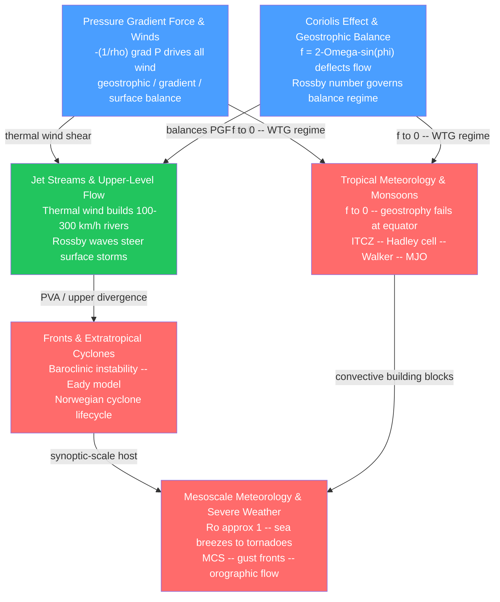

# Atmospheric Dynamics — Map of Content

> [!info] How to use this map
> Start with **Fundamentals** (the two blue nodes), follow the arrows through intermediate topics, and use the Learning Path below as your sequenced guide.
> Each node links to a full note. Come back to this map when you feel lost between scales or concepts.

Atmospheric dynamics is the study of the forces and flows that govern air motion — from the basic push of pressure differences and the twist of Earth's rotation, through the planet-girdling jet streams and the baroclinic storms they steer, to the convective complexes and violent local phenomena that fill the gap between weather maps and individual thunderstorm cells. The six notes in this section build from first principles (force balance) upward through scale, each layer of complexity requiring the one beneath it.

---

## Concept Map

*(Blue = fundamental entry points, Green = intermediate synthesis, Red = advanced / applied — arrows show "required by" or "leads to")*

---

## Learning Path

*Recommended order for a first pass through this section:*

1. [[Pressure_Gradient_Force_and_Winds]] — start here because every other note assumes you know why air moves and what force balance governs it; covers PGF, geostrophic wind, thermal wind, gradient wind, and the Ekman spiral.
2. [[Coriolis_Effect_and_Geostrophic_Balance]] — the companion to note 1: the rotating-frame force that turns down-gradient acceleration into flow along the isobars; establishes the Rossby number as the gatekeeper between balanced and unbalanced flow.
3. [[Jet_Streams_and_Upper_Level_Flow]] — the thermal wind relation applied globally: how the equator-to-pole temperature contrast builds 9–12 km rivers of air, and how their meanders (Rossby waves) steer all surface weather below.
4. [[Fronts_and_Extratropical_Cyclones]] — baroclinic instability converts the temperature gradient into spinning storms; the Norwegian cyclone model, conveyor belts, bomb cyclogenesis, and the Eady dispersion curve.
5. [[Tropical_Meteorology_and_Monsoons]] — the regime where f → 0 and everything changes: ITCZ, Hadley cell, Walker circulation, monsoon dynamics, equatorial waves, and the MJO.
6. [[Mesoscale_Meteorology_and_Severe_Weather]] — the sub-synoptic world (Ro ≈ 1): sea breezes, orographic flow, density currents, MCSs, tornadoes, and the radar/NWP tools used to forecast them.

---

## Notes in This Section

| Note | Key Concept | Level |
|------|-------------|-------|
| [[Pressure_Gradient_Force_and_Winds]] | PGF = -(1/rho) grad P; geostrophic, gradient, and surface wind balances; thermal wind; Ekman spiral | Beginner |
| [[Coriolis_Effect_and_Geostrophic_Balance]] | f = 2-Omega-sin(phi); rotating-frame deflection; Rossby number; beta-plane and Rossby wave restoring mechanism | Beginner |
| [[Jet_Streams_and_Upper_Level_Flow]] | Thermal wind builds the polar and subtropical jets; Rossby wave meanders; blocking; Arctic amplification debate | Intermediate |
| [[Fronts_and_Extratropical_Cyclones]] | Baroclinic instability (Eady model); Norwegian cyclone lifecycle; warm/cold conveyor belts; bomb cyclogenesis | Intermediate |
| [[Tropical_Meteorology_and_Monsoons]] | ITCZ migration; Hadley cell angular momentum; Walker circulation; Matsuno-Gill model; monsoon cross-equatorial flow | Intermediate |
| [[Mesoscale_Meteorology_and_Severe_Weather]] | Sea/land breezes; orographic Froude number; density-current gust fronts; MCSs; supercell tornadogenesis | Advanced |

---

## Key Questions This Section Answers

- Why does atmospheric wind blow *along* isobars rather than *across* them from high to low pressure?
- How does the equator-to-pole temperature contrast generate fast, narrow jet streams at the tropopause?
- What instability causes small perturbations on the polar front to grow into thousand-kilometre cyclones in two to three days?
- Why does the tropical atmosphere obey fundamentally different dynamical laws than the midlatitudes, and what replaces geostrophic balance there?
- How do planetary-scale Rossby wave meanders in the jet stream produce blocking events, heat waves, and cold outbreaks lasting weeks?
- What separates mesoscale phenomena (sea breezes, tornadoes, squall lines) from synoptic-scale systems, and why do they require convection-allowing models to forecast?

---

## Cross-Section Links

- [[_MOC_Atmospheric_Thermodynamics]] — the preceding section; provides the hydrostatic equation, potential temperature, CAPE, and static stability that atmospheric dynamics draws on at every step.
- [[_MOC_Climate_System]] — the following section; dynamics supplies the mean circulations (Hadley, Ferrel, Polar cells, jet streams) that the climate system integrates over seasons and centuries.
- [[_MOC_Weather_Forecasting]] — the operational application of this section: QG omega equation diagnosis, synoptic chart analysis, convective outlooks, and NWP model interpretation all rest on the dynamical theory developed here.

---

## Cross-Vault Links

### Physics Vault

- [[Newtons_Laws_and_Kinematics]] — F = ma applied to an air parcel in a rotating frame is literally the momentum equation that opens every note in this section.
- [[Rotational_Dynamics|Rotational Dynamics and Torque]] — rotating reference frames, angular velocity, and the fictitious Coriolis and centrifugal forces; the mathematical foundation for the Coriolis effect and angular-momentum conservation in the Hadley cell.
- [[Fluid_Statics_and_Properties]] — hydrostatic pressure, buoyancy, and the fluid-parcel concept that underpins density currents, orographic flow, and the hydrostatic equation linking pressure to temperature.

### Earth Science Vault

- [[_MOC_Earth_Science_Master]] — the atmospheric circulations in this section (trade winds, monsoons, ITCZ, jet streams) are primary drivers of weathering, erosion, ocean circulation, and the climate signal preserved in the geologic record.

---

#MOC #Meteorology #AtmosphericDynamics
