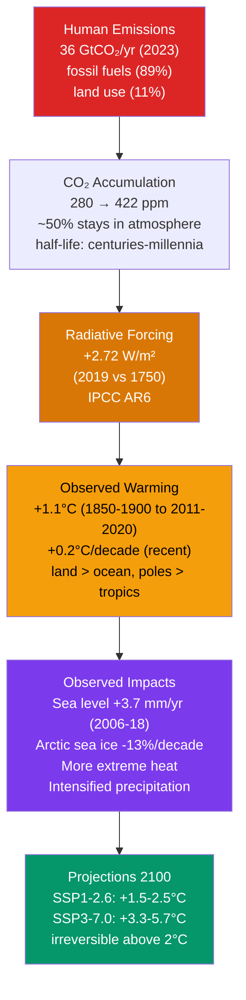

# 🌍 Anthropogenic Climate Change

> [!abstract] TL;DR
> Human activities — chiefly **fossil-fuel combustion**, with secondary contributions from **deforestation** and **agriculture** — have raised atmospheric CO₂ from a pre-industrial **280 ppm** to **422 ppm (2024)**, driving **1.1–1.2 °C** of global warming since 1850. IPCC AR6 (2021) concludes it is **"unequivocal"** that human influence has warmed the climate. Observed consequences already underway include **sea-level rise (~20 cm since 1900, accelerating)**, **Arctic sea-ice decline (~13 %/decade)**, intensified heatwaves, heavier extreme precipitation, and poleward ecosystem shifts. Limiting warming to **1.5 °C** requires roughly **halving emissions by 2030** and reaching **net-zero CO₂ by ~2050**; the remaining carbon budget for 1.5 °C is about **500 GtCO₂** (50 % probability) counting from 2020.

## Intuition — analogy FIRST

Imagine a house on a cold day with the heater running at a fixed setting. The house reaches a steady temperature where heat leaking out through the walls exactly balances heat pumped in. Now add a thick layer of insulation to the walls **without touching the heater dial**. Heat now escapes more slowly, so the interior warms up — and keeps warming — until the (now-reduced) leak rate again matches the same heater output. The house settles at a **higher steady temperature**, purely because you changed how easily heat escapes.

Earth works the same way. The Sun is the fixed heater; the atmosphere's greenhouse gases are the insulation. For millennia the carbon cycle kept CO₂ in rough balance, so the planet's "insulation" was steady. Burning fossil carbon that took hundreds of millions of years to bury is like stapling extra insulation onto the walls: Earth's energy budget goes out of balance, and the surface must warm until it radiates enough extra infrared to close the gap. Crucially, **this warming is not a future forecast — it is already measured**, and it is unfolding in **decades** rather than the millennia over which past natural climate shifts occurred.

---

## How It Works



**The Keeling Curve — the primary evidence.** Since 1958 the Scripps/NOAA observatory at Mauna Loa has measured atmospheric CO₂ continuously, producing the most iconic dataset in Earth science. It shows a relentless rise from ~315 ppm (1958) to >422 ppm today, overlaid with an annual saw-tooth: CO₂ dips each Northern-Hemisphere summer as vegetation photosynthesizes and rebounds each winter as respiration dominates. Ice-core records extend this backward, pinning the pre-industrial baseline at **280 ppm** and showing today's level is higher than at any point in at least **3 million years**.

**The carbon cycle and its sinks.** Of every unit of CO₂ humanity emits, only about **half stays airborne**; the rest is absorbed roughly equally by the **ocean** (dissolving into seawater, forming carbonic acid) and the **land biosphere** (enhanced plant growth, CO₂ fertilization). These sinks are a partial reprieve — but they are not permanent, they are weakening under stress, and ocean uptake comes at the cost of **acidification**.

**CO₂ lifetime.** There is no single number. About 50 % of a CO₂ pulse is drawn down within decades, but a stubborn ~20–30 % lingers for **centuries to millennia** while the slow ocean-carbonate and rock-weathering sinks operate. This long tail is why warming is effectively **irreversible on human timescales** and why cumulative emissions — not the annual rate — set the eventual temperature.

**Radiative forcing and attribution.** The perturbation to Earth's top-of-atmosphere energy budget from all human activity (1750→2019) is assessed at **+2.72 W/m² (ERF)**. CO₂ is the largest single term, followed by CH₄, halocarbons, N₂O and tropospheric ozone. Working against them, **aerosols** (sulfate haze, cloud brightening) contribute roughly **−1.0 W/m²** of cooling, masking part of the greenhouse warming. Critically, **natural forcings net to near zero** over the industrial era: solar output has been flat-to-declining since 1980, and volcanic aerosols cause only brief (1–2 year) cooling episodes. See [[Greenhouse_Effect_and_Radiative_Forcing]] for the forcing physics.

**Detection and attribution (D&A).** Two distinct questions. **Detection** asks: is the observed change larger than what internal variability (natural chaos) could produce? For global temperature the answer is emphatic — the trend exceeds an estimated **5σ** of internal variability. **Attribution** asks: what *caused* it? Climate models are run three ways — greenhouse-gas forcing only, natural forcing only (solar + volcanic), and all forcings combined — and only the **all-forcings runs with anthropogenic GHGs reproduce the observations**. Natural-only runs show essentially no warming after 1970.

**The observational fingerprint.** Multiple independent temperature records — **GISTEMP** (NASA), **HadCRUT5** (UK Met Office/CRU), and **Berkeley Earth** — agree on ~1.1–1.2 °C of warming since 1850–1900, despite using different stations, corrections, and infilling methods. The **spatial and vertical pattern** is a smoking gun: the troposphere warms while the **stratosphere cools**, land warms faster than ocean, and the Arctic amplifies — a signature that greenhouse forcing predicts but a brightening Sun would not (solar warming would heat the whole column).

---

## Key Concepts / Details

### Secondary Level

- **CO₂ and the Keeling Curve.** Atmospheric CO₂ has climbed from **280 ppm** (before industrialization) to **422 ppm** (2024) — a **~50 % increase** — measured directly at Mauna Loa since 1958 and confirmed in ice cores. The rise tracks fossil-fuel use almost perfectly.
- **The 1.1 °C of warming.** Global average surface temperature is now about **1.1–1.2 °C warmer** than the 1850–1900 pre-industrial baseline. 2023 briefly touched **~1.45 °C**. This is a *global average*: some regions warm far more, a few can temporarily cool.
- **Human vs natural causes.** The warming is **attributed to humans**, primarily CO₂ from burning coal, oil, and gas. The Sun has not brightened; volcanoes cause only short cooling blips. Only the human-emissions explanation matches what is observed.
- **Observed impacts.** Sea level up **~20 cm since 1900** and accelerating; Arctic summer sea ice shrinking **~13 %/decade**; heatwaves hotter and more frequent; heavy-rain events more intense; plants, animals, and growing seasons shifting toward the poles and uphill.
- **SSP scenarios.** Future climate depends on choices. Scientists use **Shared Socioeconomic Pathways** — from **SSP1-1.9** (very rapid decarbonization, ~1.5 °C) to **SSP5-8.5** (very high emissions, ~4–5 °C). They are *storylines of possible futures*, not predictions.
- **Paris Agreement & net zero.** The 2015 Paris Agreement commits nations to hold warming **well below 2 °C** and pursue **1.5 °C**. **"Net zero"** means human CO₂ emissions are balanced by removals, so no *additional* CO₂ accumulates — the condition required to stop warming.

### Undergraduate Level

- **CO₂ radiative forcing.** Using the standard logarithmic formula $\Delta F = 5.35\,\ln(C/C_0)$ W/m² (Myhre et al. 1998), the forcing from pre-industrial (280 ppm) to today (422 ppm) is $5.35\ln(422/280) \approx \mathbf{2.2\ W/m^2}$ from **CO₂ alone**.
- **Total effective radiative forcing (ERF).** IPCC AR6 assesses the ERF of **all** anthropogenic agents (2019 vs 1750) at **+2.72 W/m²** — larger than CO₂ alone once CH₄, N₂O, halocarbons, and ozone are added, but reduced by aerosols.
- **Aerosol offset.** The combined aerosol **direct** (scattering/absorbing sunlight) plus **indirect** (cloud-brightening) effect is about **−1.0 W/m²** — a substantial *cooling* that has masked perhaps a third of the greenhouse warming and is the single largest uncertainty in the forcing budget. As air-quality laws cut aerosols, this masked warming emerges.
- **Natural forcings ≈ 0.** Over the long term, solar and volcanic forcing net to approximately zero; total solar irradiance has slightly **declined** since ~1980 even as temperatures rose steeply — decisively ruling out the Sun as the driver.
- **Detection threshold.** The observed global-temperature trend exceeds an estimated **5σ** of the internal-variability distribution, meaning the probability of such a change arising from natural chaos alone is vanishingly small.
- **Attribution method.** Compare three model ensembles against observations: **GHG-only**, **natural-only**, and **all-forcings** (using AMIP-style prescribed-SST and coupled CMIP experiments). Only all-forcings runs including anthropogenic GHGs match the record.
- **Carbon budget.** To keep 1.5 °C within reach, roughly **500 GtCO₂** could be emitted from 2020 at **50 %** probability — or only **~300 GtCO₂** for **67 %** odds. At ~40 GtCO₂/yr, the 50 % budget is spent in little over a decade.
- **Rate of warming.** Since 1970 the surface has warmed at about **0.2 °C/decade** — faster than any comparable multi-decadal interval in the instrumental record.
- **Ocean heat and acidification.** The ocean has absorbed **>90 %** of the excess heat, and surface pH has dropped by about **0.1 unit** since 1850 (a ~30 % rise in hydrogen-ion concentration) as CO₂ dissolves to form carbonic acid.

### Graduate Level

- **Optimal fingerprinting (Allen & Tett 1999).** The formal D&A framework regresses the observed space–time pattern onto model-simulated **signal patterns** (fingerprints), scaling each by an unknown amplitude $\beta$: $\mathbf{y} = \sum_i \beta_i \mathbf{x}_i + \mathbf{u}$. The regression is performed in a metric that **optimizes signal-to-noise** by pre-whitening with the internal-variability covariance (estimated from control runs). A signal is *detected* if its scaling factor $\beta_i$ is significantly **> 0**; it is *attributed* if $\beta_i$ is also consistent with **1** (model amplitude matches reality) while alternative forcings cannot explain the pattern.
- **Detection vs attribution, formally.** *Detection* = the change is inconsistent with internal variability alone. *Attribution* = assigning that change, with a stated confidence, to specific causal forcings after accounting for competing explanations. Attribution is the stronger, harder claim.
- **Single-event attribution.** For a specific extreme (a heatwave, a flood), compute the event's **return period** (or exceedance probability) in two worlds: the **factual** climate ($p_1$) and a **counterfactual** world without anthropogenic forcing ($p_0$), typically via large model ensembles or observational fits. The **Fraction of Attributable Risk** is $\mathrm{FAR} = 1 - p_0/p_1$, and the **risk ratio** $\mathrm{RR} = p_1/p_0$ states how many times more likely the event became. Uncertainty is dominated by estimating $p_0$ for rare tail events and by model-dependent representation of the relevant physics.
- **Model hierarchy.** From cheap to comprehensive: **EMICs** (Earth-system Models of Intermediate Complexity) for long integrations; **RCMs** (Regional Climate Models) for downscaling; and full **ESMs/GCMs** (Earth-System / General-Circulation Models with coupled carbon and biogeochemistry) in **CMIP6**. See [[Climate_Sensitivity_and_Feedbacks]] on the CMIP6 spread and ECS.
- **ECS uncertainty.** CMIP6 widened the Equilibrium Climate Sensitivity range (some models exceed 5 °C), driven mainly by **cloud-feedback** treatment; AR6 nonetheless narrowed the *assessed* likely range to **2.5–4 °C** using multiple lines of evidence beyond raw model output.
- **Scenario architecture.** AR6 scenarios pair a **Shared Socioeconomic Pathway** (societal storyline) with a target **Representative Concentration Pathway** forcing level, e.g. **SSP1-2.6** (~2.6 W/m² by 2100) or **SSP5-8.5** (~8.5 W/m²). The SSP–RCP matrix separates *why* emissions follow a path from *what* radiative endpoint results.
- **Carbon-cycle feedbacks.** Warming can turn sinks into sources: **permafrost thaw** releasing CO₂ and CH₄, **Amazon dieback** shifting rainforest to savanna, and reduced ocean/land uptake efficiency. These feedbacks shrink the carbon budget and are unevenly represented across ESMs.
- **Irreversibility, hysteresis, and tipping elements.** Several subsystems exhibit threshold behavior with **hysteresis** — the **West Antarctic** and **Greenland** ice sheets, the **Amazon**, and the **AMOC** (Atlantic overturning circulation) — with estimated thresholds clustered around **1–3 °C**. Crossing them may commit the system to change that cannot be reversed by simply lowering temperature back.
- **Committed warming and ZEC.** The **Zero-Emission Commitment** — how much additional warming occurs after emissions cease — is assessed near **zero** on multidecadal scales because ocean heat uptake and CO₂ drawdown roughly cancel. This means **warming largely stops when *emissions* stop**, a policy-critical result distinct from "warming in the pipeline."
- **IAMs and climate justice.** **Integrated Assessment Models** couple economics to climate to estimate mitigation costs and optimal pathways, but embed contested assumptions (discount rates, damage functions). Overlaid is **differential vulnerability**: those least responsible for cumulative emissions often bear the greatest impacts — the core of climate-justice analysis.

---

## Python Demo — GMST Record and the Keeling Curve

```python
# Reconstruct two hallmark climate datasets from a simple physical model:
#   (1) Global Mean Surface Temperature (GMST) anomaly, 1880-2023
#       = accelerating forced warming + ENSO wiggles + volcanic dips.
#   (2) The Keeling Curve (Mauna Loa CO2), 1958-2024
#       = accelerating growth + annual biospheric saw-tooth.
# Then fit a linear warming trend over 1970-2023 and annotate key events.

import numpy as np
import matplotlib.pyplot as plt

rng = np.random.default_rng(42)

# ---------- Panel 1: GMST anomaly (relative to 1951-1980 baseline) ----------
years = np.arange(1880, 2024)
t = years - 1880

# Accelerating forced-warming trend (quadratic captures post-1970 speed-up)
trend = -0.25 + 0.0007 * t + 0.000065 * t**2   # ~ -0.25 C (1880) -> ~+1.18 C (2023)

# ENSO-like interannual variability + measurement noise
enso  = 0.10 * np.sin(2 * np.pi * t / 3.6) + 0.06 * np.sin(2 * np.pi * t / 5.0)
noise = rng.normal(0, 0.06, size=t.size)

def gaussian(centre, amp, width):
    return amp * np.exp(-((years - centre) ** 2) / (2 * width**2))

# Volcanic cooling dips (negative) and strong El Nino spikes (positive)
volcanic = -gaussian(1964, 0.15, 1.0) - gaussian(1983, 0.15, 1.0) - gaussian(1992, 0.25, 1.2)
elnino   =  gaussian(1998, 0.15, 0.7) + gaussian(2016, 0.16, 0.7) + gaussian(2023, 0.12, 0.6)

gmst = trend + enso + noise + volcanic + elnino

# Linear trend fit over the modern warming era 1970-2023
mask = years >= 1970
slope, intercept = np.polyfit(years[mask], gmst[mask], 1)
fit = slope * years[mask] + intercept
print(f"1970-2023 warming rate: {slope * 10:.2f} C per decade")

# ---------- Panel 2: Keeling Curve (monthly, 1958-2024) ----------
months = np.arange(1958, 2024 + 1e-9, 1 / 12)
mt = months - 1958
co2_trend    = 315 + 0.75 * mt + 0.013 * mt**2     # ~315 ppm (1958) -> ~421 ppm (2024)
co2_seasonal = 3.0 * np.sin(2 * np.pi * months)    # ~6 ppm peak-to-peak biosphere cycle
co2 = co2_trend + co2_seasonal
print(f"Modelled CO2 in 2024: {co2[-1]:.0f} ppm")

# ---------- Plot ----------
fig, (ax1, ax2) = plt.subplots(2, 1, figsize=(10, 9))

ax1.plot(years, gmst, color="#6b7280", lw=1, alpha=0.8, label="Annual GMST anomaly")
ax1.plot(years[mask], fit, color="#dc2626", lw=2.5,
         label=f"1970-2023 trend: {slope*10:.2f} C/decade")
ax1.axhline(0, color="k", lw=0.6, ls=":")

for yr, txt, dy in [(1992, "Mt. Pinatubo\n(volcanic dip)", -0.45),
                    (1998, "1998\nEl Nino", 0.30),
                    (2016, "2016\nEl Nino", 0.30)]:
    idx = np.where(years == yr)[0][0]
    ax1.annotate(txt, (yr, gmst[idx]), textcoords="offset points",
                 xytext=(0, 40 if dy > 0 else -55), ha="center", fontsize=8,
                 arrowprops=dict(arrowstyle="->", color="#374151"))

ax1.set_ylabel("Temperature anomaly (C)\nvs 1951-1980")
ax1.set_title("Global Mean Surface Temperature, 1880-2023 (synthetic, GISTEMP-like)")
ax1.legend(loc="upper left")
ax1.grid(alpha=0.3)

ax2.plot(months, co2, color="#059669", lw=1)
ax2.axhline(280, color="#9ca3af", ls="--", lw=1)
ax2.text(1960, 285, "pre-industrial 280 ppm", color="#6b7280", fontsize=9)
ax2.scatter([2024], [co2[-1]], color="#dc2626", zorder=5)
ax2.annotate(f"{co2[-1]:.0f} ppm (2024)", (2024, co2[-1]),
             textcoords="offset points", xytext=(-90, -5), color="#dc2626")
ax2.set_xlabel("Year")
ax2.set_ylabel("Atmospheric CO$_2$ (ppm)")
ax2.set_title("The Keeling Curve, 1958-2024 (synthetic, Mauna Loa-like)")
ax2.grid(alpha=0.3)

plt.tight_layout()
plt.show()
```

The two panels tell one story: the **CO₂ curve is smooth and monotonic** (a slow-mixing, long-lived gas), while the **temperature curve is jagged** — ENSO and volcanic eruptions ride on top of the forced trend. Fitting only 1970-2023 recovers the ~0.2 °C/decade modern warming rate, showing how the underlying signal emerges once the internal-variability "weather" is averaged out.

---

## Real-World Notes

- **2023, the hottest year on record.** Global mean temperature reached **~1.45 °C** above pre-industrial for the first time — a margin over the previous record so large it surprised many scientists, amplified by a strong El Niño superimposed on the long-term trend.
- **The 2021 Pacific Northwest heat dome.** Portland hit **46.7 °C (116 °F)** — a value that rapid **event-attribution** analysis found would have been **virtually impossible** without climate change, and at least **150× more likely** in today's warmed climate. It became a landmark case study for attribution science.
- **Ocean heating in tangible units.** The rate of ocean-heat-content increase since 1970 is equivalent to detonating roughly **four Hiroshima-scale atomic bombs per second, continuously** — a visceral illustration of where >90 % of the trapped energy goes.
- **The "hockey stick," vindicated.** Mann et al. (1998/99) reconstructed a millennium of Northern-Hemisphere temperature showing a sharp 20th-century upturn. Despite intense controversy, **every subsequent independent reconstruction** has confirmed that recent warming is unprecedented in at least the last **2,000 years**.
- **The cumulative-emissions ledger.** Humanity has emitted roughly **2,400 GtCO₂** since 1850. About **half remains airborne**, which is precisely why cumulative emissions — not any single year's rate — determine how hot the planet ultimately gets.

---

## Common Pitfalls

1. **"Global warming" is a misleading label.** It refers to the **global mean** temperature; regional *cooling* can occur in a warming world. For example, meltwater freshening the North Atlantic can slow the AMOC and cool the region around **Greenland and the sub-polar Atlantic** even as the planet as a whole warms.
2. **The Sun is not responsible.** Total solar irradiance has been **flat-to-slightly-declining since ~1980**, while temperatures climbed steeply. Solar variability cannot explain the observed warming — and it would warm the whole atmospheric column, whereas the observed pattern is troposphere-warms / stratosphere-cools.
3. **Models project climate, not individual weather.** Climate models forecast the **statistical properties** of the system (distributions, trends, return periods), not whether it will rain on a given day in a given city. Demanding weather-scale prediction from a climate model misunderstands what it does.
4. **The 1998–2013 "pause" was never a stop.** Surface warming *appeared* to slow, but the extra energy kept accumulating in the **deep ocean**; total planetary heat uptake continued unabated. It was a redistribution of heat driven by internal variability, not a halt in climate change.
5. **CO₂ does not have a tidy 100-year lifetime.** About **50 % of a CO₂ pulse is absorbed by land and ocean within decades**, but a residual **~20–30 % persists for centuries to millennia**. Quoting a single lifetime hides this long tail — the very feature that makes the warming effectively irreversible on human timescales.

---

## Related Concepts

- [[_MOC_Climate_System]] — section map for the climate-system unit; start here to orient
- [[Greenhouse_Effect_and_Radiative_Forcing]] — the radiative physics that turns CO₂ accumulation into the +2.72 W/m² forcing driving this warming
- [[Climate_Sensitivity_and_Feedbacks]] — converts a given forcing into eventual equilibrium warming; source of the ECS uncertainty above
- [[Paleoclimatology_and_Ice_Cores]] — how ice cores establish the 280 ppm baseline and show today's CO₂ is unprecedented in 3 million years
- [[Sea_Level_Rise_and_the_Cryosphere]] — the ice-melt and thermal-expansion response, including West Antarctic and Greenland tipping elements
- [[Extreme_Weather_and_Meteorological_Hazards]] — how warming shifts the statistics of heatwaves, extreme rainfall, and other hazards
- [[Droughts_and_Floods]] — the intensified hydrological cycle (wet-gets-wetter, dry-gets-drier) under warming
- [[Tropical_Cyclones_and_Hurricanes]] — how a warmer ocean and moister atmosphere change cyclone intensity and rainfall
- [[Climate_Models_and_Projections]] — the CMIP6/ESM machinery and SSP scenarios behind the 2100 projections
- [[Geoengineering_and_Climate_Intervention]] — solar-radiation-management and carbon-removal responses, and why they are not substitutes for mitigation
- [[_MOC_Physics_Master]] — cross-vault physics entry point
- [[Electromagnetic_Waves_and_Radiation]] — shortwave-in / longwave-out radiation that underlies the energy-budget imbalance
- [[Radioactive_Decay]] — the same exponential-decay mathematics used to describe (imperfectly) atmospheric gas lifetimes
- [[_MOC_Earth_Science_Master]] — cross-vault Earth-science entry point
- [[Mass_Extinctions_and_Paleoclimate]] — deep-time analogues (e.g., the PETM) for rapid carbon release and warming

---

## Review Questions

**Secondary**
- What is the current atmospheric CO₂ concentration, and by how much has it risen since pre-industrial times?
- What is the global mean temperature anomaly today, and what are **three** observed physical impacts of climate change?

**Undergraduate**
- Using $\Delta F = 5.35\,\ln(C/C_0)$ W/m², calculate the CO₂ radiative forcing from pre-industrial (280 ppm) to present (422 ppm). *(Answer: $5.35\ln(422/280) = 5.35\ln 1.507 \approx \mathbf{2.2\ W/m^2}$.)* How does this compare to the total effective radiative forcing from **all** human activities in IPCC AR6, and what role do aerosols play in that balance? *(Total ERF ≈ +2.72 W/m²; aerosols contribute ≈ −1.0 W/m² of cooling that partly masks the greenhouse warming.)*

**Graduate**
- Describe the **optimal-fingerprinting** approach to detection and attribution, and state precisely what distinguishes a **detection** claim from an **attribution** claim.
- For event attribution, explain the **Fraction of Attributable Risk** framework: given the event probability $p_1$ in the factual climate and $p_0$ in a counterfactual world without anthropogenic forcing, how do you compute how many times more likely a specific heatwave became, and what are the dominant sources of uncertainty? *(RR = $p_1/p_0$, FAR = $1 - p_0/p_1$; uncertainty is dominated by estimating $p_0$ in the rare tail and by model representation of the relevant physics.)*

---

## Sources

- IPCC (2021). *Climate Change 2021: The Physical Science Basis (AR6 WGI) — Summary for Policymakers*. Cambridge University Press.
- Hausfather, Z., & Peters, G. P. (2020). "Emissions — the 'business as usual' story is misleading." *Nature*, 577, 618–620.
- Mann, M. E., Bradley, R. S., & Hughes, M. K. (1999). "Northern Hemisphere Temperatures During the Past Millennium: Inferences, Uncertainties, and Limitations." *Geophysical Research Letters*, 26(6), 759–762.

---

#Meteorology #Climatology #ClimateChange #GlobalWarming #IPCC #CarbonBudget
