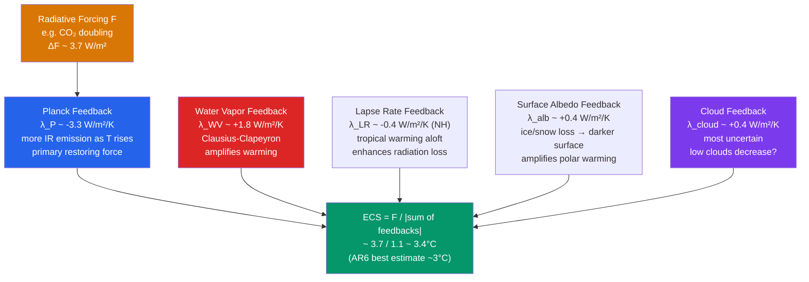

# 🌡️ Climate Sensitivity and Feedbacks

> [!abstract] TL;DR
> **Climate sensitivity** measures how much the global mean surface temperature changes per unit radiative forcing, most commonly stated as the **equilibrium climate sensitivity (ECS)** — the eventual warming after a **doubling of CO₂**. IPCC AR6 assesses **ECS = 2.5–4.0 °C** (*likely* range) with a **best estimate of 3 °C**. The bare **Planck (blackbody) response** to $2\times$CO₂ is only about **+1.2 °C**; **feedbacks** amplify or damp it: **water vapor** (strongly +), **surface albedo** (+, drives Arctic amplification), **lapse rate** (−), the **Planck feedback** itself (−, the restoring force), and **clouds** (net slightly +, but the dominant source of uncertainty). The **transient climate response (TCR ≈ 1.8 °C)** — warming *at the moment* of doubling under a 1 %/yr CO₂ ramp — governs near-term projections, and is smaller than ECS because the ocean absorbs heat for centuries. Almost all remaining ECS uncertainty lives in **low marine cloud feedback**.

## Intuition — analogy FIRST

Think of the climate as a **public-address system**. The extra CO₂ is a **whisper** into the microphone: doubling CO₂ alone, with nothing else changing, would raise Earth's temperature by barely **1.2 °C**. But that whisper runs through an **amplifier** — the feedbacks — and comes out as a **roar** of roughly **3 °C**. The single loudest amplifier stage is **water vapor**: a warmer atmosphere holds more of it (Clausius–Clapeyron), and water vapor is itself a powerful greenhouse gas, so the initial warming feeds back on itself.

The catch is that one amplifier knob is **stuck in a fog**: the **cloud feedback**. We know the water-vapor and albedo gains precisely, but low marine clouds could either dim or brighten as the planet warms, and *how much* they change is the reason the accepted ECS range has a factor-of-2 spread rather than being pinned to a single number. If the low clouds "turned the gain all the way up" — say they largely dissipated — the roar would approach **5 °C** per doubling.

One more piece of intuition: the amplifier is also **slow**. Even after you stop changing the input, the ocean's enormous heat capacity means the system keeps getting louder for centuries. That gap between the *immediate* volume (TCR) and the *final* volume (ECS) is why "how hot in 2100" and "how hot eventually" are two different questions.

---

## How It Works

Climate sensitivity falls out of a single energy-balance statement. Let $N$ be the **top-of-atmosphere (TOA) radiative imbalance** (net downward, W/m²), $F$ the imposed **radiative forcing**, $\lambda$ the **net feedback parameter** (W/m²/K, *negative* for a stable climate), and $\Delta T$ the surface warming:

$$N = F + \lambda\,\Delta T$$

At **equilibrium** the planet has re-balanced, so $N = 0$ and

$$\boxed{\;\Delta T_{eq} = -\frac{F}{\lambda} = \frac{F}{|\lambda|}\;}$$

Everything about sensitivity is contained in the sign and magnitude of $\lambda$, which is a **sum of independent process feedbacks** operating in parallel on the same warming:

$$\lambda_{total} = \lambda_{P} + \lambda_{WV} + \lambda_{LR} + \lambda_{alb} + \lambda_{cloud}$$



**Three flavors of "sensitivity."** They differ in *which feedbacks are switched on* and *what timescale* is implied:

- **TCR — Transient Climate Response.** Warming at the *instant* CO₂ reaches double its initial value in an idealized experiment where CO₂ rises **1 %/year** (doubling after ~70 years). The ocean is still absorbing heat, so **TCR ≈ 1.8 °C < ECS**. TCR is the quantity most relevant to warming *this century*.
- **ECS — Equilibrium Climate Sensitivity** (a.k.a. **Charney sensitivity**). Warming after the system fully equilibrates to $2\times$CO₂ with only **fast feedbacks** active (water vapor, lapse rate, sea-ice/snow albedo, clouds). Ice sheets, vegetation, and the carbon cycle are held fixed. This is the canonical "3 °C" number and takes **centuries** to realize.
- **ESS — Earth System Sensitivity.** Warming once **slow feedbacks** also equilibrate over **millennia** — continental ice sheets melt, vegetation migrates, and the carbon cycle responds. ESS is **larger than ECS** (often estimated at ~1.5× or more) and is what paleoclimate transitions between deep-time climate states actually record.

**Why the Planck feedback is the restoring force.** Any warm body sheds more radiation as it heats — Stefan–Boltzmann, $R = \sigma T^4$. Differentiate to get the marginal increase in outgoing longwave per degree:

$$\frac{dR}{dT} = 4\sigma T^{3}$$

At Earth's effective emission temperature $T_e \approx 255$ K, $4\sigma T_e^3 \approx 3.8$ W/m²/K; averaged over the real vertical emission structure the **Planck feedback is $\lambda_P \approx -3.2$ to $-3.3$ W/m²/K**. It is *negative* (stabilizing) and, crucially, it is **not specific to CO₂** — it is the baseline thermostat that would return *any* perturbed blackbody planet toward balance. The Planck-only response to $2\times$CO₂ is $\Delta T_0 = F/|\lambda_P| \approx 3.7/3.2 \approx 1.2$ °C.

**Gain and the feedback factor.** Split off the non-Planck feedbacks $\Sigma\lambda_i = \lambda_{WV}+\lambda_{LR}+\lambda_{alb}+\lambda_{cloud}$. Define a dimensionless **feedback factor**

$$f = \frac{\Sigma\lambda_i}{|\lambda_P|}, \qquad \text{system gain } G = \frac{\Delta T_{ECS}}{\Delta T_0} = \frac{1}{1-f}$$

With AR6-style values $\Sigma\lambda_i \approx +2.2$ W/m²/K and $|\lambda_P| \approx 3.3$, we get $f \approx 0.67$ and $G \approx 3.0$ — the whisper is tripled. Because $G = 1/(1-f)$ **blows up as $f \to 1$**, sensitivity is *hypersensitive* to the uncertain positive feedbacks: pushing $f$ from 0.67 to 0.75 lifts ECS from ~3.4 °C to ~4.6 °C. This nonlinearity is why ECS has a **long high-end tail**.

**Feedbacks, one by one.**

1. **Water vapor ($\lambda_{WV} \approx +1.8$).** By Clausius–Clapeyron, saturation vapor pressure rises ~**7 %/K**. Relative humidity stays roughly constant, so absolute humidity — and thus greenhouse trapping — climbs with temperature. The **largest positive feedback**, and (importantly) **well constrained**.
2. **Lapse rate ($\lambda_{LR} \approx -0.4$).** In the tropics, moist convection ties the temperature profile to the **moist adiabat**, so the upper troposphere warms *more* than the surface. A warmer emitting layer radiates more efficiently to space → **negative** feedback.
3. **Water vapor and lapse rate are anti-correlated** and should be assessed **together**: models with a stronger (more positive) water-vapor feedback tend to have a stronger (more negative) lapse-rate feedback, so the **combined** WV+LR feedback (~**+1.2 W/m²/K**) is far more robust than either alone.
4. **Surface albedo ($\lambda_{alb} \approx +0.4$).** Warming melts bright snow and sea ice, exposing dark ocean and land that absorb more sunlight — a **positive** feedback concentrated at high latitudes. This is the primary engine of **Arctic amplification** (the Arctic warming ~3× the global mean).
5. **Clouds ($\lambda_{cloud} \approx +0.4$, net).** The problem child, assembled from competing mechanisms: **rising cloud tops** (the "fixed anvil temperature" effect — high clouds rise into colder air and trap more IR → positive), **shrinking subtropical low-cloud cover** (less reflected sunlight → positive), a **poleward shift of storm tracks**, and **cloud-phase changes** (supercooled water replacing ice → negative). The net is slightly positive but carries the widest error bars of any feedback.

**Forcing, adjustments, and effective forcing.** The classical $F = 3.7$ W/m² for $2\times$CO₂ is the **stratosphere-adjusted** forcing; AR6's **effective radiative forcing (ERF)** for $2\times$CO₂ is a bit larger at **3.93 W/m²** because it folds in rapid tropospheric adjustments. See [[Greenhouse_Effect_and_Radiative_Forcing]] for the forcing side of the ledger; this note is about the $\lambda$ that converts it to $\Delta T$.

---

## Key Concepts / Details

### Secondary Level

- **What climate sensitivity is.** A single number that answers "if we push the climate with extra greenhouse gases, how much does it warm?" The standard yardstick is the warming from **doubling CO₂**, which is about **3 °C** once the planet fully catches up.
- **Why the base warming is small but the total is large.** Doubling CO₂ by itself gives only ~**1.2 °C**. The rest comes from **feedbacks** — knock-on changes that amplify the first push.
- **The big amplifier: water vapor.** Warm air holds more water vapor, and water vapor is itself a greenhouse gas, so a little warming causes more warming. This is the main reason the final number is ~3 °C, not ~1 °C.
- **Ice makes it worse: albedo feedback.** Melting snow and ice reveal darker ocean and ground, which soak up more sunlight and warm further. *"Ice melts → darker surface → more warming."*
- **Why the Arctic warms fastest (Arctic amplification).** The ice-albedo feedback is strongest where there is ice to lose, so the **Arctic has warmed roughly three times as fast as the global average**.
- **Why some climate models predict more warming than others.** They mostly disagree about **clouds** — whether low clouds thin out (more warming) or thicken (less warming) as the planet heats. Clouds, not CO₂ physics, are the source of the disagreement.
- **Why the climate takes decades to respond.** The **ocean** is a giant heat sponge. It takes decades to centuries to warm up, so the full response to today's CO₂ is still arriving — a concept called **committed warming**.

### Undergraduate Level

- **The equilibrium formula.** $\Delta T_{eq} = F/|\lambda_{total}|$, with $\lambda_{total} = \lambda_P + \lambda_{WV} + \lambda_{LR} + \lambda_{alb} + \lambda_{cloud}$. Using AR6-style values ($-3.3, +1.8, -0.4, +0.4, +0.4$) gives $\lambda_{total} \approx -1.1$ W/m²/K and $\Delta T_{eq} \approx 3.7/1.1 \approx 3.4$ °C.
- **Planck feedback derivation.** From $R = \sigma T^4$, $dR/dT = 4\sigma T^3$. At $T_e = 255$ K this is ≈ **3.8 W/m²/K**; the radiatively weighted value used in feedback accounting is **$\lambda_P \approx -3.3$ W/m²/K**. It sets the **no-feedback reference response** $\Delta T_0 = F/|\lambda_P| \approx 1.2$ °C.
- **Gain and feedback factor.** $G = \Delta T_{ECS}/\Delta T_0 = 1/(1-f)$ with $f = \Sigma\lambda_i/|\lambda_P|$. (Equivalently, keeping $\lambda_P$ negative, $G = \lambda_P/(\lambda_P + \Sigma\lambda_i)$.) $f \approx 0.67 \Rightarrow G \approx 3$. The divergence of $G$ near $f = 1$ explains the skewed, long-tailed ECS distribution.
- **TCR, precisely.** In the **1 %/yr CO₂** ramp (CMIP standard), TCR is the 20-year-mean $\Delta T$ centered on the year of doubling (year 70). AR6 *likely* range **1.4–2.2 °C**, best estimate **1.8 °C**.
- **TCR/ECS ratio = realized warming fraction.** $\text{TCR}/\text{ECS} \approx 0.6$. The shortfall is **ocean heat uptake**: while the deep ocean is still warming, the TOA imbalance $N$ is nonzero, so only a fraction of the equilibrium warming has appeared. This ratio is set by the **ocean heat-uptake efficiency** $\kappa$: roughly $N = \kappa\,\Delta T$, so the transient balance is $F = (\kappa - \lambda)\Delta T$.
- **Committed warming.** Even if concentrations were frozen at today's level, the pipeline of unrealized warming (the current TOA imbalance ÷ feedback) implies roughly **+0.5 °C** still to come. Distinguish this from the **zero-emissions commitment**, which is more subtle because ocean CO₂ uptake partly offsets continued ocean warming.
- **Efficacy.** Not all forcings warm equally per W/m². The **efficacy** of a forcing is its warming relative to CO₂'s; e.g. black carbon and solar forcings have efficacies that differ from 1, which matters when summing historical forcings.
- **Feedback parameter values (IPCC AR6, Table 7.10, W/m²/K):** Planck $-3.22$; water-vapor + lapse-rate combined $+1.15$; surface albedo $+0.35$; cloud $+0.42$; **net $\lambda \approx -1.16$** (range $-1.53$ to $-0.80$), giving ECS ≈ 3.4 °C from process evidence alone.

### Graduate Level

- **Radiative kernel method.** Decompose feedbacks as $\lambda_x = \dfrac{\partial R}{\partial x}\dfrac{dx}{dT_s}$. The **kernel** $\partial R/\partial x$ (the TOA radiative response to a unit perturbation of temperature, water vapor, or surface albedo) is precomputed **offline** with a radiative-transfer model; the climate-change pattern $dx/dT_s$ comes from the GCM. Kernels linearize the problem and let feedbacks from different models be compared on a common basis.
- **Clouds need special handling.** Clouds *mask* the clear-sky kernels, so cloud feedback is diagnosed from the **change in cloud radiative effect (ΔCRE) adjusted** for non-cloud masking (Soden et al.), or with dedicated **cloud radiative kernels** built from ISCCP-style joint histograms of cloud-top pressure × optical depth.
- **CFRAM.** The **Climate Feedback-Response Analysis Method** partitions the surface warming itself into additive contributions from each process by solving the coupled energy balance in every atmospheric layer — complementary to the TOA kernel approach, and able to attribute *where* (which layer/latitude) a feedback acts.
- **Cloud-controlling factors.** Low-cloud amount is governed by a small set of large-scale predictors: **estimated inversion strength (EIS)** / lower-tropospheric stability, **SST**, and **free-tropospheric relative humidity** (plus subsidence and advection). Regressing observed low-cloud cover on these factors, then applying the warming-induced change in each factor, yields an **observationally anchored** low-cloud feedback.
- **Emergent constraints.** Across a model ensemble, relate an **observable present-day quantity** (the predictor) to ECS; then use the *observed* predictor value to narrow the ECS estimate. The **Klein–Hall / Sherwood-type** constraints on tropical **low-cloud sensitivity** are the most influential. Caveat: an emergent constraint is only as trustworthy as the *physical* robustness of the model-spread relationship — spurious constraints exist.
- **The pattern effect.** The **spatial pattern** of SST warming controls the global feedback. Historical warming has an **ENSO/La-Niña-like pattern** (relatively more warming in the west Pacific warm pool, less in the east Pacific cold tongue and Southern Ocean). Warming the west Pacific strengthens the trade inversion and *increases* stabilizing low-cloud and lapse-rate feedbacks, making the **historical-period feedback more negative** than the equilibrium $2\times$CO₂ pattern would produce.
- **Effective vs true (equilibrium) sensitivity.** Consequently, inferring sensitivity from the **observed 1850→present $\Delta T$ and TOA imbalance** ($S_{eff} = F_{hist}\Delta T/(F_{hist}\Delta T - N)$-type inversions) yields an **effective ECS biased low** relative to the true ECS for CO₂ doubling. AR6 corrects for this with an explicit **pattern-effect adjustment** (~+0.5 °C or more), reconciling the previously low historical-only estimates with process and paleo lines.
- **Aerosol masking / "masking effect."** Historical constraints also hinge on **aerosol forcing**, which is negative and uncertain; a stronger (more negative) aerosol offset implies GHGs did *more* of the observed warming, raising the inferred sensitivity. The **aerosol–ECS trade-off** is a major axis of historical-record uncertainty. See also [[Atmospheric_Optics_and_Aerosols]].
- **Aerosol–cloud interactions.** Beyond direct scattering, aerosols act as **cloud condensation nuclei** (Twomey brightening; lifetime/adjustment effects), coupling the aerosol forcing problem to the very low-cloud physics that dominates the cloud *feedback* — one reason both remain hard.
- **AR6 synthesis.** ECS is assessed by **combining three quasi-independent lines**: (i) **process** understanding (feedback sum), (ii) the **historical** record (with pattern-effect and aerosol corrections), and (iii) **paleoclimate** (LGM cooling, warm-climate states). Their intersection gives the *likely* **2.5–4.0 °C**, *very likely* **2.0–5.0 °C**, best estimate **3 °C** — the first narrowing of the range since **Charney (1979)**.
- **Equilibrium vs effective ECS in GCMs.** Estimating ECS from a short abrupt-$4\times$CO₂ run via the **Gregory regression** ($N$ vs $\Delta T$) yields *effective* ECS; because $\lambda$ is **not constant** (feedbacks strengthen/weaken as the warming pattern evolves), the regression slope changes over time, and true equilibrium ECS is systematically **higher** than the early-years effective value.
- **Risk-based tails.** Policy cares about the **upper tail**: AR6's *very likely* upper bound of **5 °C** (95th percentile) carries disproportionate risk because damages are convex in warming. The persistent high tail is a direct consequence of the $1/(1-f)$ nonlinearity, and it cannot be excluded on current evidence.

---

## Python Demo — ECS vs Total Feedback, and the AR6 Feedback Decomposition

```python
# Two views of climate sensitivity:
#   (1) ECS = F / |lambda_total| as the net feedback varies -> the 1/lambda
#       hyperbola that explains the long high-end tail.
#   (2) The IPCC AR6 feedback decomposition: Planck + water vapor + lapse
#       rate + albedo + cloud -> net feedback -> best-estimate ECS.
import numpy as np
import matplotlib.pyplot as plt

F = 3.7  # W/m^2, stratosphere-adjusted radiative forcing for a CO2 doubling

# ---- Panel 1: ECS as a function of total feedback parameter -------------
lam = np.linspace(-3.5, -0.5, 500)   # W/m^2/K (negative = net stabilizing)
ecs = -F / lam                       # dT_eq = F/|lam| = -F/lam  (lam < 0)

# ---- Panel 2: individual IPCC AR6 best-estimate feedbacks ---------------
labels = ["Planck", "Water\nvapor", "Lapse\nrate", "Surface\nalbedo", "Cloud"]
lam_i  = np.array([-3.30, +1.80, -0.40, +0.40, +0.40])   # W/m^2/K
lam_total = lam_i.sum()              # ~ -1.10 W/m^2/K
ecs_best  = -F / lam_total           # ~ 3.36 C

print(f"Sum of feedbacks  lambda_total = {lam_total:6.2f} W/m^2/K")
print(f"Best-estimate ECS              = {ecs_best:6.2f} C")

fig, (ax1, ax2) = plt.subplots(1, 2, figsize=(13, 5))

# --- Panel 1 -------------------------------------------------------------
ax1.plot(lam, ecs, color="#2563eb", lw=2, label=r"$ECS = F/|\lambda_{total}|$")

# IPCC AR6 'likely' ECS band 2.5-4.0 C, and the lambda band that produces it
ax1.axhspan(2.5, 4.0, color="#059669", alpha=0.15,
            label="AR6 likely ECS 2.5–4.0 °C")
ax1.axhline(3.0, color="#059669", ls="--", lw=1, label="best estimate 3.0 °C")
lam_for_ecs4 = -F / 4.0              # less negative feedback -> higher ECS
lam_for_ecs25 = -F / 2.5             # more negative feedback -> lower ECS
ax1.axvspan(lam_for_ecs25, lam_for_ecs4, color="#d97706", alpha=0.12)

ax1.scatter([lam_total], [ecs_best], color="#dc2626", zorder=5,
            label=f"AR6 feedback sum → {ecs_best:.1f} °C")
ax1.set_xlabel(r"Total feedback  $\lambda_{total}$  (W m$^{-2}$ K$^{-1}$)")
ax1.set_ylabel(r"ECS  =  $\Delta T_{eq}$  (°C)")
ax1.set_title("Sensitivity explodes as feedbacks approach zero")
ax1.set_ylim(0, 8)
ax1.grid(alpha=0.3)
ax1.legend(fontsize=8, loc="upper left")

# --- Panel 2: feedback bars + net --------------------------------------
colors = ["#2563eb", "#dc2626", "#0891b2", "#059669", "#7c3aed"]
for i, (val, col) in enumerate(zip(lam_i, colors)):
    ax2.bar(i, val, color=col)
    ax2.text(i, val + (0.08 if val > 0 else -0.08), f"{val:+.2f}",
             ha="center", va="bottom" if val > 0 else "top", fontsize=9)

ax2.bar(len(labels), lam_total, color="#374151")
ax2.text(len(labels), lam_total - 0.08, f"{lam_total:+.2f}",
         ha="center", va="top", fontsize=9, fontweight="bold")

ax2.axhline(0, color="k", lw=0.8)
ax2.set_xticks(range(len(labels) + 1))
ax2.set_xticklabels(labels + ["Net\n$\\lambda_{total}$"])
ax2.set_ylabel(r"Feedback  $\lambda_i$  (W m$^{-2}$ K$^{-1}$)")
ax2.set_title("IPCC AR6 feedback decomposition")
ax2.grid(alpha=0.3, axis="y")

plt.tight_layout()
plt.show()
```

The left panel is the punchline: because ECS $\propto 1/|\lambda|$, a **symmetric** uncertainty in the feedback parameter maps onto a **skewed** ECS distribution with a **fat high tail** — the mathematical origin of the "we can't rule out 5 °C" problem. The right panel shows how the strongly negative **Planck** bar is eroded by the positive water-vapor, albedo, and cloud bars down to a small net $\lambda \approx -1.1$ W/m²/K, which is exactly why a modest change in the uncertain **cloud** bar swings the final number so much.

---

## Real-World Notes

- **The 2020 assessment that narrowed the range.** Sherwood et al. (2020), the **WCRP multiple-lines-of-evidence** study, combined process understanding, the historical record, and paleoclimate to give a 66 % range of **~2.6–3.9 °C** — directly underpinning IPCC AR6's **2.5–4.0 °C** and **ending the ~1.5–4.5 °C** limbo that had persisted essentially unchanged since the **Charney (1979)** report.
- **Water vapor is *not* the uncertainty.** The water-vapor feedback (~**+1.8 W/m²/K**) is among the **best-constrained** quantities in climate science — verified against satellite humidity records and the seasonal cycle. The public intuition that "we don't understand the main amplifier" is wrong; the amplifier we understand least is **clouds**.
- **Clouds dominate the spread.** Model-to-model ECS differences track almost entirely to **low marine cloud** feedback. As a thought experiment: if warming **eliminated tropical low clouds** entirely, ECS would climb toward **~5 °C**. This is why field campaigns (e.g. over the subtropical stratocumulus decks) and high-resolution large-eddy simulations target exactly these clouds.
- **Arctic amplification is the albedo feedback made visible.** The Arctic has warmed roughly **3× the global mean** in recent decades — the clearest real-world signature of the **ice-albedo feedback**, compounded by lapse-rate and ocean-heat-transport effects. Sea-ice loss is both a consequence and an accelerant.
- **Committed warming.** Because the ocean lags, the CO₂ **already emitted** implies roughly **+0.5 °C** of additional warming above today even under an immediate, hypothetical halt to all emissions — the unavoidable "warming in the pipeline" from the current TOA energy imbalance.

---

## Common Pitfalls

1. **ECS is the *equilibrium* response, not the warming in 2100.** Under any realistic emissions scenario the temperature at 2100 is governed by the **TCR** and the scenario's actual forcing pathway, *not* by ECS. Quoting "ECS = 3 °C" as "we'll be 3 °C warmer by 2100" conflates two different quantities.
2. **A high-ECS model is not automatically "wrong."** A model landing at ECS = 4.5 °C may simply represent a physically plausible world in which **cloud feedbacks amplify more**. Culling models purely for high sensitivity (without checking their cloud physics against observations) throws away legitimate tail risk.
3. **Water vapor and lapse rate must travel together.** They are **anti-correlated** across models; reporting one without the other exaggerates apparent disagreement. Assess the **combined WV+LR feedback (~+1.2 W/m²/K)**, which is much more robust than either component.
4. **ECS ≠ "how hot by a fixed date."** Reaching equilibrium takes **centuries** because of **ocean thermal inertia**. ECS is a property of the *endpoint*, not a timetable — mixing "how much" with "how fast" is a frequent error.
5. **The Planck feedback is *not* a CO₂-specific negative feedback.** It is the **generic blackbody restoring force** ($dR/dT = 4\sigma T^3$) that acts on *any* warmed planet. Listing it as if it were "CO₂ fighting back" misrepresents the physics; it is the baseline against which the *other* feedbacks are measured.

---

## Related Concepts

- [[_MOC_Climate_System]] — section map for the climate-system unit (entry point)
- [[Greenhouse_Effect_and_Radiative_Forcing]] — supplies the forcing $F$ (≈3.7–3.9 W/m² per doubling) that this note converts into $\Delta T$ via $\lambda$
- [[Anthropogenic_Climate_Change]] — detection/attribution and scenario warming, where TCR and ECS are applied
- [[Paleoclimatology_and_Ice_Cores]] — deep-time constraints on ECS/ESS from glacial–interglacial and warm-climate states
- [[Moisture_and_Humidity]] — Clausius–Clapeyron and constant-relative-humidity scaling that underlie the water-vapor feedback
- [[Climate_Models_and_Projections]] — GCM ensembles (CMIP), Gregory regression, and how ECS/TCR are diagnosed
- [[Solar_Radiation_and_the_Energy_Budget]] — the TOA energy balance $N = F + \lambda\Delta T$ builds directly on the energy-budget framework
- [[Atmospheric_Temperature_and_Lapse_Rates]] — the moist-adiabatic profile behind the lapse-rate feedback
- [[Atmospheric_Optics_and_Aerosols]] — aerosol forcing/masking and aerosol–cloud interactions that entangle the historical ECS estimate
- [[_MOC_Physics_Master]] — cross-vault physics entry point
- [[Electromagnetic_Waves_and_Radiation]] — blackbody emission and the Stefan–Boltzmann law behind the Planck feedback
- [[Laws_of_Thermodynamics]] — energy conservation and the radiative balance that closes the sensitivity equation

---

## Review Questions

**Secondary**
- What is **equilibrium climate sensitivity**, and if ECS = 3 °C, how much does global temperature *eventually* rise when CO₂ doubles?
- Why does the **Arctic warm faster** than the tropics? *(Melting snow and sea ice expose darker surfaces that absorb more sunlight — the ice-albedo feedback, strongest where there is ice to lose.)*

**Undergraduate**
- Define **ECS, TCR, and ESS** and explain how they differ *physically* (which feedbacks are active, and on what timescale). *(ECS: fast feedbacks, equilibrium, centuries; TCR: transient, ocean still absorbing heat, at the moment of doubling; ESS: adds slow ice-sheet/vegetation/carbon feedbacks over millennia, largest of the three.)*
- The Planck feedback is $-3.3$, water vapor $+1.8$, and lapse rate $-0.4$ W/m²/K. For $F = 3.7$ W/m², what is the ECS **with only these three**? *(λ = −1.9; ECS = 3.7/1.9 ≈ **1.95 °C**.)* Now add a **cloud feedback of +0.4** W/m²/K — what is the new ECS, and by how much did it change? *(λ = −1.5; ECS = 3.7/1.5 ≈ **2.47 °C**, an increase of ~0.5 °C from a single +0.4 feedback — illustrating the nonlinear leverage of positive feedbacks.)*

**Graduate**
- Describe the **pattern effect** on historical-based climate sensitivity. Why does the observed 1850→present warming combined with the observed TOA imbalance imply a **lower "effective" sensitivity** than the true ECS for CO₂ doubling? How does the **ENSO/La-Niña-like SST warming pattern** alter the effective feedback from **low clouds** and lapse rate, and how does **IPCC AR6** account for it? *(The historical warming pattern concentrates warming in regions that strengthen the trade-inversion low-cloud and lapse-rate stabilizing feedbacks, making the inferred feedback more negative than the equilibrium CO₂ pattern; AR6 applies an explicit pattern-effect correction of order +0.5 °C to reconcile the historical line with process and paleo evidence.)*

---

## Sources

- Sherwood, S. C., *et al.* (2020). "An Assessment of Earth's Climate Sensitivity Using Multiple Lines of Evidence." *Reviews of Geophysics*, 58(4), e2019RG000678.
- IPCC AR6 WGI (2021), *Chapter 7: The Earth's Energy Budget, Climate Feedbacks, and Climate Sensitivity* (esp. Table 7.10 feedback values and the ECS/TCR assessment).
- Gregory, J. M., *et al.* (2004). "A new method for diagnosing radiative forcing and climate sensitivity." *Geophysical Research Letters*, 31, L03205.
- Soden, B. J., *et al.* (2008). "Quantifying Climate Feedbacks Using Radiative Kernels." *Journal of Climate*, 21, 3504–3520.
- Charney, J. G., *et al.* (1979). *Carbon Dioxide and Climate: A Scientific Assessment*. National Academy of Sciences.

---

#Meteorology #Climatology #ClimateSensitivity #ECS #Climatefeedbacks #Warming
