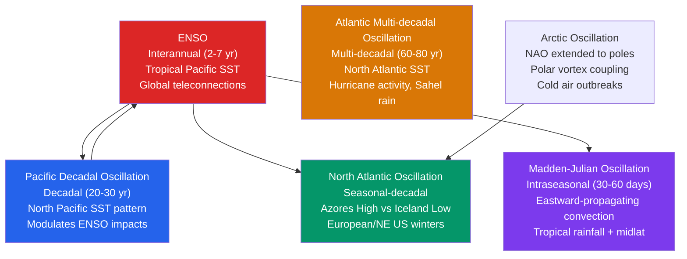

# 🌀 Climate Variability and Teleconnections

> [!abstract] TL;DR
> **Climate variability** is the natural deviation of the climate system from its mean state on timescales of **months to decades**; **teleconnections** are the statistical linkages between climate anomalies in **geographically distant regions**, mediated physically by **Rossby wave trains** and shifts in the large-scale circulation. The dominant recurrent patterns — **ENSO** (interannual, tropical Pacific), the **NAO/AO** (seasonal–decadal, North Atlantic/Arctic), the **PDO** (decadal, North Pacific), the **AMO** (multidecadal, North Atlantic), the **IOD** (interannual, Indian Ocean), and the **MJO** (30–60 day, tropics) — modulate regional **temperature, precipitation, storminess, and drought** on partially predictable timescales, which is what makes **seasonal-to-subseasonal forecasting** possible even when the day-to-day weather is unknowable. Separating this **internal variability** from the **forced trend** of anthropogenic warming is a central, unsolved problem of **detection and attribution**.

---

## Intuition — analogy FIRST

Think of the climate system as a **candle flame**. The flame has a definite average shape and position, yet it never stops **flickering** — leaning left, then right, brightening and dimming — while the candle as a whole stays put. That restless flickering is **internal climate variability**: the ocean and atmosphere sloshing energy back and forth among themselves, producing warm years and cool years, wet winters and dry winters, *with no external push required*. A single flicker tells you nothing about whether someone is slowly turning up the thermostat in the room — you have to average over many flickers to see the drift.

Now imagine the atmosphere as a **taut sheet that can ring like a bell**. Dump a burst of heat into the tropical Pacific — an **El Niño** — and you *pluck* the sheet. The vibration does not stay local: it radiates outward as a **wave train**, and a specific pattern of ridges and troughs lights up thousands of kilometres away over North America and the North Atlantic, nudging storm tracks and temperatures there. That long-range "the tropics ring, the mid-latitudes respond" resonance is a **teleconnection**. Because the ringing follows physical rules, you can forecast the *tendency* of a whole season — "La Niña is here, so expect a **drier-than-normal Australian** and **wetter Indonesian** summer" — without ever predicting a single rainstorm.

---

## How It Works

A **teleconnection** is a recurrent, statistically significant relationship between climate variability at two or more remote locations — most usefully captured as a **standing pattern of pressure or height anomalies** with **fixed geographic centres of action** that vary together in time. The classic definition comes from **Wallace & Gutzler (1981)**: one-point correlation maps of Northern Hemisphere winter geopotential height reveal a handful of **dipole and wave-train patterns** (the NAO, PNA, and others) that repeatedly organize the flow. Each such pattern is summarized by a scalar **climate index** — a single number per month or season describing which **phase** the mode is in.



**The North Atlantic Oscillation (NAO)** is the dominant mode of atmospheric variability over the North Atlantic. It is a **meridional dipole in sea-level pressure** between the **Icelandic Low** and the **Azores High**. In the **positive phase**, both centres deepen — a strong Iceland Low and a strong Azores High — so the pressure gradient between them steepens, the **westerlies accelerate**, and the storm track shifts north, delivering **mild, wet, stormy weather to northern Europe and the British Isles**, while **north-eastern Canada and Greenland turn cold and dry**. In the **negative phase**, both centres weaken, the westerlies slacken and buckle, storms track farther south into the Mediterranean, and **cold-air outbreaks penetrate deep into Europe** while **north-eastern North America and Greenland run mild**. The NAO is the North Atlantic's throttle on winter.

**The Arctic Oscillation (AO)**, also called the **Northern Annular Mode (NAM)**, is the hemispheric-scale generalization of the NAO: a see-saw of atmospheric mass between the **Arctic and the mid-latitudes** that is nearly zonally symmetric (annular). Its positive phase confines cold air within a **tight, strong polar vortex** at high latitudes; its negative phase relaxes the vortex, letting **frigid Arctic air spill equatorward** into North America, Europe, and Asia. The NAO is essentially the **Atlantic sector of the AO**, and the two are strongly correlated.

**The Pacific–North American (PNA) pattern** is a **four-centre Rossby wave train** arcing from the **subtropical Pacific → Aleutian region → western Canada → south-eastern United States**. Its positive phase features a deepened **Aleutian Low**, a ridge over western North America, and a trough over the south-east — bringing a **warm, dry US West** and a **cold, wet South-East**. The PNA is the primary conduit through which **ENSO reaches North America**: an El Niño warms the tropical Pacific, enhances convection and upper-level divergence, and **excites the wave train** that projects onto the positive PNA.

**The Pacific Decadal Oscillation (PDO)** is the **leading Empirical Orthogonal Function (EOF)** of North Pacific sea-surface temperature (poleward of 20°N). Its **warm (positive) phase** shows anomalously **cool water in the central–western North Pacific** ringed by **warm water along the North American coast**; the **cool phase** is the mirror image. The PDO is *not a distinct forcing* so much as a **low-frequency reddening and reorganization of Pacific variability**: during its warm phase, **El Niño-like teleconnections are amplified** and Pacific Northwest salmon runs decline; during its cool phase La Niña impacts dominate.

**The Atlantic Multidecadal Oscillation (AMO)** is a basin-wide pattern of **North Atlantic SST** that swings between warm and cool phases with a period of roughly **60–80 years**. Its warm phase is linked to **more active Atlantic hurricane seasons**, **enhanced Sahel rainfall**, and warmer European summers; its cool phase to the opposite. Part of the AMO reflects internal ocean dynamics (variability of the **Atlantic Meridional Overturning Circulation**); part is now understood to be modulated by **external aerosol and volcanic forcing**, which makes its "internal-mode" status genuinely debated.

**The Indian Ocean Dipole (IOD)** is an east–west SST see-saw across the tropical Indian Ocean, indexed as **western pole (western Indian Ocean) minus eastern pole (eastern Indian Ocean)** SST anomaly. A **positive IOD** (warm west, cool east) brings **drought to Indonesia/Australia** and **floods to East Africa**; it frequently co-occurs with El Niño and independently modulates the Indian and Australian monsoons.

**The Madden–Julian Oscillation (MJO)** is the dominant **intraseasonal (30–60 day)** mode of the tropics: an **eastward-propagating envelope of enhanced and suppressed convection** that circles the globe, moving from the Indian Ocean through the Maritime Continent and across the Pacific at roughly **5 m/s**. Its life cycle is discretized into **eight phases** by the location of the active convection. The MJO modulates **tropical rainfall, monsoon bursts and breaks, tropical-cyclone genesis**, and — by exciting extratropical Rossby wave trains — **mid-latitude weather**, making it the principal source of predictability in the **2–6 week "subseasonal gap."**

**The Southern Annular Mode (SAM)**, or **Antarctic Oscillation**, is the Southern Hemisphere analogue of the AO: a north–south shift in the strength and latitude of the **Southern Hemisphere westerly jet**. Its positive phase (poleward-contracted, strengthened jet) is associated with **wetter Southern Ocean storm tracks** and **drier southern Australia**, and has trended positive in recent decades under **ozone depletion and greenhouse forcing**.

**Measurement.** Modes are extracted objectively with **Empirical Orthogonal Function (EOF) / Principal Component analysis** — decomposing a space-time field into orthogonal patterns ranked by **explained variance** — or defined by simple **station-based indices** (e.g., pressure difference between two fixed sites). **Correlation analysis** with proper attention to **statistical significance and autocorrelation-reduced degrees of freedom** links the index to remote impacts. The persistent challenge underneath all of it is separating **internal variability** (the free flickering) from the **externally forced trend** (the slow warming) — the crux of **detection and attribution**.

---

## Key Concepts / Details

### Secondary Level

- **What a teleconnection is:** a link between weather patterns in **two faraway places** that tend to change together — like a set of climate "dominoes." When one region does something unusual, a partner region far away reliably responds.
- **The NAO and European weather:** the **North Atlantic Oscillation** is a pressure see-saw between Iceland and the Azores. In its **positive phase** the Atlantic storms roar into **northern Europe (mild and wet)**; in its **negative phase** the storms weaken and **cold air pours into Europe** while it turns milder near Greenland and eastern Canada.
- **Why some years break the trend:** even as the planet slowly warms, the climate **naturally flickers**. A strong **La Niña** or a **negative Arctic Oscillation** can make one winter unusually cold in your region without changing the long-term warming at all.
- **Seasonal forecasting from ENSO:** because **El Niño and La Niña** shift rainfall and storms in fairly repeatable ways, forecasters can say things like "**La Niña → drier summer for eastern Australia**" **months in advance**, even though they cannot predict any single day.
- **The PDO and salmon:** the **Pacific Decadal Oscillation** flips the North Pacific between warm and cool decades. These decadal swings track **Pacific Northwest salmon** booms and busts, because they reorganize the ocean food web the fish depend on.

### Undergraduate Level

**NAO index.** Defined as the normalized sea-level-pressure difference between the subtropical and subpolar Atlantic:

$$\text{NAO} \;\propto\; \text{SLP}_{\text{Azores}} - \text{SLP}_{\text{Iceland}}.$$

- **Positive NAO:** strong Azores High + deep Iceland Low → **steep gradient → strong zonal westerlies**; storm track shifts north → **mild, wet UK and NW Europe; cold, dry NE North America** (Labrador/Greenland).
- **Negative NAO:** both centres weak → **slack, meandering westerlies**; storms dive south into the Mediterranean → **cold outbreaks into Europe; comparatively mild NE North America**.

**Arctic Oscillation (AO / NAM).** The **annular mode** of the extratropical NH — a nearly zonally symmetric mass exchange between polar and mid-latitudes, dynamically **coupled to the stratospheric polar vortex**. Positive AO = strong vortex, cold air locked at the pole; negative AO = weak vortex, cold-air outbreaks.

**PNA pattern.** A stationary **Rossby wave train** forced by tropical Pacific heating. During El Niño, enhanced deep convection near the date line produces **upper-tropospheric divergence** that acts as a **Rossby wave source**; the resulting wave train propagates along a great-circle arc into North America (the **Hoskins–Karoly** mechanism), projecting onto the **positive PNA** and delivering a warm western / cold-wet south-eastern US winter.

**PDO.** The **first EOF of North Pacific SST**. Because it is a **spatial pattern**, not a physical oscillator with a fixed clock, its "period" is broad. In the **warm phase**, ENSO's warm-event teleconnections tend to be **reinforced**; in the **cool phase**, La Niña-like conditions and impacts are favoured. Constructive/destructive interference between the PDO and ENSO explains why the *same* ENSO event can have different regional consequences in different decades.

**AMO.** Low-frequency (**60–80 yr**) coherent SST variability across the North Atlantic, commonly indexed as **detrended, area-averaged North Atlantic SST**. Warm phase ↔ **more Atlantic hurricanes, wetter Sahel, warmer European summers**; cool phase ↔ opposite.

**IOD.** The **Dipole Mode Index** = SST anomaly of the **western pole (WIO, ~50–70°E)** minus the **eastern pole (EIO, ~90–110°E)**. Positive IOD ↔ **East African floods, Indonesian/Australian drought**.

**MJO phases 1–8.** Phase indicates where the active convective envelope sits: **Phase 2–3** Indian Ocean, **Phase 4–5** Maritime Continent, **Phase 6–7** western/central Pacific, **Phase 8–1** western Hemisphere/Africa. Forecasters read the phase to anticipate monsoon bursts, hurricane windows, and mid-latitude wave responses.

**SAM.** SH annular mode; positive phase = poleward-shifted, strengthened SH westerly jet. Trending positive under **stratospheric ozone depletion** and greenhouse forcing.

**EOFs and significance.** **Empirical Orthogonal Functions** decompose a field $X(\mathbf{s},t)$ into orthogonal spatial patterns ordered by explained variance; the leading EOFs *often* correspond to physical modes but are **mathematical constructs first**. Correlation-based impact maps must account for **serial autocorrelation**, which inflates apparent significance by reducing the **effective sample size** $N_{\text{eff}} \approx N\,(1-\rho_1)/(1+\rho_1)$ for lag-1 autocorrelation $\rho_1$.

### Graduate Level

**Rossby-wave-train teleconnection theory (Hoskins & Karoly 1981).** A **localized tropical heating anomaly** drives anomalous **upper-level divergence**, which through the vorticity equation acts as a **Rossby wave source** $S = -\nabla\cdot(\mathbf{v}_\chi\,\zeta_a) - \mathbf{v}_\chi\cdot\nabla\zeta_a$ (divergent-wind advection of absolute vorticity plus vortex stretching). On a sphere the forced disturbance radiates as a **stationary Rossby wave train** that follows an approximate **great-circle** path, its meridional reach governed by the **stationary wavenumber** $K_s = (\beta^* / \bar{u})^{1/2}$, where $\beta^* = \beta - \bar{u}_{yy}$ is the meridional gradient of absolute vorticity. Waves refract toward higher $K_s$ (waveguides along jets) and turn where $\bar{u}\to 0$ (**critical latitudes**), which is why teleconnection patterns take the shape they do. Energy propagates at the **group velocity**, dispersing **downstream/poleward** even as individual troughs and ridges are quasi-stationary — the essence of **downstream development** in a teleconnection.

**NAO as leading NH mode (Barnston & Livezey 1987; Wallace & Gutzler 1981).** Rotated PCA of NH tropospheric height confirms the NAO/AO as the **leading mode of extratropical variability**. Its existence does not require external forcing: it emerges from **internal eddy–mean-flow interaction**, in which transient synoptic eddies systematically **feed back** on the low-frequency flow, sustaining and reddening the pattern (eddy straining and momentum-flux feedback onto the jet latitude).

**Stratosphere–troposphere coupling.** A **Sudden Stratospheric Warming (SSW)** — upward-propagating planetary waves converging Eliassen–Palm flux onto the polar vortex and decelerating or **reversing** it — produces a negative NAM anomaly that **descends** from the stratosphere to the surface over **2–6 weeks**, biasing the troposphere toward **negative AO/NAO**, an equatorward, meandering jet, and **cold-air outbreaks**. This downward control is a leading source of **surface predictability** on subseasonal timescales.

**MJO dynamics.** The MJO behaves as a large-scale **moisture-coupled Kelvin–Rossby wave** structure: a **Kelvin wave to the east** and a **Rossby-gyre couplet to the west** of the convective centre, propagating eastward far slower than a dry Kelvin wave because of **moisture–convection feedbacks** (moisture-mode dynamics — the convection is regulated by column moisture, which the circulation slowly builds and erodes). It is tracked in real time by the **Wheeler–Hendon (2004) RMM index**, the leading pair of combined EOFs (**RMM1, RMM2**) of equatorial OLR and zonal wind at 850/200 hPa; the (RMM1, RMM2) phase-space angle gives the **phase (1–8)** and the radius the **amplitude**. The MJO and ENSO interact bidirectionally: **westerly wind bursts** in the active MJO phase can **trigger downwelling oceanic Kelvin waves** that help initiate El Niño, while ENSO's mean-state changes modulate MJO propagation across the Pacific.

**AMO and multidecadal impacts.** Whether attributed to **AMOC variability** or to **external aerosol/volcanic forcing**, the AMO's warm phase is statistically tied to **increased Atlantic major-hurricane frequency**, **restored Sahel monsoon rainfall** (the drought of the 1970s–80s coincided with a cool AMO), and **warmer European climate**. Disentangling the internally generated from the externally forced component of the AMO remains an open research problem with direct implications for **decadal prediction**.

**Detection and attribution.** Extracting the **anthropogenic signal** against the **internal-variability noise** background is formalized as an **optimal fingerprinting / signal-to-noise maximization** problem: project observations onto model-derived response "fingerprints," normalized by the **internal-variability covariance** estimated from long control runs. The difficulty scales with the **signal-to-noise ratio**, which is low for regional and short-timescale quantities dominated by modes like the NAO and PDO.

**The signal-to-noise paradox.** Coupled seasonal forecast systems display **higher correlation skill for predicting climate indices (e.g., the winter NAO) than the models' own signal-to-noise ratio implies they should** — the **ratio of predictable components (RPC)** exceeds one. In plain terms, the *real world* is more predictable than the *model's ensemble spread* suggests, because the model's **signal is too weak** relative to its noise (often traced to **underactive eddy feedback** or too-weak stratosphere–troposphere and tropical–extratropical teleconnections). Practically it means large ensembles are needed to extract a real but small predictable signal, and that improving the strength of simulated teleconnections is a frontier of seasonal prediction.

---

## Code Demo

```python
# Demonstrates two core ideas of climate variability, with NO external downloads
# (fully synthetic but physically motivated data):
#   (1) the ENSO -> NAO teleconnection as a LAGGED, NEGATIVE cross-correlation:
#       El Nino (warm Nino 3.4) tends to be followed by a NEGATIVE NAO a couple
#       of months later. We build data with that structure and recover it.
#   (2) how INTERNAL VARIABILITY can mask a slow FORCED TREND until you average
#       over ~30 years (the reason a single cold winter never disproves warming).
import numpy as np
import matplotlib.pyplot as plt

rng = np.random.default_rng(42)

# ---- monthly time axis, 1950-2023 ----
n_years = 74
months  = np.arange(n_years * 12)          # 0 .. 887
years   = 1950 + months / 12.0

# ============================================================
# Part 1: synthetic ENSO (Nino 3.4) and NAO monthly indices
# ============================================================
# ENSO as a persistent red-noise AR(1) process with a broad 2-7 yr spectral
# peak (a weak ~3.7 yr quasi-oscillation), standardized to unit variance.
phi    = 0.90                                # AR(1) persistence -> ENSO's memory
period = 3.7 * 12                            # ~3.7 yr, inside the 2-7 yr band
enso   = np.zeros(months.size)
for t in range(1, months.size):
    enso[t] = phi * enso[t-1] + rng.normal(0, 1)
enso += 0.8 * np.sin(2 * np.pi * months / period + 0.3)
enso  = (enso - enso.mean()) / enso.std()

# NAO is a very noisy index that is WEAKLY, NEGATIVELY forced by ENSO ~2 months
# earlier:  NAO(t) = beta * ENSO(t - lag_true) + noise,  beta < 0.
lag_true = 2
beta     = -0.35                             # El Nino -> tendency to NEGATIVE NAO
noise    = rng.normal(0, 1, months.size)
nao      = noise.copy()
nao[lag_true:] += beta * enso[:-lag_true]
nao      = (nao - nao.mean()) / nao.std()

# ---- cross-correlation function  r(lag) = corr( ENSO(t), NAO(t+lag) ) ----
def crosscorr(x, y, lag):
    if lag >= 0:
        a, b = x[:x.size - lag], y[lag:]
    else:
        a, b = x[-lag:], y[:y.size + lag]
    return np.corrcoef(a, b)[0, 1]

lags  = np.arange(-12, 13)
ccf   = np.array([crosscorr(enso, nao, k) for k in lags])
i_min = np.argmin(ccf)
print(f"Strongest link at lag = {lags[i_min]:+d} months,  r = {ccf[i_min]:.2f}")
print("  (positive lag => NAO LAGS ENSO;  negative r => El Nino -> negative NAO)")

# approximate 95% white-noise band (ignores autocorrelation, illustrative only)
nsig = 2 / np.sqrt(months.size)

# ============================================================
# Part 2: internal variability masking a forced warming trend
# ============================================================
yrs   = np.arange(1900, 2024)
trend = 0.008 * (yrs - 1900)                 # 0.08 K/decade underlying forced trend
iv    = np.zeros(yrs.size)                    # AR(1) internal variability (PDO/AMO-like)
for t in range(1, yrs.size):
    iv[t] = 0.75 * iv[t-1] + rng.normal(0, 0.12)
temp  = trend + iv + rng.normal(0, 0.08, yrs.size)

w       = 30                                  # 30-year running mean window
run     = np.convolve(temp, np.ones(w) / w, mode='valid')
run_yrs = yrs[w-1:]

# ============================================================
# plots
# ============================================================
fig, (ax1, ax2) = plt.subplots(1, 2, figsize=(13, 5))

ax1.axhline(0, color='k', lw=0.8)
ax1.axhspan(-nsig, nsig, color='0.85', label='~95% noise band')
ax1.stem(lags, ccf, basefmt=' ')
ax1.axvline(lags[i_min], color='#dc2626', ls='--', lw=1.5,
            label=f'peak: lag {lags[i_min]:+d} mo, r = {ccf[i_min]:.2f}')
ax1.set_xlabel('lag (months)   [NAO lags ENSO when lag > 0]')
ax1.set_ylabel('cross-correlation  r')
ax1.set_title('ENSO (Nino 3.4)  vs  NAO')
ax1.legend(fontsize=8)

ax2.plot(yrs, temp, color='0.6', lw=1.0, label='annual mean (trend + internal var.)')
ax2.plot(run_yrs, run, color='#dc2626', lw=2.5, label='30-yr running mean')
ax2.plot(yrs, trend, color='k', ls='--', lw=1.3, label='true forced trend')
ax2.set_xlabel('year'); ax2.set_ylabel('temperature anomaly (K)')
ax2.set_title('Internal variability masks the forced trend')
ax2.legend(fontsize=8)

plt.tight_layout()
plt.savefig('climate_variability.png', dpi=120)
print("Saved figure to climate_variability.png")

# Expected console highlights:
#   Strongest link at lag = +2 months, r ~ -0.3 : NAO lags ENSO with a moderate
#   negative correlation -- the statistical fingerprint of the ENSO->NAO
#   teleconnection. In Part 2, individual years wander far from the dashed trend,
#   but the 30-yr running mean tracks it closely: variability hides a trend only
#   on short samples.
```

The left panel recovers the **lagged, negative ENSO→NAO link** (peak near **lag +2 months**, $r\approx-0.3$) — a *statistical tendency*, not a deterministic law, exactly as in the real atmosphere. The right panel shows why a **cold single winter proves nothing**: year-to-year internal variability swamps the slow forced trend, yet the **30-year mean** cleanly reveals it. This is the quantitative heart of **detection and attribution**.

---

## Real-World Notes

- **The 2009–10 Northern Hemisphere winter** was brutally cold across Europe and the eastern United States because the **Arctic Oscillation hit its most negative value on record** — a collapsed polar vortex spilling Arctic air equatorward — **even as the global-mean temperature continued its long-term rise**. Regional cold and global warming coexisted, a textbook case of internal variability overprinting the trend.
- **The AMO warm phase of roughly 1995–2012** coincided with a **marked increase in Atlantic hurricane activity**, including several hyperactive seasons, illustrating how multidecadal SST variability sets the **background state** on which individual storm seasons unfold.
- **The MJO is the workhorse of the "subseasonal gap"** — the **2–6 week** range beyond deterministic weather but short of seasonal climate. Tracking the MJO phase is the single largest source of skill for **extended-range forecasts** of monsoon bursts, tropical-cyclone windows, and mid-latitude pattern shifts.
- **European heat waves are more probable under a negative NAO combined with a positive AMO**: the slack, blocked Atlantic jet of a negative NAO parks a ridge over the continent, while a warm Atlantic supplies the anomalously warm air — a compound configuration behind several deadly heat events.
- **The 1976–77 "Great Pacific Climate Shift"** — an abrupt flip of the **PDO from its cool to its warm phase** — reorganized North Pacific ecosystems (the Alaskan salmon boom) and coincided with a **step-like jump in global-mean temperature**, a vivid reminder that decadal internal variability can produce *apparent* trend changes.

---

## Common Pitfalls

1. **Treating teleconnections as deterministic laws.** They are **statistical tendencies**, not switches. The ENSO→NAO relationship is only about an $r\approx-0.3$ correlation in winter — El Niño **shifts the odds** toward a negative NAO but does not guarantee it. Any single event can defy the "textbook" teleconnection.
2. **Thinking the PDO is a separate forcing from ENSO.** The PDO is largely a **low-frequency reddening and spatial reorganization of Pacific variability** — much of its signal *is* the accumulated footprint of ENSO plus ocean memory. It **modulates** how ENSO impacts land; it is not an independent tropical heat engine driving its own global teleconnections.
3. **Claiming a single cold winter disproves global warming.** Internal modes — especially a **negative AO/NAO** — routinely produce severe *regional* cold anomalies while the **global mean keeps warming**. Local weather and global climate live on different signal-to-noise footings; conflating them is the most common public misreading.
4. **Confusing the MJO with ENSO.** They are different beasts on different clocks: the **MJO is intraseasonal (30–60 days), eastward-propagating, atmospheric**; **ENSO is interannual (2–7 years), a coupled ocean–atmosphere standing oscillation**. The MJO can help *trigger* ENSO events, but it is not a fast version of ENSO.
5. **Over-interpreting EOF patterns as physical mechanisms.** **EOFs maximize variance under an orthogonality constraint**; the resulting patterns are **mathematical**, and higher modes especially can be **statistical artifacts** (mixing, geometric orthogonality, domain dependence). A leading EOF often *coincides* with a real mode, but the correspondence must be argued dynamically, not assumed.

---

## Related Concepts

- [[_MOC_Climate_System]] — section map for the climate-system unit (uplink).
- [[Ocean_Atmosphere_Coupling_and_ENSO]] — ENSO is the single most influential mode here; the Bjerknes feedback and tropical Pacific coupling that seed most global teleconnections.
- [[Global_Atmospheric_Circulation]] — the Hadley/Walker cells and mean jets are the "instrument" that teleconnection wave trains ring; modes are perturbations to this mean state.
- [[Paleoclimatology_and_Ice_Cores]] — proxy records (corals, tree rings, ice cores) extend indices like ENSO, NAO, and AMO back centuries, letting us separate natural variability from forced change.
- [[Anthropogenic_Climate_Change]] — internal variability is the *noise* against which the forced *signal* must be detected; attribution is exactly this separation problem.
- [[Jet_Streams_and_Upper_Level_Flow]] — the PNA, NAO, and AO *are* recurrent jet configurations; Rossby-wave dynamics and stationary wavenumber underlie every teleconnection here.
- [[Fronts_and_Extratropical_Cyclones]] — the storm tracks that the NAO and AO steer north and south are made of these cyclones; eddy feedback sustains the annular modes.
- [[Ensemble_Forecasting_and_Uncertainty]] — seasonal-to-subseasonal skill from ENSO and the MJO is inherently probabilistic; the signal-to-noise paradox is a forecasting problem.
- [[_MOC_Physics_Master]] — parent physics vault for the rotating-fluid dynamics and wave theory beneath teleconnections.
- [[Wave_Motion_and_Properties]] — dispersion, phase vs group velocity, and wave packets, applied here to the Rossby wave trains that carry teleconnection signals.
- [[Mass_Extinctions_and_Paleoclimate]] — deep-time perspective on how climate variability and abrupt shifts have shaped Earth's biosphere.

---

## Review Questions

- **Secondary:** What is the **North Atlantic Oscillation (NAO)**, and how does its **positive phase** affect winter weather in **Western Europe** versus **north-eastern North America**? Why do meteorologists track the **Madden–Julian Oscillation (MJO)** when they want a useful forecast **two to four weeks** ahead?
- **Undergraduate:** Explain the **Pacific–North American (PNA)** teleconnection pattern and its relationship to **ENSO** — how does an **El Niño** excite the **Rossby wave train** that reshapes North American winter weather? Then **define the PDO** and explain how its warm and cool phases **modulate ENSO's impact** on US West Coast precipitation. Why must correlation-based impact maps account for **autocorrelation** in the indices?
- **Graduate:** Describe the **Hoskins–Karoly** theory of tropical–extratropical teleconnections: how does a **localized tropical heating anomaly** generate a **Rossby wave source** and launch a **poleward-arcing, great-circle wave train**, and what role does the **stationary wavenumber** $K_s=(\beta^*/\bar u)^{1/2}$ play in shaping its path? Finally, explain the **signal-to-noise paradox** in seasonal forecasting: why do coupled models show **higher correlation skill for predicting climate indices (e.g., the winter NAO) than their own ensemble spread implies** (RPC > 1)? What mechanisms — eddy feedback strength, stratosphere–troposphere coupling, tropical teleconnection amplitude — might explain it, and what does it imply for **ensemble size**?

---

## Sources

- Wallace, J. M. & Gutzler, D. S. (1981). *Teleconnections in the geopotential height field during the Northern Hemisphere winter.* **Monthly Weather Review**, 109, 784–812. The foundational one-point-correlation catalogue of NH teleconnection patterns (PNA, NAO, etc.).
- Trenberth, K. E., Branstator, G. W., Karoly, D., Kumar, A., Lau, N.-C. & Ropelewski, C. (1998). *Progress during TOGA in understanding and modeling global teleconnections associated with tropical sea surface temperatures.* **Journal of Geophysical Research**, 103(C7), 14291–14324. Synthesis of ENSO teleconnection mechanisms and Rossby-wave dynamics.
- Hartmann, D. L. (2016). *Global Physical Climatology*, 2nd ed. (Elsevier). Textbook treatment of climate modes, EOF analysis, and the general circulation context of variability.

---

#Meteorology #Climatology #ClimateVariability #Teleconnections #NAO #ENSO #MJO
