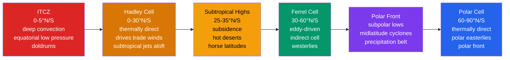

# 🌍 Global Atmospheric Circulation

> [!abstract] TL;DR
> The **general circulation of the atmosphere** exists to solve one problem: the tropics receive a **surplus** of solar energy while the poles run a **deficit**, so the atmosphere continually **transports heat poleward** to keep the planet in radiative balance. It does this through **three meridional overturning cells** — the **Hadley cell** ($0$–$30°$, *thermally direct*, driven by tropical heating), the **Ferrel cell** ($30$–$60°$, *thermally indirect*, driven by **midlatitude eddies**), and the **Polar cell** ($60$–$90°$, *thermally direct*) — supplemented by large horizontal **eddies** (baroclinic cyclones, Rossby waves) that carry most of the heat in the midlatitudes. The result is the familiar ladder of **surface wind belts** (trade **easterlies**, midlatitude **westerlies**, polar **easterlies**) and **pressure zones** (equatorial low / **ITCZ**, subtropical **highs**, subpolar **lows**, polar **highs**). These belts set the geography of climate: **rainforests** under the rising ITCZ, **great deserts** under the subtropical subsidence at $25$–$35°$, and **storm tracks** along the subpolar front. Real weather is the wobbling, seasonally migrating, land-modified departure from this zonal-mean skeleton.

---

## Intuition — analogy FIRST

Imagine the atmosphere as a **global conveyor belt of heat**, built from three rolling **gears** stacked from equator to pole. Heat the equator with the noon Sun and the air there does what warm air always does — it **rises**, like a hot-air balloon or the plume over a bonfire. But it cannot go straight up forever; near the top of the troposphere it spreads **poleward**, cools, grows dense, and **sinks** back down around $30°$ latitude — the same overturning loop as a **sea breeze**, only planet-sized. That descending air spreads back toward the equator along the surface, and the Earth's rotation bends it into the steady **trade winds** that sailing ships rode for centuries. That first gear is the **Hadley cell**.

Now here is the twist that trips people up. If you stack a spinning gear next to another gear, the **middle gear turns backward**. The **Ferrel cell** in the midlatitudes is exactly that: it is not driven by direct heating at all — it is **dragged around by the Hadley and Polar gears on either side** and, more precisely, by the **swarm of migrating storms** that churn the midlatitude air. That is why the Ferrel cell runs "the wrong way" thermodynamically: warm air **sinks** in the subtropics and cold air **rises** at the polar front. Three gears, three wind belts, one purpose — moving the Sun's excess heat from where there is too much to where there is too little.

---

## How It Works

The engine that drives everything is the **latitudinal imbalance in net radiation**. Averaged over the year the tropics **absorb more sunlight than they emit** as infrared, and the poles **emit more than they absorb**; the crossover sits near $\pm 38°$ latitude. If nothing moved that heat, the tropics would keep warming and the poles keep cooling without limit. The atmosphere (about $60\%$) and ocean (about $40\%$) close the gap by transporting energy poleward, and the **general circulation is the atmospheric half of that heat engine.** The zonal-mean picture organizes into three cells and the surface features they imply.



**The three-cell model.** In each hemisphere the zonal-mean, time-mean overturning splits into three loops. The **Hadley cell** ($0$–$30°$) rises at the **ITCZ**, flows poleward aloft, sinks in the subtropics, and returns equatorward at the surface — a **thermally direct** circulation (warm air rises, cool air sinks) that converts potential energy to kinetic energy. The **Polar cell** ($60$–$90°$) is likewise thermally direct: cold dense air sinks over the pole and flows equatorward at the surface as the **polar easterlies**, rising again at the polar front. Sandwiched between them, the **Ferrel cell** ($30$–$60°$) runs **thermally indirectly** — it is a *residual* circulation forced by eddies, not a self-driven convective loop.

**Hadley cell and the angular-momentum budget.** As upper-branch air moves poleward it conserves its **absolute angular momentum** about the Earth's axis, $M = (\Omega a\cos\varphi + u)\,a\cos\varphi$. Air leaving the ascent latitude $\varphi_0$ with $u=0$ carries $M = \Omega a^2\cos^2\varphi_0$; conserving $M$ to latitude $\varphi$ forces the zonal wind

$$\boxed{\,u_M(\varphi) = \Omega a\,\frac{\cos^2\varphi_0 - \cos^2\varphi}{\cos\varphi} = \Omega a\,\frac{\sin^2\varphi - \sin^2\varphi_0}{\cos\varphi}\,}$$

With ascent at the equator ($\varphi_0=0$) this reduces to $u_M = \Omega a\,\sin^2\varphi/\cos\varphi$, which grows from zero at the equator to an enormous **$\sim 130$ m/s** westerly at $30°$ — the **subtropical jet stream** at the poleward edge of the Hadley cell. Poleward of the ascent latitude the upper branch is **westerly**; equatorward it is **easterly**, and at the surface the return flow is the easterly **trade winds** (bent right in the NH, left in the SH by the [[Coriolis_Effect_and_Geostrophic_Balance|Coriolis force]]).

**Subtropical highs and the world's deserts.** Where the Hadley cell descends ($25$–$35°$) air is **compressionally warmed and dried**, producing a belt of **subtropical high-pressure** cells — the **Azores (Bermuda) High**, the **North Pacific High**, the **South Atlantic** and **South Pacific** and **South Indian** highs. Subsidence caps the boundary layer with a strong **inversion**, suppresses convection, and starves the surface of rain. This is why the **Sahara, Arabian, Kalahari, Atacama, and Australian** deserts all cluster at the same latitude. The becalmed cores of these highs are the **horse latitudes**.

**Ferrel cell — eddy-driven and indirect.** The midlatitude cell cannot be explained by local heating; in fact it transports heat *equatorward* on its own, which would be thermodynamically impossible for a self-driven loop. Its true driver is the **flux of momentum and heat by transient baroclinic eddies** (the passing cyclones and Rossby waves). The **surface westerlies** are maintained because eddies converge **westerly momentum** into the midlatitude surface; the return of that momentum aloft, together with the eddy heat flux, forces the mean **residual** overturning that we label the Ferrel cell. It is, in effect, a bookkeeping remainder of a circulation dominated by eddies.

**Subpolar lows and the storm track.** Where the mild westerlies meet the cold polar easterlies lies the **polar front**, a zone of strong baroclinicity that spawns **midlatitude cyclones**. Their statistical footprint is the belt of **subpolar low pressure** — the semi-permanent **Icelandic Low** and **Aleutian Low** in the NH, and the near-continuous **circumpolar trough** around Antarctica. This is a **precipitation maximum** (frontal and cyclonic rain/snow) and the reason the midlatitudes are wet.

**Polar cell and the polar vortex.** Over the poles, radiative cooling builds cold, dense, high-pressure air that sinks and creeps equatorward as the shallow **polar easterlies**. Aloft, the wintertime pole is ringed by the **stratospheric polar vortex**, a strong cyclonic circulation locked in place by the pole-to-midlatitude temperature contrast; when planetary waves disrupt it (a **sudden stratospheric warming**), the disturbance can descend and unleash cold-air outbreaks at the surface.

**Seasonal migration.** The whole system **follows the Sun**, shifting a few degrees toward the summer hemisphere. The ITCZ, subtropical highs, and jet all migrate; the ITCZ swings furthest over land, reaching well into the summer hemisphere and giving the **monsoon** its rhythm.

**Where the zonal-mean picture breaks: land, sea, and monsoons.** The clean three-cell ladder is a **zonal average**. Real longitudes have **continents and oceans** with different heat capacities, so the circulation fragments into **cells** (the discrete subtropical highs) rather than continuous belts, and develops strong **east–west (Walker) circulations**. Over Asia the seasonal reversal of land–sea heating spawns the **monsoon**, which overrides and locally reverses the mean Hadley picture. Because the NH has **more land**, its circulation is more distorted and its ITCZ sits further north on average — a fundamental **inter-hemispheric asymmetry**.

---

## Key Concepts / Details

### Secondary Level

- **Three cells, three wind belts.** From equator to pole: **trade winds** (easterly, $0$–$30°$), **westerlies** ($30$–$60°$), and **polar easterlies** ($60$–$90°$). "Easterly" means *blowing from the east*.
- **Why deserts sit at $25$–$35°$, not the equator.** Air rises and rains out at the equator (rainforests), then **sinks, warms, and dries** in the subtropics. That descending, drying air is why the great hot deserts ring the globe at $\sim 30°$.
- **Why the tropics are wet.** Converging trade winds force air up at the **ITCZ**; rising air cools, clouds form, and torrential rain falls — the equatorial rainforest belt.
- **Why the midlatitudes get storms.** Warm tropical air and cold polar air collide along the **polar front**, spinning up the traveling storms (cyclones) that bring most of the rain, wind, and day-to-day weather changes to places like Europe and North America.
- **Why the poles are cold.** They receive weak, slanting sunlight all year and, at the surface, get only the shallow cold **polar-cell easterlies** — little warm air reaches them directly.
- **The global rainfall map in one line:** **wet** at the equator, **dry** in the subtropics, **wet** again in the midlatitudes, **dry** at the poles — a direct print-out of rising vs sinking branches.
- **Monsoons** are the seasonal *departure* from this average: in summer, land heats faster than sea, drawing in moist ocean air and reversing the usual winds.

### Undergraduate Level

**Angular momentum and the subtropical jet.** Conserving $M = (\Omega a\cos\varphi + u)\,a\cos\varphi$ from an ascent latitude $\varphi_0$ gives the upper-branch wind $u_M = \Omega a\,(\sin^2\varphi - \sin^2\varphi_0)/\cos\varphi$. **Worked value** ($\varphi_0 = 0$, $\varphi = 25°$): $\Omega a = 7.29\times10^{-5}\times 6.371\times10^{6} \approx 465$ m/s, so $u_M = 465\times\sin^2 25°/\cos 25° \approx 465\times 0.1786/0.906 \approx 92$ m/s. The **observed** subtropical jet is only $\sim 30$–$40$ m/s because the real Hadley cell does **not** conserve angular momentum perfectly — eddies remove westerly momentum, and viscosity and the cell's finite width intervene.

**Why the Hadley cell ends near $30°$.** An angular-momentum-conserving cell cannot extend to the pole: the implied jet would grow without bound and the flow would become **baroclinically unstable**. The cell terminates where the vertical shear (thermal wind) associated with $u_M$ first becomes unstable, launching the eddies that take over poleward heat transport. This is the physical reason the Hadley cell has a **finite width** of $\sim 30°$.

**ITCZ position.** The ITCZ sits at the **thermal equator**, where the boundary-layer moist static energy (and SST) peaks — typically **$5$–$10°$N** in the annual mean because the NH is warmer (more land, ocean heat transport into the NH tropics). Its latitude tracks the **atmospheric energy budget**: the ITCZ lies near the latitude of **zero cross-equatorial atmospheric energy transport**.

**Subtropical highs and subsidence inversion.** Descending air in the subtropics warms adiabatically, creating a **temperature inversion** a few hundred metres to ~2 km above the surface that traps moisture and pollutants below (the reason Los Angeles and Santiago have persistent smog and low stratocumulus decks).

**The Ferrel cell is eddy-driven.** The **zonal-mean meridional circulation** in the midlatitudes is forced by the **divergence of eddy momentum flux** $\overline{u'v'}$ (and eddy heat flux $\overline{v'\theta'}$). In the **Eliassen–Palm (EP)** framework, the mean flow responds to $\nabla\cdot\mathbf{F}$; where eddies **break** and deposit momentum, they drive the surface westerlies and force the indirect Ferrel overturning. The Ferrel cell is the *Eulerian-mean residue* of a fundamentally eddy-dominated flow.

**Semi-permanent centres of action.** The **Icelandic** and **Aleutian Lows** (winter) and the **Azores/Bermuda** and **Pacific Highs** (strong in summer) are the seasonal, longitudinally localized expressions of the subpolar-low and subtropical-high belts. Their strength and position are indexed by teleconnection patterns (**NAO, AO, PNA**).

**ENSO modulation.** During **El Niño** the equatorial Pacific warm pool shifts east, weakening the **Walker circulation** and altering the Hadley cell's strength and the position of the subtropical jets — the mechanism behind global ENSO teleconnections.

### Graduate Level

**Held–Hou theory of the Hadley cell (1980).** For an **axisymmetric, inviscid, angular-momentum-conserving** atmosphere in radiative–convective equilibrium, matching the AM-conserving upper wind to the requirement of **zero net poleward energy transport at the cell edge** yields the Hadley cell half-width

$$\varphi_H \approx \left(\frac{5\,\Delta_H\, g\, H}{3\,\Omega^2 a^2}\right)^{1/2},$$

where $\Delta_H = \Delta\theta/\theta_0$ is the fractional equator-to-pole radiative-equilibrium potential-temperature contrast and $H$ the tropopause height. Plugging Earth values gives $\varphi_H \sim 30°$, and the peak zonal wind at the edge, $u(\varphi_H) = \Omega a\sin^2\varphi_H/\cos\varphi_H$, recovers the (over-strong) subtropical jet. The theory explains **why** the cell scales as it does with rotation rate, planetary size, and heating.

**Held–Suarez benchmark and GCMs.** The **Held–Suarez (1994)** configuration — a dry primitive-equation model with Newtonian relaxation to a prescribed radiative-equilibrium temperature and Rayleigh surface drag — reproduces a realistic three-cell circulation, eddy-driven jet, and storm track **without any moisture or radiation code**, and is the standard dynamical-core test. Full **general circulation models (GCMs)** add moist physics, radiation, and boundary layers; circulation-sensitivity experiments (varying $\Omega$, obliquity, land distribution) probe how robust the three-cell structure is.

**Eddy-driven vs thermally-driven jets.** The **subtropical jet** is *thermally/angular-momentum driven* at the Hadley edge; the **eddy-driven (polar-front) jet** is maintained by **convergence of eddy momentum flux** ($-\partial\overline{u'v'}/\partial y > 0$) where baroclinic eddies grow and break. The two can be separate or merged. The **Transformed Eulerian Mean (TEM)** cleanly separates the weak **residual circulation** (which does the real heat transport) from the large but largely cancelling Eulerian-mean Ferrel cell.

**ITCZ shifts and the energetic framework (Kang, Held; Donohoe & Battisti; Schneider).** The ITCZ lies near the **energy flux equator** — the latitude of vanishing vertically integrated atmospheric energy transport. An **extratropical forcing** (e.g. NH cooling from ice-sheet growth, aerosols, or reduced AMOC ocean heat transport) demands a **compensating cross-equatorial atmospheric energy transport** carried by the Hadley circulation, which shifts the ITCZ **toward the warmer (energy-source) hemisphere**. This unifies paleoclimate ITCZ migrations, the Sahel drought, and hemispheric-asymmetric aerosol effects.

**Walker circulation and coupling.** The zonal (Walker) cell — rising over the Indo-Pacific warm pool, sinking over the cold eastern Pacific — is dynamically coupled to the ocean through **Bjerknes feedback**; its collapse and reversal is **El Niño** (see [[Ocean_Atmosphere_Coupling_and_ENSO]]).

**Observed and projected changes.** Reanalyses show the **Hadley cell has widened by $\sim 0.5°$ latitude per decade since ~1979** (poleward expansion of the subtropical dry zones and jets), attributed to tropospheric warming and stratospheric ozone loss (especially in the SH). CMIP projections show continued **Hadley widening**, **poleward jet/storm-track shift**, and **subtropical drying** ("wet-get-wetter, dry-get-drier").

**Stratospheric circulation.** Above the troposphere, the wave-driven **Brewer–Dobson circulation** slowly lifts air in the tropics and transports it poleward and down, controlling ozone and trace-gas distributions; the equatorial **Quasi-Biennial Oscillation (QBO)** modulates the extratropical stratosphere and, via wave filtering, the polar vortex. **Equatorial superrotation** (mean westerlies at the equator aloft) can appear transiently during strong El Niño and dominates on rapidly heated slow rotators like **Venus and Titan**.

---

## Python demo — angular-momentum jet and the surface pressure belts

The script computes the **angular-momentum-conserving upper-level Hadley wind** $u_M(\varphi) = \Omega a\,(\sin^2\varphi - \sin^2\varphi_0)/\cos\varphi$ with the ascent (ITCZ) latitude $\varphi_0 = 10°$N. It marks the **zero crossing** at $\varphi_0$ (easterlies equatorward, westerlies poleward) and the **subtropical-jet maximum** at the Hadley-cell edge $\sim 30°$N, and prints the theoretical vs observed jet speed. A second panel is a schematic **bar chart of the surface pressure belts** (equatorial low, subtropical high, subpolar low, polar high). Runnable with `numpy` and `matplotlib`.

```python
# Global atmospheric circulation: the angular-momentum-conserving Hadley jet
# and a schematic of the surface pressure belts.
#
# Angular momentum M = (Omega*a*cos(phi) + u) * a*cos(phi) is conserved by the
# poleward upper branch. Starting from the ascent latitude phi0 with u=0:
#     u_M(phi) = Omega*a * (sin^2(phi) - sin^2(phi0)) / cos(phi)
# -> EASTERLY (u<0) equatorward of phi0, WESTERLY (u>0) poleward (the jet).
import numpy as np
import matplotlib.pyplot as plt

Omega = 7.292e-5          # Earth rotation rate  (s^-1)
a     = 6.371e6           # Earth radius         (m)
Oa    = Omega * a         # ~ 464.6 m/s
phi0  = np.deg2rad(10.0)  # ITCZ / ascent latitude = 10 deg N

phi = np.deg2rad(np.linspace(0.0, 40.0, 400))
uM  = Oa * (np.sin(phi)**2 - np.sin(phi0)**2) / np.cos(phi)   # upper-level wind

# Subtropical jet = Hadley cell edge (~30 deg); its theoretical AM-conserving speed
phi_jet = np.deg2rad(30.0)
u_jet   = Oa * (np.sin(phi_jet)**2 - np.sin(phi0)**2) / np.cos(phi_jet)
u_25    = Oa * (np.sin(np.deg2rad(25))**2 - np.sin(phi0)**2) / np.cos(np.deg2rad(25))
print(f"Omega*a                       = {Oa:6.1f} m/s")
print(f"u_M at 25N (phi0=10N)         = {u_25:6.1f} m/s")
print(f"u_M at 30N Hadley edge (jet)  = {u_jet:6.1f} m/s  (theory)")
print(f"observed subtropical jet      ~   30-40 m/s        (eddies remove momentum)")

fig, (ax1, ax2) = plt.subplots(1, 2, figsize=(13, 5))

# (1) angular-momentum jet profile
deg = np.rad2deg(phi)
ax1.plot(deg, uM, color="#d97706", lw=2.3)
ax1.axhline(0, color="k", lw=0.8)
ax1.axvline(10, color="#dc2626", ls="--", lw=1.4,
            label="u = 0  at ITCZ ascent (10°N)")
ax1.axvline(30, color="#2563eb", ls="--", lw=1.4,
            label="subtropical jet  (Hadley edge ~30°N)")
ax1.plot(30, u_jet, "o", color="#2563eb")
ax1.annotate(f"{u_jet:.0f} m/s\n(theory)", xy=(30, u_jet),
             xytext=(31, u_jet - 45),
             arrowprops=dict(arrowstyle="->"))
ax1.text(3.5, -35, "trade-wind\nregime (easterly)", color="#b45309", fontsize=9)
ax1.text(20, -35, "westerlies aloft", color="#1d4ed8", fontsize=9)
ax1.set_xlabel("latitude  (°N)")
ax1.set_ylabel("upper-level zonal wind  u$_M$  (m/s)")
ax1.set_title("Angular-momentum-conserving Hadley wind\n"
              r"u$_M$ = Ωa (sin²φ − sin²φ₀)/cosφ,  φ₀ = 10°N")
ax1.grid(alpha=0.3); ax1.legend(loc="upper left", fontsize=9)

# (2) schematic surface pressure belts
belts    = ["Equatorial\nLOW (ITCZ)", "Subtropical\nHIGH", "Subpolar\nLOW", "Polar\nHIGH"]
lat_c    = [0, 30, 60, 90]
p_anom   = [-6, +8, -6, +4]     # schematic sea-level pressure anomaly (hPa)
colors   = ["#dc2626", "#f59e0b", "#7c3aed", "#2563eb"]
ax2.bar(lat_c, p_anom, width=14, color=colors, edgecolor="k")
ax2.axhline(0, color="k", lw=0.9)
for x, p, name in zip(lat_c, p_anom, belts):
    ax2.text(x, p + (1.2 if p > 0 else -1.8), name, ha="center",
             va="bottom" if p > 0 else "top", fontsize=9)
ax2.set_xlabel("latitude  (°)")
ax2.set_ylabel("schematic sea-level pressure anomaly  (hPa)")
ax2.set_title("Surface pressure belts of the three-cell model")
ax2.set_xticks(lat_c); ax2.set_ylim(-11, 13); ax2.grid(alpha=0.3, axis="y")

plt.tight_layout()
plt.savefig("global_circulation.png", dpi=120)
print("\nSaved figure to global_circulation.png")

# Expected console highlights:
#   Omega*a ~ 464.6 m/s ; u_M at 30N ~ 118 m/s (theory) vs ~30-40 m/s observed.
#   The profile crosses zero exactly at the 10N ascent latitude: easterly trades
#   equatorward, growing westerlies (the subtropical jet) poleward.
```

The left panel shows the upper-level wind crossing **zero at the ITCZ ascent latitude** ($10°$N): **easterly** equatorward (feeding the surface trade winds through the cell) and a **westerly jet** poleward that reaches the unrealistic AM-conserving value of $\sim 118$ m/s at the $30°$ Hadley-cell edge — the theoretical **subtropical jet**, several times stronger than observed because real eddies bleed westerly momentum out of the flow. The right panel lays out the alternating **low–high–low–high** pressure belts that pin the ITCZ rainforests, subtropical deserts, subpolar storm track, and polar cap.

---

## Real-World Notes

- **The great deserts trace the subsidence belt.** The **Sahara, Arabian, Kalahari, and Australian (Great Victoria)** deserts all lie at $20$–$30°$ latitude, directly beneath the **descending branch** of the Hadley cell where subsiding, drying air and the subtropical highs suppress rain. The Atacama and Namib add coastal upwelling to the same subsidence for hyper-aridity.
- **The "horse latitudes."** The calm, high-pressure cores of the subtropical highs ($25$–$30°$) becalmed sailing ships for days; legend holds that crews threw **horses overboard** when water ran short — hence the name for the subtropical calm belts flanking the trade winds.
- **Semi-permanent lows steer the storm tracks.** The **Aleutian Low** (North Pacific) and **Icelandic Low** (North Atlantic) are winter-mean footprints of the subpolar-low belt; they act as storm "drains" that **funnel and steer** extratropical cyclones toward North America's west coast and Europe respectively, and their strength is set by the **NAO/AO/PNA** phase.
- **The Hadley cell is expanding.** Multiple reanalyses show the cell has **widened by ~0.5° of latitude per decade since ~1979**, pushing the subtropical dry zones and jets poleward — consistent with greenhouse warming (and, in the SH, Antarctic ozone depletion). This threatens to **dry the poleward margins** of already-arid regions (Mediterranean, southwest US, southern Australia).
- **The circulation enabled the Age of Exploration.** Because the wind belts are so **steady and predictable**, mariners built trade routes on them: **Columbus** rode the northeast **trade winds** west across the Atlantic and returned north on the **westerlies**; **Magellan's** crew and the Spanish **Manila galleons** exploited the same belts for the trans-Pacific circuit. Predictable global winds are a direct gift of the general circulation.

---

## Common Pitfalls

1. **Mistaking the three-cell model for reality.** It is a **time-mean, zonal-mean idealization**. Instantaneously the midlatitude atmosphere is dominated by **transient eddies** (cyclones, Rossby waves) that carry most of the heat and momentum; the smooth "Ferrel cell" is a statistical residue, not a coherent overturning you could ride.
2. **Placing the ITCZ at the geographic equator.** The ITCZ follows the **thermal equator**, which sits around **$5$–$10°$N** in the annual mean because the Northern Hemisphere is warmer (more land, ocean heat transport into the NH tropics). It also migrates seasonally, swinging deep into the summer hemisphere over the monsoon regions.
3. **Expecting the Ferrel cell to be thermally direct.** It is **thermally *in*direct**: **warm air sinks** in the subtropics and **cold air rises** at the polar front — the opposite of a convective loop. It is dragged by **eddy momentum and heat fluxes**, not by local buoyancy, which is why it "runs backwards."
4. **Reading "surface westerlies" as steady west winds.** The **zonal-mean** midlatitude surface wind is westerly, but on any given day the wind swings wildly as **cyclones and anticyclones** pass. The westerly belt is a long-term average, not a description of tomorrow's wind at your location.
5. **Confusing the polar vortex with surface cold air.** The **polar vortex is a stratospheric feature** ($\sim 10$–$50$ km) — a strong wintertime cyclonic circulation aloft, distinct from the shallow surface polar air masses and cold fronts of daily weather. It matters for the surface **only indirectly**, when it weakens or splits (a sudden stratospheric warming) and the disturbance descends to buckle the jet weeks later.

---

## Related Concepts

- [[_MOC_Climate_System]] — section map for the climate-system chapter of this vault (uplink).
- [[Ocean_Atmosphere_Coupling_and_ENSO]] — the Walker circulation and Bjerknes feedback that couple the tropical Hadley/Walker cells to the ocean and produce El Niño.
- [[Climate_Variability_and_Teleconnections]] — NAO, AO, and PNA modes that reposition the subtropical highs, subpolar lows, and jets.
- [[Anthropogenic_Climate_Change]] — Hadley-cell widening, poleward jet/storm-track shifts, and subtropical drying under greenhouse forcing.
- [[Coriolis_Effect_and_Geostrophic_Balance]] — the rotational deflection that turns the cells' meridional flow into the trade winds, westerlies, and polar easterlies.
- [[Tropical_Meteorology_and_Monsoons]] — the ITCZ, monsoons, and the low-latitude regime that overrides the zonal-mean Hadley picture.
- [[Jet_Streams_and_Upper_Level_Flow]] — the subtropical jet fed by Hadley outflow and the eddy-driven polar-front jet along the Ferrel/Polar boundary.
- [[Koppen_Climate_Classification]] — the desert / rainforest / temperate / polar climate zones that the wind and pressure belts carve out.
- [[_MOC_Physics_Master]] — cross-vault entry point to the underlying mechanics and thermodynamics.
- [[Rotational_Dynamics]] — angular momentum and rotating-frame dynamics behind the AM-conserving jet and the Coriolis deflection.
- [[Laws_of_Thermodynamics]] — the atmosphere as a heat engine converting the equator-to-pole energy gradient into motion.
- [[_MOC_Earth_Science_Master]] — cross-vault entry point to Earth-system science.

---

## Review Questions

- **Secondary:** Why are the world's great hot deserts (Sahara, Arabian, Australian) located at approximately $25$–$30°$ latitude rather than at the equator? In what direction do the surface winds blow in each of the three main latitude belts — the **equatorial/tropical**, the **midlatitude**, and the **polar** belt — and what are those belts called?
- **Undergraduate:** Explain the Hadley cell using **angular-momentum conservation**. If equatorial air ($u = 0$ at $\varphi = 0°$) conserves its absolute angular momentum as it moves poleward at altitude, **derive the zonal wind speed at $25°$N** (show that $u = \Omega a\,\sin^2\varphi/\cos\varphi \approx 92$ m/s). What real upper-level feature does this correspond to, and **why is the observed value ($\sim 30$–$40$ m/s) so much lower** than the theoretical prediction?
- **Graduate:** Describe how the **Ferrel cell is driven by eddy momentum fluxes** using the Eliassen–Palm framework, and explain why it is **thermally indirect** (warm sinking, cold rising) despite the strong midlatitude surface temperature gradient. Then, using the **energy-flux framework** (energy flux equator; Donohoe & Battisti), relate the **ITCZ latitude to the cross-equatorial atmospheric energy transport**, and describe what change in the global/hemispheric energy budget (e.g. NH cooling, AMOC weakening, asymmetric aerosol forcing) would shift the ITCZ **toward the opposite hemisphere**.

---

## Sources

- Holton, J. R. & Hakim, G. J. — *An Introduction to Dynamic Meteorology*, 5th ed. (Academic Press). Angular-momentum budget of the Hadley cell, eddy-driven mean circulation, EP flux, and the general circulation.
- Vallis, G. K. — *Atmospheric and Oceanic Fluid Dynamics*, 2nd ed. (Cambridge University Press). Held–Hou theory, TEM/residual circulation, eddy-driven vs thermally-driven jets, and Hadley-cell scaling.
- Hartmann, D. L. — *Global Physical Climatology*, 2nd ed. (Elsevier). Energy balance, meridional heat transport, ITCZ energetics, wind and pressure belts, and observed circulation change.

---

#Meteorology #Climatology #GeneralCirculation #HadleyCell #TradeWinds #GlobalClimate
