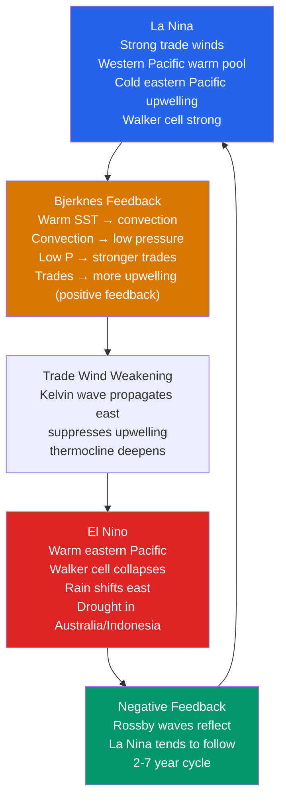

# 🌊 Ocean-Atmosphere Coupling and ENSO

> [!abstract] TL;DR
> **ENSO (El Niño–Southern Oscillation)** is the dominant mode of **interannual** climate variability, driven by **coupled ocean–atmosphere interactions** in the tropical Pacific. In **La Niña** (cold phase) strong **trade winds** pile warm water into the western Pacific, deepen the western thermocline, drive cold upwelling in the east, and **strengthen the Walker circulation**. In **El Niño** (warm phase) the trades weaken, the warm pool and its convection spread **eastward**, upwelling shuts down, and the **Walker circulation collapses**. The engine is the **Bjerknes feedback** (a positive ocean–atmosphere loop) working against **delayed negative feedbacks** carried by equatorial **Kelvin and Rossby waves**, giving a **2–7 year** oscillation. **Teleconnections** reorganize rainfall, temperature, drought, and hurricane activity worldwide, making ENSO the **primary target of seasonal forecasting**. Its predictors — **SST anomalies** (Niño 3.4) and **ocean heat content / warm-water volume** — are tracked by **ARGO floats** and **satellite altimetry**.

---

## Intuition — analogy FIRST

Picture the equatorial Pacific as a **long bathtub of warm water**, and the **trade winds** as a steady hand pushing the surface water toward the far (western) end. Under normal/La Niña conditions the hand pushes hard: warm water **heaps up in the west** (sea level near Indonesia sits tens of centimetres *higher* than off Peru), and to replace the water dragged away in the east, **cold water wells up from below** along South America. The warm western pile sits under towering thunderstorms; the cold eastern end is clear, dry, and rich in upwelled nutrients — the anchovy fishery.

Now imagine the hand **relaxes** slightly. The heaped-up warm water **sloshes back east**, and here is the twist that makes ENSO tick: **as the warm water spreads east, the thunderstorms follow it, and moving the storms east weakens the winds even more.** The winds relax → warm water spreads → winds relax further. That runaway is the **Bjerknes feedback** — a positive loop that flips the bathtub from the "tilted" (La Niña) state to the "flat" (El Niño) state. When the tub is flat, rain sits over the central/eastern Pacific: **drought in Australia and Indonesia, floods in Peru.** The slosh, though, overshoots and drains warm water out of the equatorial band, which eventually **re-tilts the tub the other way** — so the system doesn't rest, it **oscillates every few years**.

---

## How It Works

ENSO is not an ocean phenomenon with an atmospheric response, nor an atmospheric one with an oceanic response — it is a **single coupled mode** that exists only because the two fluids feed back on each other. The steady state is set by the **Walker circulation**; the instability that flips it is the **Bjerknes feedback**; and the memory that turns instability into an **oscillation** lives in the slow propagation of **equatorial ocean waves**.



**The Walker circulation is the background state.** The equatorial Pacific has a permanent east–west SST gradient: a **warm pool (~29–30 °C)** in the west and a **cold tongue (~23–24 °C)** in the east, kept cold by wind-driven **upwelling** and a **shallow eastern thermocline**. Warm water evaporates and convects, so air **rises over Indonesia**, flows east aloft, **sinks over the cool eastern Pacific** (subtropical high, dry Peru/Galápagos), and returns westward at the surface as the **trade winds**. This closed east–west overturning cell is the **Walker circulation**, and it is *driven by* the SST gradient it *helps maintain*.

**Bjerknes feedback is the positive loop (the amplifier).** Sir Jacob Bjerknes (1969) closed the circle: **warm eastern SST → more convection → lower sea-level pressure in the east → weaker east–west pressure gradient → weaker trade winds → less upwelling and a deeper eastern thermocline → even warmer eastern SST.** Schematically,

$$\underbrace{T'_E \uparrow}_{\text{SST anomaly}} \;\Rightarrow\; \tau'_x \downarrow \;\Rightarrow\; \text{upwelling} \downarrow,\; \text{thermocline}_E \downarrow \;\Rightarrow\; T'_E \uparrow\uparrow .$$

The same loop run with the sign reversed *strengthens* the cold state, which is why **La Niña is Bjerknes feedback running toward cold** and **El Niño toward warm**. Left to itself the coupled system is **unstable** — a small warm nudge grows.

**Equatorial ocean waves carry the memory (and the delay).** On the equator the Coriolis parameter vanishes, permitting two special trapped waves. A **downwelling equatorial Kelvin wave** — triggered by a westerly wind anomaly (or a burst) — propagates **eastward** at $c\!\approx\!2.5\text{–}3\,\text{m s}^{-1}$ (crossing the basin in **~2–3 months**), **deepening the eastern thermocline** and suppressing the cold upwelling: this is the **oceanic trigger of El Niño onset**. Off-equatorial **Rossby waves** propagate **westward** (about 1/3 the Kelvin speed), reflect off the western boundary into an **upwelling Kelvin wave**, and return east to **cool** the cold tongue — the **delayed negative feedback**.

**Thermocline geometry in a nutshell.** The thermocline (the sharp warm-over-cold boundary) sits at **~150–200 m in the west** and only **~40–50 m in the east** during La Niña. Because the eastern thermocline is shallow, small vertical displacements strongly change SST — the eastern Pacific is the **coupling hot-spot**. During El Niño the thermocline **flattens** (deepens in the east), decoupling upwelled water from the surface.

**Indices — the same event seen three ways.**
- **Niño 3.4** — area-averaged SST anomaly over **5°N–5°S, 170°W–120°W**; the operational standard. An **El Niño** is declared when it exceeds **+0.5 °C** (La Niña **< −0.5 °C**) sustained for **~3 consecutive overlapping seasons** (NOAA's ONI).
- **SOI (Southern Oscillation Index)** — the normalized **sea-level-pressure difference Tahiti minus Darwin**; the *atmospheric* fingerprint. Strongly **negative in El Niño** (pressure falls in the east, rises in the west).
- **MEI (Multivariate ENSO Index)** — combines SST, SLP, winds, and OLR into one multivariate measure.

Niño 3.4 (ocean) and SOI (atmosphere) are **anti-correlated** because they measure two faces of one coupled event.

**Teleconnections rewire the globe.** Shifting the tropical Pacific heat source moves the planet's convection and excites **Rossby wave trains** into the extratropics:
- **Indian monsoon:** El Niño is **inversely correlated** with all-India summer monsoon rainfall (El Niño years tend toward weaker/drier monsoons), though the relationship has weakened since the 1980s.
- **Australia/Indonesia/Maritime Continent:** El Niño → **drought and fire risk**; La Niña → **floods** (e.g., eastern Australia).
- **North America:** El Niño excites the **Pacific/North American (PNA)** pattern — a wetter, stormier **southern US/California**, milder north; La Niña often drier in the south.
- **Atlantic hurricanes:** El Niño **increases upper-level wind shear** over the tropical Atlantic and **suppresses** hurricane activity there, while **enhancing** eastern/central Pacific activity; La Niña does the opposite.

**Decadal cousins — not the same thing.** The **PDO (Pacific Decadal Oscillation)** is a **20–30 year** North-Pacific SST pattern that *modulates* ENSO (El Niños are stronger/more frequent in the PDO warm phase). The **AMO (Atlantic Multidecadal Oscillation)** is a **60–80 year** North-Atlantic SST swing tied to Atlantic hurricane activity and Sahel rainfall. Both are **decadal**, and both **shape the backdrop** ENSO oscillates against — but neither is ENSO.

**Forecasting.** Because the **ocean stores the memory** (warm-water volume changes months before SST), ENSO is **predictable 6–12 months ahead** — the crown jewel of seasonal climate prediction. Skill is limited by the **spring predictability barrier** (a persistence minimum in boreal spring) and by irreducible **stochastic forcing** such as **westerly wind bursts** and the **MJO**.

**ENSO and global mean temperature.** ENSO is the largest driver of **year-to-year global-mean surface temperature** wobbles: a big **El Niño discharges ocean heat to the atmosphere**, spiking global temperature by **~0.1–0.2 °C**, while **La Niña years run cool**. This is why record-warm years cluster on El Niños.

**Future ENSO.** Coupled models (**CMIP6**) still carry a **cold-tongue / double-ITCZ bias** that distorts simulated ENSO. Most projections suggest **more frequent strong El Niños** and **increased rainfall variability**, but changes in **amplitude and frequency remain genuinely uncertain** — one of climate science's open problems.

---

## Key Concepts / Details

### Secondary Level

- **El Niño** = an unusual **warming of the eastern tropical Pacific** (off Peru/Ecuador); **La Niña** = the opposite, an unusual **cooling**. They swing back and forth every **2–7 years**.
- **What flips it:** the **trade winds** normally push warm water west. When they weaken, warm water spreads **east** (El Niño); when they blow hard, warm water stays **west** and cold water wells up in the east (La Niña).
- **Global effects of El Niño:** **drought in Australia and Indonesia**, **floods in Peru**, often **wetter California**, weaker **Indian monsoon**, and **fewer Atlantic hurricanes**. La Niña tends to reverse these (Australian floods, more Atlantic hurricanes).
- **Positive feedback in one line:** weaker winds → warm water shifts east → thunderstorms follow → winds get **even weaker**. A small change snowballs.
- **SOI:** the **Southern Oscillation Index** is the **air-pressure difference between Tahiti and Darwin**; it goes strongly **negative during El Niño**. It's the *atmospheric* way to see the same event the ocean's SST shows.
- **Why we care:** ENSO is the single most useful thing for **seasonal forecasts** — knowing an El Niño is coming lets farmers, water managers, and disaster agencies plan **months** ahead.

### Undergraduate Level

**Walker circulation and the SST gradient.** The east–west overturning cell is driven by the **~5–6 °C SST contrast** between the **warm pool (~30 °C)** and the **cold tongue (~23–24 °C)**. Rising branch over the warm pool (deep convection, low SLP), sinking branch over the cold east (high SLP, subsidence), surface return = the **trades**. The cold tongue is maintained by **Ekman-driven upwelling** and a **shallow eastern thermocline**.

**Thermocline.** The boundary between the warm mixed layer and cold deep water; depth **~150–200 m (west)** vs **~40–50 m (east)** in La Niña. Because SST responds to thermocline displacement only where the thermocline is **shallow**, the **eastern** Pacific is where ocean and atmosphere couple most tightly.

**Bjerknes feedback (positive).** The core instability:

$$T'_E \uparrow \;\rightarrow\; \text{deep convection} \;\rightarrow\; \text{SLP}_E \downarrow \;\rightarrow\; \tau_x \downarrow \;\rightarrow\; \text{upwelling} \downarrow,\ \text{thermocline}_E \downarrow \;\rightarrow\; T'_E \uparrow .$$

Three sub-feedbacks add up: the **zonal-advection**, **thermocline**, and **Ekman-upwelling** feedbacks. When their combined gain exceeds damping, the coupled mode grows.

**Transition mechanism — equatorial waves.** A **westerly wind anomaly** launches a **downwelling equatorial Kelvin wave** that races **east** ($c \approx \sqrt{g' H}\approx 2.5\text{–}3\,\text{m s}^{-1}$; $g'$ = reduced gravity, $H$ = upper-layer depth), **deepens the eastern thermocline**, and suppresses the cold tongue → **El Niño onset**. The same wind anomaly launches **westward Rossby waves** that **reflect** off the western boundary and return as an **upwelling Kelvin wave** — the **delayed cooling** that ends the event.

**Niño 3.4 index.** SST anomaly over **5°N–5°S, 170°W–120°W**; the operational **ONI** flags El Niño when the 3-month running mean exceeds **+0.5 °C** for ≥5 overlapping seasons (La Niña ≤ **−0.5 °C**).

**ENSO amplitude and the IOD.** ENSO amplitude varies event to event and decade to decade. The **Indian Ocean Dipole (IOD)** — an east–west SST seesaw in the tropical Indian Ocean — is partly ENSO-forced and partly independent, and it strongly modulates **East African and Indonesian** rainfall.

**Teleconnection example — PNA.** El Niño's shifted convection excites a **Rossby wave train**: a deepened **Aleutian Low**, ridge over western Canada, trough over the southeastern US — the positive **PNA** pattern that steers a wetter storm track into **California and the Gulf states**.

### Graduate Level

**Zebiak–Cane model (1986).** The first **intermediate coupled model** to *simulate and forecast* ENSO from physics: a shallow-water reduced-gravity ocean + a mixed layer with SST equation, coupled to a **Gill-type** atmospheric response to heating. Cane, Zebiak & Dolan's **1986 forecast** of the 1986–87 El Niño launched operational ENSO prediction.

**Delayed-oscillator theory (Suarez–Schopf 1988; Battisti–Hirst 1989).** Reduce the coupled dynamics to eastern SST $T$ forced by local Bjerknes growth *plus a delayed, sign-reversed feedback* from the reflected Rossby→Kelvin wave:

$$\frac{dT}{dt} = a\,T(t) \;-\; b\,T(t-\delta) \;-\; \varepsilon\,T^3 ,$$

where $a$ is the Bjerknes growth rate, $b\,T(t-\delta)$ is the **delayed negative feedback** (delay $\delta$ = basin-crossing time of the reflected waves, ~months to a year), and the cubic term bounds the amplitude. The delay is what converts an unstable mode into a **self-sustained oscillation** of period a few years.

**Recharge oscillator (Jin 1997).** An alternative, elegant reduction to **two coupled variables** — eastern-Pacific SST anomaly $T$ and **basin-wide equatorial warm-water volume (WWV)** $h$ (a proxy for the *zonal-mean* thermocline / heat content):

$$\frac{dT}{dt} = R\,T + \gamma\,h, \qquad \frac{dh}{dt} = -\alpha\,T - r\,h .$$

Physics of the two terms: warm SST ($T>0$, El Niño) drives **poleward Sverdrup transport** that **discharges** warm water out of the equatorial band ($-\alpha T$); a **recharged** band ($h>0$) later warms the east ($+\gamma h$). The **90° phase lag** between $h$ and $T$ makes the pair rotate in the $(T,h)$ plane — **WWV leads SST by roughly a quarter period (~2–3 seasons)**, which is exactly why WWV is a **skillful predictor**. Eigenvalues $\lambda = \tfrac{1}{2}(R-r) \pm i\sqrt{\alpha\gamma - \left(\tfrac{R-r}{2}\right)^2}$ give a **growth rate** $(R-r)/2$ and a **frequency** set mainly by $\sqrt{\alpha\gamma}$. In nature $(R-r)$ is **weakly damped**, so ENSO behaves as a **damped oscillator sustained by stochastic forcing**.

**ENSO diversity — EP vs CP.** Not all El Niños look alike. **Eastern-Pacific (EP / "canonical")** events peak in the cold-tongue region; **Central-Pacific (CP / "Modoki")** events peak near the dateline with distinct — sometimes opposite — teleconnections (e.g., different Atlantic-hurricane and North-American impacts). CP events appear to have become **relatively more common** in recent decades.

**Cross-basin interactions.** The **Atlantic Niño** (equatorial-Atlantic warm mode) and the **IOD** interact with Pacific ENSO; a strong Atlantic Niño can even **force** Pacific cooling. These **inter-basin teleconnections** are an active research frontier and a source of the ENSO–Indian-monsoon inverse correlation's non-stationarity.

**Tropical cyclones.** El Niño's enhanced tropical-Atlantic **vertical wind shear** and mid-level dryness **suppress Atlantic TCs** but **enhance central/eastern Pacific** activity; La Niña reverses it. This is one of the most robust, operationally used ENSO teleconnections.

**Stochastic forcing & predictability.** **Westerly wind bursts** and the **MJO** provide the **noise** that kicks the damped oscillator and injects irreducible uncertainty. Combined with the **spring predictability barrier**, this caps deterministic skill near **~9–12 months**; beyond that, forecasts are inherently probabilistic (hence **ensembles**).

**Model biases & future change.** **CMIP6** GCMs still exhibit an **equatorial cold-tongue bias** and **double-ITCZ** error that skew ENSO period, amplitude, and diversity. Projections lean toward **more frequent strong (EP) El Niños** and **greater eastern-Pacific rainfall variability** under warming, but the **amplitude/frequency response remains uncertain** across models.

---

## Code Demo

```python
# Recharge oscillator model of ENSO (Jin 1997), integrated as a
# stochastically forced damped oscillator over 50 years.
#
#   dT/dt = b*T + gamma*h  (+ noise)   T = eastern-Pacific SST anomaly (degC)
#   dh/dt = -alpha*T - r*h             h = western/equatorial warm-water volume (WWV proxy)
#
# It reproduces two textbook ENSO facts:
#   (1) irregular El Nino (T>+0.5) / La Nina (T<-0.5) events every few years;
#   (2) the WARM-WATER VOLUME h LEADS the SST T by ~a quarter period (~2-3 seasons),
#       which is why WWV is a skillful ENSO predictor.
import numpy as np
import matplotlib.pyplot as plt

rng = np.random.default_rng(42)

# --- parameters (annualized units) ---
b     = 0.20   # net Bjerknes growth rate of eastern-Pacific SST anomaly T (1/yr)
gamma = 1.40   # recharge coupling: warm-water volume h -> warms the east (1/yr)
alpha = 1.40   # discharge: warm SST T pumps warm water OUT of the equator (1/yr)
r     = 0.25   # damping of warm-water volume h (1/yr)
sigma = 0.50   # amplitude of stochastic wind forcing on T (degC / sqrt(yr))

# --- time grid: 50 years, monthly steps ---
dt = 1.0/12.0
n  = int(50.0/dt)
t  = np.arange(n)*dt

T = np.zeros(n); h = np.zeros(n)
T[0], h[0] = 0.5, 0.0                       # start with a small warm anomaly

# --- Euler-Maruyama integration of the stochastically forced linear system ---
for k in range(n-1):
    dW      = rng.normal(0.0, np.sqrt(dt))  # Wiener increment (westerly wind bursts / MJO)
    T[k+1]  = T[k] + (b*T[k] + gamma*h[k])*dt + sigma*dW
    h[k+1]  = h[k] + (-alpha*T[k] - r*h[k])*dt

# --- classify events on the Nino-3.4-like +/- 0.5 degC threshold ---
elnino = T >  0.5
lanina = T < -0.5

# --- cross-correlation: does h lead T? ---
lags = range(1, 25)
cc   = [np.corrcoef(h[:n-s], T[s:])[0, 1] for s in lags]   # corr(h[k], T[k+s])
lead = list(lags)[int(np.argmax(cc))]

# --- plot ---
fig, ax = plt.subplots(2, 1, figsize=(11, 6), sharex=True)
ax[0].plot(t, T, color='#dc2626', lw=1.3, label='T  (E. Pacific SST anomaly, °C)')
ax[0].axhline( 0.5, color='#d97706', ls='--', lw=0.9)
ax[0].axhline(-0.5, color='#2563eb', ls='--', lw=0.9)
ax[0].fill_between(t,  0.5, T, where=elnino, color='#dc2626', alpha=0.30, label='El Niño (T > +0.5)')
ax[0].fill_between(t, -0.5, T, where=lanina, color='#2563eb', alpha=0.30, label='La Niña (T < -0.5)')
ax[0].set_ylabel('T  (°C)'); ax[0].legend(loc='upper right', fontsize=8); ax[0].grid(alpha=0.3)

ax[1].plot(t, h, color='#059669', lw=1.3, label='h  (warm-water volume proxy)')
ax[1].axhline(0, color='k', lw=0.6)
ax[1].set_xlabel('time (years)'); ax[1].set_ylabel('h  (WWV proxy)')
ax[1].legend(loc='upper right', fontsize=8); ax[1].grid(alpha=0.3)

fig.suptitle('Recharge oscillator model of ENSO (Jin 1997), stochastically forced')
plt.tight_layout(); plt.savefig('enso_recharge_oscillator.png', dpi=120)

# --- diagnostics ---
print(f"El Niño months : {elnino.sum():3d}  ({100*elnino.mean():.1f}%)")
print(f"La Niña months : {lanina.sum():3d}  ({100*lanina.mean():.1f}%)")
print(f"warm-water volume h LEADS SST T by ~{lead} months "
      f"(recharge precedes El Niño onset)")
print("Saved figure to enso_recharge_oscillator.png")
```

The top panel shows an **irregular, few-year oscillation** with clearly marked El Niño (red) and La Niña (blue) events — the noise makes each cycle a different amplitude, just like the real record. The bottom panel is the **warm-water volume** $h$; the printed cross-correlation confirms $h$ **leads** the SST by roughly a **quarter period (~1 year / 2–3 seasons)** — the physical basis of ENSO's forecast skill. Amplitudes are model-dependent (set by $\sigma$ and the growth rate $R-r$); the *phase relationship* is the robust, physical result.

---

## Real-World Notes

- **1997–98 El Niño — one of the strongest on record.** The eastern Pacific warmed several degrees, global convection reorganized, and the event **spiked global-mean surface temperature by ~0.2 °C**, helping make 1998 the warmest year to that point. Damages and disaster losses ran into the tens of billions of dollars worldwide.
- **2010–11 La Niña — a "triple" of disasters.** A very strong cold event was linked to catastrophic **Queensland (Australia) flooding**, the **2011 East African drought/famine** (Horn of Africa), and a **hyperactive Atlantic hurricane season** — a textbook La Niña teleconnection signature.
- **IRI/CPC ENSO forecasts.** The **International Research Institute for Climate and Society (IRI)** and NOAA's **Climate Prediction Center** issue **monthly ENSO probability forecasts** (the "ENSO plume" of dynamical + statistical models), with useful skill **6–12 months** ahead — the operational payoff of ocean memory.
- **The observing system.** The **~3,900-float ARGO** array (autonomous profiling floats measuring temperature/salinity to 2,000 m), the equatorial **TAO/TRITON moored buoy array**, and **Jason-series / Sentinel-6 satellite altimeters** (sea-surface height ∝ upper-ocean heat content) together provide the **ocean-heat-content and SST** data that ENSO monitoring and initialization depend on.
- **The name.** **"El Niño"** is Spanish for **"the (Christ) Child"** — Peruvian fishermen named the warm coastal current for its tendency to appear around **Christmas**; **"La Niña"** ("the girl") was later coined for the opposite phase.

---

## Common Pitfalls

1. **Calling ENSO "an ocean thing" or "a wind thing."** ENSO is a **coupled ocean–atmosphere mode** — it exists *only* because SST drives winds (Bjerknes) and winds drive ocean waves/upwelling. Neither fluid alone produces it; explanations that keep one fixed miss the instability entirely.
2. **Assuming El Niño affects everywhere the same way.** Impacts are **regional and seasonal**: El Niño **dries Australia/Indonesia** but can **wet California**, weakens the **Indian monsoon**, and **suppresses Atlantic hurricanes** while enhancing Pacific ones. There is no single "El Niño weather."
3. **Confusing the SOI and the Niño SST indices.** They measure the **same event from opposite sides** — the **SOI is the atmospheric pressure seesaw** (Tahiti−Darwin), the **Niño indices are ocean SST**. They are **anti-correlated**, not independent; a "negative SOI + positive Niño 3.4" is one El Niño, not two signals.
4. **Lumping PDO/AMO with ENSO.** The **PDO (decadal, North Pacific)** and **AMO (multidecadal, North Atlantic)** are **slow background modes** that *modulate* ENSO's amplitude and impacts — they are **not** the **interannual** ENSO cycle and operate on completely different timescales.
5. **Treating ENSO as "just a tropical Pacific" event.** Through **Rossby-wave teleconnections** ENSO **reorganizes the global circulation** — the PNA/jet over North America, the monsoons, Atlantic shear, even global-mean temperature. Its footprint is planetary, not local.

---

## Related Concepts

- [[_MOC_Climate_System]] — section map for the climate-system unit (uplink).
- [[Global_Atmospheric_Circulation]] — the Walker (zonal) and Hadley (meridional) cells whose reorganization *is* ENSO; sets the background state ENSO perturbs.
- [[Climate_Variability_and_Teleconnections]] — ENSO is the leading interannual mode; PNA, NAO, IOD, PDO, and AMO are its cousins and modulators.
- [[Tropical_Meteorology_and_Monsoons]] — the ENSO–monsoon inverse teleconnection and the tropical convection that couples ocean to atmosphere.
- [[Paleoclimatology_and_Ice_Cores]] — corals, sediments, and ice cores record ENSO variability far beyond the instrumental era.
- [[Ensemble_Forecasting_and_Uncertainty]] — the spring barrier and stochastic wind bursts make ENSO prediction inherently probabilistic.
- [[Coriolis_Effect_and_Geostrophic_Balance]] — the vanishing Coriolis force at the equator is exactly what permits the trapped Kelvin and Rossby waves that time ENSO.
- [[_MOC_Physics_Master]] — parent physics vault for the underlying fluid dynamics and thermodynamics.
- [[Wave_Motion_and_Properties]] — dispersion, phase vs group velocity, and reflection, applied here to equatorial Kelvin and Rossby waves.
- [[Laws_of_Thermodynamics]] — ocean heat storage and the air–sea heat exchange behind El Niño's global-temperature spike.
- [[_MOC_Earth_Science_Master]] — parent Earth-science vault for the ocean and coastal context.
- [[Coastal_Processes_and_Landforms]] — coastal upwelling off Peru and its collapse during El Niño (fisheries, sea-level, coastal flooding).

---

## Review Questions

- **Secondary:** During a strong **El Niño**, describe what happens to **rainfall in Australia, in Peru, and in India** (wetter or drier?). Explain, in your own words, why a **small weakening of the trade winds** tends to cause an **even larger** weakening — i.e., why the feedback is *positive*.
- **Undergraduate:** Explain the **Bjerknes feedback** step by step, from an eastern-Pacific SST warming back to further warming. Why does the **Walker circulation collapse** during El Niño? Describe the role of the **equatorial oceanic Kelvin wave** in the transition **from La Niña to El Niño** (direction, speed, effect on the thermocline). Define the **Niño 3.4 index** and state the **threshold** used to declare an El Niño event.
- **Graduate:** Write down and interpret the **recharge oscillator model (Jin 1997)**: what physical processes do the two variables — **eastern-Pacific SST anomaly $T$** and **equatorial warm-water volume $h$** — represent, and what do the **discharge ($-\alpha T$)** and **recharge ($+\gamma h$)** couplings encode? Show why the model produces **oscillatory** behaviour (sketch the eigenvalues) and why $h$ **leads** $T$ by ~a quarter period. What **observational evidence** supports **WWV as a predictor** of future ENSO, and what mechanisms (**spring predictability barrier, westerly wind bursts, MJO, ENSO diversity**) **limit forecast skill beyond ~1 year**?

---

## Sources

- Philander, S. G. H. — *El Niño, La Niña, and the Southern Oscillation* (1990, Academic Press). Foundational text on coupled tropical Pacific dynamics, the Walker circulation, and equatorial waves.
- McPhaden, M. J., Zebiak, S. E. & Glantz, M. H. (2006) — "ENSO as an Integrating Concept in Earth Science," *Science*, **314**, 1740–1745. The observing system, teleconnections, and Earth-system impacts.
- Neelin, J. D. — *Climate Change and Climate Modeling* (2011, Cambridge University Press). Recharge oscillator, coupled feedbacks, model biases, and ENSO under climate change.
- Bjerknes, J. (1969) — "Atmospheric teleconnections from the equatorial Pacific," *Mon. Wea. Rev.*, **97**, 163–172. The original positive-feedback hypothesis.
- Jin, F.-F. (1997) — "An equatorial ocean recharge paradigm for ENSO," *J. Atmos. Sci.*, **54**, 811–829. The recharge-oscillator theory used in the code demo.

---

#Meteorology #Climatology #ENSO #ElNino #WalkerCirculation #OceanAtmosphere
