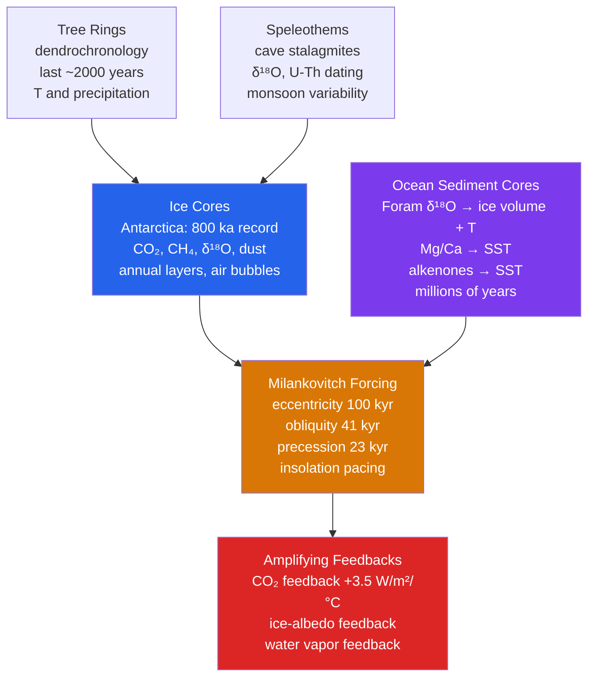

# 🧊 Paleoclimatology and Ice Cores

> [!abstract] TL;DR
> **Paleoclimatology** reconstructs Earth's past climates from **proxy records** — ice cores, tree rings, ocean sediments, corals, speleothems — to map natural climate variability and constrain how sensitive the climate is to forcing. **Ice cores** from Antarctica and Greenland preserve up to **800,000 years** of history, showing a tight lockstep between $\text{CO}_2$, $\text{CH}_4$, and temperature across the **glacial–interglacial cycles**. **Milankovitch orbital cycles** — eccentricity ($\sim100$ kyr), obliquity ($\sim41$ kyr), and precession ($\sim23$ kyr) — *pace* the ice ages, but the small orbital forcing ($\sim1\ \text{W/m}^2$) only produces full ice-age amplitude once amplified by $\text{CO}_2$ and **ice-albedo feedbacks**. Today's $\text{CO}_2$ ($\sim420$ ppm) exceeds any level in at least **3 million years**. Because paleo data reach far outside the instrumental window, they are the primary evidence for **Earth system sensitivity** beyond what the last 150 years can tell us.

## Intuition — analogy FIRST

Imagine a **layer cake baked one snowfall at a time**. Every winter the ice sheet of Antarctica or Greenland adds a fresh layer of snow; every summer a slightly different layer forms on top. As snow buries snow, the air between the flakes is squeezed into sealed **bubbles** — tiny flasks of *the actual ancient atmosphere*, $\text{CO}_2$ and methane and all, corked shut and stored in a natural deep-freeze. The snow also carries **dust** (from dry, windy glacial climates), **volcanic ash** (from datable eruptions), and **sea-salt** blown off the ocean.

And the ice itself keeps a thermometer. Water molecules made with the heavier oxygen-18 or deuterium condense out of clouds a little more readily when the air is warm, so the **isotopic "flavour" of the ice records how cold it was the day that snow fell**. Drill down through the cake and you are reading pages of a diary that runs back 800,000 years — one where the ink is chemistry and the paper is ice. Everything technical below is just learning how to *read the handwriting*.

---

## How It Works

Paleoclimate is a **network science**: no single archive covers all time and all variables, so proxies are cross-calibrated and stitched together. Ice cores give the atmosphere directly; ocean cores give the longest continuous ice-volume signal; tree rings and speleothems give high-resolution recent detail; and orbital theory supplies the external clock that ties them together.



---

## Key Concepts / Details

### Secondary Level

**What ice cores tell us.** Drilling a cylinder of ancient ice and lifting it to the surface recovers, layer by layer, a physical sample of the past. Three signals matter most:

- **Trapped air bubbles** are direct samples of the *ancient atmosphere*. Measuring the gas in a bubble tells us exactly how much $\text{CO}_2$ and methane were in the air when that ice formed — no model, no assumption, just the gas itself.
- **The isotopes of the ice** ($\delta^{18}\text{O}$ and $\delta\text{D}$, the ratio of heavy to light water molecules) act as a **thermometer** for the day the snow fell.
- **Dust and ash** record how dry, windy, and volcanically active the world was.

**The big picture.** Over the last 800,000 years Earth swung between cold **glacial** periods (ice ages) and warm **interglacial** periods roughly every 100,000 years. In the ice cores, **$\text{CO}_2$ and temperature rise and fall together** — when one is high, so is the other. During ice ages $\text{CO}_2$ dropped to $\sim180$ ppm; during warm periods it rose to $\sim280$ ppm. Today it is $\sim420$ ppm — far above anything in the entire record.

**Why the ice ages happen.** Earth's orbit and tilt wobble slowly over tens of thousands of years (**Milankovitch cycles**), changing how much summer sunlight reaches the far north. Weak northern summers let snow survive year-round, ice sheets grow, and the planet cools. Strong summers melt the ice back.

**The Last Glacial Maximum (LGM), ~21,000 years ago.** The peak of the last ice age: global temperature about **5 °C colder**, a **2–3 km thick Laurentide ice sheet** over Canada, and **sea level ~120 m lower** than today (so much water was locked up in ice sheets that coastlines were kilometres out to sea).

**The Holocene.** The stable warm period of the last ~11,700 years — the interglacial in which *all of human agriculture and civilization* arose. A mild "Holocene optimum" around 6,000–8,000 years ago was slightly warmer in places than the pre-industrial baseline.

### Undergraduate Level

**The isotope paleothermometer.** Water molecules containing the heavier $^{18}\text{O}$ (or deuterium, $^2\text{H} = \text{D}$) evaporate less easily and condense more easily than the light $^{16}\text{O}$/$^1\text{H}$ molecules. As an air mass cools moving toward the poles, it preferentially rains out the heavy isotopes, so the vapour that finally falls as polar snow is *isotopically depleted*, and the colder the condensation the more depleted it is. Empirically, for high-latitude precipitation the relationship is roughly

$$\delta^{18}\text{O} \;\approx\; -0.67 \times \Delta T \quad (\text{per mil per } ^\circ\text{C, approximate, site-specific}).$$

**Deuterium excess** ($d = \delta\text{D} - 8\,\delta^{18}\text{O}$) is a second-order signal that records conditions at the *moisture source* (sea-surface temperature and humidity), helping disentangle source changes from local temperature. Independent confirmation comes from **borehole temperature**: heat diffuses so slowly through a kilometre of ice that the *physical* temperature profile down the borehole still preserves a smoothed memory of past surface temperatures, which can be inverted to validate the isotope calibration.

**Gas age versus ice age.** A crucial subtlety: snow does not seal instantly. It takes decades to centuries for accumulating snow to compress through the porous **firn** layer ($\sim50\text{–}120$ m deep) into airtight ice. So at any depth the *ice* is older than the *air bubbles* it contains — the **gas age–ice age difference** ($\Delta$age), which can reach $\sim1000$ years in cold, low-accumulation sites like the Antarctic plateau. Getting $\Delta$age right is essential to comparing $\text{CO}_2$ (a gas signal) with temperature (an ice signal).

**The great cores.** The **Vostok** core (Russia, 1998) first delivered 420,000 years / 4 glacial cycles. The **EPICA Dome C** core (European consortium) extended this to **800,000 years / 8 cycles**. Greenland cores (**GRIP, GISP2, NGRIP, NEEM**) have higher accumulation and thus finer *annual* resolution, ideal for abrupt events, but only reach back $\sim123,000$ years before the ice becomes disturbed.

**The $\text{CO}_2$ record in numbers.** Glacial $\text{CO}_2 \approx 180$ ppm; interglacial $\approx 280$ ppm; **2024 $\approx 420$ ppm**. The entire natural glacial–interglacial swing was $\sim100$ ppm; humans have added *more than that again* in under two centuries.

**Milankovitch, quantitatively.** The pacemaker is not the *global annual* insolation (which barely changes) but **summer insolation at 65° N** — the sunlight available to melt (or spare) high-latitude snow:

| Cycle | Period | Physical change | Effect on insolation |
|---|---|---|---|
| **Eccentricity** | $\sim100$ kyr (and 405 kyr) | Orbit shape (near-circle ↔ ellipse) | Modulates annual total and the *strength* of precession |
| **Obliquity** | $\sim41$ kyr | Axial tilt $22.1^\circ\!-\!24.5^\circ$ | High-latitude seasonal contrast |
| **Precession** | $\sim23$ kyr (and 19 kyr) | Season at perihelion | Which season Earth is nearest the Sun |

**The 100-kyr problem.** Since $\sim1$ Ma the dominant glacial rhythm is $\sim100$ kyr — matching **eccentricity** — yet eccentricity is by far the *weakest* direct insolation forcing (it mostly just modulates the amplitude of precession). Explaining why the weak 100-kyr band dominates is a central open puzzle (see Graduate).

**Abrupt events.** The **Younger Dryas** (12,900–11,700 years ago) was a sharp return to near-glacial cold in the North Atlantic *during* the last deglaciation. The leading trigger is a slowdown or collapse of the **Atlantic Meridional Overturning Circulation (AMOC)** as a flood of glacial meltwater freshened the North Atlantic and shut off deep-water formation, cutting the northward heat transport.

**Tree rings and corals.** **Dendrochronology** yields annually resolved, absolutely dated temperature and precipitation for the last $\sim2000$ years (and longer with sub-fossil wood). Its notorious caveat is the **divergence problem**: since $\sim1960$ some high-latitude tree-ring density series *underestimate* the measured warming, complicating recent calibration. **Coral $\delta^{18}\text{O}$ and Sr/Ca** give monthly-resolution tropical sea-surface temperature, capturing ENSO and monsoon variability. These high-resolution proxies are increasingly fused with climate models through **paleoclimate data assimilation** (e.g., the **Last Millennium Reanalysis**).

### Graduate Level

**Constraining climate sensitivity.** The instrumental era is short and its forcing is still evolving, so paleoclimate provides an independent lever on **equilibrium climate sensitivity (ECS)** — the warming per $\text{CO}_2$ doubling. Comparing LGM cooling ($\sim5\ ^\circ\text{C}$) against its total forcing (lowered $\text{CO}_2$, expanded ice-albedo, dust, and vegetation), and comparing warm periods like the Pliocene, yields ECS estimates of $\sim 2.5\text{–}4\ ^\circ\text{C}$ — reassuringly *consistent* with instrumental and model-based estimates. The IPCC AR6 "likely" range of $2.5\text{–}4\ ^\circ\text{C}$ leans on this multi-line agreement.

**Earth system sensitivity (ESS).** ECS holds ice sheets and vegetation fixed. **ESS** lets those *slow* feedbacks respond — melting ice sheets (albedo), shifting biomes, and slow carbon-cycle feedbacks — and is correspondingly **larger, $\sim4\text{–}6\ ^\circ\text{C}$ per doubling**. Paleoclimate is the *only* archive that samples these millennial-scale feedbacks, so ESS is essentially a paleo-derived quantity. It matters because committed long-term warming (and sea-level rise) exceeds the century-scale ECS response.

**The $\text{CO}_2$ feedback strength.** Across glacial cycles the ice cores imply a carbon-cycle sensitivity of roughly $+3.5\ \text{W/m}^2$ of $\text{CO}_2$ forcing per $^\circ\text{C}$ of global temperature change — a *feedback*, not a forcing, in the paleo context: orbital forcing changes temperature, which changes ocean $\text{CO}_2$ solubility and biology, which changes $\text{CO}_2$, which amplifies the temperature change.

**Theories for the 100-kyr cycle.** Because linear response to eccentricity forcing cannot produce the observed sawtooth 100-kyr cycles, candidate mechanisms invoke **non-linearity and internal memory**: (i) **ice-sheet dynamics** with thresholds (a large ice sheet is hard to grow but collapses fast once basal conditions change), giving asymmetric slow-growth/rapid-termination sawteeth; (ii) **stochastic resonance**, where climate noise plus weak periodic forcing hops the system between glacial and interglacial states; (iii) skipping of obliquity/precession beats so that terminations occur every second or third cycle, phase-locked to insolation. The **Mid-Pleistocene Transition** ($\sim1.25\text{–}0.7$ Ma), when the rhythm switched from a 41-kyr (obliquity) world to the 100-kyr world with no change in orbital forcing, is the key testbed and remains unresolved.

**Dansgaard–Oeschger (DO) events.** Greenland cores reveal $\sim25$ **abrupt warmings** during the last glacial, each a jump of $8\text{–}16\ ^\circ\text{C}$ over Greenland within *decades*, followed by gradual cooling — the **stadial/interstadial** oscillation with a quasi-periodicity near **1500 years**. They are interpreted as reorganizations of the AMOC and sea-ice, and they alternate in a *bipolar seesaw* with slower Antarctic temperature changes (Antarctic warming during Greenland cold).

**Heinrich events.** Layers of **ice-rafted debris (IRD)** — coarse rock dropped by armadas of icebergs — mark massive, episodic **Laurentide ice-sheet collapses**. The freshwater pulse disrupted the AMOC, deepening the cold stadials and coupling ice-sheet instability to abrupt climate change.

**Deep-time analogues.** Beyond the ice-core window, ocean sediments and other proxies reach back millions of years:

- The **PETM** (Paleocene–Eocene Thermal Maximum, $\sim56$ Ma): a rapid injection of thousands of gigatonnes of carbon, $\sim5\text{–}8\ ^\circ\text{C}$ global warming, and severe ocean acidification — the closest deep-time analogue to anthropogenic emissions, though modern release is roughly an *order of magnitude faster*.
- The **Pliocene warm period** ($\sim3$ Ma): $\text{CO}_2$ near **400 ppm** — comparable to today — with global temperature $\sim2\text{–}3\ ^\circ\text{C}$ warmer and sea level up to **$\sim20$ m higher**. This is the best natural analogue for the *equilibrium* world toward which current $\text{CO}_2$ commits us.

**The ocean-sediment backbone.** Benthic (bottom-dwelling) **foraminifera $\delta^{18}\text{O}$** blends deep-ocean temperature and global ice volume; spliced across dozens of cores it forms the **LR04 stack** (Lisiecki & Raymo, 2005), a continuous 5.3-Myr reference against which orbital tuning is performed. Complementary SST proxies — **Mg/Ca** ratios in foram tests and **alkenone $U^{K'}_{37}$** unsaturation indices — separate the temperature from the ice-volume component. Network syntheses such as **PAGES 2k** (last two millennia) and **PMIP** (Paleoclimate Modelling Intercomparison Project, simulating the LGM, mid-Holocene, and Pliocene) close the loop between proxies and models.

---

## Python Demo

A simplified reconstruction of the **Milankovitch summer-solstice insolation at 65° N** over the past 800,000 years, built by superposing idealized eccentricity, obliquity, and precession cycles, then overlaid on a schematic glacial–interglacial temperature curve to show the pacing correlation.

```python
# Simplified Milankovitch insolation reconstruction (65 N, summer solstice)
# and its relationship to a schematic glacial-interglacial temperature curve.
# The orbital elements are IDEALIZED single-period sinusoids for teaching;
# real orbital solutions (e.g. Laskar 2004) superpose many terms.
import numpy as np
import matplotlib.pyplot as plt

# --- Time axis: 0 = present, going back 800,000 years (kyr units) ---
t = np.linspace(0, 800, 4000)   # kyr before present

# --- Idealized orbital cycles (amplitudes are schematic, dimensionless) ---
# Eccentricity ~100 kyr, obliquity ~41 kyr, precession ~23 kyr.
# Precession's climatic influence is MODULATED by eccentricity, so we
# multiply the precession term by the (positive) eccentricity envelope.
ecc_env  = 0.5 * (1.0 + np.sin(2 * np.pi * t / 100.0))     # 0..1 envelope, 100 kyr
obliquity =        np.sin(2 * np.pi * t / 41.0)            # 41 kyr
precession =       np.sin(2 * np.pi * t / 23.0)            # 23 kyr

# Combined summer-insolation anomaly at 65 N (weights ~ relative importance):
#   obliquity dominates high-latitude summer sun; precession is amplitude-
#   modulated by eccentricity; eccentricity alone contributes little directly.
insolation = (0.55 * obliquity
              + 0.45 * precession * (0.4 + ecc_env)   # precession scaled by ecc
              + 0.10 * (ecc_env - 0.5))               # weak direct ecc term

# Normalize to a physically suggestive spread around 65 N summer value ~480 W/m^2
W = 480.0 + 25.0 * (insolation - insolation.mean()) / insolation.std()

# --- Schematic temperature: 0 = interglacial, -5 = full glacial ---
# Ice sheets integrate and lag the forcing (thermal + ice-sheet inertia).
# Model temperature as a smoothed, threshold-shaped response to insolation.
from numpy import convolve
kernel = np.exp(-np.linspace(0, 4, 200))          # asymmetric decay kernel
kernel /= kernel.sum()
lagged = convolve(insolation, kernel, mode="same")  # ice-sheet memory/lag
Tanom = -2.5 + 2.5 * np.tanh(1.5 * (lagged - lagged.mean()) / lagged.std())
Tanom = np.clip(Tanom, -5.0, 0.0)                 # 0 interglacial, -5 glacial

# --- Plot ---
fig, (ax1, ax2) = plt.subplots(2, 1, figsize=(11, 7), sharex=True)

ax1.plot(t, W, color="#d97706", lw=1.0)
ax1.set_ylabel("65N summer\ninsolation (W/m$^2$)")
ax1.set_title("Milankovitch summer-solstice insolation at 65N (idealized)")
ax1.grid(alpha=0.3)

ax2.plot(t, Tanom, color="#2563eb", lw=1.2)
ax2.fill_between(t, Tanom, 0.0, where=(Tanom < -3.5),
                 color="#93c5fd", alpha=0.5, label="glacial")
ax2.set_ylabel("Temperature\nanomaly ($^\\circ$C)")
ax2.set_xlabel("Age (kyr before present)")
ax2.set_title("Schematic glacial-interglacial temperature (0=interglacial, -5=glacial)")
ax2.legend(loc="lower right")
ax2.grid(alpha=0.3)

# Report the dominant cycle by a crude FFT of the insolation series
dt_kyr = t[1] - t[0]
freqs = np.fft.rfftfreq(len(t), d=dt_kyr)
power = np.abs(np.fft.rfft(insolation - insolation.mean()))**2
peak = 1.0 / freqs[1 + np.argmax(power[1:])]   # skip DC term
print(f"Dominant spectral period in the idealized forcing: ~{peak:.0f} kyr")

plt.tight_layout()
plt.savefig("milankovitch.png", dpi=120)
plt.show()
```

Expected behaviour: the insolation trace is a busy interference pattern beating at 23-, 41-, and 100-kyr periods; the temperature curve tracks it in a smoothed, *asymmetric* way — slow slides into glacials, faster terminations — echoing the real sawtooth, and the FFT flags one of the orbital bands as dominant.

---

## Real-World Notes

- **EPICA Dome C** (Antarctica) drilled ice reaching back **800,000 years** — eight complete glacial cycles — the longest continuous ice-core climate record on Earth, and the source of the canonical 800-kyr $\text{CO}_2$ curve.
- **Greenland cores (GISP2, NGRIP)** showed the **Younger Dryas** termination happened astonishingly fast — the North Atlantic warmed by several degrees and snowfall roughly doubled within **a decade, some transitions within a few years** — proof that climate can flip on human timescales.
- The **2021–2022 IPCC AR6** concluded that atmospheric $\text{CO}_2$ is now higher than at any point in **at least 2 million years** (and likely longer), with the rate of rise unprecedented in at least 800,000 years of ice-core data.
- The **tree-ring "divergence problem"** — post-1960 high-latitude ring density under-recording the instrumental warming — is a genuine caveat for millennial temperature reconstructions and a reminder that proxies must be validated against, not assumed to equal, real temperature.
- The **Vostok** core (published 1999) first revealed the tight coupling of $\text{CO}_2$, $\text{CH}_4$, and temperature across four ice ages, transforming climate science by demonstrating that greenhouse gases and temperature are dynamically linked, not incidental.

---

## Common Pitfalls

1. **"$\text{CO}_2$ lags temperature by ~800 years, so temperature drives $\text{CO}_2$, not the reverse."** The lag is *real but misread*. Orbital forcing warms the ocean first, which outgasses $\text{CO}_2$; that $\text{CO}_2$ then **amplifies** the warming (it accounts for a large share of the total glacial–interglacial temperature change). Cause and feedback coexist — a lag at the *initiation* does not negate $\text{CO}_2$'s role as an amplifier, and it says nothing about today's rise, which is $\text{CO}_2$ *leading*.
2. **"Milankovitch cycles alone caused the ice ages."** The direct orbital forcing is tiny ($\sim1\ \text{W/m}^2$ globally). Ice ages require **$\text{CO}_2$ and ice-albedo feedbacks** to amplify orbital pacing into the full $\sim5\ ^\circ\text{C}$ swings. Milankovitch sets the *timing*, feedbacks set the *amplitude*.
3. **"Ice-core $\delta^{18}\text{O}$ is a global thermometer."** It records **local** condensation temperature at that specific site, and the isotope-to-temperature slope is *site- and period-specific*. Converting it to a global mean requires calibration (borehole temperatures, source-region corrections) and is not a simple scaling.
4. **"The hockey-stick debate showed recent warming isn't unusual."** The controversy was about **statistical reconstruction methods**, not the conclusion. Multiple *independent* proxy networks (PAGES 2k, boreholes, glaciers, corals) have since confirmed that recent warming is unprecedented in at least the last one to two millennia.
5. **"The glacial cycle has always been 100 kyr."** Only since $\sim1$ Ma. Before the **Mid-Pleistocene Transition** the dominant rhythm was **41 kyr (obliquity)**, and *why* it switched — with no change in orbital forcing — is an active, unresolved research question.

---

## Related Concepts

- [[_MOC_Climate_System]] — section map for the climate-system module (entry point).
- [[Climate_Sensitivity_and_Feedbacks]] — paleo data are a primary constraint on ECS and the source of Earth system sensitivity.
- [[Anthropogenic_Climate_Change]] — the modern $\text{CO}_2$ spike put in the context of the 800-kyr baseline this note establishes.
- [[Climate_Variability_and_Teleconnections]] — DO events, the bipolar seesaw, and AMOC changes are deep-time cousins of modern modes of variability.
- [[Solar_Radiation_and_the_Energy_Budget]] — the insolation whose orbital modulation (Milankovitch) paces the ice ages.
- [[_MOC_Earth_Science_Master]] — cross-vault entry point for the geological archives (ice, sediment, rock).
- [[Radiometric_Dating]] — U–Th dating of speleothems and $^{14}\text{C}$ of organics underpin proxy age models.
- [[Mass_Extinctions_and_Paleoclimate]] — the deep-time (pre-ice-core) climate record and the PETM analogue.
- [[Glaciers_and_Glacial_Landscapes]] — the ice sheets whose growth and collapse both *store* the record and *drive* sea-level change.
- [[Formation_of_the_Solar_System]] — origin of Earth's orbit and axial tilt, the geometry behind Milankovitch cycles.
- [[Orbital_Mechanics_and_Celestial_Dynamics]] — the celestial dynamics that produce eccentricity, obliquity, and precession variations.
- [[_MOC_Physics_Master]] — cross-vault physics entry point for the isotope and radiation physics involved.
- [[Radioactive_Decay]] — the decay clocks (U–Th, $^{14}\text{C}$, $^{40}\text{Ar}/^{39}\text{Ar}$) that date proxy archives.
- [[_MOC_Chemistry_Master]] — cross-vault chemistry entry point for isotope fractionation and carbonate geochemistry.

---

## Review Questions

1. **Secondary:** What does the relationship between $\text{CO}_2$ concentration and temperature in the ice-core record tell us about their connection? Why does $\text{CO}_2$ *lag* temperature by roughly 800 years in the paleoclimate record — and does that lag mean $\text{CO}_2$ is not causing today's warming? Explain the difference between the two situations.
2. **Undergraduate:** Describe the three Milankovitch orbital cycles (eccentricity, obliquity, precession) and their approximate periods. Why is the $\sim100$-kyr eccentricity cycle the dominant glacial–interglacial periodicity even though its direct insolation forcing is *smaller* than the obliquity cycle's? What is the key summer-insolation parameter that paces Northern Hemisphere ice ages, and why that latitude/season?
3. **Graduate:** Explain how paleoclimate data are used to constrain **equilibrium climate sensitivity (ECS)**. Why is **Earth system sensitivity (ESS)** larger than ECS, and which slow feedbacks does it include? Then describe **Dansgaard–Oeschger events**: their timing (the $\sim1500$-year quasi-periodicity), the evidence linking them to AMOC reorganization and the bipolar seesaw, and why they are relevant to assessing abrupt-change risk in future projections.

---

## Sources

- Jouzel, J. et al. (2007), "Orbital and Millennial Antarctic Climate Variability over the Past 800,000 Years," *Science* 317, 793–796.
- Alley, R. B. (2000), *The Two-Mile Time Machine: Ice Cores, Abrupt Climate Change, and Our Future*, Princeton University Press.
- Raymo, M. E. & Huybers, P. (2008), "Unlocking the Mysteries of the Ice Ages," *Nature* 451, 284–285.
- Lisiecki, L. E. & Raymo, M. E. (2005), "A Pliocene–Pleistocene stack of 57 globally distributed benthic $\delta^{18}\text{O}$ records (LR04)," *Paleoceanography* 20, PA1003.
- Lüthi, D. et al. (2008), "High-resolution carbon dioxide concentration record 650,000–800,000 years before present," *Nature* 453, 379–382.
- IPCC AR6 WG1 (2021), *Climate Change 2021: The Physical Science Basis*, Ch. 2 & 5 (paleoclimate context).

---

#Meteorology #Climatology #Paleoclimatology #IceCores #MilankovitchCycles #GlacialCycles
