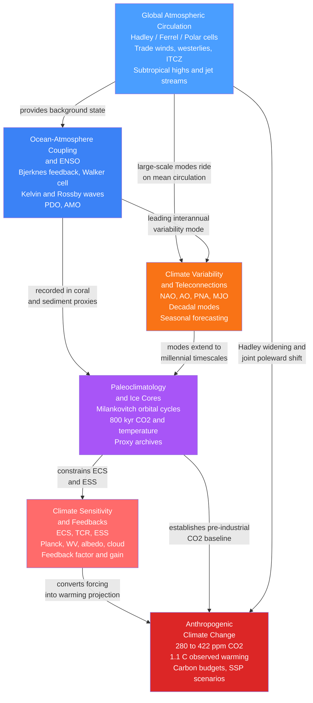

# Climate System — Map of Content

> [!info] How to use this map
> Start with **Global Atmospheric Circulation** (the foundational framework), follow the arrows through ocean coupling and variability modes, then branch into the deep-time record and the physics of sensitivity before arriving at the anthropogenic synthesis. Each node links to a full note. Return to this map whenever you need to reorient.

The six notes in this section together explain *how* the climate system distributes energy, *how* it varies on timescales from years to ice ages, and *why* it responds the way it does to radiative forcing — natural or anthropogenic. Circulation provides the skeleton, ENSO and variability modes provide the muscle memory, paleoclimatology provides the long-run archive, sensitivity and feedbacks provide the quantitative lever, and anthropogenic change is where all those threads converge on the present crisis.

---

## Concept Map

*(Blue = foundational, orange = intermediate, purple = deep-time bridge, red = advanced/capstone; arrows read "leads to" or "is required for")*

---

## Learning Path

Recommended order for a first pass through this section:

1. [[Global_Atmospheric_Circulation]] — Start here. The three-cell model, the ITCZ, subtropical highs, trade winds, and westerlies form the circulation skeleton that every other note in this section presupposes. Understanding why deserts sit at 25-30 degrees and why the midlatitudes are stormy is the foundation.

2. [[Ocean_Atmosphere_Coupling_and_ENSO]] — The Walker circulation introduced in note 1 is the background state that ENSO disrupts. This note explains the Bjerknes positive feedback, equatorial wave dynamics, and why the tropical Pacific dominates interannual climate variability globally. Builds directly on circulation.

3. [[Climate_Variability_and_Teleconnections]] — With ENSO established as the primary interannual mode, this note surveys the full zoo of variability patterns (NAO, AO, PNA, PDO, AMO, MJO, IOD, SAM) and explains the Rossby-wave-train mechanism by which a tropical heat anomaly reorganizes weather thousands of kilometres away. Seasonal forecasting becomes possible here.

4. [[Paleoclimatology_and_Ice_Cores]] — A deliberate pivot from the instrumental era to deep time. Ice cores, ocean sediments, tree rings, and speleothems extend the climate record 800,000 years back, revealing glacial-interglacial cycles paced by Milankovitch orbital forcing and amplified by CO2 and ice-albedo feedbacks. Provides the longest-run test bed for climate dynamics.

5. [[Climate_Sensitivity_and_Feedbacks]] — The quantitative heart of climate physics. Introduces the energy-balance sensitivity equation, decomposes the Planck, water-vapor, lapse-rate, surface-albedo, and cloud feedbacks, and explains why ECS has a skewed distribution with a long warm tail. Paleoclimate from note 4 is the primary independent constraint on ECS. Advanced but essential before interpreting projections.

6. [[Anthropogenic_Climate_Change]] — The capstone. Draws on the Keeling Curve (CO2 baseline from note 4), radiative forcing and feedback physics (notes 4-5), and circulation responses (note 1) to synthesize the observed 1.1 C warming, detection-and-attribution methods, carbon budgets, SSP scenarios, and tipping elements. Everything in the section feeds into this note.

---

## All Notes in This Section

| Note | Key Concept | Level |
|------|-------------|-------|
| [[Global_Atmospheric_Circulation]] | Three-cell meridional overturning (Hadley, Ferrel, Polar), angular-momentum-conserving subtropical jet, ITCZ, trade winds, westerlies, and the geographic template of climate zones | Beginner |
| [[Ocean_Atmosphere_Coupling_and_ENSO]] | Bjerknes positive feedback, Walker circulation collapse and recovery, equatorial Kelvin and Rossby wave dynamics, Nino 3.4, recharge oscillator, PDO and AMO modulation | Intermediate |
| [[Climate_Variability_and_Teleconnections]] | NAO, AO, PNA, MJO, PDO, AMO, IOD, SAM as recurrent circulation modes; Hoskins-Karoly Rossby wave teleconnection theory; detection vs attribution of internal vs forced variability | Intermediate |
| [[Paleoclimatology_and_Ice_Cores]] | Ice-core isotope paleothermometry, 800 kyr CO2-temperature lockstep, Milankovitch orbital cycles, LGM cooling, Dansgaard-Oeschger events, deep-time analogues (PETM, Pliocene) | Intermediate |
| [[Climate_Sensitivity_and_Feedbacks]] | ECS, TCR, ESS; Planck restoring feedback; water-vapor, lapse-rate, surface-albedo, and cloud feedbacks; feedback factor and gain nonlinearity; AR6 likely range 2.5-4.0 C | Advanced |
| [[Anthropogenic_Climate_Change]] | Keeling Curve and 280 to 422 ppm CO2 rise; 1.1 C observed warming; optimal fingerprinting and detection-attribution; carbon budgets; SSP scenarios; tipping elements and irreversibility | Intermediate-Advanced |

---

## Key Questions This Section Answers

- Why do the world's great hot deserts all cluster at 25-35 degrees latitude, and why are the tropics and subpolar latitudes relatively wet?
- What causes El Nino, and why does a warming of the eastern tropical Pacific reorganize rainfall and temperature across the entire globe?
- How do modes like the NAO, Arctic Oscillation, and MJO modulate regional climate on timescales of weeks to decades, and what limits seasonal forecast skill?
- What drove the ice ages, and why do CO2 and temperature rise and fall together over the 800,000-year ice-core record?
- How sensitive is global temperature to a doubling of CO2, and which feedbacks — water vapor, ice-albedo, or clouds — are the largest source of uncertainty?
- How do we know that the observed 1.1 C of warming since 1850 is caused by human emissions rather than natural variability or solar changes?
- What carbon budget remains for limiting warming to 1.5 C, and what irreversible changes are already locked in?

---

## Cross-Section Links

- [[_MOC_Atmospheric_Dynamics]] — the preceding section; covers thermodynamics, pressure systems, Coriolis force, geostrophic balance, and jet streams that are prerequisites for the circulation dynamics treated here.
- [[_MOC_Climatology_and_Climate_Change]] — the next section; extends into regional climatology, climate classification, sea-level rise and the cryosphere, and climate modelling and projections that build on the system-level understanding established here.

---

## Cross-Vault Links

- [[_MOC_Physics_Master]] — fluid dynamics (rotating frames, Rossby waves, equatorial wave trapping), thermodynamics (energy balance, Stefan-Boltzmann, Clausius-Clapeyron), and electromagnetic radiation (shortwave in, longwave out) underpin every quantitative result in this section.
- [[_MOC_Chemistry_Master]] — isotope fractionation and the oxygen-18 paleothermometer (Paleoclimatology note), carbonate chemistry and ocean acidification, and the radiative absorption physics of greenhouse gases.
- [[_MOC_Earth_Science_Master]] — geological archives (ice cores, ocean sediment cores, speleothems, coral), the rock-weathering carbon sink on million-year timescales, glaciology and sea-level change, and ocean-circulation context for the thermohaline system behind ENSO and AMOC dynamics.
- [[_MOC_Astronomy_Master]] — Milankovitch orbital mechanics (eccentricity, obliquity, and precession cycles that pace glacial-interglacial cycles), solar irradiance variability, and the celestial geometry of Earth's insolation.

---

#MOC #Meteorology #Climatology #ClimateSystem
