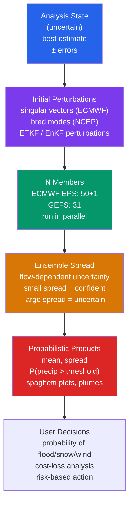

# 🎲 Ensemble Forecasting and Uncertainty

> [!abstract] TL;DR
> **Ensemble forecasting** runs *many* numerical weather prediction (NWP) simulations from slightly **perturbed initial conditions** (and/or **perturbed model physics**) to sample the forecast's own uncertainty. The **spread** of the ensemble *is* the forecast confidence: **small spread → high confidence**, **large spread → low confidence** — and crucially the spread is **flow-dependent** (some weather patterns are far more predictable than others). Operational systems include **ECMWF's EPS** (50 perturbed + 1 control member) and **NCEP's GEFS** (31 members). The **ensemble mean beats the single deterministic forecast in RMSE from ~day 4 onward** in the extratropics, and the ensemble's real payoff is **probabilistic products** ("70% chance of >25 mm rain in 24 h", spaghetti plots, plume diagrams, the **Extreme Forecast Index**) that let decision-makers do proper **cost–loss** risk analysis. Initial perturbations are chosen to grow fast — **singular vectors** (ECMWF), **bred vectors** (NCEP), and the **Ensemble Transform Kalman Filter (ETKF/EnKF)**; model error is sampled with **stochastic physics** (**SPPT, SKEB**) and **multi-model** grand ensembles (**TIGGE**). Calibration is judged with **rank histograms (Talagrand)** and scored with the **CRPS**. The whole enterprise exists because the atmosphere is **chaotic** (Lorenz 1963): tiny initial errors grow exponentially, so a single "best" trajectory is meaningless beyond a few days.

---

## Intuition — analogy FIRST

Imagine you are trying to predict where a **leaf dropped into a turbulent mountain stream** will end up a minute from now. Drop **one** leaf and you get **one** answer — but if you dropped it a centimetre to the left it would have caught a different eddy and gone somewhere completely different. A single leaf tells you nothing about how *confident* you should be. So instead you drop **fifty leaves**, all within a centimetre of each other, and watch. If they all pile up in the same backwater downstream, you can bet on that spot. If they scatter across the whole stream, the honest answer is "I don't know — anywhere in this zone." **The scatter of the leaves is your uncertainty, measured rather than guessed.**

That is exactly ensemble forecasting. We never know today's atmosphere perfectly — the **analysis** has observation gaps and instrument errors. So instead of asking the sharp, unanswerable question *"what **is** the temperature at 2 pm tomorrow?"*, we ask the honest one: *"what is the **distribution** of temperatures consistent with what we know today?"*. We run the weather model many times — a **weather Monte Carlo** — each from a slightly different but equally plausible starting point, and we read off where the members go. When they agree, the forecast is trustworthy; when they diverge, the atmosphere is telling us it is in an unpredictable mood. **The ensemble is a forecast that is honest about its own confidence.**

---

## How It Works

The atmosphere is a **chaotic** dynamical system: **Edward Lorenz (1963)** discovered, while truncating a convection model, that trajectories starting from **indistinguishably close** initial states diverge **exponentially** — the "butterfly effect". This is not a defect of the models; it is a property of the fluid. It sets a hard **predictability limit** (~2 weeks for individual synoptic systems) and, more importantly, means a *single* deterministic forecast is a **sample of one** from a probability distribution we actually care about. Ensemble forecasting samples that distribution deliberately.



**Step 1 — start from the uncertain analysis.** Data assimilation (see [[Numerical_Weather_Prediction]]) blends observations with a short-range forecast to produce the **analysis**, the best single estimate of the current state. But it carries **analysis error** with a known covariance structure. The ensemble's job is to translate that initial uncertainty into forecast uncertainty.

**Step 2 — choose perturbations that matter.** You cannot afford to perturb randomly in a billion-dimensional state space; random perturbations mostly **decay**. You want the directions that will **grow** and dominate the forecast error, and you want to span them with only a few dozen members. Three families of methods do this:

- **Bred vectors (NCEP).** *Breeding* is cheap and nonlinear: add a random perturbation, run the model a short time, **rescale** it back to a small amplitude, and repeat over successive cycles. The perturbation naturally aligns with the **fastest-growing directions of the recent flow** — the leading **Lyapunov vectors** of the actual trajectory.
- **Singular vectors (ECMWF, classic EPS).** The initial perturbations $\delta_0$ that **maximize growth** over a finite optimization interval $T$ (typically 48 h), measured in a **total-energy norm**. Formally the leading singular vectors of the tangent-linear propagator $\mathbf{M}$, found by solving a **generalized eigenvalue problem** with the **adjoint** model $\mathbf{M}^{\!*}$. They capture optimally-growing structures even if they are not yet growing at initial time — powerful for **baroclinic** development.
- **ETKF / EnKF perturbations.** The **Ensemble Transform Kalman Filter** takes the **analysis ensemble** produced by an ensemble Kalman filter and transforms it so its spread matches the analysis-error covariance. This ties the ensemble's initial spread directly to the **flow-dependent uncertainty estimated during assimilation** — now the dominant approach.

**Step 3 — perturb the model itself, not just the start.** Initial-condition perturbations sample *where we are*; they do **not** sample the fact that the model's **equations are wrong** (unresolved turbulence, cloud microphysics, convection are parameterized). To represent this **model uncertainty**:

- **SPPT (Stochastically Perturbed Parameterization Tendencies):** multiply the *net* parameterization tendency at each grid point by a spatially- and temporally-**correlated random field** with mean 1, acknowledging that the parameterizations are uncertain.
- **SKEB (Stochastic Kinetic-Energy Backscatter):** inject small streamfunction perturbations to represent **upscale kinetic-energy transfer** from unresolved sub-grid scales back to the resolved flow — energy the discretized model otherwise loses.

**Step 4 — run N members in parallel and read the spread.** ECMWF's **EPS** runs **50 perturbed + 1 unperturbed control**; **GEFS** runs **31**. The **ensemble spread** (standard deviation across members at each point/time) is the forecast uncertainty, and it is **flow-dependent** — large where a jet is about to buckle or a cyclone is about to bomb, small in a stagnant ridge.

**Step 5 — turn members into probabilities.** The members are counted to produce **probabilistic products**: probability of exceeding a threshold ($P(\text{rain}>25\text{ mm})$), the **ensemble mean** and **spread**, **spaghetti plots** (one 500 hPa contour from every member overlaid — tangled = uncertain, tight = confident), **plume diagrams** (a variable's evolution for every member at one location), and the **Extreme Forecast Index (EFI)** measuring how extreme the ensemble is relative to the model's own climatology.

**Step 6 — decisions under uncertainty.** A probability plugs directly into a **cost–loss** decision model: protect against an event whenever $P > C/L$ (cost of protection over loss avoided). This is why a calibrated 70% is *operationally more valuable* than a confident-sounding single number that is silently wrong.

**The spread–skill relationship (the whole point).** For a **perfectly reliable** ensemble, the truth is statistically **indistinguishable** from a randomly drawn member. A direct consequence is that **the ensemble spread should equal the RMSE of the ensemble mean** (in expectation over many cases). Too little spread → the ensemble is **overconfident** (under-dispersive); too much → **under-confident**. This diagnostic drives ensemble design and is exactly what the code demo below shows for the Lorenz system.

---

## Key Concepts / Details

### Secondary Level

- **Why one forecast is not enough.** We never know today's weather *perfectly*, and the atmosphere is chaotic — tiny errors grow. One model run is like one guess. Run the model **many** times from slightly different starts and you see the **range** of what could happen.
- **Spread = confidence.** If all the runs (**members**) agree, we are **confident**. If they scatter, we are **not**. Forecasters literally watch how tightly the members cluster.
- **Probability of precipitation.** *"70% chance of rain over 25 mm in the next 24 hours"* means: of all the equally-plausible members, **about 7 in 10** produced that much rain. It is not "70% of the area" and not "70% of the time" — it is **how many members agreed**.
- **Spaghetti plots.** Overlay one weather contour (say the 500 hPa height that steers storms) from **every** member on one map. Tangled like spaghetti → the pattern is uncertain days out; nearly on top of each other → high confidence.
- **Hurricane track "cone".** The familiar **cone of uncertainty** shows the likely *track* of a storm's center — but it is drawn from **historical average track errors**, not the day's ensemble, and it says **nothing** about how wide the damaging winds and rain reach. Hazards routinely extend **far outside** the cone.
- **Why confidence changes day to day.** Some weather regimes (a locked-in blocking high) are very predictable — all models agree a week out. Others (a rapidly deepening coastal storm) are on a knife-edge, and the members fly apart. The ensemble **tells you which day you are having**.

### Undergraduate Level

**Ensemble design is a sampling problem.** With only ~30–50 members you must **efficiently sample** the growing directions of forecast error in a state space of $\sim10^9$ variables. Random perturbations waste members on **decaying** modes. Hence the three perturbation philosophies:

- **Bred vectors (breeding).** Iterate: perturb → integrate a short cycle → **rescale to a fixed small norm** → repeat. Nonlinear, cheap, and it converges onto the **leading local Lyapunov vectors** of the *actual* trajectory. Downsides: members can collapse onto the *same* fastest-growing direction (lack of orthogonality).
- **Singular vectors.** Seek the $\delta_0$ maximizing the growth ratio $\|\mathbf{M}\,\delta_0\|_E / \|\delta_0\|_E$ over an interval $T$, in a chosen (energy) norm. This is a **generalized eigenvalue problem** solved with the **tangent-linear and adjoint** models. SVs give an **orthogonal**, optimally-growing set, and can flag structures that are *not yet* amplifying at $t=0$ but will dominate by $T$. Cost: adjoint integrations are expensive; result depends on the **norm** and **optimization time** chosen.
- **ETKF / EnKF.** Use the **analysis ensemble** from an ensemble Kalman filter as the initial perturbations, transformed so the ensemble covariance matches the estimated **analysis-error covariance**. Advantage: the initial spread is **consistent with the assimilation** and **flow-dependent** by construction.

**Reliability (calibration).** An ensemble is **reliable** if its stated probabilities match observed frequencies: when it says **70%**, the event should occur **~70%** of the time over many such forecasts. Reliability is a property of the *system over many cases*, not of any single forecast.

**Rank histogram (Talagrand diagram).** For each verification, rank the observation among the $N$ sorted members, giving $N+1$ possible bins; accumulate over many cases. A well-calibrated ensemble is **flat** (the truth is equally likely to fall in any interval). A **U-shape** means the truth too often lands at the extremes → **under-dispersive / overconfident** (spread too small). A **dome (∩) shape** means **over-dispersive**. A **sloped** histogram signals a **bias** in the ensemble mean.

**Ensemble mean vs deterministic.** The **ensemble mean** is a *nonlinear average* that filters out the unpredictable, small-scale, member-to-member differences while retaining the predictable signal. In the extratropics its **RMSE beats the single high-resolution deterministic run from about day 4 onward**, because by then error growth has erased the deterministic forecast's higher-resolution advantage and the averaging suppresses the now-unpredictable detail. (Caveat: the mean **smooths extremes** — see Pitfalls.)

**Operational systems.** **ECMWF EPS**: **50 perturbed + 1 control**, coupled ocean since 2016, run to 15 days; **extended range** (weeks 2–6) uses a **~100-member** configuration exploiting **MJO/ENSO** signals. **NCEP GEFS**: **31 members**. **UK Met Office MOGREPS**. These form the backbone of operational probabilistic guidance.

### Graduate Level

**Linear error growth and singular vectors.** For a small initial error $\delta_0$, tangent-linear dynamics give $\delta(t) = \mathbf{M}(t_0,t)\,\delta_0$, where $\mathbf{M}$ is the (time-dependent) **propagator**. Perturbation growth in a norm defined by SPD matrix $\mathbf{E}$ is

$$
\frac{\|\delta(t)\|_E^2}{\|\delta_0\|_E^2}
= \frac{\delta_0^{\mathsf T}\,\mathbf{M}^{\mathsf T}\mathbf{E}\,\mathbf{M}\,\delta_0}{\delta_0^{\mathsf T}\mathbf{E}\,\delta_0}.
$$

Maximizing over $\delta_0$ is the **generalized eigenvalue problem** $\mathbf{M}^{\mathsf T}\mathbf{E}\,\mathbf{M}\,\delta_0 = \lambda\,\mathbf{E}\,\delta_0$; the leading **singular vectors** are the directions of fastest growth, with singular values $\sigma_i=\sqrt{\lambda_i}$. Evaluating $\mathbf{M}^{\mathsf T}(=\mathbf{M}^{\!*})$ requires the **adjoint model**. **Bred vectors**, by contrast, approximate the leading **Lyapunov vectors**, whose long-time average growth rates are the **Lyapunov exponents** $\lambda_L$; the leading exponent sets the intrinsic $e$-folding time of forecast error ($\sim1.5$ days for synoptic scales, giving the ~2-week limit).

**Model-uncertainty schemes.**
- **SPPT** multiplies the total physics tendency $\mathbf{P}$ at each point by $(1+\mu\,r(\mathbf{x},t))$, where $r$ is a **spatially and temporally correlated Gaussian random field** (mean 0, prescribed length/time scales, tapered near the surface and top). It represents the *random uncertainty* of the parameterization as a whole. Limitations: it is **multiplicative and grid-column-local**, does **not conserve** energy/moisture exactly, cannot represent **structural/systematic** model error (a wrong scheme is wrong in every member), and its tuning (amplitude, correlation scales) is largely empirical.
- **SKEB** adds a stochastic streamfunction forcing to inject kinetic energy at the smallest resolved scales, mimicking **upscale energy backscatter** lost by numerical dissipation — targeting the model's known **under-dispersion** in the upper troposphere.

**Multi-model / grand ensembles.** **TIGGE** (THORPEX Interactive Grand Global Ensemble) archives ensembles from **ECMWF, NCEP, UK Met Office, JMA, and others** (~10 centres). Combining them samples **structural model error** — different dynamical cores and parameterizations — which single-model ensembles cannot. Multi-model ensembles are typically **more reliable** than any component, precisely because members disagree for the *right* reasons.

**CRPS (Continuous Ranked Probability Score).** The workhorse probabilistic score, a **generalization of MAE** to full predictive distributions. For forecast CDF $F$ and observation $y$,

$$
\mathrm{CRPS}(F,y)=\int_{-\infty}^{\infty}\big(F(x)-\mathbb{1}\{x\ge y\}\big)^2\,dx
= \mathbb{E}\,|X-y| - \tfrac12\,\mathbb{E}\,|X-X'|,
$$

where $X,X'$ are independent draws from $F$ (i.e. two ensemble members). Lower is better; in the deterministic limit it reduces to $|X-y|$, so ensembles and single forecasts are comparable on one scale. The **CRPS decomposes** into **reliability − resolution + uncertainty** (analogous to the Brier-score decomposition), separating *calibration* error from *sharpness/discrimination* skill.

**Post-processing (ensemble MOS).** Raw ensembles are usually **under-dispersive and biased**, so operational products are **statistically post-processed**: **Ensemble Model Output Statistics (EMOS / nonhomogeneous Gaussian regression)** and **Bayesian Model Averaging (BMA)** recalibrate the mean and spread against past forecast–observation pairs, materially improving reliability and CRPS.

**Extreme Forecast Index (EFI).** ECMWF's EFI integrates the **difference between the ensemble CDF and the model-climate CDF**, yielding a $[-1,1]$ measure of how *unusual* the forecast is **relative to the model's own climatology** — a bias-robust early-warning signal for extremes that needs no absolute-threshold calibration.

**Sub-seasonal to seasonal (S2S).** Beyond the ~2-week deterministic limit for individual systems, predictability re-emerges from **slowly varying boundary forcings** — **ENSO** SSTs, the **MJO**, soil moisture, sea ice, stratospheric state — sampled by large ensembles (see [[Ocean_Atmosphere_Coupling_and_ENSO]]). **Seasonal forecasting** is inherently ensemble-and-probabilistic, sharing methodology with [[Climate_Models_and_Projections]] but initialized from observed conditions.

---

## Code Demo

```python
# Ensemble spread and forecast-skill degradation in the Lorenz (1963) system.
#
# Chaos in miniature: we launch a 20-member ensemble from ALMOST the same point
# on the Lorenz attractor (tiny random perturbations, sigma = 0.01) alongside an
# unperturbed "truth" run. We then track, versus lead time:
#   (a) ENSEMBLE SPREAD  -- RMS standard deviation across members;
#   (b) RMSE of the ENSEMBLE MEAN vs truth.
# The textbook results:
#   * both grow ~EXPONENTIALLY (the butterfly effect) then SATURATE at the
#     attractor's climatological size;
#   * spread ~= RMSE during the growth phase  ->  a WELL-CALIBRATED ensemble.
import numpy as np
import matplotlib.pyplot as plt

# --- Lorenz (1963) parameters (classic chaotic regime) ---
SIGMA, RHO, BETA = 10.0, 28.0, 8.0 / 3.0

def lorenz(s):
    """Vectorized Lorenz tendencies; s[..., 0:3] = (x, y, z)."""
    x, y, z = s[..., 0], s[..., 1], s[..., 2]
    return np.stack([SIGMA * (y - x),
                     x * (RHO - z) - y,
                     x * y - BETA * z], axis=-1)

def rk4(s, dt):
    k1 = lorenz(s)
    k2 = lorenz(s + 0.5 * dt * k1)
    k3 = lorenz(s + 0.5 * dt * k2)
    k4 = lorenz(s + dt * k3)
    return s + (dt / 6.0) * (k1 + 2 * k2 + 2 * k3 + k4)

rng = np.random.default_rng(0)
dt  = 0.01

# --- spin the "truth" onto the attractor (discard the transient) ---
truth = np.array([1.0, 1.0, 1.0])
for _ in range(3000):
    truth = rk4(truth, dt)

# --- build the ensemble: N members, tiny initial perturbations ---
N, PERT = 20, 0.01
ens = truth + PERT * rng.standard_normal((N, 3))

# --- integrate truth + ensemble forward, diagnosing spread and error ---
NSTEPS = 900
t      = np.arange(NSTEPS + 1) * dt
spread = np.empty(NSTEPS + 1)   # RMS ensemble std over the 3 state variables
rmse   = np.empty(NSTEPS + 1)   # RMS error of the ensemble mean vs truth

for k in range(NSTEPS + 1):
    ens_mean  = ens.mean(axis=0)
    spread[k] = np.sqrt(ens.var(axis=0, ddof=1).mean())      # ensemble spread
    rmse[k]   = np.sqrt(((ens_mean - truth) ** 2).mean())    # ensemble-mean error
    truth = rk4(truth, dt)
    ens   = rk4(ens, dt)

# --- spread/skill ratio over the exponential-growth window (should be ~1) ---
grow  = (t > 0.5) & (t < 4.0)
ratio = spread[grow].mean() / rmse[grow].mean()

# --- plot ---
fig, ax = plt.subplots(figsize=(10, 5))
ax.semilogy(t, spread, color='#d97706', lw=2.0, label='ensemble spread (std of members)')
ax.semilogy(t, rmse,   color='#dc2626', lw=2.0, ls='--', label='RMSE of ensemble mean vs truth')
ax.set_xlabel('forecast lead time (Lorenz time units)')
ax.set_ylabel('magnitude (log scale)')
ax.set_title('Lorenz-63 ensemble: exponential error growth, spread ≈ skill')
ax.legend(loc='lower right'); ax.grid(alpha=0.3, which='both')
plt.tight_layout(); plt.savefig('lorenz_ensemble_spread.png', dpi=120)

print(f"initial spread          : {spread[0]:.4f}")
print(f"saturated spread (~t>7) : {spread[-50:].mean():.2f}")
print(f"spread/RMSE ratio (grow): {ratio:.2f}  (~1.0 => well-calibrated ensemble)")
print("Saved figure to lorenz_ensemble_spread.png")
```

On the log axis, both curves are **straight lines** during the growth phase — the signature of **exponential** error growth at the leading Lyapunov exponent — before **flattening (saturating)** once the ensemble has filled the attractor and predictability is lost (the ~2-week wall, in miniature). The printed **spread/RMSE ratio ≈ 1** demonstrates the central diagnostic: a well-constructed ensemble's **spread measures its own error**. Shrink `PERT` and the curves start lower but converge to the *same* saturated spread on the *same* timescale — predictability is bounded by the dynamics, not by how good your initial guess is.

---

## Real-World Notes

- **Windstorm Lothar, 26 December 1999.** ECMWF's **deterministic** forecast badly under-predicted this devastating French/German storm (~140+ deaths, forests flattened), but the **EPS** — run a day ahead — showed a **subset of members with an explosively deepening cyclone**, i.e. a real *probability* of severe winds. Lothar became the canonical case study proving that **ensembles reveal high-impact scenarios the single forecast misses**, and it accelerated operational adoption of EPS across Europe.
- **Spaghetti plots then and now.** In the 1990s, day-7 **500 hPa spaghetti** for a given contour looked like a **hopelessly tangled plate of noodles**. By the 2020s — with better models, assimilation, and resolution — the same day-7 plots are **near-deterministic for well-predictable regimes** (locked blocking) while still fanning out for genuinely uncertain flows. The plots visually encode *how predictable this particular day is*.
- **The hurricane "cone of uncertainty" is widely misread.** It is built from the **NHC's historical average track errors** over the past 5 seasons — **not** from the current ensemble spread, and it depicts only the **center's likely path**, saying nothing about **intensity** or how far damaging **winds, surge, and rain** extend. The public repeatedly (and dangerously) reads "safe if I'm outside the cone", which is false.
- **TIGGE is the world's largest open forecast archive.** The THORPEX Interactive Grand Global Ensemble holds on the order of **tens of millions** of ensemble forecasts from ~10 global centres, freely accessible for research — the empirical foundation for most modern work on multi-model combination, calibration, and predictability.
- **S2S skill beyond the Lorenz limit.** Individual synoptic systems are unpredictable past ~2 weeks, yet **week 2–4** ensemble forecasts show real skill by riding **slow boundary forcings** — the **MJO** and **ENSO** state in particular (see [[Ocean_Atmosphere_Coupling_and_ENSO]]). The ensemble no longer predicts *a* storm, but the *odds* of a wet/cold/stormy period — genuinely useful to water, energy, and agriculture planners.

---

## Common Pitfalls

1. **Using the ensemble mean for extremes.** The ensemble mean is the best *single-number* forecast (lowest RMSE), but averaging **smooths out the tails** — it will systematically **under-predict peak rainfall, peak gusts, and minimum pressure**. For extremes, interrogate the **individual members** (or high percentiles / the EFI), never the mean.
2. **Treating the spread as a frequentist confidence interval.** The ensemble is a **finite sample from a probability distribution**, not a $\pm2\sigma$ error bar. Interpret the **whole distribution** (percentiles, exceedance probabilities); a Gaussian-looking spread can hide a **bimodal** ("either it hits us or it doesn't") forecast that the mean±spread completely misrepresents.
3. **Equating "well-spread" with "good forecast".** A **calibrated** ensemble represents uncertainty *honestly*; it does **not** guarantee the truth is near the mean on any given day. You can be perfectly calibrated over the long run and still have the truth fall in the extreme tail of a specific hard case. Calibration is a property of the *system over many cases*, not a promise about *this* forecast.
4. **Misreading the hurricane cone.** As above: it shows **track-center** uncertainty from **climatological error statistics**, not the day's ensemble, and **excludes intensity and hazard footprint**. Communicating it as "the danger zone" is a persistent, life-threatening error.
5. **Assuming initial-condition perturbations are enough.** Perturbing only the *starting state* ignores that the **model equations are wrong**. Single-model ensembles are chronically **under-dispersive** as a result. **Multi-model** ensembles (and **stochastic physics**, SPPT/SKEB) do better because they also sample **structural/model error** — different parameterizations failing in different ways — which is why grand ensembles like TIGGE are more reliable.

---

## Related Concepts

- [[_MOC_Weather_Forecasting]] — section map for the weather-forecasting unit (uplink).
- [[Numerical_Weather_Prediction]] — the deterministic model + data assimilation engine that every ensemble member runs; ensembles are NWP repeated from perturbed states.
- [[Synoptic_Meteorology_and_Weather_Maps]] — the charts (spaghetti, plumes, probability fields) on which ensemble output is analysed and communicated.
- [[Tropical_Cyclones_and_Hurricanes]] — track and intensity forecasting, the ensemble spread of tracks, and the (much-misunderstood) cone of uncertainty.
- [[Climate_Models_and_Projections]] — the same ensemble philosophy extended to climate: initial-condition *and* multi-model (CMIP) ensembles for projection uncertainty.
- [[Ocean_Atmosphere_Coupling_and_ENSO]] — the slow boundary forcing (SST memory) that gives ensembles skill on seasonal and S2S timescales beyond the Lorenz limit.
- [[_MOC_Physics_Master]] — parent physics vault for the underlying fluid dynamics, chaos, and dynamical-systems theory.
- [[Newtons_Laws_and_Kinematics]] — the deterministic equations of motion whose *sensitive dependence on initial conditions* (chaos) is precisely why a single trajectory is insufficient.
- [[_MOC_SS_Master]] — parent signals-and-systems vault for the stochastic-process and spectral tools behind SPPT/SKEB random fields and verification.
- [[Fourier_Transform]] — the spectral representation used to build spatially-correlated stochastic perturbation fields and to analyse error growth across scales.

---

## Review Questions

- **Secondary:** Why do weather forecasters run *many* model simulations instead of a single "best" one? What does the **spread** of an ensemble tell you about forecast confidence, and why does that confidence change from day to day? Put into your own words what *"70% probability of precipitation greater than 25 mm in the next 24 hours"* actually means (and what it does **not** mean).
- **Undergraduate:** Explain the difference between **bred vectors** and **singular vectors** as initial-perturbation methods — what does each one optimize, and what are the trade-offs? What is a **rank histogram (Talagrand diagram)**, and what do a **flat** vs a **U-shaped** histogram tell you about an ensemble's calibration? Why does the **ensemble mean** out-perform the single deterministic forecast beyond about **day 4** in the extratropics — and why is that same averaging a *liability* when forecasting extremes?
- **Graduate:** Derive/justify the **"perfect ensemble" calibration condition** — explain why the **ensemble spread should equal the RMSE of the ensemble mean** when the ensemble is reliable (start from the truth being statistically indistinguishable from a member). Define the **CRPS** and state its **reliability–resolution–uncertainty** decomposition. How does **SPPT** represent *model* uncertainty in a way that is **distinct** from initial-condition perturbations, and what are its principal **limitations** (conservation, structural error, tuning)?

---

## Sources

- Buizza, R., Houtekamer, P. L., Toth, Z., Pellerin, G., Wei, M. & Zhu, Y. (2005) — "A comparison of the ECMWF, MSC, and NCEP Global Ensemble Prediction Systems," *Mon. Wea. Rev.*, **133**, 1076–1097. Side-by-side of the three operational systems' perturbation strategies and skill.
- Palmer, T. N. (2002) — "The economic value of ensemble forecasts as a tool for risk assessment: From days to decades," *Q. J. R. Meteorol. Soc.*, **128**, 747–774. Cost–loss framing and the economic case for probabilistic forecasts.
- Wilks, D. S. (2011) — *Statistical Methods in the Atmospheric Sciences* (3rd ed., Academic Press). Reference for rank histograms, reliability, Brier/CRPS scores, and ensemble post-processing.
- Lorenz, E. N. (1963) — "Deterministic Nonperiodic Flow," *J. Atmos. Sci.*, **20**, 130–141. The origin of atmospheric chaos and the intrinsic predictability limit.
- Leutbecher, M. & Palmer, T. N. (2008) — "Ensemble forecasting," *J. Comput. Phys.*, **227**, 3515–3539. Comprehensive review of singular vectors, breeding, EnKF, stochastic physics, and verification.

---

#Meteorology #EnsembleForecasting #ProbabilisticForecast #ForecastUncertainty #NWP
