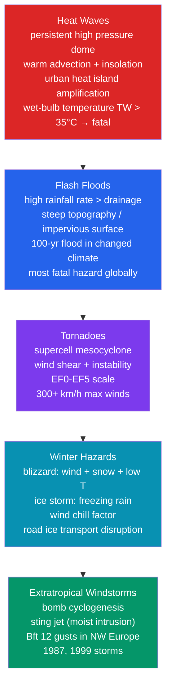

# 🌡️ Extreme Weather and Meteorological Hazards

> [!abstract] TL;DR
> **Extreme weather events** are those lying in the *tail* of meteorological probability distributions — rare states of the atmosphere that cause outsized societal impact through destructive **winds, flooding, heat, ice, or lightning**. The major hazard families are **heat waves** (the largest weather-related mortality in developed countries), **flash floods** (the most fatal weather hazard globally), **tornadoes** (rotating supercell thunderstorms rated EF0–EF5), **blizzards and ice storms**, **extratropical windstorms** (bomb cyclones with sting jets), **lightning**, and **fog**. Modern **extreme-event attribution science** quantifies the degree to which anthropogenic climate change altered the *probability* of a specific event — it does not claim climate change "caused" it. Under warming, the distribution of extremes is **shifting rightward** (warmer tails) and precipitation extremes are **intensifying** at roughly the **Clausius–Clapeyron rate of ~7 % per °C**. The statistical backbone is **extreme value theory** — the **Generalized Extreme Value (GEV)** distribution for block maxima and the **Generalized Pareto Distribution (GPD)** for peaks over a threshold — which turns a short record into **T-year return levels**.

---

## Intuition — analogy FIRST

Picture the weather of a place as a **bell curve of daily states**. Most days sit near the fat middle — pleasant, forgettable, "average." But every so often the atmosphere wanders out into the thin **tails** of that curve: a day so hot, so wet, so windy, or so icy that it breaks records and breaks things. **Extreme weather is life in the tails.** The rarer the tail, the bigger the impact — and the fewer times in a human lifetime you ever see it, which is exactly why we are so bad at preparing for it.

Now slide the whole bell curve to the right by a couple of degrees — which is precisely what a warming climate does. A temperature that used to sit far out in the tail, a **1-in-50-year** heat wave, now sits much closer to the hump: it becomes a **1-in-5-year** event. A small shift of the *average* produces a **huge multiplication** of the *extremes*, because the tail is where a little translation changes probabilities by an order of magnitude.

Two more everyday pictures round out the zoo. A **flash flood** is a **bathtub with the drain too small**: if rain falls faster than the ground and the storm drains can swallow it, water simply pools, then races downhill through valleys and streets, gathering lethal speed. A **windstorm** is the atmosphere briefly **cashing in the kinetic energy of the jet stream** — a river of 200+ km/h wind that normally stays 10 km overhead — and bringing a slice of it down to roof height, with predictably destructive consequences.

---

## How It Works

Extreme weather is not one phenomenon but a **family of tail events**, each with its own physical trigger yet all sharing the same statistical signature: they live where the probability density is small and the impact is large. The diagram groups the major hazard categories with their generating mechanisms; the sections below then treat each in turn, and close with the **extreme value statistics** that make "how rare is this?" a quantitative question.



### Heat waves

A **heat wave** is a prolonged period of anomalously hot weather, typically defined as temperatures exceeding a **local climatological percentile** (e.g. the 90th or 95th) for **three or more consecutive days** — the definition is intrinsically *relative to place*, because 35 °C is routine in Phoenix but deadly in Paris where homes lack air-conditioning. The classic driver is a **persistent upper-level ridge / blocking high** — a "heat dome" — under which **subsidence suppresses cloud and convection**, **insolation** bakes the surface unopposed, and **warm-air advection** and dry, over-heated soils (which stop spending energy on evaporation and instead pour it into sensible heat) reinforce the anomaly day after day. **Urban heat islands** add several degrees at night, denying cities the cooling that keeps bodies alive. The physiological killer is not dry-bulb temperature alone but the combination of **heat and humidity**: the **wet-bulb temperature** $T_w$ measures how cool a body can get by evaporating sweat, and once $T_w$ approaches **35 °C**, no amount of sweating can shed metabolic heat — the body's core temperature rises inexorably. The **2003 European heat wave killed an estimated 70,000 people**, more than any other single weather disaster in modern European history.

### Flash floods

A **flash flood** develops within **minutes to hours** when the **rainfall rate exceeds the ground's infiltration capacity and the drainage network's carrying capacity**. Three ingredients aggravate it: **steep topography** (which funnels and accelerates runoff), **impervious surfaces** (urban concrete, or wildfire **burn scars** whose hydrophobic soils shed water like pavement), and **stationary or "training" convection** (storms that repeatedly cross the same ground). Runoff can be estimated with the **Rational Formula** $Q = C_R\, i\, A$ (peak discharge from runoff coefficient, rainfall intensity, and catchment area) and routed downstream with **Manning's equation**. Flash floods are the **most fatal weather hazard on Earth**, and most deaths occur in **vehicles**, where as little as 30 cm of moving water can float a car. They also spawn **compound cascades** — a rainstorm on a fresh **fire scar** produces a **debris flow** (see [[Mass_Wasting_and_Slope_Stability]]) far more destructive than clear water.

### Tornadoes

A **tornado** is a violently rotating column of air connecting a cumuliform cloud base to the ground. The most intense are born from **supercells**, whose rotating updraft — the **mesocyclone** — concentrates spin extracted from environmental **vertical wind shear**, while the **rear-flank downdraft** helps drag rotation to the surface where **stretching** amplifies it (the figure-skater effect). The two environmental ingredients are **instability (CAPE)** and **shear**, the latter quantified by **storm-relative helicity (SRH)** and visualized by the curvature of the **hodograph**. Intensity is rated *after the fact* on the **Enhanced Fujita (EF) scale**, EF0 (29–38 m/s) to EF5 (≥ 89 m/s, > 322 km/h), from calibrated **damage indicators** — because direct wind measurements inside a tornado core are extraordinarily rare. The U.S. **Tornado Alley** and **Dixie Alley** see a spring peak (**May–June**), and long-track violent tornadoes carve **damage paths** tens of kilometres long. Crucially, the sheltering advice differs from hurricanes: for a **tornado** you go to the **lowest, most interior room** immediately (minutes of warning); for a **hurricane** you often **evacuate the coast days ahead** to escape storm surge.

### Blizzards and ice storms

A **blizzard** is defined not by snowfall total but by **wind ≥ 56 km/h with visibility reduced below 400 m by blowing/falling snow for ≥ 3 hours**, combined with low temperature; the **wind-chill factor** captures the accelerated convective heat loss from exposed skin. The more insidious winter hazard is the **ice storm**. When snow falls through a **warm melting layer aloft** and then re-enters a shallow **sub-freezing surface layer**, it becomes **supercooled freezing rain** that freezes on contact into **glaze ice**, coating power lines and trees until they snap under the load. On roads, a nearly invisible film of **black ice** turns transport into a lethal lottery. (Contrast **sleet** — ice pellets that refroze *in the air* before landing, harmless underfoot.)

### Extratropical windstorms

Mid-latitude **windstorms** are the destructive extreme of ordinary [[Fronts_and_Extratropical_Cyclones]]. The most dangerous undergo **explosive cyclogenesis** — a **"bomb"** cyclone whose central pressure falls **≥ 24 hPa in 24 hours** (latitude-adjusted) — tapping the **jet stream** and strong baroclinicity for energy. Some produce a **sting jet**: a narrow, descending, evaporatively accelerated air stream on the cyclone's poleward flank that brings a slug of the strongest winds (Beaufort 12, hurricane-force gusts) briefly to the surface over northwest Europe. The **October 1987 storm** and the **December 1999 "Lothar" and "Martin"** storms are the archetypes.

### Lightning and fog

**Lightning** results from **charge separation** in convective clouds (ice–graupel collisions in the mixed-phase region), building a potential difference that discharges through a **stepped leader** followed by a brilliant **return stroke** — the visible flash. **Flash density** (strikes per km² per year) tracks convective activity and scales loosely with **CAPE**; lightning kills tens of people per year even in well-warned nations. **Fog** — visibility below 1 km from suspended droplets — comes in flavours by mechanism: **radiation fog** (nocturnal ground cooling), **advection fog** (warm moist air over a cold surface), and **upslope fog** (adiabatic cooling of air forced up terrain); it is a leading cause of multi-vehicle pile-ups and aviation delay.

### Extreme value statistics and attribution

To ask *how rare* an event is, meteorology borrows **extreme value theory**. Taking **block maxima** (e.g. the hottest day of each year) yields, in the limit, the **Generalized Extreme Value (GEV)** distribution; the alternative **peaks-over-threshold (POT)** approach yields the **Generalized Pareto Distribution (GPD)**. A **T-year event** is one whose **annual exceedance probability is $1/T$** — its **return level**. **Extreme-event attribution** compares the probability of the event in the actual (warmed) world, $P_1$, with a counterfactual pre-industrial world, $P_0$, via the **Fraction of Attributable Risk**, $\mathrm{FAR} = 1 - P_0/P_1$. Because climate is **non-stationary**, the distribution's parameters are made functions of a covariate (e.g. global mean temperature), and **climate-model large ensembles** supply the counterfactual world we cannot observe.

---

## Key Concepts / Details

### Secondary Level

- **What makes weather "extreme."** An event is extreme when it lands far out in the **tail** of what is normal *for that place and season* and causes serious impact — record heat, record rain, damaging wind, crippling ice. "Extreme" is defined **relative to the local climate**, not by an absolute number.
- **Which hazards kill the most.** In wealthy countries, **heat waves** quietly cause the largest weather death tolls (the elderly, indoors, at night). **Globally, flash floods are the deadliest** weather hazard, and most flood deaths happen in **cars** — *"Turn Around, Don't Drown."*
- **The 2003 European heat wave** killed roughly **70,000 people** — a hazard with no wind and no flood, just relentless heat and humidity.
- **Tornado ratings (EF scale).** Tornadoes are rated **EF0 (weakest) to EF5 (total destruction)** from the **damage they leave behind**, because we almost never measure the wind directly.
- **Shelter differs by hazard.** For a **tornado**, get to the **lowest, most interior room right now** — you have minutes. For a **hurricane**, the danger is **storm surge**, so authorities order **evacuation days in advance**. Same "big storm" instinct, opposite correct action.
- **Historic events to know.** 2003 European heat wave (~70,000 dead); 2005 **Hurricane Katrina** (storm-surge flooding of New Orleans); 2011 **Joplin, MO** EF5 tornado (158 dead); 2013 **Moore, OK** EF5 tornado.
- **Warnings save lives.** Doppler radar, satellites, and **warning systems** have dramatically cut tornado and flood deaths — but only if people **receive and act on** the warning in time.

### Undergraduate Level

- **Heat index vs wet-bulb temperature.** The **heat index** (apparent temperature) combines air temperature and humidity into a "feels-like" value for **shaded** conditions. The physiologically fundamental quantity is the **wet-bulb temperature** $T_w$ — the lowest temperature reachable by evaporative cooling. When **$T_w \ge 35\,°\mathrm{C}$**, a resting human body **cannot shed metabolic heat by any means**; core temperature rises and death follows within hours. Such conditions are still rare but have been briefly recorded in the Persian Gulf and South Asia.
- **Heat wave definitions.** The **WMO** working definition: daily maximum exceeding the **climatological daily maximum by ≥ 5 °C for ≥ 5 consecutive days**. Many nations use **percentile-based** thresholds (e.g. > local 90th/95th percentile for 3+ days) so the definition adapts to the local climate.
- **Flash-flood runoff — the Rational Formula.** Peak discharge $Q = C_R\, i\, A$, where $C_R$ is the **runoff coefficient** (near 0 for forest, near 0.95 for asphalt or burn scar), $i$ the **rainfall intensity**, and $A$ the **catchment area**. Urbanization and wildfire raise $C_R$, converting a survivable rain into a flash flood.
- **The 100-year flood.** The **100-year flood** is the discharge with a **1 % annual exceedance probability** — *not* an event that occurs once per century. The **floodplain** is the land it inundates, and building codes and insurance are keyed to it.
- **Tornado environment.** Tornadic supercells typically require **SRH ≳ 150 m²/s²** and **CAPE ≳ 1000 J/kg**, with strong low-level shear. On the **EF scale**, EF0 = 29–38 m/s up to **EF5 ≥ 89 m/s**. Only a minority of supercells produce tornadoes — the **RFD thermodynamics** and low-level shear decide.
- **Freezing rain vs sleet.** Both start as snow aloft. If the **melting layer is deep** and the **surface cold layer shallow**, drops stay liquid but **supercooled**, freezing on contact as **glaze (freezing rain)**. If the surface cold layer is **deep**, they refreeze in the air into **sleet** (ice pellets). A vertical-profile difference of a few hundred metres separates a nuisance from a grid-collapsing ice storm.
- **Wind scales and building codes.** The **Beaufort scale** runs to **Force 12** (hurricane force, ≥ 32.7 m/s). Structural design uses a **gust factor** (peak-to-mean wind ratio) and a **return-period design wind** (e.g. the 50-year gust) so that codes are explicitly probabilistic.

### Graduate Level

- **Extreme value theory — GEV.** For **block maxima** $M_n = \max(X_1,\dots,X_n)$, the **Fisher–Tippett–Gnedenko theorem** gives the limiting **GEV** distribution
  $$G(z) = \exp\!\left\{-\left[1 + \xi\,\frac{z-\mu}{\sigma}\right]^{-1/\xi}\right\},\qquad 1+\xi\frac{z-\mu}{\sigma} > 0,$$
  with **location $\mu$**, **scale $\sigma$**, and **shape $\xi$**. The shape parameter sets the tail type: **$\xi = 0$ Gumbel** (exponential tail — the limit for Normal/exponential parents), **$\xi > 0$ Fréchet** (heavy, unbounded tail), **$\xi < 0$ Weibull** (bounded upper tail). Parameters are fit by **maximum likelihood** or **L-moments** (robust for short records). *(In `scipy.stats.genextreme` the shape argument `c = −ξ`.)*
- **Peaks-over-threshold — GPD.** Rather than one maximum per block, POT keeps **all exceedances above a high threshold $u$**; by the **Pickands–Balkema–de Haan theorem** these follow a **Generalized Pareto Distribution** with the **same shape $\xi$** as the GEV. POT uses data more efficiently but requires threshold selection (mean-residual-life / parameter-stability plots) and **declustering** to preserve independence.
- **Return levels.** The **$T$-year return level** $z_T$ solves $G(z_T) = 1 - 1/T$ (for annual blocks); equivalently the annual exceedance probability is $1/T$. Uncertainty on $z_T$ grows rapidly for $T$ far beyond the record length and is quantified by the **delta method** or **profile likelihood**.
- **Non-stationarity.** In a changing climate the parameters become **time- or covariate-dependent**, e.g. a location that tracks global-mean temperature: $\mu(t) = \mu_0 + \mu_1\, \mathrm{GMT}_{\text{anom}}(t)$ (and optionally $\log\sigma(t)$ varying too). Fitting a **covariate-based GEV** and comparing models by **likelihood ratio / AIC** tests whether the extremes are genuinely shifting — the statistical engine of detection.
- **Attribution.** The change in probability is expressed as the **risk ratio** $\mathrm{RR} = P_1/P_0$ or the **Fraction of Attributable Risk** $\mathrm{FAR} = 1 - P_0/P_1$; equivalently the change in return period $\Delta(1/T)$. $P_1$ is the event's probability in the observed climate, $P_0$ in a counterfactual pre-industrial world reconstructed from **large-ensemble climate simulations**. FAR near 1 means the event was **almost entirely enabled by** the forced change.
- **Clausius–Clapeyron scaling of precipitation extremes.** Saturation vapour pressure rises with temperature per **Clausius–Clapeyron**, $\frac{d\ln e_s}{dT} \approx \frac{L_v}{R_v T^2} \approx 0.07\ \mathrm{K^{-1}}$, so a warmer atmosphere holds **~7 % more moisture per °C**. To first order, **extreme daily precipitation intensity scales at ~7 %/°C** because the heaviest events wring out a near-saturated column. **Sub-daily convective extremes** can exhibit **super-CC scaling (up to ~14 %/°C)** where latent-heat feedback intensifies the updraft, while total precipitation is instead constrained by the **surface energy budget** (~1–3 %/°C) — the reason *means* rise slowly while *extremes* rise fast.
- **Compound events.** Impact often comes from **coincident drivers**: **high temperature AND high humidity AND low wind** for peak heat stress; **storm surge AND river flood** for coastal inundation; **hot AND dry** for wildfire. Their joint tail probability is **not** the product of marginals when the drivers are **dependent** — copula-based multivariate EVT is required, and dependence itself can change under warming.
- **Severe convective storms under climate change.** The response is **non-monotone**: warming robustly **increases CAPE** (more low-level moisture and instability), but the effect on **deep-layer wind shear** is **uncertain and regionally variable** (a weakening equator-to-pole temperature gradient tends to reduce it). The product $\mathrm{CAPE}\times\mathrm{shear}$ therefore has a **complex, model-dependent** trend — one of the largest open questions in hazard projection.

---

## Python demo — GEV return levels and the effect of a +2 °C climate shift

The script builds a **50-year synthetic record of annual-maximum daily temperatures** (drawn from a Normal parent, $\mu=35\,°\mathrm{C}$, $\sigma=3\,°\mathrm{C}$, as a stand-in for a real block-maxima series), **fits a GEV** with `scipy.stats.genextreme`, and computes **return levels for 10, 50, 100, and 500-year events**. It then **shifts the distribution by +2 °C** to mimic a warmer climate and asks the key attribution question: *the present-day "1-in-50-year" heat extreme becomes a "1-in-how-many-year" event?* Because the event lives in the tail, a 2 °C translation multiplies its frequency several-fold.

```python
# GEV return levels for extreme daily temperatures, and how a +2 C warming
# shift shortens the return period of a fixed extreme. Runnable: numpy, scipy, matplotlib.
import numpy as np
import matplotlib.pyplot as plt
from scipy.stats import genextreme

rng = np.random.default_rng(42)

# --- 1. Synthetic record: 50 annual-maximum daily temperatures ---
n_years          = 50
mu_true, sig_true = 35.0, 3.0
annual_max = rng.normal(mu_true, sig_true, size=n_years)   # block maxima [C]

# --- 2. Fit a GEV distribution ---
# scipy's shape 'c' = -xi (Coles convention): c<0 Frechet, c=0 Gumbel, c>0 Weibull
c, loc, scale = genextreme.fit(annual_max)
xi = -c
print(f"Fitted GEV:  shape xi = {xi:+.3f}   loc = {loc:5.2f} C   scale = {scale:4.2f} C")

# --- 3. Return levels: a T-year event has annual exceedance prob p = 1/T ---
def return_level(T, c, loc, scale):
    return genextreme.ppf(1.0 - 1.0 / T, c, loc, scale)   # (1 - 1/T) quantile

periods = [10, 50, 100, 500]
levels  = {T: return_level(T, c, loc, scale) for T in periods}
print("\nReturn levels (present climate):")
for T in periods:
    print(f"  {T:4d}-year event :  {levels[T]:5.1f} C")

# --- 4. Climate-change shift: warm the whole distribution by +2 C ---
shift  = 2.0
loc_cc = loc + shift

z50    = levels[50]                                  # present 1-in-50-yr level
p_new  = genextreme.sf(z50, c, loc_cc, scale)        # its exceedance prob when warmed
T_new  = 1.0 / p_new
print(f"\nWith +{shift:.0f} C warming of the distribution:")
print(f"  the present 1-in-50-yr level ({z50:.1f} C) becomes a "
      f"1-in-{T_new:.1f}-yr event")
print(f"  frequency multiplier: x{50.0 / T_new:.1f}")

# --- 5. Plot both GEV densities and the fixed 50-year threshold ---
x = np.linspace(annual_max.min() - 3, annual_max.max() + 7, 500)
fig, ax = plt.subplots(figsize=(10, 6))
ax.hist(annual_max, bins=12, density=True, alpha=0.30, color="#94a3b8",
        label="synthetic annual maxima")
ax.plot(x, genextreme.pdf(x, c, loc,    scale), lw=2.5, color="#2563eb",
        label="GEV fit (present climate)")
ax.plot(x, genextreme.pdf(x, c, loc_cc, scale), lw=2.5, color="#dc2626",
        label=f"GEV shifted +{shift:.0f} C (warmer climate)")
ax.axvline(z50, color="black", ls="--", lw=1.5)
ax.text(z50, ax.get_ylim()[1] * 0.92, f"  present 1-in-50-yr = {z50:.1f} C",
        rotation=90, va="top", fontsize=9)
ax.set_xlabel("annual maximum daily temperature  [C]")
ax.set_ylabel("probability density")
ax.set_title("GEV fit to extreme temperatures: a +2 C shift turns a rare tail "
             "event into a common one")
ax.legend()
plt.tight_layout()
plt.show()
```

**What to expect.** The fit returns a shape parameter $\xi$ near zero (Normal maxima sit in the **Gumbel** domain of attraction), and the return levels climb steadily — roughly the low-to-mid 40s °C for the 500-year event. The punchline is the shift: after just **+2 °C** of warming, the event that used to occur **once in 50 years** now occurs **several times as often** (a return period of order a decade), a compact numerical illustration of why *modest mean warming produces dramatic increases in the frequency of extremes* — and the exact calculation that underpins headline attribution statements.

---

## Real-World Notes

- **The 2003 European heat wave killed an estimated 70,000 people** across the continent — more than any other weather disaster in 20th-century Europe. With little air-conditioning and a vulnerable elderly population, it reframed heat as a first-order public-health hazard and drove the creation of national **heat-health warning systems**.
- **Flash floods account for roughly 40 % of all weather-related deaths globally.** After the catastrophic **1999 Vargas (Venezuela) debris-flow disaster** (tens of thousands dead), the WMO launched the **Flash Flood Guidance System (FFGS)**, now protecting billions of people by estimating the rainfall needed to trigger flooding in small basins.
- **The 22 May 2011 Joplin, Missouri tornado** (**EF5**, ~1.6 km wide, tornado-relative winds estimated near the top of the scale) killed **158 people** — the deadliest single U.S. tornado since modern records — *despite* a 16-minute average warning lead time, exposing the "**last mile**" problem: warnings only save lives if people believe and act on them.
- **The "Great European Windstorm" of December 1999 (Lothar and Martin)** raked France and central Europe with hurricane-force gusts, caused **~€13 billion in insured losses**, and became the reference case for the destructive potential of **bomb cyclogenesis** and **sting jets** in the reinsurance industry.
- **The 2021 Pacific Northwest "heat dome"** shattered the all-time Canadian temperature record by **4.6 °C** (**49.6 °C at Lytton, BC**, which burned down the next day). Rapid attribution by **World Weather Attribution** found the event would have been **"virtually impossible" without anthropogenic climate change**, with its likelihood increased by roughly **150-fold** — a landmark demonstration of operational attribution science.

---

## Common Pitfalls

1. **Misreading the "100-year flood."** It does **not** mean the flood happens only once a century. It means a **1 % annual exceedance probability**. Over any 30-year mortgage there is a **$1 - (1-0.01)^{30} \approx 26\%$** chance of experiencing at least one "100-year flood" — and back-to-back "100-year floods" in consecutive years are perfectly possible.
2. **Treating the EF rating as a measured wind speed.** Tornado intensity on the **EF scale is inferred from observed damage** to standardized indicators, **not** from anemometer readings — direct wind measurements inside a tornado core are exceedingly rare. Two tornadoes with identical winds can be rated differently if one hits sturdy structures and the other open fields.
3. **Using the heat index outdoors in direct sun.** The **heat index** assumes shade and light wind, so it **underestimates** stress in full sun (and can misrepresent it elsewhere). For outdoor thermal-stress assessment — athletes, soldiers, laborers — the **Wet-Bulb Globe Temperature (WBGT)**, which folds in solar load and wind, is the correct metric.
4. **Believing lightning "never strikes the same place twice."** It preferentially strikes **tall, conductive, isolated objects repeatedly** — the **Empire State Building is hit ~20–25 times per year**. The proverb is exactly backwards, which matters for siting lightning protection.
5. **Overstating what attribution claims.** Extreme-event attribution does **not** assert that climate change "**caused**" a specific storm or heat wave. It quantifies how climate change **altered the probability (or intensity)** of an event of that magnitude — a statement about the *loaded dice*, not about any single roll.

---

## Related Concepts

- [[_MOC_Weather_Forecasting]] — section map for the weather-forecasting chapter of this vault; entry point to hazards, warnings, and prediction.
- [[Tropical_Cyclones_and_Hurricanes]] — the tropical hazard family (storm surge, extreme wind and rain) that parallels the extratropical windstorms and flash floods treated here.
- [[Synoptic_Meteorology_and_Weather_Maps]] — the large-scale charts on which blocking highs, bomb cyclones, and severe environments are diagnosed and warned.
- [[Thunderstorms_and_Convective_Systems]] — the convection whose CAPE, shear, and updrafts generate tornadoes, hail, downbursts, lightning, and flash-flood rainfall.
- [[Mesoscale_Meteorology_and_Severe_Weather]] — the mesoscale dynamics of supercells, tornadogenesis, derechos, and gust fronts behind the severe-weather hazards.
- [[Fronts_and_Extratropical_Cyclones]] — the mid-latitude cyclones whose destructive extreme is the bomb-cyclone windstorm with its sting jet.
- [[Anthropogenic_Climate_Change]] — the forced shift of the distribution that warms the tails and intensifies precipitation extremes; the counterfactual baseline for attribution.
- [[Droughts_and_Floods]] — the slow-onset hydrological extremes (heat–drought compounding, river flooding) that bookend the fast-onset flash-flood hazard.
- [[Urban_Heat_Island_Effect]] — the nocturnal urban warming that amplifies heat-wave mortality in cities.
- [[Moisture_and_Humidity]] — the humidity physics behind wet-bulb temperature, the physiological heat limit, and Clausius–Clapeyron scaling.
- [[Precipitation_Processes]] — the microphysics of rainfall rate and freezing rain vs sleet that distinguish flash floods from ice storms.
- [[_MOC_Physics_Master]] — cross-vault entry point to the underlying physics.
- [[Laws_of_Thermodynamics]] — the energy balance and Clausius–Clapeyron relation governing heat stress and moisture-holding capacity.
- [[Electromagnetic_Waves_and_Radiation]] — the solar and thermal radiation driving heat domes and the radiative cooling that spawns radiation fog and ice.
- [[_MOC_Earth_Science_Master]] — cross-vault entry point for the surface-process consequences of extreme weather.
- [[Mass_Wasting_and_Slope_Stability]] — how extreme rainfall on saturated or burned slopes triggers debris flows and landslides — the compound-hazard link to flash floods.

---

## Review Questions

**Secondary**
- What is a **"100-year flood,"** and why is that name misleading about how often it actually happens?
- What is the approximate **physiological limit of human heat tolerance**, and what combination of temperature and humidity brings the body close to it?
- How does **storm surge** flooding from a hurricane differ in cause and timing from **flooding caused by heavy rainfall** — and how does that change the right response (evacuate vs shelter)?

**Undergraduate**
- Explain how the **Generalized Extreme Value (GEV)** distribution is fit to a series of annual maxima and used to compute **T-year return levels** for extreme temperatures. What do the location, scale, and **shape parameter $\xi$** each control?
- Define the **Fraction of Attributable Risk (FAR)** in extreme-event attribution. If a heat wave has a return period of **50 years in the pre-industrial climate** but only **10 years in the current climate**, compute the FAR. *(Hint: $P_0 = 1/50$, $P_1 = 1/10$, so $\mathrm{FAR} = 1 - P_0/P_1 = 1 - (1/50)/(1/10) = 0.8$.)*
- Distinguish **freezing rain from sleet** in terms of the vertical temperature profile the falling hydrometeor encounters, and explain why the difference matters for the resulting hazard.

**Graduate**
- Using **Clausius–Clapeyron scaling**, explain how warming affects the statistics of **extreme precipitation**. If global mean temperature rises by **2 °C**, by roughly how much should extreme *daily* precipitation intensity increase, what physical mechanism drives it, and why can *sub-daily convective* extremes scale even faster ("super-CC")?
- How does **non-stationary extreme value analysis** (e.g. a covariate-based GEV with $\mu(t) = \mu_0 + \mu_1\,\mathrm{GMT}_{\text{anom}}$) differ from a stationary GEV fit, and under what circumstances is it **necessary** rather than optional?
- Why is the projected change in **severe convective storm** frequency more uncertain than the change in heat or precipitation extremes? Discuss the opposing tendencies of **CAPE** and **deep-layer wind shear** under warming.

---

## Sources

- **IPCC AR6 WGI, Chapter 11** — *Weather and Climate Extreme Events in a Changing Climate* (2021). The authoritative synthesis of observed and projected changes in heat, precipitation, drought, and storm extremes, and of attribution methodology.
- **Fischer, E. M., & Knutti, R. (2015)** — "Anthropogenic contribution to global occurrence of heavy-precipitation and high-temperature extremes," *Nature Climate Change*, 5, 560–564. Fraction of extremes attributable to warming.
- **Coles, S. (2001)** — *An Introduction to Statistical Modeling of Extreme Values*, Springer. The standard text on GEV, GPD, return levels, and non-stationary extreme value analysis.
- **Thompson, V., et al. (2021)** — Statistical interpretation and communication of weather forecasts, warnings, and record-shattering extremes.
- **World Weather Attribution** — rapid-attribution studies (e.g. the 2021 Pacific Northwest heat dome) demonstrating operational FAR/risk-ratio analysis.

---

#Meteorology #ExtremeWeather #MeteorologicalHazards #HeatWave #FlashFlood #Attribution
