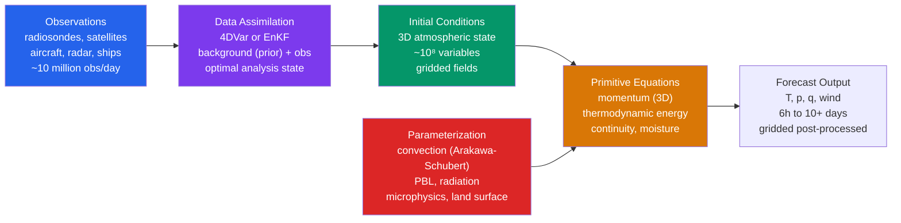

# 🌐 Numerical Weather Prediction

> [!abstract] TL;DR
> **Numerical Weather Prediction (NWP)** solves the **primitive equations** of atmospheric motion — the Navier–Stokes momentum equations plus thermodynamics, mass continuity, and moisture — **forward in time** on a computational grid, using the **current observed state of the atmosphere as the initial condition**. Turning millions of scattered observations into a physically consistent 3D starting state is the job of **data assimilation** (today mostly **4DVar** or the **Ensemble Kalman Filter**, or hybrids of both). Processes smaller than the grid box — convection, turbulence, radiation, cloud microphysics — cannot be resolved and must be **parameterized**. Flagship systems are **ECMWF's IFS** ($\sim 9$ km global), **NCEP's GFS** ($\sim 13$ km global), and **convection-allowing regional models** like **HRRR** ($3$ km). Because the atmosphere is **chaotic** (Lorenz 1963), tiny errors grow exponentially and cap deterministic skill at roughly **two weeks** — so modern practice runs **ensembles** and, increasingly, **machine-learning emulators** (GraphCast, Pangu-Weather, ECMWF's AIFS) trained on the **ERA5 reanalysis**. Forecast skill has advanced by about **one day of lead time per decade** since 1980 — the *quiet revolution* that finally realized L. F. Richardson's 1922 dream.

---

## Intuition — analogy FIRST

Think of the atmosphere as an enormous, three-dimensional **clockwork of air parcels**. If you knew — right now — the exact position, velocity, temperature, pressure, and humidity of every parcel, you could apply **Newton's second law** ($F = ma$, air pushed by pressure differences, gravity, and the Coriolis force) plus the **laws of thermodynamics** to compute where each parcel will be a few minutes from now. Do that, then repeat with the new state to step forward another few minutes, and again, and again. String enough tiny steps together and you have marched the whole atmosphere forward hours or days into the future. **That marching is all NWP is**: not statistics, not pattern-matching the past, but *integrating the equations of fluid physics forward in time*.

Two things make it fiendishly hard. First, **you can never know the starting state exactly** — the atmosphere is a **chaotic** system (Lorenz's *butterfly*), so the microscopic uncertainty in today's measurements grows until, about two weeks out, the forecast is no better than climatology. Second, **your grid is coarse**: even a $9$-km global model treats a thunderstorm updraft, a turbulent eddy, or an individual cloud droplet as **invisible** — smaller than a single grid box — yet those unresolved processes move enormous amounts of heat and water, so their *average* effect must be smuggled back in through clever approximations called **parameterizations**. NWP is the art of doing both: integrating physics you can resolve, and representing the physics you cannot.

---

## How It Works

An NWP forecast is a **pipeline**, not a single equation solve. Observations from around the globe are blended with a short-range prior forecast to build the best possible **analysis** (initial condition); the primitive equations then integrate that analysis forward, with parameterization schemes supplying the sub-grid physics at every time step; and the raw gridded output is post-processed into the products forecasters and models downstream actually use.



**The governing equations (the "model core").** A hydrostatic global model carries a small closed set of **prognostic** equations, one for each conserved quantity, on a rotating sphere. The horizontal **momentum** equations balance acceleration against the Coriolis force, the pressure-gradient force, and friction:
$$\frac{du}{dt} = fv - \frac{1}{\rho}\frac{\partial p}{\partial x} + F_x, \qquad \frac{dv}{dt} = -fu - \frac{1}{\rho}\frac{\partial p}{\partial y} + F_y,$$
where $\frac{d}{dt} = \frac{\partial}{\partial t} + \mathbf{V}\cdot\nabla$ is the material derivative and $f = 2\Omega\sin\phi$ is the Coriolis parameter. The **thermodynamic energy** equation governs temperature via the first law:
$$\frac{dT}{dt} = \frac{1}{c_p}\frac{dQ}{dt} + \frac{RT}{c_p\,p}\frac{dp}{dt} \;\;\Longleftrightarrow\;\; \frac{d\theta}{dt} = \frac{\theta}{c_p T}\frac{dQ}{dt},$$
so that potential temperature $\theta$ is conserved under adiabatic ($dQ=0$) motion. **Mass continuity** enforces conservation of air, and **moisture continuity** tracks water vapour with its condensation/evaporation sources:
$$\frac{\partial \rho}{\partial t} + \nabla\!\cdot(\rho\mathbf{V}) = 0, \qquad \frac{dq}{dt} = S_q .$$
The set is closed by the **ideal-gas equation of state** $p = \rho R T$. In **pressure (or hybrid) vertical coordinates** the continuity equation collapses to the elegant diagnostic $\nabla_p\!\cdot\mathbf{V} + \partial\omega/\partial p = 0$.

**Hydrostatic vs nonhydrostatic.** The full vertical momentum equation admits fast vertical **acoustic** and **gravity** waves that are meteorologically irrelevant but crippling for the time step. Global models therefore apply the **hydrostatic approximation** $\partial p/\partial z = -\rho g$, replacing the vertical momentum equation with a diagnostic balance and *filtering out* vertical sound waves. This is valid while horizontal scales $\gg$ vertical scales — but it **breaks down at convection-allowing resolution** ($\lesssim 4$ km), where updraft accelerations matter. Modern high-resolution cores (HRRR, ICON, the newest IFS) are therefore **nonhydrostatic**, retaining the full $dw/dt$.

**Discretizing space: grids and coordinates.** Prognostic fields live at discrete points. Where you place winds relative to mass points matters enormously for wave dispersion — the **Arakawa grid staggering (A–E)** classifies the choices, with the **C-grid** (velocities on cell faces, mass in the center) being the workhorse of most modern models because it represents geostrophic adjustment well. Vertically, models use **terrain-following coordinates**, classically the sigma coordinate $\sigma = p/p_s$ (so $\sigma=1$ at the ground and $\sigma=0$ at the top, and the lowest surface hugs the orography), today usually a **hybrid sigma-pressure** coordinate that follows terrain near the ground but relaxes to pure pressure surfaces aloft.

**The spectral alternative (ECMWF IFS).** Rather than a grid of points, a **spectral model** represents each field as a truncated series of **spherical harmonics** $Y_\ell^m$. Linear operations (derivatives, the Laplacian, semi-implicit terms) become trivial algebra in spectral space, while nonlinear products are computed on an associated **Gaussian grid** and transformed back — the **spectral transform method**. This gives excellent accuracy and no pole problem, at the cost of global transforms each step; ECMWF's IFS is the most successful spectral model in the world.

**Discretizing time.** Given the spatial operators, the state is stepped forward with a **time-integration scheme**: the classic three-level **leapfrog** (stabilized against its computational mode by the **Robert–Asselin filter**), multi-stage **Runge–Kutta** methods (WRF), or the highly efficient **semi-implicit semi-Lagrangian** scheme (IFS) that treats fast waves implicitly and advection along parcel trajectories, permitting long stable time steps.

**Getting the initial state: data assimilation.** No observing network samples the $\sim 10^8$ model variables; observations are irregular, noisy, and of different types. **Data assimilation (DA)** optimally combines a **background** (short prior forecast, $\mathbf{x}_b$) with new **observations** ($\mathbf{y}$) to produce the **analysis** $\mathbf{x}_a$. The historical progression runs from **Optimal Interpolation (OI)** → **3DVar** → **4DVar** → the **Ensemble Kalman Filter (EnKF)** → today's **hybrid** systems (detailed below).

**Sub-grid physics: parameterization.** Everything smaller than roughly two grid lengths (the **Nyquist limit**, scales $< 2\Delta x$) is unresolved but not negligible. Five great families of **parameterization** feed their bulk effect back into the resolved equations: **cumulus convection** (e.g. mass-flux Arakawa–Schubert, Tiedtke, Kain–Fritsch); the **planetary boundary layer / turbulence**; **radiative transfer** (shortwave + longwave); **cloud microphysics** (condensation, autoconversion, ice); and the **land surface** (soil moisture, vegetation, snow). These schemes are where much of a model's "personality" — and much of its error — lives.

**Chaos sets the ceiling.** In 1963 Edward Lorenz discovered that a simple deterministic convection model was **sensitively dependent on initial conditions**: two nearly identical starts diverge exponentially. This is the mathematical reason no amount of computing power yields a perfect two-week deterministic forecast. Lorenz estimated that **initial errors double in $\sim 2$–$3$ days**, implying an **upper predictability limit of $\sim 2$ weeks** for synoptic-scale midlatitude weather. The operational response is the **ensemble** (see [[Ensemble_Forecasting_and_Uncertainty]]).

---

## Key Concepts / Details

### Secondary Level

- **What a weather model actually is.** It is a computer program that starts from a snapshot of today's atmosphere and uses the **laws of physics** — Newton's laws of motion and the laws of heat — to calculate what the atmosphere will look like in 6 hours, tomorrow, and up to about two weeks ahead. It is *not* looking up what happened on similar days in the past.
- **What goes in, what comes out.** **Input:** millions of measurements each day — from weather balloons (radiosondes), **satellites** (by far the largest source), aircraft, ships, buoys, and ground stations. **Output:** gridded fields of **temperature, pressure, wind, and humidity** at many heights, from which forecasters derive rain, snow, storms, and warnings.
- **Why forecasts get worse further out.** The atmosphere is **chaotic**: a vanishingly small error today grows until, around **two weeks** out, the forecast is no better than simply quoting the seasonal average. Day-1 forecasts are excellent; day-10 forecasts are useful only in broad strokes.
- **What "resolution" means.** A model divides the world into boxes; a "$9$-km model" has boxes about $9$ km across. **Finer boxes** can represent smaller features (individual thunderstorms) but cost far more computer time — roughly $8\times$ the cost for every halving of grid spacing.
- **Global vs regional models.** **Global models** (ECMWF, GFS) cover the whole planet at coarser resolution and forecast days ahead. **Regional / convection-allowing models** (HRRR at $3$ km) cover one country at high resolution for the next few hours to days, resolving individual storms — but they need a global model to supply their edges.
- **Why some models beat others.** The **ECMWF** model is widely regarded as the world's best medium-range model — famously it forecast **Superstorm Sandy's** turn into New Jersey a week ahead when US models did not. Its edge comes mostly from **better data assimilation and physics**, not merely finer grids.

### Undergraduate Level

**The primitive-equation system, assembled.** The forecast model is a closed set of coupled PDEs — three **momentum** components, the **thermodynamic energy** equation, **mass continuity**, **moisture continuity**, and the **equation of state** $p=\rho RT$ — for the prognostic variables $(u,v,w,T,p,q)$. "Primitive" means we retain the essential balances but apply the **hydrostatic filtering** approximation, which removes vertical acoustic waves so the time step is set by horizontal wave speeds, not the speed of sound.

**Filtered equations.** Early NWP could not even use the primitive equations: Charney, Fjørtoft & von Neumann's first successful 1950 forecast used the **barotropic vorticity equation**, which filters out *all* gravity and sound waves and predicts only the large-scale flow. Modern primitive-equation models keep meteorological gravity waves but filter acoustic waves (via hydrostatic balance or a semi-implicit scheme), which is why choosing what to filter is a foundational modeling decision.

**Spectral transform method (ECMWF IFS), concretely.** Each prognostic field is expanded as
$$X(\lambda,\mu,t) = \sum_{m=-M}^{M}\sum_{\ell=|m|}^{L} X_\ell^m(t)\,Y_\ell^m(\lambda,\mu),$$
truncated at total wavenumber $L$ (e.g. **TCo1279** $\approx 9$ km). **Linear terms** (Laplacian, semi-implicit correction) are diagonal in $(\ell,m)$ and evaluated cheaply in spectral space; **nonlinear products** (advection, physics tendencies) are formed on the physical **Gaussian grid**, then transformed back with fast Legendre + Fourier transforms. The scheme has no polar singularity and superb accuracy per degree of freedom.

**Terrain-following coordinate.** With $\sigma = p/p_s$ the lower boundary condition becomes simply $\dot\sigma = 0$ at $\sigma = 1$, elegantly handling mountains — at the cost of a pressure-gradient error over steep terrain, which hybrid coordinates mitigate by flattening the surfaces aloft.

**Data assimilation as optimal blending.** The analysis increment is a weighted correction of the background by the observation departure:
$$\mathbf{x}_a = \mathbf{x}_b + \mathbf{K}\big(\mathbf{y} - H(\mathbf{x}_b)\big), \qquad \mathbf{K} = \mathbf{B}\mathbf{H}^{\!\top}\big(\mathbf{H}\mathbf{B}\mathbf{H}^{\!\top} + \mathbf{R}\big)^{-1},$$
where $H$ is the (possibly nonlinear) **observation operator** mapping model state to observed quantities (e.g. radiances), $\mathbf{B}$ is the **background-error covariance**, and $\mathbf{R}$ the **observation-error covariance**. The **Kalman gain** $\mathbf{K}$ trusts observations more where the background is uncertain and vice-versa. DA is necessary because **you cannot forecast without a complete, balanced initial state**, and the raw observations are neither complete nor mutually consistent.

**4DVar cost function.** Four-dimensional variational assimilation finds the initial state $\mathbf{x}$ that best fits **both** the prior **and** all observations **spread across a time window** $[t_0,t_n]$, by minimizing
$$J(\mathbf{x}) = \underbrace{\tfrac12(\mathbf{x} - \mathbf{x}_b)^{\!\top}\mathbf{B}^{-1}(\mathbf{x} - \mathbf{x}_b)}_{\text{background term (fit to prior)}} \;+\; \underbrace{\tfrac12\sum_{i=0}^{n}\big(H_i(\mathbf{x}_i) - \mathbf{y}_i\big)^{\!\top}\mathbf{R}_i^{-1}\big(H_i(\mathbf{x}_i) - \mathbf{y}_i\big)}_{\text{observation term (fit to obs over the window)}},$$
where $\mathbf{x}_i = M_{t_0\to t_i}(\mathbf{x})$ is the state propagated to time $t_i$ by the forecast model $M$. The **first term** penalizes drifting from the background (weighted by its error covariance $\mathbf{B}$); the **second term** penalizes mismatch with observations at each time (weighted by observation error $\mathbf{R}$). The minimizer is the analysis. Crucially, 4DVar uses the model's own dynamics to make the analysis **flow-dependent and physically balanced**.

**Parameterization is unavoidable.** By the **Nyquist criterion** a grid of spacing $\Delta x$ cannot represent any feature smaller than $2\Delta x$; a $9$-km model is blind to a $2$-km convective updraft, yet that updraft transports huge heat and moisture fluxes. Convection, boundary-layer turbulence, radiative heating/cooling, cloud microphysics, and land-surface exchange must therefore be **parameterized** — expressed as functions of the resolved grid-scale variables. Parameterization error is a distinct and stubborn source of forecast error, separate from initial-condition error.

**Verification: the anomaly correlation coefficient (ACC).** The community's standard skill metric is the **ACC of 500 hPa geopotential height** — the pattern correlation between forecast anomalies and observed anomalies (both measured relative to climatology):
$$\text{ACC} = \frac{\sum (f - \bar c)(a - \bar c)}{\sqrt{\sum (f - \bar c)^2\,\sum (a - \bar c)^2}},$$
with $f$ the forecast, $a$ the analysis (truth), and $\bar c$ climatology. **ACC $= 1$** is perfect; the operational **skill threshold is ACC $= 0.6$** (below it a forecast is not considered useful). The lead time at which ACC drops to $0.6$ has stretched from about **5 days in 1980 to about 7 days by the 2020s** at ECMWF — the headline number for "$\sim$1 day per decade" of progress. **RMSE** (root-mean-square error of the fields) is the complementary metric.

### Graduate Level

**4DVar internals and the adjoint.** Minimizing $J(\mathbf{x})$ over $\sim 10^8$ variables requires its gradient $\nabla_{\mathbf x} J$. Differentiating the observation term through the forecast trajectory brings in $M^{\!\top}$ and $H^{\!\top}$ — the **adjoint (transpose) of the tangent-linear model**. The **adjoint model** integrates sensitivities *backward* in time, propagating observation departures at $t_i$ back to $t_0$. Building and maintaining an accurate adjoint of a full physics model is an enormous, error-prone software effort (physics discontinuities must be linearized), which is precisely the cost that motivated ensemble methods. **Strong-constraint 4DVar** assumes a perfect model; **weak-constraint 4DVar** adds a model-error term to the cost function.

**Ensemble Kalman Filter (EnKF).** The EnKF estimates the **flow-dependent** background-error covariance directly from an **ensemble** of forecasts: $\mathbf{B} \approx \mathbf{P}^f = \frac{1}{N-1}\sum_k (\mathbf{x}_k^f - \bar{\mathbf{x}}^f)(\mathbf{x}_k^f - \bar{\mathbf{x}}^f)^{\!\top}$. Each member is updated with the Kalman gain built from this sample covariance. Its great appeal: **no adjoint and no tangent-linear model are needed** — you only run the nonlinear forecast model $N$ times — so it is far cheaper to develop and naturally provides an ensemble for probabilistic forecasting. Its costs: a small ensemble ($N\sim 50$–$100 \ll 10^8$) gives a rank-deficient, noisy covariance, requiring two fixes: **covariance localization** (tapering spurious long-range sample correlations to zero with, e.g., a Gaspari–Cohn function) and **covariance inflation** (multiplying spread to counter systematic under-dispersion).

**Hybrid 4DVar–EnKF.** Operational centers combine the two: the flow-dependent **EnKF covariance** is blended with the static, well-tuned **climatological $\mathbf{B}$** inside the 4DVar cost function ($\mathbf{B}_{\text{hyb}} = \beta_c\mathbf{B}_{\text{clim}} + \beta_e\mathbf{P}^f_{\text{loc}}$). ECMWF's **EDA (Ensemble of Data Assimilations)** feeds flow-dependent error statistics into its 4DVar; NCEP and the UK Met Office run explicit hybrid gain systems. The hybrid captures **"errors of the day"** (EnKF strength) while retaining the robustness and full-rank structure of variational DA — currently the best of both worlds.

**Background-error covariance $\mathbf{B}$.** $\mathbf{B}$ encodes both the *variance* of the prior error and its *spatial and multivariate structure* — how a temperature error at one point implies wind and pressure errors elsewhere (through balance relations like geostrophy). A well-specified $\mathbf{B}$ spreads sparse observational information realistically through the 3D state; a poor $\mathbf{B}$ wastes observations. Modeling $\mathbf{B}$ (control-variable transforms, wavelet/spectral representations, ensemble estimation) is a research field in itself.

**Convective parameterization closure.** Cumulus schemes need a **closure** specifying how strongly convection responds to the resolved state. **CAPE-based closures** relax convective available potential energy toward zero over a timescale; **mass-flux schemes** (Arakawa–Schubert 1974, and its relaxed/prognostic descendants) represent an ensemble of entraining/detraining cloud plumes and determine the **cloud-base mass flux** from a quasi-equilibrium between large-scale destabilization and convective stabilization. At the **grey zone** ($\sim 1$–$10$ km) convection is neither fully resolved nor fully sub-grid, and scale-aware schemes are needed — an open problem.

**Representing model uncertainty: stochastic physics.** Deterministic parameterizations are systematically under-dispersive. Ensembles inject **stochastic physics** to represent parameterization uncertainty: **SPPT (Stochastically Perturbed Parameterization Tendencies)** multiplies the net physics tendency by a smoothly varying random field; **SKEB (Stochastic Kinetic Energy Backscatter)** returns kinetic energy that numerical dissipation erroneously removes back into the resolved flow. Together they make ensemble spread better match forecast error.

**Numerical diffusion and filtering.** Discretization needs **explicit diffusion / hyperdiffusion** ($\nabla^4$, $\nabla^6$) to control the spurious buildup of energy at the grid scale (spectral blocking) and to damp the computational mode of the leapfrog scheme (Robert–Asselin/RAW filter). Too little and the model blows up; too much and it smears real features — a perennial tuning tension.

**The AI/ML revolution in NWP.** Since 2022 **data-driven models trained on the ERA5 reanalysis** have matched or beaten operational physics models on standard scores at a **tiny fraction of the run-time cost**. **GraphCast** (DeepMind, 2023) is a graph-neural-network that predicts the global state in $0.25°$ from two input time steps, autoregressively rolling out 10-day forecasts in under a minute on a single accelerator. **Pangu-Weather** (Huawei, 2023) uses 3D Earth-specific transformers; **FourCastNet** (NVIDIA) uses Fourier neural operators; **ECMWF's AIFS** (operational 2024) is a center-run ML model; **NeuralGCM** (Google, 2024) is a hybrid that couples a differentiable dynamical core to learned physics. All are **emulators trained on decades of reanalysis**, so they inherit reanalysis biases and — a live research concern — may extrapolate poorly to **out-of-distribution extremes**. Coupling ML with data assimilation (**ML-DA**, learned observation operators, end-to-end learned analysis) is the current frontier.

**Predictability, quantified.** Lorenz's estimate — initial errors **doubling in $\sim 2$–$3$ days** — implies a practical horizon near **two weeks** for synoptic scales, but predictability is **scale-dependent**: small convective scales lose predictability in hours, planetary waves and coupled ocean modes (ENSO) far beyond two weeks. This scale dependence is why **sub-seasonal-to-seasonal (S2S)** prediction is possible at all despite the two-week "weather" wall.

---

## Python demo — the Lorenz (1963) system: chaos and the predictability limit

The 1963 Lorenz model is the mathematical archetype behind the two-week forecast wall. It is a three-variable ($X,Y,Z$) truncation of thermal convection:
$$\frac{dX}{dt} = \sigma(Y - X), \qquad \frac{dY}{dt} = X(\rho - Z) - Y, \qquad \frac{dZ}{dt} = XY - \beta Z,$$
with the classic chaotic parameters $\sigma = 10,\ \rho = 28,\ \beta = 8/3$. The script integrates **two trajectories whose initial $X$ differs by only $0.001$** — the "butterfly" — and shows that they track each other perfectly for a while, then **diverge abruptly and unpredictably**. It then fits the exponential growth of their phase-space separation to estimate the **largest Lyapunov exponent** $\lambda$ (the divergence rate) and the corresponding **error-doubling time** $\ln 2/\lambda$. Runnable with `numpy`, `scipy`, and `matplotlib`.

```python
# Lorenz 1963: sensitive dependence on initial conditions (the "butterfly effect")
# and an estimate of the largest Lyapunov exponent -> the atmospheric predictability limit.
import numpy as np
from scipy.integrate import odeint
import matplotlib.pyplot as plt

# ---- Classic chaotic parameters ----
sigma, rho, beta = 10.0, 28.0, 8.0 / 3.0

def lorenz(state, t):
    x, y, z = state
    return [sigma * (y - x), x * (rho - z) - y, x * y - beta * z]

# ---- Two initial conditions differing by 0.001 in X (the tiny "butterfly") ----
t   = np.arange(0.0, 40.0, 0.01)
ic1 = [1.0,          1.0, 1.0]
ic2 = [1.0 + 1.0e-3, 1.0, 1.0]

sol1 = odeint(lorenz, ic1, t)
sol2 = odeint(lorenz, ic2, t)

# ---- Phase-space separation between the twin trajectories ----
delta = np.sqrt(np.sum((sol1 - sol2) ** 2, axis=1))   # |delta(t)|
delta0 = delta[0]                                      # = 1e-3 initial separation

# ---- Estimate the largest Lyapunov exponent from the exponential-growth window ----
# fit  ln(delta) = ln(delta0) + lambda * t  while the separation is still growing (< attractor size)
mask = (t > 2.0) & (t < 20.0) & (delta < 10.0)
lam, intercept = np.polyfit(t[mask], np.log(delta[mask]), 1)
doubling = np.log(2.0) / lam

print(f"Initial separation                = {delta0:.1e}")
print(f"Estimated largest Lyapunov exp.   = {lam:.3f}  per time-unit")
print(f"Error-doubling time               = {doubling:.2f} time-units")
print(f"(reference value, Lorenz63:  lambda ~ 0.906)")

# ---- Plots ----
fig = plt.figure(figsize=(12, 5))

# (a) X(t): the two runs are indistinguishable, then diverge abruptly
ax1 = fig.add_subplot(1, 2, 1)
ax1.plot(t, sol1[:, 0], lw=0.8, label="trajectory 1")
ax1.plot(t, sol2[:, 0], lw=0.8, label="trajectory 2  (+0.001)")
ax1.set_xlabel("time"); ax1.set_ylabel("X(t)")
ax1.set_title("Butterfly effect: near-identical starts diverge")
ax1.legend()

# (b) exponential growth of the separation + the Lyapunov fit (log scale)
ax2 = fig.add_subplot(1, 2, 2)
ax2.semilogy(t, delta, lw=0.8, color="k", label=r"$|\delta(t)|$")
ax2.semilogy(t[mask], np.exp(intercept + lam * t[mask]), "r--",
             label=fr"exp fit, $\lambda$={lam:.2f}")
ax2.set_xlabel("time"); ax2.set_ylabel("phase-space separation")
ax2.set_title("Exponential error growth = finite predictability")
ax2.legend()

plt.tight_layout(); plt.show()
```

Expected console output (rounded): **largest Lyapunov exponent $\lambda \approx 0.9$ per time-unit** and an **error-doubling time $\approx 0.7$ time-units**. Left panel: the two $X(t)$ curves overlie perfectly for the first $\sim 20$ time-units, then **separate suddenly and never re-synchronize** — a deterministic system that is nonetheless unpredictable. Right panel: the separation grows as a clean straight line on a **log axis** (i.e. **exponentially**) until it saturates at the size of the attractor. The moral for NWP: because $\lambda > 0$, *any* initial error — however tiny — is amplified to forecast-destroying size in finite time, which is exactly why deterministic weather prediction has a hard horizon and why we run **ensembles** rather than a single "best" forecast.

---

## Real-World Notes

- **Richardson's 1922 "forecast factory."** Lewis Fry Richardson performed the **first-ever numerical forecast by hand** during WWI, integrating a simplified primitive-equation set for a single 6-hour step over central Europe. It took him **six weeks** and produced a **wildly wrong** surface-pressure change (a spurious ~145 hPa, from unfiltered gravity waves and an unbalanced initial state) — yet the *method was sound*. He dreamed of a **"forecast factory"** of 64,000 human computers keeping pace with the weather; today's supercomputers are that factory realized.
- **Superstorm Sandy (2012).** The **ECMWF** model predicted Sandy's unusual **left-hook landfall into New Jersey a full 7 days ahead**, while the US GFS kept the storm out to sea until much later. The very public performance gap spurred US investment (the "Sandy Supplemental") in supercomputing and model development, and became the canonical example of *why global NWP quality matters*.
- **Satellites dominate the observing system.** Modern global DA ingests **on the order of 10 million observations per day**, the **overwhelming majority from satellites** — chiefly **radiances** from infrared and microwave sounders assimilated directly through radiative-transfer observation operators, plus GPS radio occultation and atmospheric-motion vectors. Conventional data (radiosondes, aircraft, surface) are vital but a small numerical minority.
- **AIFS runs on a laptop timescale.** ECMWF's machine-learning model **AIFS (2024)** generates a **15-day global forecast in about a minute** on a single GPU, versus hours of supercomputer time for the physics-based IFS — while scoring competitively on standard metrics. This collapse in run-time cost is reshaping how ensembles and rapid-update forecasting are done.
- **Reanalyses are NWP applied to history.** **ERA5** (ECMWF), **NCEP/NCAR**, **JRA-55**, and **MERRA-2** are **retrospective NWP runs**: a single frozen model + DA system reprocesses *all* historical observations into a physically consistent, gridded record from roughly **1940/1950 to the present**. These reanalyses are the backbone dataset for essentially all modern climate research — and, fittingly, are now the **training data** for the AI weather models.

---

## Common Pitfalls

1. **"The model" is a single thing.** There is no one weather model. **Global models** (ECMWF IFS, NCEP GFS, UK Met Office UM, DWD ICON) forecast the planet days ahead at coarse resolution; **regional convection-allowing models** (HRRR at 3 km, NAM-CONUS) resolve individual storms over one country for the next hours to days but depend on a global model for their lateral boundaries. They answer **different questions**, and quoting "the model" without saying which one is meaningless.
2. **"Higher resolution automatically means a better global forecast."** It does not. ECMWF's decades of medium-range skill gains came **primarily from better data assimilation, improved physics, more/better observations, and ensemble design** — resolution was only one contributor and shows **diminishing returns**. A finer grid on top of a poor analysis or biased physics buys little.
3. **Conflating model error with initial-condition error.** Forecast skill is limited by **two distinct things**: **initial-condition uncertainty** (chaos amplifying imperfect analyses) and **model error** (wrong or missing physics, discretization, parameterization). They **respond differently** to investment — better observations/DA attack the first, better physics/resolution attack the second — and confusing them leads to spending effort in the wrong place.
4. **Treating AI/ML models like physics models.** GraphCast, Pangu-Weather, and AIFS are **learned emulators**, not integrations of the primitive equations. They **interpolate patterns from their ERA5 training distribution**, so they may **fail unexpectedly on rare, out-of-distribution extremes** (record-breaking events, unprecedented configurations), can produce physically inconsistent or overly smooth fields, and inherit reanalysis biases. Impressive average scores do not guarantee reliability on the tail events that matter most.
5. **Over-reading a single verification score.** ACC and RMSE measure **average skill over many cases**. A high mean ACC does **not** mean any particular high-impact forecast is trustworthy — an individual storm's track or intensity can be badly wrong even in a model with excellent average scores. This is exactly why **ensembles and probabilistic products** exist, and why deterministic single-run forecasts of extreme events should always be paired with their uncertainty.

---

## Related Concepts

- [[_MOC_Weather_Forecasting]] — section map for the weather-forecasting chapter of this vault; entry point for how atmospheric physics becomes an operational forecast.
- [[Synoptic_Meteorology_and_Weather_Maps]] — the human analysis of charts and the conceptual models that NWP output feeds into and that DA ingests as conventional data.
- [[Ensemble_Forecasting_and_Uncertainty]] — the operational answer to Lorenz's chaos: perturbing initial conditions and physics to forecast a *probability distribution* rather than a single state.
- [[Remote_Sensing_Radar_and_Satellites]] — the satellite radiances, GPS-RO, and radar that supply the ~10 million daily observations assimilated into the initial state.
- [[Global_Atmospheric_Circulation]] — the large-scale flow (Hadley/Ferrel cells, jets, Rossby waves) that the primitive equations reproduce and that anchors predictability.
- [[Fronts_and_Extratropical_Cyclones]] — the baroclinic systems whose track and deepening are the classic target of medium-range NWP; their sharp sensitivity is what ensembles quantify.
- [[Climate_Models_and_Projections]] — the same primitive-equation dynamical cores, coupled to ocean/ice/land and run for decades, where the goal is climate statistics rather than a specific forecast.
- [[_MOC_Physics_Master]] — cross-vault entry point to the underlying physics that the model core integrates.
- [[Newtons_Laws_and_Kinematics]] — $F=ma$ in a rotating frame is literally the momentum equations at the heart of every weather model.
- [[Laws_of_Thermodynamics]] — the first law supplies the thermodynamic energy equation; the ideal-gas law closes the primitive system.
- [[_MOC_SS_Master]] — cross-vault entry to signals & systems, the mathematics behind spectral methods, sampling, and filtering.
- [[Fourier_Transform]] — the spectral (spherical-harmonic) transform method, the Nyquist sampling limit, and numerical filtering all rest on Fourier analysis.

---

## Review Questions

**Secondary.** In your own words, what **is** Numerical Weather Prediction — how does a weather model differ from simply looking up what happened on similar days in the past? **What data** does a weather model take as input, and **what** does it produce as output? Finally, what is the approximate **predictability limit** for day-to-day weather, and **why** does the forecast get steadily worse the further ahead you look?

**Undergraduate.** Describe the **steps of the NWP pipeline** from raw observations to a gridded forecast, naming what happens at each stage. What is **data assimilation**, and **why is it necessary** rather than just plugging observations straight into the model? **Write down the 4DVar cost function** and explain, term by term, what the background term and the observation term each penalize and how they are weighted. What is the **anomaly correlation coefficient (ACC)** of 500 hPa height, and what **numerical threshold** conventionally separates a "skillful" from a "useless" forecast?

**Graduate.** Compare **4DVar** and the **Ensemble Kalman Filter (EnKF)** as data-assimilation strategies. What does each provide, and what are the principal **advantages and disadvantages** of each — in particular, how does the **background-error covariance** differ between them (static/climatological vs flow-dependent/sampled)? Why did the requirement for an **adjoint (and tangent-linear) model** in 4DVar make the EnKF attractive, and what two problems (rank deficiency, under-dispersion) must the EnKF solve with **localization** and **inflation**? Finally, why do the leading operational centers now run a **hybrid 4DVar–EnKF** system rather than either method alone?

---

## Sources

- Kalnay, E. — *Atmospheric Modeling, Data Assimilation and Predictability* (Cambridge Univ. Press, 2002). The standard graduate text on model cores, variational and ensemble data assimilation, and predictability theory.
- Bauer, P., Thorpe, A., & Brunet, G. — "The quiet revolution of numerical weather prediction" (*Nature*, 2015). Authoritative review of the ~1-day-per-decade skill improvement and its drivers (observations, DA, physics, resolution, ensembles).
- Lam, R., et al. — "Learning skillful medium-range global weather forecasting" (*Science*, 2023). The GraphCast paper: an ML model trained on ERA5 that matches/exceeds the operational IFS on many metrics at a fraction of the run-time cost.
- Lorenz, E. N. — "Deterministic Nonperiodic Flow" (*J. Atmos. Sci.*, 1963). The foundational chaos paper behind the two-week predictability limit and the demo above.
- Holton, J. R., & Hakim, G. J. — *An Introduction to Dynamic Meteorology* (5th ed., Academic Press). The primitive equations, filtering approximations, and quasi-geostrophic theory that underlie the model core.

---

#Meteorology #NWP #NumericalWeatherPrediction #ECMWF #DataAssimilation
