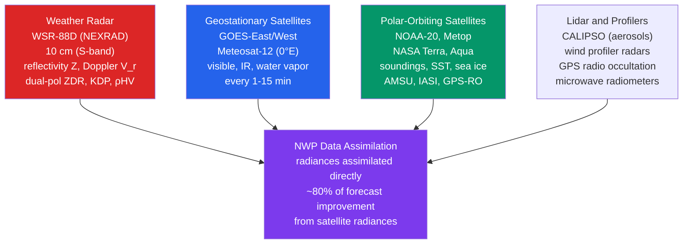

# 📡 Remote Sensing, Radar, and Satellites

> [!abstract] TL;DR
> **Remote sensing** uses electromagnetic radiation to probe the atmosphere and surface *without direct contact*. **Weather radars** emit microwave pulses ($2$–$10$ cm wavelength) and detect the tiny backscatter from raindrops, yielding precipitation location and intensity (**reflectivity $Z$**), radial wind (**Doppler velocity $v_r$**), and storm structure (**dual-polarization** $Z_{DR}$, $K_{DP}$, $\rho_{HV}$). **Geostationary satellites** (GOES-East/West, Meteosat) stare continuously at a fixed hemisphere in **visible / infrared / water-vapor** channels for cloud tracking and mesoscale analysis. **Polar-orbiting satellites** (NOAA, EUMETSAT Metop, the NASA A-Train) supply temperature/moisture **soundings**, sea-surface temperature, sea ice, and precipitation estimates that dominate **NWP data assimilation** — roughly **80 % of global forecast skill now comes from space-based radiances**. **Lidar, GPS radio occultation, and scatterometers** fill the remaining gaps in the global observing network.

---

## Intuition — analogy FIRST

A **weather radar is a bat's echolocation for rain.** The radar shouts a brief radio pulse into the sky and then falls silent to listen. When the pulse hits a swarm of raindrops, a faint echo bounces back. The *delay* before the echo returns tells the radar **how far away** the rain is (distance $=$ half the round-trip travel time $\times$ the speed of light), and the *loudness* of the echo tells it **how heavy** the rain is. If the raindrops are moving toward or away from the radar, the echo comes back at a slightly shifted pitch — exactly like the pitch change of a passing siren — and that **Doppler shift** reveals the **wind blowing the rain**.

A **geostationary satellite is a security camera bolted to the sky at 36,000 km.** Orbiting at just the right height, it circles the Earth once per day — the same rate the Earth spins — so it hangs motionless over one spot and **stares continuously**, watching thunderstorms bloom and hurricanes churn in near-real time, frame after frame every few minutes.

A **polar-orbiting satellite is a survey drone flying low overhead.** It skims much closer to the ground on a north–south track, so every time it passes it can take a **detailed vertical sounding** — a temperature-and-humidity core sample of the whole atmosphere — but it only sees any given place twice a day. Together the "camera" and the "drone" give forecasters both *continuous coverage* and *deep detail*.

---

## How It Works

Remote sensing splits into two families. **Active** sensors (radar, lidar) supply their own energy — they transmit a pulse and measure the return. **Passive** sensors (most satellite imagers and sounders) collect radiation that is already there: reflected sunlight, or thermal emission from clouds, gases, and the surface. Every modern forecast fuses both, and nearly all of it flows into a numerical model through data assimilation.



### Weather radar — what the echo carries

**The reflectivity factor.** Rayleigh scattering off drops much smaller than the radar wavelength scatters power in proportion to the *sixth power of drop diameter*. Summing over all drops in a radar sample volume defines the **radar reflectivity factor**

$$Z = \int_0^\infty N(D)\,D^6\,dD \;=\; \sum_i n_i D_i^6 \qquad [\text{mm}^6\,\text{m}^{-3}],$$

and the received power falls off with range as $P_r \propto Z / r^2$. Because $Z$ spans an enormous dynamic range (from $\sim 10^{-1}$ for fog to $\sim 10^7$ for giant hail), it is compressed to a logarithmic **decibel scale**:

$$\mathrm{dBZ} = 10\,\log_{10}\!\left(\frac{Z}{1\ \text{mm}^6\,\text{m}^{-3}}\right).$$

Rain rate $R$ is estimated from $Z$ via an empirical **$Z$–$R$ relation** $Z = aR^b$: the classic **Marshall–Palmer** $Z = 200\,R^{1.6}$, or the **WSR-88D convective** default $Z = 300\,R^{1.4}$.

**Doppler velocity and its ambiguities.** By comparing the phase of successive returned pulses, the radar measures the **radial velocity** $v_r$ — the component of scatterer motion along the beam (toward $=$ negative, away $=$ positive). Two hard limits are set by the **pulse repetition frequency (PRF)**:

- **Unambiguous range** — the pulse must return before the next is sent: $r_\text{max} = c/(2\,\text{PRF})$.
- **Nyquist (unambiguous) velocity** — phase can only be tracked within $\pm\pi$: $v_\text{max} = \lambda\,\text{PRF}/4$.

These pull in *opposite* directions ($r_\text{max}\,v_\text{max} = c\lambda/8 =$ constant): a high PRF gives good velocity but short range; a low PRF gives long range but early **velocity folding (aliasing)**. The WSR-88D uses **dual-PRF / staggered-PRT** schemes to extend both at once.

**Dual-polarization.** Since the 2013 upgrade, WSR-88D transmits and receives both **horizontal and vertical** polarizations, adding three variables that reveal *particle shape and type*:

- **$Z_{DR}$ (differential reflectivity)** $= Z_H - Z_V$ in dB — positive for large **oblate** (flattened) raindrops, near zero for tumbling spherical hail.
- **$K_{DP}$ (specific differential phase)** — the range-derivative of the H/V phase difference; proportional to liquid-water rain rate and, crucially, **immune to attenuation and calibration error**.
- **$\rho_{HV}$ (co-polar correlation coefficient)** — near $1.0$ for uniform hydrometeors (pure rain, pure snow), dropping where types mix (melting layer, hail, tornado debris).

Together they feed the **Hydrometeor Classification Algorithm (HCA)** (rain / snow / graupel / hail / biological / debris) and improved **QPE**. A characteristic artifact is the **radar bright band** — a ring of enhanced reflectivity at the $\sim 0^\circ$C melting level where large, wet, still-slow snowflakes scatter strongly before collapsing into faster raindrops; low $\rho_{HV}$ flags it. Emerging **phased-array radar (MPAR)** electronically steers the beam, scanning a storm in tens of seconds instead of minutes.

### Satellites — geostationary and polar

**Geostationary orbit.** At an altitude of **35,786 km** ($\approx 36{,}000$ km) the orbital period equals one sidereal day, so the satellite hovers over a fixed longitude. **GOES-16/17/18** carry the **Advanced Baseline Imager (ABI)**, a **16-channel** radiometer at **0.5–2 km** resolution:

- **Visible** channels show sunlit cloud brightness (albedo) — daytime only.
- **Infrared window** channels ($\sim 11\ \mu$m) measure **cloud-top temperature**, hence cloud-top height (colder $=$ higher $=$ deeper convection) — day and night.
- **Water-vapor** channels ($6.2$, $6.9$, $7.3\ \mu$m) sense **upper-tropospheric moisture** by the emission/absorption of water vapor, revealing jet streaks and dry intrusions even in cloud-free air.

Tracking cloud and moisture features between successive frames yields **Atmospheric Motion Vectors (AMVs)** — satellite-derived winds. Meteosat (EUMETSAT, over Europe/Africa at $0^\circ$E) and Himawari (Japan) complete near-global geostationary coverage.

**Polar (sun-synchronous) orbit.** Flying at $\sim 800$–$850$ km, these satellites cross the equator at the *same local solar time* on every pass, sampling each latitude twice a day under consistent illumination. They carry the workhorse **sounders**:

- **AMSU-A / ATMS** — microwave temperature sounders using the $\text{O}_2$ absorption band near **60 GHz**; because clouds are semi-transparent at microwave, they profile temperature *through* cloud.
- **AMSU-B / MHS** — microwave humidity sounders near the **183 GHz** water-vapor line.
- **IASI (Metop) / CrIS (NOAA-20, JPSS)** — hyperspectral **infrared** sounders with **thousands of channels**, giving high vertical resolution in clear air.
- **GPS radio occultation (GPS-RO)** — e.g. **COSMIC-2** — a limb-sounding technique that turns bent GPS signals into temperature and humidity profiles (below).

All of this ultimately serves **NWP**: modern systems assimilate the **raw radiances** directly (not retrieved profiles), and the space-based component accounts for the large majority of global forecast skill.

---

## Key Concepts / Details

### Secondary Level

- **What radar "sees."** Raindrops scatter the radar's microwave pulse back to the antenna. The stronger the echo, the heavier the rain — this echo strength is called **reflectivity**, shown in colors on a radar map.
- **The dBZ scale.** Reflectivity is measured in **dBZ**: light rain $\sim 20$ dBZ, heavy rain $\sim 50$ dBZ, a **severe thunderstorm (hail) $60+$ dBZ**. Higher dBZ $=$ heavier precipitation (or hail).
- **Doppler radar shows wind.** A Doppler radar also measures whether the rain is moving *toward* or *away* from it, letting forecasters see rotating winds — the fingerprint of a developing tornado.
- **Two kinds of satellite picture.** A **visible** image is like a black-and-white photo lit by the Sun — it shows clouds by their brightness (daytime only). An **infrared** image shows **how cold the cloud tops are** — the coldest tops are the tallest storms — and it works at night.
- **Water-vapor images** reveal moisture and dryness high in the atmosphere, even where there are no clouds.
- **Geostationary vs polar satellites.** A **geostationary** satellite parks over one spot and films continuously — perfect for **tracking a hurricane's movement**. A **polar-orbiting** satellite circles low and close, taking sharper, more detailed scans but only passing overhead twice a day.

### Undergraduate Level

**Reflectivity and the $Z$–$R$ relation.** The received power scales as $P_r \propto Z/r^2$, with the reflectivity factor $Z = \sum_i n_i D_i^6$ (mm$^6$ m$^{-3}$). Rain rate follows an empirical power law $Z = aR^b$:

| Relation | $a$ | $b$ | Use |
|---|---|---|---|
| Marshall–Palmer | 200 | 1.6 | Stratiform / general |
| WSR-88D convective | 300 | 1.4 | Summer convection |

On the decibel scale, $\mathrm{dBZ} = 10\log_{10}Z$. **Worked estimate:** a radar returns **50 dBZ** $\Rightarrow Z = 10^{5}$ mm$^6$ m$^{-3}$. Inverting Marshall–Palmer, $R = (Z/200)^{1/1.6} = (500)^{0.625} \approx 49$ mm/h — a torrential downpour.

**Pulse-timing limits.** With pulse repetition frequency PRF,

$$r_\text{max} = \frac{c}{2\,\text{PRF}}, \qquad v_\text{max} = \frac{\lambda\,\text{PRF}}{4}.$$

Their product is fixed, $r_\text{max}\,v_\text{max} = c\lambda/8$ — the **range–velocity dilemma**. A single PRF cannot give both long range and unaliased velocity; the WSR-88D interleaves two PRFs (dual/staggered PRT) to extend each.

**Doppler folding.** Radial velocities beyond $\pm v_\text{max}$ **fold** (alias) — a $+35$ m/s outflow with $v_\text{max}=25$ m/s is displayed as $-15$ m/s, creating spurious discontinuities that dealiasing algorithms must unwrap.

**Dual-polarization variables (physical meaning).**
- $Z_{DR} = Z_H - Z_V$ (dB): large raindrops flatten into oblate shapes as they fall, so $Z_H > Z_V \Rightarrow Z_{DR} > 0$; bigger drops $\Rightarrow$ larger $Z_{DR}$. Hail tumbles and looks spherical $\Rightarrow Z_{DR}\approx 0$.
- $K_{DP}$ (deg km$^{-1}$): oblate drops slow the horizontal wave more than the vertical; the *cumulative* phase shift's range-gradient is proportional to rain rate and is **unaffected by attenuation** — ideal for heavy-rain QPE.
- $\rho_{HV}$: correlation between H and V returns; $\approx 0.98$–$1.0$ for a single hydrometeor type, dropping to $<0.9$ in mixed phase, melting layer, or debris.

**Satellite retrievals.** From the **brightness temperature** of an IR channel and a temperature profile, one infers **cloud-top height**. **AMVs** are retrieved by cross-correlating cloud or water-vapor features across two or three consecutive images; the feature displacement over the known time interval gives a wind vector, and the tracer's altitude sets the pressure level.

**Sounder weighting functions.** Each sounder channel is sensitive to a particular layer: its **weighting function** (the vertical derivative of atmospheric transmittance) peaks where most of the channel's radiation originates. A set of channels with staggered peaks — stratospheric to near-surface — jointly reconstructs the **temperature/moisture profile** by inversion.

### Graduate Level

**Passive microwave radiative transfer.** For a nadir-viewing microwave channel over a surface of emissivity $\varepsilon$ and temperature $T_s$, in a non-scattering atmosphere the observed brightness temperature is

$$T_b = \underbrace{\varepsilon\,T_s\,e^{-\tau/\cos\theta}}_{\text{attenuated surface}} \;+\; \underbrace{\int_0^\infty T(z)\,\frac{d\,\mathcal{T}}{dz}\,dz}_{\text{atmospheric emission}} \;+\; (1-\varepsilon)\,(\text{reflected downwelling}),$$

where $\tau$ is opacity, $\theta$ the view angle, and $d\mathcal{T}/dz$ the **weighting function**. **Nadir** sounders integrate downward through the column; **limb** sounders (including GPS-RO) look tangentially and gain sharp vertical resolution at the cost of horizontal smearing. **AMSU-A channels 3–14** span the $\text{O}_2$ $60$ GHz complex, their weighting functions marching from the surface (ch. 3–4) up into the stratosphere (ch. 12–14).

**GPS radio occultation (self-calibrating soundings).** As a GPS satellite sets behind the Earth's limb as seen from a receiver in low orbit, its signal rays **bend** through the atmosphere's refractivity gradient. The measured **bending angle** as a function of impact parameter is Abel-inverted to a vertical **refractivity** profile

$$N = (n-1)\times 10^6 = \underbrace{77.6\,\frac{P}{T}}_{\text{dry (density)}} + \underbrace{3.73\times 10^{5}\,\frac{e}{T^2}}_{\text{wet (water vapor)}},$$

from which **temperature** (upper troposphere/stratosphere, dry term) and **humidity** (lower troposphere, wet term) are recovered. It is called **self-calibrating** because the observable is essentially a *timing/phase measurement* referenced to GPS **atomic clocks**: it is an absolute measurement that needs no external radiometric calibration and **does not drift** — invaluable as an anchor for correcting biases in other instruments.

**Hyperspectral IR sounding.** **IASI** ($\sim 8{,}461$ channels) and **CrIS** resolve fine structure of the CO$_2$, H$_2$O, and O$_3$ bands, delivering $\sim 1$ K temperature and improved moisture profiles in clear air; their information content is why they are top-impact instruments in reanalysis.

**Radiance assimilation in NWP.** Rather than assimilating retrieved profiles (which carry prior-dependent errors), modern systems assimilate **raw radiances** through a radiative-transfer observation operator, with **variational bias correction**, **channel selection** (cloud/rain screening), and **thinning / superobbing** to respect error correlations. Bauer et al. (2015) document that the majority of global forecast skill — commonly quoted as **$\sim 80\%$ of the improvement over the satellite era** — traces to space-based observations, dominated by microwave and IR radiances plus GPS-RO.

**Dual-pol QPE.** Polarimetric rain-rate estimators blend $Z$, $Z_{DR}$, and especially $K_{DP}$ (attenuation-immune, robust in heavy rain), switching estimator by HCA-classified precipitation type — reducing the large bias of single-parameter $Z$–$R$ in convection.

**Advanced observing systems.** **MPAR** phased-array radar promises sub-minute volume scans and adaptive dwell for rapidly evolving storms. **GOES-R series** scan modes: **full disk every 5 min**, **CONUS every 1 min**, and **mesoscale sectors every 30–60 s** over active weather. The ESA **Aeolus** mission (2018–2023) flew the first spaceborne **Doppler wind lidar (ALADIN)**, directly profiling horizontal wind and demonstrably improving tropical NWP where radiosondes are sparse; its successor (Aeolus-2 / EPS-Aeolus) is planned to make wind profiles an operational data type.

---

## Python demo — radar reflectivity from a Marshall–Palmer DSD

The script builds the **Marshall–Palmer drop-size distribution** $N(D)=N_0 e^{-\Lambda D}$ with $N_0 = 8000$ m$^{-3}$ mm$^{-1}$ and slope $\Lambda = 4.1\,R^{-0.21}$ mm$^{-1}$, for rain rates $R = 1, 10, 25$ mm/h. For each it computes the reflectivity by **numerically integrating** $Z=\int N(D)D^6\,dD$, cross-checks against the closed form $Z = N_0\cdot 6!/\Lambda^7 = 720\,N_0/\Lambda^7$, and compares to the empirical $Z = 200\,R^{1.6}$. It then plots $Z$ vs $R$ in **log–log** space (integrated DSD, the $Z$–$R$ power law, and the three sample points). Runnable with NumPy + Matplotlib.

```python
# Radar reflectivity Z from a Marshall-Palmer raindrop size distribution.
# N(D) = N0 * exp(-Lambda * D),  N0 = 8000 m^-3 mm^-1,  Lambda = 4.1 * R^-0.21 (1/mm)
# Z = integral N(D) D^6 dD  (mm^6 / m^3);  dBZ = 10 log10(Z)
# Verify against the Marshall-Palmer Z-R relation Z = 200 * R^1.6.
import numpy as np
import matplotlib.pyplot as plt

N0 = 8000.0                          # m^-3 mm^-1  (Marshall-Palmer intercept)
D  = np.linspace(1e-3, 10.0, 20000)  # drop-diameter grid, mm (0 to 10 mm)

def mp_lambda(R):
    """Marshall-Palmer slope parameter (1/mm) for rain rate R (mm/h)."""
    return 4.1 * R**(-0.21)

def Z_numeric(R):
    """Z (mm^6/m^3) by numerically integrating N(D) * D^6 over D."""
    Lam = mp_lambda(R)
    N   = N0 * np.exp(-Lam * D)       # m^-3 mm^-1
    return np.trapz(N * D**6, D)      # integrate dD (mm) -> mm^6 m^-3

def Z_analytic(R):
    """Closed form: integral D^6 exp(-Lam D) dD = 6!/Lam^7 = 720/Lam^7."""
    Lam = mp_lambda(R)
    return N0 * 720.0 / Lam**7

rain_rates = np.array([1.0, 10.0, 25.0])   # mm/h

print(f"{'R (mm/h)':>8} | {'Lambda':>7} | {'Z_num':>9} | {'Z_exact':>9} | "
      f"{'dBZ_num':>7} | {'Z=200R^1.6':>10} | {'dBZ_ZR':>6}")
for R in rain_rates:
    Zn, Za, Zzr = Z_numeric(R), Z_analytic(R), 200.0 * R**1.6
    print(f"{R:8.1f} | {mp_lambda(R):7.3f} | {Zn:9.1f} | {Za:9.1f} | "
          f"{10*np.log10(Zn):7.2f} | {Zzr:10.1f} | {10*np.log10(Zzr):6.2f}")

# --- Z vs R in log-log space ---
R_curve = np.logspace(np.log10(0.5), np.log10(100), 200)          # 0.5 to 100 mm/h
Z_zr    = 200.0 * R_curve**1.6                                    # Z-R power law
Z_mp    = np.array([Z_numeric(r) for r in R_curve])              # integrated DSD

fig, ax = plt.subplots(figsize=(8, 6))
ax.loglog(R_curve, Z_zr, '-',  color='#2563eb', lw=2,
          label=r'$Z = 200\,R^{1.6}$  (Marshall-Palmer $Z$-$R$)')
ax.loglog(R_curve, Z_mp, '--', color='#059669', lw=2,
          label=r'$Z=\int N(D)D^6\,dD$  (integrated DSD)')
ax.loglog(rain_rates, [Z_numeric(r) for r in rain_rates], 'o',
          color='#dc2626', ms=9, zorder=5, label='R = 1, 10, 25 mm/h')
ax.set_xlabel("Rain rate  R  (mm/h)")
ax.set_ylabel(r"Reflectivity factor  Z  (mm$^6$ m$^{-3}$)")
ax.set_title("Radar reflectivity vs rain rate (Marshall-Palmer)")
ax.grid(True, which='both', ls=':', alpha=0.5)
ax.legend()
plt.tight_layout()
plt.show()
```

Expected console output (rounded): $R=1 \to \Lambda \approx 4.10$, $Z\approx 296$ mm$^6$ m$^{-3}$ (**24.7 dBZ**) vs $Z$–$R$ $=200$ (23.0 dBZ); $R=10 \to \Lambda \approx 2.53$, $Z\approx 8.7\times10^3$ (**39.4 dBZ**) vs $7962$ (39.0 dBZ); $R=25 \to \Lambda \approx 2.09$, $Z\approx 3.4\times10^4$ (**45.3 dBZ**) vs $3.45\times10^4$ (45.4 dBZ). The numerical integral matches the closed form to five figures, and both track the $Z=200R^{1.6}$ line closely — visually confirming that heavier rain means dramatically higher reflectivity (the $D^6$ weighting), while also exposing the residual gap that makes single-parameter QPE inherently uncertain.

---

## Real-World Notes

- **NEXRAD transformed tornado warnings.** The US network of **~160 WSR-88D radars** made rotation visible in real time; average tornado-warning **lead time rose from ~5 minutes** in the pre-Doppler 1980s to **~13 minutes** today, saving lives even as it raised false-alarm challenges.
- **GOES-16's ABI rescanned the full disk every 5 minutes** — versus the previous 15–30 min cycle — a revolution for **hurricane monitoring**: rapid intensification, eyewall replacement, and mesoscale convective bursts are now caught as they happen, with 30–60 s mesoscale sectors over the storm.
- **GPS radio occultation punches above its weight.** COSMIC-2 delivers **~5,000 profiles/day**; per observation it is among the **highest-impact data types for tropical-cyclone track forecasts**, precisely because it is bias-free and works over the data-sparse oceans.
- **Dual-pol distinguishes rain from hail, snow, and graupel** — the enabling capability behind polarimetric **QPE** and **aviation icing** and **hail-size** guidance, and it also detects **tornado debris** (the low-$\rho_{HV}$ "debris ball") to confirm a tornado is on the ground.
- **Aeolus proved spaceborne wind lidar works.** ESA's **Aeolus (2018–2023)** showed that *direct wind-profile* observations from space **significantly improve NWP in the tropics**, where radiosonde coverage is thin and wind (not mass) drives the flow — motivating an operational successor.

---

## Common Pitfalls

1. **Confusing reflectivity with rainfall rate.** Radar measures **reflectivity $Z$** (energy scattered back, $\propto D^6$), *not* rain rate directly. $Z$–$R$ conversions carry large uncertainty — worst for convective rain, where the drop-size distribution departs strongly from Marshall–Palmer. A single $Z$ maps to a *range* of possible $R$.
2. **Ignoring the range–velocity ambiguity.** Doppler radar **cannot simultaneously** maximize unambiguous range and unambiguous velocity ($r_\text{max}\,v_\text{max}=c\lambda/8$). Without dual-PRF/dealiasing tricks, fast winds **fold** and distant echoes appear at the wrong range.
3. **Reading IR cloud-top temperature as rain intensity.** Satellite **infrared shows cloud-*top* temperature**, not surface conditions or precipitation. A cold, high cloud can be **deep convection (heavy rain)** *or* **thin cirrus (no rain at all)** — IR alone cannot tell them apart.
4. **Mistaking the bright band for a deluge.** Enhanced reflectivity at the **~0°C melting level** (large, wet, slow snowflakes) can be misread as intense surface rain and inflate QPE. Dual-pol **$\rho_{HV}$** (which dips in the melting layer) is the tell that identifies it.
5. **Trusting IR-based rain estimates over direct measurement.** Geostationary images are **2-D projections**; rain rate inferred from IR cloud-top temperature is **statistical and unreliable** compared with ground **radar** or a spaceborne **precipitation radar (GPM)** that measures the hydrometeors directly.

---

## Related Concepts

- [[_MOC_Weather_Forecasting]] — section map for the weather-forecasting chapter of this vault (entry point).
- [[Synoptic_Meteorology_and_Weather_Maps]] — how radar and satellite observations populate the synoptic analysis that forecasters draw and interpret.
- [[Numerical_Weather_Prediction]] — the assimilation engine that ingests radar, satellite radiances, and GPS-RO; remote sensing is NWP's primary data feed.
- [[Ensemble_Forecasting_and_Uncertainty]] — observation errors and gaps in the observing network are a key source of the initial-condition spread ensembles sample.
- [[Atmospheric_Optics_and_Aerosols]] — Rayleigh vs Mie scattering and the AOD/MODIS/MISR retrievals that share the electromagnetic-remote-sensing foundations of this note.
- [[Precipitation_Processes]] — the drop-size distributions, bright band, dual-pol variables, and QPE that radar exists to observe.
- [[_MOC_Physics_Master]] — cross-vault entry point to the underlying electromagnetism and wave physics.
- [[Electromagnetic_Waves_and_Radiation]] — the microwave/IR radiation that active and passive sensors transmit, absorb, and emit.
- [[Wave_Motion_and_Properties]] — the Doppler shift, interference, and polarization that radar velocity and dual-pol exploit.
- [[Atomic_Models_and_Spectroscopy]] — the molecular absorption bands (O$_2$ 60 GHz, H$_2$O 183 GHz, CO$_2$ IR) that sounder channels are tuned to.
- [[_MOC_SS_Master]] — signals-and-systems entry point for the pulse, sampling, and spectral-analysis concepts behind radar.
- [[Fourier_Transform]] — pulse-Doppler processing, PRF/Nyquist sampling, and spectral estimation of the velocity field all rest on the Fourier transform.

---

## Review Questions

**Secondary.** What is **reflectivity** in weather radar, and what does a high **dBZ** value tell you about the weather? What is the difference between a **visible** and an **infrared** satellite image, and when is each useful? How do meteorologists use **geostationary** satellites to track a hurricane?

**Undergraduate.** Using the **Marshall–Palmer** drop-size distribution, derive the relationship between the reflectivity factor $Z$ and rain rate $R$, and explain why $Z$ (a 6th-moment quantity) and $R$ (roughly a 3.7th-moment quantity) cannot map one-to-one. What is the **dBZ** scale, and — using $Z=200R^{1.6}$ — estimate the rain rate for a **50 dBZ** return. Explain **Doppler velocity**, the **Nyquist velocity**, and the **range–velocity dilemma** that forces a trade-off between them.

**Graduate.** Define the dual-polarization variables **$Z_{DR}$, $K_{DP}$, and $\rho_{HV}$** and state what each measures *physically*; explain how they are combined in a **Hydrometeor Classification Algorithm (HCA)**. Then explain **GPS radio occultation**: how does the bending of GPS signals through the atmosphere's refractivity gradient yield **temperature and humidity** profiles, and why is the measurement described as **"self-calibrating"** and bias-free?

---

## Sources

- Doviak, R. J., & Zrnić, D. S. — *Doppler Radar and Weather Observations* (2nd ed., Academic Press, 1993). Definitive treatment of the radar equation, Doppler processing, ambiguities, and polarimetry.
- Kidder, S. Q., & Vonder Haar, T. H. — *Satellite Meteorology: An Introduction* (Academic Press, 1995). Orbits, imagers, sounders, and radiative-transfer retrievals.
- Bauer, P., Thorpe, A., & Brunet, G. (2015). "The quiet revolution of numerical weather prediction." *Nature* **525**, 47–55. Quantifies the dominant contribution of satellite observations to forecast skill.

---

#Meteorology #RemoteSensing #WeatherRadar #DopplerRadar #Satellites #NEXRAD
