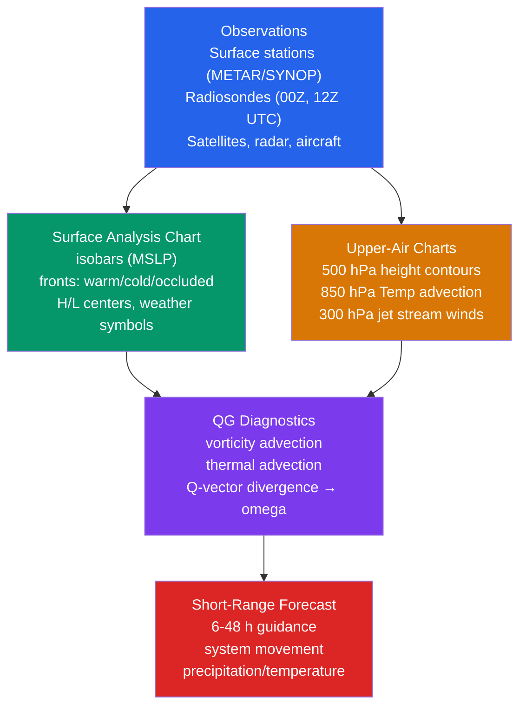

# 🗺️ Synoptic Meteorology and Weather Maps

> [!abstract] TL;DR
> **Synoptic meteorology** analyzes the large-scale ($1000$–$10000$ km) state of the atmosphere *simultaneously* across a wide region — the word *synoptic* means "seen together" — to understand and forecast weather. Its primary tools are **surface analysis charts** (isobars of mean sea level pressure, fronts, high/low centers, and station-model weather symbols) and **upper-air charts** (500 hPa geopotential-height contours, 850 hPa temperature, 300 hPa jet-stream winds), supplemented by **radiosonde soundings**. The central idea is that the **geopotential-height pattern governs the wind**: air flows nearly along the height contours, so **troughs** (height minima) produce downstream convergence and lift while **ridges** (height maxima) produce subsidence. Forecasters diagnose vertical motion — where clouds and rain will form — from **vorticity advection**, **thermal advection**, and, most cleanly, the **Q-vector** form of the quasi-geostrophic omega equation ($\nabla\cdot\mathbf Q < 0 \Rightarrow$ ascent).

---

## Intuition — analogy FIRST

Picture a synoptic chart as a **single snapshot photograph of the entire atmosphere**, taken at the same instant from horizon to horizon. The isobaric height contours on that photograph are exactly like the **elevation lines on a topographic map** — except the "landscape" is a landscape of *pressure*. Where the contours crowd together the terrain is steep; where they spread apart it is gently rolling.

Now add the one rule that makes the map come alive: **air flows along these contours** (turned sideways by the Earth's rotation), racing where the slope is steep and drifting where it is shallow — like a river that has been forced to run *around* the hills instead of straight down them. A **500 hPa trough is a valley in this atmospheric mountain range**; a **ridge is a summit**. On the downstream (eastern) flank of the valley the air is forced to *climb*, and climbing air cools, condenses, and rains. A forecaster "reads" the map the way a navigator reads a nautical chart — not looking at a single point, but seeing at a glance *where the weather systems are, which way they are steered, and how fast they will arrive.*

---

## How It Works

Synoptic analysis is a layered pipeline: a global network of **observations** taken at synchronized times is plotted and contoured into **surface** and **upper-air charts**; those charts are then interrogated with **quasi-geostrophic (QG) diagnostics** to locate the forcing for vertical motion; and the result is a **short-range forecast** of where systems will move and where precipitation will fall. The diagram shows how the layers feed one another.



### The synoptic scale

"Synoptic" is a **scale**, not just a habit of looking at broad regions. Systems of horizontal extent $L \sim 10^{3}$–$10^{4}$ km and lifetime $\sim$ days — midlatitude cyclones, anticyclones, fronts, upper troughs and ridges — have a **Rossby number** $Ro = U/(fL)\sim 0.1$, which is precisely the regime where **geostrophic and quasi-geostrophic balance apply**. This is why the same charts that *display* the flow can also be *diagnosed* with QG theory: the scale that makes the map coherent is the scale that makes the balance valid. Smaller (mesoscale) features — individual thunderstorms, sea breezes — have $Ro\sim1$ and fall through the synoptic net.

### The observing network and synchronized times

A synoptic chart only works if every observation is taken at the **same moment**, so the World Meteorological Organization fixes standard times in **UTC (Zulu, "Z")**:

- **SYNOP** — surface land-station reports (pressure, temperature, dew point, wind, cloud, weather), transmitted hourly or 3-hourly.
- **METAR** — aviation surface reports at airports, issued every hour (or more often), the backbone of the surface plot.
- **Radiosonde / RAOB (rawinsonde)** — balloon-borne soundings launched at **00Z and 12Z** worldwide, giving the vertical profile of temperature, humidity, and (via GPS/radar tracking) wind. These twice-daily launches define the *upper-air* analysis times.
- **Aircraft (AMDAR / PIREP)**, **ships and buoys**, **wind profilers**, **satellite** radiances and atmospheric-motion vectors, and **radar** fill in between the fixed stations.

### The surface analysis chart

The surface chart plots each station's data as a **station model** and then draws:

- **Isobars** of **mean sea level pressure (MSLP)**, usually every 4 hPa (…1000, 1004, 1008…). Their *spacing* encodes wind speed: tightly packed isobars mean a strong pressure gradient and strong (geostrophic) wind.
- **Pressure centers** — **H** (high: subsidence, clearing, light winds) and **L** (low: convergence, ascent, clouds and precipitation).
- **Fronts** — boundaries between air masses, each with a standard symbol:
  - **Cold front** (blue, triangles pointing in the direction of motion) — cold air advancing, steep lift, narrow band of showers/thunderstorms.
  - **Warm front** (red, semicircles) — warm air overriding, gentle lift, broad shield of layered cloud and steady precipitation.
  - **Occluded front** (purple, alternating triangles and semicircles) — a cold front overtaking a warm front late in a cyclone's life.
  - **Stationary front** (alternating red semicircles and blue triangles on opposite sides) — a boundary that is not moving.
- **Pressure tendency** — the 3-hour change in station pressure, a leading indicator of intensification or movement.

### Reading the station model

Each station is a compact glyph. The essentials:

- **Wind barb** — a shaft pointing *from* the direction the wind blows, with feathers coding speed: a **short barb = 5 kt**, a **long barb = 10 kt**, a **filled pennant = 50 kt** (add them up; calm is an open circle).
- **Temperature** (upper left) and **dew point** (lower left), in the local unit convention.
- **Sky cover** — the central circle is shaded in proportion to cloud fraction (open = clear, filled = overcast).
- **Present weather** symbol between temperature and dew point (rain, snow, fog, thunderstorm…).
- **Sea-level pressure** (upper right), abbreviated: "**148**" means **1014.8 hPa** (prepend 9 or 10 to get the value nearest 1000).
- **Pressure tendency and change** (lower right) — magnitude plus a trace of the 3-hour barograph.

### Upper-air charts

Above the surface, meteorologists work on **isobaric (constant-pressure) surfaces** and map the **geopotential height** $Z$ of that surface (in **geopotential meters, gpm**). A low height is a "dip" in the pressure surface — the upper-air equivalent of low pressure. The standard levels each have a job:

- **850 hPa (~1.5 km)** — above the friction layer; the **temperature** field here is used to diagnose **warm and cold advection**, and the level tracks low-level thermal boundaries and moisture.
- **700 hPa (~3 km)** — vertical motion and mid-level moisture; often the level of maximum ascent.
- **500 hPa (~5.5 km)** — the **steering level**. Its **height contours** define the trough/ridge pattern that advects surface systems, and its **absolute vorticity** field is the primary input to the omega diagnosis.
- **300 / 250 / 200 hPa (~9–12 km)** — the **jet stream** level; wind speed maxima (jet streaks) and their entrance/exit regions organize upper-level divergence.

Because these surfaces slope, **height contours on an upper-air chart act like isobars**: the geostrophic wind blows nearly along them, low heights to the left (NH), fast where contours are packed.

### From height contours to wind: the geostrophic relation

On a constant-pressure surface the geostrophic wind is set by the **slope of the height field**:

$$
u_g = -\frac{g}{f}\frac{\partial Z}{\partial y}, \qquad v_g = \frac{g}{f}\frac{\partial Z}{\partial x}
\qquad\Longleftrightarrow\qquad
\mathbf v_g = \frac{g}{f}\,\hat{\mathbf k}\times\nabla_p Z,
$$

where $Z$ is geopotential height, $g$ gravity, and $f=2\Omega\sin\varphi$ the Coriolis parameter. The wind is **perpendicular to the height gradient** — i.e. it runs *along* the contours. This single fact is what lets a forecaster "see the wind" simply by looking at a 500 hPa map.

### Troughs, ridges, and vertical motion

- A **trough** is a southward (equatorward) dip of the height contours — a "valley." Downstream (east) of the trough axis the flow carries air toward *lower* absolute vorticity, giving **positive vorticity advection (PVA)** aloft, upper-level **divergence**, and hence **ascent** — clouds and precipitation.
- A **ridge** is a poleward bulge — a "summit." Downstream of the ridge axis the flow gives **negative vorticity advection (NVA)**, convergence aloft, and **subsidence** — clearing.
- A **cutoff low** is a trough that has pinched off from the main westerly flow into a closed, slow-moving cyclonic vortex (a "cold pool" aloft), often producing prolonged unsettled weather.

The practical rule that falls out of this: **surface precipitation is usually found east of the 500 hPa trough axis** and clearing west of it.

### Thermal wind, thickness, and temperature advection

The geostrophic wind changes with height wherever temperature varies horizontally — the **thermal wind** relation:

$$
\frac{\partial \mathbf v_g}{\partial \ln p} = -\frac{R}{f}\,\hat{\mathbf k}\times\nabla_p T .
$$

Integrated between two pressure surfaces this becomes the **thickness** $\Delta Z = Z_{\text{top}}-Z_{\text{bottom}}$, which is directly proportional to the *mean temperature* of the layer:

$$
\Delta Z = \frac{R}{g}\,\overline{T}\,\ln\!\frac{p_{\text{bottom}}}{p_{\text{top}}} .
$$

The **1000–500 hPa thickness** is the workhorse — high thickness = warm column, low thickness = cold column. **Warm advection** (the wind blowing across thickness contours toward higher thickness) tends to force **rising motion**; **cold advection** forces **sinking**. Because the geostrophic wind turns *clockwise* with height in warm advection and *counterclockwise* in cold advection (NH), a forecaster can read advection directly by comparing the 850 hPa wind to the 500 hPa wind at a point.

### Diagnosing vertical motion: the QG omega equation

The **quasi-geostrophic (QG) omega equation** recovers the (unobservable) vertical velocity $\omega = Dp/Dt$ from the observed height and temperature fields. In its traditional **two-term** form:

$$
\left(\sigma\nabla^2 + f_0^2\frac{\partial^2}{\partial p^2}\right)\omega
= \underbrace{f_0\frac{\partial}{\partial p}\!\Big[\mathbf V_g\!\cdot\!\nabla(\zeta_g+f)\Big]}_{\text{differential vorticity advection}}
\;+\;\underbrace{\frac{R}{p}\nabla^2\!\Big[\mathbf V_g\!\cdot\!\nabla T\Big]}_{\text{thermal advection}} .
$$

The left side behaves like $-\omega$ for wave-like disturbances, so a **positive right side forces ascent** ($\omega<0$). Reading the two terms: ascent is forced where **cyclonic vorticity advection increases with height** (PVA strengthening upward, i.e. ahead of an upper trough) and where there is **warm-air advection**. This is the theoretical backbone of every "trough east / warm advection" forecasting rule.

### The Q-vector shortcut

The trouble with the two-term form is that vorticity advection and thermal advection often **partly cancel**, so estimating each separately from a map is error-prone. **Hoskins, Draghici & Davies (1978)** rewrote the forcing as the divergence of a single **Q-vector**:

$$
\left(\sigma\nabla^2 + f_0^2\frac{\partial^2}{\partial p^2}\right)\omega = -2\,\nabla\cdot\mathbf Q,
\qquad
\mathbf Q = -\frac{R}{p}\left(\frac{\partial \mathbf V_g}{\partial x}\!\cdot\!\nabla T,\ \frac{\partial \mathbf V_g}{\partial y}\!\cdot\!\nabla T\right).
$$

Now the rule is a single clean statement: **convergence of Q-vectors ($\nabla\cdot\mathbf Q<0$) forces ascent; divergence forces descent.** No cancellation, one field to draw. Q-vectors point *toward* rising motion, and along a front they reveal the ageostrophic **transverse circulation** that produces frontal cloud bands.

---

## Key Concepts / Details

### Secondary Level

- **What a synoptic chart shows.** A weather map is a same-time picture of a whole region: lines of equal pressure (isobars), the **H** and **L** pressure centers, and the fronts that separate warm from cold air.
- **Isobar spacing → wind speed.** Closely packed isobars mean a steep pressure "slope" and **strong winds**; widely spaced isobars mean light winds. This is the single most useful thing to read off a surface map.
- **Highs vs lows.** Near a **low (L)** air converges and rises, so expect **clouds, wind, and precipitation**; near a **high (H)** air sinks, so expect **fair, settled weather**.
- **Fronts.** A **cold front** (blue triangles) brings a sharp, brief burst of showers and a wind shift; a **warm front** (red semicircles) brings a long, gentle spell of steady rain ahead of it.
- **Systems move west-to-east.** In the midlatitudes, weather systems are generally **steered from west to east** by the upper-level westerlies, so tomorrow's weather is often visible on today's map to your west.

### Undergraduate Level

**The station model in full.** Wind barbs code speed by feathers — **short barb $=5$ kt, long barb $=10$ kt, pennant $=50$ kt** — and point *from* the wind's source; temperature and dew point sit to the left, sea-level pressure (coded, e.g. "148" $\to$ 1014.8 hPa) to the upper right, sky cover as a shaded circle, present weather as a symbol, and the 3-hour pressure tendency to the lower right.

**MSLP reduction.** Stations at different elevations must have their **station pressure reduced to a common sea-level datum (MSLP)** before isobars mean anything; the reduction uses the hypsometric relation with an assumed column temperature, and it can shift the value by tens of hPa in the mountains.

**Isobar spacing $\to$ geostrophic wind.** From $\mathbf v_g = \frac{1}{f\rho}\hat{\mathbf k}\times\nabla_h p$, wind speed is proportional to $|\nabla p|$ — halve the isobar spacing and you double the geostrophic wind.

**Isobaric charts and $Z(p)$.** On a constant-pressure surface, $u_g=-\frac{g}{f}\frac{\partial Z}{\partial y},\ v_g=\frac{g}{f}\frac{\partial Z}{\partial x}$ — height contours *are* streamlines of the geostrophic wind. The **500 hPa trough–ridge pattern** is the master chart for locating and steering surface systems.

**Thickness charts.** The **1000–500 hPa thickness** is proportional to layer-mean temperature. **Increasing thickness (warm advection) $\to$ rising motion**; **decreasing thickness (cold advection) $\to$ sinking motion**. Overlaying thickness on the surface chart is the classic way to see the thermal structure of a cyclone.

**Norwegian cyclone model on the map.** A mature extratropical cyclone appears as a surface **L** with a **warm sector** wedged between a trailing **cold front** and a leading **warm front**, capped by an **occlusion** near the center — the picture the Bergen School distilled from synoptic charts (see [[Fronts_and_Extratropical_Cyclones]]).

**Rule of thumb.** For a westerly-flow disturbance, **precipitation lies east of the 500 hPa trough axis** (PVA / ascent) and clearing lies west of it (NVA / subsidence).

### Graduate Level

**QG theory.** An expansion of the primitive equations in the Rossby number that keeps geostrophic advection and predicts the small ageostrophic circulation. Its two diagnostic pillars are **QG potential vorticity conservation** and the **omega equation**, which together let one recover the *entire* balanced evolution from the height field alone.

**Two-term omega equation.** $\left(\sigma\nabla^2 + f_0^2\partial_{pp}\right)\omega = f_0\,\partial_p[\mathbf V_g\!\cdot\!\nabla(\zeta_g+f)] + \frac{R}{p}\nabla^2[\mathbf V_g\!\cdot\!\nabla T]$. The forcing is **differential vorticity advection** plus the Laplacian of **thermal advection**; ascent where PVA increases with height and where warm advection occurs.

**Q-vector formulation.** $\mathbf Q = -\frac{R}{p}\big(\partial_x\mathbf V_g\!\cdot\!\nabla T,\ \partial_y\mathbf V_g\!\cdot\!\nabla T\big)$ and $\left(\sigma\nabla^2 + f_0^2\partial_{pp}\right)\omega = -2\nabla\cdot\mathbf Q$. Because the *single* Q-field already encodes the net effect, it **removes the cancellation** between the vorticity- and thermal-advection terms; $\nabla\cdot\mathbf Q<0 \Rightarrow$ ascent. Q-vectors are the practical tool for diagnosing synoptic vertical motion from analyzed height/temperature fields.

**Development theory.** **Sutcliffe's** development theorem and **Petterssen's** development equation relate the deepening of a surface cyclone to the **differential vorticity advection** between the steering level and the surface (plus thermal and diabatic contributions): a surface low deepens beneath the region of upper-level PVA/divergence just downstream of the 500 hPa trough.

**PV thinking (Hoskins, McIntyre & Robertson 1985).** In the potential-vorticity view, an **upper-level PV anomaly** (a stratospheric intrusion / trough) induces a balanced circulation reaching to the surface; where that circulation overlies a **surface temperature (boundary) anomaly**, the two mutually amplify — the modern, unified account of baroclinic cyclogenesis. **PV invertibility** means that, given the PV distribution and a balance condition, the full wind and temperature fields (and hence $\omega$ via the omega equation) can be recovered.

**Data assimilation and analysis cycles.** The gridded charts forecasters use are actually **analyses** produced by blending a short-range model forecast (the *background*) with new observations. **4DVar** minimizes a cost function measuring the misfit to observations *over a time window*, using the model dynamics as a constraint, so each observation is placed at its correct time; the result initializes the next NWP run (see [[Numerical_Weather_Prediction]]). **OSSEs** (Observing System Simulation Experiments) test the value of hypothetical future observing systems by assimilating *simulated* observations drawn from a "nature run."

---

## Python demo — 500 hPa height field, geostrophic wind, and where ascent is forced

The script builds a **synthetic 500 hPa geopotential-height field** over a North-America-sized domain: heights fall poleward (a mean north–south slope) with a **sinusoidal trough–ridge wave** superposed. It computes the **geostrophic wind** $u_g=-\frac{g}{f}\partial_y Z,\ v_g=\frac{g}{f}\partial_x Z$ by finite differencing $Z(x,y)$, then the **geostrophic relative vorticity** $\zeta_g$ and its **advection** $-\mathbf V_g\!\cdot\!\nabla(\zeta_g+f)$. It plots blue height contours with wind vectors, marks the **trough (T)** and **ridge (R)** axes, and shades the region of **positive vorticity advection (PVA) → forced ascent** — which lands, as theory predicts, **east of each trough**.

```python
# Synthetic 500 hPa chart: geostrophic wind and forced-ascent diagnosis.
# Runnable with numpy + matplotlib.
import numpy as np
import matplotlib.pyplot as plt

# ---- Constants (midlatitude) ----
g = 9.81            # gravity [m/s^2]
f = 1.0e-4          # Coriolis parameter [1/s]  (~45 deg N)

# ---- Domain: ~6000 km (west->east) x 4000 km (south->north) ----
Lx, Ly = 6.0e6, 4.0e6
nx, ny = 121, 81
x = np.linspace(0.0, Lx, nx)
y = np.linspace(0.0, Ly, ny)
X, Y = np.meshgrid(x, y)          # shape (ny, nx); axis 0 = y, axis 1 = x

# ---- Synthetic 500 hPa geopotential height Z(x,y) [gpm] ----
Z0 = 5760.0                       # reference height near the south [gpm]
S  = 90.0 / 1.0e6                 # meridional slope: ~90 gpm fall per 1000 km
A  = 130.0                        # trough-ridge wave amplitude [gpm]
k  = 2.0 * np.pi / Lx * 2.0       # two full waves across the domain
Z  = Z0 - S * Y + A * np.sin(k * X)

# ---- Geostrophic wind by finite differences of Z ----
dZdy, dZdx = np.gradient(Z, y, x)         # axis 0 -> d/dy, axis 1 -> d/dx
ug = -(g / f) * dZdy
vg =  (g / f) * dZdx

# ---- Absolute vorticity and its advection by the geostrophic wind ----
dvgdy, dvgdx = np.gradient(vg, y, x)
dugdy, dugdx = np.gradient(ug, y, x)
zeta = dvgdx - dugdy                        # geostrophic relative vorticity
eta  = f + zeta                             # absolute vorticity
detady, detadx = np.gradient(eta, y, x)
vort_adv = -(ug * detadx + vg * detady)     # >0 = PVA -> forced ascent

# ---- Analytic trough / ridge axes of the sin(kx) wave ----
# minima of sin(kx) -> troughs; maxima -> ridges
trough_x = np.array([3/8, 7/8]) * Lx        # sin = -1
ridge_x  = np.array([1/8, 5/8]) * Lx        # sin = +1

# ---- Plot ----
fig, ax = plt.subplots(figsize=(11, 7))

# forced-ascent region: shade where vorticity advection is positive
ax.contourf(X/1e3, Y/1e3, vort_adv, levels=[0.0, vort_adv.max()],
            colors=['#fde68a'], alpha=0.6)

# 500 hPa height contours (blue solid)
cs = ax.contour(X/1e3, Y/1e3, Z, levels=np.arange(5300, 5820, 30),
                colors='blue', linewidths=1.3)
ax.clabel(cs, inline=True, fontsize=8, fmt='%d')

# geostrophic wind vectors (subsampled for legibility)
sk = (slice(None, None, 5), slice(None, None, 7))
ax.quiver(X[sk]/1e3, Y[sk]/1e3, ug[sk], vg[sk],
          color='black', scale=700, width=0.003)

# trough (T) and ridge (R) axes
for xt in trough_x:
    ax.axvline(xt/1e3, color='red', ls='--', lw=1.6)
    ax.text(xt/1e3, Ly/1e3*0.965, 'T', color='red', ha='center',
            va='top', fontsize=13, fontweight='bold')
for xr in ridge_x:
    ax.axvline(xr/1e3, color='green', ls='--', lw=1.6)
    ax.text(xr/1e3, Ly/1e3*0.965, 'R', color='green', ha='center',
            va='top', fontsize=13, fontweight='bold')

ax.set_xlabel('x  [km]  (west  ->  east)')
ax.set_ylabel('y  [km]  (south -> north)')
ax.set_title('Synthetic 500 hPa chart: heights (blue), geostrophic wind '
             '(arrows)\nYellow = positive vorticity advection -> forced ascent '
             '(east of each trough T)')
ax.set_aspect('equal')
plt.tight_layout()
plt.show()

# ---- Console diagnostics ----
print(f"Mean westerly u_g:        {ug.mean():6.1f} m/s")
print(f"Peak meridional |v_g|:    {np.max(np.abs(vg)):6.1f} m/s")
print(f"Max cyclonic vorticity:   {zeta.max():.2e} 1/s  (at a trough axis)")
print(f"PVA (ascent) covers:      {100*np.mean(vort_adv > 0):4.1f} % of the domain")
```

**What to expect.** The console reports a realistic mean westerly $u_g$ (heights fall northward $\Rightarrow$ westerlies), peak meridional winds of order tens of m/s where contours are packed, maximum cyclonic vorticity sitting *on* the trough axes, and PVA covering roughly half the domain. The figure shows wavy blue height contours, wind arrows blowing **along** them, and **yellow ascent shading immediately east of each red trough axis (T)** — the graphical proof of the "precipitation east of the 500 hPa trough" rule.

---

## Real-World Notes

- **The Bergen School (Bjerknes & co., 1920s).** In the wake of WWI, **Vilhelm Bjerknes**, his son **Jacob Bjerknes**, and **Tor Bergeron** in Bergen, Norway, distilled the dense Scandinavian observing network into the **Norwegian cyclone model** and introduced **front analysis** (warm, cold, occluded). It was the single most important conceptual advance in forecasting before the numerical era — the visual grammar every weather map still uses.
- **The Global Telecommunication System (GTS).** The WMO's GTS distributes roughly **50,000 surface** and **~1,000 radiosonde** observations per day worldwide, delivered within minutes of observation, so that centers everywhere can construct a coherent synoptic picture and feed the assimilation cycle.
- **Radiosondes remain the vertical backbone.** Despite satellites, the twice-daily **RAOB sounding at 1000+ stations** (00Z/12Z) is still the primary *in-situ* vertical profile of temperature, humidity, and wind — the ground truth against which satellite retrievals and model backgrounds are checked.
- **Superstorm Sandy (2012) and the "Euro."** The **ECMWF** 500 hPa forecasts showed Sandy **recurving into the US East Coast about seven days ahead**, while several American runs kept it out to sea. The episode became the textbook demonstration that upper-air pattern prediction — and model quality — has enormous societal value.
- **The 5400 m thickness line.** The **1000–500 hPa thickness of ~5400 m** is a remarkably reliable rain/snow discriminator in cool-season storms: surface precipitation tends to fall as **snow where thickness is below ~5400 m** and **rain above it** — a rule of thumb forecasters still overlay on every winter surface chart.

---

## Common Pitfalls

1. **"The geostrophic wind flows across the isobars."** It does **not** — it flows *along* them. The small **ageostrophic (cross-isobar) component** is what actually produces convergence, divergence, and vertical motion; ignoring it means you can draw the wind but never explain the weather. Weather *development* lives entirely in the ageostrophic part.
2. **Equating the upper trough with the surface front.** A 500 hPa trough and a surface cyclone/front are **coupled but not co-located**: in a developing baroclinic system the **upper trough typically lags several degrees of longitude *behind* (west of) the surface low**, and this westward tilt with height is exactly what makes the system deepen. Overlaying them as if identical mislocates the forcing.
3. **Reading absolute pressure instead of tendency.** For short-range work, the **3-hour pressure tendency** (is the barometer rising or falling, and how fast?) is often more informative than the pressure *value*. Falling pressure ahead of an approaching low signals deterioration long before the absolute number looks alarming.
4. **Confusing station pressure with MSLP.** The **raw station pressure** an instrument reads is *not* the sea-level pressure plotted on the chart. The reduction to sea level depends on station elevation and an assumed column temperature and can differ by **20+ hPa in mountainous terrain** — comparing un-reduced pressures across elevations produces spurious "lows."
5. **Splitting the omega forcing into vorticity and thermal advection.** In the two-term QG omega equation those contributions **frequently cancel**, so estimating each separately from a map gives an unreliable, sometimes sign-wrong answer. **Use the Q-vector form** ($\nabla\cdot\mathbf Q$) instead: it packages the net forcing into one field with no cancellation.

---

## Related Concepts

- [[_MOC_Weather_Forecasting]] — section map for the weather-forecasting chapter of this vault.
- [[Numerical_Weather_Prediction]] — the models that ingest these same observations (via data assimilation) and integrate the primitive equations forward; synoptic charts are both their input analysis and their output.
- [[Remote_Sensing_Radar_and_Satellites]] — the space- and ground-based observing systems that fill the gaps between fixed surface and radiosonde stations on the synoptic chart.
- [[Ensemble_Forecasting_and_Uncertainty]] — many perturbed runs of the model that turn a single deterministic chart into a probabilistic forecast; the natural successor to reading one synoptic map.
- [[Fronts_and_Extratropical_Cyclones]] — the air-mass boundaries and cyclone life cycle whose surface signatures the analysis chart is built to depict (the Norwegian model).
- [[Pressure_Gradient_Force_and_Winds]] — why isobar/height-contour spacing sets wind speed, and where the ageostrophic flow (hence vertical motion) comes from.
- [[Coriolis_Effect_and_Geostrophic_Balance]] — the deflecting force behind "wind flows along the contours," the balance that makes the synoptic scale diagnosable.
- [[Jet_Streams_and_Upper_Level_Flow]] — the 300 hPa jet and its jet-streak entrance/exit divergence patterns that couple to surface development.
- [[Atmospheric_Temperature_and_Lapse_Rates]] — the thermal structure that thickness charts measure and that drives thermal-wind shear and advection.
- [[_MOC_Physics_Master]] — cross-vault entry point to the underlying mechanics.
- [[Newtons_Laws_and_Kinematics]] — the momentum balance ($\mathbf F=m\mathbf a$ for an air parcel) underlying geostrophic and QG theory.
- [[Wave_Motion_and_Properties]] — troughs and ridges are Rossby waves; the same wave concepts (wavelength, phase speed, group velocity) describe their downstream propagation.
- [[_MOC_SS_Master]] — cross-vault entry point to signal analysis.
- [[Fourier_Transform]] — the spectral view of a height field as a sum of zonal waves; wavenumber decomposition is standard in synoptic and NWP diagnostics.

---

## Review Questions

**Secondary.** What do the isobars on a weather map show, and how would you use their *spacing* to estimate how strong the wind is? Near a **low-pressure** center, what kind of weather do you expect, and how does it differ from the weather near a **high**? In the midlatitudes, which way do weather systems usually travel, and how does that help you forecast tomorrow?

**Undergraduate.** Explain the relationship between **500 hPa height contours** and the **geostrophic wind**, including why the wind blows along (not across) the contours and why crowded contours mean strong wind. Using a **1000–500 hPa thickness chart**, describe how you would distinguish **warm advection** from **cold advection**, and state which one favors rising motion. Finally, relative to a **500 hPa trough axis**, where would you expect ascent, cloud, and precipitation — and why?

**Graduate.** Starting from the two-term QG omega equation, **derive the Q-vector formulation** $\big(\sigma\nabla^2 + f_0^2\partial_{pp}\big)\omega=-2\nabla\cdot\mathbf Q$ and explain *why* the Q-vector form **avoids the cancellation problem** between the vorticity- and thermal-advection terms. Then, given a map showing a **500 hPa trough with cold advection on its upstream (western) side**, sketch the expected pattern of **Q-vectors and their divergence**, identify where **forced ascent is strongest**, and predict where **precipitation** will fall relative to the trough axis.

---

## Sources

- Bluestein, H. B. — *Synoptic-Dynamic Meteorology in Midlatitudes*, Vol. I (1992) & Vol. II (1993), Oxford University Press. The standard graduate reference for synoptic analysis, QG theory, and Q-vectors.
- Hoskins, B. J., & James, I. N. — *Fluid Dynamics of the Midlatitude Atmosphere* (2014), Wiley-Blackwell. Rossby waves, PV thinking, baroclinic development, and the omega equation.
- Sanders, F., & Bosart, L. F. (1985) — "Mesoscale structure in the megalopolitan snowstorm of 11–12 February 1983," *J. Atmos. Sci.*, 42, 1050–1061. A classic case study of synoptic-to-mesoscale diagnosis.
- Hoskins, B. J., Draghici, I., & Davies, H. C. (1978) — "A new look at the ω-equation," *Q. J. R. Meteorol. Soc.*, 104, 31–38. Origin of the Q-vector formulation.
- Holton, J. R., & Hakim, G. J. — *An Introduction to Dynamic Meteorology* (5th ed.), Academic Press. QG omega equation, geostrophic and thermal wind, PV.

---

#Meteorology #SynopticMeteorology #WeatherMaps #500hPa #QGTheory
