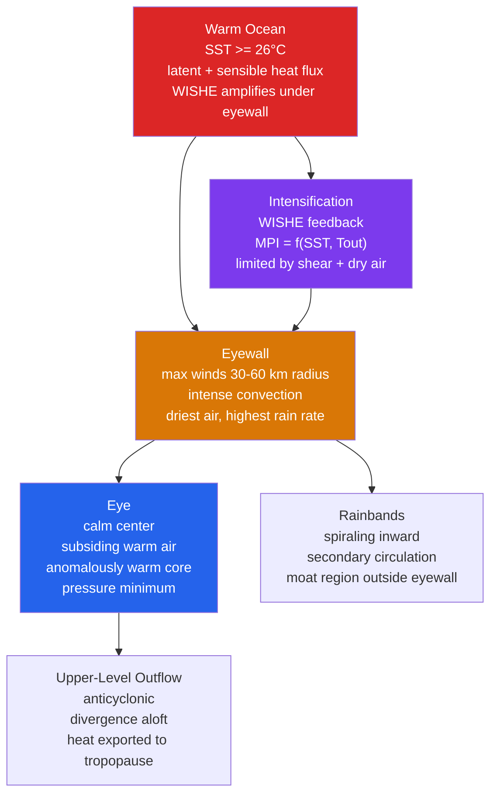

# 🌀 Tropical Cyclones and Hurricanes

> [!abstract] TL;DR
> **Tropical cyclones** — called **hurricanes** in the Atlantic and eastern Pacific, **typhoons** in the western Pacific, and just **cyclones** in the Indian Ocean — are **warm-core rotating storms** that draw their energy from the **latent heat released when moisture evaporated from a warm ocean (SST $\gtrsim 26\,^\circ$C) condenses in deep convection**. Kerry Emanuel's **Maximum Potential Intensity (MPI)** theory (1986) treats the storm as a **Carnot heat engine** running between the warm sea surface ($T_s$) and the cold upper-troposphere outflow ($T_o \sim -70\,^\circ$C), giving $V_{\max}^2 = \tfrac{C_k}{C_D}\,\tfrac{T_s-T_o}{T_o}\,(k_s^\* - k)$. Wind speed is graded on the **Saffir–Simpson scale** (Cat 1 $\ge 33$ m/s, Cat 5 $\ge 70$ m/s). **Track** is set mostly by the large-scale **steering flow** (deep-layer mean, often diagnosed near 500–700 hPa) plus a **poleward-and-westward beta drift**; **intensity** is governed by SST, **vertical wind shear**, mid-level moisture, and inner-core dynamics through the **WISHE** (Wind-Induced Surface Heat Exchange) feedback. The single greatest killer is not the wind but the **storm surge** — a wind-driven wall of seawater whose height depends on the storm's intensity, size, forward speed, coastal bathymetry, and landfall angle.

---

## Intuition — analogy FIRST

Picture a **giant atmospheric steam engine bolted to the ocean**. The warm sea is the **boiler**: every square metre of $\ge 26\,^\circ$C water evaporates moisture, loading the near-surface air with the enormous energy hidden in water vapour (the *latent heat* of vaporization, ~2.5 million joules per kilogram). That fuel-laden air spirals inward, is thrown violently upward in the ring of thunderstorms around the centre, and its vapour condenses — releasing all that stored heat and driving the updraughts even harder. High above, near the tropopause, the spent air fans outward and radiates its heat to space: this cold, high anvil is the engine's **condenser**. The spiralling surface winds are the engine's **drive shaft**, and — this is the crucial twist — **those same winds do the work of evaporating more water**, so the engine *feeds itself*: faster winds → more evaporation → more heat → lower pressure → faster winds. That runaway loop is **WISHE**.

The power you can extract from any heat engine is set by the temperature *difference* between boiler and condenser. A tropical cyclone runs on roughly $T_s \approx 300$ K at the sea surface and $T_o \approx 200$ K at the outflow — a Carnot efficiency near a third, extraordinary for a natural machine. Slam a lid on the boiler (cool the water, feed in dry air, or let **vertical wind shear** tilt and ventilate the chimney so the heat leaks out the side) and the engine loses power. And at the very heart of the machine sits its most deceptive feature: the **eye**, a patch of sinking, warming air that clears the sky and stills the wind at the exact centre — a false calm ringed, just 30–60 km away, by the planet's most violent sustained winds in the **eyewall**.

---

## How It Works

A tropical cyclone is the atmosphere's most efficient converter of ocean heat into wind. It needs a warm ocean to load the boundary-layer air with moist enthalpy, weak vertical shear so the convective "chimney" stays vertical and stacked over the surface low, and a seed disturbance with enough rotation to organize the convection into a single axisymmetric vortex. Once organized, the **secondary (overturning) circulation** — inflow at the surface, ascent in the eyewall, outflow aloft, and weak subsidence in the eye — couples to the **primary (tangential) circulation** through the WISHE feedback, and the storm intensifies toward its thermodynamic speed limit, the MPI. The diagram traces the energy cycle from ocean to outflow.



### The six ingredients for tropical cyclogenesis

Gray's classic genesis parameters, still the working checklist, require **all** of the following at once — warm water alone is never enough:

1. **Warm ocean, deep enough:** SST $\ge 26\,^\circ$C through a mixed layer $\gtrsim 50$ m, so the storm's own churning does not immediately cool its fuel supply.
2. **Conditional instability through a deep layer:** a troposphere that lets convection reach the tropopause.
3. **Mid-troposphere moisture:** dry air aloft kills convection by loading downdraughts with low-entropy air.
4. **Coriolis force ($|\varphi| \gtrsim 5^\circ$):** rotation to spin surface convergence into a balanced vortex. **This is why no tropical cyclone ever forms on the equator**, where $f = 2\Omega\sin\varphi = 0$.
5. **Weak vertical wind shear ($\lesssim 10$ m/s over 850–200 hPa):** so the warm core and convective chimney stack vertically instead of being sheared apart.
6. **A pre-existing disturbance:** the vorticity seed — most Atlantic hurricanes grow from **African easterly waves** shed by the African Easterly Jet.

### Warm core vs cold core — the defining structural distinction

The single fact that separates a hurricane from the [[Fronts_and_Extratropical_Cyclones|midlatitude cyclone]] is the **thermal structure of its core**:

- A **tropical cyclone is warm-core and non-frontal**: it is *warmest at its centre at every level*, with a temperature anomaly of **+10 to +15 K near 300 hPa** in the eye. By the **thermal wind** relation, a warm core means the cyclonic circulation is *strongest at the surface and decays with height*, reversing to anticyclonic outflow near the tropopause. Its energy source is **latent heat from the ocean**.
- An **extratropical cyclone is cold-core and frontal**: it draws energy from the **horizontal temperature contrast** (available potential energy) of the midlatitude baroclinic zone, its circulation *intensifies with height*, and it is organized around fronts. When a hurricane moves poleward over cold water it often undergoes **extratropical transition**, losing its warm core and symmetric eyewall while sometimes expanding and re-intensifying as a baroclinic storm.

### Emanuel's Maximum Potential Intensity: the storm as a Carnot engine

Idealize a mature, axisymmetric, steady storm as a closed thermodynamic cycle followed by an air parcel:

1. **Isothermal expansion** inbound along the sea surface at $T_s$: the parcel gains enthalpy $k$ from the ocean (evaporation dominates) at nearly constant temperature.
2. **Adiabatic expansion** upward in the eyewall: the parcel ascends moist-adiabatically to the outflow.
3. **Isothermal compression** outbound near the tropopause at $T_o$: heat is exported to the environment / radiated to space.
4. **Adiabatic compression**: the parcel slowly subsides far away, closing the loop.

The thermodynamic (Carnot) efficiency of this cycle is
$$
\eta = \frac{T_s - T_o}{T_s}.
$$
Setting the **mechanical power generated** by the engine equal to the **frictional dissipation** in the boundary layer at the radius of maximum wind gives the **Maximum Potential Intensity**:
$$
\boxed{\,V_{\max}^2 \;=\; \frac{C_k}{C_D}\,\frac{T_s - T_o}{T_o}\,\bigl(k_s^\* - k\bigr)\,}
$$
where $C_k$ is the **enthalpy (heat) exchange coefficient**, $C_D$ the **drag coefficient**, $k_s^\*$ the **saturation enthalpy at the sea-surface temperature and central pressure**, and $k$ the actual enthalpy of near-surface air. Everything the storm can become is packed into three factors: the **efficiency** ($T_s, T_o$), the **air–sea thermodynamic disequilibrium** ($k_s^\* - k$), and the **exchange ratio** $C_k/C_D$.

### WISHE: the feedback that spins the engine up

**Wind-Induced Surface Heat Exchange** is the positive feedback that turns a weak disturbance into a hurricane. The surface enthalpy flux scales as $F_k \propto C_k\,\rho\,|V|\,(k_s^\* - k)$: **stronger winds pull more heat out of the ocean**. That extra heat fuels stronger eyewall convection, which lowers the central pressure, which (through gradient-wind balance) increases the winds — closing the loop. Because the intensification rate is proportional to the wind itself, the linearized response is **exponential growth**, $V(t)\sim V_0 e^{\gamma t}$, until the storm bumps against its MPI ceiling or an external brake (shear, dry air, land, or a cold ocean wake) intervenes.

### Rapid intensification (RI) and eyewall replacement cycles (ERC)

- **Rapid intensification** is operationally defined as an increase in maximum sustained wind of **$\ge 15$ m/s ($\approx 30$ kt) in 24 hours**. It is the **hardest thing in tropical forecasting** and tends to occur when a storm is well below its MPI over very warm water with low shear and moist inner-core air, often triggered by bursts of deep convection and axisymmetrization of vorticity near the centre.
- **Eyewall replacement cycles** happen in strong storms: a **secondary (outer) eyewall** forms in a rainband, contracts, and **cuts off the inflow** feeding the inner eyewall, which then decays. Intensity **temporarily drops by 10–20 m/s**, then the storm often **re-intensifies at a larger radius** — spreading its wind field (and surge threat) over a wider area even as peak winds fall. ERCs badly confuse intensity forecasts.

### Track: steering flow and beta drift

To first order a tropical cyclone is **advected like a cork by the deep-layer environmental flow** — the mass-weighted mean wind through the troposphere, often approximated by the **500–700 hPa steering current** for weaker storms and a deeper layer for stronger ones. Superimposed is the **beta drift**: because the Coriolis parameter increases poleward ($\beta = df/dy > 0$), the vortex generates a pair of counter-rotating **"beta gyres"** whose ventilation flow nudges the storm **poleward and westward at ~1–3 m/s**, independent of the background wind. Recurving storms trace the classic parabola: driven west by the trade-wind flow on the equatorward side of the subtropical ridge, then poleward and finally northeast once they round the ridge into the midlatitude westerlies.

### Storm surge: the primary killer

**Storm surge** is the abnormal rise of seawater above the normal astronomical tide, driven mainly by the **wind stress piling water against the coast** (which scales as $\propto V^2$), with a smaller contribution from the **inverse-barometer effect** (a 1 hPa pressure drop raises sea level ~1 cm) plus wave setup. A useful rough scaling is $\text{surge} \sim 0.1\,V^2$ in convenient units, but the real height is a strong function of **storm size** (radius of maximum wind), **forward speed**, **coastal bathymetry** (a wide, shallow shelf amplifies surge dramatically), **coastline geometry** (funnel-shaped bays concentrate it), **landfall angle** (shore-normal is worst), and the **tide phase** at landfall. Major landfalling cyclones routinely produce surges exceeding **6 m**, which is why surge — not wind — dominates the death toll.

### Climatology: basins, seasons, and ACE

Tropical cyclones form in seven basins, all poleward of ~5°: the **western North Pacific** (most active, ~1/3 of global activity, typhoons year-round with a late-summer peak), **eastern North Pacific**, **North Atlantic** (season **1 June – 30 November**, peak early September), **North Indian**, **South-West Indian**, **Australian**, and **South Pacific**. Basin-wide activity is measured by **Accumulated Cyclone Energy**, $\text{ACE} = 10^{-4}\sum v_{\max}^2$ (summed over every 6-hourly interval when $v_{\max}\ge 34$ kt), which rewards storms that are both strong and long-lived. **ENSO** is the dominant year-to-year modulator: **El Niño increases Atlantic vertical shear and suppresses hurricanes** while enhancing the eastern/central Pacific; **La Niña** does the reverse.

---

## Key Concepts / Details

### Secondary Level

- **Same storm, three names.** A **hurricane** (Atlantic, eastern Pacific), a **typhoon** (western Pacific), and a **cyclone** (Indian Ocean, Australia) are the *identical* phenomenon — a rotating tropical storm with winds $\ge 33$ m/s. The only difference is the ocean it spins over.
- **They run on warm water.** The fuel is heat evaporated from oceans warmer than about **26 °C**; that is why hurricanes form in late summer and **die within hours over land or cold water**, cut off from their fuel and slowed by friction.
- **The eye is a false calm.** At the exact centre, sinking air clears the sky and stills the wind — but this peace is bounded by the **eyewall**, the ring of the fiercest winds and heaviest rain just tens of kilometres away. Do not be fooled when the eye passes overhead: the worst is still to come.
- **The Saffir–Simpson scale grades wind, Cat 1 to Cat 5.** Category 1 begins at 33 m/s (119 km/h); Category 5 begins at 70 m/s (252 km/h). Higher category means faster wind — but *only* wind.
- **Surge, not wind, is the great killer.** The wind pushes a mound of seawater ashore that can top 6 m and drown whole coastlines. Because surge depends on the storm's *size* and the *shape of the coast* as much as its winds, a "lower category" storm can still deliver a catastrophic flood.
- **El Niño quiets the Atlantic.** During El Niño years the upper-level winds over the Atlantic grow hostile (more wind shear), tearing storms apart and giving **fewer, weaker hurricanes**.

### Undergraduate Level

**The warm-core temperature anomaly.** Aircraft and dropsondes reveal a core that is **+10 to +15 K warmer than the environment near 300 hPa** in the eye, produced by subsidence warming and by the latent heating of the eyewall. Hydrostatically, this warm column *is* the surface pressure minimum: a warmer (less dense) air column weighs less, so the surface pressure falls — the eye of an intense storm can drop below 900 hPa.

**Gradient-wind balance in the eyewall.** Away from the surface friction layer, the tangential wind $v$ is in **gradient balance**, the three-way balance of pressure gradient, Coriolis, and centrifugal force:
$$
\frac{1}{\rho}\frac{\partial p}{\partial r} = \frac{v^2}{r} + f v .
$$
For the intense, small-radius eyewall the **cyclostrophic term $v^2/r$ dominates** $fv$, so the core is nearly cyclostrophic. Beneath this, in the frictional boundary layer, the wind blows *across* the isobars **inward**, feeding the eyewall convection — the storm's secondary circulation.

**Thermal-wind constraint on the warm core.** The **thermal wind** relation ties the vertical decay of the vortex to its warm core: because the centre is warmest, the cyclonic circulation is strongest at the surface and *weakens with height*, reversing to the anticyclonic **outflow** near the tropopause. This is the quantitative statement of "warm-core."

**Carnot efficiency and MPI dependence.** With $\eta = (T_s - T_o)/T_s$ and the MPI $V_{\max}^2 = \tfrac{C_k}{C_D}\tfrac{T_s-T_o}{T_o}(k_s^\*-k)$, intensity rises with **warmer SST** (bigger disequilibrium *and* bigger efficiency) and with a **colder outflow temperature** (bigger efficiency). Empirically the sensitivity is $\mathrm{d}V_{\max}/\mathrm{d}T_s \approx 1.5\text{–}2.5$ m/s per °C in the 26–30 °C range — a warming ocean directly raises the speed limit.

**Rapid intensification (RI).** $\ge 15$ m/s in 24 h. Favoured by high oceanic heat content (deep warm layer, e.g. the Gulf of Mexico Loop Current), low shear, moist mid-levels, and a symmetric inner core.

**Eyewall replacement cycle (ERC).** A secondary eyewall forms outside a "moat," contracts, chokes off the inner eyewall (which dies), and the storm reintensifies at a larger radius — peak winds dip then recover while the wind field broadens.

**Storm surge drivers.** Surge is a function of storm **intensity**, **size** (radius of max wind), **forward speed**, and **coastal geometry/bathymetry**. Two rules of thumb: the **inverse-barometer effect** gives ~1 cm of rise per 1 hPa of pressure drop (a minor contributor), while the **wind-driven pileup** ($\propto V^2$) over a shallow shelf is the dominant term and produces surges exceeding **6 m** for major storms.

**ACE.** $\text{ACE} = 10^{-4}\sum v_{\max}^2$ over all 6-hourly fixes at tropical-storm strength or greater — the standard integrated measure of a season's activity.

**Self-limitation.** A tropical cyclone **cannibalizes its own fuel**: its winds mix the upper ocean and pull cold water up from below the thermocline, leaving a **cold wake** of 1–6 °C SST cooling that throttles the enthalpy flux — a strong negative feedback, especially for slow-moving storms over shallow warm layers.

### Graduate Level

**MPI derivation (Emanuel 1986).** Combine three balances. **(i) Gradient-wind / thermal-wind balance** links the radial pressure field to the tangential wind and the warm core. **(ii) Slantwise moist-neutral (isentropic) ascent** in the eyewall means surfaces of absolute angular momentum $M = rv + \tfrac12 f r^2$ and saturation entropy $s^\*$ coincide. **(iii) A surface energy balance** at the top of the boundary layer sets the enthalpy input. Equating the **rate of mechanical energy generation** by the Carnot cycle to the **rate of frictional dissipation** at the sea surface,
$$
\underbrace{C_D\,\rho\,|V|^3}_{\text{dissipation}} \;=\; \underbrace{\frac{T_s-T_o}{T_o}\,C_k\,\rho\,|V|\,(k_s^\*-k)}_{\text{generation}}\;\;\Longrightarrow\;\; V_{\max}^2 = \frac{C_k}{C_D}\,\frac{T_s-T_o}{T_o}\,(k_s^\*-k).
$$
**Dissipative-heating modification (Bister & Emanuel 1998):** the frictionally dissipated kinetic energy is itself reinjected as heat at the sea surface, replacing the efficiency factor $\tfrac{T_s-T_o}{T_o}$ with $\tfrac{T_s}{T_o}$ and raising the theoretical $V_{\max}$ by roughly $\sqrt{T_s/(T_s-T_o)}\sim 20\%$.

**Why $C_k/C_D$ appears, and its observational constraint.** The exchange ratio is the **ratio of the storm's energy source to its energy sink**: $C_k$ governs enthalpy uptake from the ocean, $C_D$ governs momentum loss to it. Since $V_{\max}\propto\sqrt{C_k/C_D}$, MPI is acutely sensitive to it. Naïve bulk-flux theory suggested $C_k/C_D\approx 1$, but **hurricanes cannot achieve observed intensities unless $C_k/C_D \gtrsim 0.5$–$1$** at hurricane-force winds. The resolution (CBLAST field experiments, laboratory and dropsonde estimates) is that at extreme winds **$C_D$ saturates/levels off** — sea-spray and foam smooth the air–sea interface — keeping $C_k/C_D$ high enough to fuel Cat 4–5 storms.

**WISHE, linearized.** Let the boundary-layer air be moistened by surface fluxes $F_k \propto C_k|V|(k_s^\*-k)$ and let the tangential wind respond to the accumulated diabatic heating through gradient/thermal-wind balance. Holding the disequilibrium $(k_s^\*-k)$ quasi-constant, the wind tendency linearizes to
$$
\frac{\mathrm{d}V}{\mathrm{d}t} \approx \gamma\,V, \qquad \gamma \sim \frac{\varepsilon\,C_k\,(k_s^\*-k)}{2\,h}, \qquad \Rightarrow \qquad V(t) = V_0\,e^{\gamma t},
$$
with $h$ a boundary-layer depth scale and $\varepsilon$ the efficiency — a **finite-amplitude air–sea instability** with an $e$-folding time of ~1–2 days, matching observed spin-up. **Critiques and refinements:** Ooyama's earlier **CISK** (Conditional Instability of the Second Kind) invoked large-scale moisture convergence rather than surface fluxes as the destabilizing agent; Montgomery and colleagues emphasize that **real genesis is a stochastic, non-axisymmetric process** driven by rotating deep-convective towers ("vortical hot towers") and vorticity axisymmetrization that idealized WISHE omits. WISHE remains the correct theory for the *mature intensity ceiling*; genesis is messier.

**Beta drift.** On the $\beta$-plane, a symmetric vortex advects the ambient planetary-vorticity gradient, generating an azimuthal-wavenumber-1 asymmetry — a pair of counter-rotating **beta gyres**. Their mutual ventilation flow across the vortex centre produces a self-propagation of roughly **1–3 m/s toward the northwest** (Northern Hemisphere), superposed on the environmental steering. Equivalently, the vortex radiates westward Rossby waves and recoils poleward-and-westward.

**TC–ocean coupling.** The storm is not a passive engine over a fixed boiler: its winds drive **shear-induced entrainment mixing** and upwelling that cool the SST by 1–6 °C beneath and to the right of the track (the **cold wake**), reducing $k_s^\*$ and thus MPI in near-real time. **Oceanic heat content** (mixed-layer depth × warmth), not SST alone, therefore controls whether a storm can rapidly intensify — coupled ocean–atmosphere models are essential for RI prediction.

**Tropical cyclones under climate change.** Robust, physically grounded expectations from theory and the satellite record: **(1) higher MPI** as SST warms (rising thermodynamic potential); **(2) a rising fraction of storms reaching major (Cat 3+) intensity** and a higher incidence of **rapid intensification**; **(3) poleward migration of the latitude of lifetime-maximum intensity** (~53 km/decade in satellite-era data), extending hazard to higher-latitude coasts; **(4) heavier TC rainfall** (~7%/K Clausius–Clapeyron plus dynamical enhancement); **(5) possibly slower translation speeds** (debated), which prolongs local rainfall. There is **no consensus on total global frequency** — many models suggest *fewer but stronger* storms — making frequency the central open question while intensity trends are comparatively well supported.

---

## Python demo — Maximum Potential Intensity vs SST, mapped to Saffir–Simpson

The script evaluates the simplified MPI, $V_{\max} = \sqrt{\tfrac{C_k}{C_D}\,\varepsilon\,(k_s^\*-k)}$, across SSTs from 20 °C to 33 °C with a fixed outflow temperature $T_o=-70\,^\circ$C. The air–sea enthalpy disequilibrium is built from a latent term $L_v(q_s^\*-q_{\text{env}})$ (dominant) and a sensible term $c_p(T_s-T_{\text{env}})$, with a marine boundary layer at ~80 % relative humidity. It prints the SST sensitivity $\mathrm{d}V_{\max}/\mathrm{d}T_s$ and plots $V_{\max}$ with a secondary axis labelled by Saffir–Simpson category. Runnable with `numpy` + `matplotlib`.

> **Note on the efficiency factor.** We use the classic Carnot efficiency $\varepsilon = (T_s-T_o)/T_o$ (Emanuel 1986), which reproduces realistic Cat 3–5 ceilings at 28–32 °C. The **dissipative-heating** correction (Bister & Emanuel 1998) replaces $\varepsilon$ with $T_s/T_o$, raising $V_{\max}$ by ~20 %; both are computed below so you can compare. The fixed-$T_o$ simplification deliberately *over*-predicts at low SST, where in reality the outflow temperature and environmental humidity co-vary and MPI collapses below ~26 °C.

```python
# Maximum Potential Intensity (MPI) as a function of SST, mapped to Saffir-Simpson.
# Runnable with numpy + matplotlib.
import numpy as np
import matplotlib.pyplot as plt

# ---- Physical constants ----
cp   = 1005.0        # specific heat of air [J/(kg K)]
Lv   = 2.5e6         # latent heat of vaporization [J/kg]
p0   = 1015.0        # near-surface environmental pressure [hPa]
CkCd = 0.9           # enthalpy/drag exchange ratio (Emanuel ~0.9)
To_C = -70.0         # outflow (tropopause) temperature [degC]
RH   = 0.80          # marine boundary-layer relative humidity
dTas = 1.0           # air-sea temperature difference for sensible term [K]

To = To_C + 273.15   # outflow temperature [K]

def qsat(T_C, p_hPa):
    """Saturation specific humidity [kg/kg] via Bolton (1980) e_s(T)."""
    es = 6.112 * np.exp(17.67 * T_C / (T_C + 243.5))          # hPa
    return 0.622 * es / (p_hPa - 0.378 * es)

# ---- SST sweep ----
sst_C = np.linspace(20.0, 33.0, 300)     # SST [degC]
Ts    = sst_C + 273.15                    # SST [K]

# Air-sea enthalpy disequilibrium k*_s - k  (latent term dominates):
qs_star = qsat(sst_C, p0)                 # saturation q at the sea surface
q_env   = RH * qs_star                    # subsaturated boundary-layer air
dk = cp * dTas + Lv * (qs_star - q_env)   # [J/kg]

# Carnot efficiency and MPI (Emanuel 1986):
eps_carnot = (Ts - To) / To
Vmax = np.sqrt(np.clip(CkCd * eps_carnot * dk, 0.0, None))     # [m/s]

# Dissipative-heating variant (Bister & Emanuel 1998): eps -> Ts/To
eps_diss = Ts / To
Vmax_diss = np.sqrt(np.clip(CkCd * eps_diss * dk, 0.0, None))  # [m/s]

# ---- SST sensitivity in the 26-30 degC operating range ----
mask = (sst_C >= 26.0) & (sst_C <= 30.0)
slope = np.polyfit(sst_C[mask], Vmax[mask], 1)[0]             # m/s per degC

print(f"Outflow temperature To          : {To_C:6.1f} degC  ({To:6.1f} K)")
print(f"Vmax at SST = 26 degC (Carnot)  : {np.interp(26.0, sst_C, Vmax):6.1f} m/s")
print(f"Vmax at SST = 30 degC (Carnot)  : {np.interp(30.0, sst_C, Vmax):6.1f} m/s")
print(f"Vmax at SST = 30 degC (dissip.) : {np.interp(30.0, sst_C, Vmax_diss):6.1f} m/s")
print(f"dVmax/dSST over 26-30 degC       : {slope:6.2f} m/s per degC")

# ---- Saffir-Simpson category thresholds (1-min sustained wind) [m/s] ----
cat_edges  = [33, 43, 50, 58, 70]
cat_labels = ["Cat 1", "Cat 2", "Cat 3", "Cat 4", "Cat 5"]

fig, ax = plt.subplots(figsize=(9, 5.6))
ax.plot(sst_C, Vmax,      lw=2.4, color="#dc2626",
        label=r"MPI, Carnot  $\varepsilon=(T_s-T_o)/T_o$")
ax.plot(sst_C, Vmax_diss, lw=2.0, color="#7c3aed", ls="--",
        label=r"MPI, dissipative  $\varepsilon=T_s/T_o$")
ax.axvline(26.0, color="#2563eb", ls=":", lw=1.5,
           label="genesis SST threshold (26 degC)")

for e in cat_edges:                                  # category guide lines
    ax.axhline(e, color="0.7", lw=0.8, ls="--", zorder=0)

ax.set_xlabel("Sea-surface temperature  [°C]")
ax.set_ylabel("Maximum potential intensity  $V_{max}$  [m/s]")
ax.set_title("Tropical-cyclone MPI vs SST  ($T_{out}=-70$ °C)")
ax.set_xlim(20, 33)
ax.set_ylim(30, max(90, Vmax_diss.max() + 5))
ax.legend(loc="upper left", fontsize=9)
ax.grid(alpha=0.25)

# ---- Secondary axis: Saffir-Simpson category ----
ax2 = ax.twinx()
ax2.set_ylim(ax.get_ylim())
ax2.set_yticks(cat_edges)
ax2.set_yticklabels(cat_labels)
ax2.set_ylabel("Saffir–Simpson category")

plt.tight_layout()
plt.show()
```

Expected console output (rounded): $V_{\max}\approx 70$ m/s at 26 °C and $\approx 79$ m/s at 30 °C for the Carnot form (the dissipative form gives $\approx 96$ m/s at 30 °C), with a sensitivity of **~2.4 m/s per °C** — squarely inside the observed 1.5–2.5 m/s/°C range and the reason a fraction-of-a-degree of ocean warming measurably raises the intensity ceiling. The curve climbs monotonically across the Saffir–Simpson bands; note the flagged caveat that the fixed-$T_o$ formula overstates intensity at the cold end where real storms cannot form at all.

---

## Real-World Notes

- **Katrina (2005) — surge, not wind, is the killer.** Hurricane Katrina caused ~1,800 deaths, the overwhelming majority from **storm-surge flooding after the New Orleans levees failed**, not from wind. It is the defining modern lesson that Saffir–Simpson category (a wind measure) badly undersells the flood threat of a large storm over a vulnerable, low-lying coast.
- **Patricia (2015) — the intensity record.** Hurricane Patricia became the most intense tropical cyclone on record in the Western Hemisphere, with a minimum central pressure of **879 hPa** and 1-minute sustained winds near **345 km/h (~95 m/s)** — a storm that pushed right up against, and helped recalibrate, estimates of MPI over the exceptionally warm eastern Pacific.
- **Michael (2018) — the RI forecasting problem.** Hurricane Michael **jumped from Category 2 to Category 5 in the 24 hours before Florida landfall**, giving little time to evacuate — a textbook illustration of why rapid intensification, not track, is now the central operational challenge.
- **The western Pacific dominates.** The **western North Pacific** is the most active basin on Earth, accounting for roughly **a third of the world's tropical-cyclone days**, with typhoons possible in every month and the strongest storms (e.g. super typhoons) fed by a deep, warm ocean and abundant genesis seeds.
- **A poleward march in the satellite era.** Observations show the **latitude of lifetime-maximum intensity migrating poleward at ~53 km/decade**, and a rising **fraction of storms reaching major (Cat 3+) intensity** — both consistent with a warming ocean lifting MPI and shifting where storms peak, extending hazard toward higher-latitude coastlines.

---

## Common Pitfalls

1. **Treating Saffir–Simpson as a damage scale.** The scale measures **wind speed only** — it says *nothing* about storm size, surge, or rainfall, which cause most tropical-cyclone deaths. A "Category 1" can drown a coast (Katrina made its deadliest impact through surge; many freshwater-flood catastrophes come from weak, wet storms). Never equate category with total threat.
2. **Thinking the eye is safe.** The **eyewall holds the most violent winds**, and in the Northern Hemisphere the **right-front quadrant** (relative to motion) has both the highest winds and the highest surge, because the storm's forward speed *adds* to its rotational wind there. When the eye passes, the calm is temporary — the back eyewall's winds arrive from the opposite direction minutes later.
3. **Assuming Cat 5 is always worse than Cat 3.** A **large, slow-moving Cat 2** can dump far more rain and push a broader, higher surge than a **compact, fast-moving Cat 5**. Impact depends on size, translation speed, rainfall, and coastal geometry — not on peak wind alone.
4. **Believing warm water is sufficient.** SST $\ge 26\,^\circ$C is **necessary but not sufficient**. Genesis also requires **low vertical shear, deep conditional instability, mid-level moisture, sufficient Coriolis force ($|\varphi|\gtrsim 5^\circ$), and a seed disturbance**. This is why vast stretches of warm tropical ocean (e.g. the South Atlantic, the equatorial belt) produce almost no cyclones.
5. **Forgetting that ERCs cut intensity temporarily.** During an **eyewall replacement cycle** a hurricane may *weaken by 10–20 m/s* as the inner eyewall collapses, then **reintensify at a larger radius**. Reading the momentary drop as "the storm is dying" is a classic forecasting trap — the wind field is often *broadening* even as peak winds fall, enlarging the surge footprint.

---

## Related Concepts

- [[_MOC_Weather_Forecasting]] — section map for the weather-forecasting chapter of this vault.
- [[Ensemble_Forecasting_and_Uncertainty]] — modern track and intensity guidance is probabilistic; the "cone of uncertainty" is an ensemble spread, and RI is fundamentally a probabilistic forecast problem.
- [[Extreme_Weather_and_Meteorological_Hazards]] — tropical cyclones, and their surge, wind, and rainfall hazards, are the archetypal high-impact weather event.
- [[Tropical_Meteorology_and_Monsoons]] — genesis seeds (African easterly waves), the ITCZ, and the WISHE feedback are introduced there; hurricanes are the tropics' most intense circulation.
- [[Ocean_Atmosphere_Coupling_and_ENSO]] — ENSO modulates basin activity (El Niño shears the Atlantic), and the cold-wake feedback is a direct air–sea coupling.
- [[Mesoscale_Meteorology_and_Severe_Weather]] — the eyewall and rainbands are organized mesoscale convection; tornadoes often spawn in landfalling outer bands.
- [[Thunderstorms_and_Convective_Systems]] — deep moist convection is the elementary process the storm organizes into an axisymmetric heat engine.
- [[Fronts_and_Extratropical_Cyclones]] — the cold-core, frontal, baroclinic counterpart; hurricanes can undergo extratropical transition into these systems.
- [[Anthropogenic_Climate_Change]] — warming ocean raises MPI, the major-storm fraction, RI frequency, and rain rates, and shifts peak intensity poleward.
- [[Sea_Level_Rise_and_the_Cryosphere]] — rising baseline sea level compounds storm-surge inundation, worsening coastal flood risk for a storm of fixed intensity.
- [[_MOC_Physics_Master]] — cross-vault entry point to the underlying mechanics and thermodynamics.
- [[Laws_of_Thermodynamics]] — the storm is a Carnot heat engine; its efficiency and MPI follow directly from the second law.
- [[Fluid_Statics_and_Properties]] — the hydrostatic and inverse-barometer relations behind the eye's pressure minimum and part of the storm surge.
- [[Rotational_Dynamics|Rotational Dynamics and Torque]] — angular-momentum conservation underpins gradient-wind balance and the spin-up of the tangential wind.

---

## Review Questions

**Secondary.** What is the difference between a *hurricane*, a *typhoon*, and a *tropical cyclone* — and does the difference reflect anything physical about the storm itself? What causes the deceptively **calm eye** at a hurricane's centre, and why is it dangerous to treat its arrival as "the storm is over"? Finally, why does **storm surge** kill more people than wind in so many landfalls, and name three factors besides wind speed that set how high the surge climbs.

**Undergraduate.** Explain the **Carnot heat-engine analogy** for tropical-cyclone energetics: identify the boiler, the condenser, the working fluid, and the source of the temperature difference that sets the efficiency. Using the simplified MPI, $V_{\max}^2 = \tfrac{C_k}{C_D}\tfrac{T_s-T_o}{T_o}(k_s^\*-k)$, describe how $V_{\max}$ responds to a **warmer SST** and to a **colder outflow temperature**, and estimate the sign and rough size of $\mathrm{d}V_{\max}/\mathrm{d}T_s$. What is an **eyewall replacement cycle**, and why does it make intensity forecasting harder? List the environmental conditions that favour **intensification** versus **weakening**.

**Graduate.** **Derive** the Maximum Potential Intensity from first principles: state the three balances (gradient/thermal-wind, slantwise moist-neutral ascent, surface energy balance) and show how equating Carnot power generation to boundary-layer frictional dissipation yields $V_{\max}^2 = \tfrac{C_k}{C_D}\tfrac{T_s-T_o}{T_o}(k_s^\*-k)$. What are the distinct physical roles of the **enthalpy exchange coefficient $C_k$** and the **drag coefficient $C_D$**, why does the **ratio $C_k/C_D$** (not either alone) appear, and what do observations (e.g. CBLAST) constrain its value to be at hurricane-force winds? Write the **linearized WISHE** feedback and show it predicts **exponential intensification**, then contrast WISHE with **CISK** and with the vortical-hot-tower picture of genesis.

---

## Sources

- Emanuel, K. — *Divine Wind: The History and Science of Hurricanes* (2005), Oxford University Press. Accessible yet rigorous synthesis of hurricane physics, the Carnot-engine picture, MPI, and history.
- Emanuel, K. A. (1986) — "An Air–Sea Interaction Theory for Tropical Cyclones. Part I: Steady-State Maintenance," *Journal of the Atmospheric Sciences*, 43, 585–605. The foundational MPI / WISHE paper.
- Elsner, J. B., & Kara, A. B. — *Hurricanes of the North Atlantic: Climate and Society* (1999), Oxford University Press. Atlantic hurricane climatology, ENSO modulation, and societal impact.

---

#Meteorology #TropicalCyclones #Hurricanes #StormSurge #MPI #WISHE
