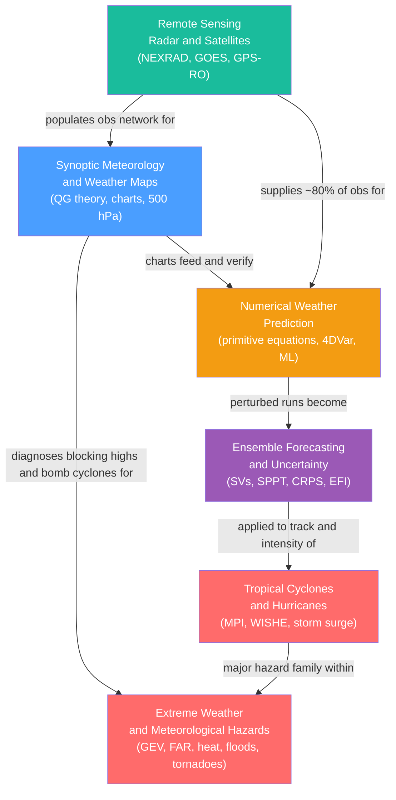

# Weather Forecasting and Remote Sensing — Map of Content

> [!info] How to use this map
> Start with **Synoptic Meteorology** to learn how the atmosphere is read, then follow the arrows through NWP and remote sensing before advancing to ensemble uncertainty and high-impact hazards.
> Each node links to a full note. Return to this map when you need to reorient.

This section traces the complete arc of modern operational meteorology: from the human art of reading synoptic charts, through the physics-based computer models and satellite observing systems that power them, to the probabilistic ensembles and hazard applications that translate forecasts into life-saving decisions.

---

## Concept Map

*(Blue = fundamental entry point, Teal = observational foundation, Orange = computational core, Purple = advanced probabilistic extension, Red = advanced hazard applications; arrows = "leads to" or "feeds into")*

---

## Recommended Learning Path

*Recommended order for a first pass through this section:*

1. [[Synoptic_Meteorology_and_Weather_Maps]] — Start here. Learn to read isobaric charts, interpret trough/ridge patterns and fronts, and apply QG diagnostics (Q-vectors, thickness) to diagnose where the atmosphere is rising and where storms will form. This is the conceptual vocabulary every subsequent note assumes.

2. [[Numerical_Weather_Prediction]] — Understand how those same observations are ingested by data assimilation (4DVar, EnKF) and the primitive equations are integrated forward in time. Covers chaos, the two-week predictability limit, parameterization, and the emerging AI/ML emulators (GraphCast, AIFS).

3. [[Remote_Sensing_Radar_and_Satellites]] — Explore the observing systems that supply NWP with its data: Doppler and dual-polarization radar (reflectivity, velocity, HCA), geostationary imagers (GOES ABI), polar sounders (AMSU, IASI), and GPS radio occultation. Explains why satellites account for the majority of global forecast skill.

4. [[Ensemble_Forecasting_and_Uncertainty]] — Extend deterministic NWP into probabilistic forecasting. Covers initial-condition perturbations (singular vectors, bred vectors, ETKF), model-error representation (SPPT, SKEB), calibration metrics (rank histogram, CRPS), and sub-seasonal-to-seasonal predictability via ENSO and MJO.

5. [[Extreme_Weather_and_Meteorological_Hazards]] — Apply the statistical framework of extreme value theory (GEV, GPD, return levels) to the full zoo of hazards: heat waves, flash floods, tornadoes, blizzards, extratropical windstorms, and fog. Introduces extreme-event attribution (FAR, risk ratio) and Clausius-Clapeyron scaling of precipitation extremes.

6. [[Tropical_Cyclones_and_Hurricanes]] — Capstone note. Synthesizes thermodynamics (Carnot MPI, WISHE), dynamics (gradient balance, beta drift), probabilistic forecasting (ensemble track cones), and hazard impact (storm surge, rapid intensification) into the atmosphere's most powerful and socially consequential weather system.

---

## Notes in This Section

| Note | Key Concept | Level |
|------|-------------|-------|
| [[Synoptic_Meteorology_and_Weather_Maps]] | Surface and upper-air charts, QG omega equation, Q-vectors, trough/ridge dynamics | Beginner to Advanced |
| [[Numerical_Weather_Prediction]] | Primitive equations, 4DVar/EnKF data assimilation, Lorenz chaos, ML weather models | Intermediate to Advanced |
| [[Remote_Sensing_Radar_and_Satellites]] | Doppler/dual-pol radar, GOES geostationary, polar sounders, GPS-RO, radiance assimilation | Intermediate to Advanced |
| [[Ensemble_Forecasting_and_Uncertainty]] | Perturbed-member ensembles, singular vectors, SPPT/SKEB, CRPS, rank histograms, S2S | Advanced |
| [[Tropical_Cyclones_and_Hurricanes]] | MPI Carnot engine, WISHE feedback, storm surge, rapid intensification, ERC | Intermediate to Advanced |
| [[Extreme_Weather_and_Meteorological_Hazards]] | GEV/GPD return levels, FAR attribution, heat waves, flash floods, tornadoes, CC scaling | Advanced |

---

## Key Questions This Section Answers

- How do meteorologists read a 500 hPa chart to infer where precipitation will fall and how surface cyclones will evolve?
- How does a numerical weather prediction model turn millions of scattered observations into a 10-day global forecast — and why does skill inevitably degrade toward two weeks?
- What physical measurements does weather radar actually make, and why do satellites account for the large majority of global forecast improvement?
- Why is a single deterministic forecast insufficient, and how do ensemble systems convert initial-condition uncertainty into calibrated probability forecasts?
- What thermodynamic and dynamic processes control the intensity of tropical cyclones, and why is storm surge — not wind — the primary cause of deaths?
- How does extreme value theory quantify the rarity of a heat wave or flood, and how does attribution science determine what role anthropogenic warming played?

---

## Cross-Section Links

- [[_MOC_Climate_System]] — The preceding section: the large-scale general circulation, energy balance, and atmospheric structure that provide the background state on which synoptic weather systems develop and that NWP models must correctly represent.
- [[_MOC_Climatology_and_Climate_Change]] — The following section: how the statistical distribution of weather events (including the extremes catalogued here) shifts under anthropogenic forcing; attribution science is the bridge between the two sections.
- [[_MOC_Atmospheric_Dynamics]] — The dynamics section underpinning this one: geostrophic and quasi-geostrophic balance, potential vorticity, Rossby waves, the jet stream, and frontal dynamics — the theoretical foundations of synoptic analysis and NWP model cores.

---

## Cross-Vault Links

- [[_MOC_Physics_Master]] — Electromagnetism and wave physics are foundational for remote sensing: the radar equation rests on Rayleigh/Mie scattering, Doppler shift, and microwave polarimetry; satellite sounders depend on infrared and microwave radiative transfer; GPS-RO uses signal bending in a refractive medium.
- [[Electromagnetic_Waves_and_Radiation]] — Directly underpins radar backscatter (reflectivity factor Z), the Doppler velocity measurement, dual-polarization variables, and passive satellite radiances across visible, IR, and microwave channels.
- [[Wave_Motion_and_Properties]] — Rossby waves (trough/ridge steering), Doppler shift in radar, and the range-velocity ambiguity (Nyquist sampling) all draw on core wave concepts from the Physics vault.
- [[_MOC_SS_Master]] — Signals and Systems is the mathematical substrate for several key tools in this section: Fourier decomposition of height fields and spectral NWP (spherical harmonics), pulse-Doppler radar signal processing (PRF, sampling, aliasing), the spectral representation of stochastic perturbation fields (SPPT/SKEB), and Fourier-based filtering in model numerics.
- [[Fourier_Transform]] — The spectral transform method at the heart of ECMWF's IFS, the Nyquist velocity and range ambiguity in Doppler radar, wavenumber decomposition of synoptic-scale disturbances, and the scale-dependent growth of forecast error all rest on Fourier analysis.
- [[_MOC_Earth_Science_Master]] — Earth Science connects to the hazard applications: storm-surge coastal inundation links to oceanography and sea-level rise; flash-flood debris flows connect to mass wasting and slope stability; soil moisture and land-surface feedbacks are central to heat-wave amplification and NWP land-surface parameterization.

---

#MOC #Meteorology #WeatherForecasting
