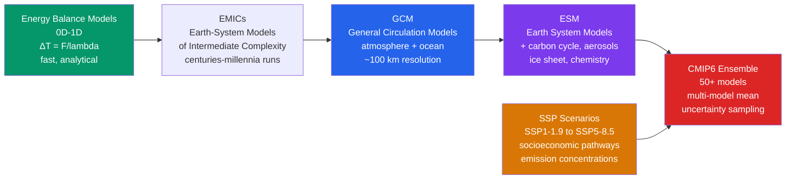

# 🖥️ Climate Models and Projections

> [!abstract] TL;DR
> **Climate models** — **General Circulation Models (GCMs)** and their more complete descendants, **Earth System Models (ESMs)** — are physics-based simulations of the coupled **atmosphere–ocean–land–ice** system, used to **project** future climate under greenhouse-gas emission scenarios. The **CMIP6** multi-model ensemble (50+ models, the backbone of **IPCC AR6**) projects end-of-century warming of **1.0–1.8 °C** under aggressive mitigation (**SSP1-1.9**), **2.1–3.5 °C** under a middle-of-the-road pathway (**SSP2-4.5**), and **3.3–5.7 °C** under very high emissions (**SSP5-8.5**), all relative to **1850–1900**. Model skill is judged against **historical observations (1850–2014)**, **paleoclimate** reconstructions, and **process understanding**. The dominant uncertainties are **cloud feedbacks** (largest), **aerosol forcing**, **carbon-cycle feedbacks**, and **ice-sheet dynamics**. **Emergent constraints** exploit an observable present-day relationship across models to narrow an uncertain future quantity (e.g. ECS). A projection is a **statistical statement about a possible future climate**, never a weather forecast for a date.

## Intuition — analogy FIRST

Think of a climate model as a **"computer Earth"**: a physically consistent virtual planet built from the same conservation laws — momentum, mass, energy, and moisture — that the real atmosphere and ocean obey. You give it today's state and a recipe for how much CO₂ humanity will add, press *run*, and it evolves a plausible future world forward, one time step at a time. Because it is built from physics rather than from curve-fitting the past, it can be pushed into conditions the planet has never been observed in — a doubled-CO₂ world — and still return a physically credible answer.

Crucially, a computer Earth is **not a crystal ball for specific dates**. Ask it "will it rain in Delhi on 3 July 2091?" and the honest answer is *no idea* — that is chaotic weather, unpredictable beyond ~two weeks. Ask it instead "in a doubled-CO₂ world, how much hotter is the average summer, and how much more intense are the heaviest downpours?" and it answers with confidence: *"summers average 2–4 °C hotter, and extreme-precipitation events are 20–30 % more intense."* Climate is the **statistics** of weather, and the statistics are what the model projects.

The width of a projection has **two utterly different sources**, and confusing them is the classic error. One is **scenario uncertainty** — we do not know how much CO₂ society will emit, which is a question about *politics and economics*, not physics. The other is **model uncertainty** — even for a *fixed* emissions path, the models disagree about how strongly the climate responds, because there is physics (above all, **clouds**) we do not yet fully pin down. The first shrinks only when humanity *chooses* a path; the second shrinks only when the *science* improves.

---

## How It Works

A climate model is not one thing but a **hierarchy** of tools of increasing completeness and cost. You climb the hierarchy from cheap, transparent, analytically tractable models toward comprehensive, expensive, coupled Earth System Models — trading insight for realism at every rung.



**The model hierarchy.**

- **Energy Balance Models (EBMs, 0-D to 1-D).** The simplest computer Earth: a globe (or a latitude strip) whose temperature is set by the balance of absorbed sunlight and emitted infrared, $\Delta T = F/|\lambda|$. Analytical, runs in milliseconds, and is where the *concepts* of forcing, feedback, and sensitivity are cleanest. The Python demo below is a three-box EBM.
- **EMICs (Earth-system Models of Intermediate Complexity).** Coarse-resolution or simplified-dynamics models that are cheap enough to integrate for **thousands of years** — ideal for ice ages, carbon-cycle equilibration, and multi-millennial commitment.
- **GCMs (General Circulation Models).** The workhorse: a 3-D atmosphere coupled to a 3-D ocean, both solving the fluid-dynamical **primitive equations** on a rotating sphere at ~100 km horizontal resolution. This is the same dynamical core used in [[Numerical_Weather_Prediction]], run for centuries instead of days.
- **ESMs (Earth System Models).** A GCM *plus* the biogeochemistry that closes the loop: an interactive **carbon cycle** (land + ocean), **aerosols**, atmospheric **chemistry**, dynamic **vegetation**, and increasingly **ice sheets**. An ESM can be driven by *emissions* directly and will compute the resulting CO₂ concentration itself.

**The coupled components.** A modern ESM stitches together separate model codes that exchange fluxes at each coupling step:

1. **Atmosphere** — winds, temperature, humidity, clouds, radiation; passes **heat, momentum (wind stress), and freshwater (P−E)** down to the surface.
2. **Ocean** — 3-D circulation, ~1° horizontal with 50+ vertical levels; passes **sea-surface temperature (SST)** and currents back up.
3. **Sea ice** — grows, melts, and drifts; modulates albedo and insulates ocean from atmosphere.
4. **Land surface** — soil moisture, runoff, snow, and vegetation; controls the surface energy and water budgets.
5. **Carbon cycle** — terrestrial (photosynthesis/NPP, soil respiration) and oceanic (solubility and biological pumps) uptake of CO₂.
6. **Aerosols, chemistry, ice sheets** — the additional ESM machinery that turns a physical GCM into a full Earth-system simulator.

**Scenarios: SSPs and RCPs.** Because *future emissions are a choice, not a physical constant*, models are driven by **scenarios**. AR6 uses **Shared Socioeconomic Pathways (SSPs)** — narrative worlds of population, technology, and policy — paired with a target **Representative Concentration Pathway (RCP)** forcing level. The label encodes both: **SSP2-4.5** means "middle-of-the-road society" reaching **≈4.5 W/m²** of forcing by 2100. The family spans **SSP1-1.9** (rapid decarbonization, ≈1.5 °C) to **SSP5-8.5** (fossil-fuelled growth, ≈8.5 W/m²). Scenarios are *not predictions* — they are self-consistent branches of possibility.

**CMIP: the intercomparison framework.** No single model is trusted alone. The **Coupled Model Intercomparison Project (CMIP)** defines a shared experiment protocol so that dozens of independent models can be compared apples-to-apples: a **historical** run (**1850–2014**, forced by observed CO₂, aerosols, solar, and volcanoes) followed by **scenario** runs (**2015–2100+**). CMIP6 underpins IPCC AR6. The spread across the ensemble is itself a measurement — of *structural* model uncertainty.

**Reading the multi-model ensemble.** The **multi-model mean** filters out each model's random errors and internal-variability wiggles, leaving the **forced response** — usually the single best estimate. But the *spread* carries the risk information: the **95th-percentile warming**, not the mean, drives conservative adaptation planning. Decompose any single simulation as
$$\underbrace{T_{model}(t)}_{\text{one run}} = \underbrace{\bar{T}_{ensemble}(t)}_{\text{forced response}} + \underbrace{\varepsilon_{internal}(t)}_{\text{internal variability}} + \underbrace{\delta_{model}}_{\text{model error}}.$$

**Model evaluation.** Skill is quantified by comparing the historical run against observational reference datasets — **ERA5** (reanalysis) for atmospheric fields, **CRU** for land temperature, **GPCP** for precipitation — using **spatial correlation**, **RMSE**, and process metrics such as **ENSO amplitude** and the seasonal cycle. A model that reproduces 1970–2014 warming, the storm tracks, the monsoons, and ENSO has earned some trust in its projection.

**Persistent biases.** Even good models share stubborn systematic errors: the **double-ITCZ bias** (a spurious second rain band south of the equator), the **equatorial cold-tongue bias** (Pacific SSTs too cold and too far west), and disagreement on **AMOC** strength. These are mean-state errors — importantly, they do **not** by themselves invalidate the *sensitivity* or the *trend*.

**Emergent constraints.** A powerful bridge from observations to the future: across the model ensemble, find an **observable present-day quantity** that is *statistically related* to an uncertain future quantity, then use the *observed* value of the predictor to narrow the projection. Sherwood et al. (2014) related **lower-tropospheric mixing** to ECS; Cox et al. (2018) related the **year-to-year temperature variability** to ECS. The constraint is only as trustworthy as the *physical robustness* of the model-spread relationship.

**Regional information and downscaling.** GCM output is coarse (~100 km); impacts happen locally. **Dynamical downscaling** nests a high-resolution **Regional Climate Model (RCM)** inside GCM boundary conditions (the **CORDEX** framework); **statistical downscaling** learns present-day GCM-to-station relationships and applies them to the future. **Pattern scaling** is the cheapest regional shortcut: $\Delta T_{regional} = \beta \times \Delta T_{global}$.

**The three (or four) uncertainties.** Long-range projection uncertainty decomposes into **scenario uncertainty** (which emissions path), **model/response uncertainty** (how strongly the system responds), and **internal variability** (the unforced chaos of the coupled system) — with **structural/parameter** uncertainty sometimes split out. Their *relative* size changes with lead time, which is the heart of the Hawkins & Sutton (2009) framework below.

---

## Key Concepts / Details

### Secondary Level

- **A climate model is not a weather forecast.** A weather model predicts the *actual* atmosphere for the next few days; a climate model projects the *statistics* — averages, extremes, and trends — decades ahead. It answers "how hot will average summers be?", never "will it rain next Tuesday in 2085?"
- **Why we use scenarios.** We cannot know how much CO₂ people will emit, because that depends on future choices. So scientists run **several possible futures** (SSPs) and report a *range*, not a single number.
- **What the SSPs mean.** **SSP1-1.9** = the world decarbonizes fast and stays near 1.5 °C. **SSP5-8.5** = fossil fuels keep growing and warming reaches ~4–5 °C. The others sit in between. They are *"if we do X, then Y"* storylines.
- **Warming by 2100, by choice.** Under strong action the planet warms roughly **1–2 °C**; under very high emissions, **3–5 °C**. The reason 2100 warming ranges from ~1 °C to ~5 °C is mostly *which scenario* we follow — i.e. what humanity decides.
- **What "likely range" means.** When the IPCC says a warming is in a *likely* range, that means about a **66 % probability** it falls inside — not certainty, and with real chances of landing above or below.
- **Biases don't mean "wrong."** Every model has quirks (a rain band slightly misplaced, an ocean patch a bit too cold). These **mean-state biases** rarely change the projected *warming*, which is a difference between two runs and cancels much of the bias.
- **Why use many models.** Running **50+ independent models** is how we *measure the uncertainty itself* — the spread tells us how confident to be. More models means a better map of what we don't know, not just a better single answer.

### Undergraduate Level

- **The atmospheric GCM.** Solves the **primitive equations** on a grid. Older spectral cores run **T85 ≈ 1.5°**; finite-volume cores ≈ 1°; newer configurations reach **≈ 0.5°**. Sub-grid processes (convection, clouds, turbulence, radiation) are **parameterized** — represented by physically-motivated formulas because they are smaller than a grid box.
- **The ocean GCM.** Same dynamical structure, typically **~1° horizontal** with **50+ vertical levels** and refinement near the equator. Slow to spin up because the deep ocean equilibrates over centuries.
- **Coupling.** Each coupling step the atmosphere hands the ocean **heat, momentum (wind stress), and freshwater (P−E)**; the ocean returns **SST and sea-ice** state. A **flux coupler** conserves energy and water across the different grids.
- **Land-surface model.** Soil **hydrology and runoff**, **snow** cover, and **vegetation** — setting the partition of net radiation into sensible vs latent heat, which controls near-surface temperature and humidity.
- **Carbon-cycle feedbacks.** Terrestrial uptake via **net primary productivity** (fertilized by CO₂) offset by **soil respiration** (accelerated by warming); oceanic uptake via the **solubility pump** (colder water holds more CO₂) and **biological pump**. Warming *weakens* these sinks — a positive feedback.
- **CMIP protocol.** A common experiment design: **historical (1850–2014)** with observed forcings, then **scenario (2015–2100)** runs; plus idealized **abrupt-4×CO₂** and **1 %/yr** runs used to diagnose ECS and TCR (see [[Climate_Sensitivity_and_Feedbacks]]).
- **Skill metrics.** **Spatial (pattern) correlation** and **RMSE** against ERA5/CRU/GPCP; the amplitude and period of **ENSO**; the strength of the seasonal cycle and monsoons. A Taylor diagram summarizes correlation, variance, and RMSE at a glance.
- **Pattern scaling.** To first order the *pattern* of change is fixed and only its amplitude scales: $\Delta T_{regional} = \beta \times \Delta T_{global}$, where $\beta$ (the local warming per degree of global warming) is diagnosed once from a rich run and reused cheaply across scenarios.
- **Signal vs noise decomposition.** The **multi-model mean = forced response**; the deviation of any single run = **internal variability + model error**. Averaging over models and time isolates the forced climate-change signal.
- **AR6 projected warming by 2100** (2081–2100 mean vs 1850–1900; *very likely* ranges):

  | Scenario | Character | Best estimate | *Very likely* range |
  |----------|-----------|:-------------:|:-------------------:|
  | **SSP1-1.9** | Aggressive mitigation | **1.4 °C** | 1.0–1.8 °C |
  | **SSP1-2.6** | Strong mitigation | **1.8 °C** | 1.3–2.4 °C |
  | **SSP2-4.5** | Middle of the road | **2.7 °C** | 2.1–3.5 °C |
  | **SSP3-7.0** | Regional rivalry, high | **3.6 °C** | 2.8–4.6 °C |
  | **SSP5-8.5** | Fossil-fuelled, very high | **4.4 °C** | 3.3–5.7 °C |

### Graduate Level

- **Emergent constraints, formally.** Across an ensemble $\{y_i, x_i\}$ of a future target $y$ (e.g. ECS) and an observable predictor $x$, fit $y = a x + b$; substitute the *observed* $x_{obs}$ (with its error) to obtain a constrained posterior on $y$. Landmark examples: **Sherwood et al. (2014)** — lower-tropospheric **mixing** strength predicts higher ECS; **Cox et al. (2018)** — the **amplitude of interannual temperature variability** (a fluctuation–dissipation argument) constrains ECS. Constraints are only credible when the model-spread relationship rests on **mechanistic** physics, not coincidence.
- **CMIP6 resolution.** Horizontal cores reach **T340 ≈ 40 km** in high-resolution configurations (HighResMIP); vertical grids exceed **100 levels** in some setups, resolving the stratosphere and gravity-wave drag. Higher resolution improves storm tracks, orographic precipitation, and ocean eddies — but is **not** a guarantee of better global sensitivity.
- **Large ensembles.** Single-model **initial-condition large ensembles** — **CESM-LENS (40→100 members)**, **CanESM-LENS**, **MPI-GE** — rerun *one* model with tiny perturbations to the initial state under *identical* forcing. Because the forced response is shared, the **spread across members is pure internal variability**, letting one cleanly separate forced change from noise for *any* region or extreme, with statistical rigor unavailable from a single run.
- **The pattern effect on inferred ECS.** The *spatial pattern* of historical SST warming (an ENSO/La-Niña-like, warm-pool-heavy pattern) strengthens stabilizing low-cloud and lapse-rate feedbacks, making the **historical-period feedback more negative** than the equilibrium 2×CO₂ pattern would give. Consequently the **effective ECS inferred from the historical record is biased low** relative to the true ECS — AR6 applies an explicit pattern-effect correction (order +0.5 °C). See [[Climate_Sensitivity_and_Feedbacks]].
- **High-end and zero-emissions scenarios.** Beyond the standard SSPs sit **overshoot** pathways and the **Zero Emissions Commitment (ZEC)** experiment: after emissions abruptly stop, does warming continue? CMIP-ZECMIP finds ZEC ≈ **0 ± 0.2 °C** on multidecadal scales — ocean heat uptake and declining atmospheric CO₂ roughly cancel — a policy-critical result meaning **warming largely stops when *emissions* stop**.
- **Hawkins & Sutton (2009) uncertainty partition.** For regional temperature projections the total variance is split into three terms whose relative dominance *evolves with lead time*: **internal variability** dominates the **near term (to ~2030)**; **model (response) uncertainty** is significant at **all** lead times and dominates the **mid-century**; **scenario uncertainty** is negligible early (all scenarios share the same near-term pipeline) but **dominates after ~2050** as the SSPs fan out. Model uncertainty **does not shrink over time** despite more data, because it reflects *structural* disagreement about the system's *response*, not a lack of observations of the present.
- **Constrained projections in AR6.** AR6 did not report raw model spread alone: it **narrowed ECS** using multiple lines of evidence (process + historical + paleo) and propagated that constrained sensitivity into a **synthesized, emulator-assessed** projection — reconciling raw-ensemble spread with the tighter assessed ranges.
- **Downscaling limits and CORDEX.** RCMs add value for **orography, coastlines, and convective extremes**, but they **inherit the driving GCM's large-scale biases** and cannot fix a wrong circulation. **CORDEX** standardizes regional experiments; convection-permitting (~3 km) RCMs are the frontier for extreme rainfall.
- **IAMs and impacts.** **Integrated Assessment Models** couple simplified climate (emulators) to economics to produce mitigation pathways and damage estimates; impacts-and-adaptation modeling chains climate output through hydrology, crop, and health models — inheriting *all* upstream uncertainties.
- **Ensemble weighting: democracy vs performance.** The default **"one model, one vote"** (model democracy) is simple but ignores skill *and* model **genealogy** (many models share code/ancestry, so votes are not independent). **Performance-and-independence weighting** (e.g. ClimWIP) downweights poor and redundant models — but risks overfitting to the metrics chosen. The **"hot model" episode** (below) is the canonical case where naïve democracy was reconsidered.

---

## Python Demo — A Three-Box Energy Balance Climate Model

```python
# A minimal "computer Earth": a 3-box energy balance model (EBM) of the
# climate system. Boxes = Tropics (|lat|<30), Midlatitudes (30-60), Polar (>60).
#
# Each box balances: absorbed shortwave  -  outgoing longwave (A + B*T)
#                    + greenhouse forcing F(t)  + meridional heat transport.
# Transport between adjacent boxes is diffusive:  P = k * (T_warm - T_cold).
# A linearized ice-albedo feedback (alb_fb) makes the polar box more sensitive.
#
# We (1) spin the model up to a base climate, (2) ramp greenhouse forcing from
# 0 -> 4 W/m^2 over 100 years and hold it, (3) plot the temperature evolution
# and the equilibrium warming pattern, and (4) diagnose the model's global ECS.
import numpy as np
from scipy.integrate import solve_ivp
import matplotlib.pyplot as plt

# ---- geometry: area fraction of each latitude band (sin(phi2)-sin(phi1)) ----
f = np.array([0.500, 0.366, 0.134])          # Tropics, Midlat, Polar (sum = 1)

# ---- radiation & transport parameters --------------------------------------
Q0      = np.array([300.0, 210.0, 130.0])    # absorbed shortwave, W/m^2
alb_fb  = np.array([0.0, 0.5, 1.2])          # ice-albedo feedback, W/m^2/K
A, B    = 210.0, 2.1                          # OLR = A + B*T (Budyko), W/m^2, W/m^2/K
k       = np.array([1.0, 1.0])               # transport coeff (Trop-Mid, Mid-Pol)
SEC_PER_YR = 3.156e7
C       = 5.0e8 / SEC_PER_YR                 # heat capacity -> W*yr/m^2/K (~150 m column)

def forcing(t):                              # ramp 0 -> 4 W/m^2 over 100 yr, then hold
    return np.clip(4.0 * t / 100.0, 0.0, 4.0)

def dTdt(t, T, apply_F):
    T1, T2, T3 = T
    F   = forcing(t) if apply_F else 0.0
    SW  = Q0 + alb_fb * T                     # shortwave incl. ice-albedo feedback
    OLR = A + B * T                           # linearized outgoing longwave
    P1  = k[0] * (T1 - T2)                    # Tropics -> Midlat  (W/m^2, global-ref)
    P2  = k[1] * (T2 - T3)                    # Midlat  -> Polar
    trans = np.array([-P1 / f[0], (P1 - P2) / f[1], P2 / f[2]])
    return (SW - OLR + F + trans) / C

# ---- 1) spin up to base climate (F = 0) ------------------------------------
base = solve_ivp(dTdt, [0, 400], [20.0, 10.0, 0.0], args=(False,),
                 rtol=1e-8, atol=1e-8).y[:, -1]

# ---- 2) main run: apply the greenhouse forcing -----------------------------
t_eval = np.linspace(0, 400, 801)
sol = solve_ivp(dTdt, [0, 400], base, args=(True,),
                t_eval=t_eval, rtol=1e-8, atol=1e-8)
dT  = sol.y - base[:, None]                  # warming relative to base climate
gmst = f @ dT                                # area-weighted global-mean warming

# ---- 3) diagnose ECS: global warming scales linearly with forcing ----------
dT_eq   = dT[:, -1]                          # equilibrium warming per box (F = 4)
gmst_eq = f @ dT_eq                          # global mean at F = 4 W/m^2
ECS     = gmst_eq * (3.7 / 4.0)             # rescale to a CO2 doubling (3.7 W/m^2)
B_eff   = 4.0 / gmst_eq                      # effective global feedback parameter

print(f"Base climate (T Trop/Mid/Pol): {base[0]:.1f} / {base[1]:.1f} / {base[2]:.1f} C")
print(f"Equilibrium warming per box  : {dT_eq[0]:.2f} / {dT_eq[1]:.2f} / {dT_eq[2]:.2f} C")
print(f"Polar amplification factor   : {dT_eq[2] / dT_eq[0]:.2f}x tropics")
print(f"Global-mean effective B      : {B_eff:.2f} W/m^2/K")
print(f"Diagnosed model ECS (2xCO2)  : {ECS:.2f} C")

# ---- 4) plot ---------------------------------------------------------------
fig, (ax1, ax2) = plt.subplots(1, 2, figsize=(13, 5))
labels = ["Tropics", "Midlatitudes", "Polar"]
cols   = ["#dc2626", "#059669", "#2563eb"]

for i in range(3):
    ax1.plot(t_eval, dT[i], color=cols[i], lw=1.8, label=labels[i])
ax1.plot(t_eval, gmst, "k--", lw=2, label="Global mean")
ax1.axvline(100, color="#9ca3af", ls=":", lw=1)
ax1.text(102, 0.2, "forcing reaches\n4 W/m$^2$", fontsize=8, color="#6b7280")
ax1.set_xlabel("Year of simulation")
ax1.set_ylabel("Warming vs base climate (°C)")
ax1.set_title("Transient response to a ramped greenhouse forcing")
ax1.legend(loc="upper left", fontsize=9)
ax1.grid(alpha=0.3)

bars = ax2.bar(labels, dT_eq, color=cols)
for b, v in zip(bars, dT_eq):
    ax2.text(b.get_x() + b.get_width()/2, v + 0.02, f"{v:.2f}°C",
             ha="center", fontsize=9)
ax2.axhline(gmst_eq, color="k", ls="--", lw=1.5,
            label=f"global mean {gmst_eq:.2f}°C")
ax2.set_ylabel("Equilibrium warming (°C)")
ax2.set_title("Equilibrium warming pattern — polar amplification")
ax2.legend(fontsize=9)
ax2.grid(alpha=0.3, axis="y")

plt.tight_layout()
plt.show()
```

The left panel shows the **transient response**: temperatures climb as the forcing ramps, then keep rising and slowly level off after the forcing is held fixed — the lag is **ocean thermal inertia** (the heat-capacity term `C`), the same reason the real world's warming trails its forcing. The right panel is the **equilibrium warming pattern**: even though the forcing is applied *uniformly*, the **polar box warms most** because its linearized **ice-albedo feedback** (`alb_fb`) weakens the local damping — the toy-model version of **Arctic amplification**. Finally the script diagnoses a **global ECS** by rescaling the equilibrium warming to a CO₂ doubling (3.7 W/m²); with these parameters the model lands near **~2 °C**, on the low side of the real range precisely because it omits the strong **water-vapor and cloud** feedbacks that a full GCM carries.

---

## Real-World Notes

- **The core physics validates against the record.** The CMIP6 multi-model mean tracked the observed **global-mean temperature trend from 1970–2014 to within ~5 %** — a strong out-of-sample check that the coupled physics captures the forced warming, not just a hindcast tuned to fit.
- **The "hot model problem" of CMIP6.** Roughly **30 % of CMIP6 models had ECS above 4.5 °C**, exceeding the IPCC *likely* range. The culprit was updated **cloud-microphysics parameterizations** that improved *local* cloud realism (especially supercooled Southern-Ocean clouds) but pushed *global* sensitivity too high. AR6's response was decisive: rather than trust raw "model democracy," it **downweighted the hot models using emergent constraints and the assessed ECS**, so projected warming reflected the constrained sensitivity — a methodological turning point.
- **Large ensembles separate signal from noise.** The **NCAR CESM2 Large Ensemble (100 members)** reruns one model under identical forcing with micro-perturbed initial states. Because every member shares the forced response, the spread *is* internal variability — letting scientists state, for a *specific region*, how much of a projected change is forced and how much is chance, with genuine statistical rigor.
- **Observational constraints tightened the projections.** A 2020s scientific advance: the gap between **raw-ensemble** warming and **expert-assessed** warming narrowed substantially once **observational ECS constraints** were applied. The assessed ranges in AR6 are tighter and better-justified than a naïve model average — the first real narrowing of climate sensitivity since **Charney (1979)**.
- **The code is open.** Major climate models are publicly available and run at institutions worldwide — **NCAR CESM**, **GFDL-CM/ESM**, **MPI-ESM**, and **EC-Earth** among them. Anyone with sufficient compute can inspect, modify, and rerun the physics, making climate modeling one of the more transparent large-scale scientific enterprises.

---

## Common Pitfalls

1. **Projections are not weather forecasts for specific dates.** A climate projection is a **statistical distribution of possible futures** — averages, extremes, and trends — not a prediction of the weather on any particular day. Demanding date-specific accuracy misunderstands what the model produces.
2. **Model uncertainty ≠ scenario uncertainty.** They are **fundamentally different and reducible by different means**. Scenario uncertainty shrinks only through **policy choices** about emissions; model uncertainty shrinks only through **better physics** (chiefly clouds). Averaging more models cannot resolve which emissions path humanity picks, and no policy can resolve how sensitive the climate is.
3. **Higher resolution is not automatically more accurate.** For large-scale *climate* projections a **coarser model with better parameterizations often beats a higher-resolution model with worse physics**. Resolution helps regional detail and extremes, but the global response is set by the feedbacks, not the grid spacing.
4. **The multi-model mean hides the tails, and the tails carry the risk.** The mean is usually the best *single* estimate, but adaptation planning depends on the **upper tail** — the **95th-percentile warming** — because climate damages are convex in temperature. Reporting only the mean understates the risk that matters most.
5. **A biased mean state does not imply a wrong sensitivity.** Errors like the **double-ITCZ** or **cold-tongue** bias are mean-state problems; **climate sensitivity is a difference between two states**, so much of the bias cancels. Biases and sensitivity are *related but semi-independent* — a model can have an ugly mean climate and a credible warming response, or vice versa.

---

## Related Concepts

- [[_MOC_Climatology_and_Climate_Change]] — section map for the climatology & climate-change unit (entry point)
- [[Anthropogenic_Climate_Change]] — the detection/attribution and emissions story these models are run to project forward
- [[Climate_Sensitivity_and_Feedbacks]] — ECS/TCR are *diagnosed from* these models (abrupt-4×CO₂, Gregory regression) and *constrain* their projections
- [[Geoengineering_and_Climate_Intervention]] — models are the primary tool for testing solar-radiation-management and carbon-removal scenarios
- [[Numerical_Weather_Prediction]] — shares the dynamical core and primitive equations, run for days (initial-value) rather than centuries (boundary-value)
- [[Ensemble_Forecasting_and_Uncertainty]] — the same ensemble philosophy applied to weather; contrasts initial-condition vs multi-model/scenario spread
- [[Global_Atmospheric_Circulation]] — the Hadley/Ferrel/Polar cells and jets that a GCM must reproduce to earn trust
- [[Paleoclimatology_and_Ice_Cores]] — the deep-time record used to evaluate models and constrain ECS beyond the instrumental era
- [[_MOC_Physics_Master]] — cross-vault physics entry point
- [[Laws_of_Thermodynamics]] — energy conservation and the top-of-atmosphere balance that closes every box of an EBM
- [[Electromagnetic_Waves_and_Radiation]] — the shortwave-in / longwave-out radiative transfer at the heart of a model's radiation scheme
- [[_MOC_SS_Master]] — cross-vault signals & systems entry point; ODE integration, stability, and spectral (T85/T340) numerics used to solve the model equations

---

## Review Questions

**Secondary**
- What is the **difference between a climate model and a weather forecast model**, and what kind of question can each answer? *(A weather model predicts the actual atmosphere for the next few days; a climate model projects the long-term statistics — averages, extremes, trends — decades ahead.)*
- What does the **SSP5-8.5** scenario represent, and why does the range of 2100 warming span from ~1 °C to ~5 °C depending on the scenario? *(SSP5-8.5 = a fossil-fuelled, very-high-emissions future ≈8.5 W/m²; the huge span across scenarios reflects that future emissions — a human choice — dominate 2100 warming.)*

**Undergraduate**
- Name the **four sources of uncertainty** in long-range climate projections (scenario, model/response, internal variability, structural/parameter) and describe how their **relative contributions shift as the horizon extends from 2030 to 2100**. *(Internal variability dominates near-term to ~2030; model uncertainty matters at all leads and dominates mid-century; scenario uncertainty is small early but dominates after ~2050.)*
- What is an **emergent constraint**, and how does it use present-day model behavior to narrow a future projection? Give one example. *(Across the ensemble, relate an observable predictor to an uncertain future target, then substitute the observed predictor value; e.g. Sherwood 2014 lower-tropospheric mixing → ECS, or Cox 2018 temperature variability → ECS.)*

**Graduate**
- Describe the **Hawkins & Sutton (2009)** uncertainty-partition framework for regional temperature projections. What drives the **scenario, model, and internal-variability** terms, what is the **temporal evolution** of each, and **why does model uncertainty not decrease over time** despite ever-more observational data? *(Model uncertainty is structural disagreement about the system's response, not a shortage of present-day observations, so more data does not close it; internal variability dominates early, model uncertainty mid-century, scenario uncertainty after ~2050.)*
- Explain the **"hot model problem"** in CMIP6: what changed in the **cloud parameterizations** to raise ECS in ~30 % of models, and how did **IPCC AR6** reconcile the inconsistency between raw ensemble spread and ECS-constrained estimates? *(Updated cloud microphysics — notably supercooled/mixed-phase and Southern-Ocean clouds — improved local realism but raised global sensitivity above 4.5 °C; AR6 abandoned pure model democracy and downweighted high-ECS models using emergent constraints and the multi-line assessed ECS, so projected warming reflected the constrained sensitivity.)*

---

## Sources

- IPCC (2021). *Climate Change 2021: The Physical Science Basis (AR6 WGI)* — **Chapter 4, "Future Global Climate: Scenario-Based Projections and Near-Term Information."** Cambridge University Press.
- Hawkins, E., & Sutton, R. (2009). "The Potential to Narrow Uncertainty in Regional Climate Predictions." *Bulletin of the American Meteorological Society*, 90(8), 1095–1107.
- Sherwood, S. C., *et al.* (2020). "An Assessment of Earth's Climate Sensitivity Using Multiple Lines of Evidence." *Reviews of Geophysics*, 58(4), e2019RG000678.

---

#Meteorology #Climatology #ClimateModels #GCM #CMIP6 #ClimateProjections
