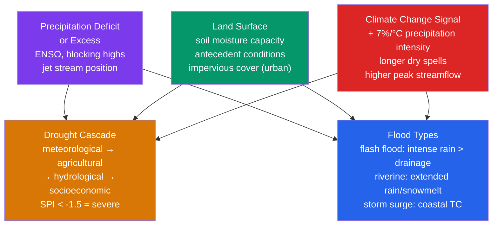

# 🌊 Droughts and Floods

> [!abstract] TL;DR
> **Droughts and floods** are the two most socioeconomically damaging **hydrological extremes**, the opposite tails of the same water cycle. **Drought** is a prolonged **deficit of precipitation** relative to the climatological mean, cascading through **soil moisture, streamflow, and groundwater** on timescales from months to years; the **Standardized Precipitation Index (SPI)** quantifies its severity from the statistics of accumulated rainfall, while the **Palmer Drought Severity Index (PDSI)** and **SPEI** fold in temperature and evapotranspiration. **Flood** is an **exceedance of channel or drainage capacity**, driven by intense short-duration rain (**flash flood**), extended rain or snowmelt (**riverine flood**), coastal **storm surge**, or **compound events**. **ENSO** is the dominant natural driver — **La Niña** brings drought to Australia and East Africa, **El Niño** brings flooding to the eastern Pacific coast of South America. Under climate change both extremes **intensify together** as the hydrological cycle accelerates (**~7 %/°C** more moisture per Clausius–Clapeyron): *wet gets wetter, dry gets drier*, and communities whiplash between too much and too little water.

---

## Intuition — analogy FIRST

Think of a landscape's water as a **bank account**. Rain is the deposit; evaporation, plant use, and runoff are the withdrawals. A **drought is a slow, creeping overdraft** — the balance drifts down month after month with no dramatic alarm bell, because there is no single "drought event," just an absence of rain that quietly starves the soil, then the streams, then the wells. By the time reservoirs run dry and crops wilt, the account has been overdrawn for a year. Drought is the **emergency that arrives in slow motion**, which is exactly why it is the hazard humans respond to last.

A **flood is the explosive inverse**: more water arriving at once than the land can absorb or the channel can carry. Picture a **bathtub with the drain too small** — pour water in faster than it can escape and it simply overflows, then races downhill through valleys and streets, gathering lethal speed. Where drought is a deficit accumulated over months, a **flash flood** is a surplus delivered in minutes.

The two are joined at the hip by the **water cycle**. The very warming that supercharges the atmosphere's ability to *dump* rain (fuelling floods) also supercharges its ability to *evaporate* water from soils (fuelling droughts). So a warming world does not shift uniformly toward wet or dry — it stretches **both tails**: **wet regions get wetter, dry regions get drier**, and any single place can now swing violently between the two. The paradox of **"too much and too little water"** is the central hydrological challenge of the 21st century.

---

## How It Works

Droughts and floods are not two unrelated hazards but the **two failure modes of a single water balance**: what falls as precipitation, minus what the land can store, evaporate, or drain away. The diagram below shows how the **same drivers** — precipitation anomalies (set by ENSO, blocking highs, and jet-stream position), the **land surface** (soil moisture capacity, antecedent wetness, urban imperviousness), and the **climate-change signal** — feed into *both* extremes. The sections that follow trace each pathway: the drought cascade and its indices, the flood typology and its hydraulics, and how warming loads the dice at both ends.



### The drought cascade — four kinds of drought

Drought is best understood as a **cascade of deficits** that propagate through the hydrological system at increasing lag:

1. **Meteorological drought** — a **deficit of precipitation** relative to the local climatology over some period. This is the *first domino* and the fastest to appear. It is measured by rainfall statistics alone (the SPI).
2. **Agricultural drought** — a **deficit of soil moisture** in the root zone, so plants and crops are water-stressed. It lags meteorological drought by weeks to a couple of months and depends on antecedent soil wetness, temperature, and evapotranspiration demand.
3. **Hydrological drought** — a **deficit of streamflow, reservoir storage, and groundwater**. Rivers run low, reservoirs draw down, water tables fall. This lags by months to years because groundwater and large reservoirs integrate over long periods.
4. **Socioeconomic drought** — when the physical deficit **outstrips the human demand** for water (agriculture, cities, hydropower, ecosystems), producing famine, water rationing, and conflict. This is where drought becomes a disaster.

A short, sharp rain deficit may cause meteorological and even agricultural drought yet never reach hydrological drought if reservoirs are full; a long deficit propagates all the way to socioeconomic catastrophe. The **timescale you measure at determines which drought you see** — a key reason the SPI is computed over multiple windows.

### Measuring drought — SPI, PDSI, SPEI

- **SPI (Standardized Precipitation Index)** — the workhorse index. Fit a **gamma distribution** to the record of cumulative precipitation over a chosen window (1, 3, 6, 12, 24 months), convert each observation to its **cumulative probability**, then map that probability onto a **standard normal Z-score**. The result is a **unitless anomaly**: SPI = 0 is exactly normal, negative is dry, positive is wet, and because it is standardized it is **directly comparable across climates**. Short windows (SPI-1, SPI-3) track *meteorological/agricultural* drought; long windows (SPI-12, SPI-24) track *hydrological* drought.
- **PDSI (Palmer Drought Severity Index)** — an older but influential index built on a **water-balance model**: it accounts not just for precipitation but for **temperature-driven evapotranspiration**, soil-moisture recharge, and runoff. Because it includes temperature, PDSI captures the drought-intensifying effect of *heat*, which pure-precipitation SPI misses.
- **SPEI (Standardized Precipitation-Evapotranspiration Index)** — the modern hybrid: compute SPI-style statistics but on the **climatic water balance** (precipitation *minus* potential evapotranspiration, P − PET) rather than precipitation alone. SPEI thus inherits SPI's multi-timescale, standardized elegance **and** PDSI's sensitivity to warming — which is why it has become the index of choice for climate-change drought studies.

### Flood typology and hydraulics

Floods differ by **timescale and trigger**:

- **Flash flood** — rainfall rate exceeds infiltration and drainage capacity, producing inundation within **minutes to hours**. Favoured by steep terrain, saturated or **impervious** surfaces (urban concrete, wildfire burn scars), and slow-moving or "training" convection.
- **Riverine (fluvial) flood** — extended rainfall and/or **snowmelt** fills a river until it **overtops its banks** onto the floodplain, over **days to weeks**. Set by the whole catchment's water balance and antecedent soil moisture.
- **Storm surge (coastal) flood** — wind and low pressure of a **tropical cyclone** pile ocean water onto the coast; deadly when it coincides with high tide.
- **Compound flood** — two or more drivers coincide (e.g. **storm surge blocking a swollen river**, or sequential storms hitting already-saturated ground), producing impacts far greater than any single driver.

The **discharge** carried by a channel is estimated with **Manning's equation**, $Q = \frac{1}{n} A R^{2/3} S^{1/2}$, linking flow to channel geometry, roughness, and slope. The probability of a given flood magnitude comes from **flood frequency analysis** — fitting a distribution (often **Gumbel/GEV**) to the series of annual maximum discharges to derive return levels such as the **100-year flood** (1 % annual exceedance probability). A **rating curve** converts an easily-measured river *stage* (water height) into *discharge*, and **reservoir operation** manages the trade-off between holding water for supply and keeping empty capacity for flood control.

### Why warming intensifies both

The **Clausius–Clapeyron relation** dictates that saturation vapour pressure rises ~**7 % per °C**, so a warmer atmosphere holds and releases **more moisture per rain event** — intensifying **extreme precipitation** and floods. Simultaneously, higher temperatures raise **potential evapotranspiration**, drying soils faster during rain-free spells and **deepening droughts**. The atmosphere also spends **longer between precipitation events** as it takes more moisture to reach saturation. Net result: a poleward-of-the-subtropics **acceleration of the hydrological cycle** in which *both* extremes strengthen — the physical basis of "wet gets wetter, dry gets drier."

---

## Key Concepts / Details

### Secondary Level

- **Meteorological vs agricultural drought.** *Meteorological* drought is simply **not enough rain** for a while. *Agricultural* drought is when the **soil dries out** enough to stress crops. You can have a rain deficit (meteorological) that does not yet hurt crops if the soil was wet to begin with — the agricultural drought comes later, if the deficit persists.
- **SPI categories.** SPI is a standardized score: **0 is normal**, and the negative categories are **−1.0 = mild**, **−1.5 = moderate**, **−2.0 = severe**, and **−2.5 and below = extreme** drought (with mirror-image wet categories on the positive side). Because it is standardized, an SPI of −2 means the *same rarity* whether you are in the Sahara or the Amazon.
- **Why La Niña dries Australia and Africa.** During **La Niña**, the western Pacific warm pool intensifies and convection shifts *away* from the central/eastern Pacific. This weakens the rains over **East Africa** (failed "long rains") while — paradoxically for Australia — La Niña usually brings *wetter* conditions to eastern Australia, whereas **El Niño** is the phase that dries Australia and Indonesia. (The pairing of specific phases with specific regions is a classic exam trap — always tie the phase to the region.)
- **ENSO flooding in South America.** During **El Niño**, warm water and convection shift to the **eastern Pacific**, drenching the normally arid coast of **Peru and Ecuador** with catastrophic flooding, while causing drought in Indonesia and northern South America.
- **Flash flood vs riverine flood.** A **flash flood** hits in **minutes to hours** from intense local rain on small, steep, or urban catchments. A **riverine flood** builds over **days to weeks** as a large river slowly rises from prolonged rain or snowmelt. Flash floods kill more people (little warning); riverine floods inundate more area.
- **Flood return period.** A **"100-year flood"** is *not* a flood that happens once a century — it is the flood level with a **1 % chance of being exceeded in any given year**. Two can happen in consecutive years.
- **Why cities flood faster.** Natural ground **soaks up** rain (infiltration); **concrete and asphalt do not**. Urban **impervious surfaces** shed almost all rainfall straight into drains, so cities produce **more runoff, faster**, than the countryside for the same storm — the reason **urban flash floods** are so sudden.
- **The Dust Bowl.** The **1930s Great Plains drought** combined severe precipitation deficits with poor farming practices to strip topsoil into vast **dust storms**, displacing hundreds of thousands — the archetypal example of drought amplified by land mismanagement.

### Undergraduate Level

- **SPI calculation, step by step.** (1) Choose a **timescale** (e.g. 12 months) and compute the **rolling accumulated precipitation** at that window for every point in the record. (2) Fit a **two-parameter gamma distribution** (shape α, scale β) to those accumulated totals — precipitation is bounded below by zero and right-skewed, which the gamma captures well. (3) Evaluate the fitted **CDF** at each observation to get its cumulative probability $p$. (4) Transform to the **standard normal**: $\text{SPI} = \Phi^{-1}(p)$. Because $\Phi^{-1}$ is the inverse normal CDF, SPI is expressed in **standard deviations from normal**. An **SPI-12 of −2.0** means the past 12 months of rainfall sit at roughly the **2.3rd percentile** — a ~1-in-44-year dry year — i.e. **extreme drought** on a hydrological timescale.
- **Manning's equation.** Open-channel discharge is
  $$Q = \frac{1}{n}\, A\, R^{2/3}\, S^{1/2},$$
  where $n$ is **Manning's roughness** (≈0.03 for a clean natural channel, higher for vegetated/rocky beds), $A$ the **cross-sectional flow area**, $R = A/P$ the **hydraulic radius** (area over wetted perimeter), and $S$ the **energy/bed slope**. Read directly: **steeper slope → larger $Q$** (flow scales as $S^{1/2}$), and **rougher channel (larger $n$) → smaller $Q$**. This is why channelizing/straightening a river (lowering $n$, raising $S$) speeds flow downstream and can *worsen* flooding elsewhere.
- **Flood frequency analysis.** Take the **annual maximum discharge** for each year of record, fit an extreme-value distribution — classically the **Gumbel** (a GEV with shape $\xi = 0$) — and invert it for return levels. The **100-year flood** is the discharge with **annual exceedance probability (AEP) = 0.01**; the **T-year flood** has AEP $= 1/T$. Return-level uncertainty grows fast for $T$ much larger than the record length.
- **PDSI in one sentence.** The Palmer index runs a **monthly water-balance model** — precipitation supplies moisture, temperature-driven **PET** removes it, and soil layers recharge and lose water — then normalizes the resulting moisture anomaly, so a hot dry month scores more negative than a cool dry month with the same rainfall.
- **SPEI construction.** Identical machinery to SPI but applied to the **climatic water balance $D = P - \text{PET}$** instead of $P$; because $D$ can be negative, a **log-logistic** distribution is typically fitted instead of the gamma. This makes SPEI respond to **warming-driven evaporative demand** that SPI is blind to.
- **Atmospheric rivers (AR).** Narrow (~few hundred km wide), filamentary corridors of intense **water-vapour transport** in the lower troposphere; the operational threshold is **integrated vapour transport IVT > 250 kg m⁻¹ s⁻¹**. They are rated **AR1 (weak/beneficial) to AR5 (extreme/hazardous)** by IVT magnitude and duration, and deliver **30–50 % of the U.S. West Coast's precipitation** — the same systems that end a California drought can, if too strong, cause its floods.
- **Flood forecasting lead time.** Ranges from **minutes to a few hours** for flash floods (which demand nowcasting from radar and "flash-flood guidance") to **days** for large-river floods where upstream gauges give warning as the flood wave propagates. **Dam-failure** scenarios are a distinct, catastrophic category modelled with dam-break hydraulics.

### Graduate Level

- **Palmer's hydrological model.** PDSI represents soil as **two layers** (surface and underlying). Each month it computes **potential** vs **actual** evapotranspiration, **recharge**, **runoff**, and **loss** given precipitation and temperature-derived PET, then forms a **moisture-departure** $d$ from the climatologically-appropriate (CAFEC) precipitation, scaled by a climatic characteristic $K$ into the Palmer $Z$-index and finally the running PDSI. Its weaknesses — sensitivity to the empirical constants tuned to the U.S. Great Plains, and an autoregressive memory that makes cross-region comparison unreliable — motivated the **self-calibrated PDSI (scPDSI)**, which recalibrates the constants **locally** so the index has a consistent statistical distribution everywhere, removing spatial bias.
- **Drought trends and attribution.** Global soil-moisture and scPDSI analyses show **expanding aridity** over much of the mid-latitudes and subtropics, but attribution is subtle: **precipitation-based** metrics show weaker drying than **PET-inclusive** ones, because most of the intensification is driven by **rising evaporative demand** under warming rather than falling rainfall. The **2012 U.S. drought**, for instance, was attributed largely to **natural variability in precipitation** but with a **heat-amplified** intensity signature consistent with warming.
- **Sahel drought teleconnection.** The catastrophic **1970s–80s Sahel drought** is understood as a response to **oceanic** rather than local forcing: **warming of the tropical Atlantic and Indian Oceans relative to the North Atlantic** (and a role for the **Atlantic Multidecadal Oscillation, AMO**) shifted the **ITCZ and monsoon moisture flux** southward, driving **moisture divergence** over the Sahel. The subsequent partial recovery tracks the AMO's swing to a warm phase — a textbook case of **SST-driven continental drought**.
- **Land–atmosphere feedback amplification.** Drought is **self-reinforcing**: reduced **soil moisture** limits **evapotranspiration**, so more of the surface energy budget goes into **sensible heat** → **higher temperatures** and **lower humidity** → **larger vapour pressure deficit (VPD)** → **greater evaporative demand** that further dries the soil. This **positive feedback** locks in "flash droughts" and couples drought to **heatwaves** and **wildfire** (rising VPD is a leading predictor of fire activity). Observational fingerprints include the steep **evaporative-fraction drop** and land-surface warming seen in the U.S. Great Plains and the Sahel during entrenched droughts.
- **Hydrological-cycle intensification: theory vs observation.** Thermodynamics (Clausius–Clapeyron) predicts **~7 %/°C** more atmospheric moisture, and **extreme precipitation** indeed scales close to this (**~6–7 %/°C**, with **super-CC** rates up to ~14 %/°C for sub-daily convective bursts). **Mean** precipitation, however, is constrained not by moisture but by the **atmospheric energy budget** (radiative cooling that must be balanced by latent heating), so it rises far more slowly at **~1–3 %/°C**. The gap between fast-rising extremes and slow-rising means implies **more intense wet events separated by longer dry spells** — simultaneously more flood *and* more drought.
- **Compound flooding.** When **storm surge** and **heavy precipitation/river discharge** are **statistically dependent** (both driven by the same storm), their **joint exceedance probability exceeds the product of marginals**, so treating them independently *underestimates* risk. Quantifying this requires **multivariate/copula-based extreme-value theory**; the dependence structure itself can strengthen under climate change (e.g. wetter, slower tropical cyclones), disproportionately raising **coastal-city** flood risk.
- **Management and early warning.** **Integrated Water Resource Management (IWRM)** coordinates supply, demand, storage, and ecology across a basin under both extremes. Operational **drought early-warning** systems such as **FEWS NET** (Famine Early Warning Systems Network) fuse SPI/SPEI, remote-sensing soil moisture and vegetation indices, and seasonal forecasts to trigger humanitarian response months ahead of famine.

---

## Python demo — Standardized Precipitation Index (SPI-12)

The script builds a **60-year synthetic monthly precipitation record** with three ingredients: a **seasonal cycle** (wet winters, dry summers), an **ENSO-like ~4-year oscillation** (wet La Niña vs dry El Niño phases), and random noise. It then follows the operational **SPI recipe**: accumulate precipitation over a **12-month** window, **fit a gamma distribution** to those totals, convert each value's gamma CDF to a **standard-normal Z-score**, and plot monthly precipitation and **SPI-12** on stacked panels — shading **severe drought (SPI < −1.5)** and **very wet (SPI > +1.5)** episodes so the ENSO-paced whiplash between the two extremes is visible.

```python
# Standardized Precipitation Index (SPI-12) for a synthetic 60-year monthly
# precipitation record with ENSO-like wet/dry cycling.
# Runnable: numpy, scipy, matplotlib.
import numpy as np
import matplotlib.pyplot as plt
from scipy.stats import gamma, norm

rng = np.random.default_rng(7)

# --- 1. Synthetic monthly precipitation: seasonal cycle + ENSO + noise ---
n_years = 60
months  = np.arange(n_years * 12)
t_years = months / 12.0

# Mean seasonal cycle (wet winter, dry summer), mm/month
seasonal = 60.0 + 40.0 * np.cos(2 * np.pi * (months % 12) / 12.0)

# ENSO-like ~4-year oscillation: La Nina (wet) vs El Nino (dry)
enso = 25.0 * np.sin(2 * np.pi * t_years / 4.0)

precip = seasonal + enso + rng.normal(0, 15, size=months.size)
precip = np.clip(precip, 0.1, None)          # precipitation is non-negative

# --- 2. 12-month accumulated precipitation (rolling sum) ---
k = 12
accum = np.convolve(precip, np.ones(k), mode="valid")   # length N-k+1
accum_years = t_years[k - 1:]

# --- 3. Fit a gamma distribution and transform to SPI (standard normal) ---
# Fix location at 0: precipitation totals are >= 0 and right-skewed.
a_hat, loc_hat, scale_hat = gamma.fit(accum, floc=0)
cdf   = gamma.cdf(accum, a_hat, loc=loc_hat, scale=scale_hat)
cdf   = np.clip(cdf, 1e-6, 1 - 1e-6)          # avoid +/- inf at the tails
spi12 = norm.ppf(cdf)                          # SPI = inverse-normal of gamma CDF

print(f"Fitted gamma:  shape a = {a_hat:.2f}   scale = {scale_hat:.1f} mm")
print(f"SPI-12 range:  {spi12.min():+.2f} to {spi12.max():+.2f}")
print(f"Months in severe drought (SPI < -1.5): {(spi12 < -1.5).sum()}")
print(f"Months very wet         (SPI > +1.5): {(spi12 >  1.5).sum()}")

# --- 4. Two-panel plot ---
fig, (ax1, ax2) = plt.subplots(2, 1, figsize=(12, 7), sharex=True)

ax1.plot(t_years, precip, lw=0.9, color="#2563eb")
ax1.set_ylabel("monthly precip [mm]")
ax1.set_title("Synthetic 60-year monthly precipitation (seasonal + ENSO + noise)")

ax2.plot(accum_years, spi12, lw=1.2, color="black")
ax2.axhline( 0.0, color="grey",    lw=0.8)
ax2.axhline(-1.5, color="#d97706", ls="--", lw=1.0)
ax2.axhline( 1.5, color="#059669", ls="--", lw=1.0)
ax2.fill_between(accum_years, spi12, -1.5, where=spi12 < -1.5,
                 color="#d97706", alpha=0.5, label="severe drought (SPI < -1.5)")
ax2.fill_between(accum_years, spi12,  1.5, where=spi12 >  1.5,
                 color="#2563eb", alpha=0.4, label="very wet (SPI > +1.5)")
ax2.set_ylabel("SPI-12")
ax2.set_xlabel("year")
ax2.set_title("SPI-12: drought and wet episodes shaded (ENSO-paced whiplash)")
ax2.legend(loc="upper right")

plt.tight_layout()
plt.show()
```

**What to expect.** The gamma fit returns a shape parameter of order a few and a scale of a few hundred mm (12-month totals). SPI-12 oscillates through **±2**, with the negative (drought) and positive (wet) excursions **pacing roughly the imposed 4-year ENSO cycle** — a compact demonstration that (a) SPI converts messy, skewed rainfall into a clean, comparable Z-score, and (b) the *same* oscillation that drives wet years drives the intervening droughts, exactly the hydrological seesaw seen in the real ENSO record.

---

## Real-World Notes

- **2011–2012 East Africa drought.** Consecutive **La Niña** years suppressed the "long rains" across the Horn of Africa, producing the worst drought in 60 years and a **Somalia famine** that killed an estimated **258,000 people** — half of them children under five. It became the founding case study for **famine early-warning** systems (FEWS NET) and for the lesson that famine is a *socioeconomic* drought impact, not merely a rainfall statistic.
- **2022 Pakistan floods.** A record monsoon plus accelerated Himalayan snow/glacier melt **submerged roughly one-third of the country**, killed **1,700+**, and **displaced ~33 million** people. **World Weather Attribution** found climate change made the extreme rainfall up to **~8× more likely** — an emblem of how warming loads the flood tail in already-vulnerable regions.
- **California's "Ridiculously Resilient Ridge."** A persistent **blocking high** off the West Coast deflected storms northward through the **2012–2016** drought; paleoclimate (tree-ring) reconstructions rank the associated soil-moisture deficit as the **worst in ~1,200 years**, illustrating how a *dynamical* (jet-stream) anomaly, amplified by record warmth, can produce a hydrological extreme.
- **1997–98 El Niño — the global seesaw.** One of the strongest El Niños on record drove **simultaneous drought** across Southeast Asia and Australia (with catastrophic Indonesian wildfires) and **flooding in Peru and California** — a textbook demonstration that ENSO reorganizes the *whole* tropical hydroclimate, producing drought and flood on opposite sides of the Pacific at once.
- **Hydroclimate whiplash.** California ran its **driest three years on record (2020–2022)** and then, in the winter of **2022–23**, was struck by a train of **atmospheric rivers** delivering roughly **200 % of normal** precipitation — flipping from exceptional drought to widespread flooding in months. This **"whiplash"** between extremes, expected to sharpen under warming, is the practical face of an intensifying water cycle.

---

## Common Pitfalls

1. **Confusing SPI timescales.** SPI-1 (1-month) and SPI-12 (12-month) measure **fundamentally different phenomena**. Short windows capture **meteorological/agricultural** drought (a dry month, stressed crops); long windows capture **hydrological** drought (depleted reservoirs and groundwater). A basin can be in wet SPI-1 conditions while still in severe SPI-24 drought because its aquifers have not recovered — always state the timescale.
2. **Thinking drought means "low rainfall."** Drought is defined **relative to the local climatological baseline**, not by an absolute amount. The **Amazon** receives ~2000 mm/year, yet a **30 % deficit there is a genuine drought** with dieback and fires — while that same rainfall would be a flood in the Sahel. SPI's standardization exists precisely to make deficits comparable across such different climates.
3. **Assuming deserts don't flash-flood.** They flood **readily**. Bone-dry, sun-baked, or crusted desert soils have **low infiltration capacity** (and sparse vegetation to slow runoff), so even a **modest cloudburst runs straight off** into arroyos and canyons — producing lethal flash floods far from where the rain fell. Dry does not mean safe.
4. **Trusting a stationary 100-year flood.** The "100-year" return level is estimated from the **historical** record under an assumption of **stationarity**. Under climate change the underlying distribution is **non-stationary** — yesterday's 100-year flood may now recur every 20–50 years. Design standards keyed to old return periods systematically **under-protect** infrastructure.
5. **Believing a dam prevents floods.** A dam **reshapes** a flood's timing and peak; it does **not** abolish it. Heavy enough or prolonged enough precipitation **overfills any reservoir**, forcing emergency spillway releases — and a **structural failure produces a dam-break flood** far more catastrophic than the natural event the dam was meant to control. Reservoirs also lull downstream communities into building in the floodplain (the **"levee effect"**), raising exposure.

---

## Related Concepts

- [[_MOC_Climatology_and_Climate_Change]] — section map for the climatology and climate-change chapter of this vault; entry point to climate classification, extremes, and change.
- [[Sea_Level_Rise_and_the_Cryosphere]] — rising seas raise the *baseline* for coastal and compound flooding, while shrinking snowpack/glaciers reduces the meltwater buffer that stages dry-season streamflow.
- [[Koppen_Climate_Classification]] — the precipitation/temperature regimes that set each region's *baseline*, against which droughts and floods are defined as anomalies.
- [[Urban_Heat_Island_Effect]] — the urban surfaces that both amplify heat-drought stress and, via imperviousness, accelerate flash-flood runoff.
- [[Extreme_Weather_and_Meteorological_Hazards]] — the broader tail-event family; flash floods and heat-drought compounding are shared members treated here in hydrological depth.
- [[Tropical_Cyclones_and_Hurricanes]] — the storms that deliver both the extreme rainfall of riverine floods and the storm surge of coastal/compound floods.
- [[Precipitation_Processes]] — the microphysics governing rainfall rate and intensity that decides whether a storm floods or a deficit droughts.
- [[Moisture_and_Humidity]] — the vapour physics (VPD, Clausius–Clapeyron) behind evaporative demand in drought and moisture supply in floods.
- [[Ocean_Atmosphere_Coupling_and_ENSO]] — the dominant natural driver reorganizing global drought and flood patterns (La Niña droughts, El Niño floods).
- [[Anthropogenic_Climate_Change]] — the forced acceleration of the water cycle that intensifies both extremes ("wet wetter, dry drier").
- [[_MOC_Earth_Science_Master]] — cross-vault entry point for the surface-process consequences of hydrological extremes.
- [[Rivers_and_Fluvial_Landscapes]] — the fluvial systems whose channel capacity, floodplains, and discharge (Manning's equation) define riverine flooding.
- [[Groundwater_and_Karst]] — the aquifer storage whose depletion is the slow, final stage of hydrological drought.
- [[Mass_Wasting_and_Slope_Stability]] — how extreme rainfall on saturated or burned slopes converts floods into debris flows and landslides.
- [[_MOC_Physics_Master]] — cross-vault entry point to the underlying thermodynamics and fluid mechanics.

---

## Review Questions

**Secondary**
- What is the **Standardized Precipitation Index (SPI)**, and how does it differ from raw precipitation totals in measuring drought? Why does its standardization let you compare drought severity between a rainforest and a desert?
- Why does **La Niña** tend to cause drought in East Africa (and, in the opposite phase, why does **El Niño** dry Australia while the **central/eastern Pacific coast of South America** floods)?
- Name the **four types of drought** (meteorological, agricultural, hydrological, socioeconomic) and explain how a persistent rain deficit **cascades** from one to the next over time.

**Undergraduate**
- Describe the **SPI calculation procedure**: which statistical distribution is fitted to the accumulated precipitation, and how is the final SPI value derived from it? For a 12-month calculation, what does an **SPI-12 of −2.0** indicate about the rarity and type of drought?
- Using **Manning's equation** $Q = \frac{1}{n} A R^{2/3} S^{1/2}$, explain how **increasing the streambed slope** or **decreasing Manning's roughness** each affects the peak flood discharge — and why channel straightening can worsen downstream flooding.
- What is an **atmospheric river**, what IVT threshold defines one, and how can the *same* atmospheric rivers be responsible for both **ending** and **causing** flooding on the U.S. West Coast?

**Graduate**
- Explain the mechanism by which **land–atmosphere feedbacks amplify drought.** Starting from reduced soil moisture, trace the positive feedback loop through evapotranspiration, sensible heat, temperature, and VPD to self-amplifying intensification. What observational evidence supports this feedback in the **Sahel** and **North America**?
- How does climate change alter the frequency of **compound flood events** (simultaneous storm surge + heavy precipitation), and why do these events have **disproportionate impacts** compared with their individual components? Why does statistical **dependence** between drivers make independent-marginal risk estimates too low?
- Reconcile the theoretical **Clausius–Clapeyron scaling (~7 %/°C)** for extreme precipitation with the much slower **~1–3 %/°C** increase in *mean* precipitation. What constrains the mean, and how does the gap between fast-rising extremes and slow-rising means produce *both* more floods and more droughts?

---

## Sources

- **McKee, T. B., Doesken, N. J., & Kleist, J. (1993)** — "The relationship of drought frequency and duration to time scales," *Proceedings of the 8th Conference on Applied Climatology*, American Meteorological Society. The paper that introduced the SPI and its multi-timescale framework.
- **Dai, A. (2011)** — "Drought under global warming: a review," *Wiley Interdisciplinary Reviews: Climate Change*, 2(1), 45–65. Synthesis of PDSI/scPDSI, global drought trends, and the role of temperature/PET under warming.
- **Trenberth, K. E. (2011)** — "Changes in precipitation with climate change," *Climate Research*, 47, 123–138. The mechanism of hydrological-cycle intensification, Clausius–Clapeyron scaling of extremes, and the extremes-vs-means distinction.
- **IPCC AR6 WGI, Chapter 11** — *Weather and Climate Extreme Events in a Changing Climate* (2021). Authoritative assessment of observed and projected changes in drought and flooding, and of compound events.
- **Vicente-Serrano, S. M., Beguería, S., & López-Moreno, J. I. (2010)** — "A Multiscalar Drought Index Sensitive to Global Warming: The SPEI," *Journal of Climate*, 23, 1696–1718. Definition and rationale for the SPEI.

---

#Meteorology #Climatology #Drought #Flood #SPI #HydrologicalExtremes
