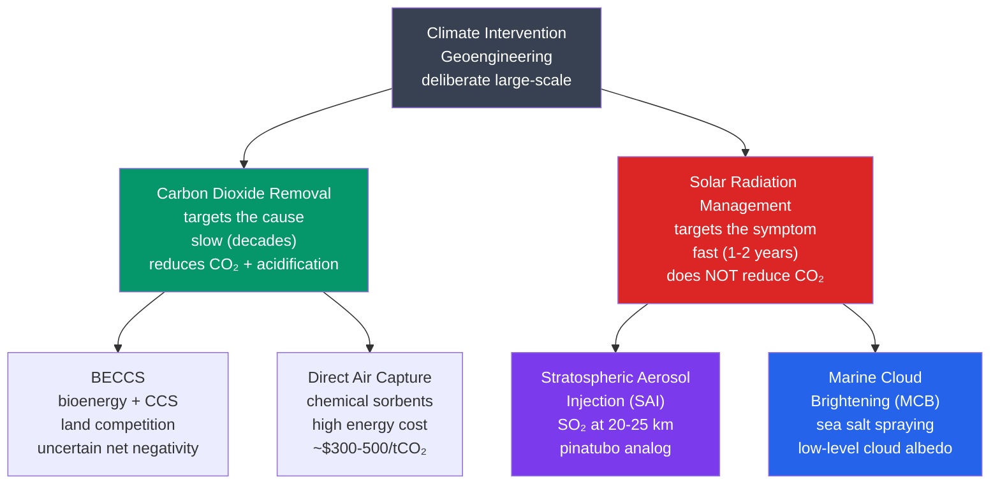

# 🌡️ Geoengineering and Climate Intervention

> [!abstract] TL;DR
> **Geoengineering** (climate intervention) is the deliberate, large-scale manipulation of the Earth system to counteract climate change. It splits into two philosophically opposite branches. **Carbon Dioxide Removal (CDR)** treats the *cause* by pulling CO₂ back out of the air — **BECCS**, **direct air capture (DAC)**, **enhanced weathering**, **ocean fertilization**, **afforestation** — but it is **slow (decades)** and current capacity (~2 GtCO₂/yr) is roughly **five times too small**. **Solar Radiation Management (SRM)** treats only the *symptom* by reflecting sunlight; its flagship is **Stratospheric Aerosol Injection (SAI)** — releasing SO₂ at 20–25 km to form sulfate haze, modelled on the **1991 Mt. Pinatubo** eruption (which cooled Earth ~0.5 °C for ~2 years). SAI is **fast and cheap**, potentially cooling the planet ~1 °C within 1–2 years, but carries severe risks: **termination shock** (violent rebound warming if injection stops while CO₂ is still high), **altered monsoon and precipitation** patterns, **stratospheric ozone loss**, and a **governance vacuum** (a single actor could deploy unilaterally). Crucially, **no SRM method addresses ocean acidification** — that requires removing the CO₂ itself.

---

## Intuition — analogy FIRST

Imagine a patient with a serious infection running a high fever. There are two completely different ways to respond. The first is to give **antibiotics** that attack the infection itself — the *cause* of the fever. This is slow: the drugs take days to work, you need a sustained course, but when it's done the patient is actually *cured*. That is **Carbon Dioxide Removal** — going after the excess CO₂ that is the root cause of the warming.

The second response is to drape a **cold, wet cloth** over the patient's forehead and sit them under a shade. The fever *number* on the thermometer drops within minutes, and it's cheap and fast — but you have done **nothing** to the infection, which keeps raging underneath. Worse, if you snatch the cloth away while the infection is still there, the fever comes **roaring back**, potentially higher than before. That is **Solar Radiation Management**: a planetary sun-shade that masks the temperature symptom while the CO₂ (and the ocean acidification it drives) continues unchecked. The "snatch the cloth away" danger has a name — **termination shock**.

Nature already runs both experiments for us. **Volcanoes do natural SAI**: when Pinatubo threw ~15–20 million tonnes of SO₂ into the stratosphere in June 1991, a sulfate haze spread around the globe and cooled the planet by about **0.5 °C for two years** before settling out — a real-world proof of concept, and the single most-studied analog for engineered SAI. Meanwhile **forests and the ocean do natural CDR**, quietly absorbing about half of what humanity emits. Geoengineering is, in essence, the proposal to do *deliberately and at scale* what volcanoes and biospheres do by accident.

---

## How It Works



**Two branches, two clocks.** The taxonomy above hides the single most important fact about geoengineering: **CDR and SRM operate on different timescales and attack different variables.** CDR lowers the *stock* of atmospheric CO₂ — the actual driver — but does so at the crawling pace of the carbon cycle (decades to centuries) and at enormous cost. SRM lowers the *planetary temperature* directly by dimming incoming sunlight, acting within a year or two, but leaves the CO₂ (and its chemistry) entirely untouched. They are not competitors so much as tools for different jobs: CDR is a cure, SRM is a tourniquet.

**CDR — the removal menu.** The methods differ in permanence, cost, and land footprint:

- **Afforestation / reforestation** — grow trees to fix carbon in wood and soil. Cheap and co-beneficial, but **land-limited**, reversible (fire, logging, drought), and saturating as forests mature.
- **BECCS** (Bioenergy with Carbon Capture and Storage) — grow biomass (which pulls down CO₂), burn it for energy, and capture the flue-gas CO₂ into geological storage. The workhorse of most IPCC 1.5 °C scenarios, but its **net negativity is uncertain** (fertilizer, transport, land-use emissions) and it competes ferociously for cropland.
- **DAC** (Direct Air Capture) — run air over chemical sorbents (amines or hydroxide solutions) that grab CO₂, then heat them to release a pure stream for storage. Nearly **unlimited siting** and **permanent** if geologically stored, but very **energy-hungry** (~5–10 GJ per tonne CO₂) and expensive (~$300–600/tCO₂ today, with roadmaps toward ~$100–300).
- **Enhanced weathering** — spread finely ground **silicate rock** (e.g. basalt, olivine) on fields; it reacts with CO₂ and rainwater over years, locking carbon as bicarbonate. Related **ocean alkalinity enhancement** adds alkaline minerals to seawater. Both require **mining and grinding billions of tonnes** of rock.
- **Ocean iron fertilization** — seed iron-limited ocean regions to trigger plankton blooms that sink carbon to the deep. Cheap in principle, but **permanence is poor** (most carbon is re-respired near the surface) and ecological side effects are large; effectively barred under the London Protocol.
- **Blue carbon** — restore **mangroves, salt marshes, and seagrasses**, which store carbon in waterlogged sediments at high density per hectare.

**SRM — the reflection menu.**

- **SAI** (Stratospheric Aerosol Injection) — the main event; inject a precursor into the stratosphere to form reflective aerosol.
- **MCB** (Marine Cloud Brightening) — spray fine **sea-salt** droplets into low marine clouds to add cloud condensation nuclei, making clouds whiter and more reflective (the **Twomey effect**). Regional, not global.
- **Cirrus cloud thinning** — technically a *longwave* method: seed high cirrus so ice crystals grow larger and fall out faster, letting more infrared escape to space. Physically distinct from the other two (it works on outgoing heat, not incoming sunlight).

**SAI physics — from SO₂ to a planetary parasol.** Injected **SO₂** is oxidized in the stratosphere (SO₂ + OH → … → **H₂SO₄**), and the sulfuric acid condenses into a fine haze of **sulfate aerosol droplets** with an effective radius of ~0.3–0.5 µm — comparable to the wavelength of visible light, which is exactly the size that **scatters sunlight most efficiently** back to space. The resulting negative radiative forcing scales roughly as **−0.35 W/m² per Tg of SO₂ injected per year**. Pinatubo's ~9 Tg SO₂ pulse produced a peak forcing near **−3 W/m²** and about **−0.5 °C** of global cooling that decayed over ~2 years as the aerosol settled out — the empirical anchor for every SAI estimate.

---

## Key Concepts / Details

### Secondary Level

- **Two families.** Geoengineering divides into **Carbon Dioxide Removal (CDR)** — taking CO₂ back out of the air — and **Solar Radiation Management (SRM)** — reflecting some sunlight so the planet absorbs less heat. CDR fixes the *cause*; SRM masks the *symptom*.
- **CDR is slow; SRM is fast.** Removing enough CO₂ to matter takes **decades**, and we currently remove only a small fraction of what we emit. SRM (especially SAI) could cool the planet within **1–2 years** — but it does nothing to the CO₂.
- **BECCS, DAC, SAI in plain terms.** **BECCS** = grow plants that soak up CO₂, burn them for power, and bury the exhaust CO₂. **DAC** = machines with special chemicals that suck CO₂ straight from the air. **SAI** = tiny reflective particles sprayed high in the sky to bounce sunlight away, copying what big volcanoes do.
- **The volcano lesson.** **Mt. Pinatubo (1991)** blasted sulfur high into the atmosphere and cooled the whole world by about **0.5 °C for two years**. It proves SAI *could* cool the planet — but also that the effect fades once the particles fall out, so it must be topped up continuously.
- **SRM ignores ocean acidification.** Even if SAI perfectly cancelled the warming, CO₂ would keep dissolving into the oceans and making them **more acidic**, harming shellfish and coral reefs. Only removing the CO₂ (CDR) fixes that.
- **Termination shock.** If we lean on SAI to hold temperatures down while CO₂ keeps rising, and then **suddenly stop**, all the masked warming arrives at once — temperatures could **snap up dangerously fast**, faster than ecosystems or societies can adapt.
- **Who decides?** SAI is cheap enough that one country — or even a wealthy individual — could try it, but its effects (droughts, monsoon shifts) would be felt worldwide. **Nobody has the authority to decide for the whole planet**, and no rules exist for compensating losers. This governance gap is as serious as the science.

### Undergraduate Level

- **SAI mechanics.** Inject **SO₂ at 20–25 km** (lower stratosphere, above weather and washout). Oxidation SO₂ + OH → HSO₃ → … → **H₂SO₄**, which nucleates and condenses into **sulfate droplets** of effective radius **~0.3–0.5 µm**. The **Mie scattering efficiency** for such particles peaks near visible wavelengths — grow the particles too big (from over-injection) and scattering per unit mass *falls*, a self-limiting inefficiency.
- **Forcing per unit mass.** A useful engineering rule: **radiative forcing ≈ −0.35 W/m² per Tg(SO₂) injected per year** (sub-linear at high loadings because coagulation grows the particles). Pinatubo: **~9 Tg SO₂ → ≈ −3 W/m² → ≈ −0.5 °C** peak cooling, decaying over ~2 years.
- **How much to offset +2 °C?** Offsetting the roughly +4 W/m² forcing associated with ~2 °C of warming implies a *sustained* injection of order **10–20 Tg SO₂ per year, continuously** — comparable to a Pinatubo eruption **every year or two, forever**, until the underlying CO₂ is drawn down.
- **Termination shock, quantified.** If a masked forcing of several W/m² is suddenly unmasked, the temperature relaxes toward the (now much higher) equilibrium set by the CO₂. Because the deployment might mask **1–2 °C** or more, an abrupt halt could drive warming of order **0.5 °C per decade** — several times faster than current anthropogenic warming (~0.2 °C/decade), overwhelming ecological adaptation.
- **MCB via the Twomey effect.** Spraying **sea-salt aerosol** into the marine boundary layer adds **cloud condensation nuclei (CCN)**; for fixed liquid water, more CCN means **more, smaller droplets**, which raises cloud **albedo**. Effect is **regional** — it only works where susceptible low stratocumulus already exist (e.g. off Peru, California, Namibia).
- **The CDR capacity gap.** Current engineered + land-based CDR is roughly **~2 GtCO₂/yr**; 1.5–2 °C pathways call for on the order of **~10 GtCO₂/yr** by mid-century — a **~5× scale-up** that does not yet exist.
- **DAC energetics.** Thermodynamic minimum to separate CO₂ from 420 ppm air is small (~0.5 GJ/tCO₂), but real systems spend **~5–10 GJ/tCO₂** on sorbent regeneration and fans; sourcing that energy from fossil fuels can erase the benefit.
- **BECCS land demand.** IPCC SR1.5 scenarios that rely heavily on BECCS require on the order of **1–7 million km²** of dedicated bioenergy land — comparable to the area of India to roughly one-and-a-half times that — colliding with food security and biodiversity.

### Graduate Level

- **GeoMIP and the G-experiments.** The **Geoengineering Model Intercomparison Project (GeoMIP)** standardized idealized SRM runs across many GCMs. **G1** instantaneously **quadruples CO₂** and then **reduces the solar constant** just enough to restore global-mean top-of-atmosphere balance. The headline result: **global mean temperature is restored, but the regional pattern is not** — the **tropics are over-cooled** and the **high latitudes are under-cooled** relative to the pre-industrial climate. G2–G6 add transient scenarios, SAI-specific aerosol runs (G6sulfur), and comparisons against emissions cuts (G6solar vs. G6sulfur).
- **Why uniform dimming ≠ un-warming.** CO₂ warming and solar dimming have **different spatial and vertical structures**. Greenhouse forcing is strongest where the atmosphere is dry and cold (high latitudes, upper troposphere); solar reduction acts where insolation is greatest (the tropics). Cancelling the two in the *global mean* therefore leaves a **residual gradient**: over-cooled tropics, under-cooled poles. Because the greenhouse effect also warms nights and winters more than days and summers, uniform sunlight reduction **cannot** undo those asymmetries either.
- **The hydrological cycle responds to sunlight, not just temperature.** Global precipitation is constrained by the atmospheric **energy budget**, and shortwave forcing changes it more per degree than longwave (CO₂) forcing does. Consequently SAI that restores *temperature* tends to **over-suppress the global hydrological cycle**, producing a relatively **drier world** at the same temperature — a robust multi-model GeoMIP finding.
- **SAI, interhemispheric forcing, and the ITCZ.** Aerosol injected asymmetrically between hemispheres cools one hemisphere more than the other; the **Intertropical Convergence Zone (ITCZ)** migrates toward the *warmer* hemisphere. This is the mechanism by which SAI can **shift monsoon rainfall** — historically, large Northern-Hemisphere volcanic/aerosol cooling has been linked to **Sahel droughts** and weakened Asian and African monsoons. Injection strategy (latitude, hemispheric balance, seasonal timing) becomes a design knob with distributional consequences.
- **Stratospheric ozone impacts.** Sulfate aerosol provides surface area for **heterogeneous chemistry** and alters stratospheric dynamics and temperature, enhancing **halogen-driven ozone loss**, especially over the **poles** and in the lower stratosphere; SAI also warms the tropical lower stratosphere, perturbing the **QBO** and transport. Using **calcite (CaCO₃)** instead of sulfate has been proposed to reduce ozone damage, though its microphysics are far less validated.
- **The "free driver" problem.** Unlike mitigation (a *free-rider* / collective-action problem where everyone wants others to pay), SAI is cheap enough — order **a few billion dollars per year**, within reach of a single mid-sized state — that the binding constraint flips. Whichever actor most wants a cooler climate can simply **do it unilaterally**, imposing global side effects without consent: a **"free driver."** This creates unique geopolitical risk, incentives for counter-geoengineering, and attribution disputes over any subsequent drought or flood.
- **Lock-in and the social contract.** Because SAI masks rather than removes forcing, once deployed at scale it must be **maintained indefinitely** (and ideally *ramped up*) until CO₂ is drawn down — with **no safe exit** absent aggressive CDR. This "solar geoengineering social contract" demands multi-generational institutional stability that no existing body can guarantee, and raises the **moral-hazard** worry that its mere prospect erodes mitigation effort.
- **CDR permanence, ranked.** Storage durability spans orders of magnitude: **DAC/BECCS with geological injection ≈ permanent (>10⁴ yr)**; **enhanced weathering** durable (bicarbonate/carbonate) but slow and hard to verify; **soil and forest carbon** vulnerable to reversal (fire, tillage, drought) on decadal scales; **ocean iron fertilization** largely **non-permanent** as most fixed carbon re-mineralizes above the thermocline. BECCS net-negativity hinges on **land-use-change and soil-carbon** accounting.
- **Model uncertainties.** SAI projections inherit large uncertainty from **aerosol microphysics** — nucleation, coagulation, and the aerosol **size distribution** control both scattering efficiency and stratospheric heating — which GCMs parameterize crudely. This propagates into the estimated forcing-per-Tg and the required injection mass.

---

## Python Demo — The Pinatubo Analog for SAI

```python
# Model the Mt. Pinatubo (June 1991) eruption as a natural analog for
# Stratospheric Aerosol Injection (SAI), using a simple energy-balance
# impulse-response model for global-mean surface temperature.
#
#   Aerosol forcing (decays as the sulfate settles out of the stratosphere):
#       F(t) = -3.0 W/m^2  *  exp(-t / tau_aero),   tau_aero = 1.5 yr
#
#   Temperature response (one-box ocean mixed layer):
#       dT/dt = ( F(t) - dT/lambda ) / C
#   with climate feedback parameter  lambda = 0.9 K/(W/m^2)
#   and effective heat capacity      C      = 14 W*yr/m^2/K
#
# We integrate for 5 years and compare the modelled cooling to the
# observed Pinatubo peak of ~ -0.5 C.

import numpy as np
from scipy.integrate import solve_ivp
import matplotlib.pyplot as plt

# --- Model parameters ---
F0        = -3.0     # peak aerosol radiative forcing, W/m^2 (Pinatubo, ~9 Tg SO2)
tau_aero  = 1.5      # e-folding lifetime of stratospheric aerosol, years
lam       = 0.9      # climate feedback (sensitivity) parameter, K/(W/m^2)
C         = 14.0     # effective ocean-mixed-layer heat capacity, W*yr/m^2/K

def forcing(t):
    """Time-dependent aerosol forcing from a single impulsive injection."""
    return F0 * np.exp(-t / tau_aero)

def dTdt(t, T):
    """One-box energy balance: heating minus restoring, per unit heat capacity."""
    return (forcing(t) - T / lam) / C

# --- Integrate 0 to 5 years ---
t_span = (0.0, 5.0)
t_eval = np.linspace(*t_span, 601)
sol = solve_ivp(dTdt, t_span, y0=[0.0], t_eval=t_eval, rtol=1e-8, atol=1e-10)

t  = sol.t
T  = sol.y[0]
F  = forcing(t)

# --- Diagnostics ---
i_min      = np.argmin(T)
T_peak     = T[i_min]
t_peak     = t[i_min]
T_eq_full  = lam * F0   # hypothetical equilibrium if forcing were held at F0

print(f"Peak cooling      : {T_peak:6.2f} C   at t = {t_peak:.2f} yr")
print(f"Observed Pinatubo : ~-0.50 C   at t ~ 1 yr")
print(f"Climate time const: {lam * C:5.1f} yr   (= lambda*C, sets the recovery pace)")
print(f"(Equilibrium if F0 held forever would be {T_eq_full:.2f} C)")

# --- Plot ---
fig, (ax1, ax2) = plt.subplots(2, 1, figsize=(9, 8), sharex=True)

ax1.plot(t, F, color="#7c3aed", lw=2.5)
ax1.axhline(0, color="k", lw=0.6, ls=":")
ax1.fill_between(t, 0, F, color="#7c3aed", alpha=0.20)
ax1.set_ylabel("Aerosol forcing  F(t)  (W/m$^2$)")
ax1.set_title("Pinatubo analog: impulsive stratospheric aerosol forcing")
ax1.grid(alpha=0.3)

ax2.plot(t, T, color="#dc2626", lw=2.5, label="Modelled $\\Delta T$")
ax2.axhline(-0.5, color="#2563eb", ls="--", lw=1.5, label="Observed Pinatubo peak (~-0.5 C)")
ax2.scatter([t_peak], [T_peak], color="#dc2626", zorder=5)
ax2.annotate(f"peak {T_peak:.2f} C @ {t_peak:.1f} yr",
             (t_peak, T_peak), textcoords="offset points", xytext=(20, -12),
             color="#dc2626")
ax2.axhline(0, color="k", lw=0.6, ls=":")
ax2.set_xlabel("Years after eruption / injection")
ax2.set_ylabel("Temperature response  $\\Delta T$  (C)")
ax2.set_title("Global-mean cooling and recovery")
ax2.legend(loc="lower right")
ax2.grid(alpha=0.3)

plt.tight_layout()
plt.show()
```

**What the model shows.** The forcing spikes to −3 W/m² and decays with the ~1.5-year aerosol lifetime, while the temperature — damped by the ocean's heat capacity — lags behind, reaching peak cooling and then **recovering over several years** as the haze settles out. With these textbook parameters the one-box model gives a peak of roughly **−0.25 to −0.3 °C**, the right *order of magnitude* but shallower and later than the observed **~−0.5 °C at ~1 year**. The discrepancy is instructive: the recovery pace is set by the climate time constant **λ·C ≈ 12.6 years**, so a large mixed-layer heat capacity both **damps** the peak and **delays** it. Using a shallower effective heat capacity for the fast initial response deepens and sharpens the dip toward the observed value — a reminder that even the simplest energy-balance model exposes the central tension of SAI: the **forcing is transient (must be renewed)** while the **climate system's memory is long**, which is exactly why *stopping* injection abruptly produces termination shock.

---

## Real-World Notes

- **Harvard SCoPEx (blocked, 2021).** The Stratospheric Controlled Perturbation Experiment proposed lofting a balloon to ~20 km over the US Southwest and releasing a few kilograms of **calcium carbonate (CaCO₃)** to study how particles disperse and chemically react — a tiny, purely diagnostic test. An early engineering flight planned from **Kiruna, Sweden** was **cancelled in 2021** after opposition from the **Saami Council** and environmental groups, who objected that even research normalizes deployment. It became the emblem of the field's **governance vacuum**: the science was trivially small, the politics were not.
- **US National Academies, "Reflecting Sunlight" (2021).** The National Academies of Sciences, Engineering, and Medicine recommended a **cautious, transparent US research program** (~$100–200M over 5 years) on solar geoengineering *with* research governance — the first formal, government-level endorsement of organized SRM research, explicitly framed as informing decisions, **not** a commitment to deploy.
- **Climeworks "Orca," Iceland (2021).** The world's first commercial DAC-plus-storage plant captures about **4,000 tCO₂/year**, mineralizing it underground with Carbfix. Set against humanity's **~36–40 billion tonnes/year** of emissions, Orca offsets roughly **ten seconds** of global emissions annually — a vivid illustration of the **scale gap** between today's CDR and what climate targets require.
- **Tambora and the "Year Without a Summer" (1815–16).** The eruption of **Mount Tambora** injected enough sulfur to cool the Northern Hemisphere by ~0.4–0.7 °C, causing **crop failures, famine, and killing frosts** across New England and Europe in 1816. It is the cautionary tale for *sustained* aerosol cooling: global-mean cooling can coincide with **regional agricultural catastrophe** driven by disrupted precipitation and growing seasons.
- **China's weather-modification program.** The world's largest operational weather-modification effort uses on the order of **tens of thousands of rocket and artillery sorties plus aircraft** each year to seed clouds (silver iodide) for **rainfall and hail suppression** over drought- and hail-prone regions. It is *not* climate geoengineering, but it demonstrates both the appetite for large-scale atmospheric intervention and the diplomatic friction (accusations of "stealing rain" from downwind neighbors) that global SRM would magnify.

---

## Common Pitfalls

1. **SRM is not a substitute for cutting emissions.** SAI can hold the *temperature* down, but it does **nothing** about **ocean acidification**, must be maintained **permanently**, and adds new risks (monsoon shifts, ozone loss). Treating it as a licence to keep emitting sets up **termination shock** and locks society into indefinite maintenance with no exit — the "moral hazard" of geoengineering.
2. **CDR is not the same as "net zero."** **Net zero** means balancing *ongoing* emissions against *ongoing* removals so no *additional* CO₂ accumulates. **CDR** goes further, removing CO₂ that was **already emitted** to draw the concentration back *down* (net-negative). Conflating the two hides the fact that hitting net zero still leaves the planet at an elevated, warming CO₂ level.
3. **The volcanic analog is imperfect.** Pinatubo was a **single tropical pulse** of SO₂ into the lower stratosphere that faded in ~2 years. Engineered SAI would need **continuous, controlled injection** with a chosen latitude/altitude/seasonal strategy, could use **CaCO₃ instead of SO₂** to limit ozone damage, and — unlike a one-off eruption — carries **termination-shock** risk precisely because it must be sustained. Reading Pinatubo as "SAI is safe and easy" ignores all of this.
4. **MCB is regional, not global.** Marine Cloud Brightening only works where **susceptible low marine clouds already exist** (a few subtropical stratocumulus decks). It cannot cool the planet uniformly, and by altering one region's cloud albedo it can **shift circulation and dry out areas downwind** — a local tool mistaken for a global thermostat.
5. **"Enhanced weathering" is not small.** It sounds like a gentle, natural fix, but reaching **gigatonne-per-year** CDR means **mining, grinding, transporting, and spreading billions of tonnes of silicate rock annually** — an industrial operation rivaling global coal mining, with its own energy, dust, and land footprints. "Natural-sounding" does not mean "small-scale."

---

## Related Concepts

- [[_MOC_Climatology_and_Climate_Change]] — section map for the climatology & climate-change unit; start here to orient
- [[Anthropogenic_Climate_Change]] — the warming that geoengineering responds to; explains why net-zero and CDR are distinct, and why SRM is not a substitute for mitigation
- [[Climate_Sensitivity_and_Feedbacks]] — the feedback parameter λ that converts SAI's negative forcing into cooling, and sets the equilibrium the system rebounds toward in termination shock
- [[Climate_Models_and_Projections]] — the GCM/ESM machinery behind GeoMIP; SRM must be tested in the same models used for SSP projections
- [[Atmospheric_Optics_and_Aerosols]] — the Mie-scattering physics of ~0.5 µm sulfate droplets that makes SAI work, and the aerosol size-distribution controls on its efficiency
- [[Greenhouse_Effect_and_Radiative_Forcing]] — the +W/m² forcing SAI tries to offset with a −W/m² of its own; the two have different spatial structures, which is why cancellation is imperfect
- [[Cloud_Formation_and_Microphysics]] — CCN activation and the Twomey effect that underlie Marine Cloud Brightening and cirrus thinning
- [[_MOC_Astronomy_Master]] — cross-vault entry point; SAI is a form of engineered planetary albedo control, akin to space-based sunshade concepts
- [[_MOC_Chemistry_Master]] — cross-vault chemistry entry point
- [[Chemical_Kinetics]] — the oxidation kinetics SO₂ + OH → H₂SO₄ that convert injected gas into reflective aerosol, and the heterogeneous chemistry driving SAI ozone loss
- [[Acids_Bases_and_pH]] — the carbonate/bicarbonate equilibria behind ocean acidification (which SRM cannot fix) and behind enhanced-weathering / ocean-alkalinity CDR
- [[_MOC_Physics_Master]] — cross-vault physics entry point
- [[Electromagnetic_Waves_and_Radiation]] — the shortwave scattering (SRM) versus longwave trapping (CO₂) that define the two levers of the energy budget
- [[_MOC_Earth_Science_Master]] — cross-vault Earth-science entry point; geological CO₂ storage, silicate weathering, and the deep carbon cycle underpin CDR permanence

---

## Review Questions

**Secondary**
- What is the difference between **Carbon Dioxide Removal (CDR)** and **Solar Radiation Management (SRM)**? Which one addresses the *cause* of warming and which the *symptom*?
- Why does SRM (such as SAI) **not** solve **ocean acidification**, even if it perfectly cancels the warming?
- What does the **1991 Mt. Pinatubo** eruption teach us about the potential effects — and limits — of stratospheric aerosol injection?

**Undergraduate**
- SAI requires injecting SO₂ into the stratosphere at ~20–25 km. Using the approximate relationship **−0.35 W/m² per Tg SO₂/year**, calculate the annual SO₂ injection rate needed to offset a forcing of **+4 W/m²**. *(Answer: 4 / 0.35 ≈ **11.4 Tg SO₂/yr, sustained** — roughly a Pinatubo's worth of sulfur every year.)*
- Explain the **termination-shock** problem. If SAI had been masking **−2 °C** of cooling and were **abruptly stopped**, estimate the rate of rebound warming, assuming a feedback parameter **λ = 1 K/(W/m²)** and that the ocean mixed layer relaxes toward the unmasked equilibrium over **~10 years**. *(The 2 °C corresponds to an unmasked forcing of ~2 W/m²; relaxing ~2 °C over ~10 years gives an initial rate of order **~0.2 °C/yr ≈ 2 °C/decade** — an order of magnitude faster than present-day warming, and far too fast for ecosystems to track.)*

**Graduate**
- Describe the **GeoMIP G1** experiment (4×CO₂ balanced by reduced insolation) and its key results. Why does a **uniform reduction in the solar constant** fail to reproduce the unperturbed climate — specifically, why are **tropical temperatures over-cooled** relative to the poles, and what happens to the **global hydrological cycle** at fixed temperature?
- Explain the **precipitation and monsoon** impacts of SAI found across multi-model GeoMIP comparisons, including the role of **interhemispheric aerosol forcing** and **ITCZ** displacement.
- Contrast the **"free driver"** governance problem of SAI with the **"free rider"** problem of mitigation. Why does the **low deployment cost** of SAI create *unique* geopolitical risks, and what is the "lock-in" / no-exit dilemma that follows from SRM masking rather than removing forcing?

---

## Sources

- National Academies of Sciences, Engineering, and Medicine (2021). *Reflecting Sunlight: Recommendations for Solar Geoengineering Research and Research Governance*. The National Academies Press.
- Irvine, P. J., Emanuel, K., He, J., Horowitz, L. W., Vecchi, G., & Keith, D. (2019). "Halving warming with idealized solar geoengineering moderates key climate hazards." *Nature Climate Change*, 9, 295–299.
- Smith, W., & Wagner, G. (2018). "Stratospheric aerosol injection tactics and costs in the first 15 years of deployment." *Environmental Research Letters*, 13(12), 124001.

---

#Meteorology #Climatology #Geoengineering #SAI #CDR #ClimateIntervention
