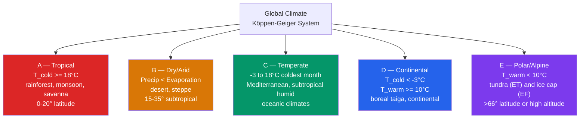

# 🗺️ Köppen Climate Classification

> [!abstract] TL;DR
> The **Köppen–Geiger** system sorts Earth's climates into **5 major types (A–E)** and ~**30 subtypes**, using only **monthly mean temperature and precipitation thresholds** that were reverse-engineered from **natural vegetation boundaries**. The majors are **A — tropical** ($T_\text{cold}\ge 18\,°\text{C}$), **B — dry/arid** (precipitation below an evaporation-driven threshold), **C — temperate** ($-3\,°\text{C}\le T_\text{cold}\le 18\,°\text{C}$), **D — continental/boreal** ($T_\text{cold}<-3\,°\text{C}$, $T_\text{warm}\ge 10\,°\text{C}$), and **E — polar/alpine** ($T_\text{warm}<10\,°\text{C}$). The map is essentially a printout of the **[[Global_Atmospheric_Circulation|general circulation]]**: the rising/sinking branches of the **Hadley cell** carve out A (wet tropics) and B (subtropical deserts); the eddy-driven **Ferrel cell** governs C and D; the **polar cell** delivers E. Under warming, **B (arid) zones are expanding poleward** and **D→C reclassification** is spreading across the Northern Hemisphere — the classification is itself becoming a climate-change indicator.

---

## Intuition — analogy FIRST

Think of climate types as **recipes that plants already know how to read**. Long before anyone measured a thermometer, a botanist could stand in a landscape and name the climate just by looking: broadleaf evergreen canopy dripping with rain means one thing, thornscrub and cactus another, birch-and-spruce taiga a third, cushion plants over frozen ground a fourth. **Vegetation is a slow, honest integrator of climate** — it can only grow where temperature and water allow, so the *edge* of a forest is really the edge of a climate.

Wladimir **Köppen worked backwards from that insight**. Instead of drawing climate boundaries and hoping vegetation followed, he took the **map of the world's biomes** (tropical rainforest, savanna, desert, Mediterranean scrub, temperate deciduous forest, boreal forest, tundra, ice cap) and asked: *what temperature and rainfall numbers separate one biome from the next?* The A–E letters and their thresholds are the answer. So reading a Köppen map is reading **where each climate "lives"** according to what the global circulation delivers to that latitude and coast: **hot + wet** near the equator, **hot + dry** in the subtropics, **mild + variable** in the midlatitudes, **cold + strongly seasonal** in the boreal interior, and **frigid year-round** at the poles and mountaintops.

---

## How It Works

The system is a **decision tree** applied to a location's 12 monthly mean temperatures and 12 monthly precipitation totals. Only a handful of derived numbers matter — the temperature of the **coldest** and **warmest** months, the **annual total** and **seasonal distribution** of precipitation, and the **count of months above 10 °C** — because those are exactly the quantities that limit plant growth. A first letter fixes the **major type**, a second letter encodes the **precipitation regime** (dry summer `s`, dry winter `w`, no dry season `f`, or monsoon `m`), and a third letter refines the **thermal character** (`a/b/c/d` for summer heat, `h/k` for hot vs cold deserts, `T/F` for tundra vs ice cap).



**The order of the tests matters.** The **B (arid) test is applied first**, before A/C/D, because dryness overrides temperature — a hot-but-parched place is a desert, not a "tropical" or "temperate" climate. Only if a location passes the aridity test (enough rain for its warmth) do we then sort it by temperature into A, C, D, or E.

- **A — Tropical** ($T_\text{cold}\ge 18\,°\text{C}$; every month is warm). Split by the **dry season**: **Af** (rainforest) if the driest month still gets $\ge 60$ mm; **Am** (monsoon) if the driest month is drier than that but the annual total is large enough to carry a short dry spell ($P_\text{dry}\ge 100-P_\text{ann}/25$); **Aw/As** (savanna) if there is a pronounced dry season.
- **B — Dry** (precipitation below the dryness threshold, see below). **BW** (desert) if below *half* the threshold, **BS** (steppe) otherwise; then **h** (hot, $\bar T\ge 18\,°\text{C}$) or **k** (cold, $\bar T<18\,°\text{C}$).
- **C — Temperate** (coldest month between **−3 and 18 °C**, warmest above 10 °C). Second letter **s** (dry summer → **Mediterranean, Cs**), **w** (dry winter → monsoon-margin, **Cw**), or **f** (evenly wet, oceanic/humid subtropical, **Cf**); third letter **a** (hot summer), **b** (warm summer), **c** (cool short summer).
- **D — Continental/boreal** (coldest month **below −3 °C**, warmest above 10 °C). Same **f/s/w** and **a/b/c** letters, plus **d** for brutally cold winters ($T_\text{cold}\le -38\,°\text{C}$). The `Df` band is the **boreal forest / taiga**.
- **E — Polar/alpine** (warmest month below 10 °C — the treeline). **ET** (tundra, $0\le T_\text{warm}<10$) and **EF** (permanent ice cap, $T_\text{warm}<0$). High mountains reproduce this whole ladder vertically; some updated systems add an **H (highland)** class for terrain where altitude, not latitude, sets the climate.

**Why the letters map onto the circulation.** The rising branch of the **Hadley cell** at the ITCZ soaks the equator → **A**; its descending branch at 15–35° bakes the subtropics dry → **B** on the west and interior of continents. The **Ferrel cell** and its migrating storm systems keep the midlatitudes mild and variably wet → **C** and **D**, with **continentality** (distance from the moderating ocean) pushing interiors from C into D. The **polar cell** starves high latitudes of heat → **E**. Ocean proximity vs. continental interior, and windward vs. leeward slope, then decide the *second and third* letters.

**Alternatives.** Köppen is empirical and uses only two variables. **Thornthwaite (1948)** is more physical — it classifies by **potential evapotranspiration (PET)** and a moisture index. **Holdridge life zones** plot **biotemperature**, **annual precipitation**, and a **PET ratio** on a triangular diagram to give 38 zones. These matter because a two-parameter scheme cannot fully capture the **water balance** that actually governs vegetation.

---

## Key Concepts / Details

### Secondary Level

- **The five climates, and what they feel like.** **A (tropical)** — hot and humid every month, no real winter (Amazon rainforest = **Af**; monsoon Asia = **Am/Aw**). **B (dry)** — evaporation outruns rainfall (Sahara = **BWh**). **C (temperate)** — mild, four-season, no severe winter (Paris/London = **Cfb**; California/Italy = **Cs** Mediterranean). **D (continental)** — hot-ish summers but genuinely cold, snowy winters (Moscow = **Dfb**; Siberia = **Dfc**). **E (polar)** — no month warm enough for trees (Antarctica = **EF**; Arctic coasts = **ET**).
- **Latitude sets the type.** Trace a meridian from the equator to the pole and you climb the alphabet: **A → B → C → D → E**. The tropics are wet (A), the subtropics dry (B), the midlatitudes temperate/continental (C/D), the poles frozen (E).
- **Why the Sahara sits at ~25°N, not the equator.** Air rises and dumps its rain at the equator, then flows poleward aloft and **sinks at 25–35°**, warming and drying as it descends (the **Hadley cell**'s descending branch and the subtropical highs). That belt of sinking air — not the equator — is where the great hot deserts ring the planet. See [[Global_Atmospheric_Circulation]].
- **Mediterranean climate (Cs)** hugs the **west coasts around 30–45°**: dry, sunny summers when the subtropical high shifts poleward over it, and wet winters when the storm track slides back down. California, central Chile, the Cape of South Africa, southwest Australia, and the Mediterranean basin all share it.
- **Monsoon climates (Am, Aw)** have a hot rainy season and a dry season set by the **seasonal migration of the ITCZ** — the defining climate of India, the Sahel, and much of tropical Africa and South America.
- **The boreal forest (taiga) = Df.** The largest forest on Earth is a single Köppen band: cold-winter, short-summer continental climate across Canada, Scandinavia, and Russia.
- **Altitude is a fast-forward through the alphabet.** Climbing a tropical mountain, you can pass from **A → C → D → E** in a few thousand metres, which is why equatorial peaks can carry glaciers.

### Undergraduate Level

**The decision tree, formally.** Let $\bar T$ = mean annual temperature (°C), $P_\text{ann}$ = annual precipitation (mm), $T_\text{cold},T_\text{warm}$ = coldest/warmest monthly means, and $n_{10}$ = number of months with $T\ge 10\,°\text{C}$.

**Step 1 — dryness (B) test, applied first.** Compute the **dryness parameter**
$$P_\text{th} = 2\bar T + k,\qquad k=\begin{cases}28 & \text{if} \ge 70\%\text{ of } P \text{ falls in the high-sun (summer) half}\\ 14 & \text{if } 30\!-\!70\%\text{ falls in summer}\\ 0 & \text{if} < 30\%\text{ falls in summer (winter rain)}\end{cases}$$
Then it is **B** if $P_\text{ann} < 10\,P_\text{th}$; within B it is **BW** (desert) if $P_\text{ann} < 5\,P_\text{th}$, else **BS** (steppe); and **h** if $\bar T\ge 18$, else **k**. The seasonal constant $k$ encodes evaporation timing: **summer rain evaporates fast, so a summer-rain regime needs more of it** to escape the "desert" label — which is why the constant is largest ($+28$) for summer-dominant precipitation.

**Step 2 — tropical (A).** If not B and $T_\text{cold}\ge 18\,°\text{C}$: **Af** if $P_\text{dry month}\ge 60$; else **Am** if $P_\text{dry month}\ge 100 - P_\text{ann}/25$; else **Aw/As**.

**Step 3 — C vs D boundary.** If not B/A: it is **C** when $-3\,°\text{C}\le T_\text{cold}\le 18\,°\text{C}$ and **D** when $T_\text{cold}<-3\,°\text{C}$ — both require $T_\text{warm}>10\,°\text{C}$. (The **−3 °C** boundary is the *original* Köppen line, meant to mark where a lasting winter snowpack forms; modern Köppen–Geiger revisions such as Peel et al. 2007 and Kottek et al. 2006 replace it with **0 °C**. The two agree for the vast majority of the land surface.)

**Step 4 — precipitation letter (C/D).** **s** (dry summer): driest summer month $<40$ mm **and** $<\tfrac13$ of the wettest winter month. **w** (dry winter): driest winter month $<\tfrac1{10}$ of the wettest summer month. Otherwise **f**.

**Step 5 — temperature letter (C/D).** **a**: $T_\text{warm}\ge 22\,°\text{C}$. **b**: $T_\text{warm}<22$ but $n_{10}\ge 4$. **c**: $n_{10}<4$ (and $T_\text{cold}>-38$). **d** (D only): $T_\text{cold}\le -38\,°\text{C}$ — the **subarctic Dfd/Dwd** of interior Siberia.

**Step 6 — polar (E).** If $T_\text{warm}<10\,°\text{C}$: **ET** ($0\le T_\text{warm}<10$, tundra) or **EF** ($T_\text{warm}<0$, ice cap).

**Global area shares (roughly).** B ≈ 30% of land (the single largest by *area*), D ≈ 22% (largest in the NH), A ≈ 19%, E ≈ 20%, C ≈ 13% — of which **Mediterranean Cs is only ~2%**. The most detailed modern realization is the **Beck et al. (2018)** 1-km map, built from **ERA5** reanalysis and **WorldClim2** observations over 1980–2016, with a companion projection to 2071–2100.

### Graduate Level

- **Thornthwaite vs Köppen.** Thornthwaite (1948) replaces Köppen's temperature proxy for evaporation with an explicit **potential evapotranspiration (PET)** estimate and a **moisture index** $I_m = 100(P-\text{PET})/\text{PET}$. It is more physically grounded for the water balance but needs more data and is less globally portable. The philosophical difference: Köppen infers water demand from temperature; Thornthwaite computes it.
- **Holdridge life zones.** A triangular ordination in three axes — **mean annual biotemperature** (temperatures clipped to 0–30 °C, so frozen months contribute nothing to growth), **annual precipitation** (log scale), and the **PET ratio** ($\text{PET}/P$) — yields **38 discrete zones**. Holdridge's inclusion of **PET (the atmospheric water *demand*)**, which Köppen only proxies, is what makes it better at anticipating vegetation shifts under warming: rising temperature raises PET even where rainfall is unchanged, drying the effective climate.
- **Aridity index and its trajectory.** The UNEP aridity index $\text{AI}=P/\text{PET}$ ( <0.05 hyperarid, 0.05–0.2 arid, 0.2–0.5 semiarid) is falling across much of the subtropics because **PET rises with temperature faster than $P$** in the "dry-get-drier" margins — the physical driver behind poleward **B-zone expansion**.
- **Köppen shift velocity.** Climate-type boundaries migrate; their speed can be expressed in **km/decade**. Observational and CMIP-based studies estimate that roughly **2.5–6% of global land area shifts Köppen type per 1 °C of global warming**, concentrated at type boundaries. The dominant signatures are **tropicalization** of subtropical margins (C→B, and A expanding), **borealization** (**D→C**) of northern forests as winters warm past the −3/0 °C line, and **Arctic greening** as tundra warms (**E→D**, and D→C).
- **Detection and projection.** Because a Köppen class is a **thresholded function of a 30-year climatology**, mapping observed vs. modeled classes is a compact way to **validate GCMs** and to visualize scenario differences; future **SSP-scenario Köppen maps** (e.g., Beck et al. 2018 under RCP forcing) show the deserts and boreal band both marching poleward. The main caveat is **threshold sensitivity**: near a boundary, tiny biases in modeled $T$ or $P$ flip the class, so class-agreement scores understate model skill.
- **Toward continuous classification.** Discrete letters throw away information at boundaries. **Satellite-derived vegetation** (NDVI, land-cover fraction, phenology) and continuous bioclimatic variables offer a **fuzzy / probabilistic** alternative in which a grid cell can be "70% Cfb, 30% Dfb," better capturing transition zones and their interannual flicker.

---

## Python Demo — a working Köppen classifier

The function below implements the full decision tree (B-first ordering, the dryness parameter $P_\text{th}=2\bar T+k$, the A/C/D/E branches, and the second/third letters) and runs it on five cities. Note the teaching point in the output: **Miami resolves to `Am` (tropical monsoon), not `Af`** — its driest month (~41 mm) sits below the 60 mm rainforest threshold, so it lands just on the monsoon side of the Af/Am boundary (true `Af` examples are the Amazon, the Congo, and Singapore). Runnable with `numpy` only.

```python
# Koppen-Geiger climate classifier.
# Input: 12 monthly mean temperatures (C) and 12 monthly precip totals (mm),
# ordered Jan..Dec, plus hemisphere ("N" or "S") to define the summer half.
import numpy as np

def koppen(temp, precip, hemisphere="N"):
    T = np.asarray(temp, float)
    P = np.asarray(precip, float)
    T_ann, P_ann = T.mean(), P.sum()
    T_cold, T_warm = T.min(), T.max()
    n_warm = int((T >= 10.0).sum())              # months >= 10 C

    # high-sun (summer) vs low-sun (winter) half-year
    summer = np.array([3,4,5,6,7,8]) if hemisphere.upper() == "N" \
             else np.array([9,10,11,0,1,2])
    winter = np.array([m for m in range(12) if m not in summer])
    frac_summer = P[summer].sum() / P_ann if P_ann else 0.0

    # --- dryness parameter P_th = 2*T_ann + k  (Peel et al. 2007) ---
    if   frac_summer >= 0.70: k = 28.0           # summer rain: needs more to avoid B
    elif frac_summer <  0.30: k = 0.0            # winter rain
    else:                     k = 14.0
    P_th = 2.0 * T_ann + k

    driest         = P.min()
    driest_summer  = P[summer].min()
    driest_winter  = P[winter].min()
    wettest_summer = P[summer].max()
    wettest_winter = P[winter].max()

    # 1. B -- arid (tested FIRST: dryness overrides temperature)
    if P_ann < 10.0 * P_th:
        second = "W" if P_ann < 5.0 * P_th else "S"   # desert vs steppe
        third  = "h" if T_ann >= 18.0 else "k"        # hot vs cold
        return "B" + second + third

    # 2. A -- tropical
    if T_cold >= 18.0:
        if driest >= 60.0:                    return "Af"   # rainforest
        if driest >= 100.0 - P_ann / 25.0:    return "Am"   # monsoon
        return "As" if driest_summer <= driest_winter else "Aw"  # savanna

    # second letter (precip regime) for C / D
    def precip_letter():
        if driest_summer < 40.0 and driest_summer < wettest_winter / 3.0:
            return "s"                                 # dry summer
        if driest_winter < wettest_summer / 10.0:
            return "w"                                 # dry winter
        return "f"                                     # no dry season

    # third letter (summer heat) for C / D
    def temp_letter(allow_d=False):
        if T_warm >= 22.0:                return "a"   # hot summer
        if n_warm >= 4:                   return "b"   # warm summer
        if allow_d and T_cold <= -38.0:   return "d"   # brutal winter
        return "c"                                     # short cool summer

    # 3. C -- temperate  (original Koppen -3 C / 18 C boundary)
    if T_warm > 10.0 and -3.0 <= T_cold < 18.0:
        return "C" + precip_letter() + temp_letter()

    # 4. D -- continental / boreal
    if T_warm > 10.0 and T_cold < -3.0:
        return "D" + precip_letter() + temp_letter(allow_d=True)

    # 5. E -- polar
    return "ET" if T_warm >= 0.0 else "EF"


# Approximate 1991-2020 climate normals (Jan..Dec), NH cities
cities = {
    "Miami, USA":      (dict(T=[20,21,22,24,26,28,29,29,28,26,23,21],
                             P=[41,57,76,80,136,246,165,226,250,157,77,55])),
    "Cairo, Egypt":    (dict(T=[14,15,18,22,26,28,29,29,27,24,19,15],
                             P=[5,4,4,1,1,0,0,0,0,1,3,6])),
    "London, UK":      (dict(T=[5,5,7,9,13,16,18,18,15,11,7,5],
                             P=[55,40,42,44,49,45,45,50,49,69,59,55])),
    "Moscow, Russia":  (dict(T=[-9,-8,-3,6,13,17,19,17,11,5,-2,-6],
                             P=[42,36,34,44,55,75,85,77,65,59,52,48])),
    "Fairbanks, USA":  (dict(T=[-23,-19,-11,0,9,15,17,14,8,-2,-14,-21],
                             P=[15,12,10,8,15,37,47,45,30,20,17,17])),
}

labels = {"Af":"tropical rainforest","Am":"tropical monsoon","Aw":"tropical savanna",
          "BWh":"hot desert","BSk":"cold steppe","Cfb":"oceanic temperate",
          "Dfb":"warm-summer continental","Dfc":"subarctic (boreal taiga)"}

for name, d in cities.items():
    code = koppen(d["T"], d["P"])
    print(f"{name:16s} -> {code:4s}  ({labels.get(code, 'see table')})")

# Expected output:
#   Miami, USA       -> Am    (tropical monsoon)          <- just off the Af boundary
#   Cairo, Egypt     -> BWh   (hot desert)
#   London, UK       -> Cfb   (oceanic temperate)
#   Moscow, Russia   -> Dfb   (warm-summer continental)
#   Fairbanks, USA   -> Dfc   (subarctic / boreal taiga)
```

The classifier demonstrates every branch of the tree: **Cairo** trips the B test first (25 mm/yr against a threshold of hundreds of mm), **Miami** clears aridity and lands in tropical A, and **London/Moscow/Fairbanks** separate on the coldest-month temperature — London stays above −3 °C (**C**), while Moscow and Fairbanks fall below it (**D**), with Fairbanks earning a **`c`** because it has fewer than four months above 10 °C.

---

## Real-World Notes

- **The 2018 Beck et al. map** is the most detailed global climate classification ever produced: **1-km resolution**, built by merging **ERA5** reanalysis with the **WorldClim2** observational climatology over 1980–2016, and paired with a future projection — turning Köppen's 19th-century idea into a modern, validated data product used across ecology, agriculture, and climate communication.
- **Mediterranean (Cs) is the rarest major type** — only about **2% of Earth's land** — yet it is a **biodiversity hotspot on every continent** where it occurs (the Mediterranean basin, California, central Chile, the South African Cape, and southwest Australia), because its wet-winter/dry-summer rhythm favors fire-adapted, species-rich shrublands.
- **The D (continental/boreal) zone covers the largest land area in the Northern Hemisphere** (~22% of Earth's land), overwhelmingly across **Russia and Canada** — essentially the footprint of the world's **boreal forest (taiga)**, one of the planet's biggest carbon stores.
- **Climate change is pushing C poleward into D** across much of Europe and North America: warmer winters lift the coldest month above the C/D line, so the temperate band is advancing north. A tangible consequence — **France's wine regions are shifting northward**, and traditional grape varieties are being re-evaluated as summers heat up.
- **The wettest and driest places sit at similar latitudes.** **Mawsynram, India** (~11,873 mm/yr) and the **Atacama, Chile** (<1 mm/yr in places) are both low-latitude, yet worlds apart in Köppen terms: Mawsynram is a **monsoon-exposed windward slope** forced to wring out moisture, while the Atacama is a **subtropical desert** under persistent subsidence and a cold offshore current. Same latitude band, opposite ends of the classification — a reminder that circulation and topography, not latitude alone, set the type.

---

## Common Pitfalls

1. **Köppen classifies climate, not the actual vegetation on the ground.** The thresholds were *derived* from vegetation, but the system predicts **what could grow**, not what does. A cleared, farmed, or urbanized landscape keeps its Köppen letters even after the forest is gone — the classification describes the climate envelope, not present-day land cover.
2. **The −3 °C C/D boundary is somewhat arbitrary.** Köppen chose it to mark a lasting winter snowpack, but it is less physically clean than the **0 °C freezing line**, which is why modern revisions (Peel 2007, Kottek 2006) use **0 °C** instead. Different systems (e.g., **Trewartha**) treat the mild-winter limit differently again — so the same station can be "C" or "D" depending on which convention you cite.
3. **Grid cells near a boundary flicker between types year to year.** Köppen is defined on a **30-year climatology**; a cell sitting right on a threshold can be classified as (say) Cfb one 30-year window and Dfb the next. Class **agreement scores understate model skill** for exactly this reason, and single-year classifications are meaningless near boundaries.
4. **Altitude breaks the latitude logic.** The original system was built for a latitudinal world; a **tropical mountainside** can pass through **A → C → D → E** in a few kilometers of ascent, which no single lowland letter captures. Updated systems bolt on an **H (highland)** class, but the base scheme handles vertical climate poorly.
5. **B is about the precipitation–evaporation *balance*, not rainfall alone.** A place with 300 mm/yr may be **B or C depending on its temperature**: hot climates evaporate more, so they need **more** rain to escape the "dry" label (larger $P_\text{th}$), while a cool place with the same 300 mm can be humid. Quoting annual rainfall without temperature tells you nothing about whether a location is a desert.

---

## Related Concepts

- [[_MOC_Climatology_and_Climate_Change]] — section map for the climatology & climate-change chapter of this vault (uplink; start here to orient).
- [[Regional_Climates_and_Microclimates]] — how continentality, coastlines, and topography split each Köppen band into finer local climates.
- [[Anthropogenic_Climate_Change]] — the warming that is now driving Köppen-type migrations (B poleward, D→C, tundra shrinking).
- [[Climate_Models_and_Projections]] — the GCM/CMIP machinery and SSP scenarios behind future Köppen maps and shift-velocity estimates.
- [[Global_Atmospheric_Circulation]] — the Hadley/Ferrel/polar cells and pressure belts that carve out A, B, C/D, and E; the physical *cause* of the classification map.
- [[Ocean_Atmosphere_Coupling_and_ENSO]] — the coupled circulation and cold offshore currents that make coastal deserts (Atacama, Namib) and drive interannual precipitation swings.
- [[Tropical_Meteorology_and_Monsoons]] — the ITCZ and monsoon rhythm that separate Af, Am, and Aw within the tropics.
- [[_MOC_Physics_Master]] — cross-vault entry point to the underlying thermodynamics and radiation.
- [[Laws_of_Thermodynamics]] — evaporation and the surface energy/water balance that set the B-zone dryness threshold.
- [[_MOC_Earth_Science_Master]] — cross-vault entry point to Earth-system science.
- [[Weathering_and_Soils]] — climate (temperature × moisture) is the master control on weathering rates and soil (zonal) types, mirroring the Köppen map.
- [[Deserts_and_Aeolian_Processes]] — the geomorphology of the B (arid) zone: dunes, deflation, and wind-driven landscapes.

---

## Review Questions

**Secondary**
- What are the five major Köppen climate types (A–E), and what temperature or precipitation criterion defines each? Why are the great hot deserts (BWh) found at ~25° latitude rather than at the equator, and what role does the **Hadley cell** play in putting them there?

**Undergraduate**
- Walk through the decision tree for a location with $T_\text{warm}=20\,°\text{C}$, $T_\text{cold}=5\,°\text{C}$, and a **dry summer** (driest summer month < 30 mm, well under a third of the wettest winter month). What is its type? *(Not B if wet enough; $T_\text{cold}=5$ is between −3 and 18 → **C**; dry summer → **s**; $T_\text{warm}=20<22$ with $\ge 4$ months over 10 °C → **b** ⇒ **Csb**, a cool-summer Mediterranean climate.)* Now keep the same precipitation but set $T_\text{cold}=-5\,°\text{C}$ — what changes? *(Coldest month below −3 → **D**; same letters ⇒ **Dsb**.)*

**Graduate**
- Describe how climate change drives Köppen type-boundary migration. What observational evidence shows **poleward expansion of the B (arid) climates**, and what mechanism drives it? Then compare Köppen to the **Holdridge life-zone** system: what physical quantity does Holdridge include that Köppen only proxies, and why does that quantity matter for predicting future vegetation shifts? *(Aridity index $P/\text{PET}$ falling on subtropical margins as PET rises faster than P; Hadley-cell widening and subtropical drying push B poleward. Holdridge uses explicit **PET**, so warming raises the effective aridity even at constant rainfall — capturing shifts Köppen's temperature-only proxy can miss.)*

---

## Sources

- Köppen, W. (1884; system elaborated 1900, 1918, and in Köppen & Geiger 1936). The original vegetation-based climate classification.
- Kottek, M., Grieser, J., Beck, C., Rudolf, B., & Rubel, F. (2006). "World Map of the Köppen-Geiger climate classification updated." *Meteorologische Zeitschrift*, 15(3), 259–263.
- Peel, M. C., Finlayson, B. L., & McMahon, T. A. (2007). "Updated world map of the Köppen-Geiger climate classification." *Hydrology and Earth System Sciences*, 11, 1633–1644. (Algorithmic thresholds used in the demo.)
- Beck, H. E., et al. (2018). "Present and future Köppen-Geiger climate classification maps at 1-km resolution." *Scientific Data*, 5, 180214.

---

#Meteorology #Climatology #KoppenClassification #ClimateZones #ClimateTypes
