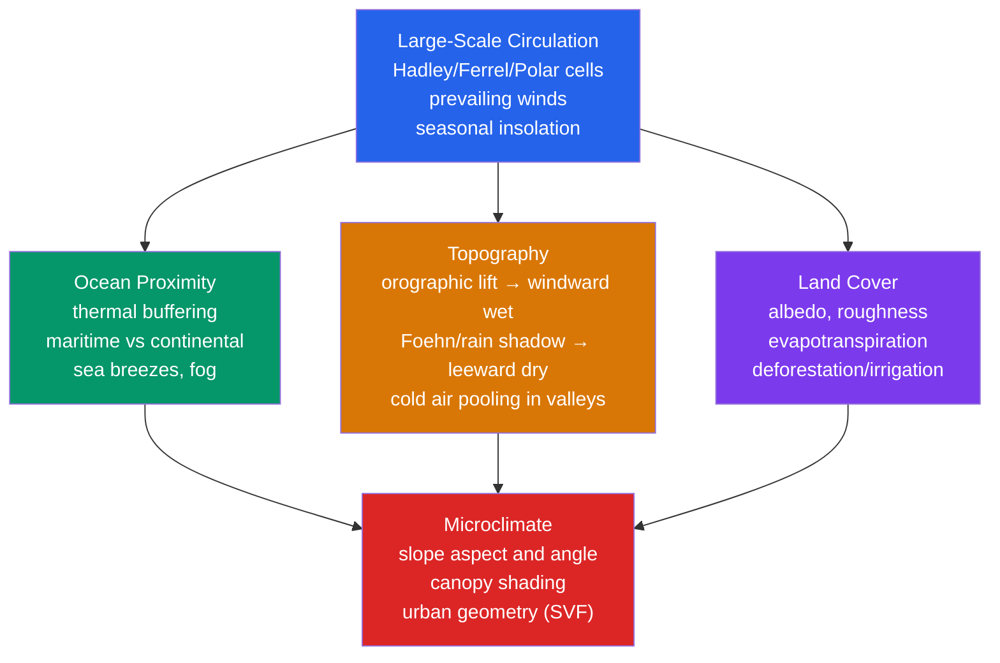

# 🏔️ Regional Climates and Microclimates

> [!abstract] TL;DR
> **Regional and local climates** are what you get when the **large-scale general circulation** — the temperature and precipitation baseline set by [[Global_Atmospheric_Circulation|Hadley/Ferrel/Polar cells]] and the prevailing winds — is **edited by the land surface**: topography, land cover, soil moisture, and proximity to water. Three levers dominate. **Orographic effects** (mountains forcing air up and back down) produce **windward–leeward precipitation contrasts of 10× or more** — a soaking rainforest on one flank and a **rain-shadow desert** a few tens of kilometres downwind. **Continentality vs oceanicity** — the huge heat capacity of the ocean — **moderates the seasonal temperature range**: maritime climates have mild winters and cool summers, continental interiors swing far more. And **microclimates** operate at scales of **metres to kilometres**, sculpted by **slope aspect** (a south-facing NH slope behaves like it sits ~5° of latitude further equatorward), **canopy structure** (a forest interior is cooler, damper, less windy than the clearing beside it), **water bodies** (lake-effect snow), and **urban geometry** (the [[Urban_Heat_Island_Effect|urban heat island]]). The physics is classic parcel thermodynamics: the **Foehn/Chinook** warming on the lee side arises because descending air heats at the **dry adiabatic lapse rate ($9.8$ K/km)** while ascending saturated air only cooled at the **moist rate ($\sim 5$–$7$ K/km)**, so it returns **warmer and drier** than it started. Getting regional and local climate right is the difference between a viable vineyard and a frost-killed one, a productive wind farm and a dead one, a well-watered valley and a drought-stricken one — which is why **agriculture, hydrology, wind-energy siting, and urban planning** all live or die by it.

---

## Intuition — analogy FIRST

Think of **regional climate as a conversation between the sky and the ground**. The large-scale atmosphere speaks first: it **writes a baseline climate** for your latitude — how hot the summers, how cold the winters, when and how much it rains. Then the **landscape talks back and edits that baseline locally**. Hand the same slab of maritime westerlies to a coastline backed by a mountain wall and it becomes one of the **wettest places on Earth**; carry that same air a short distance over the crest and, wrung dry, it descends into a **desert**. The atmosphere proposes; the terrain disposes.

Zoom in further and the **microclimate** is the fine print of that conversation, written at the scale of a hillside or a city block. On a **calm, clear night**, cold dense air drains downhill and **pools in the valley bottom** like water filling a bathtub — the "**frost hollow**," 5–10 °C colder than the slope just above it, where the first frost of autumn and the last of spring both strike. Turn a slope to face the equator and, in the Northern Hemisphere, that **south-facing slope catches the Sun at a steeper, more direct angle** and behaves as if it sat **~5° of latitude further south**: warmer, drier soils, an earlier spring, a longer growing season than the north-facing slope across the same little valley. Nothing about the regional climate changed; the ground simply **re-edited the sunlight and the airflow**.

---

## How It Works

The organizing idea is **scale nesting**. The **general circulation** ([[Global_Atmospheric_Circulation]]) fixes the *macroclimate* — the zonal-mean temperature and rainfall regime of a latitude band. **Ocean proximity, topography, and land cover** carve that into *regional* and *mesoscale* climates (tens to hundreds of km). And at the finest level, **slope, canopy, and urban geometry** produce *microclimates* (metres to a few km). Each layer inherits from the one above and modifies it.



**Continentality vs oceanicity — the ocean as a thermostat.** Water has a **volumetric heat capacity ~4× that of dry soil**, mixes heat through a deep surface layer, and spends much incoming energy on **evaporation** rather than warming. The result: the ocean's surface temperature barely swings between seasons, and coasts sit under air that has recently been over that ocean. **Maritime climates** therefore have **small annual temperature ranges** (mild winters, cool summers), **damped diurnal ranges**, high humidity, frequent fog and stratus, and precipitation spread through the year. **Continental interiors**, sitting over low-heat-capacity land that heats and cools fast, show **large annual ranges** (hot summers, bitter winters), bigger day–night swings, and often a summer precipitation maximum from convection. This is why **Valentia, Ireland** and a city deep in **central Asia** at the same latitude can differ by tens of degrees in their January means.

**Orographic precipitation — the windward soak.** When wind blows **perpendicular to a ridge**, the barrier forces the air to **rise (orographic lift)**. Rising air **expands and cools**; once it reaches the **lifting condensation level (LCL)** it saturates, clouds form, and cloud droplets grow to precipitation. Because the flux of moisture into the barrier is large and continuous, the **windward slope becomes a precipitation maximum**, with rainfall increasing up to some optimum elevation and then decreasing near the crest (the air has already been wrung out and holds less water at colder temperature). The **efficiency** of this process — what fraction of the condensed water actually falls out on the windward side rather than being carried over the crest — depends on **mountain height, wind speed, moisture flux, and atmospheric stability**.

**Foehn effect and the rain shadow — the leeward desert.** Having shed moisture on the way up, the air **descends the lee slope**. Descending unsaturated air **warms at the dry adiabatic lapse rate, $\Gamma_d = 9.8$ K/km**, but on the way up (once saturated) it had only cooled at the **saturated rate, $\Gamma_s \approx 5$–$7$ K/km**, because latent heat release partly offset the expansion cooling. The **asymmetry** ($\Gamma_d > \Gamma_s$) means the parcel returns to the lee base **warmer and far drier** than at the same elevation on the windward base — the **Foehn** (Alps) / **Chinook** (Rockies) / **Zonda** (Andes) / **Santa Ana**-like descent. Downwind of the crest lies the **rain shadow**: the great arid belts on the lee of the Cascades, Sierra Nevada, Southern Alps, and Andes. Precipitation ratios of **windward : leeward** commonly exceed **10 : 1**.

**Lake-effect snow — the counterintuitive one.** In autumn and early winter, **cold continental air sweeps over a comparatively warm, unfrozen lake**. The lake pumps **heat and moisture into the boundary layer from below**, generating buoyancy (surface-based CAPE) and organizing **narrow, intense convective snow bands** on the downwind shore. The classic **snowbelts** — the lee shores of the **Great Lakes** (Tug Hill, Buffalo), the mountains east of the **Great Salt Lake**, and the west coast of **Japan** facing the **Sea of Japan** — can bury the downwind land in metres of snow while the upwind shore stays clear.

**Sea and land breezes.** The same land–sea heat-capacity contrast that sets continentality also drives a **daily circulation** at the coast: by day the land warms faster, air rises over it, and a cool **sea breeze** flows inland; by night the land cools faster and a weaker **land breeze** reverses the flow seaward. These circulations set up **sea-breeze fronts** that trigger afternoon thunderstorms (e.g. peninsular Florida).

**Mountain–valley circulation and cold-air pooling.** Sloping terrain drives a **daily wind system**: by day, sun-heated slopes warm the adjacent air, which flows **upslope (anabatic)** and up-valley; by night, radiatively cooled slopes chill the air, which — being **denser** — drains **downslope (katabatic)** and down-valley. On a **clear, calm night** this cold drainage **pools in enclosed basins and valley bottoms**, forming a **temperature inversion** and a **frost hollow** several degrees colder than the slopes above (the "**thermal belt**" on the mid-slope is the frost-safe zone prized by orchardists and vintners).

**Microclimate levers — aspect, canopy, and city.** **Slope aspect** sets the **angle of incidence of sunlight**: an equator-facing slope intercepts more energy per unit ground area, so **NH south-facing slopes** are warmer, drier, and earlier-greening than north-facing ones — a difference exploited in **vineyard siting (terroir)**. A **forest canopy** intercepts sunlight and traps humidity, so the interior is **cooler by day, warmer by night, damper, and calmer** than the open — a buffered microclimate that many understory species depend on. And the **urban fabric** creates its own microclimate: deep street canyons with a **low sky view factor (SVF)** trap longwave radiation, store daytime heat in masonry, and shed it slowly at night — the [[Urban_Heat_Island_Effect|urban heat island]], a human-made mesoclimate. These local climates are summarized with **climate diagrams** (Walter–Lieth) and simulated with **regional climate models** (WRF, RegCM) that downscale coarse global fields onto real terrain.

---

## Key Concepts / Details

### Secondary Level

- **Why the coast has milder winters and cooler summers.** The **ocean stores and releases heat slowly**, so coastal air is warmed in winter and cooled in summer by the sea it just crossed. Inland, land heats and cools fast, so summers get hotter and winters colder — a **bigger annual temperature range**.
- **Why mountains are wetter on the windward side.** Wind hitting a mountain is **forced to rise**; rising air **cools**, its water vapour **condenses into clouds and rain/snow**. So the side the wind hits (the **windward** side) is wet.
- **What a "rain shadow" is.** Once the air crosses the crest it **sinks and warms**, and it already **lost its moisture** on the way up. So the **leeward** side stays dry — a "**shadow**" of little rain behind the mountain. Deserts often sit right behind mountain ranges.
- **How a frost hollow forms.** On a **clear, calm night** the ground cools and chills the air touching it. That **cold air is heavy**, so it **flows downhill and collects in the valley bottom**, which can be **5–10 °C colder** than the hillside above — the first place to frost.
- **Why south-facing slopes (in the NH) are warmer and drier.** They **face the Sun more directly**, catching more sunlight per patch of ground — so they warm up, dry out, and green up earlier, almost as if they were **further south**.
- **Lake-effect snowbelts.** Cold air blowing across a **warm, unfrozen lake** picks up heat and moisture and **dumps heavy snow on the far shore** — the reason places downwind of the Great Lakes get buried while the upwind side stays clear.
- **Monsoon-influenced regional climates.** In some regions the **seasonal reversal of winds** (the [[Tropical_Meteorology_and_Monsoons|monsoon]]) brings a **wet season and a dry season** rather than year-round rain, shaping farming calendars for billions of people.
- **Why forests are cooler inside than out.** The **canopy shades the ground and traps moisture**, so a forest interior is cooler and damper by day, and doesn't cool off as much at night, compared with the open field next to it.

### Undergraduate Level

**Continentality (Gorczyński) index.** A common measure of how "continental" a climate is combines the **annual temperature range** $A$ (warmest minus coldest monthly mean) with latitude $\varphi$:

$$K = \frac{1.7\,A}{\sin(\varphi + 10°)} - 14 \qquad (\%)$$

$K \to 0$ for a fully **oceanic** site and $K \to 100$ for an extreme **continental** interior. The $\sin(\varphi+10°)$ term removes the fact that annual ranges grow with latitude anyway, isolating the **land–sea signal**. **Oceanicity** is simply the complement, $O = 100 - K$.

**Orographic rainfall efficiency.** The windward rainfall rate scales with the **moisture flux forced upward**: the faster the cross-barrier wind $V$, the steeper the terrain slope $\partial h/\partial x$, and the more low-level moisture $q$, the greater the upslope condensation. But **not all condensate falls out** on the windward side — droplets/ice take time to grow and fall, and the cross-barrier wind can carry hydrometeors over the crest (the "**spill-over**"). Efficiency therefore rises with a **broad, high barrier and slow, moist flow**, and falls for a **narrow ridge in fast flow**.

**Foehn effect — the thermodynamics.** Air ascending the windward side first cools **dry-adiabatically** at $\Gamma_d = 9.8$ K/km until it reaches the **LCL**, then cools **saturated-adiabatically** at $\Gamma_s \approx 5$–$7$ K/km (latent-heat release offsets expansion cooling) up to the crest, precipitating along the way. Descending the lee side it is **unsaturated**, so it warms all the way down at the full $\Gamma_d = 9.8$ K/km. Because it **descended faster than it rose (in the saturated layer)**, the parcel arrives at the lee base **warmer** than the windward base by

$$\Delta T_{\text{Foehn}} \approx (\Gamma_d - \Gamma_s)\,\Delta z_{\text{sat}},$$

where $\Delta z_{\text{sat}}$ is the depth of the saturated (raining) ascent. It is also **much drier**: the dew point recovers on descent only at the slow **unsaturated dew-point lapse rate** ($\approx 1.8$ K/km), so the lee air has a large **temperature–dew-point spread** (low relative humidity). See the demo below and [[Adiabatic_Processes_and_Atmospheric_Stability]].

**Rain-shadow ratio.** Empirically the **windward : leeward** annual-precipitation ratio for a major range is set by how much moisture is removed on ascent; ratios of **5 : 1 to 20 : 1** are typical for the Cascades, Sierra Nevada, and Southern Alps.

**Lake-effect snow.** The instability is quantified by the **lake–air temperature difference**: a rule of thumb is that the difference between the **lake surface temperature** and the temperature at **850 hPa** must exceed **~13 °C** for vigorous convective bands, with a long **overwater fetch** to load the boundary layer with moisture. The result is **surface-based CAPE** and narrow, quasi-stationary **snow bands** — a mesoscale process closely allied to [[Mesoscale_Meteorology_and_Severe_Weather]].

**Slope aspect and insolation.** The solar flux on a tilted surface follows the **cosine of the angle between the Sun and the surface normal**. For a slope of angle $\beta$ facing the Sun's azimuth, a compact form for the flux relative to a horizontal surface is

$$I = I_0\,\cos(\theta_z - \beta),$$

where $\theta_z$ is the solar **zenith angle** and $I_0$ the beam irradiance. When the slope tilts **toward** the Sun ($\beta$ reduces the effective zenith angle), $\cos(\theta_z-\beta)$ increases, so an **equator-facing slope receives markedly more energy per unit ground area** — the physics behind the "**+5° of latitude**" rule of thumb for NH south-facing slopes.

**Cold-air pooling and valley inversions.** On clear calm nights, **radiative cooling** chills the surface; the dense air drains downslope (**katabatic flow**) and accumulates in the basin, building a **surface-based temperature inversion**. Wind or cloud **mixes it out** and the pooling vanishes — which is why frost hollows only bite on **still, clear nights** (see Pitfall 3). By day, sun-heated slopes drive **anabatic (upslope)** winds and the inversion breaks.

### Graduate Level

**Linear theory of orographic precipitation (Smith & Barstad, 2004).** In the linear model, terrain of height $h(x,y)$ forces a vertical velocity, and the **condensed-water source** is proportional to the low-level upslope moisture flux. The steady upslope condensation (source) rate can be written schematically as

$$S(x) \approx -\,V_w\,\frac{\partial q}{\partial x} \;\sim\; \rho\, q_{\text{ref}}\, \mathbf{V}\!\cdot\!\nabla h,$$

and the **precipitation field** is the source **advected and delayed** by two timescales — the **cloud-water conversion time $\tau_c$** and the **hydrometeor fallout time $\tau_f$** — implemented as a transfer function in Fourier space. The two delays smear precipitation **downwind** of the peak upslope forcing: with **long $\tau$ and fast flow**, the maximum shifts **over the crest and onto the lee** (spill-over); with **short $\tau$**, precipitation peaks **on the windward slope, upstream of the ridge**. Static **stability** enters through the **moist Brunt–Väisälä frequency $N_m$**: strong stability makes the flow go **around/over as mountain waves** with the forced ascent (and thus the precipitation maximum) displaced **upstream** of the ridge, while weak stability lets air rise **directly over the crest**, placing the maximum near the top. This is the theoretical handle on *why the rain maximum sits where it does*.

**Land–atmosphere coupling and the microclimate of the boundary layer.** Regional climate is not just forced from above — the **land surface state feeds back**. Available energy at the surface is partitioned between **sensible and latent heat (the Bowen ratio $\beta = H/\lambda E$)**, and that partition is controlled by **soil moisture** and vegetation. Wet soil → high $\lambda E$, low $H$ → shallow, cool, moist **boundary layer**; dry soil → high $H$ → deep, hot, dry [[Atmospheric_Boundary_Layer|boundary layer]]. Because boundary-layer growth and humidity set whether **convective triggering** occurs, soil-moisture anomalies can **self-reinforce drought** (dry soil → less evapotranspiration → less local rainfall) — the coupling behind "hot-spot" regions (Sahel, Great Plains, India) in the GLACE experiments. **Irrigation** does the reverse, cooling and moistening the surface (measurable **irrigation-induced cooling** of daytime temperatures over the Indo-Gangetic Plain and California's Central Valley).

**Deforestation and moisture recycling.** Over large forests, a substantial fraction of rainfall is **locally recycled** through evapotranspiration. **Amazon deforestation** reduces evapotranspiration and the **moisture flux** feeding downwind precipitation, tending toward **regional drying and a longer dry season** — a regional-climate feedback with tipping-point concern.

**Regional climate models and downscaling.** GCMs run at **~100 km** — far too coarse to resolve the **5–20 km** ridges that control orographic precipitation or the valley networks that pool cold air. Two remedies: **statistical downscaling** (learn a transfer function from coarse predictors to local observations) and **dynamical downscaling**, in which a **regional climate model (RCM)** such as **WRF** or **RegCM** is **nested** inside a global model or reanalysis (GFS, ERA5), taking **lateral boundary conditions** from the coarse field and solving the full equations on high-resolution terrain (down to **3–10 km**, or **convection-permitting 3–4 km** grids that drop the cumulus parameterization). RCMs reproduce **windward–leeward precipitation gradients, snowbelts, and valley inversions** that GCMs cannot. For climate-change signals, **pseudo-global-warming (PGW)** experiments add the GCM-projected mean change to the boundary conditions of a high-resolution historical simulation, isolating the **regional response** (e.g. changes in orographic snowfall or extreme rainfall) with terrain fully resolved.

**Regional trends under warming.** The **poleward expansion of the Hadley cell** shifts subtropical subsidence and jets poleward, **drying the poleward margins** of arid zones (Mediterranean, southwest US, southern Australia). Warming also intensifies the **hydrological contrast** across ranges (more moisture flux → heavier orographic extremes) while **raising snow lines** (more rain, less snow, earlier melt) — a first-order regional-climate concern for water resources dependent on mountain snowpack.

---

## Python demo — quantifying the Foehn effect over a 2000 m ridge

The script models a moist parcel over a **2000 m ridge**. From the windward base ($T = 15\,°\mathrm{C}$, dew point $= 10\,°\mathrm{C}$) it rises **dry-adiabatically** ($\Gamma_d = 9.8$ K/km) until temperature and dew point converge at the **LCL**, then rises **saturated-adiabatically** ($\Gamma_s = 6$ K/km) to the summit (precipitating), and finally **descends dry** ($\Gamma_d$) down the lee. It prints **(a)** the LCL height and temperature, **(b)** the summit temperature, **(c)** the leeward base temperature and dew point, and the resulting **Foehn warming and drying**, then plots the parcel's path. Runnable with `numpy` and `matplotlib`.

```python
# Foehn (foehn/chinook) effect: quantitative parcel model over a 2000 m ridge.
# Moist air rises, condenses at the LCL, sheds moisture climbing at the saturated
# lapse rate, then descends the lee side DRY -> arrives WARMER and DRIER.
import numpy as np
import matplotlib.pyplot as plt

# ---- lapse rates (K per km) ----
DALR = 9.8    # dry adiabatic lapse rate
SALR = 6.0    # saturated (moist) adiabatic lapse rate (assumed constant here)
DPLR = 1.8    # dew-point lapse rate for UNsaturated (compressing/expanding) air

# ---- windward base state ----
H_summit = 2000.0     # ridge height above base (m)
T0  = 15.0            # base temperature  (deg C)
Td0 = 10.0            # base dew point    (deg C)

# ---- (a) lifting condensation level: rising unsaturated, T and Td converge ----
#     T falls at DALR, Td falls at DPLR -> the 5 K spread closes at (DALR - DPLR)
h_LCL = (T0 - Td0) / (DALR - DPLR) * 1000.0     # metres
T_LCL = T0 - DALR * (h_LCL / 1000.0)            # temperature at the LCL
print(f"(a) LCL height              = {h_LCL:6.1f} m")
print(f"    T at LCL (= Td at LCL)  = {T_LCL:6.2f} C")

# ---- (b) summit: saturated ascent from LCL to the crest at SALR ----
T_summit  = T_LCL - SALR * ((H_summit - h_LCL) / 1000.0)
Td_summit = T_summit                            # saturated: dew point = temperature
print(f"(b) T at summit ({H_summit:.0f} m)   = {T_summit:6.2f} C")

# ---- (c) leeward descent: dry all the way down at DALR ----
T_lee  = T_summit  + DALR * (H_summit / 1000.0)
Td_lee = Td_summit + DPLR * (H_summit / 1000.0)  # dew point recovers only slowly
print(f"(c) leeward base T          = {T_lee:6.2f} C")
print(f"    leeward base Td         = {Td_lee:6.2f} C")

# ---- Foehn warming and drying ----
dT  = T_lee - T0
dTd = Td0 - Td_lee
print(f"\nFoehn warming (lee - windward T)   = +{dT:5.2f} C")
print(f"Foehn drying  (windward - lee Td)  = -{dTd:5.2f} C   (much lower humidity)")

# ---- schematic profile: up windward (dry then moist), down leeward (dry) ----
z_up_dry = np.linspace(0, h_LCL, 30);            T_up_dry = T0 - DALR * z_up_dry/1000.0
z_up_wet = np.linspace(h_LCL, H_summit, 30);     T_up_wet = T_LCL - SALR*(z_up_wet-h_LCL)/1000.0
z_down   = np.linspace(H_summit, 0, 40);         T_down   = T_summit + DALR*(H_summit-z_down)/1000.0

fig, ax = plt.subplots(figsize=(9, 5))
ax.plot(T_up_dry, z_up_dry, color="#2563eb", lw=2.4, label="windward, dry (DALR 9.8)")
ax.plot(T_up_wet, z_up_wet, color="#059669", lw=2.4, label="windward, saturated (SALR 6.0)")
ax.plot(T_down,   z_down,   color="#dc2626", lw=2.4, ls="--", label="leeward, dry (DALR 9.8)")
ax.axhline(h_LCL, color="gray", ls=":", lw=1)
ax.text(T_LCL+0.3, h_LCL+40, f"LCL  {h_LCL:.0f} m  (cloud base)", color="gray", fontsize=9)
ax.plot([T0],    [0], "o", color="#2563eb")
ax.plot([T_lee], [0], "o", color="#dc2626")
ax.annotate(f"windward base\n{T0:.1f} C", (T0, 0), xytext=(T0-6.5, 260),
            arrowprops=dict(arrowstyle="->"), fontsize=9)
ax.annotate(f"leeward base\n{T_lee:.1f} C  (+{dT:.1f} C)", (T_lee, 0),
            xytext=(T_lee+0.3, 380), arrowprops=dict(arrowstyle="->"), fontsize=9)
ax.set_xlabel("temperature  (deg C)")
ax.set_ylabel("height above base  (m)")
ax.set_title("Foehn effect over a 2000 m ridge:\nwarm, dry descent on the lee side")
ax.grid(alpha=0.3); ax.legend(loc="upper right", fontsize=9)
plt.tight_layout()
plt.savefig("foehn_effect.png", dpi=120)
print("\nSaved figure to foehn_effect.png")

# Expected console output:
#   (a) LCL height = 625.0 m ; T at LCL = 8.88 C
#   (b) T at summit (2000 m) = 0.62 C
#   (c) leeward base T = 20.22 C ; leeward base Td = 4.22 C
#   Foehn warming = +5.22 C ; Foehn drying = -5.78 C (dew point)
```

The parcel leaves the windward base at $15\,°\mathrm{C}$, condenses at the **LCL near $625$ m** ($\approx 8.9\,°\mathrm{C}$), reaches the summit at just **$0.6\,°\mathrm{C}$** having rained out its moisture, and then warms all the way down the lee at the full dry rate to arrive at the **lee base near $20.2\,°\mathrm{C}$** — a **Foehn warming of $\approx +5.2\,°\mathrm{C}$** — while its dew point recovers only to $\approx 4.2\,°\mathrm{C}$, a **drop of $\approx 5.8\,°\mathrm{C}$** (much lower humidity). The warming is exactly $(\Gamma_d-\Gamma_s)$ times the depth of the saturated ascent: $(9.8-6.0)\times1.375\ \text{km} \approx 5.2\,°\mathrm{C}$.

---

## Real-World Notes

- **Hoh Rainforest vs Sequim, Washington — a rain shadow in 100 km.** The **Olympic Mountains** force moisture-laden Pacific air to rise, making the **Hoh Rainforest** the wettest place in the contiguous US (**~3500 mm/yr**). Barely **100 km to the northeast**, in the **rain shadow at Sequim, WA**, annual precipitation collapses to **~430 mm/yr** — an ~8:1 contrast created by a single modest range.
- **The Atacama — double-locked aridity.** Northern Chile's **Atacama Desert** is one of the driest places on Earth for **two reasons**: the **Andes block Atlantic/Amazonian moisture** from the east (rain shadow), and to the west the cold **Humboldt Current upwelling** chills the lower atmosphere, suppressing evaporation and capping it with a strong subsidence inversion — so neither ocean nor continent supplies rain.
- **Chinook winds on the Rockies' east slope.** The **Chinook** ("snow-eater") is the Foehn of the eastern Rockies: descending air can **raise temperatures 20 °C+ in hours**, rapidly sublimating and melting snowpack. Pincher Creek, Alberta, once famously jumped ~20 °C in minutes as a Chinook arch swept in.
- **Tug Hill Plateau — America's lake-effect capital.** Cold air crossing warm **Lake Ontario** dumps snow on the **Tug Hill Plateau**, which receives **600+ cm (20+ ft) of snow annually** — the heaviest snowfall in the eastern US — while communities just off the snowband stay comparatively clear.
- **Terroir as applied microclimate science.** In viticulture, the **same grape variety planted ~50 m apart** on differing **slope aspects, angles, and cold-air-drainage positions** can ripen to **noticeably different sugar/acid balances**. Growers deliberately place vines on the frost-safe **thermal belt** mid-slope and on sun-favoured aspects — microclimate engineering with a price tag.

---

## Common Pitfalls

1. **Assuming any mountain enhances rain.** Orographic lift occurs **only when the wind blows roughly perpendicular to the ridge**. A range **parallel to the prevailing flow** provides little forced ascent and little orographic enhancement — the geometry of wind-vs-ridge, not the mere presence of a mountain, is what matters.
2. **Thinking the Foehn needs windward rain.** It does not. Even a **purely dry adiabatic descent** produces warming, because the leeward temperature gradient ($\Gamma_d$) exceeds whatever (possibly moist) gradient the air followed on ascent. Precipitation **amplifies** the effect (it deepens the saturated layer), but the **warming and drying happen regardless** — many Foehn events are essentially rain-free "dry Foehn."
3. **Expecting frost hollows on any cold night.** Cold-air pooling requires **clear skies and calm winds** so that radiative cooling and gravity drainage can build a stable pool. On a **windy or cloudy night**, mechanical mixing and reduced radiative loss **destroy the inversion**, and the frost-hollow effect **disappears** — the valley bottom can even be *warmer* than usual.
4. **Conflating "microclimate" with "urban heat island."** They are related but **distinct**. A **forest or valley microclimate** arises from **natural** processes (shading, drainage, evapotranspiration). The **UHI** is an **anthropogenic** mesoclimate driven by **surface modification** (impervious, low-albedo, high-heat-capacity materials, canyon geometry) and **waste heat**. Treating them as the same obscures very different physics and mitigation options.
5. **Getting lake-effect snow backwards.** It is **counterintuitive**: heavy lake-effect snow requires the **lake to be significantly WARMER than the air above it** (a large lake–850 hPa temperature difference). That happens when **cold continental air sweeps over an unfrozen lake in autumn/early winter**. Once the lake **freezes over**, the heat and moisture source is cut off and the snow machine **shuts down** — which is why lake-effect peaks early in the cold season, not mid-winter.

---

## Related Concepts

- [[_MOC_Climatology_and_Climate_Change]] — section map for the climatology and climate-change chapter of this vault (uplink).
- [[Koppen_Climate_Classification]] — the empirical scheme that names the desert / temperate / continental / highland zones that regional and local factors carve out.
- [[Urban_Heat_Island_Effect]] — the human-modified microclimate: canyon geometry, sky view factor, and anthropogenic heat.
- [[Droughts_and_Floods]] — regional hydro-extremes shaped by rain shadows, moisture recycling, and soil-moisture feedbacks.
- [[Mesoscale_Meteorology_and_Severe_Weather]] — the mesoscale processes (sea-breeze fronts, lake-effect bands, valley winds) that regional/local climate statistics average over.
- [[Atmospheric_Boundary_Layer]] — the surface layer whose depth, humidity, and stability the land surface controls, mediating land–atmosphere coupling.
- [[Global_Atmospheric_Circulation]] — the large-scale circulation that writes the macroclimate baseline the landscape then edits.
- [[Tropical_Meteorology_and_Monsoons]] — the seasonal wind reversal that gives many regional climates their wet/dry rhythm.
- [[Adiabatic_Processes_and_Atmospheric_Stability]] — the dry/moist lapse-rate thermodynamics behind orographic lift, the Foehn effect, and cold-air pooling.
- [[_MOC_Earth_Science_Master]] — cross-vault entry point to Earth-system science (surface processes below).
- [[Weathering_and_Soils]] — how aspect- and moisture-driven microclimates control weathering rates and soil development.
- [[Rivers_and_Fluvial_Landscapes]] — orographic precipitation as the source of the runoff that carves fluvial systems.
- [[Glaciers_and_Glacial_Landscapes]] — mountain snowfall (orographic) and aspect control on where glaciers form and persist.
- [[_MOC_Physics_Master]] — cross-vault entry point to the underlying thermodynamics and radiation physics.

---

## Review Questions

- **Secondary:** Why do coastal cities have **smaller annual temperature ranges** than inland cities at the same latitude? Explain the "**rain shadow**" effect of a mountain range using the terms **windward**, **leeward**, **orographic lift**, and **Foehn**. What is a **frost hollow** and how does it form?
- **Undergraduate:** **Derive the Foehn temperature enhancement.** Moist air at $10\,°\mathrm{C}$ ascends a $3000$ m mountain at the SALR of $6$ K/km until it reaches the LCL at $1000$ m, then continues at $5$ K/km to the summit. It then descends the lee side at the DALR of $9.8$ K/km. What is the temperature on the **leeward side at the base**, and what is the **Foehn warming** compared with the windward side? (Track each segment; compare lee-base and windward-base temperatures.)
- **Graduate:** Explain the theory of **orographic precipitation efficiency (Smith & Barstad, 2004)**: how the **cloud-conversion ($\tau_c$) and fallout ($\tau_f$) timescales** and the **cross-barrier wind** determine whether the precipitation maximum sits on the windward slope, at the crest, or spills onto the lee. How does **static stability ($N^2$)** shift the forced ascent (and thus the precipitation maximum) **upstream** of the ridge? Finally, how does **dynamical downscaling** (a WRF RCM nested in a ~100 km GCM) bridge the **scale gap** between GCM resolution and the **5–20 km** terrain features that actually drive orographic precipitation?

---

## Sources

- Barry, R. G. — *Mountain Weather and Climate*, 3rd ed. (Cambridge University Press, 2008). Orographic precipitation, Foehn/rain shadow, mountain–valley winds, and altitudinal climate.
- Oke, T. R. — *Boundary Layer Climates*, 2nd ed. (Routledge, 1987). Surface energy balance, land–sea and slope microclimates, and urban climate.
- Geiger, R., Aron, R. H. & Todhunter, P. — *The Climate Near the Ground*, 6th ed. (Rowman & Littlefield, 2003). Microclimatology of slopes, canopies, soils, and cold-air drainage.

---

#Meteorology #Climatology #RegionalClimate #Microclimate #OrographicPrecipitation #FoehnEffect
