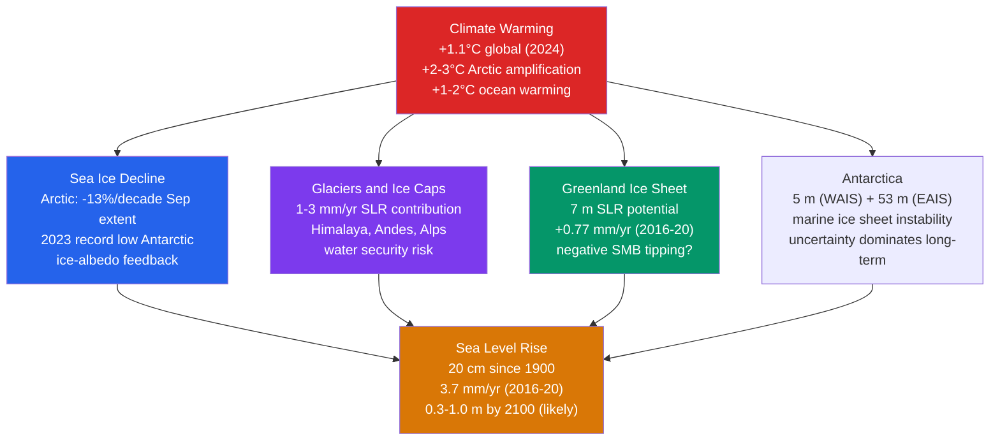

# 🧊 Sea Level Rise and the Cryosphere

> [!abstract] TL;DR
> The **cryosphere** — ice sheets, glaciers, sea ice, permafrost, and snow cover — is the most visible fingerprint of a warming planet. Global mean sea level has risen **~20 cm since 1900** and is now climbing at **~3.7 mm/yr and accelerating**. That rise has three components: **thermal expansion** (steric, ~40 % of the recent rate), **glaciers and small ice caps** (~25 %), and the **ice sheets** — **Greenland (~15 %)** and **Antarctica (~20 %)**. Greenland and West Antarctica alone store enough ice to raise the ocean by **7 m** and **5 m** respectively. **Marine ice sheet instability (MISI)** could make West Antarctic retreat effectively **irreversible above ~1.5–2 °C**. Arctic September sea-ice extent is falling **~13 %/decade**, and **permafrost thaw** releasing CO₂ and CH₄ is a candidate **tipping element**.

## Intuition — analogy FIRST

Picture the cryosphere as Earth's **thermostat buffer** — the giant ice-cube tray that has, for millennia, kept the planet's drink cold. It buffers global warming in two ways at once. First, **ice melts**: every joule spent turning ice into water is a joule that did *not* raise the temperature — the ice stores past warmth as meltwater. Second, **ice reflects**: bright white ice bounces sunlight back to space, and as it disappears it exposes dark ocean and land that soak up heat instead.

Now think about the ice cube in your glass. While it floats there, the drink stays cold and the level barely changes as it melts — the cube already displaces its own weight in liquid. But once that cube is gone, the drink **warms faster**, because there is nothing left to absorb the heat and nothing left to reflect it. That is exactly the Arctic sea-ice trap: melting the floating ice barely nudges sea level, yet it removes the cooling buffer and hands the extra sunlight to a darker ocean.

The part that *does* raise the level is different. It is the ice sitting **on land** — glaciers on mountainsides, the two-mile-thick sheets over Greenland and Antarctica — plus the simple fact that **water expands when it warms**. Ice sheets take thousands of years to melt completely, but their contribution to the ocean begins the *instant* their surface mass balance goes negative. And there is a slower rhythm underneath it all: the **thermohaline circulation**, the ocean's heartbeat, which Greenland's freshwater melt can weaken by diluting the salty, sinking North Atlantic.

---

## How It Works



**The three ingredients of the rising ocean.** Global mean sea level (GMSL) is a *budget*, and by IPCC AR6 the modern-era terms nearly close. **Thermal expansion (steric rise)** — seawater physically occupying more volume as it warms — supplies roughly **40 %** of the recent rate. **Glaciers and small ice caps** outside the two great sheets add another **~25 %**, the fastest-responding land-ice reservoir. The **ice sheets** contribute the rest and are the wildcard: **Greenland ~15 %** and **Antarctica ~20 %**, with Antarctica carrying nearly all of the *long-term* uncertainty. A small **land-water storage** term (dam impoundment vs groundwater depletion) rounds out the ledger.

**How we measure it: tide gauges then satellites.** For over a century, **tide gauges** bolted to harbours have logged local sea level — but they measure *relative* sea level, contaminated by land moving up or down. Since **1993**, satellite **radar altimetry** — TOPEX/Poseidon, the **Jason** series, and now **Sentinel-6 Michael Freilich** — has bounced pulses off the sea surface to map *absolute* GMSL globally to millimetre precision. It is the altimetry record that reveals **acceleration**: the rate has climbed from ~2.1 mm/yr in the early 1990s to **~3.7 mm/yr (2016–2020)**.

**Greenland: a surface-melt problem.** Greenland loses mass two ways: **surface mass balance (SMB = snowfall − melt/runoff)** going negative as summers warm, plus **calving and submarine melting** of outlet glaciers. Runoff roughly **doubled over 2000–2012**, and once the melt zone creeps up the ice sheet, the lower surface sits in warmer air — a self-reinforcing elevation feedback.

**Antarctica: a dynamics problem.** The **East Antarctic Ice Sheet (EAIS, ~53 m of potential rise)** rests mostly on bedrock *above* sea level and is comparatively stable. The **West Antarctic Ice Sheet (WAIS, ~5 m)** is **marine-based** — grounded on bedrock hundreds of metres *below* sea level, sloping *inland*. That geometry is the seed of **marine ice sheet instability (MISI)** and its more speculative cousin **marine ice cliff instability (MICI)**.

**Weighing ice from orbit: GRACE.** The twin **GRACE / GRACE-FO** satellites chase each other in orbit; when the lead satellite passes over a heavy mass (an ice sheet), it speeds up and the inter-satellite distance changes by microns. Those tiny distance changes map **month-to-month mass redistribution**, letting us weigh Greenland and Antarctica directly — Greenland has been shedding **~280 Gt/yr**.

**The sea ice and permafrost multipliers.** Melting **Arctic sea ice** adds essentially nothing to sea level (it already floats), but it triggers the **ice-albedo feedback**: ocean albedo ≈ **0.07** vs sea-ice albedo ≈ **0.6**, so open water absorbs vastly more sunlight and amplifies warming. **Permafrost** locks away ~1.5 trillion tonnes of organic carbon; thawing it releases CO₂ and CH₄, a slow-burning positive feedback and candidate tipping element.

---

## Key Concepts / Details

### Secondary Level

- **What the cryosphere is.** All the frozen water on Earth — **ice sheets** (Greenland, Antarctica), **glaciers and ice caps**, **sea ice**, **permafrost** (frozen ground), and **snow cover**. It is the planet's most sensitive climate indicator because ice responds visibly and quickly to temperature.
- **The crucial distinction — sea ice vs land ice.** Melting **sea ice does NOT raise sea level** because it is already floating and displacing its own weight. Melting **glaciers and ice sheets DOES**, because that water was stored on land and is *added* to the ocean.
- **How much and how fast.** Sea level is up **~20 cm since 1900** and rising at **~3.7 mm/yr** — and the rate is **accelerating**, not steady.
- **The giants.** Greenland holds **~7 m** of sea-level equivalent; West Antarctica **~5 m**; all of Antarctica **~58 m**. We will not melt them soon, but even fractional losses matter enormously for coasts.
- **Why the Arctic ice is vanishing.** The Arctic warms **2–3× faster** than the global average (Arctic amplification), and lost sea ice exposes dark ocean that absorbs more heat — a feedback loop.
- **Permafrost and methane.** Frozen Arctic soils store immense carbon; as they thaw they burp out CO₂ and methane (**CH₄**), adding to warming.
- **The human stakes.** Rising seas mean **coastal flooding**, saltwater intrusion, and erosion. **Small Island Developing States (SIDS)** like the Maldives, Tuvalu, and Kiribati face an **existential** threat — some may become uninhabitable this century.

### Undergraduate Level

- **Steric (thermal) sea level.** Warmer water expands: $\Delta SL_{thermo} = \alpha \, \Delta T \, H$, where $\alpha \approx 0.15 \times 10^{-3}\ \mathrm{K^{-1}}$ is the volumetric thermal-expansion coefficient of seawater and $H$ is the depth of the warmed layer. Expanding the top **700 m** by **0.5 °C** gives $0.15\times10^{-3} \times 0.5 \times 700 \approx \mathbf{0.05\ m}$ — the right order of magnitude for the observed steric term.
- **Eustatic vs isostatic.** *Eustatic* change is a real change in ocean **volume** (adding meltwater, thermal expansion) — global. *Isostatic* change is the **land** moving up or down (tectonics, sediment loading, glacial rebound) — local. **Relative** sea level, what a coast actually feels, is eustatic + isostatic combined.
- **GRACE in one line.** Inter-satellite distance change → gravity anomaly → **mass** redistribution → ice-sheet and glacier mass loss, measured in **gigatonnes (Gt)**. Handy conversion: **~360 Gt of ice ≈ 1 mm of GMSL** (spread over the ~361 million km² ocean).
- **Ice-sheet mass balance.** $SMB = P - R - E$ (precipitation minus runoff minus evaporation/sublimation) sets the *surface* budget; total mass balance also subtracts **dynamic discharge** (calving + submarine melt). Greenland **runoff doubled over 2000–2012**.
- **Arctic minimum trend.** September sea-ice **extent** (the annual minimum) is falling at **−13 %/decade** relative to the 1981–2010 mean — the headline metric of Arctic ice loss.
- **The ice-albedo feedback, quantified.** Replacing sea ice ($\alpha \approx 0.6$) with open ocean ($\alpha \approx 0.07$) lets ~**200 W/m²** more of peak summer insolation be absorbed per square metre — a powerful regional amplifier.
- **Permafrost carbon.** ~**1.5 trillion tonnes** of organic carbon are frozen in northern soils; roughly **half** could thaw under high warming, potentially adding **~0.5 °C** by 2100 — a feedback still imperfectly captured in models.
- **Sea-level commitment.** Even if warming halts at **1.5 °C**, the ocean and ice sheets keep responding: **~1.5 m** of committed rise is expected over the following **centuries**. Sea level lags temperature by a long margin.

### Graduate Level

- **Marine Ice Sheet Instability (MISI).** For a grounded marine ice sheet, the ice flux across the **grounding line** scales steeply with local ice thickness, approximately $Q_g \propto h^{n}$ with $n \approx 5$ (Schoof 2007). Where the bed slopes **inland** (deepens toward the interior — a "retrograde" bed), any retreat moves the grounding line into **thicker** ice, which *increases* flux, which drives *further* retreat: a runaway **positive feedback** with no stable intermediate state. **Thwaites** and **Pine Island** glaciers in West Antarctica sit on exactly such retrograde beds and appear to be in the unstable regime; the temperature threshold for committed WAIS collapse is estimated near **~1.5 °C**.
- **Marine Ice Cliff Instability (MICI).** A more speculative amplifier: once buttressing ice shelves are removed, exposed **ice cliffs taller than ~90–100 m** are mechanically unstable and can **calve catastrophically**, exposing an even taller cliff behind — a self-sustaining collapse (DeConto & Pollard 2016). It is **controversial**: the physics is poorly constrained, few observational analogues exist, and later work suggests slower collapse. Hence AR6 treats MICI-driven high-end rise as a **"low-likelihood, high-impact"** branch, not a central estimate.
- **Fingerprinting — sea level is not a bathtub.** Melting ice exerts **gravitational and rotational** effects. A large ice mass gravitationally *pulls* the ocean toward it; when it melts, that pull relaxes, so sea level **falls near the source** (within ~2,000 km of Greenland) and **rises more than the global mean far away**. Each ice source has a distinct spatial "fingerprint," and Earth's rotation axis and crustal deformation add further structure.
- **Glacial Isostatic Adjustment (GIA).** The crust is still rebounding from the last deglaciation. Land once depressed under ice (Scandinavia, Hudson Bay) is **rising**; the peripheral **forebulge** (e.g., the US East Coast) is **subsiding** — adding to *relative* sea-level rise there. GIA must be removed from tide-gauge and altimetry records to isolate the climate signal.
- **AR6 projections and the deep tail.** For 2100, likely GMSL rise is about **0.3–0.6 m (SSP1-2.6)** to **0.6–1.0 m (SSP5-8.5)**. But because ice-sheet dynamics are poorly bounded, AR6 flags **low-likelihood, high-impact** outcomes of **~1.5–2 m by 2100** and **up to ~5 m by 2150** if MICI-type processes engage. The Antarctic term is *so* uncertain that its SSP1-2.6 contribution spans roughly **−0.05 to +0.27 m**.
- **AMOC coupling.** Greenland meltwater **freshens** the subpolar North Atlantic, reducing the density of surface water that would otherwise sink — weakening the **Atlantic Meridional Overturning Circulation (AMOC)**, itself a candidate tipping element. A weaker AMOC also produces regional **dynamic** sea-level rise piling water against the US East Coast.

---

## Python Demo — Projected Sea-Level Rise by Component and Scenario

```python
# Build cumulative sea-level-rise (SLR) time series, 2020-2100, from four
# components, under two IPCC AR6 scenarios (SSP1-2.6 vs SSP5-8.5), and
# draw stacked-area charts so each component's share is visible.
#
# Each component ramps linearly from 0 m (2020) to its assessed 2100 total.
# Numbers are approximate AR6 median contributions (metres by 2100).

import numpy as np
import matplotlib.pyplot as plt

years = np.arange(2020, 2101)
frac  = (years - 2020) / (2100 - 2020)   # 0 at 2020 -> 1 at 2100

# 2100 totals (metres) per component, per scenario
components = ["Thermal expansion", "Glaciers", "Greenland", "Antarctica"]
colors     = ["#d97706", "#7c3aed", "#059669", "#2563eb"]

totals = {
    "SSP1-2.6": [0.08, 0.10, 0.08, 0.07],   # sum ~0.33 m
    "SSP5-8.5": [0.20, 0.16, 0.25, 0.18],   # sum ~0.79 m
}

fig, axes = plt.subplots(1, 2, figsize=(13, 5.5), sharey=True)

for ax, (scenario, tot) in zip(axes, totals.items()):
    # Each component's time series = linear ramp to its 2100 total
    series = [t * frac for t in tot]
    ax.stackplot(years, *series, labels=components, colors=colors, alpha=0.9)

    grand_total = sum(tot)
    ax.text(2022, grand_total * 0.92, f"2100 total: {grand_total*100:.0f} cm",
            fontsize=11, weight="bold")
    ax.set_title(f"{scenario}", fontsize=12)
    ax.set_xlabel("Year")
    ax.grid(alpha=0.3)
    ax.set_xlim(2020, 2100)

axes[0].set_ylabel("Cumulative sea-level rise (m)")
axes[0].legend(loc="upper left", fontsize=9)
fig.suptitle("Projected Global Mean Sea-Level Rise by Component (2020-2100)",
             fontsize=13, weight="bold")

# Print the closing budget for each scenario
for scenario, tot in totals.items():
    print(f"{scenario}: " +
          ", ".join(f"{c}={v*100:.0f}cm" for c, v in zip(components, tot)) +
          f"  ->  TOTAL {sum(tot)*100:.0f} cm by 2100")

plt.tight_layout()
plt.show()
```

The two panels make the scenario dependence vivid: under **SSP1-2.6** the components stay roughly balanced and the stack tops out near **33 cm**, while under **SSP5-8.5** the **Greenland** and **Antarctica** bands swell disproportionately and the total more than doubles to **~79 cm**. The ice-sheet terms are what separate a manageable future from a dangerous one — and, crucially, they are also the terms with the fattest uncertainty tails, which a median-value plot like this deliberately hides.

---

## Real-World Notes

- **Larsen B, gone in 35 days.** In early 2002 the **Larsen B ice shelf** on the Antarctic Peninsula — **~3,250 km²**, stable for roughly **10,000 years** — shattered into a slurry of bergs in just over a month. It was the first real-time view of catastrophic shelf disintegration, and the tributary glaciers behind it promptly **sped up 2–8×** once their buttress was gone.
- **Weighing Greenland from orbit.** GRACE and GRACE-FO clocked Greenland shedding **~280 Gt/yr (2016–2020)** — enough to spread a **~1 mm layer of water over the entire world ocean every year**, from a single ice sheet.
- **Miami's "sunny-day" floods.** **Miami Beach** is spending on the order of **$500 M** on raised roads, one-way valves, and dozens of pumps to fight **high-tide flooding that arrives with no storm at all** — seawater welling up through the porous limestone during king tides. It is one of the first US cities to budget for *managed adaptation* to routine inundation.
- **The Maldives buys a lifeboat.** With an average elevation of **~1.2 m**, the **Maldives** has openly discussed relocation and **purchased land in India** as a contingency — a nation contemplating the loss of its entire territory.
- **New York rises faster than average.** Sea level around **New York City** is climbing **~4–5 mm/yr**, above the global rate, partly from **GIA**: the ancient ice sheet over Canada bulged the surrounding crust upward, and as that forebulge slowly **subsides**, the mid-Atlantic coast sinks — stacking land subsidence on top of the climate signal.

---

## Common Pitfalls

1. **Melting SEA ICE does NOT raise sea level.** Sea ice already floats in the ocean, displacing its own weight (Archimedes). Only melting **land-based ice** — glaciers and ice sheets — *adds* water to the ocean and lifts sea level. The two are constantly conflated in popular coverage.
2. **Sea-level rise is NOT uniform.** Because ice masses gravitationally attract nearby water, Greenland melt actually **lowers** sea level *near* Greenland and **raises it more than average far away** (e.g., across the North Atlantic and US East Coast). The ocean is not a bathtub that fills evenly.
3. **"Rise stops when emissions stop" is false.** There are **centuries of committed sea-level rise** already in the pipeline. Ice sheets and the deep ocean respond on timescales far longer than atmospheric CO₂ stabilization — even at 1.5 °C, seas keep climbing for centuries.
4. **Antarctica is the great uncertainty.** Its **dynamic** processes (MISI, MICI) are poorly constrained, so its projection range is enormous — AR6 gives roughly **−0.05 to +0.27 m** for the Antarctic term under SSP1-2.6 by 2100. A *negative* central possibility (more snowfall) coexists with catastrophic tails.
5. **Sea-ice loss and sea-level rise are different problems.** Losing Arctic sea ice does **not** directly raise sea level, but it **amplifies warming** via albedo: melt one square metre of ice and the dark ocean beneath absorbs **~200 W/m²** more sunlight — which then accelerates *land*-ice loss elsewhere.

---

## Related Concepts

- [[_MOC_Climatology_and_Climate_Change]] — section map for the climatology & climate-change unit; start here to orient
- [[Anthropogenic_Climate_Change]] — the warming that drives every term in the sea-level budget; sea-level rise is one of its headline observed impacts
- [[Droughts_and_Floods]] — the coastal-flooding and freshwater-security dimension of a changing cryosphere and rising seas
- [[Climate_Models_and_Projections]] — the CMIP6/ESM machinery and SSP scenarios behind the 2100 projections shown here
- [[Paleoclimatology_and_Ice_Cores]] — deep-time constraints: past interglacials with higher seas, and the ice cores that record them
- [[Climate_Sensitivity_and_Feedbacks]] — the ice-albedo and permafrost-carbon feedbacks quantified here are core to the feedback framework
- [[_MOC_Earth_Science_Master]] — cross-vault Earth-science entry point
- [[Glaciers_and_Glacial_Landscapes]] — the physics and landforms of glacier flow, calving, and mass balance underlying the land-ice term
- [[Mass_Extinctions_and_Paleoclimate]] — deep-time analogues (PETM, hothouse states) for ice-free worlds and rapid sea-level change
- [[Coastal_Processes_and_Landforms]] — how rising seas reshape shorelines through erosion, inundation, and saltwater intrusion
- [[_MOC_Physics_Master]] — cross-vault physics entry point
- [[Laws_of_Thermodynamics]] — the thermal expansion of seawater (steric rise) and the latent heat that buffers warming are thermodynamics in action
- [[_MOC_Astronomy_Master]] — cross-vault astronomy entry point; orbital (Milankovitch) forcing sets the deep-time ice-age rhythm

---

## Review Questions

**Secondary**
- Why does melting **sea ice** NOT raise sea level while melting **glaciers** does? What are the **three main contributions** to observed sea-level rise?
- What is the **current rate** of sea-level rise, and how much **total** rise has occurred since 1900?

**Undergraduate**
- The thermal-expansion coefficient of seawater is about $\alpha = 0.15 \times 10^{-3}\ \mathrm{K^{-1}}$. Estimate the sea-level contribution from thermally expanding the top **700 m** of ocean by **0.5 °C**. *(Answer: $\Delta SL = \alpha\,\Delta T\,H = 0.15\times10^{-3} \times 0.5 \times 700 \approx \mathbf{0.05\ m}$.)* How does this compare to the AR6 observed steric contribution of ~0.11 m since 1993, and why is the observed value larger?
- Describe how **GRACE** satellite measurements of gravity anomalies reveal ice-sheet mass loss, and roughly how many gigatonnes of ice equal 1 mm of global sea-level rise.

**Graduate**
- Explain **Marine Ice Sheet Instability (MISI)** and why it creates a potential **tipping point**. Using the flux law $Q_g \propto h^{n}$ ($n \approx 5$), show why a grounding line retreating into **deeper** water on a **retrograde** bed produces a positive feedback with no stable intermediate state.
- What is the controversy around **Marine Ice Cliff Instability (MICI)**, and why do IPCC AR6 assessors treat it as a **"low-likelihood, high-impact"** scenario rather than a central projection?

---

## Sources

- IPCC (2021). *Climate Change 2021: The Physical Science Basis (AR6 WGI), Chapter 9 — "Ocean, Cryosphere and Sea Level Change."* Cambridge University Press.
- Bamber, J. L., Oppenheimer, M., Kopp, R. E., Aspinall, W. P., & Cooke, R. M. (2019). "Ice sheet contributions to future sea-level rise from structured expert judgment." *PNAS*, 116(23), 11195–11200.
- Oppenheimer, M., et al. (2019). "Sea Level Rise and Implications for Low-Lying Islands, Coasts and Communities." In *IPCC Special Report on the Ocean and Cryosphere in a Changing Climate (SROCC)*.

---

#Meteorology #Climatology #SeaLevelRise #Cryosphere #IceSheets #ArcticSeaIce
