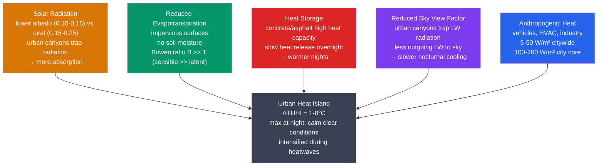

# 🏙️ Urban Heat Island Effect

> [!abstract] TL;DR
> The **urban heat island (UHI)** effect is the phenomenon whereby cities run **1–8 °C warmer** than their surrounding rural areas. It arises because urban development replaces vegetation with impervious surfaces (**lower albedo**, **no evapotranspiration**), builds **urban geometry that traps radiation** (a reduced **sky view factor**), adds **waste heat** from energy use (**anthropogenic heat flux**, $Q_F$), and roughens the flow so **turbulent mixing changes**. The **surface UHI (SUHI)** is mapped from satellite thermal-infrared (TIR) imagery; the **canopy-layer UHI (CUHI)** is measured at the 2 m screen height; a **boundary-layer UHI** sits aloft. The UHI is **strongest at night** (reduced longwave escape) and **compounds heatwaves**, magnifying urban heat mortality. Mitigation leans on **cool roofs (high albedo)**, **green roofs**, **urban trees**, and **permeable pavements**.

---

## Intuition — analogy FIRST

Picture a city on a hot summer day as a stone slab left out in the sun. Asphalt and concrete are dark and dense: they **soak up sunlight** and, because they have enormous **heat capacity**, they hoard that energy like a battery — then slowly bleed it back out long after sunset, keeping the night warm. A grassy field beside it does something the slab cannot: it **sweats**. Plants and moist soil pump water vapour into the air (evapotranspiration), and evaporating water carries heat away exactly the way perspiration cools your skin. Pavement has no water to give, so all the absorbed energy goes into simply getting hotter.

Now add the buildings. A narrow street flanked by tall walls is an **urban canyon** — a light trap. Sunlight that bounces off one wall doesn't escape to the sky; it strikes the opposite wall, reflects again, and is absorbed a little more with each bounce, like a coin rattling down a deep well until it's swallowed. Those same walls do a second thing at night: they block the ground's view of the cold sky. A surface can only shed infrared heat to whatever cold sky it can "see," and a deep canyon **sees almost no sky** (a low **sky view factor**) — the walls, warm themselves, reflect the heat right back down. The city is, in effect, thermally insulated from the cold universe above it. Warm core, cooler rural "sea" around it: a genuine island of heat.

---

## How It Works



**Three UHIs, three thermometers.** The label "UHI" actually names a family of overlapping heat islands measured in different places:

- **Surface UHI (SUHI)** — the temperature of the *ground and rooftops* (the **radiometric skin**), retrieved from satellite **thermal-infrared** sensors such as **Landsat TIRS** (~100 m) and **MODIS/ASTER**. SUHI is largest in the **daytime**, when sun-baked asphalt can be 15–30 °C hotter than shaded grass, and it is spatially detailed but only a proxy for what people actually feel.
- **Canopy-layer UHI (CUHI)** — the *air* temperature within the urban canopy (roughly ground to roof level), measured by standard **2 m screen-height thermometers** at weather stations or mobile transects. This is the classic "the city is X degrees warmer than the countryside" figure, and it peaks **at night**.
- **Boundary-layer UHI** — a warm dome of air *above* roof level, extending from the rooftops up through the [[Atmospheric_Boundary_Layer]], detected by radiosondes, aircraft, or towers, and advected downwind as an urban **plume**.

**The urban surface energy balance.** Everything follows from one budget equation for a slab of city surface:

$$Q^* + Q_F = Q_H + Q_E + \Delta Q_S$$

where $Q^*$ is **net all-wave radiation** (shortwave-in minus reflected minus net longwave-out), $Q_F$ is the **anthropogenic heat flux** (waste heat from combustion, metabolism, and air conditioning — a term that simply *doesn't exist* in the natural energy balance), $Q_H$ is the **turbulent sensible heat** flux that warms the air, $Q_E$ is the **latent heat** flux (evapotranspiration), and $\Delta Q_S$ is **net storage** into the urban fabric. Urbanization rearranges the right-hand side: with little water to evaporate, $Q_E$ collapses and the energy is forced into $Q_H$ and $\Delta Q_S$ instead. See [[Solar_Radiation_and_the_Energy_Budget]] for the radiative terms and [[Laws_of_Thermodynamics]] for the conservation principle underneath.

**The Bowen ratio flips.** The **Bowen ratio** $B = Q_H/Q_E$ measures how energy splits between heating the air and evaporating water. A well-watered rural landscape might have $B \approx 0.5$ (latent dominates); a dry city core can reach $B \gg 1$ — often 2–5. High $B$ means incoming energy overwhelmingly becomes **sensible heat**, directly raising air temperature rather than being hidden as the latent heat of vaporization.

**Radiation trapping and the sky view factor.** In an urban canyon, both shortwave and longwave radiation are trapped by **multiple reflection** between walls, and the **effective albedo** of the canyon system falls below the albedo of the individual materials — the geometry itself darkens the city. At night the same geometry throttles cooling: outgoing longwave that would escape to a cold sky instead strikes a warm wall and is partly returned. The controlling parameter is the **sky view factor (SVF)**, $\Psi_{sky}$ — the fraction of the overlying hemisphere that is open sky rather than obstruction. Deep canyons (low $\Psi$) cool slowly, which is precisely why the CUHI grows through the night.

**Reduced ventilation, then wind kills it.** Buildings roughen the surface and, in still conditions, shelter street-level air from mixing with cooler air aloft. But this cuts both ways: **strong wind and clouds destroy the UHI**. Wind mechanically mixes the warm urban air with rural air, and clouds suppress the nocturnal longwave cooling that the rural site relies on to get cold. That is why the largest UHIs are always observed on **calm, clear, anticyclonic nights** — the very conditions that also produce dangerous heatwaves.

---

## Key Concepts / Details

### Secondary Level

- **What it is.** A city is a warm "island" sitting in a cooler rural "sea." On a calm clear night a big city can be several degrees — sometimes 5–8 °C — warmer than the fields just beyond its edge.
- **Why cities are warmer.** Three big reasons: (1) dark **asphalt and concrete absorb more sunlight** than fields and forests; (2) cities have **no plants sweating water** to cool the air; (3) tall buildings **trap heat** in the streets between them.
- **Nights are the giveaway.** The UHI is usually **strongest at night**. During the day sunshine and breezes stir everything up, but after sunset the countryside cools quickly while the city's stored heat keeps it warm — so the gap between them **grows overnight**.
- **Hot asphalt vs. grass.** Stand barefoot on a sunny parking lot, then on a lawn: the pavement can be painfully hot while the grass stays cool. That everyday difference *is* the surface heat island.
- **How trees cool cities.** A tree shades the ground *and* releases water vapour, doubly cooling its patch of city. A single mature street tree can have the cooling effect of several small air conditioners running all day — for free.
- **Street trees beat green roofs for people.** A garden on a rooftop cools the roof, but a pedestrian on the sidewalk feels little of it. A **street tree** shades the sidewalk directly, so for the comfort of people walking around, ground-level greenery wins.
- **Why it matters.** During heatwaves the UHI makes cities **deadlier**. Hot nights give bodies no chance to recover, which is why urban heat kills — especially the elderly and those without air conditioning.

### Undergraduate Level

- **Surface energy balance, term by term.** $Q^* + Q_F = Q_H + Q_E + \Delta Q_S$. Typical *urban* daytime partitioning: $Q_H \approx 60\%$, $Q_E \approx 20\%$, $\Delta Q_S \approx 20\%$ of available energy. Typical *rural* partitioning: $Q_H \approx 30\%$, $Q_E \approx 50\%$, $\Delta Q_S \approx 20\%$. The signature of urbanization is the **swap of latent for sensible heat** plus the appearance of a nonzero $Q_F$.
- **Anthropogenic heat flux $Q_F$.** Global land average is tiny (~0.03 W/m²), but it concentrates: **10–50 W/m² over large cities** and **100–200 W/m² in dense CBD cores**, seasonally peaking with winter heating or summer air-conditioning demand. In the densest, coldest cities (e.g. central Tokyo in winter) $Q_F$ can rival $Q^*$.
- **Sky view factor (SVF).** Define $\Psi_{sky}$ as the fraction of the hemispherical sky dome visible from a surface point (0 = fully obstructed, 1 = open field). For the **centre of a symmetric, infinitely long street canyon** of wall height $H$ and width $W$, the walls block everything below an elevation angle $\arctan(2H/W)$, so
  $$\Psi_{sky} = \cos\!\left(\arctan\frac{2H}{W}\right) = \frac{1}{\sqrt{1 + (2H/W)^2}} = \frac{W}{\sqrt{W^2 + 4H^2}}.$$
  Limits check: $H\to0 \Rightarrow \Psi\to1$ (open); $H\to\infty \Rightarrow \Psi\to0$ (deep slot). Net longwave loss from the floor scales roughly with $\Psi_{sky}$, so a deep canyon ($\Psi \approx 0.3$) sheds far less heat to the sky than open ground ($\Psi \approx 1$) — the core of nocturnal UHI physics.
- **Canyon geometry: the $H{:}W$ aspect ratio.** As $H{:}W$ rises, effective albedo falls (more trapping), $\Psi_{sky}$ falls (less cooling), and net radiation is retained in the fabric — all pushing UHI up. This is the single most useful morphological knob.
- **Oke's empirical UHI relations.** Maximum nocturnal CUHI intensity correlates with both population and canyon geometry. Oke (1981) gives, for the canyon aspect ratio,
  $$\Delta T_{uh(max)} = 2.01\,\ln\!\left(\frac{H}{W}\right) + 2.30 \quad (^\circ\mathrm{C}),$$
  and a companion population relation $\Delta T_{uh(max)} \approx 2.96\log_{10}(P) - 6.41$ for European settlements. (Worked example: for $H/W = 3$, $\Delta T \approx 2.01\ln 3 + 2.30 \approx 2.01(1.099)+2.30 \approx 4.5\,^\circ\mathrm{C}$.)
- **Timing and controls.** CUHI peaks **2–5 hours after sunset** and is modulated by weather: it is maximal under **calm, clear, anticyclonic** conditions and is largely erased by wind (mechanical mixing) or cloud (suppressed rural cooling). A useful scaling is $\Delta T_{uh} \propto U^{-1/2}$ and $\propto N^{-1/4}$ (with $U$ wind speed, $N$ cloud fraction).
- **Nocturnal inversions.** Rural sites often develop a **surface temperature inversion** on calm clear nights (cold ground, warmer air above); the warm city inhibits or lifts this inversion, so the *difference* — not the city warming per se — largely explains the big nighttime CUHI.
- **Measurement methods.** SUHI from satellite TIR (spatially complete, skin temperature, daytime-biased); CUHI from fixed stations or mobile/bicycle transects (air temperature, but sparse). The two are **not interchangeable** — SUHI and CUHI can even peak at different times of day.
- **Urban cool islands (UCI).** In hot, dry climates a heavily **irrigated** city (parks, lawns, street trees) can be *cooler* than the surrounding sun-baked desert during the day, because urban latent-heat flux exceeds what the moisture-starved rural surface can offer — a sign reversal that pure "cities are warm" intuition misses.

### Graduate Level

- **Energy-balance closure.** Field campaigns rarely close the urban balance exactly; eddy-covariance flux towers plus storage-heat estimation leave residuals of 10–30 %, because $\Delta Q_S$ (heat conducted into the 3-D urban fabric) is genuinely hard to measure and is usually inferred by residual or via the **Objective Hysteresis Model (OHM)** relating $\Delta Q_S$ to $Q^*$ and its time derivative.
- **Parameterization schemes.** **LUMPS** (Local-scale Urban Meteorological Parameterization Scheme) is a lightweight slab approach giving $Q_H$, $Q_E$ from net radiation and simple surface parameters; **SUEWS** extends it with an urban water balance. Full **Urban Canopy Models (UCMs)** — single-layer (Kusaka) and **multi-layer (BEP/BEM)** — resolve the canyon explicitly and are coupled into mesoscale models like **WRF**.
- **Morphometric parameters.** UCMs are driven by the building geometry statistics: **plan area fraction** $\lambda_p$ (built footprint / plan area), **frontal area density** $\lambda_f$ (wall area facing the wind / plan area, controlling aerodynamic roughness $z_0$ and displacement $d$), mean $H{:}W$, and material **albedo, emissivity, thermal conductivity, and volumetric heat capacity** for roof/wall/road facets. Surface heterogeneity forces a **blending height** above which fluxes homogenize.
- **Local Climate Zones (LCZ).** Stewart & Oke (2012) replaced the crude urban/rural binary with **17 standardized classes** — **10 built types** (compact/open × high/mid/low-rise, large low-rise, sparsely built, heavy industry) and **7 land-cover types** (dense trees, scattered trees, bush, low plants, bare rock/paved, bare soil/sand, water). Each LCZ carries characteristic ranges of SVF, $H{:}W$, $\lambda_p$, albedo, and anthropogenic heat, so UHI is properly framed as a **difference between LCZs** rather than "city minus one arbitrary rural station." The **WUDAPT** project maps LCZs globally from Landsat/Sentinel imagery with random-forest classifiers, enabling consistent cross-city comparison.
- **UHI and convection.** The urban heat excess drives a **heat-island circulation** — daytime convergence and rising motion over the warm core — which can **initiate or intensify thunderstorms** and shift precipitation **downwind** of and over cities (documented over Atlanta, St. Louis/METROMEX, and Houston). Enhanced roughness and pollution aerosols (extra cloud condensation nuclei) modulate the effect; see [[Extreme_Weather_and_Meteorological_Hazards]].
- **Evapotranspirative cooling budget.** A single mature tree transpiring **~100–500 L day⁻¹** absorbs latent heat $Q_E = \dot m\,L_v$; at ~450 L over a 12 h day, $\dot m \approx 0.0104\ \mathrm{kg\,s^{-1}}$ and $L_v \approx 2.45\times10^6\ \mathrm{J\,kg^{-1}}$ give **~25 kW of instantaneous cooling** at midday peak (often quoted as several hundred watts to a couple of kilowatts on a daily-average basis) — comparable to multiple domestic air conditioners, delivered passively.
- **Mitigation quantification.** Studies express sensitivity as **ΔT per unit change in green fraction or albedo**: e.g. +10 % urban green cover typically buys ~0.3–0.5 °C of daytime cooling, and raising city-wide roof albedo by 0.1 lowers near-surface air temperature by ~0.1–0.3 °C. **Albedo engineering** (cool pavements/roofs) and **vegetation** act through different terms of the energy balance ($Q^*$ vs. $Q_E$), so they are complementary, not redundant.
- **UHI vs. the global record.** Careful homogenization, rural-station subsampling, and satellite comparison show the **UHI contamination of the global mean land-temperature trend is small** (IPCC assesses **< 0.1 °C** over the 20th century, far below the ~1.1 °C observed warming), because analyses actively correct for it and ocean records (70 % of the surface) are immune. Locally, however, SUHI trends in rapidly urbanizing megacities can add **1–3 °C** on top of the background warming.
- **Future UHI under warming.** UHI intensity and greenhouse warming are largely **additive** but interact nonlinearly during heatwaves: reduced soil moisture in the surrounding rural land can shrink the daytime UHI while the nocturnal UHI and total urban heat stress rise. Coupling UCMs to downscaled climate projections is an active area for assessing city-scale heat risk under +1.5 °C / +2 °C scenarios (linked to [[Anthropogenic_Climate_Change]]).

---

## Python Demo — Nocturnal UHI from a Radiative Cooling Model

```python
# Why does the urban heat island GROW overnight?
# Model the post-sunset radiative cooling of two surfaces that start equally warm.
#   - Rural: open ground, high sky view factor (sees the cold sky) + low thermal mass
#   - Urban: deep canyon, low sky view factor (walls block the sky) + high thermal mass
# Each cools by losing longwave radiation to the sky:  dT/dt = -SVF * eps * sigma * T^4 / C
# (A teaching model: atmospheric back-radiation is omitted, so the ABSOLUTE drop is
#  exaggerated -- but the DIFFERENCE between the two curves is exactly the UHI mechanism.)

import numpy as np
import matplotlib.pyplot as plt

sigma = 5.670e-8          # Stefan-Boltzmann constant, W m^-2 K^-4
eps   = 0.95              # surface longwave emissivity (both surfaces)

# Surface parameters
SVF_urban, SVF_rural = 0.40, 0.95          # sky view factor (fraction of sky visible)
C_urban,   C_rural   = 300e3, 150e3        # areal heat capacity, J m^-2 K^-1 (300 & 150 kJ)

# Integrate from sunset (t=0) over 12 hours of night
hours = 12.0
dt    = 1.0                                # time step, seconds
steps = int(hours * 3600 / dt)
time_h = np.arange(steps + 1) * dt / 3600  # time axis in hours

T0 = 295.15                                # both start at 22.0 C at sunset

def cool(SVF, C, T_init):
    """Forward-Euler integration of nocturnal radiative cooling."""
    T = np.empty(steps + 1)
    T[0] = T_init
    for k in range(steps):
        dTdt = -SVF * eps * sigma * T[k]**4 / C     # K s^-1 (net loss -> negative)
        T[k + 1] = T[k] + dTdt * dt
    return T

T_urban = cool(SVF_urban, C_urban, T0)
T_rural = cool(SVF_rural, C_rural, T0)
UHI = T_urban - T_rural                     # urban heat island intensity (K == degC diff)

print(f"Start of night : UHI = {UHI[0]:.2f} C")
print(f"After 3 h       : UHI = {UHI[int(3*3600/dt)]:.2f} C")
print(f"End of night(12h): UHI = {UHI[-1]:.2f} C")

# ---------- Plot ----------
fig, (ax1, ax2) = plt.subplots(2, 1, figsize=(9, 8), sharex=True)

ax1.plot(time_h, T_urban - 273.15, color="#dc2626", lw=2,
         label=f"Urban  (SVF={SVF_urban}, C={C_urban/1e3:.0f} kJ/m2/K)")
ax1.plot(time_h, T_rural - 273.15, color="#2563eb", lw=2,
         label=f"Rural  (SVF={SVF_rural}, C={C_rural/1e3:.0f} kJ/m2/K)")
ax1.set_ylabel("Surface temperature (C)")
ax1.set_title("Nocturnal cooling: rural surface loses heat faster")
ax1.legend(loc="upper right")
ax1.grid(alpha=0.3)

ax2.plot(time_h, UHI, color="#374151", lw=2.5)
ax2.fill_between(time_h, 0, UHI, color="#f59e0b", alpha=0.35)
ax2.set_xlabel("Hours after sunset")
ax2.set_ylabel("UHI intensity  T_urban - T_rural  (C)")
ax2.set_title("The urban heat island GROWS through the night")
ax2.grid(alpha=0.3)

plt.tight_layout()
plt.show()
```

The rural surface has an unobstructed view of the cold sky and little heat to give, so it **plunges in temperature** after sunset. The urban surface, its longwave escape choked by a low sky view factor and its heat locked in a high-capacity slab of concrete, **cools sluggishly**. The two curves diverge, and the shaded gap — the UHI intensity — **widens monotonically through the night**, exactly as observed in real cities where the CUHI peaks in the small hours. (Because the model omits downwelling atmospheric radiation, treat the absolute temperatures as illustrative; the *differential* is the physically robust result.)

---

## Real-World Notes

- **London, up to 7 °C.** On calm, clear nights central London has been measured **~6–7 °C warmer** than the surrounding countryside, one of the best-documented CUHIs in the world — and the reason the 2003 and 2022 heatwaves were markedly more lethal inside the city than outside it.
- **Phoenix, Arizona — warming beyond the global trend.** Phoenix has warmed by roughly **4 °C since ~1970**, with nighttime minima rising fastest. A substantial share is attributable to explosive urban growth and the spread of impervious surfaces — a local UHI signal riding on top of, and locally exceeding, the global warming trend.
- **The 2003 European heatwave.** France suffered **~15,000 heat deaths** (and 70,000+ across Europe), concentrated in cities such as Paris where the UHI kept apartment buildings — largely without air conditioning — dangerously hot **at night**, denying residents the nocturnal recovery that prevents heat stress from accumulating.
- **Tokyo's greening.** Aggressive urban-greening and rooftop-planting mandates (Tokyo added on the order of millions of trees and required green roofs on large new buildings) are credited with **shaving ~1–2 °C** off local summer heat-island intensity in targeted districts, illustrating mitigation at metropolitan scale.
- **Cool roofs pay off.** Swapping a standard dark roof (albedo ≈ 0.15) for a **cool roof (albedo ≈ 0.65)** can save on the order of **~40 kWh m⁻² yr⁻¹** of cooling energy in a hot climate — comparable to adding significant roof insulation — while simultaneously lowering the surface temperature that feeds the SUHI.

---

## Common Pitfalls

1. **UHI is not global warming.** The UHI is a **local** effect that biases *urban* thermometer readings upward, but it does **not** materially inflate the global-mean temperature trend. Homogenization, rural subsampling, and the ocean record (70 % of Earth's surface, UHI-free) keep the assessed contamination **< 0.1 °C** over the 20th century — an order of magnitude below the observed ~1.1 °C warming. Conflating the two is a classic error.
2. **The UHI peaks at NIGHT, not midday.** Intuition says "cities bake at noon," but the *air-temperature* CUHI is usually **weakest around midday** — strong daytime convective mixing ventilates the streets — and **strongest a few hours after sunset**, when trapped storage heat and low SVF keep the city from cooling. (Surface skin temperature SUHI, by contrast, does peak by day.)
3. **Green roofs ≠ cooler streets.** A green roof cuts a **building's** cooling load and eases the SUHI seen from above, but it does little for the person on the pavement below. For **pedestrian thermal comfort**, ground-level **street trees** (shade + transpiration exactly where people are) are far more effective.
4. **Dry cities can be cool islands.** In arid climates, an **irrigated** city can be **cooler than the surrounding desert by day** — an *urban cool island* — because watered parks and street trees supply latent-heat cooling that the moisture-starved rural land cannot. Assuming "urban = warmer" everywhere gets the sign wrong.
5. **Anthropogenic heat is usually a minor term.** Waste heat $Q_F$ feels intuitively central, but in most cities it contributes only **~5–20 %** of the UHI. The dominant drivers are **reduced albedo, suppressed evapotranspiration, and low sky view factor**. $Q_F$ only becomes first-order in exceptionally dense, high-latitude winter cores (e.g. central Tokyo, Manhattan).

---

## Related Concepts

- [[_MOC_Climatology_and_Climate_Change]] — section map for the climatology & climate-change unit; start here to orient
- [[Regional_Climates_and_Microclimates]] — the UHI is the archetypal anthropogenic **microclimate**; this note sits within the broader theory of local climate modification
- [[Extreme_Weather_and_Meteorological_Hazards]] — the UHI compounds heatwaves and drives urban heat mortality; also links to heat-island-enhanced convection
- [[Droughts_and_Floods]] — dry-heat compounding (soil-moisture drawdown intensifies urban heat stress) and urban-enhanced convective downpours
- [[Atmospheric_Boundary_Layer]] — the boundary-layer UHI and urban plume live here; roughness, mixing, and inversions set UHI strength
- [[Solar_Radiation_and_the_Energy_Budget]] — the shortwave/longwave terms of the surface energy balance that the UHI rearranges
- [[Anthropogenic_Climate_Change]] — the global warming trend that UHI is often confused with, and on top of which local UHI adds
- [[_MOC_Physics_Master]] — cross-vault physics entry point
- [[Electromagnetic_Waves_and_Radiation]] — the shortwave-in / longwave-out radiation physics underlying albedo trapping and nocturnal cooling
- [[Laws_of_Thermodynamics]] — energy conservation behind the surface energy balance $Q^*+Q_F=Q_H+Q_E+\Delta Q_S$
- [[_MOC_Earth_Science_Master]] — cross-vault Earth-science entry point
- [[Weathering_and_Soils]] — soil moisture and land cover set rural evapotranspiration, the baseline the city is compared against

---

## Review Questions

**Secondary**
- Why are cities typically warmer than the surrounding countryside? List **three** physical mechanisms.
- Why is the UHI effect **stronger at night** than during the day?

**Undergraduate**
- Define the **sky view factor (SVF)** for a street canyon, and derive the relationship $\Psi_{sky} = 1/\sqrt{1+(2H/W)^2}$ between the canyon $H{:}W$ aspect ratio and SVF for the centre of an infinitely long canyon. Check the limits $H\to0$ and $H\to\infty$.
- Using Oke's empirical formula $\Delta T_{uh} = 2.01\ln(H/W) + 2.30$, what UHI intensity is expected for $H/W = 3$? *(Answer: $2.01\ln 3 + 2.30 \approx 4.5\,^\circ\mathrm{C}$.)* Explain physically how a reduced SVF contributes to the UHI through modified **longwave** radiation.

**Graduate**
- Compare the **Local Climate Zone (LCZ)** framework with the classical "urban vs. rural" binary. What advantages does LCZ offer for studying UHI **heterogeneity within** a single city?
- Describe how an **urban canopy model (UCM)** in WRF represents building geometry. Which parameters (plan area fraction $\lambda_p$, frontal area density $\lambda_f$, wall/roof albedo, thermal properties) are required, and how does **uncertainty in these parameters propagate** into predicted UHI intensity?

---

## Sources

- Oke, T. R. (1987). *Boundary Layer Climates* (2nd ed.). Routledge. — the canonical text; urban energy balance, canyon SVF, and empirical UHI relations.
- Stewart, I. D., & Oke, T. R. (2012). "Local Climate Zones for Urban Temperature Studies." *Bulletin of the American Meteorological Society*, 93(12), 1879–1900.
- Santamouris, M. (2014). "On the energy impact of urban heat island and global warming on buildings." *Energy and Buildings*, 82, 100–113.

---

#Meteorology #Climatology #UrbanHeatIsland #UHI #UrbanClimate #CityWarmth
