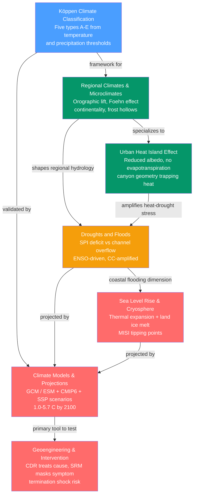

# Climatology and Climate Change — Map of Content

> [!info] How to use this map
> Start with **Köppen Climate Classification** to ground yourself in Earth's climate zones, then follow the arrows through regional and urban climates into hydrological extremes and cryosphere change, before finishing with the modelling machinery and intervention options. Each node links to a full note. Return to this map whenever you need to reorient.

This section moves from describing the present climate to projecting and potentially reshaping the future one. It opens with the Köppen framework — the empirical skeleton that names where each climate "lives" — and builds toward the two most consequential questions of 21st-century Earth science: what will climate look like in 2100, and is deliberate intervention possible without unacceptable risk?

---

## Concept Map

*(Blue = fundamental entry point, Green = intermediate concepts, Amber = applied extremes, Red = advanced modelling and intervention; arrows = "leads to" or "requires")*

---

## Learning Path

*Recommended order for a first pass through this section:*

1. [[Koppen_Climate_Classification]] — Start here to learn the A–E vocabulary that every later note assumes; it shows how the global circulation carves the planet into zones and why warming is already migrating those boundaries.
2. [[Regional_Climates_and_Microclimates]] — Zooms in from the global map to the levers that shape local climate: orographic lift, the Foehn effect, continentality, cold-air pooling, and sea-breeze circulations.
3. [[Urban_Heat_Island_Effect]] — Treats the city as a deliberately engineered microclimate gone awry; builds directly on Regional Climates and introduces the energy-balance equation that underlies all surface-climate physics.
4. [[Droughts_and_Floods]] — Moves from temperature-dominated thinking to the water cycle; shows how ENSO reorganizes global precipitation and how Clausius-Clapeyron simultaneously intensifies both extremes under warming.
5. [[Sea_Level_Rise_and_the_Cryosphere]] — Introduces the slow, committed, potentially irreversible changes to ice and ocean; essential before tackling projections because the cryosphere dominates long-term uncertainty.
6. [[Climate_Models_and_Projections]] — The quantitative machinery: how GCMs and ESMs are built, validated, and run under SSP scenarios; explains what the IPCC warming ranges mean and where the uncertainty lives.
7. [[Geoengineering_and_Climate_Intervention]] — The closing question: if mitigation falls short, what deliberate interventions are possible, what are their physics, and why do governance gaps matter as much as the science?

---

## All Notes in This Section

| Note | Key Concept | Level |
|------|-------------|-------|
| [[Koppen_Climate_Classification]] | Five-type classification (A–E) using temperature and precipitation thresholds reverse-engineered from vegetation; B zones expanding poleward under warming | Beginner |
| [[Regional_Climates_and_Microclimates]] | General circulation modified by topography (orographic lift, Foehn), ocean proximity (continentality), and surface cover to produce local climate variation | Intermediate |
| [[Urban_Heat_Island_Effect]] | Cities run 1–8 °C warmer than rural surroundings due to impervious surfaces, reduced sky view factor, suppressed evapotranspiration, and anthropogenic heat flux | Intermediate |
| [[Droughts_and_Floods]] | Opposite tails of the water cycle quantified by SPI/SPEI; ENSO is the dominant natural driver; Clausius–Clapeyron (~7 %/°C) intensifies both extremes under warming | Intermediate |
| [[Sea_Level_Rise_and_the_Cryosphere]] | Sea level up ~20 cm since 1900 at 3.7 mm/yr from thermal expansion, glaciers, and ice sheets; marine ice sheet instability (MISI) is the dominant long-term uncertainty | Advanced |
| [[Climate_Models_and_Projections]] | GCM/ESM hierarchy driven by SSP scenarios; CMIP6 projects 1.0–5.7 °C by 2100; cloud feedbacks and ice-sheet dynamics are the largest uncertainties | Advanced |
| [[Geoengineering_and_Climate_Intervention]] | CDR removes CO₂ (slow, targets cause); SRM reflects sunlight (fast, masks symptom); SAI risks include termination shock, monsoon disruption, and a global governance vacuum | Advanced |

---

## Key Questions This Section Answers

- How does Earth's general circulation stamp its climate zones onto the land surface, and why are those zones now shifting?
- What physical mechanisms turn a mountainside or a city block into a climate radically different from its surroundings?
- What drives the two most damaging hydrological extremes — drought and flood — and how does warming load both dice simultaneously?
- Which parts of the cryosphere are most vulnerable to warming, and what do they mean for coastal communities over the next century?
- How do climate models translate emission choices into temperature projections, and where does the remaining uncertainty come from?
- Is deliberate climate intervention — removing CO₂ or reflecting sunlight — physically feasible, and what are the non-negotiable risks?

---

## Cross-Section Links

- [[_MOC_Weather_Forecasting]] — The preceding section on synoptic and mesoscale dynamics; that section explains the day-to-day atmospheric machinery that climatology averages over.
- [[_MOC_Climate_System]] — The closely related section on climate mechanisms (greenhouse effect, radiative forcing, feedbacks, ENSO, and paleoclimate) that underpins everything in this section.

---

## Cross-Vault Links

**Earth Science vault** — The physical landscape that both shapes and responds to climate:
- [[Glaciers_and_Glacial_Landscapes]] — Mass balance, calving, and the landforms produced by the same ice that drives sea level rise
- [[Coastal_Processes_and_Landforms]] — How rising seas reshape shorelines through erosion, inundation, and saltwater intrusion
- [[Rivers_and_Fluvial_Landscapes]] — Fluvial channel capacity and floodplains; directly relevant to riverine flood hydraulics (Manning's equation)
- [[Weathering_and_Soils]] — Climate (temperature × moisture) is the master variable on weathering rates and zonal soil types, mirroring the Köppen map
- [[Groundwater_and_Karst]] — Aquifer depletion is the terminal stage of hydrological drought

**Physics vault** — The fundamental laws behind every climate process:
- [[Laws_of_Thermodynamics]] — Energy conservation: the surface energy balance, latent heat, and thermal expansion of seawater
- [[Electromagnetic_Waves_and_Radiation]] — Shortwave absorption and longwave emission that drive the greenhouse effect, UHI albedo trapping, and SAI scattering

**Chemistry vault** — The chemical environment that climate change alters:
- [[Acids_Bases_and_pH]] — Ocean acidification from dissolved CO₂; the carbonate equilibria that SRM cannot fix
- [[Chemical_Kinetics]] — SO₂ oxidation to sulfate aerosol in the stratosphere — the core SAI reaction pathway

**Astronomy vault** — The orbital and stellar context:
- [[_MOC_Astronomy_Master]] — Milankovitch orbital cycles (eccentricity, obliquity, precession) set the deep-time ice-age rhythm; also the entry point for space-based sunshade concepts

---

#MOC #Meteorology #Climatology #ClimateChange
