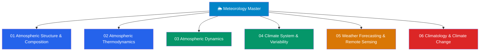

# 🌦️ Meteorology & Climatology — Master Map of Content

> [!abstract] About This Vault
> A comprehensive meteorology & climatology reference spanning **senior secondary through graduate level** — **~38 notes across 6 sections**. Every note opens with an everyday analogy, builds through undergraduate theory and quantitative treatment, and reaches graduate depth with research frontiers. Sections cover **Atmospheric Structure & Composition**, **Atmospheric Thermodynamics**, **Atmospheric Dynamics**, the **Climate System & Variability**, **Weather Forecasting & Remote Sensing**, and **Climatology & Climate Change** — from the layers and radiation budget of the air, through the physics that makes clouds, storms, and jet streams, out to the coupled climate system and how it is changing. Each note grounds the atmospheric science in the underlying physics ([[_MOC_Physics_Master|Physics]]) and chemistry ([[_MOC_Chemistry_Master|Chemistry]]), and connects to [[_MOC_Earth_Science_Master|Earth Science]] and [[_MOC_Astronomy_Master|Astronomy]], with real observations, worked calculations in Python, and tiered review questions.

## Vault Architecture

## Sections at a Glance

| # | Section | Notes | Entry Point | Level Range |
|---|---------|-------|-------------|-------------|
| 01 | Atmospheric Structure & Composition | 6 | [[_MOC_Atmospheric_Structure]] | Secondary → Graduate |
| 02 | Atmospheric Thermodynamics | 7 | [[_MOC_Atmospheric_Thermodynamics]] | Secondary → Graduate |
| 03 | Atmospheric Dynamics | 6 | [[_MOC_Atmospheric_Dynamics]] | Undergraduate → Graduate |
| 04 | Climate System & Variability | 6 | [[_MOC_Climate_System]] | Undergraduate → Graduate |
| 05 | Weather Forecasting & Remote Sensing | 6 | [[_MOC_Weather_Forecasting]] | Undergraduate → Graduate |
| 06 | Climatology & Climate Change | 7 | [[_MOC_Climatology_and_Climate_Change]] | Secondary → Graduate |

---

## Section Contents

**01 — Atmospheric Structure & Composition** — [[_MOC_Atmospheric_Structure]]
- [[Atmospheric_Layers_and_Composition]]
- [[Solar_Radiation_and_the_Energy_Budget]]
- [[Greenhouse_Effect_and_Radiative_Forcing]]
- [[Atmospheric_Pressure_and_the_Hydrostatic_Equation]]
- [[Atmospheric_Chemistry_and_Stratospheric_Ozone]]
- [[Atmospheric_Optics_and_Aerosols]]

**02 — Atmospheric Thermodynamics** — [[_MOC_Atmospheric_Thermodynamics]]
- [[Atmospheric_Temperature_and_Lapse_Rates]]
- [[Adiabatic_Processes_and_Atmospheric_Stability]]
- [[Moisture_and_Humidity]]
- [[Cloud_Formation_and_Microphysics]]
- [[Precipitation_Processes]]
- [[Atmospheric_Boundary_Layer]]
- [[Thunderstorms_and_Convective_Systems]]

**03 — Atmospheric Dynamics** — [[_MOC_Atmospheric_Dynamics]]
- [[Pressure_Gradient_Force_and_Winds]]
- [[Coriolis_Effect_and_Geostrophic_Balance]]
- [[Jet_Streams_and_Upper_Level_Flow]]
- [[Fronts_and_Extratropical_Cyclones]]
- [[Tropical_Meteorology_and_Monsoons]]
- [[Mesoscale_Meteorology_and_Severe_Weather]]

**04 — Climate System & Variability** — [[_MOC_Climate_System]]
- [[Global_Atmospheric_Circulation]]
- [[Ocean_Atmosphere_Coupling_and_ENSO]]
- [[Climate_Variability_and_Teleconnections]]
- [[Paleoclimatology_and_Ice_Cores]]
- [[Climate_Sensitivity_and_Feedbacks]]
- [[Anthropogenic_Climate_Change]]

**05 — Weather Forecasting & Remote Sensing** — [[_MOC_Weather_Forecasting]]
- [[Synoptic_Meteorology_and_Weather_Maps]]
- [[Numerical_Weather_Prediction]]
- [[Remote_Sensing_Radar_and_Satellites]]
- [[Ensemble_Forecasting_and_Uncertainty]]
- [[Tropical_Cyclones_and_Hurricanes]]
- [[Extreme_Weather_and_Meteorological_Hazards]]

**06 — Climatology & Climate Change** — [[_MOC_Climatology_and_Climate_Change]]
- [[Koppen_Climate_Classification]]
- [[Regional_Climates_and_Microclimates]]
- [[Urban_Heat_Island_Effect]]
- [[Droughts_and_Floods]]
- [[Sea_Level_Rise_and_the_Cryosphere]]
- [[Climate_Models_and_Projections]]
- [[Geoengineering_and_Climate_Intervention]]

---

## Learning Paths

### Path 1 — Senior Secondary Student
> Best for: grades 11–12 building the foundation.

[[Atmospheric_Layers_and_Composition]] → [[Solar_Radiation_and_the_Energy_Budget]] → [[Atmospheric_Pressure_and_the_Hydrostatic_Equation]] → [[Atmospheric_Temperature_and_Lapse_Rates]] → [[Moisture_and_Humidity]] → [[Cloud_Formation_and_Microphysics]] → [[Precipitation_Processes]] → [[Fronts_and_Extratropical_Cyclones]] → [[Koppen_Climate_Classification]]

### Path 2 — Atmospheric Science Track
> Dynamics-heavy: how the wind gets its shape.

[[Pressure_Gradient_Force_and_Winds]] → [[Coriolis_Effect_and_Geostrophic_Balance]] → [[Jet_Streams_and_Upper_Level_Flow]] → [[Fronts_and_Extratropical_Cyclones]] → [[Global_Atmospheric_Circulation]] → [[Numerical_Weather_Prediction]]

### Path 3 — Climate Science Track
> From the radiation budget to the anthropogenic signal.

[[Solar_Radiation_and_the_Energy_Budget]] → [[Greenhouse_Effect_and_Radiative_Forcing]] → [[Global_Atmospheric_Circulation]] → [[Ocean_Atmosphere_Coupling_and_ENSO]] → [[Climate_Sensitivity_and_Feedbacks]] → [[Anthropogenic_Climate_Change]] → [[Climate_Models_and_Projections]]

### Path 4 — Severe Weather Track
> Instability to catastrophe.

[[Adiabatic_Processes_and_Atmospheric_Stability]] → [[Thunderstorms_and_Convective_Systems]] → [[Mesoscale_Meteorology_and_Severe_Weather]] → [[Tropical_Meteorology_and_Monsoons]] → [[Tropical_Cyclones_and_Hurricanes]] → [[Extreme_Weather_and_Meteorological_Hazards]]

### Path 5 — Remote Sensing & Forecasting Track
> How a forecast is made, from raw signal to public warning.

[[Remote_Sensing_Radar_and_Satellites]] → [[Synoptic_Meteorology_and_Weather_Maps]] → [[Numerical_Weather_Prediction]] → [[Ensemble_Forecasting_and_Uncertainty]] → [[Extreme_Weather_and_Meteorological_Hazards]]

### Path 6 — Climatology & Policy Track
> The coupled system, deep time, and what we do about it.

[[Global_Atmospheric_Circulation]] → [[Ocean_Atmosphere_Coupling_and_ENSO]] → [[Climate_Variability_and_Teleconnections]] → [[Paleoclimatology_and_Ice_Cores]] → [[Climate_Sensitivity_and_Feedbacks]] → [[Anthropogenic_Climate_Change]] → [[Geoengineering_and_Climate_Intervention]]

---

## Cross-Vault Links

Meteorology is fluid physics and radiative transfer applied to a rotating, moist atmosphere — it draws on much of the Physics and Chemistry vaults, and shares the climate system with Earth Science and Astronomy:

- **Physics** — [[_MOC_Physics_Master]]: [[Laws_of_Thermodynamics]] and [[Kinetic_Theory_of_Gases]] underlie atmospheric thermodynamics, lapse rates, and the ideal-gas state of the air; [[Fluid_Statics_and_Properties]] and [[Newtons_Laws_and_Kinematics]] underlie the dynamics of pressure gradients, winds, and geostrophic balance; [[Electromagnetic_Waves_and_Radiation]] and [[Atomic_Models_and_Spectroscopy]] underlie the radiation budget and all of remote sensing; [[Wave_Motion_and_Properties]] frames Rossby and gravity waves; [[Rotational_Dynamics]] gives the Coriolis effect on a spinning Earth.
- **Chemistry** — [[_MOC_Chemistry_Master]]: [[Chemical_Kinetics]] and [[Acids_Bases_and_pH]] govern ozone photochemistry, smog, and acid rain in atmospheric chemistry; [[Phase_Equilibria_and_Colligative_Properties]] set saturation, nucleation, and cloud/precipitation microphysics; [[Chemical_Thermodynamics]] underpins the entropy and free-energy view of atmospheric thermodynamic diagrams.
- **Earth Science** — [[_MOC_Earth_Science_Master]]: [[Weathering_and_Soils]] couples climate to the land surface; [[Glaciers_and_Glacial_Landscapes]] and the cryosphere store and record climate; [[Mass_Extinctions_and_Paleoclimate]] places today's change in deep time; [[Coastal_Processes_and_Landforms]] and [[Rivers_and_Fluvial_Landscapes]] are shaped by sea-level rise, storms, and precipitation.
- **Astronomy** — [[_MOC_Astronomy_Master]]: [[The_Sun]] drives solar variability and the top-of-atmosphere forcing; [[Formation_of_the_Solar_System]] frames comparative planetary climate (Venus, Mars, Earth); [[Orbital_Mechanics_and_Celestial_Dynamics]] gives the Milankovitch cycles that pace the ice ages.
- **Signals & Systems** — [[_MOC_SS_Master]]: the [[Fourier_Transform]] is the engine of spectral analysis in radar/satellite remote sensing and in the spectral methods used by numerical weather prediction.

---

## Section MOC Index

- [[_MOC_Atmospheric_Structure]] — the stage: vertical layers and composition, the solar and terrestrial energy budget, the greenhouse effect, hydrostatic pressure, stratospheric ozone chemistry, and optics/aerosols.
- [[_MOC_Atmospheric_Thermodynamics]] — the engine: temperature and lapse rates, adiabatic processes and stability, moisture and humidity, cloud microphysics, precipitation, the boundary layer, and convective storms.
- [[_MOC_Atmospheric_Dynamics]] — the motion: the pressure-gradient force and winds, Coriolis and geostrophic balance, jet streams, fronts and mid-latitude cyclones, tropical circulations and monsoons, and mesoscale severe weather.
- [[_MOC_Climate_System]] — the coupled whole: global circulation, ocean–atmosphere coupling and ENSO, teleconnections, paleoclimate archives, climate sensitivity and feedbacks, and anthropogenic change.
- [[_MOC_Weather_Forecasting]] — the practice: synoptic analysis and weather maps, numerical weather prediction, radar and satellite remote sensing, ensembles and uncertainty, tropical cyclones, and meteorological hazards.
- [[_MOC_Climatology_and_Climate_Change]] — climate in place and time: Köppen classification, regional and micro-climates, urban heat islands, droughts and floods, sea-level rise and the cryosphere, climate models and projections, and geoengineering.

#MOC #Meteorology #Climatology #MasterMOC
