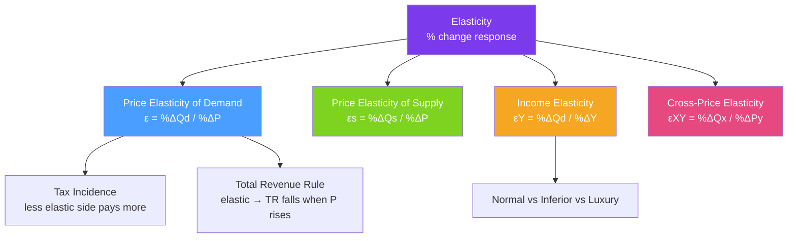

# 📐 Elasticity

> [!abstract] TL;DR
> **Elasticity** measures the percentage responsiveness of one variable to a 1% change in another. The **price elasticity of demand (PED)** — the most important — equals $\varepsilon = \frac{\%\Delta Q_D}{\%\Delta P}$ and is always negative. When $|\varepsilon| > 1$ demand is elastic (responsive); when $|\varepsilon| < 1$ it is inelastic (unresponsive). Elasticity determines who bears a tax: the less elastic side bears more of the burden.

## Intuition — analogy FIRST

Think of a rubber band. A highly elastic rubber band stretches a lot in response to a small force. A stiff spring barely moves when you push it. **Elastic demand** is like a rubber band — a small price increase causes buyers to flee. **Inelastic demand** is like a spring — even a big price hike barely dents quantity demanded.

Insulin is a spring: diabetics will pay almost any price rather than forgo it. Luxury vacations are a rubber band: a 10% price rise and many travelers switch to cheaper options. The business implication is immediate: you can raise prices on inelastic goods without losing much revenue, but the same move on elastic goods would be ruinous.

---

## How It Works

## Key Concepts / Details

### Price Elasticity of Demand (PED)

$$\varepsilon_D = \frac{\%\Delta Q_D}{\%\Delta P} = \frac{\Delta Q_D / Q_D}{\Delta P / P} = \frac{\Delta Q_D}{\Delta P} \cdot \frac{P}{Q_D}$$

Since demand curves slope downward, $\varepsilon_D$ is **always negative**. By convention, economists often report the absolute value $|\varepsilon_D|$.

| $|\varepsilon_D|$ | Label | Interpretation |
|------------------|-------|---------------|
| $= 0$ | Perfectly inelastic | Vertical demand; price has no effect on quantity |
| $0 < |\varepsilon_D| < 1$ | Inelastic | Quantity responds less than proportionately to price |
| $= 1$ | Unit elastic | Quantity responds exactly proportionately to price |
| $|\varepsilon_D| > 1$ | Elastic | Quantity responds more than proportionately to price |
| $= \infty$ | Perfectly elastic | Horizontal demand; any price rise kills all demand |

**Point elasticity** vs **Arc elasticity** (midpoint method):
$$\varepsilon_{arc} = \frac{(Q_2 - Q_1)/[(Q_1+Q_2)/2]}{(P_2 - P_1)/[(P_1+P_2)/2]}$$
The arc formula avoids path-dependence (different answers depending on whether you compute from A to B or B to A).

### Determinants of PED

| Factor | More Elastic When | More Inelastic When |
|--------|-----------------|-------------------|
| **Substitutes** | Many close substitutes exist | Few or no substitutes |
| **Necessity vs luxury** | Luxury (want, not need) | Necessity (cannot forego) |
| **Share of income** | Large share of budget | Small share of budget |
| **Time horizon** | Long run (can adjust) | Short run (locked in) |
| **Addictiveness** | Non-addictive | Addictive (nicotine, opioids) |

### Total Revenue and PED

$$TR = P \times Q_D$$

| Demand type | Price rises → TR | Price falls → TR |
|-------------|----------------|----------------|
| Elastic $|\varepsilon| > 1$ | TR falls | TR rises |
| Unit elastic $|\varepsilon| = 1$ | TR unchanged | TR unchanged |
| Inelastic $|\varepsilon| < 1$ | TR rises | TR falls |

**Implication for monopolists**: A monopolist should never operate in the inelastic region — raising price always increases revenue there, so it's suboptimal to stop short of the unit-elastic point (where $MR = 0$). See [[Monopoly]].

### Price Elasticity of Supply (PES)

$$\varepsilon_S = \frac{\%\Delta Q_S}{\%\Delta P} = \frac{\Delta Q_S}{\Delta P} \cdot \frac{P}{Q_S} \geq 0$$

Supply is more elastic when:
- Production can be easily scaled (no capacity constraints)
- Inputs are readily available
- Time horizon is longer (more time to adjust)

### Income Elasticity of Demand (YED)

$$\varepsilon_Y = \frac{\%\Delta Q_D}{\%\Delta Y}$$

| $\varepsilon_Y$ | Good type | Example |
|----------------|-----------|---------|
| $\varepsilon_Y > 1$ | Luxury/superior | Designer clothing, fine dining |
| $0 < \varepsilon_Y < 1$ | Normal necessity | Food, basic clothing |
| $\varepsilon_Y < 0$ | Inferior | Instant noodles, bus tickets |

### Cross-Price Elasticity of Demand (XED)

$$\varepsilon_{XY} = \frac{\%\Delta Q_X}{\%\Delta P_Y}$$

| $\varepsilon_{XY}$ | Relationship | Example |
|-------------------|-------------|---------|
| $> 0$ | Substitutes | Coke and Pepsi |
| $< 0$ | Complements | Cars and gasoline |
| $= 0$ | Unrelated | Bread and helicopter parts |

### Tax Incidence — Who Really Pays?

A tax creates a wedge between the price buyers pay ($P_B$) and the price sellers receive ($P_S$):
$$P_B - P_S = t \quad \text{(per unit tax)}$$

**Incidence rule**: The **less elastic** side bears the larger share of the tax burden — they have fewer alternatives to escape.

$$\text{Buyer's share} = \frac{\varepsilon_S}{\varepsilon_S - \varepsilon_D}, \quad \text{Seller's share} = \frac{-\varepsilon_D}{\varepsilon_S - \varepsilon_D}$$

Real-world examples:
- **Cigarette tax**: Demand is inelastic → smokers bear most of the burden.
- **Corporate income tax**: If capital is mobile (elastic supply), labor may bear much of the burden through lower wages.
- **Payroll tax**: Inelastic labor supply → workers bear most of it, regardless of whether employer or employee nominally pays.

---

## Real-World Notes

- **Netflix price increases**: Netflix's multiple price hikes in 2022–2023 tested elasticity. They found demand relatively inelastic for existing subscribers (habit, content lock-in), but elastic for new sign-ups — reflecting the distinction between short-run and long-run elasticity.
- **OPEC and oil pricing**: OPEC relies on the inelastic short-run demand for oil to profit from supply restrictions. Long-run demand is more elastic (consumers switch to EVs, improve insulation), which erodes the cartel's power over time.
- **Amazon/Walmart low-margin strategy**: Competing on elastic-demand goods (commodity products), where a small price advantage captures large market share.
- **Opioid crisis policy**: Demand for opioids is highly inelastic among addicted users. Supply restrictions raised street prices without reducing consumption much — instead, users shifted to cheaper substitutes like fentanyl. Elasticity analysis would have predicted this.

---

## Common Pitfalls

- **Confusing the slope with elasticity.** A steeper demand curve is *not necessarily* more inelastic. Elasticity changes along a linear demand curve — it is high (elastic) at high prices and low (inelastic) at low prices.
- **Ignoring time horizon.** Short-run elasticity is nearly always lower than long-run elasticity. A sudden gasoline price spike barely reduces driving today; over five years, people buy more fuel-efficient cars.
- **Assuming the taxing authority bears no deadweight loss.** Any tax drives a wedge, reducing total surplus. The revenue gain is less than the welfare loss (see [[Consumer_and_Producer_Surplus]]).
- **Applying PED results to supply-side questions.** The total revenue rule applies to demand-side pricing decisions; it says nothing directly about supply behavior.

---

## Related Concepts

- [[_MOC_Foundations|↑ Section MOC]]
- [[Supply_and_Demand]] — Elasticity quantifies the slopes of supply and demand curves.
- [[Market_Equilibrium]] — Elasticity of supply and demand determine how much equilibrium price and quantity change after a shock.
- [[Monopoly]] — Monopolists use PED to determine optimal pricing; Lerner index $= 1/|\varepsilon|$.
- [[Price_Discrimination]] — Different consumer groups have different elasticities, enabling price discrimination.
- [[Consumer_and_Producer_Surplus]] — Tax incidence and deadweight loss are computed from elasticity.
- [[Comparative_Statics]] — Elasticity predicts the magnitude of equilibrium shifts.

---

## Review Questions

1. A linear demand curve passes through points (P=10, Q=0) and (P=0, Q=100). What is the price elasticity of demand at P=6? Is demand elastic or inelastic there?
2. The government imposes a $2 per unit tax on a good. The price elasticity of demand is −0.5 and the price elasticity of supply is +1.5. How much of the tax do buyers bear? Show the formula.
3. A firm selling a product with price elasticity −1.5 is considering a 10% price increase. What will happen to its total revenue? If a rival firm faces elasticity −0.7, should that firm also raise its price?

---

## Sources

- Varian, *Intermediate Microeconomics*, Ch. 15
- Mankiw, *Principles of Economics*, Ch. 5
- Stigler, *The Theory of Price*, Ch. 3

#microeconomics #economics #foundations #elasticity #PED #taxincidence
