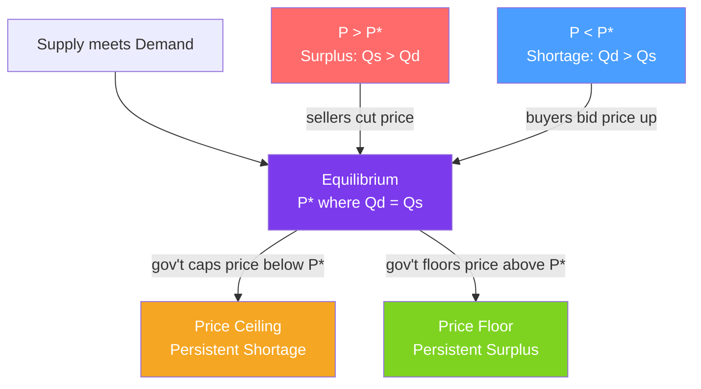

# ⚖️ Market Equilibrium

> [!abstract] TL;DR
> **Market equilibrium** is the price-quantity pair at which quantity demanded equals quantity supplied ($Q_D = Q_S$) — the market "clears" with no unsatisfied buyers or sellers. Above equilibrium, a **surplus** drives prices down; below it, a **shortage** drives prices up. **Price ceilings** and **price floors** are government interventions that prevent this self-correction, creating persistent shortages or surpluses.

## Intuition — analogy FIRST

Imagine a water basin with two pipes — one filling (supply) and one draining (demand). Equilibrium is when the water level holds steady. If you add more water (supply increases), the level rises temporarily, but the drain responds — the basin finds a new level. 

Now imagine the government caps the water level at an artificially low point (price ceiling). The filling pipe is still trying to add water, but the cap forces excess to spill out unused — that spill is the **surplus** or **shortage** created by the artificial constraint. The basin never finds its natural equilibrium.

Markets work the same way: prices are signals that route resources. Interfere with the signal, and the system malfunctions.

---

## How It Works

## Key Concepts / Details

### Finding Equilibrium Algebraically

Set quantity demanded equal to quantity supplied and solve for price:

$$Q_D = Q_S$$
$$a - bP = c + dP$$
$$a - c = (b + d)P$$
$$P^* = \frac{a - c}{b + d}$$

Then substitute back to find equilibrium quantity:
$$Q^* = a - b \cdot P^* = c + d \cdot P^*$$

**Example**: $Q_D = 100 - 2P$ and $Q_S = 20 + 4P$
$$100 - 2P = 20 + 4P \implies 80 = 6P \implies P^* = 13.33$$
$$Q^* = 100 - 2(13.33) = 73.33$$

### Surplus and Shortage

| Situation | Condition | Market Pressure | Direction |
|-----------|-----------|----------------|-----------|
| **Excess supply (surplus)** | $Q_S > Q_D$ at current price | Unsold inventory → sellers reduce price | Price falls |
| **Excess demand (shortage)** | $Q_D > Q_S$ at current price | Frustrated buyers → bid price up | Price rises |
| **Equilibrium** | $Q_D = Q_S$ | No pressure | Price stable |

### Walrasian vs Marshallian Stability

Two ways to think about how markets reach equilibrium:

**Walrasian (price adjustment)**: At any price above equilibrium, there is excess supply → price falls. At any price below, excess demand → price rises. The market converges to equilibrium by adjusting prices.

**Marshallian (quantity adjustment)**: At any quantity below equilibrium, the demand price exceeds the supply price (buyers are willing to pay more than sellers require) → producers expand output. At quantity above equilibrium, the reverse.

Both mechanisms predict the same equilibrium; they differ in whether price or quantity does the adjusting.

### Price Controls

**Price Ceiling** (maximum legal price, set below equilibrium $P_{ceil} < P^*$):
- Creates a **persistent shortage**: $Q_D(P_{ceil}) > Q_S(P_{ceil})$
- Non-price rationing emerges: queuing, lottery, discrimination, black markets
- Examples: rent control, gasoline price caps during oil shocks, pharmaceutical price ceilings

**Price Floor** (minimum legal price, set above equilibrium $P_{floor} > P^*$):
- Creates a **persistent surplus**: $Q_S(P_{floor}) > Q_D(P_{floor})$
- Examples: minimum wage (surplus of labor = unemployment), EU agricultural price supports (butter mountains), airline fare floors

| Policy | Price Level | Effect | Non-price consequence |
|--------|------------|--------|----------------------|
| Price ceiling | Below $P^*$ | Persistent shortage | Queuing, black markets, under-maintenance (rent control) |
| Price floor | Above $P^*$ | Persistent surplus | Unsold inventory, unemployment, government purchases |

### Multi-Market Equilibrium

In reality, markets are interconnected. A shock in one market ripples through related markets:

- **Substitutes**: if the price of butter rises, demand for margarine shifts right → margarine price rises.
- **Complements**: if car prices rise, demand for gasoline shifts left → gasoline price falls.
- **Input markets**: if steel prices rise (supply shifts left), car production falls, car prices rise.

General equilibrium (finding all prices simultaneously) is the subject of advanced theory. Partial equilibrium (analyzing one market in isolation) is the standard workhorse tool.

### Quantity Tax vs Lump-Sum Tax

A **per-unit tax** $t$ creates a wedge: $P_B = P_S + t$. The new equilibrium satisfies:
$$Q_D(P_S + t) = Q_S(P_S)$$

The **deadweight loss** (welfare lost due to the tax-induced reduction in trade) equals:
$$DWL = \frac{1}{2} \cdot t \cdot \Delta Q$$
where $\Delta Q = Q^* - Q_{tax}$ is the reduction in quantity traded.

---

## Real-World Notes

- **New York City rent control**: Units under rent stabilization experience a shortage of rental housing — the quantity supplied (landlords converting units to condos, letting them decay, or declining to build new supply) falls while quantity demanded exceeds it. The beneficiaries are current tenants; the losers are new entrants to the city.
- **COVID-19 PPE shortage (2020)**: Governments imposed price controls on masks and sanitizers. At the controlled price, shortages persisted. When some markets were decontrolled, prices spiked briefly before supply expanded to meet demand.
- **Minimum wage debate**: The standard model predicts unemployment from a binding minimum wage. Empirical research (Card & Krueger 1994) found minimal employment effects in some cases — suggesting monopsony power in low-wage labor markets, which changes the equilibrium analysis.
- **Crypto and equilibrium**: Cryptocurrency markets provide real-time data on price adjustment without central intervention. Flash crashes and rapid recoveries are Walrasian adjustment happening in milliseconds.

---

## Common Pitfalls

- **Assuming equilibrium is always efficient.** Competitive equilibrium maximizes total surplus, but only under strong conditions (no externalities, no public goods, no market power). See [[Market_Failures]].
- **Confusing a surplus with excess supply.** "Surplus" in everyday speech means "extra of something good." In economics, a surplus is a disequilibrium condition where supply exceeds demand at the current price.
- **Ignoring dynamic adjustment.** Equilibrium is a *tendency*, not a permanent state. Markets are always adjusting toward equilibrium; they rarely sit exactly on it.
- **Applying static equilibrium to inherently dynamic situations.** Housing markets take years to equilibrate because supply is very slow to expand. Treating them as if they clear instantly leads to bad policy predictions.

---

## Related Concepts

- [[_MOC_Foundations|↑ Section MOC]]
- [[Supply_and_Demand]] — The curves whose intersection defines equilibrium.
- [[Elasticity]] — Determines how much $P^*$ and $Q^*$ change after a shock.
- [[Comparative_Statics]] — How to predict the new equilibrium after a shift.
- [[Consumer_and_Producer_Surplus]] — The welfare measure computed from the equilibrium.
- [[Market_Failures]] — Conditions under which the competitive equilibrium is not efficient.
- [[Perfect_Competition]] — The market structure in which competitive equilibrium holds most cleanly.

---

## Review Questions

1. The demand for apartments in a city is $Q_D = 200 - 10P$ and supply is $Q_S = 20 + 6P$ (in thousands of units, price in $/month). Find equilibrium price and quantity. If the city imposes a rent ceiling of $9, how large is the shortage?
2. A price floor is set above the equilibrium price in the wheat market. Show graphically and describe: (a) what quantity farmers produce, (b) what quantity consumers buy, (c) what happens to the unsold wheat.
3. Why might rent control benefit existing tenants in the short run but hurt them — and all renters — in the long run? Use the supply elasticity concept from [[Elasticity]].

---

## Sources

- Varian, *Intermediate Microeconomics*, Ch. 1–2, 16
- Mankiw, *Principles of Economics*, Ch. 4, 6
- Card & Krueger (1994), "Minimum Wages and Employment," *American Economic Review*

#microeconomics #economics #foundations #equilibrium #pricecontrols #marketclearing
