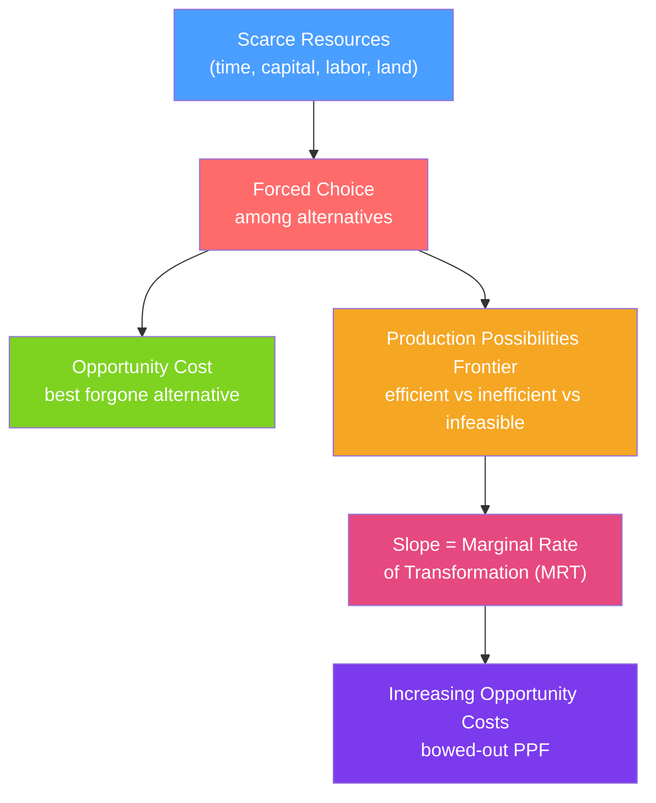

# 🌍 Scarcity and Opportunity Cost

> [!abstract] TL;DR
> **Scarcity** means that resources are limited relative to unlimited wants — every economy must choose what to produce, how to produce it, and for whom. The **opportunity cost** of any choice is the value of the best alternative foregone. The **Production Possibilities Frontier (PPF)** maps all efficient output combinations and shows that producing more of one good requires sacrificing some of another.

## Intuition — analogy FIRST

Imagine you have a single Sunday afternoon. You can study for your economics exam, go to the gym, or meet a friend for coffee. You can only do one — or at most one after another. The moment you choose "study," you have given up the gym and the coffee chat. The most valuable thing you gave up (say, the gym, which you really needed) is your **opportunity cost**.

This is the entire logic of microeconomics in miniature. Resources — time, money, land, raw materials — are scarce. Choices are forced. The cost of any action is measured not in dollars paid, but in what you had to give up.

Societies face the same constraint scaled up. A country that deploys its steel workers to build tanks cannot use them to build hospitals. The PPF draws the boundary of what is possible.

---

## How It Works

## Key Concepts / Details

### Scarcity and the Three Economic Questions

Every economy must answer three questions:
1. **What to produce?** — Guns or butter? Consumer goods or capital goods?
2. **How to produce it?** — Labor-intensive or capital-intensive methods?
3. **For whom?** — Who gets the output?

Markets answer these questions through prices. The price system is an information and incentive mechanism that coordinates billions of individual decisions without central direction.

### Opportunity Cost

> **Opportunity cost** = value of the best alternative forgone

Key properties:
- It is **subjective** — it depends on your next-best option, which varies by person.
- It includes **implicit costs** — the foregone salary of an entrepreneur who starts a company is a cost even if no cash changes hands.
- It is **forward-looking** — sunk costs (already spent, unrecoverable) are *not* opportunity costs.

**Formula for a simple two-good case:**
$$OC_X = \frac{\Delta Y}{\Delta X}$$
where $\Delta Y$ is the units of good $Y$ you must sacrifice to produce one more unit of good $X$.

### The Production Possibilities Frontier (PPF)

The PPF shows all combinations of two goods that an economy can produce using all resources efficiently.

| Point | Description |
|-------|-------------|
| **On the PPF** | Productively efficient — no waste |
| **Inside the PPF** | Inefficient — resources are idle or misallocated |
| **Outside the PPF** | Currently infeasible — beyond current productive capacity |

**Shape of the PPF:**
- **Straight line**: constant opportunity cost — resources are equally productive in both uses (unlikely in reality).
- **Bowed outward (concave to origin)**: increasing opportunity cost — as you produce more of X, each additional unit costs more Y, because resources are not perfectly adaptable. This is the realistic case.

**The slope of the PPF** at any point is the **Marginal Rate of Transformation (MRT)**:
$$MRT_{XY} = -\frac{dY}{dX} = \frac{MC_X}{MC_Y}$$

### Absolute vs Comparative Advantage

| Concept | Definition | Implication |
|---------|-----------|-------------|
| **Absolute advantage** | Produce more output per unit of input than another agent | A country *can* produce more |
| **Comparative advantage** | Lower opportunity cost of production than another agent | A country *should* specialize here |

**Ricardo's insight**: even if one country has an absolute advantage in *everything*, both countries benefit from trade if each specializes in goods where it has a comparative advantage. This is the theoretical foundation of international trade.

**Example**: If the US can produce either 100 computers or 50 cars per hour, and Mexico can produce either 20 computers or 15 cars per hour:
- US opportunity cost of a computer: 50/100 = 0.5 cars → US has comparative advantage in computers
- Mexico opportunity cost of a car: 20/15 ≈ 1.33 computers → Mexico has comparative advantage in cars

### PPF Shifts

The PPF shifts **outward** (economic growth) when:
- Technology improves
- The labor force grows or becomes more skilled
- Capital stock increases
- New natural resources are discovered

The PPF shifts **inward** due to:
- Natural disasters, wars destroying capital
- Emigration of skilled workers

---

## Real-World Notes

- **Time allocation**: Every person faces a time PPF. The "hustle culture" debate is really about opportunity cost — the cost of working 80-hour weeks is the health, relationships, and leisure forgone.
- **Government budget**: Defense spending vs. social programs is a classic PPF trade-off. During COVID-19, health capacity was a binding constraint — the PPF concept explains why elective surgeries were cancelled.
- **Climate policy**: Reducing carbon emissions (moving along an environment-output PPF) imposes opportunity costs on current consumption; the question is whether future benefits exceed those costs.
- **Sunk cost fallacy**: Continuing a failed project "because we've already invested so much" ignores that the money is gone regardless — only future opportunity costs matter.

---

## Common Pitfalls

- **Confusing sunk costs with opportunity costs.** The $10 movie ticket you already paid is irrelevant to whether you leave mid-film. Only the opportunity cost of the next 90 minutes matters.
- **Ignoring implicit costs.** A student who works for free in a family business foregoes a market salary — that is a real economic cost.
- **Assuming a linear PPF.** Most real-world PPFs are bowed out because resources have specialized uses. A straight PPF is a simplifying assumption, not the general case.
- **Equating "free" with "zero opportunity cost."** A "free" park takes up land that could have been used for housing. The opportunity cost is real even without a price.

---

## Related Concepts

- [[_MOC_Foundations|↑ Section MOC]]
- [[Supply_and_Demand]] — Supply curves embed opportunity cost: firms supply more only when the price exceeds their opportunity cost of production.
- [[Consumer_Optimization]] — Consumers maximize utility subject to a budget constraint that encodes opportunity costs.
- [[Comparative_Statics]] — PPF analysis of policy changes is a form of comparative statics.
- [[Market_Failures]] — When markets fail to account for opportunity costs (externalities), resources are misallocated.

---

## Review Questions

1. A law school graduate with $150k in student debt chooses to open a restaurant instead of practicing law. What is her opportunity cost? Does the student debt affect it?
2. Country A can produce 100 widgets or 50 gadgets per worker. Country B can produce 40 widgets or 30 gadgets per worker. Which country has a comparative advantage in each good? Should they trade?
3. An economy's PPF is bowed outward. If it is currently producing at a point on the PPF and wants to produce more guns, what happens to the opportunity cost per unit of additional guns as gun production increases?

---

## Sources

- Varian, *Intermediate Microeconomics*, Ch. 1
- Mankiw, *Principles of Economics*, Ch. 1–3
- Ricardo, *Principles of Political Economy* (comparative advantage)

#microeconomics #economics #foundations #scarcity #opportunitycost #PPF
