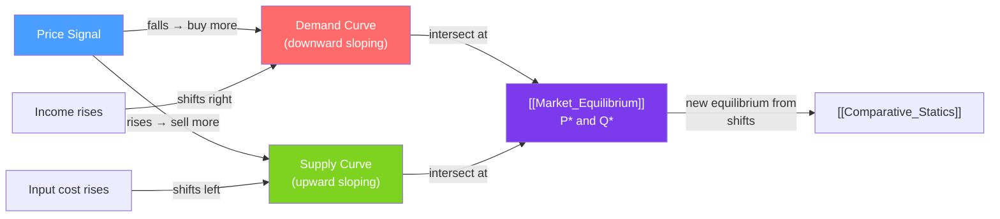

# 📈 Supply and Demand

> [!abstract] TL;DR
> **Demand** is the relationship between price and quantity buyers are willing and able to purchase, holding everything else constant — it slopes downward. **Supply** is the relationship between price and quantity sellers are willing to offer — it slopes upward. Together they form the most powerful analytical tool in economics, explaining how prices emerge spontaneously from decentralized decisions.

## Intuition — analogy FIRST

Imagine a farmers' market. Buyers show up wanting apples. As the price rises, some buyers decide they'd rather have oranges — **less is demanded at higher prices**. Meanwhile, as prices rise, farmers are willing to drive longer distances and bring more apples — **more is supplied at higher prices**. The auctioneer calls out prices until the number of apples buyers want exactly matches the number sellers bring. That price is the equilibrium.

No coordinator required. No planning office. Just thousands of self-interested agents responding to price signals — and the market clears.

---

## How It Works

## Key Concepts / Details

### The Demand Curve

The demand curve shows the **maximum price** buyers are willing to pay for each quantity (or equivalently, the quantity demanded at each price), *ceteris paribus* (all else equal).

**Law of Demand**: As price rises, quantity demanded falls (and vice versa). Caused by:
1. **Substitution effect** — the good becomes relatively more expensive than substitutes.
2. **Income effect** — the buyer's real purchasing power falls.

**Demand function (linear)**:
$$Q_D = a - bP$$
where $a > 0$ is the intercept (demand at zero price) and $b > 0$ is the slope (responsiveness).

**Inverse demand** (price as a function of quantity):
$$P = \frac{a}{b} - \frac{1}{b}Q_D$$

### Determinants of Demand (Demand Shifters)

A **change in price** causes movement **along** the demand curve.
A **change in any other factor** causes the entire curve to **shift**.

| Shifter | Effect on Demand |
|---------|-----------------|
| Income rises (normal good) | Shifts right (more demanded at every price) |
| Income rises (inferior good) | Shifts left (less demanded at every price) |
| Price of substitute rises | Shifts right |
| Price of complement rises | Shifts left |
| Consumer preferences increase | Shifts right |
| Expected future price rises | Shifts right today |
| Number of buyers increases | Shifts right |

### The Supply Curve

The supply curve shows the **minimum price** sellers require to supply each unit (or equivalently, quantity supplied at each price).

**Law of Supply**: As price rises, quantity supplied rises. This is because higher prices make it worthwhile to incur higher marginal costs.

**Supply function (linear)**:
$$Q_S = c + dP$$
where $c$ can be negative (the minimum price needed before any is supplied) and $d > 0$.

### Determinants of Supply (Supply Shifters)

| Shifter | Effect on Supply |
|---------|-----------------|
| Input costs fall | Shifts right |
| Technology improves | Shifts right |
| Number of sellers increases | Shifts right |
| Taxes on production rise | Shifts left |
| Expected future price rises | Shifts left today (sellers hold back) |
| Government subsidies | Shifts right |
| Favorable weather (agriculture) | Shifts right |

### Movement Along vs Shift of a Curve

This distinction is critical and frequently misapplied:

| Change | Effect |
|--------|--------|
| Price changes | Movement **along** curve — quantity changes |
| Any other determinant changes | **Shift** of the entire curve |

> [!warning] Common Error
> Saying "demand increased because the price fell" is wrong. A price fall causes an **increase in quantity demanded** (movement along), not an **increase in demand** (shift of the curve).

### Special Demand Curves

| Type | Shape | Example |
|------|-------|---------|
| **Perfectly inelastic** | Vertical | Insulin (no substitutes, urgent need) |
| **Perfectly elastic** | Horizontal | Commodity in perfectly competitive market |
| **Giffen good** | Upward sloping | Historically: staple foods in extreme poverty |
| **Veblen good** | Upward sloping over range | Luxury goods where price signals status |

---

## Real-World Notes

- **Uber surge pricing**: When demand for rides spikes (concerts, rain), Uber's algorithm raises prices. This moves suppliers (drivers) along their supply curve — more drivers come online — while reducing the quantity demanded. Equilibrium is restored quickly without a planner.
- **COVID-19 toilet paper**: A fear-driven demand shift (not a price change) caused a rightward shift in demand. Prices were price-controlled (by stores), creating shortage. Normal supply-and-demand would have raised prices to clear the market.
- **Gasoline and crude oil prices**: Crude oil is the primary input for gasoline. When crude prices rise, the supply curve for gasoline shifts left (higher costs), raising pump prices — this is a supply shifter, not a demand change.
- **Amazon Prime membership**: Amazon uses bundling to shift the demand curve for individual items rightward — Prime members buy more because the marginal cost of shipping is zero.

---

## Common Pitfalls

- **Confusing "demand" with "quantity demanded."** Demand is the whole curve; quantity demanded is a single point on it.
- **Saying "supply and demand both increased" without specifying which shifted.** Always specify whether demand, supply, or both shifted and in which direction.
- **Ignoring the ceteris paribus assumption.** The demand curve shows the price-quantity relationship *only if* nothing else changes. When you're analyzing the real world, multiple things change simultaneously — this requires [[Comparative_Statics]].
- **Assuming supply always responds to price in the short run.** In the very short run (market period), supply can be completely fixed — think of perishable produce at the end of market day.

---

## Related Concepts

- [[_MOC_Foundations|↑ Section MOC]]
- [[Market_Equilibrium]] — Where the supply and demand curves intersect.
- [[Elasticity]] — How to measure the steepness of the curves quantitatively.
- [[Comparative_Statics]] — How equilibrium changes when curves shift.
- [[Consumer_Optimization]] — The theoretical foundation of the demand curve.
- [[Profit_Maximization]] — The theoretical foundation of the supply curve.
- [[Consumer_and_Producer_Surplus]] — The welfare areas under/above the curves.

---

## Review Questions

1. The government imposes a minimum wage above the current market wage. Using supply and demand for labor, show what happens to employment. Is there a surplus or shortage of labor?
2. Both incomes rise (making cars a normal good) and the price of steel rises simultaneously. What can you say definitively about the new equilibrium price? What about quantity?
3. Draw and label a demand curve for coffee. Then show and label three different types of shifts: (a) the price of tea rises, (b) consumer income falls (coffee is a normal good), (c) a health study finds coffee prevents cancer.

---

## Sources

- Varian, *Intermediate Microeconomics*, Ch. 1–2
- Mankiw, *Principles of Economics*, Ch. 3–4
- Marshall, *Principles of Economics* (original supply-demand framework)

#microeconomics #economics #foundations #supplydemand #demandcurve #supplycurve
