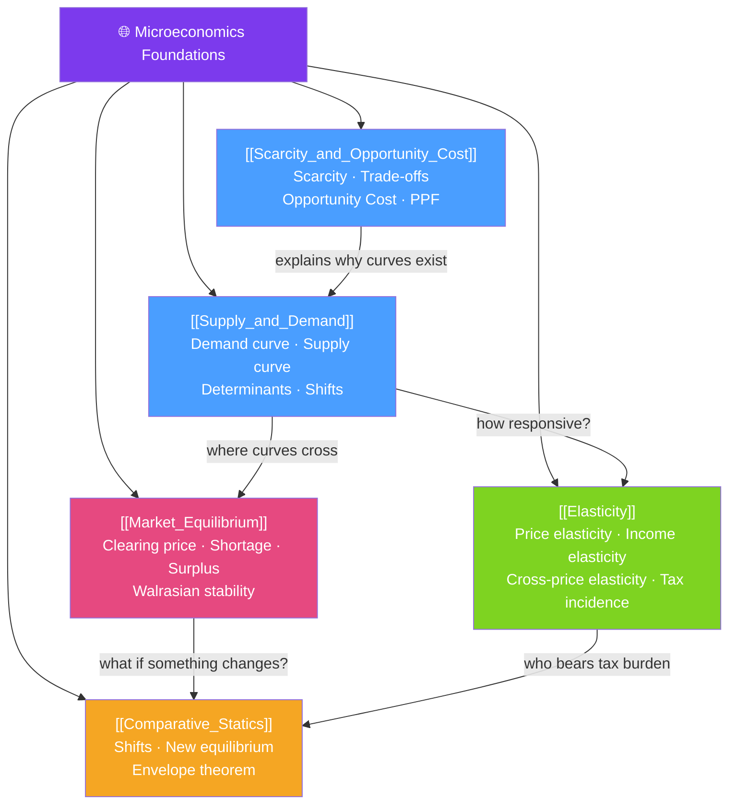

# 🗺️ Foundations — Map of Content

> [!abstract] What This Section Covers
> This section is the bedrock of all microeconomic reasoning. It answers the most fundamental questions: why do people and societies face **scarcity** and what it forces us to choose (opportunity cost), how **supply and demand** interact to allocate resources, how **sensitive** quantity is to price changes (elasticity), how **prices settle** at equilibrium, and how equilibrium changes when conditions shift (**comparative statics**). These five ideas appear in every subsequent section — a weak foundation here makes the rest of the vault much harder.

## Concept Map

## Learning Path

1. [[Scarcity_and_Opportunity_Cost]] — Why every choice has a cost, the PPF, and why trade creates value.
2. [[Supply_and_Demand]] — The two forces that determine prices in competitive markets.
3. [[Elasticity]] — How to quantify how much buyers and sellers respond to price changes.
4. [[Market_Equilibrium]] — How supply and demand find a clearing price and what prevents it.
5. [[Comparative_Statics]] — How to predict where a new equilibrium lands after a shock.

## All Notes at a Glance

| Note | Difficulty | What You'll Learn |
|------|------------|-------------------|
| [[Scarcity_and_Opportunity_Cost]] | Beginner | Scarcity, trade-offs, opportunity cost, PPF, absolute vs comparative advantage |
| [[Supply_and_Demand]] | Beginner | Demand and supply curves, determinants of each, law of demand, ceteris paribus |
| [[Elasticity]] | Beginner | PED formula, arc vs point elasticity, income and cross-price elasticity, tax incidence |
| [[Market_Equilibrium]] | Beginner | Clearing price, excess supply/demand, stability, price controls (floors/ceilings) |
| [[Comparative_Statics]] | Intermediate | Shift analysis, simultaneous shifts, envelope theorem, policy experiments |

## Key Questions This Section Answers

- Why can't we have everything we want, and what determines the cost of a choice?
- What causes a demand curve to slope downward and a supply curve to slope upward?
- If the price of coffee rises 10%, by how much does quantity demanded fall?
- What is the difference between a movement along a curve and a shift of a curve?
- Who really pays a sales tax — buyers or sellers — and why?
- How do we find the equilibrium price and quantity in a market?
- If supply increases and demand falls simultaneously, what happens to price and quantity?

## Related Sections

- [[_MOC_Microeconomics_Master|↑ Microeconomics Master MOC]]
- [[_MOC_Consumer_Theory|→ Consumer Theory]]
- [[_MOC_Producer_Theory|→ Producer Theory]]
- [[_MOC_Welfare_Externalities|→ Welfare & Externalities]]

#MOC #microeconomics #foundations
