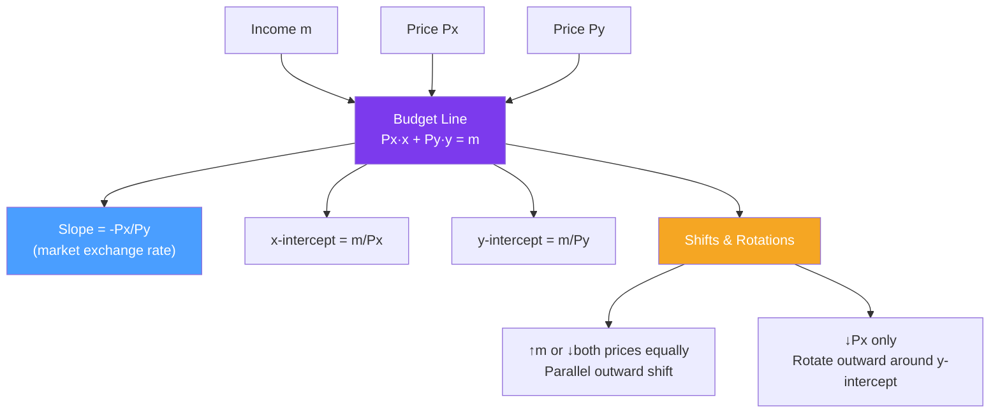

# 💰 Budget Constraint

> [!abstract] TL;DR
> The **budget constraint** specifies all bundles the consumer can afford: $P_x x + P_y y \leq m$. The **budget line** ($P_x x + P_y y = m$) is the boundary — it has slope $-P_x/P_y$ and intercepts $m/P_x$ and $m/P_y$. An income increase shifts the line outward in parallel; a price decrease for $x$ rotates it outward around the $y$-intercept. The slope reflects the **market's rate of exchange** between goods.

## Intuition — analogy FIRST

The budget constraint is simply your wallet. If you have $100 and coffee costs $5 while books cost $20, you could buy 20 coffees and zero books, or zero coffees and 5 books, or any combination in between. The budget line connects these extremes — it's every combination that spends exactly $100.

The slope of that line ($-5/20 = -0.25$) tells you the **market's exchange rate**: to get one more book, you give up exactly 4 coffees. Compare this to your personal exchange rate (the MRS from indifference curves) — wherever they differ, you can reallocate to gain utility.

---

## How It Works

## Key Concepts / Details

### The Budget Constraint Equation

$$P_x \cdot x + P_y \cdot y \leq m$$

- **Budget line** (equality): $P_x x + P_y y = m$ — bundles that exhaust income exactly.
- **Budget set** (inequality): all bundles that are affordable.
- **Exterior**: unaffordable bundles.

**Solving for $y$:**
$$y = \frac{m}{P_y} - \frac{P_x}{P_y} x$$

This is the budget line in slope-intercept form:
- **y-intercept**: $m/P_y$ — amount of $y$ if all income spent on $y$.
- **x-intercept**: $m/P_x$ — amount of $x$ if all income spent on $x$.
- **Slope**: $-P_x/P_y$ — the opportunity cost of $x$ in terms of $y$.

### Interpreting the Slope

$$\text{Slope} = -\frac{P_x}{P_y}$$

This is the **market rate of exchange**: to consume one more unit of $x$, you must give up $P_x/P_y$ units of $y$. 

- If $P_x/P_y = 2$: getting one more $x$ costs 2 units of $y$.
- This is the market's exchange rate; the consumer's personal exchange rate is the MRS.
- At the optimum, these two rates are equal: $MRS = P_x/P_y$.

### Shifts and Rotations of the Budget Line

| Change | Effect on Budget Line |
|--------|----------------------|
| Income rises ($m \uparrow$) | Parallel outward shift — both intercepts rise proportionally |
| Income falls ($m \downarrow$) | Parallel inward shift |
| $P_x$ falls | Outward rotation — x-intercept rises, y-intercept unchanged |
| $P_x$ rises | Inward rotation — x-intercept falls, y-intercept unchanged |
| Both prices fall proportionally | Equivalent to income increase — parallel outward shift |
| Lump-sum transfer | Parallel outward shift (same as income rise) |
| Subsidy on $x$ | Same as $P_x$ fall — outward rotation |

### Kinked and Nonlinear Budget Lines

Real-world budget constraints are often nonlinear:

**Quantity discount**: If the first 10 units cost $5 each and subsequent units cost $3 each, the budget line has a kink at $x = 10$ — it becomes steeper for the first 10 units and flatter beyond.

**Rationing**: If the consumer is limited to at most $\bar{x}$ units of $x$ regardless of income, the budget line becomes a vertical segment at $x = \bar{x}$.

**In-kind transfer**: A food stamp that provides a fixed quantity of food $\bar{x}_F$ adds a horizontal segment to the budget constraint (you can have $\bar{x}_F$ for free, plus any combination of income-purchased bundles).

**Income tax with brackets**: Creates a kinked budget line between consumption (after-tax income) and leisure.

### Relative Prices and Inflation

If all prices and income double simultaneously:
- New budget line: $2P_x x + 2P_y y = 2m$
- Simplifies to: $P_x x + P_y y = m$ — **identical to the original**
- Conclusion: only **relative prices** ($P_x/P_y$) and **real income** ($m/P_y$) matter.

This is the foundation of the **homogeneity of degree zero** in demand functions — demand doesn't change if all prices and income scale proportionally.

### Multiple Goods

With $n$ goods, the budget constraint is:
$$\sum_{i=1}^{n} P_i x_i \leq m$$

The budget set is a hyperplane in $n$-dimensional space. The analysis extends naturally.

---

## Real-World Notes

- **Student budget allocation**: A student allocating $1,000/month between rent ($800) and food/entertainment ($200) faces a budget line that is nearly all corner — most income is "locked up" in housing, leaving little room to trade off. Price changes in rent have massive welfare effects.
- **SNAP (food stamps)**: SNAP provides a non-cash food subsidy, creating an in-kind transfer. If a recipient would have bought more food than the SNAP amount anyway, the constraint is non-binding and SNAP is equivalent to cash. If they would have bought less, SNAP restricts their choice set.
- **Carbon tax and income rebate**: A carbon tax raises the price of carbon-intensive goods (shifts the budget line's slope against those goods). A rebated carbon dividend restores real income but maintains the price signal — this is the policy design intent.
- **Two-earner households**: The household budget constraint has an extra dimension — the second earner's wage shifts the income term, while the time budget constrains hours worked. The literature on labor supply uses multi-dimensional budget constraints.

---

## Common Pitfalls

- **Confusing a shift with a rotation.** An income change shifts the entire line; a price change rotates it around one axis.
- **Forgetting relative prices are what matter.** If the government announces a 50% subsidy on your good but inflation doubles all prices simultaneously, the subsidy is worth nothing — the budget line is unchanged.
- **Treating in-kind transfers as equivalent to cash.** SNAP, housing vouchers, and Medicaid restrict how the transfer is spent. If the recipient would have spent differently, this is a binding constraint — the budget set is smaller than with an equivalent cash transfer.
- **Applying budget constraint without normalizing.** In models with $n$ goods, economists normalize one price to 1 (the numeraire) to reduce dimensionality. Forgetting this creates spurious price comparisons.

---

## Related Concepts

- [[_MOC_Consumer_Theory|↑ Section MOC]]
- [[Utility_Theory]] — The objective function being maximized subject to the budget constraint.
- [[Indifference_Curves]] — The contours that the budget line is tangent to at the optimum.
- [[Consumer_Optimization]] — Combining indifference curves and budget constraint to find the optimum.
- [[Scarcity_and_Opportunity_Cost]] — The budget constraint is scarcity formalized; the slope is the opportunity cost.
- [[Income_and_Substitution_Effects]] — How the budget line shifts determine the decomposition of demand responses.

---

## Review Questions

1. A consumer has income $m = 120$, $P_x = 4$, $P_y = 6$. Write the budget line equation, find the intercepts, and compute the slope. If $P_x$ falls to $3$, draw the new budget line and describe what changed.
2. The government introduces a 20% ad valorem tax on good $x$ (not good $y$). How does this affect the budget line? Is this equivalent to an income reduction?
3. A welfare program offers each household a cash grant of $\$500$ or, alternatively, a food voucher worth $\$500$ that can only be used for food. Under what conditions would a household prefer the cash grant? Draw the budget constraints for both options.

---

## Sources

- Varian, *Intermediate Microeconomics*, Ch. 2
- Mas-Colell, Whinston & Green, *Microeconomic Theory*, Ch. 2
- Deaton & Muellbauer, *Economics and Consumer Behavior*, Ch. 1

#microeconomics #economics #consumer-theory #budgetconstraint #budgetline #affordability
