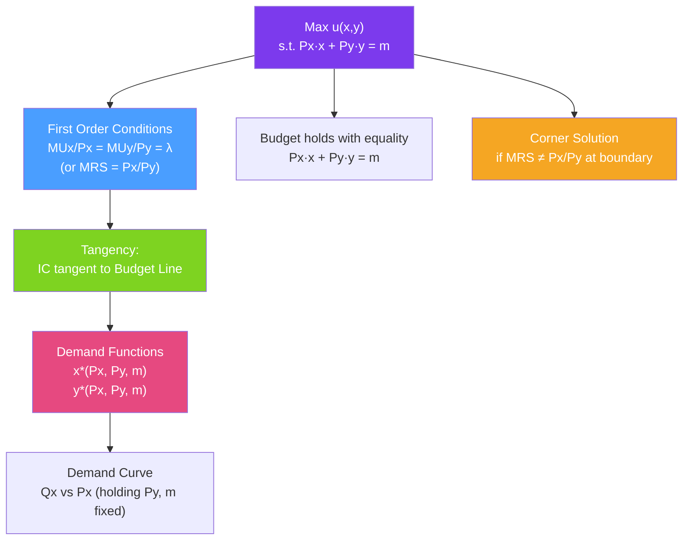

# 🎯 Consumer Optimization

> [!abstract] TL;DR
> The consumer maximizes utility $u(x, y)$ subject to budget constraint $P_x x + P_y y = m$. At an **interior optimum**, the **tangency condition** $MRS_{xy} = P_x/P_y$ holds — the consumer's personal exchange rate equals the market's rate. Using a Lagrangian, this gives $MU_x/P_x = MU_y/P_y = \lambda$. Solving the two equations (tangency + budget) yields **demand functions** $x^*(P_x, P_y, m)$ and $y^*(P_x, P_y, m)$.

## Intuition — analogy FIRST

You're shopping with a fixed budget and trying to maximize your satisfaction. The store sets exchange rates (prices). You have personal exchange rates (how much one good is worth to you in terms of another). 

If the store says "1 coffee = 2 teas" (by price) but you personally only value coffee at 1.5 teas (your MRS), you're overpaying for coffee — buy less coffee, more tea. You keep reallocating until your personal exchange rate exactly matches the market's. That's the optimum: you can't do better by shifting spending.

---

## How It Works

## Key Concepts / Details

### The Optimization Problem

$$\max_{x,y} u(x,y) \quad \text{subject to} \quad P_x x + P_y y = m, \quad x \geq 0, \quad y \geq 0$$

**Lagrangian method**:
$$\mathcal{L} = u(x,y) + \lambda(m - P_x x - P_y y)$$

First-order conditions (FOCs):
$$\frac{\partial \mathcal{L}}{\partial x} = MU_x - \lambda P_x = 0 \implies MU_x = \lambda P_x$$
$$\frac{\partial \mathcal{L}}{\partial y} = MU_y - \lambda P_y = 0 \implies MU_y = \lambda P_y$$
$$\frac{\partial \mathcal{L}}{\partial \lambda} = m - P_x x - P_y y = 0 \implies \text{budget binds}$$

Dividing the first two FOCs:
$$\frac{MU_x}{MU_y} = \frac{P_x}{P_y} \implies MRS_{xy} = \frac{P_x}{P_y}$$

The **Lagrange multiplier $\lambda$** = marginal utility of income:
$$\lambda = \frac{MU_x}{P_x} = \frac{MU_y}{P_y} = \frac{\partial V^*}{\partial m}$$

### Deriving Demand: Cobb-Douglas Example

For $u(x,y) = x^\alpha y^\beta$:

FOCs:
$$\frac{\alpha u / x}{P_x} = \frac{\beta u / y}{P_y} \implies \frac{\alpha}{x P_x} = \frac{\beta}{y P_y} \implies y P_y = \frac{\beta}{\alpha} x P_x$$

Substituting into budget $P_x x + P_y y = m$:
$$P_x x + \frac{\beta}{\alpha} P_x x = m \implies x\left(\frac{\alpha + \beta}{\alpha}\right)P_x = m$$
$$x^*(P_x, P_y, m) = \frac{\alpha}{\alpha + \beta} \cdot \frac{m}{P_x}$$
$$y^*(P_x, P_y, m) = \frac{\beta}{\alpha + \beta} \cdot \frac{m}{P_y}$$

**Key property of Cobb-Douglas demand**: the consumer spends a **constant fraction** of income on each good — shares $\alpha/(\alpha+\beta)$ on $x$ and $\beta/(\alpha+\beta)$ on $y$ — regardless of prices!

### Properties of Demand Functions

**Homogeneity of degree zero**: $x^*(tP_x, tP_y, tm) = x^*(P_x, P_y, m)$ for all $t > 0$. Doubling all prices and income leaves demand unchanged (only relative prices and real income matter).

**Walras' Law**: $P_x x^* + P_y y^* = m$ — the consumer always spends all income at the optimum.

**Adding-up restriction**: $\sum_i P_i x_i^* = m$ — consistent with Walras' Law.

**Engel aggregation**: $\sum_i w_i \varepsilon_{im} = 1$ where $w_i = P_i x_i / m$ are budget shares and $\varepsilon_{im}$ are income elasticities. Budget shares weighted by income elasticities sum to 1.

### Corner Solutions

When the tangency condition cannot be satisfied at interior points, the optimum is at a **corner** of the budget set — the consumer spends all income on one good.

**When does a corner occur?**
- For perfect substitutes: if $P_x/P_y < a/b$ (market rate < subjective MRS), buy only $x$.
- For any utility function: if the MRS at the corner exceeds the price ratio, the consumer is at a corner — moving away from it would reduce utility.

**Kuhn-Tucker conditions** (for non-negative consumption):
$$MU_x - \lambda P_x \leq 0, \quad x(MU_x - \lambda P_x) = 0$$
$$MU_y - \lambda P_y \leq 0, \quad y(MU_y - \lambda P_y) = 0$$

If $x > 0$: $MU_x = \lambda P_x$ (interior in $x$).
If $x = 0$: $MU_x \leq \lambda P_x$ (corner in $x$ — marginal utility of $x$ doesn't justify its price).

### The Indirect Utility Function

Substituting demand functions back into the utility function gives the **indirect utility function** $V(P_x, P_y, m)$ — maximum utility achievable given prices and income:

$$V(P_x, P_y, m) = u(x^*, y^*)$$

For Cobb-Douglas: $V = A \cdot m^{\alpha+\beta} / (P_x^\alpha P_y^\beta)$ where $A$ is a constant.

**Roy's identity** (another envelope result): demand functions can be recovered from the indirect utility function:
$$x^*(P_x, P_y, m) = -\frac{\partial V / \partial P_x}{\partial V / \partial m}$$

---

## Real-World Notes

- **Rationality in behavioral economics**: Consumer optimization assumes rational choice — consistent preferences, full information. Behavioral economists (Thaler, Sunstein) document systematic deviations: present bias (over-weighting immediate gratification), framing effects (equivalent choices framed differently yield different decisions), and reference dependence. "Nudges" exploit these to steer choices.
- **Tax-advantaged accounts (401k)**: These effectively lower $P_x$ for retirement savings. The tangency condition predicts a rotation of the budget line and more savings. Evidence confirms this — matching contributions are especially effective.
- **Bundle pricing (software)**: Microsoft 365 bundles Word, Excel, PowerPoint. Users with high utility for all three face a lower effective price per component than buying separately — the bundle exploits the consumer's optimization by moving the optimal bundle higher on the utility surface.
- **Revealed preference testing**: Economists use shopping data to test whether consumer choices are consistent with utility maximization (GARP — generalized axiom of revealed preference). Violations suggest non-rational behavior or measurement error.

---

## Common Pitfalls

- **Forgetting to check the second-order condition.** The tangency $MRS = P_x/P_y$ is necessary but not sufficient for a maximum. With non-convex preferences, a tangency can be a utility *minimum*.
- **Ignoring corner solutions.** Students often assume an interior solution exists. For perfect substitutes, the optimum is always a corner. Check whether the MRS at the boundary satisfies the relevant inequality.
- **Solving the Lagrangian without substituting back into the budget constraint.** The FOCs give ratios; you need the budget constraint to pin down the actual quantities.
- **Confusing the demand function with the demand curve.** The demand function $x^*(P_x, P_y, m)$ depends on all prices and income. The demand curve plots $x^*$ vs $P_x$ holding $P_y$ and $m$ fixed.

---

## Related Concepts

- [[_MOC_Consumer_Theory|↑ Section MOC]]
- [[Utility_Theory]] — The objective function being maximized.
- [[Indifference_Curves]] — The tangency condition in geometric terms.
- [[Budget_Constraint]] — The constraint in the optimization.
- [[Income_and_Substitution_Effects]] — Comparative statics of the demand function.
- [[Profit_Maximization]] — The producer analogue of consumer optimization.

---

## Review Questions

1. A consumer maximizes $u = x^{0.5} y^{0.5}$ subject to $4x + 2y = 80$. Find the optimal bundle using the Lagrangian. What fraction of income is spent on each good?
2. For the utility function $u = \min(x, 2y)$, find the demand functions. Is there an interior tangency? Where is the optimum?
3. If a consumer's indirect utility function is $V = m^2 / (4 P_x P_y)$, use Roy's identity to derive the demand functions for $x$ and $y$.

---

## Sources

- Varian, *Intermediate Microeconomics*, Ch. 5–6
- Mas-Colell, Whinston & Green, *Microeconomic Theory*, Ch. 3
- Deaton & Muellbauer, *Economics and Consumer Behavior*, Ch. 2

#microeconomics #economics #consumer-theory #optimization #tangency #demandfunction #lagrangian
