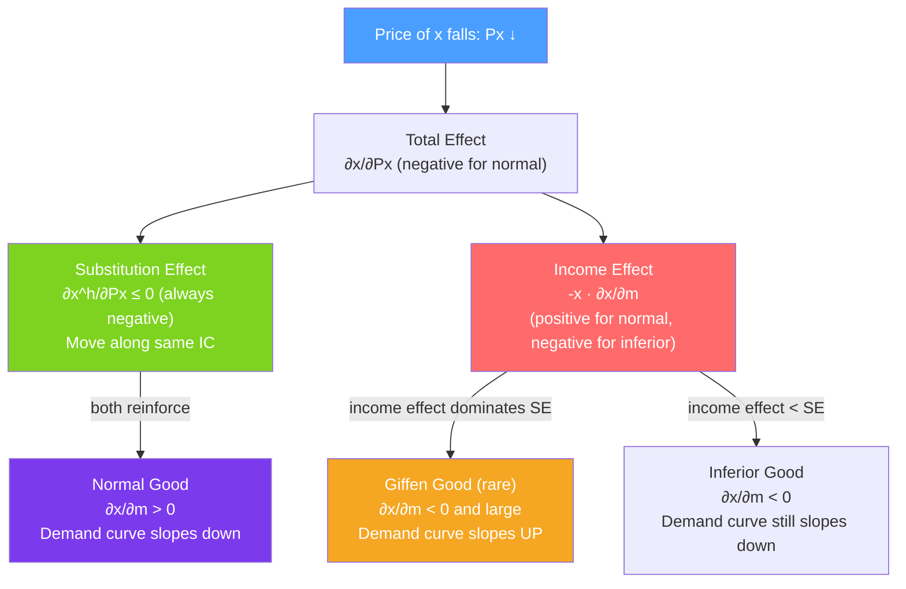

# ↕️ Income and Substitution Effects

> [!abstract] TL;DR
> When the price of a good falls, quantity demanded rises for two reasons: (1) **substitution effect** — the good is now cheaper relative to others, so substitute toward it; (2) **income effect** — real purchasing power rises, so buy more (if a normal good) or less (if inferior). The **Slutsky equation** decomposes the total price response: $\partial x / \partial P_x = \partial x^h / \partial P_x - x \cdot \partial x / \partial m$, where $x^h$ is Hicksian (compensated) demand.

## Intuition — analogy FIRST

Imagine pizza prices drop by 30%. Two things happen simultaneously:

1. **Substitution**: Pizza is now a better deal relative to pasta — even if your happiness were held constant, you'd buy more pizza and less pasta. This is the substitution effect — it's about relative prices.

2. **Income**: Your fixed paycheck now stretches further — you're effectively richer. With more "real income," you buy more of everything you like (including pizza). This is the income effect.

For a normal good, both effects go the same direction — quantity rises. For an inferior good (think ramen noodles), the income effect goes the *opposite* direction — you get richer, so you eat less ramen and more steak. If the income effect is large enough, quantity demanded can actually fall when price falls — a **Giffen good**.

---

## How It Works

## Key Concepts / Details

### Two Decomposition Methods

**Slutsky decomposition**: Hold money income constant but compensate the consumer so they can afford the original bundle at the new prices. The compensating income $\Delta m = \Delta P_x \cdot x^*$ returns the consumer to the original consumption bundle.

**Hicks decomposition**: Hold utility constant. Compensate exactly enough so the consumer remains on the original indifference curve.

| Feature | Slutsky | Hicks |
|---------|---------|-------|
| **Income compensation** | Enough to afford old bundle | Enough to reach old IC |
| **Compensation** | $\Delta m = x^* \cdot \Delta P_x$ | Exact (implicit) |
| **Computability** | Observable from data | Requires knowing utility function |
| **Theoretical purity** | Less clean | Cleaner (holds utility constant) |

In practice, the Slutsky decomposition is more commonly used because it's computationally straightforward.

### The Slutsky Equation

$$\underbrace{\frac{\partial x}{\partial P_x}}_{\text{total effect}} = \underbrace{\frac{\partial x^h}{\partial P_x}}_{\text{substitution effect}} - \underbrace{x \cdot \frac{\partial x}{\partial m}}_{\text{income effect}}$$

Where:
- $\partial x / \partial P_x$ = total (Marshallian) price effect
- $\partial x^h / \partial P_x$ = substitution effect (always $\leq 0$, by the law of compensated demand)
- $x \cdot \partial x / \partial m$ = income effect ($x > 0$; sign depends on whether good is normal or inferior)

**Matrix form (Slutsky matrix)**: For a system of $n$ goods:
$$S_{ij} = \frac{\partial x_i}{\partial P_j} + x_j \frac{\partial x_i}{\partial m}$$

The Slutsky matrix $\mathbf{S}$ is symmetric ($S_{ij} = S_{ji}$) and negative semi-definite — the own-price substitution effect is always non-positive.

### Classification of Goods

| Good type | $\partial x / \partial m$ | Price effect direction | Demand curve slope |
|-----------|--------------------------|----------------------|-------------------|
| **Normal** | $> 0$ | Downward (SE + IE both negative) | Negative |
| **Inferior** | $< 0$ | Downward (SE > IE in magnitude) | Negative |
| **Giffen** | $< 0$ | **Upward** (IE > SE in magnitude) | **Positive** |

**Giffen paradox conditions** (Jensen & Miller, 2007):
1. The good must be inferior.
2. Income effect must dominate the substitution effect.
3. The good must constitute a large share of the budget.

Historical example: Potatoes in 19th century Ireland. Theoretical confirmation: Jensen & Miller (2008) — rice in Hunan province, China.

### Cross-Price Slutsky Effects

The Slutsky equation extends to cross-price effects:
$$\frac{\partial x_i}{\partial P_j} = \frac{\partial x_i^h}{\partial P_j} - x_j \frac{\partial x_i}{\partial m}$$

- **Gross substitutes**: $\partial x_i / \partial P_j > 0$ (total cross-price effect positive).
- **Net substitutes (Hicksian)**: $\partial x_i^h / \partial P_j > 0$ (compensated cross-price effect positive).
- **Gross complements**: $\partial x_i / \partial P_j < 0$.

### Hicksian (Compensated) Demand

The Hicksian demand $x^h(P_x, P_y, \bar{u})$ minimizes expenditure while achieving utility $\bar{u}$:
$$\min P_x x + P_y y \quad \text{s.t.} \quad u(x,y) = \bar{u}$$

This is the **dual** of the utility maximization problem. The minimum expenditure is the **expenditure function** $E(P_x, P_y, \bar{u})$.

**Shephard's lemma** (consumer version):
$$x^h(P_x, P_y, \bar{u}) = \frac{\partial E}{\partial P_x}$$

The compensated demand curve is *always* downward-sloping (by the negative semi-definiteness of the Slutsky matrix).

### Engel Curves

An **Engel curve** plots the demand for a good against income, holding prices constant.

- **Normal good**: Engel curve slopes upward.
- **Inferior good**: Engel curve slopes downward (over the inferior range).
- **Luxury good** (income elasticity > 1): Engel curve steeper than the 45-degree line.
- **Necessity** (0 < income elasticity < 1): Engel curve flatter than 45-degree line.

**Engel's Law** (Ernst Engel, 1857): As income rises, the share of income spent on food falls. This is an empirical regularity confirmed across countries — food is a normal necessity with income elasticity < 1.

---

## Real-World Notes

- **Gasoline price shocks**: When gas prices spike, lower-income households (who spend a higher share of income on gas) experience a larger income effect, reducing other consumption disproportionately. Higher-income households face a smaller income effect and more easily substitute.
- **Inferior goods and recessions**: During downturns, demand for inferior goods (store-brand products, public transportation, fast food) rises as real incomes fall. The income effect dominates. Conversely, these goods' demand falls in booms — a business cycle predictor.
- **UK bus vs car**: As incomes rose in the 20th century, bus travel declined (inferior) and car travel rose (normal). The income elasticity of cars is estimated at 1.5–2.5 (luxury).
- **Jensen & Miller (2008) — Giffen goods confirmed**: In a randomized experiment in China, subsidizing staple grains (rice in Hunan, wheat noodles in Gansu) caused consumption of those staples to *fall*. The subsidy raised real income enough that households switched to preferred foods.

---

## Common Pitfalls

- **Thinking that inferior goods have upward-sloping demand curves.** Most inferior goods still obey the law of demand — the income effect is negative but smaller than the substitution effect. Only Giffen goods (a tiny minority) have upward-sloping demand.
- **Applying the income effect only to income changes.** The income effect appears with every price change — a price fall increases real income, triggering an income effect even if nominal income is unchanged.
- **Using "inferior good" as a pejorative.** An inferior good is technically defined as one with negative income elasticity — it says nothing about quality.
- **Confusing Marshallian and Hicksian demand.** Demand curves in most discussions are Marshallian (observed behavior). Welfare analysis and the Slutsky matrix use Hicksian (compensated) demand.

---

## Related Concepts

- [[_MOC_Consumer_Theory|↑ Section MOC]]
- [[Consumer_Optimization]] — The optimization problem whose comparative statics the Slutsky equation describes.
- [[Indifference_Curves]] — The geometric decomposition uses movements between and along ICs.
- [[Elasticity]] — Income elasticity = $(\partial x / \partial m)(m/x)$; cross-price elasticity connects to cross-Slutsky terms.
- [[Comparative_Statics]] — Slutsky equation is the exact comparative statics of the consumer's problem.
- [[Supply_and_Demand]] — Income and substitution effects explain why the demand curve slopes downward.

---

## Review Questions

1. A consumer has demand $x = m/(2P_x)$. Compute the income effect and substitution effect of a decrease in $P_x$ from 4 to 2, when $m = 40$ and $P_y = 1$. (Use the Slutsky decomposition: compensate to afford the original bundle at new prices.)
2. Good $y$ is a Giffen good. Draw the income and substitution effects for a fall in $P_y$. Why is the total effect a rise in $P_y$ reducing demand?
3. Engel's Law states that the food budget share falls with income. What does this imply for the income elasticity of food? For the income elasticity of all non-food goods combined?

---

## Sources

- Varian, *Intermediate Microeconomics*, Ch. 8
- Mas-Colell, Whinston & Green, *Microeconomic Theory*, Ch. 3
- Jensen & Miller (2008), "Giffen Behavior and Subsistence Consumption," *American Economic Review*

#microeconomics #economics #consumer-theory #slutsky #incomeeffect #substitutioneffect #giffengood
