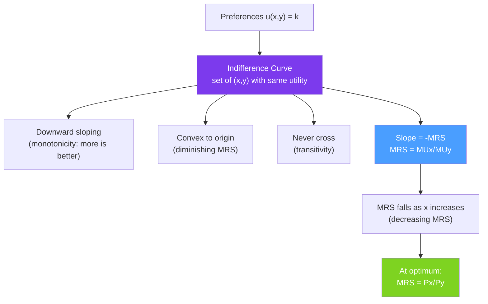

# 〰️ Indifference Curves

> [!abstract] TL;DR
> An **indifference curve** traces all bundles of goods that give a consumer the same utility. Curves are typically **downward-sloping** (you must give up some of one good to get more of another without losing utility) and **convex toward the origin** (you are willing to give up less of a good as you have less of it). The slope of an indifference curve is the **Marginal Rate of Substitution (MRS)**, measuring willingness to trade, which equals the price ratio at the optimum.

## Intuition — analogy FIRST

Imagine you are choosing between cups of coffee and hours of reading. Some days you'd happily trade 3 coffees for 1 extra hour of reading; other days (when you've already read all day and drunk no coffee) you'd barely trade 0.3 coffees for another reading hour. This changing willingness to trade is captured by the **convex shape** of indifference curves.

An indifference curve is literally a contour map of your preferences — like elevation contours on a topographic map. Moving northeast (more of both goods) gets you to a higher contour (higher utility). The shape of the contours tells you how willingly you trade one good for another.

---

## How It Works

## Key Concepts / Details

### Properties of Indifference Curves

**Property 1 — Downward sloping**: If both goods are "goods" (desirable), then getting more of one while staying on the same indifference curve requires giving up some of the other. The curve must slope downward.

**Property 2 — Higher curves are preferred**: Moving northeast in the commodity space increases utility → higher indifference curves represent higher utility (assuming monotone preferences).

**Property 3 — Cannot cross**: If two indifference curves crossed at a point $A$, then a point $B$ on curve 1 and a point $C$ on curve 2 would both be indifferent to $A$ — so $B \sim C$ — but since $B$ is on a lower curve than $C$, this contradicts transitivity.

**Property 4 — Convex to origin**: Reflects **diminishing marginal rate of substitution** — as you have more of $x$ and less of $y$, you become less willing to give up $y$ for additional $x$.

### The Marginal Rate of Substitution (MRS)

The MRS measures the consumer's **willingness to trade** good $y$ for good $x$ while remaining indifferent:

$$MRS_{xy} = -\frac{dy}{dx}\bigg|_{u=\bar{u}} = \frac{MU_x}{MU_y}$$

The MRS is the slope of the indifference curve (taken as a positive number). It represents the subjective rate of exchange — what the consumer is *willing* to accept, as opposed to what the market offers.

**Derivation**: Along an indifference curve, $du = 0$:
$$du = \frac{\partial u}{\partial x}dx + \frac{\partial u}{\partial y}dy = 0$$
$$\frac{dy}{dx} = -\frac{MU_x}{MU_y} \implies MRS_{xy} = \frac{MU_x}{MU_y}$$

### Special Preference Types

| Type | IC Shape | MRS | Utility function | Example |
|------|----------|-----|-----------------|---------|
| **Standard** | Smooth, convex curves | Diminishing | $u = x^\alpha y^\beta$ | Coffee and books |
| **Perfect substitutes** | Straight lines | Constant | $u = ax + by$ | Two brands of the same water |
| **Perfect complements** | L-shaped (right angles) | 0 or $\infty$ | $u = \min(ax, by)$ | Left shoe and right shoe |
| **Neutral good** | Vertical lines | 0 | $u = f(x)$ | Free brochures you ignore |
| **Economic bad** | Upward sloping ICs | Negative | $u = x - by$ | Chocolate and spinach (hate spinach) |
| **Satiation** | Closed curves | Varies | $u = -(x-a)^2 - (y-b)^2$ | "Too much of a good thing" |

### Convexity and the Averages Argument

The **convexity assumption** says: if $(x_1, y_1) \sim (x_2, y_2)$, then the average bundle $(\bar{x}, \bar{y}) = (tx_1 + (1-t)x_2, ty_1 + (1-t)y_2)$ for $0 < t < 1$ is at least as good:
$$u(\bar{x}, \bar{y}) \geq u(x_1, y_1)$$

**Economic interpretation**: Consumers like variety. A balanced bundle (some coffee, some books) is preferred to extremes (all coffee, no books). This drives the convex shape.

**Mathematical requirement**: Strict quasi-concavity of the utility function is sufficient for strictly convex ICs.

### Indifference Curves vs Isoquants

There is a precise mathematical analogy between consumer and producer theory:

| Consumer | Producer |
|---------|---------|
| Indifference curve $u(x,y) = \bar{u}$ | [[Production_Functions\|Isoquant]] $f(K,L) = \bar{q}$ |
| MRS$_{xy}$ | Marginal rate of technical substitution (MRTS$_{KL}$) |
| Convex ICs | Convex isoquants |
| Optimal: MRS = $P_x/P_y$ | Optimal: MRTS = $r/w$ (cost minimization) |

This duality is deep and runs through all of microeconomics.

---

## Real-World Notes

- **Netflix vs. Amazon Prime**: For many users, streaming services are close substitutes — nearly linear indifference curves. When Netflix raises prices, they substitute to Prime (high cross-price elasticity). The near-horizontal ICs for substitutes explain intense price competition.
- **Complementary goods marketing**: Companies sell printers cheaply and charge for ink cartridges, exploiting the L-shaped indifference curves between them. The printer is useless without cartridges — consumers are locked into the corner solution.
- **Environmental preferences**: Indifference curves between "consumption goods" and "environmental quality" are bowed — evidence that people treat them as ordinary substitutes, not extremes. This grounds cost-benefit analysis for environmental policy.
- **Work-leisure trade-off**: Labor supply curves are derived from indifference curves between consumption (enabled by work income) and leisure. When wages rise, the income effect can dominate the substitution effect, causing workers to work fewer hours — a backward-bending labor supply curve.

---

## Common Pitfalls

- **Drawing ICs that cross.** This is a logical error — it implies a bundle is simultaneously preferred and not preferred to another.
- **Confusing convex ICs with convex preferences.** Convex preferences → ICs convex to the origin. A concave utility function produces convex ICs, but the preferences are the primitive concept.
- **Forgetting MRS is not constant.** MRS changes as you move along an IC (decreasing, for a convex IC). The equal-MRS-to-price-ratio condition only holds at the *optimum* point, not everywhere.
- **Applying standard ICs to cases of non-convex preferences.** Addicts may have non-convex preferences (the 10th shot of espresso is more valuable than the first). Standard consumer theory breaks down.

---

## Related Concepts

- [[_MOC_Consumer_Theory|↑ Section MOC]]
- [[Utility_Theory]] — The utility function that generates the indifference curves.
- [[Budget_Constraint]] — The boundary of what the consumer can afford.
- [[Consumer_Optimization]] — Where the indifference curve is tangent to the budget line.
- [[Production_Functions]] — Isoquants are the producer theory analogue of indifference curves.
- [[Income_and_Substitution_Effects]] — How income and price changes shift the consumer to different ICs.

---

## Review Questions

1. Explain why indifference curves for ordinary goods cannot be upward-sloping. What assumption about preferences rules this out?
2. Draw indifference curves for: (a) perfect substitutes with $MRS = 2$, (b) perfect complements consumed in ratio $1:2$, (c) a good that is a "bad" paired with a good that is a "good." Label each carefully.
3. A consumer has utility $u = x^{0.4} y^{0.6}$. Compute the MRS at the bundle $(x=4, y=6)$. Interpret: if the price ratio $P_x/P_y = 2$, is this consumer optimizing? If not, in which direction should she adjust?

---

## Sources

- Varian, *Intermediate Microeconomics*, Ch. 3–4
- Mas-Colell, Whinston & Green, *Microeconomic Theory*, Ch. 3
- Samuelson, *Foundations of Economic Analysis* (mathematical treatment)

#microeconomics #economics #consumer-theory #indifferencecurves #MRS #preferences
