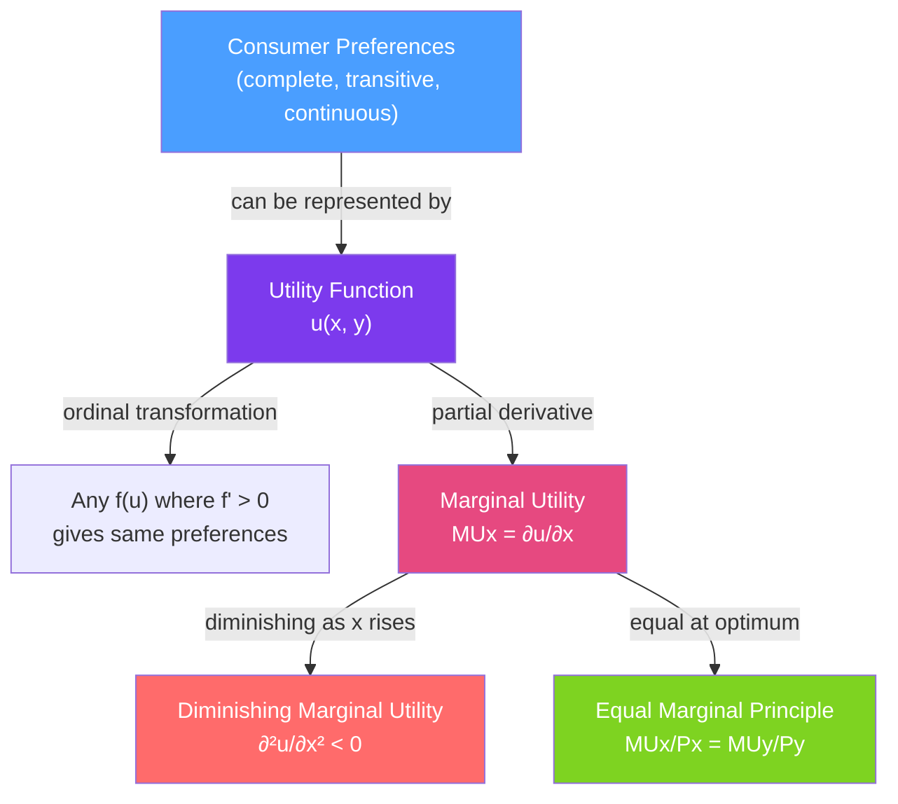

# 😊 Utility Theory

> [!abstract] TL;DR
> **Utility** is a numerical representation of a consumer's preferences — a higher number means a preferred bundle. Crucially, utility is **ordinal** (the ranking matters, not the numbers themselves), so any monotone transformation of a utility function represents the same preferences. The consumer's goal is to maximize utility. At the optimum, the **equal marginal principle** holds: $\frac{MU_x}{P_x} = \frac{MU_y}{P_y}$ — the last dollar spent on each good yields the same marginal utility.

## Intuition — analogy FIRST

Think of utility as a happiness score — but the actual score is meaningless. If I say eating sushi gives me utility 100 and pizza gives me 60, all that tells you is that I prefer sushi to pizza. It does NOT mean I'm 40% more satisfied, or that sushi is worth $40 more. Utility is like a ranking in a race: first, second, third. It tells you who won, not by how much.

This ordinal view has a practical implication: there is no way to compare utility across people ("my joy is bigger than yours"), and no natural unit of measurement. The utility number is a construct we use to derive predictions about behavior — not a welfare measure.

---

## How It Works

## Key Concepts / Details

### Preference Axioms

For a utility function to exist, preferences must satisfy:
1. **Completeness**: for any two bundles $A$ and $B$, the consumer can rank them: $A \succ B$, $B \succ A$, or $A \sim B$.
2. **Transitivity**: if $A \succ B$ and $B \succ C$, then $A \succ C$.
3. **Continuity**: small changes in bundles lead to small changes in preferences (no jumps).

Optional but standard: **monotonicity** (more is better) and **convexity** (averages are preferred to extremes).

### Ordinal vs Cardinal Utility

| Property | Ordinal | Cardinal |
|---------|---------|---------|
| **What it encodes** | Ranking only | Magnitude of satisfaction |
| **Transformations allowed** | Any monotone $f(u)$ | Only linear $f(u) = a + bu$ |
| **Interpersonal comparisons** | Impossible | Possible (in principle) |
| **Modern usage** | Standard in microeconomics | Welfare economics, expected utility |

**Monotone transformation theorem**: if $u(x,y)$ represents preferences, so does $v(x,y) = f(u(x,y))$ for any $f'> 0$. This means $u$ and $u^{0.5}$ and $\ln(u)$ all represent the same preferences and give the same demand.

### Marginal Utility

$$MU_x = \frac{\partial u}{\partial x}$$

Marginal utility is the additional utility from consuming one more unit of good $x$, holding all else constant.

**Diminishing Marginal Utility (DMU)**: 
$$\frac{\partial^2 u}{\partial x^2} < 0$$
The 5th slice of pizza adds less satisfaction than the 1st. This is why indifference curves are convex (see [[Indifference_Curves]]).

Note: DMU is not a theorem — it's an assumption. It is required for a unique interior optimum but doesn't always hold (think binge-watching Netflix: the 3rd episode may be more enjoyable than the 1st as you get invested).

### Common Utility Functions

| Utility Function | Form | Properties | Goods relationship |
|-----------------|------|------------|-------------------|
| **Cobb-Douglas** | $u = x^\alpha y^\beta$ | Smooth ICs, interior solution always | Normal complements |
| **Perfect substitutes** | $u = ax + by$ | Linear ICs | Consumer buys only one good |
| **Perfect complements** | $u = \min(ax, by)$ | L-shaped ICs | Always consumed in fixed ratio |
| **CES** | $u = (x^\rho + y^\rho)^{1/\rho}$ | Generalizes all above | Varies with $\rho$ |
| **Quasilinear** | $u = v(x) + y$ | Linear in $y$ | No income effect for $x$ |

### The Equal Marginal Principle

At the utility-maximizing bundle, the consumer allocates income so that the **last dollar spent on each good yields the same marginal utility**:

$$\frac{MU_x}{P_x} = \frac{MU_y}{P_y} = \lambda$$

where $\lambda$ is the **marginal utility of income** (how much utility rises if income increases by $1). It is the Lagrange multiplier in the constrained optimization.

**Why it must hold**: Suppose $MU_x/P_x > MU_y/P_y$. Then shifting one dollar from $y$ to $x$ increases utility. The consumer should keep shifting until equality holds.

**Practical example**: You have $100 to spend on coffee ($5/cup, MU = 20) and books ($20/book, MU = 60).
- $MU_{coffee}/P_{coffee} = 20/5 = 4$
- $MU_{books}/P_{books} = 60/20 = 3$
- Buy more coffee, fewer books, until the ratios equalize.

### Revealed Preference

Since utility is ordinal, we cannot observe it directly. But we can infer preferences from **choices**:
- If a consumer buys bundle $A$ when $B$ was also affordable, then $A \succcurlyeq B$ (revealed preference).
- The **weak axiom of revealed preference (WARP)**: if $A$ is revealed preferred to $B$, then $B$ cannot be revealed preferred to $A$.

Revealed preference theory grounds consumer theory in observable behavior rather than unobservable satisfaction.

---

## Real-World Notes

- **Behavioral economics challenges**: Loss aversion (Kahneman & Tversky) suggests consumers do not have a stable utility function — the same outcome is valued differently depending on the reference point. This violates the standard axioms but is empirically robust.
- **Diminishing marginal utility and insurance**: The concavity of utility functions (from DMU over wealth) provides the economic rationale for insurance. A certain outcome is preferred to a gamble with the same expected value (risk aversion). See expected utility theory.
- **Welfare programs**: If DMU is real, transferring income from rich to poor increases total utility (the marginal utility of a dollar is higher for the poor). This is the utilitarian argument for redistribution.
- **Subscription fatigue**: Streaming services (Netflix, Spotify, gym memberships) are priced to capture consumers with inelastic preferences — where marginal utility remains high enough that users don't cancel even when viewing habits fall.

---

## Common Pitfalls

- **Treating utility numbers as meaningful.** Saying "utility 100 is twice as good as utility 50" is a category error for ordinal utility.
- **Assuming diminishing marginal utility always holds.** For goods with network effects or habit formation, MU can be increasing initially.
- **Confusing utility maximization with happiness.** Utility is a model; it represents revealed preferences, not psychological well-being. These come apart (addiction, present bias).
- **Forgetting the equal marginal principle applies to ALL goods.** It's not just about two goods — in a world with $n$ goods, the optimum requires $MU_i/P_i = \lambda$ for all $i$.

---

## Related Concepts

- [[_MOC_Consumer_Theory|↑ Section MOC]]
- [[Indifference_Curves]] — The geometric representation of utility functions.
- [[Budget_Constraint]] — The feasibility constraint that bounds the utility maximization.
- [[Consumer_Optimization]] — The formal optimization that uses utility theory.
- [[Income_and_Substitution_Effects]] — How utility functions determine responses to price changes.
- [[Scarcity_and_Opportunity_Cost]] — Utility maximization is the formal theory of optimal choice under scarcity.

---

## Review Questions

1. Show that $u(x,y) = x^2 y^2$ and $v(x,y) = \ln x + \ln y$ represent the same preferences. What demand functions does each generate?
2. A consumer has utility $u = xy$ and income $m = 100$. Prices are $P_x = 2, P_y = 5$. Use the equal marginal principle to find the optimal bundle.
3. Critique this statement: "Economists assume people always try to maximize their happiness, but we know people often make irrational choices." What exactly is assumed, and what does "rational" mean in this context?

---

## Sources

- Varian, *Intermediate Microeconomics*, Ch. 3–4
- Mas-Colell, Whinston & Green, *Microeconomic Theory*, Ch. 3
- Kahneman, *Thinking, Fast and Slow* (behavioral critique)

#microeconomics #economics #consumer-theory #utility #marginalutility #ordinal
