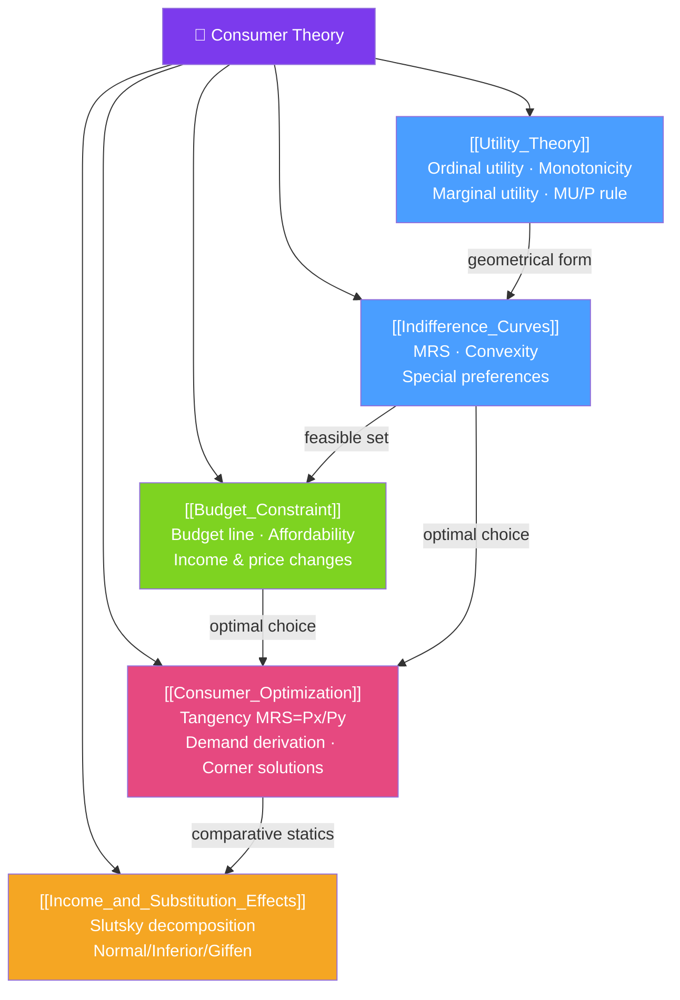

# 🛒 Consumer Theory — Map of Content

> [!abstract] What This Section Covers
> Consumer theory provides the micro-foundations of the demand curve. It models a rational agent who has **preferences** over bundles of goods (captured by **utility** and **indifference curves**), faces a **budget constraint**, and chooses the bundle that **maximizes utility** subject to that constraint. The optimum is characterized by the tangency condition $MRS = $ price ratio. When prices or income change, demand changes via **substitution** and **income effects** (the Slutsky decomposition). This section also derives the demand curve from first principles.

## Concept Map

## Learning Path

1. [[Utility_Theory]] — What utility is and isn't; ordinal vs cardinal; marginal utility and the equal marginal principle.
2. [[Indifference_Curves]] — The geometric representation of preferences; MRS; why curves are convex.
3. [[Budget_Constraint]] — What the consumer can afford; budget line equation; how income and price changes shift it.
4. [[Consumer_Optimization]] — Tangency condition (MRS = price ratio); deriving demand; corner solutions.
5. [[Income_and_Substitution_Effects]] — Slutsky decomposition; normal, inferior, and Giffen goods; compensated demand.

## All Notes at a Glance

| Note | Difficulty | What You'll Learn |
|------|------------|-------------------|
| [[Utility_Theory]] | Beginner | Ordinal utility, monotone transformations, MU, diminishing MU, equal marginal principle (MU/P) |
| [[Indifference_Curves]] | Beginner | IC properties, MRS definition and formula, perfect substitutes/complements, convexity |
| [[Budget_Constraint]] | Beginner | Budget line equation, affordability set, effect of income and price changes on budget line |
| [[Consumer_Optimization]] | Intermediate | Interior tangency, MRS = Px/Py, demand functions, corner solutions, kinked budget lines |
| [[Income_and_Substitution_Effects]] | Intermediate | Slutsky vs Hicks decomposition, normal/inferior/Giffen goods, compensated demand curve |

## Key Questions This Section Answers

- What does it mean for a consumer to be rational? What assumptions does this require?
- Why are indifference curves downward-sloping and (usually) convex?
- How does the marginal rate of substitution relate to relative prices at the optimum?
- Why does the consumer buy more of a good when its price falls? (Two effects.)
- What is the difference between a normal, inferior, and Giffen good?
- How do we derive the demand curve from utility maximization?

## Related Sections

- [[_MOC_Microeconomics_Master|↑ Microeconomics Master MOC]]
- [[_MOC_Foundations|← Foundations]]
- [[_MOC_Producer_Theory|→ Producer Theory]] (producer theory mirrors consumer theory)
- [[_MOC_Welfare_Externalities|→ Welfare & Externalities]]

#MOC #microeconomics #consumer-theory
