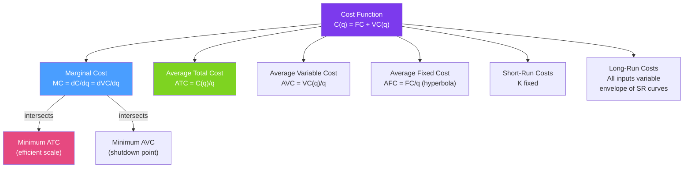

# 💸 Cost Functions

> [!abstract] TL;DR
> The **cost function** $C(q)$ gives the minimum cost of producing output $q$. It decomposes into **fixed costs (FC)** (don't vary with output) and **variable costs (VC)**. The **marginal cost** $MC = dC/dq$ is the extra cost of one more unit and drives the supply decision. The **average cost** $AC = C/q$ is U-shaped: FC spread thin at first, then DMR dominates. The firm's long-run supply curve is its $MC$ above minimum $AC$.

## Intuition — analogy FIRST

Think of running a food truck. Your fixed costs are the truck payment and insurance — you owe them whether you sell 0 tacos or 1,000. Variable costs (ingredients, propane, labor) rise with output. The **marginal cost** is the cost of making the 501st taco — mostly just the ingredients.

Initially, each additional taco becomes cheaper as you get into a rhythm (spreading fixed setup costs and learning). But eventually, you're at peak capacity — the kitchen is jammed, you need a second fryer, overtime labor kicks in. Marginal cost rises. The U-shaped average cost curve is the visual signature of this cost structure.

---

## How It Works

## Key Concepts / Details

### Cost Decomposition

$$C(q) = FC + VC(q)$$

| Cost | Symbol | Definition | Changes with $q$? |
|------|--------|-----------|------------------|
| **Fixed Cost** | FC | Costs independent of output | No |
| **Variable Cost** | VC | Costs that depend on output | Yes |
| **Total Cost** | TC = $C$ | FC + VC | Yes |
| **Marginal Cost** | MC | $dC/dq = dVC/dq$ | Yes (dFC/dq = 0) |
| **Average Total Cost** | ATC | $C(q)/q$ | Yes |
| **Average Variable Cost** | AVC | $VC(q)/q$ | Yes |
| **Average Fixed Cost** | AFC | $FC/q$ | Yes (declining hyperbola) |

Note: $ATC = AVC + AFC$.

### Marginal-Average Relationship

A fundamental calculus result: **the marginal cost curve crosses the average cost curve at the AC's minimum**.

$$\frac{d(ATC)}{dq} = \frac{d(C/q)}{dq} = \frac{MC - ATC}{q}$$

- If $MC < ATC$: ATC is falling (the new unit is cheaper than the average, pulling it down).
- If $MC > ATC$: ATC is rising.
- If $MC = ATC$: ATC is at its minimum.

Same logic applies to AVC: MC crosses AVC at AVC's minimum.

This implies: **MC always passes through the minimum of AVC and ATC from below.**

### Shape of Cost Curves

**Short-run MC**: Initially falls (due to specialization and coordination gains), then rises (due to diminishing marginal returns — each additional unit of the variable input adds less output, so cost per unit rises).

**Short-run ATC**: U-shaped. Falls initially because AFC declines sharply. Eventually rises as rising MC pulls ATC up.

**Long-run ATC (LRAC)**: The **envelope** of all short-run ATC curves — for each output level, the LRAC picks the optimal plant size. The LRAC is smoother than short-run ATCs.

### Sunk Costs vs Fixed Costs

| | Sunk Cost | Fixed Cost |
|--|----------|-----------|
| **Recoverable?** | No | Not in short run; yes in long run |
| **Relevant to decisions?** | Never (bygone) | Not for short-run output; yes for long-run entry/exit |
| **Example** | R&D already spent | Lease payment (escapable in long run) |

**Sunk cost fallacy**: Considering sunk costs in current decisions. Economically incorrect — only future costs matter.

### Short-Run vs Long-Run Costs

In the **short run**, capital $K$ is fixed:
$$C^{SR}(q, \bar{K}) = w \cdot L^*(q, \bar{K}) + r\bar{K}$$
where $L^*$ is the labor needed to produce $q$ given fixed $\bar{K}$.

In the **long run**, the firm optimizes over both inputs:
$$C^{LR}(q) = \min_{K,L} \{wL + rK : f(K,L) \geq q\}$$

**Envelope relationship**: $C^{LR}(q) \leq C^{SR}(q, \bar{K})$ for all $q$ (the long-run is always at least as cheap). They are equal at the output level for which $\bar{K}$ is the optimal capital stock.

**Long-run cost derivation (Cobb-Douglas)**: For $q = K^\alpha L^\beta$:
$$C^{LR}(q) = q^{1/(\alpha+\beta)} \cdot \left(\frac{w}{\beta}\right)^{\beta/(\alpha+\beta)} \left(\frac{r}{\alpha}\right)^{\alpha/(\alpha+\beta)} \cdot (\alpha+\beta)$$
If $\alpha + \beta = 1$ (CRS): $MC^{LR} = AC^{LR} = $ constant (flat LRAC).

### The Cost Function and the Expenditure Function

The long-run cost function is structurally identical to the consumer's expenditure function (from [[Consumer_Optimization]]):

| Consumer | Producer |
|---------|---------|
| $E(P_x, P_y, \bar{u}) = \min P_x x + P_y y$ s.t. $u(x,y) = \bar{u}$ | $C(w, r, q) = \min wL + rK$ s.t. $f(K,L) = q$ |
| Hicksian demand via Shephard's lemma | Conditional factor demand via Shephard's lemma |

---

## Real-World Notes

- **Airlines and fixed costs**: Aircraft ownership (or leases) is a massive fixed cost. Marginal cost per additional passenger on a flight with empty seats is nearly zero (a meal and some fuel). This creates strong incentives for last-minute discounting — filling those seats at prices above marginal cost.
- **Software marginal cost**: Once software is written, the marginal cost of one more download is near zero. This makes software pricing a pure MC = 0 problem, leading to subscription models, freemium, and bundling rather than per-unit pricing.
- **Pharmaceutical R&D**: Drug development (sunk cost) is enormous; manufacturing cost (variable cost) is often low. The price that covers variable cost is far below the price that recovers R&D — creating the "high drug price" problem that is entirely consistent with cost theory.
- **Tesla and battery cost curves**: Battery cost has fallen from ~$1,000/kWh in 2010 to ~$100/kWh in 2023. This is a downward shift of the variable cost function, lowering MC of EVs and enabling competitive pricing against ICE vehicles.

---

## Common Pitfalls

- **Ignoring fixed costs in short-run decisions.** Fixed costs are irrelevant for short-run output decisions (sunk in the short run). Only variable costs (specifically MC vs. price) determine short-run optimal output.
- **Confusing ATC minimum with the "right" output.** The minimum ATC is not necessarily the profit-maximizing output. The profit-maximizing output is where $MR = MC$, which may be above or below minimum ATC.
- **Forgetting that MC = AVC at minimum AVC.** Students often draw MC through only ATC's minimum, forgetting it also passes through minimum AVC — the shutdown threshold.
- **Treating long-run and short-run costs as identical.** They differ because in the short run, a firm may be locked into too much or too little capital for the desired output level.

---

## Related Concepts

- [[_MOC_Producer_Theory|↑ Section MOC]]
- [[Production_Functions]] — The technological foundation that determines cost functions.
- [[Profit_Maximization]] — Uses the MC curve directly to determine optimal output.
- [[Returns_to_Scale]] — Determines whether LRAC is U-shaped, flat, or declining.
- [[Factor_Demand]] — Conditional factor demands come from Shephard's lemma on the cost function.
- [[Perfect_Competition]] — The competitive supply curve is the MC curve above min AVC.
- [[Monopoly]] — MC is still the key input to the monopolist's optimization.

---

## Review Questions

1. A firm has $C(q) = 100 + 4q + q^2$. Find $FC$, $VC$, $MC$, $ATC$, $AVC$, and $AFC$. At what output is ATC minimized? What is the minimum ATC?
2. In the short run, a firm faces fixed costs of $200 and variable cost $VC(q) = 3q^2$. In the long run, the optimal capital stock is chosen and $C^{LR}(q) = 6q^{1.5}$. For $q = 10$, compare $C^{SR}$ (at optimal $\bar{K}$ for $q=10$) and $C^{LR}$.
3. Airlines often sell last-minute tickets at very low prices, well below average total cost. Use cost theory to explain why this is rational and not "selling at a loss" in any economically meaningful sense.

---

## Sources

- Varian, *Intermediate Microeconomics*, Ch. 20–21
- Mas-Colell, Whinston & Green, *Microeconomic Theory*, Ch. 5
- Williamson, *Markets and Hierarchies* (transaction cost theory)

#microeconomics #economics #producer-theory #costfunctions #marginalcost #averagecost #fixedcosts
