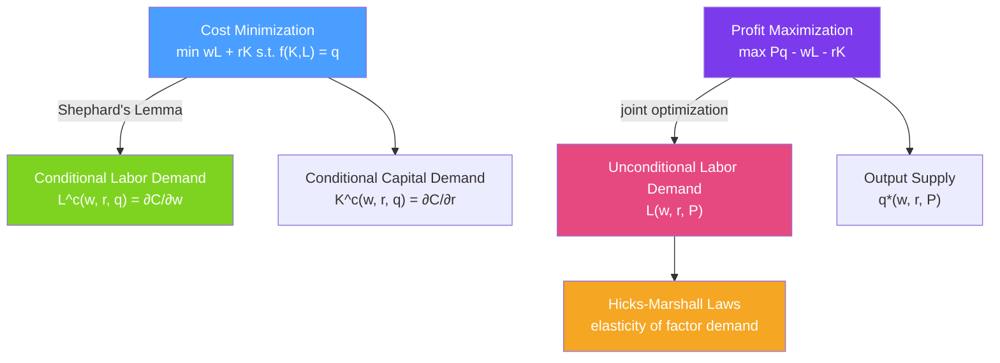

# 🔩 Factor Demand

> [!abstract] TL;DR
> **Factor demand** is derived demand — firms want labor and capital not for their own sake, but because they produce output that generates revenue. **Conditional factor demand** $L^c(w, r, q)$ minimizes cost for a given output level (Shephard's lemma: $L^c = \partial C / \partial w$). **Unconditional factor demand** $L(w, r, P)$ maximizes profit jointly over output and inputs. The **Hicks-Marshall laws** describe when factor demand is more elastic.

## Intuition — analogy FIRST

A bakery doesn't want bakers because they're fun to be around — it wants them because they produce bread that generates revenue. This is **derived demand**: the bakery's demand for bakers is derived from consumers' demand for bread. Raise the price of bread, and the bakery hires more bakers. This linkage between output markets and input markets runs through all of macroeconomics — wages, rents, and returns to capital are all determined in factor markets that are driven by product market demand.

---

## How It Works

## Key Concepts / Details

### Two Types of Factor Demand

**Conditional factor demand** $L^c(w, r, \bar{q})$:
- Minimize $wL + rK$ subject to $f(K,L) = \bar{q}$.
- Gives optimal inputs for *a given output level* — answers the cost-minimization problem.
- Derived via **Shephard's Lemma**: $L^c = \partial C(w, r, \bar{q}) / \partial w$.

**Unconditional factor demand** $L(w, r, P)$:
- Maximize $Pf(K,L) - wL - rK$ over all $(K, L)$ simultaneously.
- Gives optimal inputs when the firm also optimizes output — answers the full profit-maximization problem.
- Related: $L(w, r, P) = L^c(w, r, q^*(w, r, P))$ where $q^*$ is the profit-maximizing output.

### Shephard's Lemma and Cost Function Derivatives

From the cost function $C(w, r, q)$:
$$L^c(w, r, q) = \frac{\partial C(w, r, q)}{\partial w}, \quad K^c(w, r, q) = \frac{\partial C(w, r, q)}{\partial r}$$

**Properties of conditional factor demands**:
- **Decreasing in own factor price**: $\partial L^c / \partial w \leq 0$ (symmetry of the Hessian of C, which is positive semi-definite).
- **Homogeneous of degree zero in $(w, r)$**: doubling all input prices doesn't change the optimal input mix (it doubles costs proportionally).
- **Cross-factor relationship** (symmetry): $\partial L^c / \partial r = \partial K^c / \partial w$ — how labor demand responds to capital price equals how capital demand responds to wage.

### Elasticity of Factor Demand

The **own-price elasticity of labor demand**:
$$\varepsilon_{LL} = \frac{\partial \ln L}{\partial \ln w} = \frac{w}{L} \cdot \frac{\partial L}{\partial w} \leq 0$$

This is always non-positive (law of input demand).

**Decomposing unconditional factor demand elasticity**:
$$\varepsilon_{LL} = -s_L \sigma - (1 - s_L) \varepsilon_q^S$$

Where:
- $s_L = wL/C$ = labor's share of cost
- $\sigma$ = elasticity of substitution
- $\varepsilon_q^S$ = elasticity of output supply with respect to output price (demand-side)

The first term is the **substitution effect** (firm substitutes away from labor as $w$ rises).
The second term is the **output/scale effect** (higher $w$ raises costs → output falls → less labor needed).

### Hicks-Marshall Laws of Derived Demand

Four laws describing when factor demand is more **elastic**:

| Law | Statement | Intuition |
|-----|----------|-----------|
| **1. Substitutability** | Demand more elastic when inputs are easily substituted | If workers are easily replaced by machines, wage hikes have large labor-demand effects |
| **2. Essentialness** | Demand less elastic when input is essential to production | Pilots are essential to airlines; a wage hike has small employment effect |
| **3. Inelastic product demand** | Demand less elastic when product demand is inelastic | Inelastic product demand → cost increases passed through → small output reduction → small input reduction |
| **4. Input share** | Demand more elastic when input is a large share of costs | Labor is 70% of airline costs; a 10% wage hike is a 7% cost hike — big output and input effects |

### Value of Marginal Product

For a competitive firm, the optimal input rule equates the **value of the marginal product (VMP)** to the factor price:
$$VMP_L = P \cdot MP_L = w$$
$$VMP_K = P \cdot MP_K = r$$

The competitive firm's unconditional labor demand curve is thus $VMP_L$ as a function of $L$ — it slopes downward (due to DMR) and intersects the horizontal wage line at $L^*$.

### Monopsony in Input Markets

A **monopsony** is a single buyer of an input (e.g., a company town's employer). It faces an upward-sloping input supply curve and sets:
$$MFC_L = VMP_L$$
where $MFC_L > w$ is the marginal factor cost (must pay all workers more to attract the marginal worker).

Monopsony results in:
- Lower employment than competitive: $L^{mon} < L^{comp}$
- Lower wages: $w^{mon} < w^{comp}$
- A "monopsony wedge" (analogous to monopoly markup)

This is the basis for arguments that minimum wages can raise employment under monopsony.

---

## Real-World Notes

- **Automation (labor-capital substitution)**: When robot costs fall (i.e., $r$ falls), firms substitute capital for labor along the isoquant (substitution effect). Additionally, lower costs may expand output, increasing labor demand (scale effect). The net effect on employment depends on which effect dominates — and empirically varies by task type (routine vs non-routine).
- **Healthcare labor markets**: Hospitals in rural areas often exhibit monopsony power over nurses and physicians. Evidence suggests wages are suppressed relative to competitive levels, supporting the economic case for healthcare worker union bargaining.
- **Oil drilling and commodity prices**: When oil prices rise, $VMP_L$ for drilling workers rises → unconditional labor demand shifts right → wages and employment in the energy sector rise. This is derived demand in action — oil field workers benefit from oil price increases even though they don't set prices.
- **Offshoring**: When $w$ rises in the US relative to other countries, multinationals substitute foreign labor (offshore production). This is the substitution effect in factor demand at the global scale.

---

## Common Pitfalls

- **Confusing conditional and unconditional demand.** Conditional factor demand holds output fixed (cost minimization); unconditional demand optimizes output too. Using conditional demand for full profit analysis is wrong.
- **Ignoring the scale effect.** The wage effect on employment has two components: substitution (away from labor) and scale (less output → less of all inputs). Both go in the same direction for a wage increase — don't report only one.
- **Applying the VMP rule to non-competitive firms.** For a price-maker, the rule is $MRP_L = MR \cdot MP_L = w$ (marginal revenue product, not value of marginal product).
- **Assuming all labor markets are competitive.** Monopsony, efficiency wages, and search frictions all cause wages to deviate from VMP. Pure competitive analysis will overestimate labor demand responses.

---

## Related Concepts

- [[_MOC_Producer_Theory|↑ Section MOC]]
- [[Production_Functions]] — The technology determines marginal products and substitutability.
- [[Cost_Functions]] — Conditional factor demands come from Shephard's lemma on the cost function.
- [[Profit_Maximization]] — Unconditional factor demands come from the full profit maximization.
- [[Income_and_Substitution_Effects]] — Hicks-Marshall laws parallel the Slutsky decomposition in consumer theory.
- [[Market_Structures]] — Market power affects how $VMP_L$ maps to labor demand.

---

## Review Questions

1. A firm has cost function $C(w, r, q) = 2w^{0.5} r^{0.5} q$. Use Shephard's Lemma to find conditional labor demand $L^c(w, r, q)$. Verify that $wL^c + rK^c = C$.
2. A competitive firm's production function is $q = L^{0.5}$ (capital fixed). Output price is $P = 20$. Derive the $VMP_L$ curve and find the firm's optimal employment when $w = 5$.
3. Using the Hicks-Marshall laws, predict whether demand for long-haul truckers is more or less elastic than demand for specialized radiologists. Identify which law drives each comparison.

---

## Sources

- Varian, *Intermediate Microeconomics*, Ch. 22
- Mas-Colell, Whinston & Green, *Microeconomic Theory*, Ch. 5
- Hamermesh, *Labor Demand* (comprehensive empirical treatment)

#microeconomics #economics #producer-theory #factordemand #deriveddemand #hicksmarshall #shephardslemma
