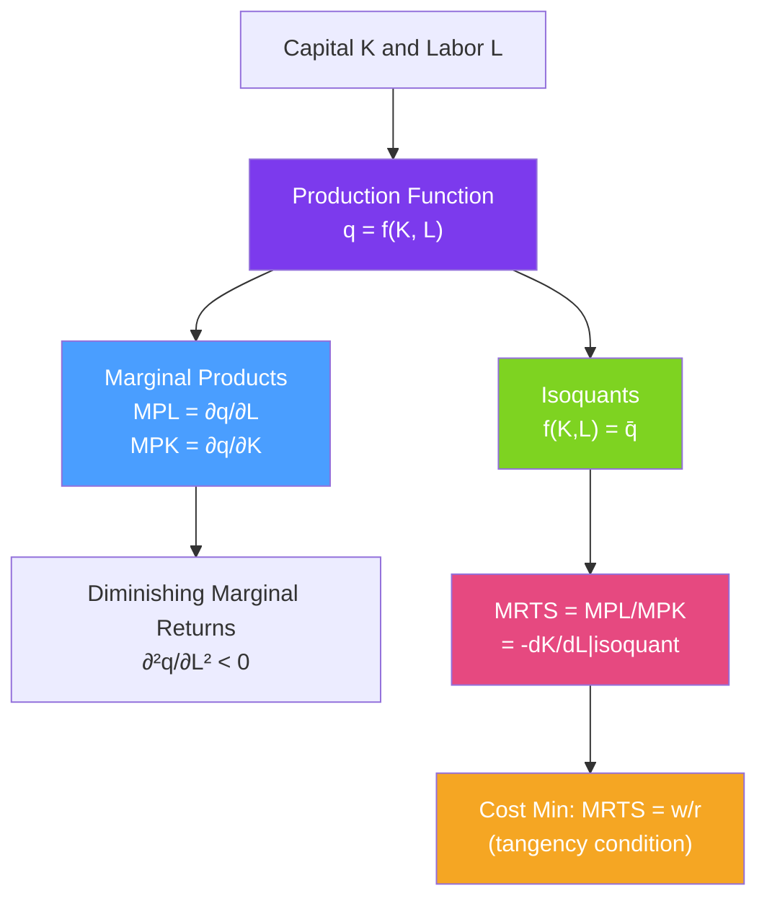

# ⚙️ Production Functions

> [!abstract] TL;DR
> A **production function** $q = f(K, L)$ describes the maximum output obtainable from combinations of capital ($K$) and labor ($L$). The **marginal product** ($MP_L = \partial q/\partial L$) measures output from the last worker. **Isoquants** (equal-output curves) are the producer analogue of indifference curves; their slope is the **Marginal Rate of Technical Substitution (MRTS) = $MP_L / MP_K$**. The optimal input mix sets $MRTS = w/r$ (wage-to-rental rate).

## Intuition — analogy FIRST

Think of a restaurant kitchen. The kitchen (capital) and cooks (labor) together produce meals (output). Add one more cook when you have 10 already — the kitchen gets crowded and the marginal cook adds fewer meals. This is **diminishing marginal product**. But add a second oven (capital) — now each cook is more productive. Inputs interact.

An **isoquant** is the kitchen's "recipe": all the combinations of cooks and ovens that produce exactly 100 meals. Some kitchens need 10 cooks and 2 ovens; others can do it with 6 cooks and 4 ovens. The **MRTS** tells you the rate at which you can swap cooks for ovens while staying on the same isoquant.

---

## How It Works

## Key Concepts / Details

### The Production Function

$$q = f(K, L)$$

**Assumptions** (standard):
- **Monotone**: More inputs produce at least as much output — $f_K, f_L \geq 0$.
- **Differentiable**: Smooth substitution between inputs.
- **Free disposal**: Extra inputs never reduce output.
- **No output without inputs**: $f(0, 0) = 0$.

**Short run vs Long run**:
- **Short run**: At least one input (usually capital $K$) is fixed. The firm can only vary labor.
- **Long run**: All inputs are variable. The firm can adjust any input.

### Marginal Product

$$MP_L = \frac{\partial q}{\partial L}, \quad MP_K = \frac{\partial q}{\partial K}$$

**Law of Diminishing Marginal Returns** (short run): Holding $K$ fixed, as $L$ increases, $MP_L$ eventually falls:
$$\frac{\partial^2 q}{\partial L^2} < 0 \quad \text{(for large enough } L)$$

**Average Product**: $AP_L = q/L$. The AP curve is maximized where $AP_L = MP_L$ — the marginal/average relationship.

### Common Production Functions

| Function | Form | Properties |
|----------|------|------------|
| **Cobb-Douglas** | $q = K^\alpha L^\beta$ | Smooth substitution; $MRTS = (\beta/\alpha)(K/L)$; RTS = $\alpha + \beta$ |
| **Perfect substitutes** | $q = aK + bL$ | Linear isoquants; constant MRTS = $b/a$ |
| **Leontief (fixed proportions)** | $q = \min(K/a, L/b)$ | L-shaped isoquants; no substitution |
| **CES** | $q = (K^\rho + L^\rho)^{1/\rho}$ | Constant elasticity of substitution $\sigma = 1/(1-\rho)$ |

### Isoquants and MRTS

**Isoquant**: the set of all $(K, L)$ combinations that produce exactly $\bar{q}$:
$$\{(K, L) : f(K, L) = \bar{q}\}$$

Properties of isoquants mirror those of indifference curves:
- **Downward sloping** (under monotonicity).
- **Convex to origin** (under diminishing MRTS).
- **Cannot cross**.

**Marginal Rate of Technical Substitution**:
$$MRTS_{LK} = -\frac{dK}{dL}\bigg|_{q=\bar{q}} = \frac{MP_L}{MP_K}$$

MRTS is the rate at which capital can be replaced by labor while holding output constant — the productive analogue of the MRS.

### Cost-Minimizing Input Mix

Given wages $w$ (price of labor) and rental rate $r$ (price of capital), the firm minimizes cost $wL + rK$ subject to $f(K,L) = q$:

**Tangency condition**:
$$MRTS_{LK} = \frac{w}{r} \implies \frac{MP_L}{MP_K} = \frac{w}{r} \implies \frac{MP_L}{w} = \frac{MP_K}{r}$$

The firm equates "output per dollar" across all inputs — the producer's equal marginal principle.

### Elasticity of Substitution

The **elasticity of substitution** $\sigma$ measures how easily inputs can be substituted:
$$\sigma = \frac{d\ln(K/L)}{d\ln(MRTS)} = \frac{\%\Delta(K/L)}{\%\Delta MRTS}$$

| Production function | $\sigma$ |
|--------------------|---------|
| Perfect substitutes | $\infty$ |
| Cobb-Douglas | 1 |
| Leontief | 0 |
| CES | $1/(1-\rho)$ |

A high $\sigma$ means inputs are easily substitutable; a low $\sigma$ means they must be used in roughly fixed proportions.

---

## Real-World Notes

- **Automation and labor**: When $w/r$ rises (labor becomes relatively more expensive), cost-minimization pushes firms toward higher $K/L$ ratios — they substitute capital for labor. This is exactly the economic logic behind automation. The elasticity of substitution determines how much substitution occurs.
- **Agricultural Green Revolution**: New seed varieties (a technology shift — outward shift of the production function) increased $MP_L$ and $MP_K$ for a given input combination, allowing the same labor and land to produce more food.
- **Software firms**: Nearly all inputs are labor (engineers). Capital (servers) has a high substitution elasticity with cloud services. MRTS in software firms is very high — a few more engineers can substitute for a large capital investment.
- **Cobb-Douglas in empirical work**: Empirical estimates of production functions frequently use the Cobb-Douglas form. Capital's share ($\alpha$) and labor's share ($\beta$) are estimated from income shares in national accounts — a key link between theory and data.

---

## Common Pitfalls

- **Confusing marginal product with average product.** $MP_L$ is the output from the *last* unit of labor; $AP_L = q/L$ is output *per* unit. They are equal only at the AP maximum.
- **Applying DMR to the long run.** Diminishing marginal returns is a short-run concept (one input fixed). In the long run, all inputs adjust — returns to scale is the relevant concept.
- **Treating Cobb-Douglas as the universal production function.** It's convenient and tractable, but imposes unit elasticity of substitution, which may not hold empirically.
- **Confusing the production function shift with a movement along it.** A technology improvement shifts the entire function up; hiring more labor is a movement along the existing function.

---

## Related Concepts

- [[_MOC_Producer_Theory|↑ Section MOC]]
- [[Cost_Functions]] — The production function determines the cost function through cost minimization.
- [[Returns_to_Scale]] — The long-run scale properties of the production function.
- [[Factor_Demand]] — The optimal input choices derived from the production function.
- [[Indifference_Curves]] — Exact duality: isoquants are to production what ICs are to consumption.
- [[Profit_Maximization]] — Uses the production function to determine optimal output.

---

## Review Questions

1. A firm has production function $q = K^{0.3} L^{0.7}$. Find $MP_L$, $MP_K$, and $MRTS$ as functions of $K$ and $L$. If $w = 3$ and $r = 1$, what is the cost-minimizing $K/L$ ratio?
2. Show that for a Cobb-Douglas production function, the elasticity of substitution equals 1. (Hint: compute $d\ln(K/L)/d\ln(MRTS)$.)
3. A firm currently employs workers at $w = \$20/hour$ and the $MP_L = 10$ units/hour. Capital rents at $r = \$50/hour$ and $MP_K = 30$ units/hour. Is the firm minimizing cost? If not, in which direction should it adjust the input mix?

---

## Sources

- Varian, *Intermediate Microeconomics*, Ch. 18–19
- Mas-Colell, Whinston & Green, *Microeconomic Theory*, Ch. 5
- Cobb & Douglas (1928), "A Theory of Production," *American Economic Review*

#microeconomics #economics #producer-theory #productionfunctions #isoquants #MRTS #marginalproduct
