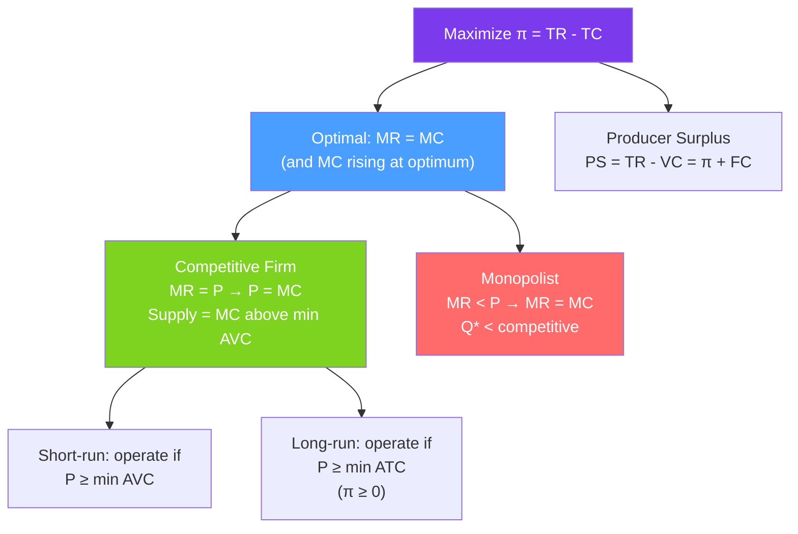

# 📈 Profit Maximization

> [!abstract] TL;DR
> A profit-maximizing firm chooses output $q^*$ where **marginal revenue equals marginal cost** ($MR = MC$), provided price exceeds the minimum average variable cost (short-run) or average total cost (long-run). **Profit** $= \pi = TR - TC = (P - AC) \cdot q$. For a **price-taking (competitive) firm**, $MR = P$, so the rule simplifies to $P = MC$. The **supply curve** is the MC curve above minimum AVC.

## Intuition — analogy FIRST

Running a sandwich shop: should you make the 200th sandwich today? If selling it brings in $8 (marginal revenue) but costs $6 to make (marginal cost), yes — you're $2 better off. If the 300th sandwich brings $8 but costs $10, don't make it — you'd lose $2. Keep making sandwiches until the 251st, where revenue exactly equals cost. That's the MR = MC optimum.

Now, should you open tomorrow at all? If your lease is $1,000/day but you'd only earn $800 in revenue, it seems like a loss. But if variable costs are only $600, you still recover $200 of fixed costs. In the short run, you stay open as long as $P > AVC$ — every dollar above variable cost reduces your fixed-cost loss. Only in the long run, when the lease comes up, do you exit if $P < ATC$.

---

## How It Works

## Key Concepts / Details

### The Profit Function

$$\pi(q) = TR(q) - TC(q) = P(q) \cdot q - C(q)$$

For a **price-taking firm** (competitive), $P$ is given (constant), so $TR = Pq$ and:
$$\pi(q) = Pq - C(q)$$

**First-order condition** (maximize over $q$):
$$\frac{d\pi}{dq} = P - MC(q) = 0 \implies P = MC(q^*)$$

**Second-order condition** (must be a maximum, not minimum):
$$\frac{d^2\pi}{dq^2} = -MC'(q) < 0 \implies MC'(q^*) > 0$$

The MC must be **rising** at the optimum. The firm operates on the upward-sloping portion of its MC curve.

### General Case: $MR = MC$

For a non-price-taking firm, price is a function of quantity:
$$TR = P(q) \cdot q$$
$$MR = \frac{d(TR)}{dq} = P + q \frac{dP}{dq}$$

Since $dP/dq < 0$ (downward-sloping demand), $MR < P$ for any firm with market power.

**Lerner Index** of market power:
$$\frac{P - MC}{P} = -\frac{1}{\varepsilon_D}$$

At the MR = MC optimum, the markup over MC is inversely proportional to the price elasticity of demand. More elastic demand → less markup. See [[Monopoly]].

### Short-Run Supply and Shutdown

In the **short run**, fixed costs are sunk. The firm shuts down if it cannot cover variable costs:
$$\text{Operate if } P \geq \min AVC$$
$$\text{Shut down if } P < \min AVC$$

**Why?** If $P \geq AVC$, producing generates revenue that covers variable costs and partially offsets fixed costs. If $P < AVC$, producing loses money on every unit plus still owes fixed costs — better to shut down and just pay fixed costs.

**Short-run supply curve** = MC curve for $P \geq \min AVC$; zero for $P < \min AVC$.

### Long-Run Supply and Exit

In the **long run**, all costs are variable. Fixed costs are escapable (lease expires, equipment can be sold). The firm exits if it earns non-positive profit:
$$\text{Stay in market if } P \geq \min ATC \text{ (zero profit or better)}$$
$$\text{Exit if } P < \min ATC \text{ (negative profit)}$$

**Zero-profit condition** at long-run competitive equilibrium:
$$P = \min ATC \implies \pi = (P - ATC) \cdot q = 0$$

This is why perfect competition drives economic profit to zero in the long run.

### Producer Surplus

**Producer surplus** = revenue minus variable costs = $\pi + FC$:
$$PS = TR - VC = \pi + FC$$

On a supply-and-demand diagram, PS = area above the supply curve and below the equilibrium price.

**Why is PS different from profit?** In the short run, fixed costs are paid regardless — PS measures the gain from *producing* versus not producing (it ignores fixed costs). Profit measures the gain from being in the market at all.

### Hotelling's Lemma (again)

From the profit function $\pi^*(P, w, r) = \max_q \{Pq - C(w, r, q)\}$:
$$\frac{\partial \pi^*}{\partial P} = q^* \quad \text{(output supply)}$$
$$\frac{\partial \pi^*}{\partial w} = -L^* \quad \text{(labor demand)}$$
$$\frac{\partial \pi^*}{\partial r} = -K^* \quad \text{(capital demand)}$$

Supply and factor demands are envelope derivatives of the profit function. See [[Comparative_Statics]].

---

## Real-World Notes

- **Airline capacity decisions**: Airlines constantly apply $P = MC$ logic at the margin. A flight is already scheduled (fixed cost sunk). Each additional passenger has near-zero variable cost. Discounting empty seats at the last minute is exactly the shutdown logic — any price above variable cost is profitable.
- **Oil production and shutdown**: In 2016, oil prices fell below many wells' average variable cost (pumping + transportation). Those wells shut down. Higher-cost producers exited; lower-cost producers (Saudi Aramco, Texas shale) continued — illustrating the supply curve's structure.
- **Startup losses**: Many startups report losses for years. This is rational if $P > AVC$ (they're covering variable costs and working toward long-run viability) or if they expect future prices above ATC once scale is achieved. Venture capital finances the gap.
- **The zero-profit paradox**: Perfect competition drives profits to zero, yet real firms earn positive profits. The resolution is that real markets have barriers to entry, differentiated products, or temporary advantages — departures from perfect competition analyzed in [[Market_Structures]].

---

## Common Pitfalls

- **Ignoring the second-order condition.** The FOC $P = MC$ is satisfied at both the profit-maximizing quantity (rising MC) and a profit-minimizing quantity (falling MC). Always verify MC is rising.
- **Confusing accounting profit with economic profit.** Accounting profit doesn't include opportunity cost of capital and the owner's time. Economic profit (which should be zero in long-run competitive equilibrium) subtracts all opportunity costs.
- **Applying the long-run zero-profit result to the short run.** In the short run, fixed costs are sunk, so positive economic profit can persist. Long-run zero-profit requires entry and exit to be free.
- **Thinking "sell at price > MC" is always profitable.** Even if $P > MC$, you can lose money if fixed costs are large. The correct short-run rule is $P > AVC$; the long-run rule is $P > ATC$.

---

## Related Concepts

- [[_MOC_Producer_Theory|↑ Section MOC]]
- [[Cost_Functions]] — Cost structure determines where MC = MR holds.
- [[Production_Functions]] — Technical underpinning of the cost structure.
- [[Perfect_Competition]] — Where $P = MC$ applies and zero-profit equilibrium is reached.
- [[Monopoly]] — Where $MR < P$ and the Lerner index captures market power.
- [[Consumer_Optimization]] — Duality: consumer maximizes utility; producer maximizes profit — symmetric optimization structures.
- [[Consumer_and_Producer_Surplus]] — Producer surplus is the area above the supply curve.

---

## Review Questions

1. A price-taking firm has $C(q) = 50 + 2q + 0.5q^2$. The market price is $P = 12$. Find the profit-maximizing output, total profit, and producer surplus. Should this firm operate in the short run? In the long run?
2. A firm faces inverse demand $P = 30 - 2Q$ and has $TC = 10 + 2Q + Q^2$. Find the profit-maximizing quantity, price, and profit using the $MR = MC$ condition.
3. Why does a competitive market's long-run equilibrium drive economic profit to zero? Does this mean that investors earn no return in the long run? Explain the distinction between economic and accounting profit.

---

## Sources

- Varian, *Intermediate Microeconomics*, Ch. 20–22
- Mas-Colell, Whinston & Green, *Microeconomic Theory*, Ch. 5
- Tirole, *The Theory of Industrial Organization*, Ch. 1

#microeconomics #economics #producer-theory #profitmaximization #MR_MC #supplycurve #producersurplus
